# README-TECH.md — Notia

> **Corrección vigente:** Las mutaciones financieras iniciadas en Telegram **NO se auto-confirman**. Requieren una única confirmación visible por mutación, persistencia y verificación nativa antes de informar éxito; Telegram no muestra una segunda confirmación reforzada.

## Regla técnica vigente: Rust como única capa de aplicación

`CLAUDE.md` establece como frontera obligatoria que toda lógica de aplicación reside en Rust: dominio, casos de uso, validaciones autoritativas, autorización, coordinación, persistencia, filesystem, integraciones y decisiones de plataforma. React queda limitado a renderizar, capturar interacciones, mantener estado efímero de presentación y llamar contratos tipados del backend. Toda operación que consulte, derive o modifique estado debe recibir del frontend una intención y sus datos mediante un contrato Rust explícito, y devolver datos, progreso o errores que la UI se limita a representar.

Hooks, servicios y stores TypeScript pueden coordinar únicamente comportamiento visual —por ejemplo, modales, selección, foco, carga y presentación de errores—. No deben contener reglas de negocio, validaciones autoritativas, transformaciones de dominio, acceso directo a persistencia o filesystem, coordinación funcional ni fallbacks que decidan resultados. Las validaciones visuales no sustituyen las de Rust. Al modificar un flujo existente, cualquier lógica funcional detectada en React o TypeScript debe migrarse a Rust; las excepciones admisibles son locales y puramente visuales, sin efecto sobre datos, permisos ni resultados.

Este cambio define la arquitectura exigida para el desarrollo, pero no migró código ni modificó comandos, DTO, persistencia, validaciones de ejecución o política de errores. Las secciones de este documento que describen lógica o fallbacks funcionales TypeScript continúan registrando el estado real heredado y señalan deuda técnica frente a esta frontera; no implican una excepción autorizada ni permiten afirmar que la migración completa ya terminó. La migración posterior de los flujos del runtime se describe en «Estado sincronizado de esta iteración: runtime de aplicación en Rust y correcciones del store de Task Manager».

### Validación y pendientes

- Se leyó y revisó el bloque «Frontera obligatoria entre Rust y React» agregado a `CLAUDE.md`.
- `git diff --no-index --check -- NUL CLAUDE.md`: aprobado; únicamente informó el warning de conversión LF/CRLF.
- No se ejecutaron tests ni builds porque la intervención solo cambia reglas y documentación.
- Queda pendiente migrar y validar cada flujo heredado que aún conserve lógica funcional en React o TypeScript; cada migración deberá cubrir sus contratos Rust, errores, límites y regresiones en Windows y Android. No se verificó en esta iteración que el runtime completo funcione sin React/WebView ni que se hayan eliminado todos los fallbacks funcionales del frontend.

## Arquitectura vigente: backend Rust, hosts y transporte

Esta sección es la referencia vigente de cómo se conectan interfaz y backend. Las secciones «Estado sincronizado de esta iteración: separación backend/frontend — fase 1 … fase 5» registran cómo se llegó a este estado.

### Resumen

- **Backend:** todo corre en Rust.
  - `notia-backend-core` es el dominio puro.
  - `notia-app` tiene los casos de uso, el estado, los adaptadores de plataforma, el registro de comandos y el servidor.
  - Ninguno de los dos depende de Tauri.
- **Hosts:** tres procesos ejecutan ese mismo backend.
  - la ventana Tauri, en Windows y Android;
  - el servidor headless (`notia --headless`, Windows y Linux);
  - la publicación de Task Manager, dentro del proceso de escritorio.
- **Interfaz:** React es solo presentación. Habla con el backend únicamente por `src/services/transport`, que tiene tres implementaciones: local (Tauri), remota (HTTP + WebSocket) y publicada.

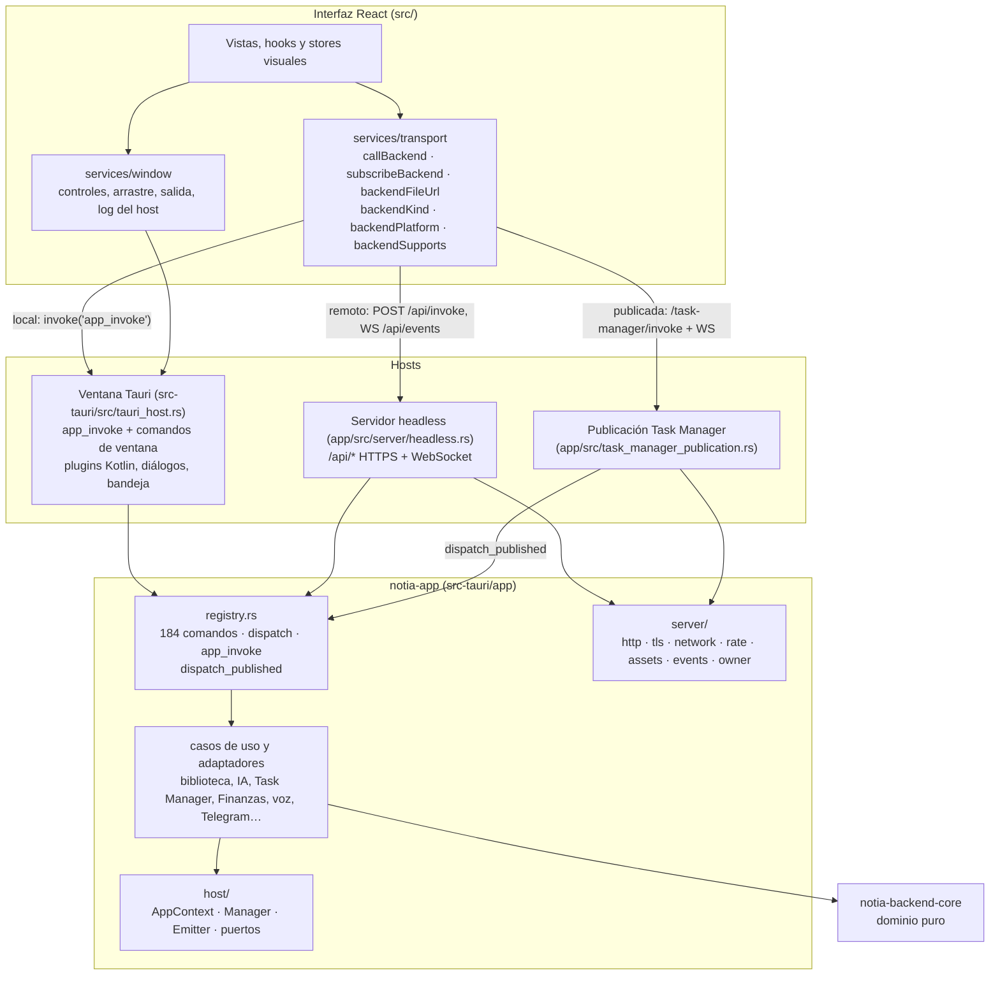

### Crates y responsabilidades

| Crate | Ruta | Responsabilidad | Depende de Tauri |
|---|---|---|---|
| `notia-backend-core` | `src-tauri/backend-core` | Dominio: protocolo, agente, prompts, tools, Task Manager, Finanzas, audio remoto, etc. | No |
| `notia-app` | `src-tauri/app` | Casos de uso, estado, adaptadores (filesystem desktop y SAF, SQLite, IA, voz, Telegram, Bluetooth), registro de comandos y servidor | No |
| `notia` | `src-tauri` (raíz del workspace) | Binario y host Tauri detrás de la feature `app` | Solo con `app` |

Dentro de `notia-app`, la capa `host/` reemplaza la API de Tauri que usaban los casos de uso:

| Pieza | Qué ofrece |
|---|---|
| `AppContext` | Alias `AppHandle`; es la aplicación en ejecución. |
| `Manager` | Estado por tipo, rutas (`AppPaths`: datos y recursos) y `app_handle`. |
| `Emitter` | Eventos, entregados por el puerto `EventSink`. |
| `Window` | Etiqueta del cliente que llama. |
| `async_runtime` | Tokio compartido con Tauri. |
| `plugin` | Ganchos de arranque y `PluginHandle` sobre el puerto `MobilePlugin`. |
| `ipc::Channel` | Canal que crea el host. |
| `dialog` | Selectores, por el puerto `DialogPort`. |
| `AssetResolver` | Archivos de la interfaz, por el puerto `AssetSource`. |
| `DataDirLock` | Bloqueo exclusivo de la carpeta de datos. |

Cada host construye la aplicación con `notia_app::create_app(paths, ports)` y ejecuta en orden `notia_app::startup_hooks()`:

1. registro de bibliotecas;
2. backups;
3. supervisor de Telegram;
4. autoinicio de la publicación;
5. base de datos;
6. plugins Android (puente de IA, continuidad, selector de carpetas y permiso de micrófono);
7. precarga de voz.

### Registro de comandos (`src-tauri/app/src/registry.rs`)

- `dispatch(app, window_label, command, args) -> Option<Dispatch>` enruta un comando del registro.
  - `Dispatch::Ready(reply)` corre en el hilo que llama; `Dispatch::Pending(future)` corresponde a los comandos `async`.
  - `reply` es `Result<Value, Value>`: el resultado o el error del caso de uso, serializados en JSON.
- `dispatch_app_invoke(app, window_label, body)` recibe `{ command, args }`.
  - Si `args` falta o es `null`, cuenta como `{}`.
  - Errores: `invalid app_invoke body: …` y `command X not found`.
- Los argumentos se leen de `args` con la clave camelCase del parámetro, igual que Tauri. Errores de argumentos:
  - `command X missing required key Y`;
  - `` invalid args `Y` for command `X`: … ``.
- El registro inyecta la aplicación, el estado del servicio (`State`) o la ventana que llama.
- `COMMAND_NAMES` enumera los comandos.
- `LOCAL_ONLY_COMMANDS` marca los que actúan sobre dispositivos del equipo que ejecuta Notia (micrófono, Bluetooth, selectores nativos). `is_remote_command` decide qué acepta el servidor headless.
- Un test comprueba que cada nombre tenga ruta y que los locales no sean remotos.
- `PUBLISHED_COMMANDS` enumera los comandos que alcanza la publicación de Task Manager. `dispatch_published(app, scope, command, args)` los ejecuta con el principal restringido `PublishedScope { library_id, library_user_id, board_ids }`: el usuario de la sesión publicada y los tableros publicados. Para otro comando devuelve `None`.

**Agregar un comando:**
1. Escribir la función en el módulo de `notia-app`. Si hay lógica pura, va en `backend-core`.
2. Agregar su ruta al `match` de `route`, una función de ruta con la misma forma que las demás y el nombre en `COMMAND_NAMES`.
3. Si usa hardware del equipo servidor, agregarlo a `LOCAL_ONLY_COMMANDS`.
4. Llamarlo desde TypeScript con `callBackend('nombre', { … })`.

No hay `#[tauri::command]` ni `generate_handler!` para comandos de la aplicación.

### Hosts y entradas

| Host | Entrada | Autenticación | Qué queda fuera del registro |
|---|---|---|---|
| Ventana Tauri (`tauri_host.rs`) | Comando único `app_invoke { command, args }` | Proceso local: el usuario del sistema es el dueño | `notia_log`, `window_control`, `exit_application`, `start_window_dragging`, `start_window_dragging_with_restore`; bandeja de Windows; plugins Kotlin; `tauri-plugin-dialog` |
| Servidor headless (`server/headless.rs`) | `POST /api/invoke` y WS `/api/events` | Contraseña del dueño y cookie de sesión | Comandos de `LOCAL_ONLY_COMMANDS` (responden 403) |
| Publicación de Task Manager | `/task-manager/invoke`, WS `/task-manager/ws` y streaming de IA | Usuario de biblioteca y tableros publicados | Todo salvo `PUBLISHED_COMMANDS`, que entran por `dispatch_published`; además atiende sus mensajes de protocolo (lotes, `hello`, streaming de IA) |

- **Ventana Tauri:** el plugin `notia-host` construye la aplicación y toma `DataDirLock`. Cada gancho de arranque se registra como plugin de Tauri con su nombre, así los plugins Kotlin conservan el nombre que esperan.
- **Headless:** usa la misma carpeta de datos que la app, con el mismo bloqueo.
- **Publicación:** comparte con el headless la infraestructura de red (`server/http`, `tls`, `network` y `rate`). Sus comandos entran al registro por `dispatch_published`; la publicación solo agrega sesión, lotes y difusión.

### Contrato del transporte en TypeScript (`src/services/transport/`)

```ts
type BackendKind = 'local' | 'remote' | 'published'
type BackendPlatform = 'windows' | 'linux' | 'android' | 'macos' | 'unknown'

interface BackendTransport {
  kind: BackendKind
  platform(): BackendPlatform
  call<T>(command: string, args?: Record<string, unknown>): Promise<T>
  subscribe<T>(event: string, handler: (payload: T) => void): Promise<Unsubscribe>
  fileUrl(path: string): string
  supports(command: string): boolean
}
```

- **Arranque:** `src/main.tsx` carga `App` si hay ventana nativa (`hasHostWindow()`). Si no, carga `components/remote/RemoteApp.tsx`:
  1. verifica `/api/health`;
  2. pide la contraseña si no hay sesión;
  3. lee `/api/capabilities`;
  4. instala el transporte remoto con `installBackendTransport`;
  5. recién entonces carga `App`.

  La página publicada instala su transporte en `publicTaskManager.tsx`.
- **Cuándo se lee el transporte:** algunos módulos lo leen al cargarse (el hook de dictado y el riel sin Meeting). Por eso `App` se carga después de instalarlo.
- **Rechazos de `call`:** el error del backend llega tal cual (objeto `{ code, message, … }` o texto), en los tres transportes. Los fallos del transporte (sin conexión, sesión vencida, 403, 429) llegan como `Error` con mensaje en español.
- **`supports`:** solo oculta o deshabilita lo que el backend no ofrece. La autoridad sigue en Rust.
- **`platform`:** decide funciones del backend (Backups y Publicar en Windows; sin Telegram en Android). El diseño de teléfono o escritorio sale de `getRuntimeDevice()`.
- **Regla de ESLint** (`no-restricted-imports`, nivel `error`): prohíbe `@tauri-apps/*` fuera de `src/services/transport/` y `src/services/window/`.

| Transporte | `call` | `subscribe` | `fileUrl` | `supports` |
|---|---|---|---|---|
| `tauriTransport` | `invoke('app_invoke', { command, args })` | `listen(event)`; el handler recibe el payload | `convertFileSrc`, con respaldo `file://` | Siempre verdadero |
| `createRemoteTransport` | `POST /api/invoke`; un 401 recarga la página hacia el ingreso | Un único WebSocket `/api/events`; reconecta a los 1 a 15 s con `?since=<última secuencia>` | `/api/file?path=…` | `capabilities.commands` |
| `createTaskManagerPublicationTransport` | Lecturas a `<ruta>/invoke`; mutaciones por el cliente WebSocket de la publicación | Sin eventos (llegan por ese cliente) | Ruta sin cambios | Siempre verdadero (autoriza el servidor) |

### Protocolo del servidor headless

Todas las respuestas llevan `Cache-Control: no-store`, `X-Content-Type-Options: nosniff`, `Referrer-Policy: no-referrer` y `Connection: close`. Las páginas HTML de la interfaz llevan además `Content-Security-Policy`. Todo `POST` exige `Origin: https://<host>`.

| Ruta | Sesión | Respuesta |
|---|---|---|
| `GET /api/health` | No | `{ "ok": true, "protocolVersion": 1 }` |
| `POST /api/auth/login` | No | `200 { ok }` con cookie · `401` contraseña incorrecta · `429` más de 30 intentos por minuto e IP |
| `POST /api/auth/logout` | Opcional | `200 { ok }` y cookie vencida |
| `GET /api/session` | Opcional | `{ "authenticated": bool }` |
| `GET /api/capabilities` | Sí | `{ protocolVersion, platform, commands, localOnlyCommands }` |
| `POST /api/invoke` | Sí | `200 { result }` · `400 { error }` (error del backend) · `403` comando local · `429` más de 600 por minuto y sesión |
| `GET /api/file?path=…` | Sí | Archivo de una biblioteca registrada (máx. 64 MB, `Content-Security-Policy: sandbox`) · `403` fuera de bibliotecas · `404` · `413` |
| `GET /api/events?since=N` (WebSocket) | Sí | `{ seq, event, payload }` por cada evento. Con `since`, primero los eventos posteriores que el servidor conserva (los últimos 512); si ya no están o `N` es de otra ejecución, `notia:events-lost`. Ping cada 30 s; se cierra al vencer la sesión |
| Otro `GET` | No | Archivos de `--static-dir`, con `index.html` como respaldo de la SPA; sin carpeta, un texto informativo |

Ingreso:

```http
POST /api/auth/login
Origin: https://192.168.0.8:52480
Content-Type: application/json

{ "password": "…" }
```

```http
HTTP/1.1 200 OK
Set-Cookie: notia_session=<64 hex>; HttpOnly; Secure; SameSite=Strict; Path=/; Max-Age=43200

{ "ok": true }
```

Comando:

```json
{ "command": "calendar_argentina_holidays", "args": { "year": 2026 } }
```

```json
{ "result": [ { "date": "2026-01-01", "name": "Año Nuevo", "kind": "national" } ] }
```

Error del backend (HTTP 400):

```json
{ "error": "command calendar_argentina_holidays missing required key year" }
```

Comando reservado al equipo servidor (HTTP 403):

```json
{ "error": "Esta operación solo está disponible en el equipo que ejecuta Notia." }
```

Evento por WebSocket:

```json
{ "seq": 1758671234567891, "event": "notia-library-tree-changed", "payload": { "watchedPath": "C:\\Notas", "changedPathHint": "C:\\Notas\\nueva.md" } }
```

Fragmento de dictado remoto (`speech_remote_audio`):

```json
{
  "command": "speech_remote_audio",
  "args": {
    "payload": {
      "chunk": {
        "sessionId": "0b6c2f0e-3c1a-4e55-9d0e-6a2b1f7f8e21",
        "sequence": 0,
        "encoding": "pcm-s16le",
        "sampleRate": 16000,
        "channels": 1,
        "last": false,
        "dataBase64": "AAAAAA…"
      }
    }
  }
}
```

- La respuesta es `{ "result": { "done": false, "text": null } }` hasta el fragmento `last: true`, que devuelve `{ "done": true, "text": "…" }` o el error del reconocedor.
- Los fragmentos van en orden desde 0, con un solo formato y hasta 256 KB cada uno.
- Frecuencias admitidas: 8, 16, 22,05, 44,1 o 48 kHz; el servidor lleva todo a 16 kHz.
- Una grabación dura como máximo 5 minutos y hay como máximo 4 abiertas.
- `speech_remote_audio_cancel { sessionId }` descarta una grabación.
- El reconocimiento funciona en Windows y Android. En Linux responde que no está disponible.

### Eventos del backend

Llegan por `subscribeBackend`: en la ventana por el `emit` de Tauri y en el navegador por `/api/events`.

| Evento | Emisor (`notia-app`) | Consumidor TypeScript |
|---|---|---|
| `notia:backend-event` | `backend_tauri.rs` (sobre versionado con secuencia por request) | `aiChatRuntime` |
| `ai-chat-interaction`, `ai-chat-title` | `ai_chat.rs` | `aiChatRuntime` |
| `multichat-event` | `multichat.rs` | `multichatRuntime` |
| `notia-library-tree-changed` | `filesystem/watch.rs` | `libraryTreeWatchRuntime` |
| `task-manager-changed`, `task-manager-publication-changed` | `task_manager_commands.rs`, `task_manager_publication.rs` | `useTaskManager` |
| `notia-task-manager-publication-ai-request` | `task_manager_publication.rs` | `useTaskManagerPublicationAiHostBridge` |
| `notia:routine-data-changed` | `routine_tools.rs` | `routineService` |
| `notia://telegram-library-changed` | `telegram_worker.rs` | `useTelegramLibraryChanges` |
| `speech://state`, `speech://partial`, `speech://segments` | `services/speech_service.rs` | `speechService` |
| `notia:events-lost` | `server/events.rs` (solo servidor headless, al reconectar) | `RemoteApp` (aviso con «Recargar») |
| `notia:request-app-exit` | Bandeja de Windows (host Tauri, no el backend) | `services/window` |

### Seguridad del servidor y de la carpeta de datos

- **Contraseña del dueño:**
  - se guarda como hash PBKDF2-HMAC-SHA256 con 210 000 iteraciones y sal aleatoria en `<datos>/headless-server/owner.json`;
  - se define con `--set-owner-password`, desde `NOTIA_OWNER_PASSWORD` o la entrada estándar;
  - debe tener entre 8 y 256 caracteres.
- **Sesiones:** token aleatorio de 32 bytes en cookie `HttpOnly; Secure; SameSite=Strict`, válido 12 horas. Hay como máximo 64; al llegar al límite se descarta la más antigua. El logout la invalida.
- **TLS:** certificado autofirmado (rcgen) en `<datos>/headless-server/tls`, para `localhost`, `127.0.0.1` y las IPv4 utilizables del equipo; se regenera si cambia su versión. Un pedido HTTP plano se redirige a HTTPS (308 para `GET`/`HEAD`, 426 para el resto) solo si el host es una IP o `localhost`.
- **Límites:**
  - 128 conexiones;
  - pedidos de hasta 32 MB, con lectura que vence a los 5 s;
  - mensajes del cliente por WebSocket de hasta 64 KB;
  - límites de pedidos por minuto en login e invoke.
- **Autorización:**
  - la sesión da acceso de dueño a los comandos remotos;
  - los comandos locales responden 403;
  - `/api/file` solo sirve rutas dentro de bibliotecas registradas (`contains_desktop_path` resuelve enlaces y `..`) y con `sandbox`, para que un SVG o HTML no ejecute scripts en ese origen.
- **Carpeta de datos:** `DataDirLock` usa `File::try_lock` sobre `<datos>/notia.lock`. Lo toman la ventana (Windows y Linux; en Android no aplica), el headless y `--add-library`.
  - El sistema lo libera aunque el proceso termine de golpe.
  - Si la carpeta está en uso, la ventana avisa «Notia ya está en uso» y se cierra, y el servidor termina con un mensaje.
- **Política de contenido:** la ventana usa la CSP de `tauri.conf.json` y el servidor agrega una equivalente a sus páginas, con `frame-ancestors 'none'`. Scripts y estilos admiten `'unsafe-inline'` (y los scripts `'unsafe-eval'`) por XGraph, Emotion y Mermaid; el resto de las directivas queda en el propio origen.
- **Logs:** no se registran contraseñas, tokens de sesión, URI SAF completas ni contenido de documentos.

### Plataformas

| Capacidad | Ventana Windows | Ventana Android | Headless Windows | Headless Linux | Navegador remoto |
|---|---|---|---|---|---|
| Registro de comandos | Sí (`app_invoke`) | Sí (`app_invoke`) | Sí (`/api/invoke`) | Sí | Cliente |
| Filesystem | Raíz canónica | SAF tree/document | Raíz canónica | Raíz canónica | Por el servidor |
| Alta de bibliotecas | Selector nativo | Selector SAF | `--add-library` | `--add-library` | No (se indica el comando) |
| IA (Ollama) | HTTP nativo | `AiBridgePlugin` | HTTP nativo | HTTP nativo | Por el servidor |
| Voz local y Meeting | Sí | Sí | No expuesto | No expuesto | No |
| Dictado remoto | — | — | Sí | No disponible (sin reconocedor) | Captura en el navegador |
| Telegram | Worker Rust | Worker Rust (se configura desde otro dispositivo) | Worker Rust | Worker Rust (sin transcripción de audios) | Por el servidor |
| Backups y publicación | Sí | No | Sí | No (código de Windows) | Por el servidor Windows |
| Bluetooth ColdPass | Sí (feature `bluetooth`) | No | No expuesto | No compilado | No |
| Bandeja y controles de ventana | Sí | No | No | No | No |

### Compilación y ejecución

```bash
# Interfaz y ventana (Windows/Android): igual que antes
npm run dev:tauri:windows
npm run dev:android

# Servidor headless desde el ejecutable de la app
notia --headless --set-owner-password
notia --headless --add-library "D:\Notas"
notia --headless --static-dir dist --bind 0.0.0.0:52480

# Binario solo servidor (Linux), desde src-tauri
cargo build --release --no-default-features
```

En Linux el binario solo servidor no necesita D-Bus ni WebKit. Si no hay un compilador C del sistema, sirve Zig como compilador y linker; la receta está en «cierre de pendientes».

`--resource-dir` indica dónde están los modelos de voz y los runtimes; por defecto, la carpeta del ejecutable. Sin `--static-dir`, se usa `dist/` junto al ejecutable si existe.

### Validaciones de referencia

| Comando | Qué valida |
|---|---|
| `cargo check --offline` (app) y `cargo check --offline --no-default-features` | Compilación desktop y solo servidor. |
| `cargo check --offline --target aarch64-linux-android` | Compilación Android, con las variables del NDK. |
| `cargo test --offline -p notia-app` y `cargo test --offline -p notia-backend-core` | Tests de Rust. `notia-app` ya no enlaza Tauri, así que sus tests corren en Windows. |
| `npx tsc --noEmit -p tsconfig.app.json`, `npx eslint src`, `npx vitest run` | Frontend. |

Estado al cierre de los pendientes de la separación:

| Suite | Resultado |
|---|---|
| `notia-app` | 299 aprobados con la feature `bluetooth` y 297 sin ella; 1 ignorado. En Linux, 249. |
| `notia-backend-core` | 230 aprobados (Windows y Linux). |
| vitest | 206 aprobados. |
| Warnings de `notia-app` | 44 en desktop, 63 en Android y 40 en el binario solo servidor; el host, 0. |

### Límites y trabajo pendiente

- **Pruebas manuales:** falta probar en Android real y en Chrome y Firefox, de escritorio y de teléfono. La interfaz remota se probó con Edge sin ventana contra servidores Windows y Linux.
- **Publicación y backups:** siguen siendo solo de Windows.
- **Dictado remoto:** no está disponible en Linux (no hay reconocedor).
- **Excepciones visuales de TypeScript:** las que quedan (editor Milkdown, lienzo InkMath, Mermaid, pdf.js, lista virtual y expansión del árbol) están listadas en «cierre de la fase 1».

## Estado sincronizado de esta iteración: rediseño del shell

Cambio solo de interfaz (Windows, Android y navegador); no toca comandos ni contratos del backend. Sigue el lienzo de diseño «Notia · Rediseño del sidebar», que es indicativo: el rail conserva todos los módulos reales.

- **Disposición**: `NotiaMenu` arma `.notia-workspace` como fila `[NotiaSidebar][.notia-main-column][NotiaRightPanel]`. El rail y el Explorador ocupan todo el alto; `WindowTitleBar` (pestañas y controles) vive dentro de `.notia-main-column`, encima del contenido. El arrastre de ventana sale de los espacios libres de esa barra.
- **Rail** (`IconRail`): botón **Explorador** (alterna `isSidebarOpen`, `aria-pressed`), los módulos de `LEFT_RAIL_GROUPS` (tres grupos con separador; `meeting` se filtra cuando el backend no soporta `start_speech_session`), y al pie **Ayuda** y **Configuración**. El módulo activo sale de `selectActiveRailActionId`, que ahora también reconoce Multichat. Tooltip CSS por `data-tip` solo con puntero fino y alto ≥ 641 px; en ventanas más bajas el rail se desplaza.
- **Explorador** (`NotiaSidebar`): encabezado «Archivos» con `TOP_TOOLBAR_ACTIONS` (nueva nota, diagrama, carpeta, colapsar, expandir), `ExplorerSearch` siempre visible (escribe `searchQuery`; `Esc` limpia) y `WorkspaceFooter` con el selector de librería. `isSearchMenuOpen` pasó a ser una solicitud de foco: `headerActionClick('search')` abre el panel y enfoca la búsqueda, que luego baja la bandera. Se retiraron el popup de búsqueda, `EXPLORER_HEADER_ACTIONS`, la acción de contexto `closeSearchMenu`, `selectActiveHeaderAction` y el componente sin uso `TopToolbar`.
- **Árbol** (`FileTree`): filas de 28 px (36 px con puntero grueso, igual que la lista virtual), sangría de 16 px por nivel con una guía de 1 px por ancestro (`treeRowStyle`), íconos en muted, fila activa en teal suave y carpetas ocultas (`.x`) en itálica.
- **Crear desde cualquier lado**: `explorerToolClick` abre el Explorador antes de crear, porque la fila de nombre pendiente vive en el árbol.
- **Atajos**: `useGlobalEventListeners` suma `Ctrl+N` (nueva nota en la raíz) y `Ctrl+O` (buscar archivo). La pantalla sin nota abierta usa las mismas acciones; antes sus botones no hacían nada. Su botón **Nuevo chat** (sin atajo) llama `railActionClick('chat')`, la misma acción del rail: activa la pestaña especial del chat, que se monta de nuevo y abre en el estado de chat nuevo.
- **Asistente** (`NotiaRightPanel`): encabezado propio con «Asistente» y cerrar; el panel es una columna flex. Los estilos de mensajes y composer se ajustan solo bajo `.notia-right-panel`, sin tocar la vista de Chat a pantalla completa.
- **Responsive**: ≤ 980 px el Explorador mide 240 px y el Asistente flota; ≤ 720 px se ocultan las pestañas (quedan los botones de paneles y tema) y el Explorador flota sobre el contenido junto al rail.
- **Tokens nuevos**: `--color-row-hover` y `--color-on-accent` en ambos temas; `--titlebar-height` pasa a 40 px. Se quitaron tokens de color por ícono que ya no se usaban.
- **Validación**: `tsc -p tsconfig.app.json`, ESLint, 217 tests de Vitest y `vite build` pasan. **Pendiente**: revisión visual en Windows, Android (teléfono y tableta) y navegador, en ambos temas.

## Estado sincronizado de esta iteración: separación backend/frontend — cierre de pendientes

Esta iteración cierra lo que había quedado pendiente al terminar la fase 6.

### Tests que fallaban

Los 15 fallos de `notia-app` y los 5 de `notia-backend-core` se corrigieron. Cada corrección se hizo en el código o en el test, según cuál de los dos describía mal el contrato vigente:

| Módulo | Corrección |
|---|---|
| `backend-core/coldpass.rs` | `upsert_coldpass_entry` rechaza una credencial sin nombre («La credencial necesita un nombre.»). |
| `backend-core/markdown_editing.rs` | El test sigue el contrato: una selección vacía aplica todos los cambios y un id de cambio desconocido es un error. |
| `backend-core/paths.rs`, `prompt.rs` | Los helpers de los tests usan el canal `Published` con la política `PublishedNoMemory`. |
| `backend-core/speech_text.rs` | `markdown_to_speech_text` quita los espacios finales de cada línea. |
| `filesystem/adapter.rs` | El test compara contra la raíz canónica (rutas `\\?\` en Windows). |
| `database.rs` | `migrate_to(connection, target)` permite probar una migración intermedia; `migrate` llama a `migrate_to(CURRENT_SCHEMA_VERSION)`. |
| `finance_reconciliation.rs` | El nombre de un servicio solo coincide como palabra completa («Internet» no coincide con «Internetshop»). |
| `services/ai_service.rs` | El test acepta `:443` y rechaza `:8443`, como hace la validación. |
| `finance.rs` | Los datos de demostración incluyen servicios, ocurrencias, versiones, facturas, auditorías, propuestas y decisiones (`INSERT OR IGNORE`); el test de auditoría de tarjeta usa su propia cuenta. |
| `task_manager_store.rs` | Un bloque `---` vacío sigue marcando un comentario heredado. |
| `task_manager_publication.rs` | Tests del p95 y del lote WebSocket inactivo ajustados al protocolo vigente (`operationId` por lote). |
| `user_auth.rs` | Vector de referencia PBKDF2 y rechazo de contraseñas cortas; el helper de formato se reemplazó por `parse_password_hash`. |
| `services/speech_service.rs` | `nearest_sentence_boundary` (solo de tests) ya no depende de la plataforma, así los tests compilan en Linux. |

### Publicación de Task Manager sobre el registro

- `registry.rs` define:
  - `PublishedScope { library_id, library_user_id, board_ids }`: el principal restringido de una sesión publicada;
  - `PUBLISHED_COMMANDS`: `task_manager_board_view`, `task_manager_board_execute`, `task_manager_read_ticket_source`, `task_manager_write_ticket_source` y `task_manager_pomodoro`;
  - `is_published_command` y `dispatch_published(app, scope, command, args)`, que ejecuta esos comandos con `task_manager_execute_for_publication` limitado al usuario y a los tableros del alcance. Para cualquier otro comando devuelve `None`.
- `execute_publication_invoke_unlocked` arma el alcance con el usuario de la sesión y los tableros publicados y llama a `dispatch_published`. Además de esos comandos solo atiende los mensajes de protocolo (lotes, `hello`, streaming de IA). Cualquier otro comando responde «La URL solo puede acceder a los tableros publicados.».
- Se eliminó el despacho propio de la publicación:
  - la rama genérica de filesystem, con su autorización por comando, rutas virtuales y filtros;
  - las variantes `Preview`, `Apply`, `AppendPomodoro` y `UpdatePublicationSettings` de `PublicationMutationCommand`, con la revisión global y la validación de argumentos que solo usaban ellas;
  - código heredado que solo existía para tests (aprobación de dispositivos, `serve_login`, un PBKDF2 duplicado).
- Tests nuevos:
  - `publications_reach_only_their_commands_with_the_published_user` (registro);
  - `every_published_mutation_is_a_registry_command_or_a_protocol_command` (publicación).
- `scripts/task-manager-publication-e2e.mjs` usa el protocolo vigente:
  - lecturas con `task_manager_read_ticket_source`;
  - mutaciones con `task_manager_board_execute` e intención `add-comment`;
  - el conflicto concurrente envía dos `task_manager_write_ticket_source` con la misma `expectedRevision` y espera uno aplicado y uno rechazado.

### Comandos retirados y código muerto

- Se retiraron del registro los 64 comandos sin consumidor en la interfaz. El registro pasó de 248 a 184 comandos, todos con consumidor.
  - filesystem por ruta: `read_library_tree`, `read_library_file`, `write_library_file`, `create_library_entry`, `library_entry_operation`, `path_exists`, `is_directory_path` y afines;
  - prompts, memorias y reglas del agente por comando suelto; reindexado y caché de enlaces; inicialización e inventario de la base;
  - listados de cuentas y categorías de Finanzas y guardado suelto de servicios;
  - `validate_backend_request`, `replay_backend_events` y `run_backend_request`;
  - IA de desktop y Android por comando (`check_desktop_ai_health`, `run_desktop_ai_chat_streaming`, `run_android_ai_chat`…), con el evento `notia-ai-chat-stream`;
  - selectores y lecturas Android sueltas, `pick_library_directory` y `register_library_binding`;
  - recuperación, aviso y publicación directa de la publicación de Task Manager;
  - los `task_manager_*` previos al tablero en Rust.
- Se eliminó `commands/ai.rs` y el código que solo usaban esos comandos, siempre que estuviera muerto tanto en Windows como en Android.
- Warnings de `notia-app`: 44 en desktop (antes 50), 63 en Android (sin cambios) y 40 en el binario solo servidor.
- Se eliminó `src-tauri/backend-core/Cargo.lock`: el workspace usa `src-tauri/Cargo.lock`.

### Reproducción de eventos al reconectar

- `server/events.rs` numera cada evento y guarda los últimos 512. Cada mensaje del WebSocket es `{ seq, event, payload }`.
- `GET /api/events?since=N` envía primero los eventos con `seq > N` que el servidor conserva y después los nuevos. La reproducción y la suscripción se toman juntas, así no se pierde un evento entre ambas.
- Si los eventos perdidos ya no se conservan, o `N` es de otra ejecución del servidor, el primer mensaje es `{ "seq": 0, "event": "notia:events-lost", "payload": null }`.
  - La numeración de cada proceso empieza en su hora de inicio en microsegundos. Así, un cliente que vuelve después de un reinicio siempre queda detrás del servidor y recibe el aviso, en lugar de una reproducción vacía.
- `remoteTransport.ts` guarda la última secuencia recibida y reconecta con `?since=`. `RemoteApp` escucha `notia:events-lost` (`EVENTS_LOST_EVENT`) y muestra el aviso `.notia-remote-banner` con el botón «Recargar».

### Política de contenido (CSP)

- `tauri.conf.json` ya no tiene `csp: null`:
  - `default-src 'self' ipc: http://ipc.localhost`;
  - `connect-src` agrega `asset:`, `data:` y `blob:`; en desarrollo (`devCsp`) también `ws:` y `http:`;
  - imágenes, medios, fuentes, workers y frames solo del propio origen, `asset:`, `data:` y `blob:` (imágenes también `https:`);
  - `object-src 'none'`; `base-uri` y `form-action` `'self'`.
- `script-src` admite `'unsafe-inline'`, `'unsafe-eval'` y `'wasm-unsafe-eval'`, y `style-src` admite `'unsafe-inline'`. `dangerousDisableAssetCspModification` excluye ambas directivas para que Tauri no agregue nonces. Motivo:
  - XGraph ejecuta JSXGraph en un iframe `srcdoc` que hereda la política;
  - Emotion y Mermaid inyectan estilos en tiempo de ejecución.
- El servidor headless agrega la misma política a sus páginas HTML (`INTERFACE_CONTENT_SECURITY_POLICY`), con `connect-src 'self'` y `frame-ancestors 'none'`.
- El worklet de audio del dictado remoto pasó a ser un archivo del bundle (`src/services/speech/pcmCaptureWorklet.js`, importado con `?url&no-inline`). Antes era un `blob:` que la política bloqueaba; con `no-inline`, Vite no lo convierte en `data:`.

### Bluetooth como feature

- `btleplug` es opcional en `notia-app` (feature `bluetooth`). La feature `app` del crate raíz la activa.
- Sin la feature, los comandos `coldpass_bluetooth_*` responden como en Android: Bluetooth no disponible.
- Así, el binario solo servidor no necesita D-Bus en Linux.

### Linux

- `libloading` pasó a ser dependencia general de `notia-app`.
- Fuera de Windows y Android, las sesiones y la preparación del reconocimiento de voz responden «El reconocimiento de voz nativo todavía no está disponible en esta plataforma.».
- Receta usada (WSL Ubuntu, sin compilador C del sistema):
  1. `rustup` con perfil mínimo y Zig 0.14.1 como compilador C/C++ y linker.
  2. Wrappers `zigcc`/`zigcxx`: descartan `--target=*` de Rust, cambian `-lgcc_s` por `-lunwind` y compilan con `-target x86_64-linux-gnu.2.31`.
  3. `CC`, `CXX`, `AR` y `CARGO_TARGET_X86_64_UNKNOWN_LINUX_GNU_LINKER` apuntan a esos wrappers.
  4. `cargo build --locked --no-default-features` desde `src-tauri`.

  Con un `gcc` del sistema alcanza con el paso 4.

### Validaciones ejecutadas

| Validación | Resultado |
|---|---|
| `cargo test --offline -p notia-backend-core` | 230 aprobados. |
| `cargo test --offline -p notia-app` | 299 aprobados (297 sin la feature `bluetooth`) y 1 ignorado. |
| `cargo check --offline`, `--no-default-features` y `--target aarch64-linux-android` | Sin errores. |
| Linux (WSL): `cargo check` y `cargo build --no-default-features` | Sin errores. |
| Linux (WSL): `cargo test -p notia-app -p notia-backend-core` | 249 y 230 aprobados. Los tests que necesitan el runtime de voz de Windows o Android no se compilan en Linux. |
| `npx tsc --noEmit -p tsconfig.app.json`, `npx eslint src` | Sin errores. |
| `npx vitest run` | 206 aprobados. Test nuevo: «asks for the missed events when it reconnects». |
| API HTTP contra el servidor Linux (desde Windows) | Aprobada: health, 401 sin sesión, contraseña incorrecta, login sin `Origin` rechazado, cookie `HttpOnly`, capacidades, invoke, comando local 403, error del backend, SPA, eventos y logout. |
| Navegador real (Edge sin ventana, por DevTools) contra el servidor Windows | Aprobado: ingreso y contraseña incorrecta, interfaz y biblioteca, sin botones de ventana ni Meeting, sesión, `/api/file`, chat, dictado con micrófono simulado hasta la respuesta del servidor y sin violaciones de CSP. Las únicas respuestas de error fueron el 401 de la contraseña incorrecta y el 400 del reconocedor ante audio sin voz. |
| Navegador real contra el servidor Linux | Aprobado lo mismo, salvo el dictado, que Linux no ofrece. |
| `node --check scripts/task-manager-publication-e2e.mjs` | Sin errores. |

### Pendientes

- **Dispositivos y navegadores:** probar a mano en Android real (SAF, chat, voz), en Chrome y Firefox, y en un teléfono contra el servidor headless. Solo se probó Edge sin ventana.
- **Publicación en vivo:** no se ejecutó `scripts/task-manager-publication-e2e.mjs` contra una publicación real; solo se verificó su sintaxis.
- **Plataformas del servidor:** la publicación y los backups siguen siendo solo de Windows. El dictado remoto no está disponible en Linux.

## Estado sincronizado de esta iteración: separación backend/frontend — fase 5, cliente remoto

Con la fase 5, un navegador de la red usa Notia contra un servidor `notia --headless`. La interfaz es la misma que la de la app, con otro transporte.

### Transporte según dónde corre el backend (`src/services/transport/`)

`BackendTransport` ahora tiene:
- `kind`: `local` (Tauri), `remote` (servidor headless) o `published` (página publicada de Task Manager);
- `platform()`: sistema del backend;
- `supports(command)`: indica si el backend ofrece ese comando. Es solo visual, porque el backend igual rechaza lo que no permite.

`installBackendTransport` lo instala el arranque antes de cargar la interfaz. Se exponen `backendKind()`, `backendPlatform()` y `backendSupports()`.

| Transporte | Archivo | Qué hace |
|---|---|---|
| Local | `tauriTransport.ts` | Tauri. `supports` siempre es verdadero; `platform` sale de este dispositivo. |
| Remoto | `remoteTransport.ts` | Ver el detalle debajo. |
| Sesión remota | `remoteSession.ts` | `isRemoteServer` (`/api/health`), `fetchRemoteSession`, `loginRemote`, `logoutRemote` y `fetchRemoteCapabilities`, que valida la respuesta. |
| Publicación | `modules/task-manager/services/taskManagerPublicationTransport.ts` | Reemplaza el shim que imitaba `window.__TAURI_INTERNALS__`, que se eliminó. |

Detalle del transporte remoto:
- **Comandos:** `POST /api/invoke` con la cookie de sesión.
  - Un 400 rechaza con el error del backend tal cual, igual que el IPC de Tauri.
  - Un 401 llama a `onSessionExpired`: la página se recarga y vuelve al ingreso.
  - Un 403 o 429 rechaza con el mensaje del servidor.
- **Eventos:** un único WebSocket a `/api/events`, compartido por todas las suscripciones. Reparte por nombre de evento y reconecta con espera creciente (1 a 15 s) mientras haya suscriptores.
- **Archivos:** `fileUrl` devuelve `/api/file?path=…`.

Detalle del transporte de publicación:
- Las lecturas van a `<ruta>/invoke`, con la misma sesión vencida y los mismos límites de lecturas que tenía el shim.
- Las mutaciones van por el cliente WebSocket de la publicación.
- `subscribe` no escucha nada, porque los cambios llegan por ese cliente.
- `publicTaskManager.tsx` instala este transporte.

### Arranque (`src/main.tsx`) e ingreso (`src/components/remote/RemoteApp.tsx`)

- Con ventana nativa (`hasHostWindow()`, en `services/window`) se carga `App` como siempre, ahora de forma diferida.
- En un navegador se carga `RemoteApp`, que sigue estos pasos:
  1. comprueba que la dirección sea un servidor Notia;
  2. si no hay sesión, pide la contraseña del dueño con `input` accesible, foco visible y botones de 44 px;
  3. lee las capacidades e instala el transporte remoto;
  4. recién entonces carga `App`.
- Los módulos de la interfaz leen el transporte al cargarse (por ejemplo, el hook de dictado y el riel lateral). Por eso `App` se importa después de instalarlo.
- Estilos `notia-remote-*` con los tokens de la paleta. El tema claro u oscuro sale de `prefers-color-scheme` hasta que carga la app.

### Lo que depende del equipo servidor

Se oculta según `backendSupports`; el servidor además responde 403.

| Función | En un navegador remoto |
|---|---|
| Meeting (micrófono del servidor) | No aparece en el riel. |
| Tarjeta Bluetooth de ColdPass | No se muestra. |
| «Importar vault» (selector de CSV) | No se muestra. |
| «Elegir carpeta» de backups | Queda deshabilitado. |
| Alta de librerías | En lugar del selector se indica `notia --headless --add-library`. |
| Botones de ventana | Solo existen con ventana nativa. `controlWindow`, el arrastre, `exitApplication`, el pedido de salida de la bandeja y `logToHost` no hacen nada sin ella. |

Configuración decide Backups, Publicar y Telegram según `backendPlatform()` (el sistema del servidor) y no según el `userAgent` del navegador. El diseño (teléfono o escritorio) sigue saliendo del dispositivo.

### Dictado remoto

- **Backend:**
  - `backend-core::remote_audio` suma `RemoteAudioAssembler`: fragmentos PCM de 16 bits en orden, un solo formato y duración máxima. Rechaza otras sesiones, Ogg/Opus y cambios de formato.
  - Suma también `resample_linear` a 16 kHz.
  - `commands/remote_speech.rs` expone:
    - `speech_remote_audio { chunk }`: el fragmento 0 abre la grabación y el último devuelve `{ done, text }`.
    - `speech_remote_audio_cancel { sessionId }`.
  - Tiene como máximo 4 grabaciones, 5 minutos por grabación y 5 minutos de inactividad.
  - Transcribe con `transcribe_external_audio`, igual que las notas de voz de Telegram, en Windows y Android. Si el dictado local está activo, lo rechaza.
- **Interfaz:**
  - `services/speech/remoteSpeechCapture.ts` graba con `getUserMedia` y un AudioWorklet en línea: 16 kHz si el navegador lo permite, fragmentos de 0,5 s y PCM little-endian.
  - `useRemoteVoiceTranscription` tiene la misma forma que el hook local: graba, pausa, reanuda, cancela, y al finalizar recibe el texto.
  - `useVoiceTranscription` elige el hook según `backendKind()`.
  - En remoto no hay texto parcial, hablantes ni modo conversación. Este último ya no estaba expuesto en el chat.

### Servidor

- `GET /api/file?path=…` sirve un archivo solo si `contains_desktop_path` lo ubica dentro de una biblioteca registrada, hasta 64 MB.
  - Lo sirve con `Content-Security-Policy: sandbox`, así un SVG o HTML no ejecuta scripts en el origen del servidor.
  - Requiere sesión, igual que el resto de `/api`.
- `/api/capabilities` incluye `platform`.
- `request_query_param` decodifica parámetros con porcentaje.

### Decisiones respecto del plan

- La publicación de Task Manager usa su propio transporte y no el remoto: su servidor tiene otro protocolo, con usuarios de biblioteca, lotes y conflictos por WebSocket. Lo que se cumple es quitar el shim.
- Unificar la publicación con el registro (principal restringido por usuario de biblioteca y tableros) sigue pendiente, como se anotó en la fase 4.
- No hay reproducción de eventos genéricos después de reconectar; las vistas vuelven a leer al recibir eventos.

### Validación y pendientes

- Frontend:
  - `npx tsc --noEmit -p tsconfig.app.json` y `npx eslint src`: aprobados.
  - `npx vitest run`: 56 archivos y 205 tests aprobados.
  - Tests nuevos: transporte remoto (invoke, errores, sesión vencida, eventos compartidos, URL de archivos, capacidades), sesión remota, transporte de publicación y codificación PCM/Base64.
- Checks de Rust:

  | Comprobación | Resultado |
  |---|---|
  | `cargo check --offline`, app | Aprobado; `notia-app` 50 warnings. |
  | `cargo check --offline --no-default-features` | Aprobado; `notia-app` 50 warnings. |
  | `cargo check --offline --target aarch64-linux-android` | Aprobado; `notia-app` 63 warnings. |
  | `cargo test -p notia-app` | 305 aprobados (15 fallos preexistentes). |
  | `cargo test -p notia-backend-core` | 225 aprobados (5 preexistentes). |

  Tests nuevos: ensamblado, remuestreo, sesiones de dictado remoto, `/api/file` dentro y fuera de bibliotecas y parámetros de consulta.
- `npx vite build` compiló la interfaz en una carpeta temporal, sin tocar `dist`.
- Prueba de punta a punta del binario sin Tauri sirviendo esa compilación:
  - la raíz, los assets y las rutas de la SPA responden;
  - `capabilities` informa `platform: "windows"` y el dictado;
  - `/api/file` sirve una imagen de una biblioteca registrada, rechaza un archivo de afuera con 403 y sin sesión con 401;
  - el dictado acepta el primer fragmento y rechaza uno fuera de orden;
  - con silencio, el reconocedor responde «No se detecto voz en la grabación».
- **Pendiente:**
  - probar la interfaz remota en navegadores reales (Chrome y Firefox, escritorio y teléfono): ingreso, biblioteca, chat, eventos en vivo, imágenes y dictado con micrófono (necesita HTTPS; el certificado es autofirmado);
  - la página publicada de Task Manager sin el shim;
  - la app de Windows y Android con la carga diferida de `App`;
  - compilar en Linux.

## Estado sincronizado de esta iteración: separación backend/frontend — fase 4, servidor headless

Con la fase 4, el mismo ejecutable puede correr sin ventana (`notia --headless`) y servir la aplicación por HTTPS + WebSocket a otros equipos de la red. Windows compila la app y el servidor; Linux compila solo el servidor (`--no-default-features`).

### Servidor compartido (`src-tauri/app/src/server/`, solo escritorio)

Se extrajeron de `task_manager_publication.rs` las piezas de red, sin el `cfg(windows)`. La publicación de Task Manager las usa sin cambios de comportamiento.

| Módulo | Contenido |
|---|---|
| `http.rs` | Lectura de pedidos con límite de tamaño, encabezados, cookies (`request_cookie`), respuestas con los encabezados de seguridad, detección de WebSocket, validación de `Origin`, redirección de HTTP a HTTPS y `PrefixedStream`. |
| `tls.rs` | Certificado autofirmado (rcgen) guardado en una carpeta y regenerado si cambia la versión. `server_config(dir)` devuelve la configuración de rustls. |
| `network.rs` | IPv4 utilizables del equipo: la interfaz con ruta de salida primero y, en Windows, las de `ipconfig`. En Linux solo la ruteada, sin dependencias nuevas. |
| `rate.rs` | `RateWindows`: ventanas deslizantes por clave, con límite de claves. Reemplaza el mapa propio de la publicación. |
| `assets.rs` | Archivos de la interfaz servidos desde una carpeta (`dist`). Rechaza `..`, raíces y `\`. |
| `events.rs` | `EventHub`: `EventSink` que reparte cada evento `{ event, payload }` a los clientes conectados. Un cliente lento o cerrado se descarta y recarga al reconectar. |
| `owner.rs` | Contraseña del dueño como hash PBKDF2 (`user_auth.rs`) en `headless-server/owner.json`. La contraseña nunca se guarda. |
| `headless.rs` | Modo headless: opciones, arranque, rutas, sesiones y WebSocket de eventos. |

`rcgen`, `rustls` y `tungstenite` pasaron de dependencias de Windows a dependencias de escritorio. `ipconfig` sigue siendo solo de Windows.

### Modo headless

`notia --headless [--data-dir D] [--resource-dir R] [--static-dir W] [--bind 0.0.0.0:52480]`:

- Usa por defecto la misma carpeta de datos que la app: `%APPDATA%\com.gabriel.notia` en Windows, `$XDG_DATA_HOME` o `~/.local/share/com.gabriel.notia` en Linux.
- Los recursos (modelos de voz, runtimes) se toman por defecto de la carpeta del ejecutable. La interfaz, de `--static-dir` o de `dist/` junto al ejecutable.
- Construye la aplicación con `create_app`:
  - el puerto de eventos es el `EventHub`;
  - no hay diálogos: los selectores responden como cancelados;
  - no hay registrador de plugins Android.

  Después corre los mismos ganchos de arranque que la ventana: registro de bibliotecas, backups, Telegram, autoinicio de la publicación, base de datos y precarga de voz.
- En Windows release se conecta a la consola que lo lanzó (`AttachConsole`), porque el ejecutable no tiene consola propia.
- `--set-owner-password` guarda la contraseña del dueño, tomada de `NOTIA_OWNER_PASSWORD` o de la entrada estándar. Sin contraseña, el servidor no arranca.
- `--add-library <carpeta>` (se puede repetir) registra una carpeta de ese equipo como biblioteca y termina.
  - Agrega la carpeta al catálogo con su nombre y la vincula en el registro persistido.
  - Si no había selección, la selecciona.
  - Una carpeta ya registrada conserva su id.
  - El catálogo guarda la ruta de unidad normal (`C:\...`), sin el prefijo `\\?\` de la ruta canónica.
  - Es el camino para bibliotecas nuevas sin selector. Remotamente, `register_library_binding` solo acepta raíces conocidas o bibliotecas Notia existentes (con `.notia/`), igual que antes.

Rutas, todas por HTTPS (un pedido HTTP plano se redirige):

| Ruta | Uso |
|---|---|
| `GET /api/health` | Público: `{ ok, protocolVersion }`. |
| `POST /api/auth/login` `{ password }` | Crea la cookie `notia_session` (`HttpOnly; Secure; SameSite=Strict`, 12 h). Máximo 64 sesiones y 30 intentos por minuto por IP. |
| `POST /api/auth/logout` | Cierra la sesión. |
| `GET /api/session` | `{ authenticated }`. |
| `GET /api/capabilities` | Comandos que un cliente remoto puede usar y los que son solo locales. |
| `POST /api/invoke` `{ command, args }` | Pasa por `dispatch_app_invoke` y responde `200 { result }` o `400 { error }`, con el error del backend tal cual. Un comando solo local responde 403. Límite de 600 por minuto por sesión. Los pedidos pueden medir hasta 32 MB (adjuntos del chat). |
| `GET /api/events` (WebSocket) | Cada evento de la aplicación como `{ event, payload }`, con ping cada 30 s. Se cierra cuando la sesión vence o se cierra. |
| Resto de `GET` | Archivos de la interfaz, con `index.html` como respaldo para las rutas de la SPA. |

Todo `POST` exige que `Origin` coincida con `https://<host>`. Hay un máximo de 128 conexiones simultáneas.

### Reglas de acceso del registro

- `registry::COMMAND_NAMES` enumera los 246 comandos.
- `LOCAL_ONLY_COMMANDS` marca los que actúan sobre dispositivos del equipo:
  - sesiones de voz y micrófono;
  - Bluetooth de ColdPass;
  - selectores nativos.
- `is_remote_command` decide qué acepta el servidor.
- Un test verifica que cada nombre tenga ruta y que los locales no sean remotos.
- El principal remoto es el dueño, igual que en la ventana local. Por eso no hacen falta metadatos de lectura/escritura por comando.

### Carpeta de datos exclusiva

- `notia_app::host::DataDirLock` toma un bloqueo exclusivo del sistema operativo (`File::try_lock`) sobre `notia.lock` en la carpeta de datos. El sistema lo libera aunque el proceso termine de golpe.
- Lo toman la ventana (en el plugin `notia-host`, solo escritorio), el servidor headless y `--add-library`.
- Si la carpeta ya está en uso, la ventana muestra «Notia ya está en uso» y se cierra, y el servidor termina con un mensaje. Por eso tampoco pueden correr dos ventanas de escritorio sobre los mismos datos.
- El plugin de diálogo ahora se registra antes que `notia-host`, para poder mostrar ese aviso.

### Crate `notia` y compilación

- Feature `app` (por defecto): Tauri, `tauri-plugin-dialog` y `tauri-build`. El host Tauri pasó de `lib.rs` a `src-tauri/src/tauri_host.rs`; `lib.rs` solo lo reexporta con la feature.
- `main.rs`: con `--headless` corre el servidor; si no, abre la ventana. Una compilación sin `app` solo acepta `--headless`.
- `build.rs` valida modelos, prepara Android y llama a `tauri_build` solo con `app`.
- Linux headless: `cargo build --release --no-default-features`.

### Decisiones respecto del plan

- **La publicación de Task Manager conserva su despacho y protocolo propios** (usuarios de biblioteca, tableros permitidos, rutas virtuales, lotes y conflictos por WebSocket). Ahora comparte con el headless toda la infraestructura de red.
  - Unirla al registro requiere que el registro reciba un principal restringido (usuario de biblioteca más alcance), porque hoy todos sus comandos actúan como dueño. Queda como paso siguiente, junto con el cliente remoto de la fase 5.
  - El servidor headless también corre el autoinicio de la publicación en Windows.
- No se agregó una feature `server`: el servidor se compila en todo escritorio y queda fuera de Android por `cfg`. La única feature es `app`.
- No hay reproducción de eventos genéricos. `notia:backend-event` conserva su reproducción por secuencia mediante el comando `replay_backend_events`; el resto de los eventos avisa cambios y el cliente vuelve a leer.

### Validación y pendientes

- Checks de compilación:

  | Comprobación | Resultado |
  |---|---|
  | `cargo check --offline`, desktop | Aprobado; `notia-app` 50 warnings (línea base), host 0. |
  | `cargo check --offline --no-default-features`, headless sin Tauri | Aprobado; `notia-app` 50, host 0. |
  | `cargo check --offline --target aarch64-linux-android` | Aprobado; `notia-app` 63 (línea base), host 0. |

- `cargo test --offline -p notia-app`: 301 aprobados; siguen los 15 fallos preexistentes.
  - Tests nuevos: rate, tls, network, lock, assets, events, owner, opciones y capacidades del headless, invoke remoto, registro, catálogo y ruta sin prefijo `\\?\`.
  - Los tests de TLS e IPv4 de la publicación pasaron a `server/`.
- Prueba de punta a punta con el binario sin Tauri, en `127.0.0.1:52999` sobre una carpeta de datos temporal:
  - sin contraseña, el servidor no arranca;
  - `--set-owner-password` funciona;
  - health responde;
  - `invoke` sin sesión da 401;
  - contraseña incorrecta da 401;
  - login sin `Origin` da 403;
  - login correcto crea la cookie `HttpOnly`/`Secure`;
  - `capabilities` excluye los comandos locales;
  - `invoke` ejecuta un comando del registro;
  - rechaza uno local con 403;
  - devuelve el error del backend;
  - sirve `dist`;
  - el WebSocket recibió el evento `notia-library-tree-changed` al crear un archivo en una carpeta vigilada;
  - el logout invalida la sesión;
  - una segunda instancia sobre la misma carpeta fue rechazada;
  - `--add-library` registró la carpeta con la ruta `C:/...`.
- **Pendiente:**
  - compilar y probar en Linux: WSL no tiene Rust ni compilador C, e instalarlos requiere red;
  - el cliente remoto (fase 5);
  - pruebas manuales en Windows: la ventana con el bloqueo de datos, un segundo arranque, la publicación de Task Manager (TLS y redirección desde el módulo compartido) y el headless en release desde una consola.

## Estado sincronizado de esta iteración: separación backend/frontend — fase 3, entrada única y transporte

Con la fase 3, la interfaz habla con el backend por un solo camino, en los dos extremos.

### Backend: `app_invoke`

- `notia_app::registry::dispatch_app_invoke(app, window_label, body)` recibe el cuerpo `{ command, args }` del comando único `APP_INVOKE` (`"app_invoke"`) y lo enruta al registro.
  - Si `args` falta o es `null`, cuenta como `{}`.
  - Un cuerpo mal formado responde `invalid app_invoke body: ...`.
  - Un comando desconocido responde `command X not found`.
  - Los errores de argumentos mantienen los textos de Tauri.
- El host Tauri (`src-tauri/src/lib.rs`) solo acepta `app_invoke` y los comandos propios de la ventana: `notia_log`, `window_control`, `exit_application` y los dos de arrastre. Un comando de la aplicación llamado por su nombre ya no llega al registro. Si la aplicación todavía no terminó de construirse, `app_invoke` responde «Notia todavía se está iniciando.».
- Tests nuevos en `registry.rs`:
  - comando desconocido y cuerpo mal formado;
  - clave faltante e inválida, con los mensajes de Tauri.

### Interfaz: `src/services/transport/`

- `callBackend(command, args?)`, `subscribeBackend(event, handler)` y `backendFileUrl(path)` son la única entrada al backend.
  - El handler de `subscribeBackend` recibe directamente el payload del evento.
  - La función que devuelve deja de escuchar.
- `BackendTransport` (`types.ts`) define el contrato. `tauriTransport.ts` lo implementa:
  - `invoke('app_invoke', { command, args })`;
  - `listen` de Tauri;
  - `convertFileSrc`, con respaldo `file://`.

  En la fase 5 se agrega la implementación remota (HTTP + WebSocket) con el mismo contrato.
- `src/services/window/windowRuntime.ts` conserva lo que pertenece a la ventana:
  - controles, arrastre y salida;
  - `logToHost` (antes, un import dinámico en `notiaLogger.ts`);
  - `subscribeExitRequest`, el pedido de salida de la bandeja de Windows (antes escuchado en `NotiaMenu.tsx`).
- Se migraron los 51 archivos que importaban `@tauri-apps/api` (servicios, hooks y tests):
  - los tests ahora simulan `services/transport` en lugar de Tauri;
  - se eliminó `utils/files/toFileUrl.ts`, que pasó al transporte.
- ESLint (`eslint.config.js`) prohíbe con nivel `error` importar `@tauri-apps/*` fuera de `src/services/transport/` y `src/services/window/`.
- La página publicada de Task Manager (`publicTaskManager.tsx`) sigue imitando `__TAURI_INTERNALS__` hasta la fase 5. Ahora desenvuelve `app_invoke`, así el servidor de publicación sigue recibiendo cada comando con su nombre.

### Decisiones respecto del plan

- Los eventos conservan sus nombres (`notia:backend-event`, `multichat-event`, etc.) en lugar de un único `notia:event`. El transporte ya los aísla de Tauri, y el cliente remoto los recibirá por WebSocket con el mismo nombre.
- Los metadatos de acceso del registro (lectura, mutación, canales `local`/`remote`/`published` y alcance) se agregan en la fase 4, junto con el servidor que los usa. Si se agregan ahora, quedarían sin consumidor. Hoy la aplicación local tiene un solo principal (el dueño) y la publicación conserva su autorización propia.
- No había usos de `Channel` en TypeScript: el streaming ya llegaba como eventos.

### Validación y pendientes

- `npx tsc --noEmit -p tsconfig.app.json`: aprobado.
- `npx eslint src`: aprobado. Un archivo de prueba que importaba `@tauri-apps/api/core` fue rechazado por la regla nueva.
- `npx vitest run`: 53 archivos y 194 tests aprobados, con 4 nuevos en `tauriTransport.test.ts`: la entrada única, el error del backend, el payload de eventos y el respaldo `file://`.
- Checks de Rust:

  | Comprobación | Resultado |
  |---|---|
  | `cargo check --offline`, desktop | Aprobado; `notia-app` 50 warnings, host 0. |
  | `cargo check --offline --target aarch64-linux-android` | Aprobado; `notia-app` 63 warnings, host 0. |
  | `cargo test --offline -p notia-app` | 289 aprobados; siguen los 15 fallos preexistentes de la fase 2. |

- Pendiente manual en Windows y Android:
  - recorrer la app completa, porque todos los comandos pasan ahora por `app_invoke`;
  - la bandeja de Windows (pedido de salida);
  - imágenes abiertas en pestañas (`backendFileUrl`);
  - la página publicada de Task Manager: lecturas y mutaciones a través del shim.

## Estado sincronizado de esta iteración: separación backend/frontend — fase 2, crate `notia-app`

La fase 2 del plan de separación sacó la aplicación del crate de Tauri. `src-tauri` ahora es un workspace de Cargo con tres crates:

| Crate | Ruta | Contenido |
|---|---|---|
| `notia-backend-core` | `src-tauri/backend-core` | Dominio puro (sin cambios). |
| `notia-app` | `src-tauri/app` | Casos de uso, estado de los servicios, adaptadores de plataforma (filesystem desktop y SAF, SQLite, voz, IA, Telegram, publicación) y el registro de comandos. No depende de Tauri. |
| `notia` (host Tauri) | `src-tauri/src` | Solo `lib.rs`, `main.rs` y `windows_tray.rs`: construye la aplicación, enruta los comandos del WebView y conserva lo propio de la ventana. |

Todos los módulos de `src-tauri/src` pasaron sin cambios de lógica a `src-tauri/app/src`, salvo `lib.rs`, `main.rs` y `windows_tray.rs`. Las rutas citadas más abajo en este documento se actualizaron a la nueva ubicación.

### Capa host de `notia-app` (`app/src/host`)

Los módulos se escribieron contra la API de Tauri. Para moverlos sin reescribirlos, `host` ofrece la misma forma sin depender de Tauri:

- `AppContext` (alias `AppHandle`): la aplicación en ejecución. Reúne rutas, puertos de plataforma y el estado de cada servicio. Se clona barato.
- `Manager`: `state`, `try_state`, `manage` (conserva el primero, como Tauri), `path` y `app_handle`.
  - Los estados viven lo que dura el proceso. Por eso un `State` prestado sigue válido a través de un `await`.
- `Emitter`: publica eventos por el puerto `EventSink`. `Window` (etiqueta más aplicación) emite igual que la aplicación, como en Tauri 2.
- `AppPaths`: `app_data_dir` y `resource_dir`; si el host no los define, devuelven error.
- `async_runtime`: runtime tokio multi-hilo propio del proceso (`spawn`, `spawn_blocking`, `block_on`). El host Tauri se lo entrega a Tauri con `tauri::async_runtime::set`, así ambos comparten un solo pool.
- `plugin`: ganchos de arranque con nombre (`Builder::new(..).setup(..).build()`).
  - `PluginApi::register_android_plugin` registra el plugin Kotlin mediante el host.
  - `PluginHandle` llama al plugin nativo por el puerto `MobilePlugin`; los errores conservan el texto que devolvió el plugin.
  - `PermissionState` mantiene el formato `granted`/`denied`/`prompt`/`prompt-with-rationale`.
- `ipc::Channel`: canal que crea el host (lo usa el stream de IA de Android). Se serializa con la identidad del canal real.
- `dialog`: selectores de archivo y carpeta por el puerto `DialogPort`. Un host sin selectores se comporta como si se hubiera cancelado. En Android, las carpetas de biblioteca se siguen eligiendo con el plugin SAF; las URI `content://` que devuelve el selector de archivos se conservan opacas.
- `AssetResolver`: acceso a los archivos de la interfaz por el puerto `AssetSource`; lo usa el servidor de publicación.

`notia_app::create_app(paths, ports)` construye la aplicación y registra el estado de todos los servicios, la lista que antes estaba en los `.manage(...)` del builder de Tauri. `notia_app::startup_hooks()` devuelve, en orden, los ganchos de arranque:

1. registro de bibliotecas;
2. backups;
3. supervisor de Telegram;
4. autoinicio de la publicación;
5. base de datos;
6. puente de IA, continuidad, selector de carpetas y permiso de micrófono de Android;
7. precarga de voz.

### Registro de comandos (`app/src/registry.rs`)

- `registry::dispatch(app, window_label, command, args)` enruta los 246 comandos de la aplicación.
  - Lee cada argumento de `args` con su clave en camelCase, igual que Tauri.
  - Inyecta la aplicación, el estado del servicio o la ventana que llamó.
  - Devuelve el resultado o el error serializados en JSON.
- Los errores de argumentos mantienen los textos de Tauri: `command X missing required key Y` e `invalid args ...`.
- Los comandos síncronos corren en el hilo que llama (el hilo principal, como antes); los `async` devuelven un futuro que conduce el host.
- El archivo se generó a partir de la lista de `generate_handler!` y de las firmas de cada función. Se quitaron los atributos `#[tauri::command]`.
- Es la mitad backend del despachador único de la fase 3; allí se agregarán los metadatos de lectura, mutación y canal.

### Host Tauri (`src-tauri/src/lib.rs`, desde la fase 4 en `src-tauri/src/tauri_host.rs`)

- El plugin `notia-host` se registra primero. Construye la aplicación con:
  - las rutas de Tauri;
  - un `EventSink` que emite al WebView;
  - los assets embebidos;
  - los diálogos de `tauri-plugin-dialog`.
  Después la guarda como estado de Tauri.
- Cada gancho de arranque se registra como un plugin de Tauri con su mismo nombre, así cada plugin Kotlin queda bajo el nombre que ya usaba (`notia-ai`, `notia-continuity`, `notia-library-database`, `notia-speech-permission`, etc.).
- El `invoke_handler` pasa cada llamada del WebView a `registry::dispatch`, y responde al instante o con `respond_async`.
  - Si la aplicación no tiene el comando, lo resuelven los comandos propios de la ventana: `notia_log`, `window_control`, `exit_application`, `start_window_dragging` y `start_window_dragging_with_restore`.
- La bandeja de Windows sigue en `windows_tray.rs`.

Para el frontend no cambió nada: los nombres de comandos, los argumentos, los eventos y los errores son los mismos.

### Validación y pendientes

- Checks de compilación:

  | Comprobación | Resultado |
  |---|---|
  | `cargo check --offline`, desktop Windows | Aprobado. `notia-app`: 50 warnings (la línea base previa); host: 0. |
  | `cargo check --offline --target aarch64-linux-android` | Aprobado. `notia-app`: 63 warnings (línea base); host: 0. |

- `cargo test --offline -p notia-backend-core`: 222 aprobados y los 5 fallos conocidos (`coldpass`, `markdown_editing`, `paths`, `prompt`, `speech_text`).
- `cargo test --offline -p notia-app`: por primera vez los tests del backend corren en esta máquina, porque ya no enlazan Tauri. Resultado: 287 aprobados, 15 fallidos y 1 ignorado.
  - Los fallos son aserciones de dominio de tests que no podían ejecutarse antes, y ninguno involucra la capa host ni el registro. Se comprobó que la autorización de la publicación es idéntica a la de `HEAD`.
  - Los fallos se reparten así:
    - migraciones SQLite de categorías;
    - conciliación y auditoría de Finanzas;
    - seed de demo;
    - endpoint de búsqueda web;
    - rutas canónicas `\\?\` de Windows en `filesystem::adapter`;
    - IDs heredados de tickets;
    - siete tests de autorización, errores, latencia y lotes de la publicación.
  - Quedan para una iteración propia.
- `src-tauri/backend-core/Cargo.lock` ya no se usa, porque el workspace usa `src-tauri/Cargo.lock`; se dejó en el repositorio. (Se eliminó en «cierre de pendientes».)
- Pendiente manual en Windows y Android:
  - abrir una biblioteca;
  - chat y streaming de IA (en Android, con el plugin);
  - selector de carpeta de backups y de importación CSV de ColdPass;
  - Telegram;
  - publicación de Task Manager (assets del bundle);
  - voz y permiso de micrófono;
  - bandeja de Windows.

## Estado sincronizado de esta iteración: separación backend/frontend — cierre de la fase 1

Cuarto y último paso de la fase 1 del plan de separación. Con esta iteración, la lógica de aplicación que quedaba en React pasó a Rust. Lo que sigue en TypeScript es presentación, las excepciones del editor listadas abajo y el cliente de la publicación, que se reemplaza en las fases 4 y 5.

### Telegram

- El long polling ya corría completo en Rust (`telegram_worker.rs`):
  - un supervisor que sigue la biblioteca seleccionada y su configuración;
  - `getUpdates` con el offset y los updates procesados guardados en `app_data/telegram/<biblioteca>-<bot>.json`;
  - la cola durable, la vinculación, las confirmaciones y las respuestas.
- El WebView no participa del polling.
- Se retiraron de la configuración de la biblioteca los campos heredados `authorizedPeer`, `pendingPeer`, `updateOffset` y `processedUpdateIds`. `library_config.rs` reduce `telegram` a `{ enabled, botToken }` y descarta esos campos al reescribir el archivo. En TS, `TelegramPreferences` quedó con esos dos campos.

### Configuración de la biblioteca

- `backend-core/src/library_config.rs` normaliza también la sección `ia` con las reglas de `ai_settings`:
  - URL de Ollama y URLs heredadas;
  - credencial y modelo recortados;
  - `thinkingLevel`;
  - `progressMode`;
  - interruptores de feedback con `true` por defecto;
  - claves antiguas `baseUrl` y `model`.
- `backend_write_library_config` devuelve lo que guardó.
- `useLibraryConfigSync`:
  - envía las secciones editadas y muestra la configuración normalizada que devuelve Rust;
  - compara con JSON de claves ordenadas;
  - descarta la respuesta de una escritura si hubo cambios locales posteriores (contador de ediciones).
- Se eliminaron en TS la normalización de preferencias de IA, de Telegram y del catálogo de contextos. `normalizeContextTag` queda solo para no enviar un tag vacío mientras se escribe.
- `SettingsModal` envía los borradores completos. Antes, «Probar conexión» y la elección de modelo reenviaban solo URL, credencial y modelo, y reiniciaban el thinking y el feedback a sus valores por defecto.
- **Preferencias del dispositivo:** la migración desde `localStorage` envía los valores crudos a `backend_save_device_preferences`, que los normaliza. Se eliminaron `normalizeQwen3TtsPreferences`, `normalizeQwen3AsrPreferences` y `normalizeTaskManagerPublicationPreferences`.

### Task Manager: Pomodoro y rutas

- **Estado del temporizador.** `backend-core/src/pomodoro.rs` tiene la máquina de estados completa:
  - fases trabajo, descanso corto y descanso largo cada 4 ciclos;
  - duraciones de 1 a 180 minutos;
  - pausa y reanudación;
  - desvío con descanso extendido proporcional al tiempo extra;
  - avance de varias fases vencidas;
  - normalización del estado heredado.
- **Comando.** `task_manager_pomodoro { context, localDate, localTime, action, legacyState? }`:
  - `action` es `read`, `start`, `pause`, `resume`, `reset`, `select-task`, `set-durations`, `enter-deviation`, `exit-deviation` o `tick`;
  - guarda el temporizador por biblioteca y usuario en `app_data/task-manager/pomodoro/`;
  - registra el evento con el plan existente;
  - devuelve `{ state, changed, recordError? }`.
- Reemplaza a `task_manager_record_pomodoro`, también en la publicación: cada usuario publicado tiene su propio temporizador en el host.
- La interfaz muestra la cuenta regresiva con `utils/pomodoroDisplay.ts` y envía `tick` al llegar a cero.
- **Migración.** El primer `read` adopta el temporizador que guardaba el WebView y lo borra del `localStorage`. Allí solo queda la pestaña activa.
- **Rutas visibles.** `task_manager_board_view` devuelve en cada tarea `path` (la ruta del explorador para abrirla) y en `panelPaths` las rutas del explorador. En la publicación usa el alias `published-vault/…`, así que no expone la ruta del host.
- Se eliminaron `pomodoroEngine.ts`, `utils/settings.ts`, `utils/path.ts`, `utils/guards.ts` y las constantes del store TS.

### Chat

- `backend-core/src/chat_turn.rs` agrega:
  - `ViewContext`;
  - `board_prefix`;
  - `context_match_score`: 3 si coincide el scope, 2 si coinciden modo y archivos, 1 si son archivos del mismo tablero;
  - `best_match`: el chat abierto gana los empates;
  - `apply_view_context`.
- Comandos nuevos en `chat_history.rs`:
  - `backend_list_chats { libraryId }` lista `chat/chats` con los títulos leídos, del más nuevo al más viejo. Lista la carpeta real, incluso en Android sin expandir el árbol.
  - `backend_match_chat { libraryId, scopeKey, mode, files, selected }` elige el chat que corresponde a la vista.
  - `backend_set_chat_context { libraryId, logicalPath, scopeKey, mode, files }` da al chat el contexto de la vista y lo guarda.
- **Plataforma.** En Android se leen los 8 chats más recientes para títulos y coincidencias; en escritorio, todos. La decisión pasó a Rust y se eliminó la prop `historyHydrationMode`.
- **Multichat.** El chat lateral envía `multichatRoomId`. `ai_chat_send` compone el contexto de la sala con `multichat::room_chat_context` (dinámica, agentes, contexto y últimos 40 mensajes). `MultichatPanelContext` quedó con `{ roomId, label }`.
- **Snapshot.** La instantánea del workspace dejó de llevar capacidades: Rust las deriva del scope. También se eliminaron de `agentContracts.ts` las guardas sin uso (`isWorkspaceAiSnapshot`, `isToolResult`, `isWebSearchRequest`).

### Enlaces wiki y exportación

- **Destinos de enlaces.** `backend-core/src/wiki_links.rs` tiene:
  - `build_targets`: notas Markdown del inventario; un título repetido se enlaza por su ruta;
  - `normalize_reference`;
  - `suggest`: exacto, prefijo y subcadena, con desempate por largo y título.
- **Comandos.** `library_link_targets { libraryId }` y `library_link_suggestions { libraryId, query, limit? }`, en `library_graph.rs`.
- **Editor.** Recibe los destinos (`useWikiLinkTargets`) y resuelve sincrónicamente los enlaces que dibuja. Las sugerencias del menú y del panel de propiedades se piden a Rust y solo se muestra la respuesta más reciente.
- **Exportación.** Pasa siempre por `backend_export_markdown_document`. Se eliminó el render en el navegador (marked, KaTeX, html2canvas, jsPDF, docx) que duplicaba la exportación de Rust fuera de Tauri.

### Finanzas

- **Cambios desde la pantalla.** `finance_apply_ui_change { context, change }`, en `finance_ui.rs`:
  - guarda la alta, edición, confirmación o descarte de movimientos, los ahorros rápidos, compras, sueldos, resúmenes, servicios, ocurrencias y facturas;
  - aplica la regla de estado: un movimiento pendiente que se edita queda corregido;
  - deja pendiente la auditoría del período con el fingerprint y el motivo que antes armaba TS.
- El agente sigue usando los comandos de guardado directos.
- **Figuras del tablero.** `finance_dashboard_insights`, con la aritmética en `backend-core/src/finance_insights.rs`, devuelve:
  - movimientos filtrados y paginados de a 50, con opciones de filtro y cantidad de pendientes;
  - gastos por categoría;
  - movimientos y totales de ahorro por tipo;
  - ratio deuda/sueldo, del mes o del último período con datos, y su serie para el gráfico;
  - ratio ahorro/sueldo;
  - resumen del día, la semana (lunes a domingo) o el mes;
  - variación por categoría contra el mes anterior.
- **Evolución salarial.** `finance_salary_analysis` devuelve:
  - el sueldo por mes en pesos y en dólar oficial del día de cobro;
  - la comparación de cada punto con el anterior y con el IPC;
  - el resumen móvil de 12 meses;
  - la comparación contra la inflación.

  Si los índices no se pueden leer, lo informa en `inflationError` y el resto se muestra igual.
- **Ocurrencias.** Llevan `difference` (pagado − esperado) calculada en Rust.
- **Eliminados:** `financeAmounts`, `debtRatio`, `debtRatioEvolutionChartEngine`, `serviceEngine` (duplicaba `finance_reconciliation.rs`) y los cálculos del tablero y del motor salarial. El motor salarial quedó con el ancho y la escala de los gráficos.

### ColdPass

- `coldpass_status { libraryId }` informa si la biblioteca ya tiene bóveda. Reemplaza la ruta armada en TS y `pathExists`.
- `coldpass_generate_password { options }` genera la contraseña con `ring::SystemRandom` y muestreo por rechazo, y estima el tiempo de fuerza bruta. Las reglas están en `backend-core/src/coldpass.rs`.
- La interfaz solo formatea la estimación.
- Se eliminaron `filesystemEngine.ts`, `resolveColdPassPaths` y el generador en TS.

### Voz

- `DiarizedTranscriptDto` se serializa con `formattedText`, compuesto por `speech_text::format_diarized`: `Hablante N:` por orden de aparición, agrupando segmentos contiguos del mismo hablante.
- Meeting ya no reescribe el texto etiquetado: el backend conserva la reunión estructurada con sus hablantes (ver «Meeting»).
- `speechTranscript.ts` quedó con la inserción del dictado en el borrador.

### Bibliotecas

- `backend_library_catalog` y `backend_save_library_catalog` devuelven el nombre visible de las bibliotecas Android (carpeta del grant) y rutas de escritorio con `/`.
- Se eliminaron `utils/files/safUri.ts`, `pathUtils.ts` y la URI de documento que pasaba `FileTree`, que nadie leía porque guardar resuelve por ruta en Rust.
- `agentPromptRuntime.ts` quedó como cliente: se eliminaron los prompts, reglas y clasificadores del agente TS anterior.

### Excepciones visuales que quedan en TypeScript

- **Editor Markdown** (Milkdown):
  - composición del buffer (frontmatter + cuerpo) en cada pulsación, en `frontmatterEngine.ts`;
  - sintaxis y resolución local de enlaces wiki;
  - bloques de tabla y selección.

  El guardado, el frontmatter por defecto y los enlaces entre páginas los valida Rust.
- **Otros editores y visores:** editor Mermaid, lienzo de InkMath, render de Mermaid y XGraph, rasterización de PDF con pdf.js.
- **Presentación:**
  - listas virtuales, expansión del árbol y eventos de refresco;
  - geometría de gráficos;
  - formato de números y fechas;
  - ayudas de los formularios de Finanzas (subtotal del ticket, neto y total calculados mientras se carga), que Rust valida al guardar;
  - reproducción de audio del TTS.
- **Cliente de la publicación** (`taskManagerPublicationClient`, `publicTaskManager`) y puente del host para el chat publicado: se reemplazan en las fases 4 y 5.

### Validaciones ejecutadas y pendientes

- `cargo test --offline` en `backend-core`: 222 aprobados, incluidas las pruebas nuevas de `pomodoro`, `chat_turn`, `wiki_links`, `finance_insights`, `coldpass`, `speech_text` y `library_config`. Siguen los 5 fallos preexistentes.
- `cargo check --offline` en escritorio (50 warnings) y Android `aarch64-linux-android` (63 warnings): aprobados, igual que antes.
- `npx tsc --noEmit -p tsconfig.app.json` y `npx eslint src`: aprobados.
- `npx vitest run`: 190 aprobados, sin fallos. Las pruebas de `agentPromptRuntime`, que fallaban porque usaban `window` en Node, ahora usan un `localStorage` en memoria.
- **Pendiente:**
  - Prueba manual en Windows y Android de:
    - configuración (IA, Telegram, contextos);
    - Pomodoro (incluida la migración del temporizador y un usuario publicado);
    - apertura de tareas desde el tablero;
    - lista y elección de chats por vista;
    - chat lateral de Multichat;
    - sugerencias de enlaces;
    - exportación;
    - Finanzas (altas, auditoría pendiente, tablero, sueldos);
    - ColdPass (primer uso y generador);
    - Meeting (hablantes);
    - catálogo en Android.
  - `FinanceContext` y los contextos de Rutina siguen recibiendo la ruta de la biblioteca desde la interfaz. Pasan a identificarse por `libraryId` con el contrato único de la fase 3.

## Estado sincronizado de esta iteración: separación backend/frontend — Chat IA en Rust

Tercer paso del plan de separación. Las tareas de IA del proveedor, Multichat y el turno completo de los chats dejaron de tener lógica en TypeScript. La interfaz envía el mensaje, el workspace visible y la selección de contexto; Rust decide qué mensajes ve el agente, lo ejecuta, guarda el turno y titula el chat. Esta sección reemplaza lo que las secciones anteriores describen sobre `runNotiaChatReply`, `runGlobalAiChat`, `backendRuntime.ts` y los comandos de título y aprendizaje llamados desde la interfaz.

### Proveedor y tareas de IA (`ai_tasks.rs`, `backend-core/src/ai_settings.rs`)

- `backend-core/src/ai_settings.rs` normaliza las preferencias (URL de Ollama, credencial, modelo y thinking) y tiene la lógica que antes estaba en TypeScript:
  - las heurísticas de capacidades por nombre de modelo;
  - el valor `think` de cada modelo;
  - la elección del modelo activo;
  - los prompts de InkMath y de mejora de transcripciones.
- `ai_tasks.rs` guarda la salud del proveedor durante 10 s y la lista de modelos durante 30 s. Usa el transporte de cada plataforma: HTTP de Rust en escritorio y el puente Kotlin en Android.

| Comando | Entrada (`payload`) | Salida |
| --- | --- | --- |
| `ai_check_health` | `{ settings, fresh? }` | `{ ok, message, defaultModel? }` |
| `ai_list_models` | `{ settings }` | `[{ name, supportsThinking, supportsThinkingLevels, supportsVision, supportsTools }]` |
| `ai_resolve_model` | `{ settings }` | nombre del modelo |
| `ai_recognize_inkmath` | `{ settings, imageBase64 }` | LaTeX |
| `ai_improve_transcript` | `{ settings, transcript }` | transcripción mejorada |

### Multichat (`multichat.rs`, `backend-core/src/multichat.rs`)

- **Reglas de la sala (en `backend-core`):**
  - validación de dinámicas y agentes (uno a seis, sin repetidos, con prompt);
  - elección de los participantes de cada ronda: los nombrados en la dinámica, todos si la dinámica lo pide, o un subconjunto aleatorio;
  - límite de rondas automáticas de 1 a 4, salvo que la dinámica pida esperar a la persona;
  - historial visible de 40 mensajes;
  - instrucción de cada agente.
- **Estado y ejecución (en `multichat.rs`):**
  - guarda las salas en memoria;
  - ejecuta las rondas con el proveedor de la biblioteca (`library_ai_provider`);
  - emite `multichat-event`, con los tipos `room`, `agentStart`, `thinking` y `delta`.
- Comandos:
  - `multichat_catalog { libraryId }` devuelve `{ dynamics, agents }`.
  - `multichat_open { libraryId, dynamicFile, agentFiles, context }` devuelve la vista de la sala.
  - `multichat_send { roomId, content }` devuelve la sala al terminar las rondas.
  - `multichat_cancel { roomId }` y `multichat_close { roomId }`.
- `MultichatView.tsx` solo elige la configuración, envía mensajes y renderiza la sala y el turno en streaming. Se eliminaron `engines/multichat` y `multichatLibraryRuntime`.

### Turno de chat (`ai_chat.rs`, `backend-core/src/chat_turn.rs`)

- `backend-core/src/chat_turn.rs` contiene las reglas del turno:
  - ventana de memoria de la conversación;
  - últimos 100 mensajes para Meeting y publicación;
  - título provisional desde la primera oración que no es un saludo, hasta 8 palabras;
  - un chat nuevo que empieza desde un índice de archivos no aprende memorias;
  - un contexto temporal (sala o vista activa) no reemplaza los archivos del chat;
  - prompt de cada modo, incluida la plantilla de la transcripción de Meeting;
  - mensajes con los adjuntos del historial y del turno;
  - canal, scope y política de memoria;
  - snapshot del workspace con capacidades derivadas del scope. El snapshot sigue sin autorizar nada por sí mismo.
- `ai_chat.rs` ejecuta el turno completo en un worker bloqueante:
  1. Lee el chat.
  2. Arma la solicitud `Run` con la identidad `libraryId:requestId`.
  3. Por cada `PendingInteraction`, emite `ai-chat-interaction` y espera la respuesta hasta 30 minutos. Admite hasta 4 preguntas por turno, como antes.
  4. Guarda el turno: reescribe el chat si cambió el título; si no, agrega el turno al final.
  5. Titula el chat nuevo en segundo plano (evento `ai-chat-title`) y aprende memorias si el chat las tiene activas.
- **Deshacer.** Rust guarda, en memoria de la sesión, las últimas 50 operaciones que cambiaron datos y su solicitud. `undoOperationId` deshace la operación indicada con `GetOperation` y `Undo`.
- **Modos:**

| Modo | Canal | Memoria | Chat |
| --- | --- | --- | --- |
| `chat` | `app` (o `meeting` si un chat de biblioteca se abre sobre Meeting) | `persistent` | `saved { path }` o `ephemeral { document }` |
| `meeting` | `meeting` | `ephemeral-no-memory` | `transient { messages }` |
| `published` | `published` | `published-no-memory`, actor `libraryUserId` | `transient { messages }` |

| Comando | Entrada (`payload`) | Salida |
| --- | --- | --- |
| `ai_chat_send` | `{ libraryId, requestId, mode, settings?, scope, message, context?, attachments, promptName?, undoOperationId?, workspace?, selection, libraryUserId?, chat }` | `{ answer, dataChanged, document?, undoneOperationId? }` |
| `ai_chat_answer` | `{ requestId, answer }` con `answer` de tipo `clarification { answer }`, `confirmation { accepted, hunkIds }` o `plan { accepted, stepIds? }` | — |
| `ai_chat_cancel` | `{ requestId }` | cancela la pregunta pendiente o la ejecución |

- **Errores:** una cancelación devuelve `code: "cancelled"`, que el cliente convierte en `AbortError`. Una respuesta que no corresponde a la pregunta cancela el turno.
- **Proveedor:** `settings` solo se usa como respaldo (`BackendRuntimeState::configure_fallback`) cuando la biblioteca no tiene la IA configurada. Se eliminó `configure_backend_provider`.
- **Historial de chats:**
  - `backend_create_chat` acepta `context` (la selección del compositor) y devuelve también `document`.
  - `backend_load_chat` devuelve los archivos de contexto como rutas del explorador.
  - `backend_save_chat` los guarda relativos a la biblioteca; los que están fuera de ella conservan la ruta recibida.
  - Se eliminó `libraryPathMapping` del cliente de chats.

### Interfaz

- `services/chat/aiChatRuntime.ts` (`startChatTurn`, `subscribeChatTitles`):
  - envía el turno;
  - filtra los eventos `notia:backend-event` por `requestId` y secuencia;
  - pasa las preguntas del agente a los diálogos existentes y responde con `ai_chat_answer`.
- `useChatSubmitMessage` solo muestra el turno optimista, el streaming y la restauración del compositor si falla. Recarga la nota abierta cuando `dataChanged` es verdadero.
- `aiRuntime.ts` y `multichatRuntime.ts` son clientes finos.
- Meeting y la respuesta del host a un Task Manager publicado usan el mismo turno con sus modos. El puente del host ya no valida rutas de tableros: el turno no las usaba y el backend limita la consulta a los tableros publicados.
- Se eliminaron `notiaChatRuntime.ts`, `globalAiChatRuntime.ts`, `chatConversationRuntime.ts`, `chatTitleSync.ts`, `chatLongTermMemorySync.ts`, `services/backend/backendRuntime.ts`, `types/ai/globalAiContract.ts` y sus pruebas.
- Se eliminaron los comandos `backend_append_chat`, `backend_ensure_chat_structure`, `backend_title_chat`, `backend_learn_from_turn` y `configure_backend_provider`. `run_backend_request` y `replay_backend_events` siguen registrados como entrada genérica del protocolo, pero la interfaz ya no los usa.

### Validaciones ejecutadas y pendientes

- `cargo test --offline` en `backend-core`: aprobados 5 tests nuevos de `chat_turn`, 5 de `ai_settings` y 5 de `multichat`. Siguen los 5 fallos preexistentes.
- `cargo check --offline` en escritorio (50 warnings, igual que antes) y Android `aarch64-linux-android` (63 warnings, igual que antes): aprobados.
- `npx tsc --noEmit -p tsconfig.app.json` y `npx eslint src`: aprobados.
- `npx vitest run`: 239 aprobados. Fallan los 3 tests preexistentes de `agentPromptRuntime` (usan `window` en el entorno `node`). El fallo preexistente de Meeting desapareció al reescribir su prueba sobre el nuevo cliente.
- **Pendiente:**
  - Prueba manual en Windows y Android de:
    - chat nuevo y existente, con título IA y memorias;
    - aclaración, confirmación con hunks y plan;
    - cancelación durante la ejecución y durante una pregunta;
    - deshacer en el documento;
    - chat efímero de Graph/Multichat;
    - Meeting;
    - chat de un Task Manager publicado;
    - Multichat y tareas de IA (salud, modelos, InkMath, transcripción).
  - Siguen en TypeScript:
    - la lista de chats derivada del árbol del explorador y las claves de comparación de rutas de contexto (`useRightPanelChatFiles`, `useChatState`);
    - la composición del contexto del panel derecho (`useRightPanelChatContext`).
  - El chat efímero sigue empezando un documento nuevo en cada turno, como antes.
  - `ai_chat_send` acepta `mode: "published"` con cualquier `libraryUserId` desde el WebView local, que es de confianza. Antes de exponerlo a clientes remotos (Fases 3 a 5), el servidor debe fijar el actor desde la sesión y ejecutar la consulta publicada sin pasar por el WebView del host.

## Estado sincronizado de esta iteración: separación backend/frontend — Biblioteca en Rust

Segundo paso del plan de separación. El explorador, los documentos y las entradas de la biblioteca dejaron de tener lógica en TypeScript: la interfaz nombra la biblioteca y las rutas que muestra, y Rust decide plataforma, ubicación física, orden, caché, vigilancia e índices.

### Módulos y contratos

- `backend-core/src/library_tree.rs`:
  - `LibraryTreeNodeDto` es el nodo único del explorador para escritorio y Android.
  - `normalize_tree` descarta ids repetidos entre hermanos, completa `expanded`, `hasChildren` y `children` de las carpetas y aplica el orden: carpetas primero, después las notas encadenadas por `previousPage`/`nextPage` (cada cadena según la fecha de creación de su cabeza) y al final las notas sueltas por fecha y nombre. Reemplaza a `pageLinkSortEngine.ts`.
  - `library_logical_path` convierte la ruta que muestra el explorador (raíz de la biblioteca más la ruta relativa, en escritorio o como URI SAF visible) en ruta lógica; rechaza lo que queda fuera de la biblioteca. `library_visible_path` hace la conversión inversa.
  - `library_display_name` deriva el nombre de la carpeta, incluido el id de documento codificado en una URI tree de Android.
- `src-tauri/app/src/library_session.rs` (comandos nuevos):

| Comando | Entrada | Salida |
| --- | --- | --- |
| `library_open` | `payload: { libraryId }` | `{ nodes, lazy, watched }` |
| `library_refresh` | `payload: { libraryId, force? }` | `{ changed, nodes? }` |
| `library_read_directory` | `payload: { libraryId, path }` | nodos de la carpeta |
| `library_read_document` | `payload: { libraryId, path, markdownDefaults? }` | `{ ok, content, revision?, error?, logicalPath?, lockedContext? }` |
| `library_write_document` | `payload: { libraryId, path, content, expectedRevision?, createIfMissing? }` | `{ ok, revision?, error?, conflict? }` |
| `library_mutate_entry` | `payload: { libraryId, action, path, name?, kind?, sourcePath?, mode? }` | `{ ok, error? }` |
| `library_pick_directory` | `payload: { libraryId }` | `{ name, path, androidTreeUri? } \| null` |
| `library_list_files` | `payload: { libraryId }` | `[{ path, name, relativePath }]` desde el inventario |

`path` acepta la ruta que muestra el explorador o una ruta lógica. La raíz sale del catálogo, nunca del cliente.

- **Apertura.** `library_open` registra el binding desde el catálogo, prepara la estructura (chats, espacio del agente, SQLite) sin bloquear el explorador ante fallos, lee el árbol y reindexa en segundo plano.
  - Escritorio: lee el árbol completo, guarda su firma y activa el watcher (`watched: true`).
  - Android: lista la raíz sin descendientes (`lazy: true`); las carpetas se cargan con `library_read_directory` usando siempre el grant tree de la biblioteca.
- **Refresco.** `library_refresh` omite la lectura en escritorio si la firma no cambió y no se pidió `force`. En Android, que no tiene watcher, vuelve a leer el árbol.
- **Registro de bibliotecas.** Al iniciar, `library_registry::init` vuelve a registrar el binding de todas las bibliotecas del catálogo (`rehydrate_bindings`). Antes lo hacía `NotiaMenu` desde TypeScript.
- **Selector de carpeta.** `library_pick_directory` usa el diálogo nativo en escritorio (ruta normalizada con `/`, como la guardaba el catálogo) o el selector SAF en Android, con 60 s de límite.
- **Resolución de rutas visibles.** Los comandos existentes que recibían `logicalPath` ahora aceptan también la ruta visible y la resuelven en Rust (`resolve_logical_path`): chats (`backend_load_chat`, `backend_save_chat`, `backend_append_chat`), `backend_title_chat`, `backend_sync_page_link` y `backend_export_markdown_document`.
- **Respuestas con ruta visible.** Estos comandos devuelven la ruta que muestra el explorador: `backend_library_graph` y `backend_library_graph_search` (en el campo `path`), `backend_library_search`, `backend_agent_history` y `backend_agent_history_diff` (nuevo campo `path`) y `backend_create_chat` (nuevo campo `path`).
- **Caché de enlaces.** `.notia/linkCache.md` se regenera desde Rust con un debounce de 1,5 s por biblioteca (`schedule_link_cache_rebuild`) después de cada reindexado, de guardar una nota y de modificar una entrada. Se eliminaron el scheduler, el runtime y el hook TypeScript que decidían cuándo regenerarla.
- **Contexto bloqueado.** `library_read_document` informa `lockedContext` para las notas que están dentro de un tablero de Task Manager (`task_manager_commands::board_context_of_document`). `MarkdownView` lo recibe desde el documento abierto y ya no lee la copia de tableros del `localStorage`.
- **Frontmatter por defecto.** Solo se agrega al abrir una nota en el editor (`markdownDefaults: true`); las demás lecturas no modifican archivos.

### Interfaz

- Se reescribieron como clientes finos `libraryRuntime.ts` (abrir, refrescar, carpeta, selector, entradas) y `libraryDocumentRuntime.ts` (leer y escribir por biblioteca y ruta).
- `useLibraryTreeSync` solo mantiene estado visual: expansión, selección, carga de carpetas y cuándo pedir un refresco (foco, visibilidad, eventos del árbol y un intervalo solo si la biblioteca no está vigilada).
- Se eliminaron: la caché con invalidación por rutas, la deduplicación y los timeouts por plataforma, la elección de comandos Android o escritorio, la traducción de rutas visibles a lógicas y viceversa en documentos, entradas, Multichat, adjuntos del chat, búsqueda, grafo, historial y chats, `pageLinkSortEngine`, `pageLinkSyncEngine`, `libraryInventoryContract`, `libraryInventoryRuntime`, `libraryDatabase` y `chatLibraryStructure`.
- De `filesystemEngine.ts` solo queda `pathExists`, que ColdPass usa hasta su migración.
- Configuraciones → Publicar y el uso de contextos por tablero leen los tableros con `task_manager_board_view`. El `localStorage` de Task Manager guarda solo la pestaña activa y el temporizador.

### Validaciones ejecutadas y pendientes

- `cargo test --offline` en `backend-core`: 5 tests nuevos de `library_tree` (orden, rutas, nombres) aprobados; siguen los 5 fallos preexistentes.
- `cargo check --offline` desktop y Android: aprobados.
- `npx tsc --noEmit -p tsconfig.app.json` y `npx eslint src`: aprobados.
- `npx vitest run`: 267 aprobados. Fallan 4 tests preexistentes (`agentPromptRuntime` usa `window` en el entorno `node`, y Meeting), comprobados también sobre `HEAD`.
- Pendiente:
  - Prueba manual en Windows y Android: abrir y cambiar de biblioteca, expandir carpetas en Android, crear, renombrar, mover y borrar, guardar y ver el contexto bloqueado de una nota de tablero, búsqueda, Graph View y selector de carpetas.
  - Los comandos por ruta física (`read_library_tree`, `read_library_file`, `write_library_file`, `create_library_entry`, `library_entry_operation`, `register_library_binding`, `initialize_library_database`, etc.) siguen registrados para la publicación y ColdPass; se retiran con el dispatcher único.

## Estado sincronizado de esta iteración: separación backend/frontend — Task Manager en Rust

Primer paso del plan de separación completa (React como capa visual, un crate de aplicación sin Tauri, una interfaz de transporte única y un modo headless). En esta iteración, toda la lógica de Task Manager que quedaba en TypeScript pasó a Rust.

### Módulos y contratos

- `backend-core/src/task_manager_ui.rs` es el único lugar que traduce lo que hace la persona en el tablero (`TaskBoardIntent`) a mutaciones del store. Resuelve tableros y grupos por nombre, tareas por ruta lógica y padres por título o nombre de archivo (`[[nombre]]` incluido), y aplica las reglas del tablero:
  - nombres de tablero saneados (sin `\ / : * ? " < > | # ^ [ ]`) y en minúsculas, sin duplicados;
  - el tablero `default` conserva nombre y color y no se elimina;
  - horas de actividad acotadas a 0–24 con dos decimales;
  - contexto normalizado (`#Tag`) o `#Personal` por defecto; una tarea nueva hereda el contexto de su tablero;
  - grupos sin nombres repetidos dentro de su tablero;
  - «Marcar urgente» pasa a `En progreso` las tareas `Pendiente`;
  - horas dedicadas nunca negativas y con dos decimales.
- `place-task` recibe la lista de destino tal como se ve después de soltar la tarea y calcula el orden: toma el hueco entre vecinos (paso 10) o renumera la lista cuando no queda lugar. Solo escribe las tareas cuyo orden, grupo o padre cambia.
- El registro Pomodoro recibe eventos del temporizador (`phases-completed`, `reset`, `deviation-ended`). Rust decide las filas del log (`Trabajo`, `Descanso corto`, `Descanso largo`, `Desvío parcial`), la duración elegida y las horas que se suman a `dedicado` y `desvio` de la tarea seleccionada, a partir de sus totales actuales. El temporizador sigue corriendo en el dispositivo como estado visual.
- `project_board_view` proyecta el snapshot en la vista que renderiza la interfaz: tableros (con `activityHoursPerDay` y `contexto`), grupos, tarjetas con nombres de tablero/grupo/padre, entradas Pomodoro y rutas por panel (`__finished__`, `__cancelled__` y cada tablero), usadas como alcance del chat.
- `CreateBoard` y `UpdateBoard` aceptan `activityHoursPerDay` opcional (0–24); antes ese valor se descartaba y el tablero volvía a 24 h al recargar.

Comandos Tauri nuevos (`src-tauri/app/src/task_manager_commands.rs`):

| Comando | Entrada | Salida |
| --- | --- | --- |
| `task_manager_board_view` | `payload: { libraryId, libraryUserId }` | `TaskBoardViewDto` |
| `task_manager_board_execute` | `payload: { context, intent }` | `{ changed }` |
| `task_manager_record_pomodoro` | `payload: { context, localDate, localTime, taskPath?, durations, event }` | `{ changed }` |

Ejemplo:

```json
{
  "payload": {
    "context": { "libraryId": "biblioteca", "libraryUserId": "user-owner" },
    "intent": {
      "kind": "place-task",
      "taskPath": "task-mannager/work/Tarea.md",
      "orderedPaths": ["task-mannager/work/Tarea.md", "task-mannager/work/Otra.md"],
      "group": "Backend",
      "parentTaskName": ""
    }
  }
}
```

Cada mutación resuelta se previsualiza y aplica como operación confirmada propia, así el store sigue controlando revisiones, idempotencia y alcance. Después de un cambio hecho desde el host, `announce_task_manager_change` emite `task-manager-changed { libraryId }` y, si la publicación sirve esa biblioteca, reconstruye desde el store los settings de los tableros publicados y notifica a los clientes (`announce_host_change`). Los clientes publicados usan los mismos tres comandos; la identidad y el alcance salen de la sesión, y `task_manager_board_execute` y `task_manager_record_pomodoro` viajan por WebSocket como mutaciones.

### Interfaz

- `useTaskManager` solo guarda estado visual (diálogos, pestaña activa, mensajes, temporizador Pomodoro) y envía intenciones. Tableros, grupos, tareas y registro salen de `task_manager_board_view`. La recarga se dispara con `task-manager-changed`, `task-manager-publication-changed`, cambios del árbol de la biblioteca o eventos de la publicación.
- Task Manager necesita una biblioteca abierta; se retiró el selector de vault sin identidad y su flujo TypeScript.
- Se eliminaron del frontend: el servicio que escribía el workspace sin identidad, el adaptador que resolvía nombres a IDs y generaba DTOs, el journal de mutaciones, la metadata compartida, los lotes de publicación y su recuperación, el cálculo de órdenes por arrastre, los motores de índice, fechas, frontmatter y tareas, y sus tests.
- `taskManagerStorage` guarda en el dispositivo la pestaña y el temporizador, más una copia de los tableros que todavía leen `MarkdownView` (contexto bloqueado de una nota de tablero) y Configuraciones → Publicar. Esa copia es deuda de la migración de Biblioteca.

### Validaciones ejecutadas y pendientes

- `cargo test --offline` en `backend-core`: 186 aprobados; siguen los 5 fallos preexistentes (`coldpass`, `markdown_editing`, `paths`, `prompt`, `speech_text`). Los 8 tests nuevos de `task_manager_ui` pasan.
- `cargo check --offline` desktop y `cargo check --offline --target aarch64-linux-android`: aprobados, sin warnings nuevos en desktop.
- `npx tsc --noEmit -p tsconfig.app.json`, `npx eslint src` y `npx vitest run src/modules/task-manager` (35 tests): aprobados.
- Pendiente: prueba manual en Windows y Android (crear, editar, arrastrar, tableros y grupos, Pomodoro) y en la publicación. Los comandos Tauri anteriores (`task_manager_snapshot`, preview/apply, append de Pomodoro, lotes y notificación de publicación) siguen registrados y el servidor publicado aún los acepta; se retiran con el dispatcher único (fase 3) y el servidor general (fase 4).

## Estado sincronizado de esta iteración: Rutina (hábitos) en SQLite con tools de IA

Se agregó el módulo **Rutina**, basado en el panel semanal de hábitos provisto como HTML, con un botón propio en la barra izquierda (ícono `CalendarCheck`) que abre la pestaña especial `__workspace_routine__`. Toda la lógica vive en Rust: persistencia, validaciones, resolución de referencias y el cálculo de rachas, porcentajes, heatmap, calendario, evolución, barras semanales, rueda de la vida y semana actual. React solo representa el DTO y envía intenciones.

### Módulos

- `src-tauri/app/src/routine.rs`: contexto (`RoutineContext`), apertura de la base (desktop o copia SAF en Android), dominio (`TaskDays`, `RoutineTaskStatus`), carga (`load_data`), resolución por id o nombre (`resolve_routine`, `resolve_task`), mutaciones (`RoutineMutation`, `apply_mutation`), transacción con commit o rollback (`with_transaction`) y los comandos Tauri.
- `src-tauri/app/src/routine_dashboard.rs`: derivación pura del `RoutineDashboard`.
- `src-tauri/app/src/routine_tools.rs`: adaptador de las 13 tools del agente.
- `src/modules/routine/`: tipos del contrato, servicio `invoke`, hook `useRoutineDashboard` y componentes; `src/components/notia/views/RoutineView.tsx` monta la vista.

### Persistencia: esquema SQLite v24

`CURRENT_SCHEMA_VERSION` pasa a `24` (reemplaza la mención histórica de `20` en la sección de Servicios mensuales). La migración es transaccional e idempotente (`CREATE ... IF NOT EXISTS`) y crea:

- `routine_routines(id, owner_user_id → library_users ON DELETE CASCADE, name, position, created_at, updated_at)`.
- `routine_tasks(id, owner_user_id, routine_id → routine_routines ON DELETE CASCADE, name, category, days, notes, status IN ('active','paused'), position, deleted_at, created_at, updated_at)`. `days` es `all` o una lista `0,2,4` (lunes = 0).
- `routine_completions(task_id → routine_tasks ON DELETE CASCADE, date YYYY-MM-DD, completed_at, PK(task_id, date))`: solo se guardan los días cumplidos.
- `routine_goals(owner_user_id, category, goal 1..10, updated_at, PK(owner_user_id, category))`.

Los datos pertenecen al usuario de biblioteca que actúa (`actorLibraryUserId`): la app usa el Owner y Telegram el usuario vinculado. Eliminar una tarea es un borrado lógico (`deleted_at`) que conserva el historial para «Deshacer» o `restore_routine_task`; eliminar una rutina vacía borra físicamente sus tareas eliminadas y sus marcas. Si el usuario no tiene rutinas, `routine_get_dashboard` crea «Rutina» y sincroniza la base.

### Contratos Tauri

- `routine_get_dashboard({ context })` → `RoutineDashboard`.
- `routine_apply_mutation({ payload: { context, mutation } })` → `{ outcome: { changed, entityId, summary }, dashboard }`.

`context` es `{ libraryPath, androidDirectoryUri?, actorLibraryUserId, source: "app" | "telegram" }`; el actor debe existir en `library_users`. `mutation` es una unión etiquetada por `type`:

```json
{ "type": "saveTask", "id": null, "routineId": "…", "name": "Estirar", "category": "Salud y deporte", "days": [0, 2, 4], "notes": "10 min" }
```

Variantes: `saveRoutine {id?, name}`, `deleteRoutine {id}`, `saveTask`, `setTaskStatus {id, status}`, `deleteTask {id}`, `restoreTask {id}`, `reorderTasks {routineId, orderedTaskIds}`, `setCompletion {taskId, date, completed}` y `setGoal {category, goal}`. Los errores son `{ code: "validation" | "notFound" | "conflict" | "storage", message }`.

`RoutineDashboard` contiene `today`, `monthLabel`, `categories`, `nav` (contadores del menú rápido y porcentaje del mes), `routines` (con `accent` y `deleteBlockedReason`), `tasks` (con `daysLabel`, `color` y `streak`), `heatmap`, `calendar` (`leadingBlanks` y `level` 1–5), `evolution` (mes actual hasta hoy, mes anterior completo y `bestDay`), `weekly`, `wheel` (puntaje 0–10 por categoría, mes anterior, meta y `goalPct`) y `currentWeek` (`all` con todas las rutinas juntas y `routines` con una semana por rutina; cada día trae `isEditable` y cada tarea su `routineId`). Los colores se envían como claves de paleta (`urgent`, `high`, `medium`, `low`, `slate`, `teal`, `gold`, `violet`) que la vista resuelve con tokens del tema claro u oscuro.

### Validaciones y reglas

- Nombre de rutina de 1 a 30 caracteres y único por usuario sin distinguir mayúsculas; nombre de tarea de 1 a 60 y nota de hasta 80, sin caracteres de control.
- Categoría obligatoria entre las 8 de la rueda de la vida, normalizada sin distinguir mayúsculas. Días: `null` equivale a todos; una lista vacía o fuera de 0–6 se rechaza y los siete días se guardan como `all`.
- No se puede eliminar la única rutina ni una con tareas visibles.
- Una marca solo se registra hoy o en días pasados, en una tarea activa y en un día de la semana que le corresponde. Marcar y desmarcar son idempotentes (`changed: false` cuando no hay cambio).
- El reordenamiento debe incluir exactamente las tareas visibles de la rutina.
- Métricas: el porcentaje diario considera solo tareas activas que aplican ese día. La racha cuenta días aplicables consecutivos cumplidos hasta hoy; si hoy todavía no está marcado, no corta la racha (diferencia deliberada con el HTML original, donde el día en curso la reiniciaba). El puntaje de la rueda es `round(hechas / aplicables × 10)` del mes, y la meta por defecto es 10.

### Tools de IA

Catálogo canónico (`backend-core/src/catalog.rs`), esquemas en `defaults/tool_schemas.json` y ejecución en `backend_runtime.rs`, con scopes `library` y `finance`: chat principal, chat lateral (la vista Rutina usa `library`, el chat de Finanzas usa `finance`) y Telegram en cualquiera de sus modos. El scope `finance` se incluye porque Telegram enruta a Finanzas cualquier mensaje con términos como «cuenta», «pago», «servicio», «ahorro» o «gas» (`is_finance_request`), y un pedido de hábitos con esas palabras quedaba sin acceso a Rutina. Política `RoutineRead`/`RoutineWrite`: autorizada para cualquier usuario de la biblioteca porque los datos son del actor; se rechaza en otros scopes y queda excluida de la publicación de Task Manager.

- Lectura, sin confirmación: `get_routine_dashboard` (incluye fecha local, semana actual total y por rutina, porcentaje de cada semana del mes contra el mes pasado y las últimas 20 tareas eliminadas), `get_routine_day` (fecha o `daysAgo` y rutina opcionales), `list_routine_history` (rango de hasta 92 días dentro de los últimos 730; por defecto, los últimos 7) y `get_routine_month_report` (`month` YYYY-MM dentro de los últimos 730 días, por defecto el actual: total, mejor día, porcentaje por día y por semana, cumplimiento por tarea y puntaje por categoría con su meta; un mes futuro se rechaza).
- Escritura, con confirmación individual: `save_routine`, `delete_routine`, `save_routine_task` (crear o actualizar parcialmente), `set_routine_task_status`, `delete_routine_task`, `restore_routine_task`, `reorder_routine_tasks`, `set_routine_completions` (hasta 31 marcas en una transacción, todo o nada) y `set_routine_goal`.

Las tools aceptan tareas y rutinas por id o por nombre exacto sin distinguir mayúsculas; un nombre ambiguo devuelve los ids candidatos. Las fechas de `get_routine_day` y de cada marca aceptan `date` o `daysAgo` (0 hoy, 1 ayer; no ambos), resuelto con la fecha local del dispositivo: la fecha del prompt es UTC y, desde las 21:00 en Argentina, ya corresponde al día siguiente. El preview resuelve y valida la mutación en una transacción que se revierte y muestra el resumen exacto que se aplicará; los rechazos de validación, inexistencia o conflicto vuelven al modelo como `invalid-input` sin pedir confirmación. Tras aplicar, el resultado informa `changed` real por marca y Rust emite `notia:routine-data-changed` para que la vista abierta recargue. `prompt_guidance.rs` agrega las reglas de Rutina en los scopes `library` y `finance`, solo cuando esas tools están en el catálogo proyectado; en Finanzas la regla de usar exclusivamente herramientas financieras quedó limitada a datos financieros. Telegram muestra estados específicos («consultando tu rutina», «registrando tus hábitos»).

### Interfaz

La vista reproduce las secciones del HTML: hero con el porcentaje del mes, menú rápido fijo con estado activo, rutinas (crear, renombrar y eliminar con motivo de bloqueo), alta y edición de tareas, lista agrupada con pausa, edición, eliminación con «Deshacer» y reordenamiento por arrastre del asa (puntero o toque) o con las flechas del teclado, heatmap, calendario, evolución, barras semanales, rueda de la vida con metas editables y semana actual con checklist (los días futuros quedan deshabilitados), con la pestaña «Todos» seleccionada por defecto y una pestaña por rutina; en «Todos», cada tarea muestra el nombre y el color de su rutina. Se reemplazaron los colores del HTML fuera de paleta (`rgba(255,106,69,…)`) por tokens teal. Los estados de carga, error con reintento y vacío están cubiertos; los controles llegan a 44 px con puntero táctil y el diseño se apila por debajo de 560 px. La vista recarga el panel al volver el foco a la ventana.

Layout: `.notia-main` fija `overflow: hidden` y la misma especificidad que `.routine-view` hacía que, según el orden de carga del CSS, el contenedor quedara sin scroll vertical. La vista usa `.notia-main.routine-view` como contenedor de desplazamiento (`display: block`, `height: 100%`, `overflow-y: auto`, scrollbar visible con los tokens del tema) y ocupa el 100 % del ancho del área de trabajo, con un margen lateral fluido (`--routine-gutter`, de 16 a 40 px) que también usa el menú rápido fijo. Las celdas del calendario tienen una altura acotada en lugar de ser cuadradas, y el gráfico de evolución ocupa el ancho disponible con un alto máximo; en pantallas angostas conserva su ancho mínimo y se desplaza en horizontal.

### Validaciones ejecutadas y pendientes

- `cargo check --offline`, `cargo check --offline --tests` y `cargo check --offline --target aarch64-linux-android` (con el NDK 30): aprobados; solo quedan warnings preexistentes.
- `cargo test` en `backend-core`: 178 aprobados y 5 fallos preexistentes (`coldpass`, `markdown_editing`, `paths`, `prompt`, `speech_text`), que también fallan sin estos cambios. Las nuevas pruebas de catálogo y guía pasan.
- Las 19 pruebas nuevas de `routine`, `routine_dashboard` y `routine_tools` no pueden ejecutarse en el crate Tauri por `STATUS_ENTRYPOINT_NOT_FOUND`; se ejecutaron y aprobaron compilando esos mismos archivos junto con la función `migrate` real de `database.rs` en un crate temporal sin Tauri. También se comparó el JSON serializado del dashboard con los tipos TypeScript.
- `npx tsc --noEmit -p tsconfig.app.json`, ESLint sobre los archivos tocados, `npm run build -- --minify=false` y `git diff --check`: aprobados. `npx vitest run`: 376 aprobados y 6 fallos preexistentes, idénticos sin estos cambios.
- Pendiente: prueba manual de la vista en Windows y en Android (toque, arrastre, teclado virtual, tema claro), confirmación de tools desde chat y Telegram reales, y ejecución de la suite Rust nativa en un entorno que pueda iniciar el binario de tests.

## Estado sincronizado de esta iteración: runtime de aplicación en Rust y correcciones del store de Task Manager

Esta iteración implementa las Fases 0 a 11 del plan de migración: el runtime de la aplicación pasa al backend Rust y React queda como cáscara visual que envía intents y representa resultados. Donde las secciones anteriores de este documento describen lógica, persistencia o coordinación en TypeScript para los flujos listados abajo, esta sección las reemplaza; en particular quedan superadas las descripciones de `useTelegramAgentBridge`, `chatScopedAgentRuntime.ts`, la ejecución de tools en `aiRuntime.ts`, los journals TypeScript de operaciones, la preferencia `notia:ai-auto-apply-low-risk:v1` y los checkpoints de Telegram en `localStorage`.

### Agente y chat

- **Ejecución:** en Windows y Android todo chat con agente se ejecuta con `run_backend_request` (sobres `Run`/`Resume`); `runNotiaChatReply` rechaza ejecutar tools en el WebView. Una operación pausada devuelve una `PendingInteraction` (aclaración, confirmación o plan) y se reanuda con un `ResumeDecision`. `chatScopedAgentRuntime.ts`, los motores TypeScript de tools y sus pruebas se eliminaron.
- **Workspace `.agent`:** `agent_workspace.rs` y `backend-core/src/agent_workspace.rs` crean carpetas, reglas y memoria, migran la memoria heredada una sola vez con backup, sincronizan `default.md` y listan prompts desde el inventario. Las reglas se escriben dentro del bloque de reglas de IA y la memoria mantiene un máximo de 100 ítems. Comandos: `backend_agent_prompts`, `backend_agent_prompt`, `backend_select_agent_prompt`, `backend_agent_memories`, `backend_save_agent_memories`, `backend_agent_rules`, `backend_save_agent_rules`, `backend_append_agent_rule`.
- **Historial de chats:** `chat_history.rs` y `backend-core/src/chat_history.rs` parsean y serializan el documento del chat, agregan mensajes (con reescritura completa si el append falla por una edición externa) y generan previews de imágenes. Comandos: `backend_ensure_chat_structure`, `backend_create_chat`, `backend_load_chat`, `backend_save_chat`, `backend_append_chat`, `backend_chat_image_previews`, `backend_classify_chat_file`. (`backend_ensure_chat_structure` y `backend_append_chat` se retiraron en «Chat IA en Rust».)
- **Adjuntos:** `backend-core/src/chat_attachments.rs` clasifica y valida los adjuntos y compone el mensaje para el modelo; `BackendMessage.attachments` forma parte del contrato. El WebView sigue rasterizando PDFs con pdf.js porque Rust no tiene renderizador PDF.
- **Título y aprendizaje:** `backend_title_chat` y `backend_learn_from_turn` (`agent_knowledge.rs`) generan el título del chat y las memorias de un turno. (Desde «Chat IA en Rust» los programa el turno de `ai_chat.rs` y ya no son comandos. Desde el 2026-09-24 el turno solo titula el chat: la extracción de memorias en segundo plano se retiró y la memoria queda en manos del motor global.)
- **Historial y aclaraciones pendientes:** `agent_history.rs` guarda el historial y el diff de las operaciones del agente en `app_data/agent-history/<clave>.json`; `agent_pending.rs` guarda la aclaración pendiente en `app_data/agent-pending/<clave>.json`. Comandos: `backend_agent_history`, `backend_agent_history_diff`, `backend_save_pending_clarification`, `backend_pending_clarification`, `backend_clear_pending_clarification`, `backend_answer_pending_clarification`.
- **Voz:** `backend-core/src/speech_text.rs` prepara el texto que lee el TTS (`qwen3_tts_speech_plan`); `backend-core/src/remote_audio.rs` valida fragmentos de audio para un futuro cliente remoto.

### Finanzas

- `create_finance_transaction` resuelve cuentas y categorías por nombre (`finance_agent_inputs.rs`), no duplica un movimiento con la misma referencia de origen, marca la ocurrencia del servicio pagado y, si el guardado falla con un error de almacenamiento, verifica si el movimiento quedó registrado antes de informar.
- `backend-core/src/finance_answer.rs` compara la respuesta final del agente con los hechos del turno y corrige respuestas que afirman escrituras que no ocurrieron.
- Vistas calculadas en Rust (`finance_views.rs`): `finance_period_summary`, `finance_relation_audit`, `finance_validate_purchase`, `finance_preview_card_services`, `finance_salary_draft`. Proveedores externos (`services/finance_external.rs`): `finance_dollar_quotes`, `finance_inflation_indices`, `finance_historical_dollar_quotes`. Se eliminaron los motores TypeScript equivalentes.

### Telegram

- `telegram_worker.rs` supervisa un worker Rust por biblioteca y bot que hace el polling y ejecuta el agente sin React ni ventana abierta, también en Android. Implementa vinculación, cola, `/reanudar`, confirmaciones, aclaraciones y planes mediante `Resume`, edición del mensaje de progreso y reenvío como texto plano si Telegram rechaza el HTML.
- El estado se persiste en `app_data/telegram/<biblioteca>-<bot>.json`; el texto de los pedidos nunca se guarda. Tras cambiar datos de la biblioteca, el worker emite `notia://telegram-library-changed` para que la interfaz recargue.
- `commands/telegram.rs` expone solo `check_telegram_bot`: el WebView ya no puede leer ni enviar mensajes con el token.
- Un PDF sin texto recibido por Telegram no se rasteriza en Rust; el bot pide fotos de las páginas.

### Preferencias, editor, publicación y ColdPass

- **Preferencias del dispositivo:** `device_preferences.rs` guarda la publicación de Task Manager y las opciones de voz en `app_data/device-preferences.json`, con normalización en `backend-core/src/device_preferences.rs` y guardado parcial por sección (`backend_device_preferences`, `backend_save_device_preferences`). La selección de prompt se guarda en `app_data/agent-prompt-selection.json`. Ambas son por dispositivo, no por biblioteca; los valores previos de `localStorage` se migran una vez.
- **Editor:** `WriteLibraryFileResult` devuelve `revision`; el editor guarda con `expectedRevision` y, si el agente cambió la nota mientras estaba abierta, muestra un conflicto en lugar de sobrescribirla. La nota activa se recarga después de una edición del agente. `write_library_file` y `create_library_file` verifican lo escrito releyendo el archivo.
- **Publicación de Task Manager:** `task_manager_publication_source.rs` arma el payload desde el store Rust, las preferencias del dispositivo y la configuración, y restaura la publicación al arrancar en Windows (`backend_publish_task_manager`); la publicación restaurada usa tema oscuro.
- **ColdPass Bluetooth:** `services/coldpass_secure_link.rs` cifra los paquetes (AES-256-CBC con PBKDF2-HMAC-SHA256) y la passkey de la sesión queda en el estado Rust. `coldpass_bluetooth_authenticate` recibe `{ challenge, passkey }` y `coldpass_bluetooth_send_message` recibe `{ message }`. El transporte sigue disponible solo en Linux.

### Comportamiento retirado

- La autoaplicación de cambios de bajo riesgo: los previews del backend no informan nivel de riesgo, por lo que nunca se activaba en Tauri.
- La acción «Reintentar paso fallido» del plan: el backend no informa pasos fallidos. «Continuar TO-DO» y «Cancelar» siguen disponibles.

### Store Markdown de Task Manager

Correcciones en `task_manager_store.rs` detectadas con una biblioteca real:

- **Archivado:** un ticket se mueve a `finished/` o `cancelled/` solo cuando su estado cambia en ese commit; un ticket archivado guardado en otra carpeta (por ejemplo, una subtarea finalizada junto a su padre) conserva su ruta. Antes, cada commit intentaba moverlo y comparaba el destino contra el contenido del origen, lo que producía `conflict` («El workspace cambió durante el commit de Task Manager») en todas las mutaciones.
- **Traslados:** cuando un ticket se mueve, el destino se escribe siempre y se valida contra su propio contenido actual. Si ya existe un archivo con ese nombre, se usa `nombre (n).md`; nunca se sobrescribe otro archivo. Antes, un ticket trasladado con contenido idéntico podía borrarse del origen sin escribirse en el destino.
- **Frontmatter:** los valores de texto se escriben en una sola línea, con `\n`, `\r`, `\t`, `\\` y `\"` escapados, y se leen de vuelta de forma simétrica. `detalle` se escribe vacío: el detalle vive en el cuerpo y `detalle` solo se lee en tickets heredados con cuerpo vacío. Antes, el cuerpo completo se copiaba a `detalle` sin escapar los saltos de línea; al releerlo, sus líneas se interpretaban como campos.
- **Índices de tablero:** el nombre del tablero pasa por `safe_filename` al armar la ruta del índice, así que un nombre con separadores o prefijo de unidad no genera una ruta fuera de la biblioteca (`forbidden`, «La ruta queda fuera de la biblioteca») ni bloquea la carga.
- **Comentarios:** se escriben como `## Comentario - DD/MM/YYYY HH:MM - Autor` seguido del texto, en hora local del dispositivo y con el nombre del usuario de la biblioteca (`library_users::library_user_names`, leído una vez por store; si no está disponible se usa el id). Al leer se aceptan ese formato, el histórico `## Comentario - DD/MM/YYYY HH:MM` (atribuido al Owner) y el bloque de metadatos `---` escrito brevemente por esta iteración, que se convierte al guardar el ticket. Un encabezado que no tiene fecha válida sigue siendo texto del ticket. Los ids de los comentarios sin metadatos se derivan del ticket, la posición, el encabezado y el texto; los comentarios no participan de la validación de revisiones.
- **Usuarios del snapshot:** el snapshot leído incluye a los autores de los comentarios como usuarios; antes llegaba vacío y el core rechazaba la recarga de cualquier biblioteca con comentarios («El usuario no está autorizado para esta biblioteca»).
- **Vista previa de la tarjeta:** `ticket_detail_preview` (`backend-core`) arma `detail_preview` con el detalle seguido de los comentarios en orden de creación, con el límite de 180 caracteres. Se recalcula en cada mutación que toca un ticket y al leer desde disco.
- **Dependencia:** `chrono` pasó a dependencia general del crate Tauri para formatear la hora local también en Android.

Limitación conocida: el índice de tablero se escribe en `workspace.active`; en el layout `task-mannager/` eso es la raíz del workspace, mientras que el formato anterior lo guardaba dentro de la carpeta del tablero, por lo que pueden coexistir ambos índices.

### Validaciones y pendientes

- `cargo check --offline --tests` en `src-tauri` y en `src-tauri/backend-core`, y el chequeo del target Android del proyecto: aprobados, con warnings preexistentes.
- `npx tsc --noEmit -p tsconfig.app.json` y ESLint sobre los archivos TypeScript tocados: aprobados.
- No se ejecutaron suites de pruebas, builds de release, firmas ni instalaciones. El binario de tests del crate Tauri no arranca en el entorno de desarrollo (`STATUS_ENTRYPOINT_NOT_FOUND`), así que las regresiones nuevas del store (archivado, frontmatter de varias líneas, índices con nombres inseguros, formato de comentarios) y de la vista previa quedan sin ejecutar.
- No se probó ningún modelo de Ollama, Qwen3-ASR/TTS ni Sherpa, ni DolarApi, ArgentinaDatos o Telegram. No hay validación en Android real (SAF, permisos, suspensión) ni en red LAN para la publicación.
- La resolución SAF sigue pendiente de validación en un dispositivo. La Fase 12 del plan (pruebas, builds y validación manual) queda a cargo de la persona usuaria.

## Estado sincronizado de esta iteración: validación separada de títulos visibles en Task Manager

`src-tauri/backend-core/src/task_manager_tools.rs` separa ahora la validación de texto visible de la validación de nombres de rutas. `validate_title` exige un título no vacío, dentro de `MAX_TASK_TITLE_CHARS` y sin caracteres de control, pero permite `/` y `\`. `validate_name` conserva el rechazo de separadores para nombres que pueden convertirse en entradas del filesystem, como tableros y grupos; los validadores de IDs y rutas mantienen sus propios límites y no aceptan separadores ni traversal.

La separación se aplica en la creación y actualización de tickets, duplicados, subtareas y la validación de summaries leídos desde snapshots. El flujo de lectura puede rehidratar y devolver un ticket cuyo título visible contiene separadores sin interpretarlos como parte de `logical_path`; la ruta física continúa validándose con `validate_logical_path`. Los nombres de tablero y grupo siguen usando `validate_name`, por lo que esta corrección no relaja la frontera de filesystem ni cambia el formato persistido.

La regresión `read_snapshot_accepts_display_titles_with_path_separators` crea y lee un ticket con el título `API v2 / Windows\\Android` y comprueba que el texto se conserve en el snapshot. Los errores de título vacío, sobredimensionado o con controles continúan siendo `InvalidInput`; los separadores inválidos en nombres, IDs o rutas siguen produciendo el error de validación correspondiente.

### Validaciones y pendientes

- `cargo test --manifest-path src-tauri/backend-core/Cargo.toml`: 94 tests aprobados.
- `npx vitest run src/modules/task-manager/services/taskManagerSnapshotRuntime.test.ts src/modules/task-manager/services/taskManagerRustMutationAdapter.test.ts src/modules/task-manager/services/taskManagerAgentMutationService.test.ts`: 16 tests aprobados.
- `npx tsc --noEmit`: aprobado.
- `npm run lint`: aprobado.
- `cargo check --manifest-path src-tauri/Cargo.toml --tests`: aprobado; permanecen warnings preexistentes.
- `git diff --check`: aprobado.

El chequeo de formato del backend core continúa mostrando diferencias preexistentes en `task_manager_tools.rs`; no se reformateó masivamente el archivo. El checkbox 227 de `tasks.md` permanece pendiente porque todavía faltan la ejecución de las regresiones nativas condicionadas a Windows y las validaciones LAN/E2E de aislamiento, autorización, sesiones, desconexión, reintento y conflictos. No se afirma validación manual nativa ni LAN en esta iteración.

## Estado sincronizado de esta iteración: mutaciones embebidas de Task Manager en desktop

La UI embebida de Task Manager reutiliza `executeTaskManagerAgentMutation`, que a su vez usa `taskManagerRustMutationAdapter` para leer snapshot, solicitar preview, aplicar con `confirmed: true`, validar el receipt, recargar el snapshot y notificar la publicación. El hook no contiene una segunda implementación de esa secuencia.

### Routing y contrato

- `TaskManagerVaultRef` propaga `libraryId` y `libraryUserId`. La aplicación local solo tiene actor Owner por ahora y envía explícitamente `user-owner`; Rust verifica que ese usuario exista en la base de la biblioteca registrada antes de aceptar el intent. No se deriva ni se acepta un identificador arbitrario como autorización.
- Crear/editar tickets, estado, prioridad, horas, urgencia, comentarios, eliminación, movimiento, tableros, grupos y arreglo emiten `TaskManagerAgentMutation` en desktop cuando el vault tiene ambas identidades. La eliminación usa `delete-ticket`; los campos avanzados usan la actualización tipada del backend y el arreglo emite una actualización por ticket para conservar órdenes distintos.
- Cada operación pasa por el journal y el lote de publicación de `executeTaskManagerAgentMutation`. Después del receipt, la UI fuerza una recarga completa y conserva sus estados de carga, error, conflicto y recuperación.
- Si falta `libraryId` o `libraryUserId`, el hook usa explícitamente el flujo TypeScript existente (`runSync`), con sus journals, sincronización y publicación. Android también conserva ese fallback por SAF. La superficie publicada nunca entra en el adaptador Rust ni importa `invoke`; usa exclusivamente el cliente de publicación.
- El DTO Rust valida además fechas, horas, orden, padre, grupos, eliminación y actualización de grupos dentro de la biblioteca y del alcance autorizado. Preview y apply deben coincidir en biblioteca, usuario, operación y clave de idempotencia.

### Regresiones y validaciones

`taskManagerAgentMutationService.test.ts` cubre backend identificado, fallback sin identidad, Android, published y la expectativa de que el ID Owner sea validado por Rust. `taskManagerRustMutationAdapter.test.ts` cubre el mapeo de las mutaciones de la UI, campos avanzados, preview/apply y receipt. No se modificó `tasks.md` ni se marcaron tareas documentales.

Validaciones ejecutadas en esta iteración:

- `npm test -- --run`: 138 archivos y 776 tests aprobados.
- `npx tsc --noEmit`: aprobado.
- `npm run lint`: aprobado.
- `cargo check --manifest-path src-tauri/backend-core/Cargo.toml`: aprobado.
- `cargo check --manifest-path src-tauri/Cargo.toml`: aprobado; permanecen warnings preexistentes.
- `cargo test --manifest-path src-tauri/backend-core/Cargo.toml`: 93 tests aprobados.
- `git diff --check`: aprobado; Git solo informó advertencias de conversión LF/CRLF.

No se ejecutó una prueba manual en Windows ni en un dispositivo Android; tampoco se ejecutó build Android o release. La validación de SAF, suspensión y permisos revocados queda pendiente.

## Estado sincronizado de esta iteración: lectura ampliada y previews seguros de imágenes de chats Markdown

El límite de lectura de documentos quedó separado del límite de escritura y mutación en el core Rust. `MAX_DOCUMENT_CHARS` continúa en `500_000` caracteres para altas, previews y escrituras de documentos; `MAX_READ_DOCUMENT_CHARS` fija en `16 * 1024 * 1024` caracteres el máximo de una lectura. `src-tauri/backend-core/src/lib.rs` reexporta ambas constantes y `src-tauri/app/src/library_document_adapter.rs` aplica exclusivamente el segundo límite al contenido que abre desde la biblioteca. Esto permite abrir chats Markdown cuyo marcador oculto de adjuntos contiene imágenes codificadas y supera el límite de mutación, sin convertir ese límite ampliado en permiso para escribir documentos más grandes.

### Flujo y contrato

1. `loadChatDocument` obtiene el archivo mediante `readLibraryFileContent`; el adaptador de lectura verifica que sea Markdown, lo lee desde la biblioteca autorizada y rechaza el contenido que supera `MAX_READ_DOCUMENT_CHARS` con un `BackendError` `InvalidInput`. La revisión se calcula sobre el contenido leído.
2. `parseChatDocument` decodifica, cuando existe, el marcador oculto `NOTIA_CHAT_ATTACHMENTS` y conserva la compatibilidad con chats sin marcador o con metadata ilegible. `extractChatImageAttachmentPreviews` recorre los mensajes y las páginas (`base64` y `additionalBase64`) en su orden persistido.
3. La extracción solo acepta los MIME raster exactos `image/avif`, `image/bmp`, `image/gif`, `image/jpeg`, `image/png` e `image/webp`. Quita un prefijo `data:...;base64,`, elimina espacios y exige una cadena Base64 con forma válida; los payloads inválidos, SVG, texto, PDF y otros MIME se omiten sin insertar una imagen.
4. El límite predeterminado de la extracción es de 24 previews. `ChatAttachmentImages` usa ese valor y crea elementos `` con `data:` URLs, texto alternativo y, cuando corresponde, número de página. `LargeMarkdownView` lo muestra en la tarjeta de documento grande y `MarkdownView` lo muestra encima de las propiedades y del editor Milkdown.

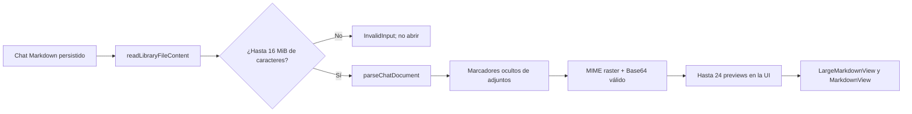

### Límites, seguridad, errores y compatibilidad

- El límite ampliado se mide con `chars().count()`; no es un límite de bytes. Es el límite aceptado por la fachada de lectura, pero `ensure_content_bound` se ejecuta después de `read_locator`; un archivo todavía mayor puede llegar a materializarse antes de ser rechazado. No se materializa un corpus completo, aunque queda pendiente un límite de lectura previo o streaming si se necesita contener también esa asignación transitoria.
- `MAX_DOCUMENT_CHARS` permanece vigente para `InMemoryLibrary::add_document`, previews de reemplazo y `write_atomic`, así como para los adaptadores de mutación. Si una edición o guardado genera más de 500.000 caracteres, se rechaza con el error seguro de documento sobredimensionado; leerlo no autoriza a mutarlo.
- La extracción no registra ni envía el Base64 a servicios externos. La lista cerrada de MIME impide que SVG u otros payloads se interpreten como contenido renderizable, y el filtrado sintáctico de Base64 evita construir una URL para valores vacíos o con caracteres no permitidos. Un adjunto rechazado no invalida el resto de la conversación: simplemente no obtiene preview.
- El marcador de adjuntos continúa siendo un comentario HTML oculto con metadata JSON UTF-8 codificada en Base64. No hay migración de SQLite ni cambio de contrato para chats anteriores; los chats sin marcador siguen cargándose y la metadata que no se puede decodificar se ignora conservando el texto.
- Si el archivo supera el límite de lectura, la fachada devuelve `InvalidInput` con el mensaje técnico seguro `El documento supera el limite de tamano.`. Si falla la lectura de la biblioteca, se conserva el error recuperable del adaptador y no se intenta usar otra ruta o URI como fallback.

### Regresiones, validaciones y pendientes

`src/services/chat/chatDocumentStorage.test.ts` cubre la extracción de una imagen raster, la exclusión de texto y SVG y la preservación del marcador oculto. La regresión de `src-tauri/app/src/library_document_adapter.rs` acepta un Markdown por encima de 500.000 caracteres para lectura y rechaza uno por encima de 16 MiB. No se agregó una prueba manual del renderizado de la UI ni de un dispositivo Android; tampoco se midió un baseline nuevo de memoria o tiempo.

Validaciones ejecutadas en esta iteración:

- `npx vitest run src/services/chat/chatDocumentStorage.test.ts src/engines/markdown/markdownEditorLimits.test.ts`: 9 tests aprobados.
- `npm test -- --run`: 136 archivos y 762 tests aprobados.
- `npx tsc --noEmit`.
- `npm run lint`.
- `npm run build -- --minify=false`.
- `cargo test --manifest-path src-tauri/backend-core/Cargo.toml`: 87 tests aprobados.
- `cargo test --manifest-path src-tauri/Cargo.toml --lib library_document_adapter`: compiló, pero la ejecución falló por `STATUS_ENTRYPOINT_NOT_FOUND` del enlazador Windows, ya preexistente.
- `cargo fmt backend-core --check`: aprobado.
- `cargo fmt src-tauri --check`: continúa mostrando diferencias preexistentes en `src/lib.rs`, `src/library_registry.rs` y, cuando corresponde, el orden de imports de `library_document_adapter.rs`.
- `git diff --check`: aprobado; Git mostró advertencias de conversión LF/CRLF.

Queda pendiente la validación manual en la UI de escritorio y Android/WebView, incluida la apertura de chats grandes, el renderizado de las 24 previews, el comportamiento con imágenes corruptas y el guardado posterior de documentos que exceden el límite de mutación. También queda pendiente, si la presión de memoria lo exige, adelantar el rechazo del adaptador antes de materializar un archivo mayor al límite. No se probó un dispositivo Android.

## Estado sincronizado de esta iteración: routing documental del agente por identidad de biblioteca

`chatScopedAgentRuntime.ts` ya no accede directamente al filesystem para leer o escribir documentos Markdown existentes cuando recibe una biblioteca con `id` y una ruta lógica segura. `getLibraryMarkdownDocumentOptions` deriva la ruta relativa bajo la raíz, rechaza rutas externas, traversal, URI y extensiones no Markdown, y conserva `androidTreeUri` únicamente para el fallback del motor de filesystem. Las lecturas y escrituras identificadas pasan por `readLibraryFileContent` y `writeLibraryFileContent` con `libraryId`, `logicalPath` y, cuando la lectura lo entrega, `expectedRevision`.

Las lecturas Markdown usadas por `chatAttachmentRuntime` conservan la revisión nativa para que las mutaciones posteriores puedan aplicar la precondición del documento. Los adjuntos no Markdown, las rutas sin identidad válida y las operaciones genuinamente no documentales continúan usando `filesystemEngine`. La creación de archivos, creación de directorios, eliminación, renombrado y demás operaciones de árbol no fueron redirigidas. Los rollback conservan su orden y comportamiento best-effort existente; las escrituras de rollback no inventan una revisión cuando el resultado previo no expone una nueva revisión.

La regresión de `libraryDocumentRuntime.test.ts` cubre el routing de una nota segura y el rechazo de texto, rutas externas y traversal. `chatScopedAgentRuntime.search.test.ts` verifica que la edición de una nota existente use la identidad de biblioteca y `expectedRevision`, sin enviar la raíz Android ni una URI al backend.

Validaciones ejecutadas en esta iteración:

- `npx vitest run src/services/chat`: 6 archivos, 102 tests aprobados.
- `npx vitest run src/services/chat/chatScopedAgentRuntime.test.ts src/services/chat/chatScopedAgentRuntime.search.test.ts src/services/chat/chatDocumentStorage.test.ts src/services/libraries/libraryDocumentRuntime.test.ts`: 4 archivos, 94 tests aprobados.
- `npx tsc --noEmit`: aprobado.
- `npm run lint`: aprobado.
- `git diff --check`: aprobado; permanecen únicamente warnings existentes de conversión LF/CRLF.

No se ejecutaron build Android, `cargo check` ni una prueba manual en dispositivo para esta iteración. `README.md` y `FUNCIONALIDADES.md` no requieren cambios porque no cambia una capacidad visible ni su uso.

## Estado sincronizado de esta iteración: finalización segura del selector SAF Android y timeout de selección

El flujo de alta de bibliotecas Android ahora tiene límites explícitos tanto en el callback nativo del selector como en la espera del frontend. La fuente `src-tauri/resources/directory-picker/android/DirectoryPickerPlugin.kt` y su copia generada `src-tauri/gen/android/app/src/main/java/com/gabriel/notia/DirectoryPickerPlugin.kt` permanecen sincronizadas.

### Flujo y contratos vigentes

1. `pickDirectoryTree` abre `ACTION_OPEN_DOCUMENT_TREE` solicitando los permisos de lectura, escritura, persistencia y prefijo necesarios para el grant SAF. `directoryTreeResult` registra con el tag `NotiaSAF` el `resultCode` y si la respuesta contiene datos.
2. El callback rechaza un resultado distinto de `Activity.RESULT_OK` con `No se seleccionó ninguna carpeta.`; un resultado exitoso sin `data` o sin `data.data` se rechaza con `No se pudo resolver la carpeta seleccionada.`. Si DocumentsUI no concedió ninguno de los flags READ/WRITE, devuelve `El selector no concedió permisos para la carpeta seleccionada.`.
3. El callback conserva únicamente los flags READ/WRITE presentes en `ActivityResult.data.flags` y pasa esos flags reales a `takePersistableUriPermission`. En éxito resuelve el `Invoke` con `{ path: string, uri: string }`, ambos con la URI seleccionada.
4. `SecurityException` se traduce a un rechazo que explica que no se pudo conservar el permiso; las demás excepciones se registran como error `NotiaSAF` y también rechazan el `Invoke`, usando el mensaje de la excepción o un fallback seguro. No queda un `Invoke` pendiente por una respuesta inválida o una excepción del callback.
5. `libraryRuntime.pickLibraryDirectory()` aplica el timeout de `60_000` ms únicamente cuando `getRuntimeDevice()` devuelve `Android`; en desktop conserva la espera original de `pickDirectory()` sin ese timeout. Si vence en Android, rechaza con `El selector de carpetas tardó demasiado. Intenta nuevamente.`; otros errores se propagan cuando tienen mensaje y, si no, usan `No se pudo abrir el selector de carpetas.`. En Android, una selección válida sigue exigiendo una URI `content://` antes de construir `{ path, name, androidTreeUri }`.
6. `LibraryManagerModal` muestra el error recuperable, restablece el estado de selección y conserva el modal abierto; el botón vuelve a estar disponible para reintentar. Una selección válida mantiene el flujo previo: configura la biblioteca, espera `onLibraryAdded` y recién después cierra el modal.

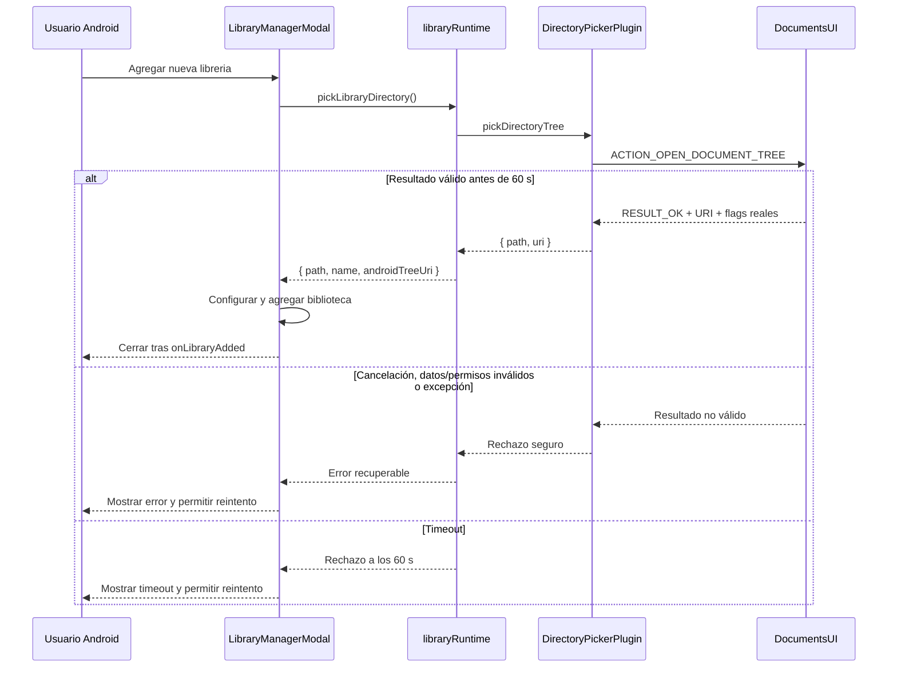

### Límites, errores y pendientes

- El timeout limita la espera del `Promise` en el frontend; no constituye una cancelación explícita de la actividad nativa ya iniciada. Si el proveedor SAF o DocumentsUI permanece bloqueado, la validación del comportamiento posterior depende de la plataforma y del WebView.
- La URI seleccionada debe ser `content://` para que `pickLibraryDirectory()` la acepte en Android. Una URI ausente, un resultado cancelado, un grant sin READ/WRITE, un permiso no persistible o una revocación posterior se informan como error y no agregan una biblioteca incompleta.
- No cambia el formato persistido de las bibliotecas, el contrato `androidTreeUri`, los comandos Tauri ni los permisos requeridos por operaciones posteriores. La sincronización entre la fuente Kotlin y la copia generada es necesaria para que el build Android ejecute el callback documentado.

### Regresiones y validaciones ejecutadas

`src/services/libraries/libraryRuntime.test.ts` verifica que una promesa del selector que nunca termina rechace después de 60 segundos con el mensaje de timeout. La suite dirigida junto con `src/components/notia/LibraryManagerModal.test.tsx` aprobó 4 tests.

Validaciones ejecutadas en esta iteración:

- `npx vitest run src/services/libraries/libraryRuntime.test.ts src/components/notia/LibraryManagerModal.test.tsx`: 2 archivos, 4 tests aprobados.
- `npm test -- --run`: 133 archivos, 732 tests aprobados.
- `npm run lint`: aprobado.
- `npx tsc --noEmit`: aprobado.
- `cargo fmt --check`: aprobado.
- `cargo check`: aprobado; permanecen warnings existentes.
- `git diff --check`: aprobado; solo se informaron warnings existentes de LF/CRLF.
- `gradlew.bat :app:compileArm64DebugKotlin --no-daemon`: `BUILD SUCCESSFUL`.
- `npm run build -- --minify=false`: aprobado; permanecen warnings existentes de chunks e importaciones dinámicas.
- `npm run build:android:debug`: completado y produjo `builds/android/notia-debug.apk`.

No se instaló ni probó el APK en un dispositivo y no hubo prueba manual con `adb`; esa verificación queda pendiente. La compilación Kotlin y la generación del APK no sustituyen la comprobación del selector SAF real, sus permisos, la respuesta de DocumentsUI ni el comportamiento tras suspensión, revocación o timeout.

## Estado sincronizado de esta iteración: creación SAF directa por ruta desde el grant raíz

Los logs de dispositivo mostraron que el error `No se recibió una URI SAF válida.` aparecía en el primer `createPathEntry` del alta cuando `rootUri` llegaba vacío o no se propagaba correctamente desde el frontend. Esta iteración corrige el paso de `selection.androidTreeUri`, agrega logging nativo en `DirectoryPickerPlugin.createPathEntry`, unifica la creación de `.notia/notiaConfig.json` en un solo comando `createPathEntry`, mejora el mapeo de errores de SAF para conservar el detalle original y ajusta el orden de invalidación de la caché del árbol para no descartar una LRU recién poblada por `readTree`.

### Flujo y contratos vigentes

1. `create_library_directory` y `create_library_file` reciben la ruta lógica y la URI tree raíz. `android_relative_segments` solo deriva segmentos cuando la ruta normalizada está realmente debajo de esa raíz: exige el prefijo completo seguido por `/`, rechaza una ruta igual a la raíz y descarta segmentos vacíos, `.` o `..`.
2. Cuando la derivación es válida, Rust llama directamente a `create_android_path_entry(state, rootUri, segments, entryType, content)` antes de intentar resolver el padre mediante las cachés o el resultado de `readTree`. El bridge invoca el comando móvil `createPathEntry` y exige una URI de respuesta no vacía.
3. `DirectoryPickerPlugin.createPathEntry` recibe `rootUri`, el array `segments`, `entryType` y el contenido inicial opcional. Registra el `rootUri` recibido y la raíz normalizada en `android.util.Log` con tag `NotiaSAF` para diagnóstico en dispositivo. Normaliza la raíz tree a document URI y recorre cada segmento como hijo inmediato; todos los segmentos intermedios se resuelven o crean como directorios y el último se crea con el tipo solicitado.
4. El plugin admite entre 1 y 24 segmentos. Después de aplicar `trim`, rechaza segmentos vacíos, `.`, `..` o que contengan `/` o `\`; los errores son `La ruta Android tiene una profundidad inválida.` o `La ruta Android contiene un segmento inválido.`. Una URI que no comienza por `content://` se rechaza como URI SAF inválida con `No se recibió una URI SAF válida.`.
5. Cada paso conserva la creación idempotente por nombre exacto y tipo. El plugin consulta únicamente los hijos inmediatos mediante `COLUMN_DOCUMENT_ID`, `COLUMN_DISPLAY_NAME` y `COLUMN_MIME_TYPE`; reutiliza una entrada compatible, rechaza una colisión archivo/directorio con `Ya existe una entrada incompatible con ese nombre.` y, si el proveedor rechaza la creación, vuelve a consultar antes de devolver el error.
6. El contenido inicial se escribe únicamente al crear un archivo nuevo en el segmento final, sin truncar un archivo compatible ya existente. Si la escritura del contenido inicial falla, el plugin intenta eliminar el documento creado como _best-effort cleanup_ y propaga la excepción original excepto `SecurityException`, que se traduce al error recuperable `El permiso de la carpeta fue revocado. Volvé a seleccionar la biblioteca.`.
7. Al recibir la URI real del destino, `android_saf.rs` invalida las rutas afectadas y siembra la LRU con `ruta lógica exacta → URI real`. El resultado público sigue siendo `OperationResult { ok, error? }`; los fallos del nuevo comando se encapsulan como error de creación de archivo o directorio.
8. Si no hay una raíz utilizable o la ruta no está realmente bajo ella, se conserva el flujo anterior de resolución del padre. Las lecturas, reemplazos y demás operaciones siguen usando la LRU, el mapa de paths y `readTree` lazy; una ruta anidada desconocida no usa la URI raíz como fallback.

En el frontend, `ensureLibraryConfigExists` omite ahora la llamada separada `createDirectory(configDir)` cuando existe `androidDirectoryUri`, delegando la creación de `.notia` y `notiaConfig.json` en un solo `createFile(configPath, content, options)`. Esto evita forzar al proveedor SAF a enumerar el directorio `.notia` recién creado entre dos comandos.

Así, la creación inicial de `.notia/notiaConfig.json` parte del grant raíz, resuelve o crea `.notia` y luego resuelve o crea `notiaConfig.json` dentro del mismo comando móvil. Ya no requiere que `readTree` actualizado enumere `.notia` entre ambos pasos.

```mermaid
flowchart LR
    Picker[Selector SAF entrega path + androidTreeUri] --> Frontend[ensureLibraryConfigExists]
    Frontend -->|Android| Single[createFile configPath con androidDirectoryUri]
    Single --> Logical[Ruta lógica bajo la raíz]
    Logical --> Segments[Derivar y validar 1..24 segmentos]
    Segments --> Bridge[create_android_path_entry]
    Bridge --> Plugin[createPathEntry]
    Plugin --> Log[Log NotiaSAF rootUri normalizado]
    Log --> Root[Normalizar raíz a document URI]
    Root --> Child{Hijo inmediato compatible}
    Child -->|Sí| Next[Reutilizar URI]
    Child -->|No| Create[Crear directorio o destino]
    Child -->|Tipo incompatible| Error[Rechazar colisión]
    Create --> Next
    Next -->|Quedan segmentos| Child
    Next -->|Destino final| Cache[Invalidar y sembrar LRU]
```

### Cachés, límites, errores y recuperación

- La nueva vía no elimina `readTree`: deja de depender de su resultado para crear una ruta bajo un grant raíz válido. Las lecturas y la resolución de operaciones no cubiertas por esta creación directa conservan la caché de árbol y la LRU existentes.
- El recorrido hace una consulta de hijos inmediatos por nivel y tiene una profundidad máxima de 24. No acepta traversal ni separadores embebidos en un segmento, no reemplaza tipos incompatibles y no sobrescribe archivos existentes.
- `create_library_file` y `create_library_directory` ahora usan `createPathEntry` antes de cualquier `refresh_root_tree_cache` previo y siembran la LRU **después** de la creación. La versión anterior invocaba `refresh_root_tree_cache` al inicio de la función, lo que podía invalidar una caché recién poblada por `readTree` justo antes de la creación. La implementación actual evita ese orden inválido.
- `map_already_exists_error` fue corregido para que, cuando el mensaje no es un error de duplicado, preserve el detalle del error original con el formato `{fallback} {error_message}`. Las pruebas unitarias Rust bajo `#[cfg(any(target_os = "android", test))]` cubren ambas ramas: duplicados devuelven `An entry with that name already exists.` y otros errores conservan el mensaje original.
- La URI sembrada en la LRU vive solo en memoria. Reiniciar el proceso, revocar el grant o recibir un rechazo del proveedor obliga a recuperar o volver a seleccionar la biblioteca según el error correspondiente.
- La configuración puede quedar creada aunque falle posteriormente `onLibraryAdded` o la persistencia de documentos pendientes: el alta no tiene rollback de `.notia/notiaConfig.json`.
- No se agregó una prueba Kotlin unitaria específica para `createPathEntry` ni se comprobó todavía esta APK en una tablet. Los casos reales de proveedor con árbol obsoleto, colisión de tipo, permisos revocados y suspensión/recuperación siguen pendientes de validación manual.

Validaciones ejecutadas:

- `npm test -- --run`: 132 archivos / 731 tests aprobados.
- `npm run lint`: aprobado.
- `npx tsc --noEmit`: aprobado.
- `cargo fmt`: aprobado.
- `cargo check` para el host: aprobado; permanecen 50 warnings existentes, sin nuevos.
- `gradlew :app:assembleArm64Debug --no-daemon`: no se completó en este ciclo; el CLI de Tauri rechazó la conexión WebSocket (`ConnectionRefused`) de forma transitoria, no por código. Una ejecución anterior del script `npm run build:android:debug` sí finalizó exitosa y produjo la APK en `builds/android/notia-debug.apk`.

El build Android por Gradle falló transitoriamente por conexión WebSocket rechazada del CLI de Tauri; queda pendiente recompilar e instalar la APK para verificar el alta real de una biblioteca y la creación de `.notia/notiaConfig.json` en dispositivo.

## Estado sincronizado de esta iteración: resolución de URI SAF sintéticas en Android

El backend Android conserva el motor global de filesystem: `src/services/files/filesystemEngine.ts` invoca los comandos Tauri, Rust delega en `src-tauri/app/src/filesystem/android_saf.rs`, y esa capa usa `mobile_directory_picker.rs` y el plugin Kotlin para acceder al Storage Access Framework (SAF). No se creó un motor Android alternativo ni cambió el contrato de `androidDirectoryUri`.

### Contrato, resolución y errores

- `resolve_entry_uri` solo trata como documento SAF directo una URI `content://` que contiene `/document/`. Es la única forma que bypassa la resolución de paths.
- Una URI raíz/tree (`content://.../tree/...`) y cualquier ruta lógica construida sobre ella —por ejemplo `content://tree/.../.notia/notiaConfig.json`— son URI sintéticas, no documentos SAF. Pasan por la LRU, el mapa de paths y, si la caché está vencida, el refresh lazy mediante `readTree` antes de resolverse con la entrada real.
- `pathExists`, `read_library_file`, `write_library_file` y las mutaciones distintas de la creación directa por ruta usan la URI resuelta. Una ruta sintética que no aparece en la caché ni en el árbol no se considera existente y no se entrega al plugin Kotlin como destino directo; devuelve el error seguro correspondiente, como `Could not resolve Android file.`. `create_library_directory` y `create_library_file` son la excepción: si derivan una ruta relativa válida desde el grant raíz, usan `createPathEntry` sin depender de esa resolución.
- Las URI de documento reales mantienen el bypass directo. Esto conserva el acceso eficiente a entradas SAF ya entregadas como documentos sin confundirlas con una ruta lógica agregada a una URI tree.

Para lecturas, reemplazos y mutaciones no cubiertas por la creación directa, el flujo efectivo es: `filesystemEngine` normaliza y envía `path` más `directoryUri` → comandos Tauri/Rust validan y delegan → `android_saf::resolve_entry_uri` distingue documento directo de URI sintética → `mobile_directory_picker` consulta la caché o actualiza el árbol SAF → el plugin Kotlin opera sobre la URI de documento real. La corrección evita que `pathExists` informe un falso positivo y que `write_library_file` intente escribir una URI inexistente.

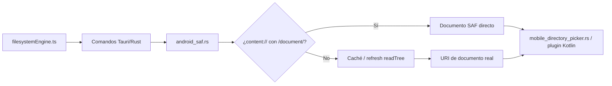

La regresión Android en `src-tauri/app/src/filesystem/android_saf.rs` comprueba que solo una URI con `/document/` bypassa la resolución y que una ruta sintética sobre `/tree/` continúa por SAF. No hay migración, cambio de persistencia, permisos nuevos, DTO ni cambio de comandos.

### Validaciones y pendientes

Validaciones ejecutadas en esta iteración:

- `cargo check`: aprobado; permanecen warnings existentes.
- `cargo fmt --check`: aprobado.
- `npm test -- --run`: 132 archivos y 730 tests aprobados.
- `npx tsc --noEmit`: aprobado.
- `npm run lint`: aprobado.
- `git diff --check`: aprobado.

No se probó manualmente un APK ni el flujo SAF en un dispositivo Android real. Esa validación queda pendiente; las pruebas automatizadas no sustituyen la comprobación en WebView/dispositivo, permisos revocados y ciclos de suspensión o recuperación.

## Estado sincronizado de esta iteración: preservación de URI SAF en rutas Android

El error `Could not resolve Android directory` del alta de bibliotecas Android tenía una causa concreta en el frontend: `normalizeFilesystemPath` trataba la URI opaca `content://...` como una ruta común y colapsaba sus barras a `content:/...`. Después, `pathUtils.join` podía volver a corromper el esquema al construir `.notia/notiaConfig.json`. La evidencia de logcat mostró varios `readTree` antes del error, consistente con esa resolución fallida. Los mensajes de Settings relacionados con APK corresponden a una instalación anterior ya eliminada y no al flujo Tauri actual.

### Contrato y corrección implementada

- `normalizeFilesystemPath` recorta espacios como antes, pero devuelve sin modificar cualquier valor que empiece por `content://`; las rutas locales y `file://` mantienen su normalización de separadores existente.
- `pathUtils.join` reconoce una URI `content://` en el primer segmento, quita solo sus barras finales y normaliza los segmentos posteriores sin tocar el esquema. Por ejemplo, `join(treeUri, '.notia', 'notiaConfig.json')` produce `content://.../.notia/notiaConfig.json`, no `content:/...`.
- La ruta de configuración inicial conserva así la URI de árbol SAF que entrega el selector y puede ser resuelta por la capa Android. No cambia el formato persistido de la configuración, el contrato de `androidDirectoryUri`, los comandos Tauri ni los permisos SAF.
- La corrección es defensiva: una URI ausente, inválida o que no pueda resolver el backend sigue produciendo un error seguro como `Could not resolve Android directory.`; no se usa otra URI como fallback.

El flujo vigente es: el selector SAF entrega `path` y `androidTreeUri`; el frontend normaliza la ruta sin alterar la URI `content://`; al asegurar la configuración, une la URI con `.notia/notiaConfig.json`; las comprobaciones de existencia pueden consultar `readTree`, pero la creación deriva los segmentos y los recorre directamente desde el grant raíz. Solo después continúa el alta de la biblioteca. El APK actualizado fue ensamblado, pero su verificación en dispositivo real sigue pendiente.

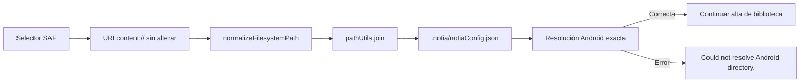

### Regresiones, validaciones y pendientes

`src/utils/files/pathUtils.test.ts` agrega regresiones para conservar una URI `content://` durante la normalización y para unir `.notia/notiaConfig.json` sin corromper el esquema. La suite dirigida también conserva las regresiones de `src/services/libraries/libraryConfig.test.ts` sobre creación de una configuración ausente mediante `createFile`, propagación de `{ ok: false, error }` y compatibilidad de lectura.

Validaciones ejecutadas en esta iteración:

- `npx vitest run src/utils/files/pathUtils.test.ts src/services/libraries/libraryConfig.test.ts`: 7 tests aprobados.
- `npm test -- --run`: 132 archivos y 730 tests aprobados.
- `npx tsc --noEmit`.
- `npm run lint`.
- `npm run build -- --minify=false`: build aprobado; permanecen warnings existentes de chunks.
- `git diff --check`.

El APK actualizado ya fue ensamblado. Queda pendiente instalarlo y validar en un dispositivo Android real el alta de una biblioteca SAF y la creación de su configuración; no se afirma que ese flujo haya sido comprobado manualmente.

## Estado sincronizado de esta iteración: resolución SAF exacta y creación segura de configuración Android

El alta desde `LibraryManagerModal` conserva el modal hasta completar la selección SAF, la configuración y `onLibraryAdded`. La selección entrega `path` y `androidTreeUri` a `ensureLibraryConfigExists`; una cancelación vuelve al estado inactivo y cualquier error mantiene el modal abierto para reintentar.

### Flujo, contratos y persistencia

1. `LibraryManagerModal` inicia `pickLibraryDirectory()`. Para una selección válida llama a `ensureLibraryConfigExists(selection.path, { androidDirectoryUri: selection.androidTreeUri })` antes de crear el `NotiaLibrary`.
2. En Android, `android_saf::resolve_entry_uri` resuelve directamente solo una URI `content://` con `/document/`; las URI tree y las rutas sintéticas pasan luego por las cachés LRU y de rutas, y finalmente por una actualización lazy mediante `readTree` si la caché está vencida. `resolve_android_tree_uri` solo acepta coincidencias exactas de la ruta solicitada en `paths` o `roots`; una ruta anidada desconocida no recibe la URI de la raíz como fallback. Esto evita que la lectura o escritura de `.notia/notiaConfig.json` termine apuntando al documento raíz seleccionado o a una URI sintética inexistente.
3. Si la configuración no existe, `ensureLibraryConfigExists` intenta crear `.notia` y después `writeLibraryConfig` consulta nuevamente la existencia. Cuando el archivo falta, usa `createFile`, que invoca `create_library_file`; Android deriva la ruta relativa al grant y usa `createPathEntry` para resolver o crear todos sus segmentos con el contenido inicial. `writeTextFile`/`write_library_file` queda reservado para reemplazar documentos existentes; no se usa para crear la configuración nueva.
4. `writeLibraryConfig` devuelve `{ ok, error? }` y conserva el error de creación. `ensureLibraryConfigExists` lanza un `Error` con ese mensaje o con `No se pudo crear la configuracion de la libreria.` cuando `ok` es `false`; la selección no continúa como un alta válida.
5. Tras configurar la carpeta, el modal crea el `NotiaLibrary`, muestra `Cargando archivos...` y espera `onLibraryAdded(newLibrary)`. `useLibraryManagerActions.handleLibraryAdded` persiste primero los documentos pendientes; si ese flush falla, no agrega ni selecciona la biblioteca.
6. La configuración se escribe antes de `onLibraryAdded`; si luego falla el flush no se registra la biblioteca en Redux y no hay rollback de la configuración ya creada. Las configuraciones existentes no se reemplazan durante el alta. No hay migración de formato ni cambio en el contrato de la URI de árbol SAF.

```mermaid
sequenceDiagram
    participant U as Usuario Android
    participant M as LibraryManagerModal
    participant P as Selector SAF
    participant R as Resolución SAF exacta
    participant C as ensureLibraryConfigExists
    participant A as useLibraryManagerActions
    participant F as Persistencia de documentos
    U->>M: Agregar nueva libreria
    M->>P: pickLibraryDirectory()
    alt Cancelación
        P-->>M: null
        M-->>U: Modal abierto y listo para reintentar
    else Selección válida
        P-->>M: path, nombre y androidTreeUri
        M->>C: Asegurar .notia/notiaConfig.json
        C->>R: Resolver lectura/creación por path
        alt Ruta anidada desconocida
            R-->>C: Error; no usa la URI raíz
            C-->>M: Error de configuración
            M-->>U: Mensaje; modal permanece abierto
        else Configuración inexistente
            C->>R: Derivar segmentos desde el grant raíz
            R->>P: createPathEntry por ruta relativa
            P-->>C: Resultado de creación
            C-->>M: Configuración lista
            M->>A: await onLibraryAdded(library)
            A->>F: await persistDirtyTextDocuments()
            alt Flush fallido
                F-->>A: false
                A-->>M: Error; no agrega biblioteca
                M-->>U: Mensaje; modal permanece abierto
            else Flush correcto
                A-->>M: Promise resuelta
                M-->>U: Cierra modal después del alta
            end
        end
    end
```

La caché de rutas SAF conserva hasta 500 entradas LRU y usa una vigencia de 30 segundos; una mutación invalida las rutas afectadas y la resolución puede reconstruir el árbol de forma lazy. Si existe contexto Android pero no se resuelve la entrada, las operaciones devuelven errores seguros como `Could not resolve Android file.` o `Could not resolve Android directory.` en lugar de operar sobre otra URI.

### Regresiones, validaciones y pendientes

`src/services/libraries/libraryConfig.test.ts` cubre que un archivo ausente use `createFile` y no `writeTextFile`, y que `{ ok: false, error }` se propague como error de `ensureLibraryConfigExists`. La regresión Android de `src-tauri/app/src/mobile_directory_picker.rs` comprueba que una ruta anidada desconocida no se resuelva a la URI raíz. `src/components/notia/LibraryManagerModal.test.tsx` conserva las regresiones de modal pendiente, persistencia antes del cierre y error de configuración.

Validaciones ejecutadas:

- `npm test -- --run`: 131 archivos y 728 tests aprobados.
- `npm run lint`.
- `npx tsc --noEmit`.
- `npm run build -- --minify=false`: build exitoso; permanecen warnings existentes de chunks.
- `cargo fmt --check`.
- `git diff --check`.
- `cargo test` compiló, pero no pudo ejecutar por `STATUS_ENTRYPOINT_NOT_FOUND` del entorno Windows.
- `cargo check --target aarch64-linux-android` no pudo completar porque faltan `aarch64-linux-android-clang` y el NDK.

La compilación Android y el APK debug ya se completaron mediante Gradle/Tauri. Queda pendiente instalar esta nueva APK y repetir el flujo SAF en un dispositivo Android sin HMR; no se afirma validación manual en dispositivo.

## Estado sincronizado de esta iteración: tercera corrección de interacción táctil en modales Android

En Android, `NotiaButton` puede activar una acción táctil en `pointerup` y ejecutar un `click()` programático. Algunos WebView todavía emiten después un `click` confiable para el mismo toque y pueden reportar un `pointerdown` sobre el backdrop aunque el dedo siga activando un control interno. Si la acción monta un modal durante el handler —por ejemplo, al tocar **Agregar nueva libreria** en `LibraryManagerModal`— esa secuencia podía desmontarlo antes de abrir o completar el selector SAF. La corrección vigente mantiene la supresión de clicks confiables fantasma y la validación geométrica para mouse, y agrega una regla explícita: `NotiaModalShell` ignora todo `pointerdown` cuyo `pointerType` no sea `mouse`.

### Flujo y contrato vigente

1. `NotiaButton` registra un puntero no mouse, conserva la posición inicial y considera tap un gesto con desplazamiento máximo de 16 px. En `pointerup`, para un tap válido, llama a `preventDefault()`, arma la supresión global y ejecuta una única activación programática mediante `button.click()`.
2. `phantomClickSuppression` instala una sola escucha de `click` en la captura del documento y mantiene una ventana global de 450 ms asociada al elemento que recibió el tap. Durante esa ventana bloquea únicamente eventos confiables cuyo target quede fuera de ese elemento; la compuerta no intercepta eventos no confiables ni clicks confiables sobre el elemento dueño. `NotiaButton` conserva además su guard local para que el click nativo duplicado no ejecute dos veces el handler. La ventana se limpia al vencer el tiempo o cuando corresponde al click del elemento dueño.
3. `NotiaModalShell` retorna sin cerrar ante cualquier `pointerdown` cuyo `pointerType` no sea `mouse`, incluido un evento táctil retargeteado al backdrop. Por tanto, el backdrop no es un mecanismo de cierre táctil: la interacción touch esencial no depende de que el WebView informe un target de backdrop confiable.
4. Para mouse, el shell exige que `event.target === event.currentTarget` y conserva la comprobación de `panel.getBoundingClientRect()` contra `clientX`/`clientY`; si las coordenadas están dentro del panel, no desmonta el modal aunque el mouse haya sido retargeteado al backdrop. Solo un `pointerdown` de mouse directo y fuera del rectángulo del panel ejecuta `preventDefault()` y `onClose()`.
5. El shell conserva el cierre mediante Escape, el foco inicial en el panel y la restauración del foco previo al desmontar, además de `tabIndex="-1"`, `role="dialog"` y `aria-modal="true"`. `LibraryManagerModal` expone además una X visible que continúa siendo una acción explícita disponible con touch.
6. En `LibraryManagerModal`, la selección SAF puede permanecer abierta mientras el selector está activo. Cancelar o recibir un error deja el modal disponible para reintentar; una selección válida configura y agrega la librería antes de cerrar.

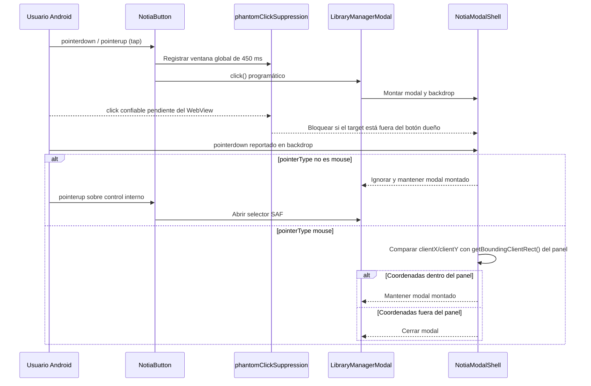

La corrección no cambia comandos Tauri, DTO, persistencia, permisos SAF ni el contrato de selección de bibliotecas. El límite de 450 ms es una protección de interacción global, no una garantía sobre eventos emitidos fuera de esa ventana. La comprobación geométrica usa las coordenadas del evento y el rectángulo vigente del panel, pero solo participa en la ruta de mouse; la validación de la secuencia real depende del WebView y del dispositivo. El cierre por backdrop queda intencionalmente disponible para mouse, no para pointerdown táctil o de otro tipo.

### Regresiones y validación

`src/components/common/NotiaButton.modal.test.tsx` cubre la activación táctil única, la compatibilidad con mouse/teclado, el cierre por backdrop con mouse, la ignorancia de `pointerdown` touch retargeteado al backdrop, la validación geométrica del panel, Escape, foco y la compuerta global. `src/components/notia/LibraryManagerModal.test.tsx` comprueba que el modal siga montado mientras el selector de directorios está pendiente y que cancelar no invoque `onClose`. En conjunto, las pruebas dirigidas de esta iteración suman 10 casos.

Validaciones ejecutadas en esta iteración:

- `npx vitest run src/components/common/NotiaButton.modal.test.tsx src/components/notia/LibraryManagerModal.test.tsx`: 10 tests aprobados.
- `npx tsc --noEmit`.
- `npm run lint`.
- `npm test -- --run`: 131 archivos y 724 tests aprobados.
- `npm run build -- --minify=false`: build exitoso; permanecen únicamente warnings existentes de chunks e importaciones dinámicas.
- `git diff --check`: aprobado; Git informó únicamente warnings existentes de conversión LF/CRLF.

No hay dispositivo Android ni `adb` disponible. No se ejecutó validación manual ni build o instalación Android. La reproducción real en WebView físico, distintas versiones de Android y ciclos de suspensión/reanudación queda pendiente.

## Estado sincronizado de esta iteración: criterio multiplataforma de desarrollo

Las reglas de implementación del repositorio establecen que cada flujo se diseña, implementa y revisa desde el inicio para Windows y Android. El alcance incluye frontend, comandos y adaptadores Rust del backend, iteración de desarrollo, permisos y ciclo de vida de cada plataforma.

Las interfaces deben responder a ventanas de Windows, teléfonos Android y tabletas Android. Toda acción esencial debe poder ejecutarse mediante toque y gestos de dedo adecuados en Android, sin depender de mouse, hover, clic derecho, teclado físico ni precisión de puntero. Este criterio es una obligación de desarrollo y revisión; no modifica contratos de ejecución, APIs, persistencia ni funcionalidades ya disponibles.

Validación ejecutada en esta iteración:

- `git diff --check`: aprobado. Git informó únicamente warnings existentes de conversión LF/CRLF.

No se ejecutaron pruebas, builds ni validaciones manuales de Windows o Android porque el cambio se limita a las reglas de trabajo y no modifica código. La aplicación práctica de este criterio en cada flujo futuro requiere las validaciones de plataforma que correspondan a su alcance.

## Estado sincronizado de esta iteración: revisión de mutaciones del documento activo

Se corrigió un conflicto falso al mutar el documento Markdown activo desde el chat. La revisión esperada se obtenía preferentemente de `workspaceSnapshot.activeDocumentRevision`, pero ese snapshot podía quedar obsoleto mientras la fuente activa que el runtime usaba para construir la propuesta seguía siendo la actual. En ese caso, la operación podía informar `revision-conflict` con el mensaje «El documento cambió mientras preparaba la operación» aunque la persona no hubiera editado el archivo.

`loadActiveMarkdownDocument` continúa resolviendo la fuente en este orden: `getActiveMarkdownSource()`, `activeMarkdownSource` y, como último respaldo, el archivo cargado desde la biblioteca. Para las mutaciones del documento activo, `expectedActiveRevision` calcula ahora la revisión esperada con esa fuente cargada en el momento, usando `computeWorkspaceDocumentRevision(path, source)`; no toma como autoridad la revisión independiente del snapshot. Esto mantiene alineados el contenido usado para generar el preview y su precondición de escritura.

La comprobación de concurrencia posterior se conserva deliberadamente. Después de la confirmación, el runtime vuelve a cargar la fuente activa, calcula su revisión más reciente y la compara con la revisión esperada del preview o de la operación pendiente. Si difieren, devuelve `revision-conflict` con `retryable: true`, no escribe el archivo y exige releerlo para generar una nueva propuesta. Si coinciden, persisten las validaciones Markdown, la escritura, la notificación del editor y el registro idempotente de la operación. `apply_document_edit` además conserva la comprobación de anchors del patch antes de pedir la confirmación final.

```mermaid
sequenceDiagram
    participant A as Agente
    participant R as chatScopedAgentRuntime
    participant S as Fuente activa
    participant F as Filesystem
    A->>R: Proponer mutación
    R->>S: Cargar fuente actual
    S-->>R: source vigente
    R->>R: Calcular expectedRevision desde path + source
    R-->>A: Preview y confirmación
    A->>R: Confirmar
    R->>S: Volver a cargar fuente
    S-->>R: source más reciente
    R->>R: Comparar revisión actual con expectedRevision
    alt Cambio real detectado
        R-->>A: revision-conflict; no escribir
    else Sin cambio
        R->>F: Escribir documento
        F-->>R: Resultado persistido
        R-->>A: Éxito verificable
    end
```

La regresión de `src/services/chat/chatScopedAgentRuntime.search.test.ts` usa una fuente activa actual con `workspaceSnapshot.activeDocumentRevision` obsoleta; comprueba que `insert_active_markdown_document` confirma y escribe el contenido esperado en lugar de producir un conflicto falso. La suite dirigida quedó en 21/21 pruebas.

Validaciones finales de esta iteración:

- `npx vitest run src/services/chat/chatScopedAgentRuntime.search.test.ts`: 21/21 pruebas aprobadas.
- `npx tsc --noEmit`.
- `npm run lint`.
- `npm test -- --run`: 123 archivos y 695 tests aprobados.
- `npm run build -- --minify=false`: build exitoso; permanecen warnings existentes de chunks e importaciones dinámicas.
- `git diff --check`.

No cambia el formato persistido, los DTO, los comandos Tauri ni el contrato visible de confirmación. No se reportó una validación manual adicional de la UI en esta iteración.

## Estado sincronizado de esta iteración: adjuntos locales múltiples y persistentes en el chat

El chat lateral derecho permite seleccionar varios archivos locales en una sola apertura del selector. `ChatComposer` usa un `<input type="file" multiple>` y entrega el lote completo a `ChatWorkspaceView`; cada archivo se transforma mediante `readChatFileAsAttachment` y se agrega al estado `selectedImageAttachments` conservando el orden de selección. El compositor muestra un chip por archivo, permite quitarlo individualmente y mantiene visible el campo de mensaje mediante desplazamiento interno cuando hay muchos adjuntos. La selección de la librería continúa siendo un contexto independiente y no se mezcla con estos adjuntos locales.

### Flujo y contrato

1. La persona abre **Adjuntar archivo → Seleccionar archivo** y el selector puede devolver cero o más `File`.
2. `ChatWorkspaceView` procesa el lote con `Promise.all`. Si todas las lecturas terminan correctamente, concatena el resultado al array existente; el valor del input se limpia al terminar para permitir volver a elegir el mismo archivo. Si falla un archivo, el lote no se agrega y se muestra el error en el diálogo, conservando los adjuntos que ya estaban en el compositor.
3. `SelectedImageAttachment`/`StoredChatAttachment` contiene `name`, `mimeType`, `kind`, `base64` y, según el tipo, `additionalBase64`, `extractedText`, `textContent` y `pageCount`. `kind` distingue `image`, `pdf` y `text`.
4. `buildChatAttachmentPrompt` recibe la consulta y el array completo. Cada texto se incorpora como un bloque independiente `<attached_file name="...">...</attached_file>` y se marca como referencia, no como instrucciones. Cada PDF agrega una descripción de procesamiento ordenado y, si existe, su extracción en `<pdf_text>`; las imágenes no agregan texto al prompt.
5. `buildChatImageAttachment` aplana en orden todos los `base64` visuales: primero la imagen o página inicial de cada adjunto y después sus páginas adicionales. Devuelve un único `AiImageAttachment`; `aiRuntime` convierte `base64` más `additionalBase64` en la colección ordenada `images` que recibe Ollama. Los archivos de texto no ocupan posiciones visuales.
6. `useChatSubmitMessage` construye un único prompt y un único adjunto visual para la misma consulta, incorpora los adjuntos actuales al mensaje de usuario, limpia la selección al comenzar el envío y la restaura junto con el borrador si la solicitud o la persistencia fallan.
7. `useChatSubmitMessage` también toma los adjuntos de los mensajes incluidos en `buildChatMemoryWindow`. Por eso una consulta posterior puede reutilizar un adjunto conservado, mientras el límite de `contextMemoryMessageCount` determina cuánto historial y qué adjuntos se reenvían al modelo.

### Persistencia y rehidratación

`chatDocumentStorage.ts` conserva los adjuntos dentro del mensaje de usuario y los serializa en el Markdown del chat mediante el comentario HTML oculto `NOTIA_CHAT_ATTACHMENTS`. El marcador contiene un array JSON UTF-8 codificado en Base64, ubicado después del marcador de rol:

```text
<!-- NOTIA_CHAT_MESSAGE role:user -->
<!-- NOTIA_CHAT_ATTACHMENTS:<metadata-base64> -->
Pregunta de la persona
```

`serializeChatDocument` y `appendChatMessages` escriben el marcador; `parseChatDocument` lo decodifica y valida la forma básica de cada elemento al cargar el archivo. Los chats anteriores que no tienen el marcador siguen cargándose con mensajes sin adjuntos. Si la metadata no se puede decodificar, se conserva el contenido del mensaje y se ignora esa metadata. `ChatThread` muestra los nombres de los adjuntos conservados sin renderizar sus datos codificados. No hay migración de SQLite: el cambio es compatible con el formato Markdown existente y la rehidratación ocurre al volver a cargar el chat.

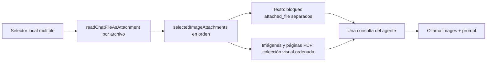

### Validaciones, errores y límites

- Se aceptan imágenes reconocidas por MIME o extensión, PDF por MIME o extensión y archivos de texto por MIME o por extensiones de texto/código configuradas (`txt`, `md`, `csv`, `json`, `xml`, `html`, `css`, JavaScript/TypeScript, Python, Rust, Java, C/C++, YAML, TOML, INI, log y TeX, entre otras). Otros tipos muestran que solo se pueden procesar imágenes, PDF o texto.
- Cada archivo tiene un límite de 40 MB. Un archivo de texto vacío se rechaza y cada archivo de texto admite como máximo 120.000 caracteres. Los límites del lote deben contemplar tamaño total, tamaño individual y cantidad de imágenes antes de enviar; en el código revisado de esta iteración sí se verifica de forma explícita el tamaño individual, pero no se encontró una constante ni una validación ejecutable para el tamaño agregado o una cantidad máxima de imágenes. Esos dos límites quedan como discrepancia técnica pendiente y no se presentan aquí como garantía implementada.
- Los PDF se renderizan localmente mediante `renderPdfForAi`: se conservan todas las páginas dentro del límite de 24 páginas, se convierten a JPEG para la colección visual y se extraen como máximo 40.000 caracteres de texto. Un PDF vacío, de más de 24 páginas o con un fallo de renderizado interrumpe la carga de ese lote antes de iniciar el chat; un PDF escaneado puede continuar aunque no tenga texto extraíble porque sus páginas renderizadas siguen siendo la fuente visual.
- Un archivo binario sin Base64 utilizable también se rechaza. Los errores de lectura, formato, tamaño y procesamiento llegan a `ChatWorkspaceView` como un mensaje seguro; no se inicia una consulta parcial.
- El envío sigue requiriendo texto no vacío en el compositor; adjuntar archivos por sí solo no habilita el botón. El modelo configurado debe admitir visión cuando el lote contiene imágenes o páginas de PDF; los textos continúan formando parte del prompt.

### Pruebas, compatibilidad y pendientes

Las regresiones de `chatImageAttachment.test.ts` cubren detección por MIME/extensión, extracción de PDF, exclusión de texto PDF en imágenes, varios textos como bloques separados y la combinación ordenada de una imagen, un PDF de varias páginas y otra imagen. `chatDocumentStorage.test.ts` cubre parsing, round-trip, marcador HTML oculto y metadata Base64 sin exponer el contenido codificado. `useChatSubmitMessage.test.ts` cubre la cancelación por desmontaje, evita persistir una respuesta tardía y verifica que una consulta de seguimiento reutilice los adjuntos del historial.

Validaciones ejecutadas para esta iteración:

- `npx tsc --noEmit`.
- `npm test -- --run`: 123 archivos y 694 tests aprobados.
- `npm run lint`.
- `npm run build -- --minify=false`: build exitoso; solo warnings existentes de chunks e importaciones dinámicas.
- `git diff --check`.

No se modifican APIs, comandos Tauri, DTO de SQLite ni datos financieros. Sí cambia el formato de los archivos Markdown de chat al agregar metadata opcional de adjuntos, con compatibilidad hacia atrás para chats sin marcador. Queda pendiente la validación manual en la UI real y con un modelo Ollama multimodal: selección de lotes mixtos, eliminación individual, rehidratación tras recarga, reutilización en una consulta de seguimiento, PDF de varias páginas, límites y cancelación en desktop y Android/WebView. El build no presentó fallos; sus warnings existentes no fueron tratados como parte de esta iteración.

## Continuación de acciones anunciadas por el agente

`runNativeToolAgent` valida también si una respuesta sin tool calls anuncia una acción pendiente. `pendingAgentActionEngine` detecta en la prosa anuncios explícitos en primera persona como «voy a analizar» o «ahora insertaré», excluyendo código cercado, código inline y citas Markdown. Se aplica cuando el turno tiene herramientas, antes de aceptar la respuesta final y junto con los validadores existentes de cada scope. Es una heurística acotada, no un clasificador universal de intenciones.

Ante una promesa, el runtime añade una corrección interna de sistema y fuerza la siguiente ronda por `run_desktop_ai_tool_chat` con el catálogo nativo, incluso si la promesa provino de la ronda de texto en streaming posterior a una lectura. Android conserva su transporte y recibe la misma validación. La corrección exige respetar el scope y las confirmaciones, reutilizar lecturas y no repetir mutaciones aplicadas o rechazadas. No se convierte el código del mensaje en una escritura automática. `isInternalAgentCorrection` impide guardar esta instrucción como regla aprendida.

Antes de emitir cualquier respuesta final, `runNativeToolAgent` inspecciona también el texto generado en busca de reglas internas, prompts, mensajes del sistema, correcciones de validadores y nombres internos de herramientas. Si los detecta, no publica deltas ni guarda esa respuesta como resultado: agrega una corrección interna y solicita una nueva respuesta. El mismo bloqueo se aplica a respuestas terminales de herramientas; si el modelo insiste hasta agotar las rondas, el usuario recibe únicamente un error genérico seguro.

Se permiten dos correcciones consecutivas por promesas sin tool calls; una tercera produce un error visible indicando que la última acción no está confirmada. Una ronda con herramientas reinicia ese contador; siguen vigentes los límites globales de rondas y timeout. Los resultados terminales tipados de escritura, error o cancelación conservan su salida directa. El streaming y sus listeners se mantienen; un borrador ya emitido puede contener la promesa mientras se continúa la ejecución, pero no se acepta como resultado terminal. El mapa de responsabilidades no cambia: detección pura en `engines/ai`, orquestación y transporte en `aiRuntime`, políticas de scope en `chatScopedAgentRuntime`.

Pruebas: detector con anuncios, citas, ejemplos y resultados terminales; integración con bridge Tauri simulado para lectura → promesa en streaming → inserción nativa, agotamiento de correcciones y cancelación sin reintento. No se usan modelos, red ni archivos de biblioteca reales.

## Estado sincronizado de esta iteración: runtime común de IA

### Política de memoria de Telegram según el Owner autorizado

Telegram ya no tiene una política única de memoria. `resolveTelegramPersistencePolicy(actorLibraryUserId)` recibe el `libraryUserId` autorizado de la biblioteca —no el identificador numérico externo de Telegram— y devuelve `persistent` únicamente para `user-owner`; cualquier otro valor, incluido `null`, devuelve `ephemeral-no-memory`. `useTelegramAgentBridge` propaga exactamente esa decisión tanto a `createGlobalAiAgent` como a `createGlobalAiRequest`, por lo que el agente y el envelope global no pueden quedar desalineados.

En `createChatScopedAgent`, `ownerActor` se deriva del principal autorizado y exige igualdad exacta con `user-owner`. `shouldLoadAgentMemory` y `shouldPersistAgentMemory` requieren simultáneamente ese actor Owner y la política `persistent`. Por tanto, Telegram vinculado al Owner puede hidratar `.agent/memory/memory.md` y guardar hechos mediante la extracción o `add_agent_memory`; un usuario no Owner no carga ni persiste memoria. Las tools de memoria devuelven `memory-disabled-for-surface` fuera de esa combinación y no conceden acceso por el contenido de la conversación.

El catálogo documental de un agente no Owner filtra antes de construir candidatos cualquier ruta protegida por `isAgentMemoryPath`. La normalización ignora diferencias de separadores, barras repetidas y mayúsculas, y cubre `.agent/memory`, sus descendientes y los descendientes de esa carpeta bajo una ruta prefijada; no bloquea archivos no relacionados como `notes/memory.md` ni `.agent/promps/default.md`. Así, aunque una ruta protegida llegue en `scopePaths`, no aparece en las opciones legibles ni puede alcanzarse mediante las tools de biblioteca. El Owner conserva el acceso de memoria sujeto a la política persistente y a las autorizaciones generales del agente.

No hay migración ni cambio de formato persistido: se siguen usando `rules.md` y `memory.md` dentro de `.agent/memory/`. La creación de archivos faltantes continúa siendo responsabilidad de la inicialización; el cambio solo determina cuándo se cargan, persisten o excluyen del corpus del agente. La validación manual con Telegram real sigue pendiente; los tests no sustituyen esa comprobación.

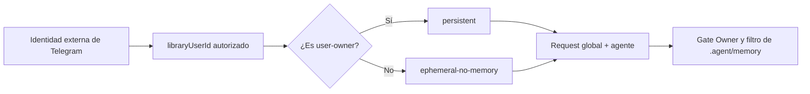

Validaciones de esta iteración:

- Tests dirigidos de `useTelegramAgentBridge.test.ts`, `useTelegramAgentBridge.integration.test.ts` y `chatScopedAgentRuntime.test.ts`: 93 tests.
- `npm test -- --run`: 121 archivos y 683 tests.
- `npx tsc --noEmit`.
- `npm run lint`.
- `npm run build -- --minify=false`: 5853 módulos; permanecen únicamente warnings existentes de chunks, importaciones y tamaños.
- `cargo fmt --manifest-path src-tauri/Cargo.toml -- --check`.
- `cargo check --manifest-path src-tauri/Cargo.toml --tests`; permanecen únicamente warnings existentes de Rust.

La validación pendiente es manual: probar en Telegram real una sesión Owner, una sesión no Owner, la lectura/guardado de memoria y el rechazo de rutas bajo `.agent/memory/`. No se afirma que Telegram real haya sido probado.

### Alcance y adaptadores

El motor común cubre el chat principal, los chats desplegables, Meeting, Telegram y la publicación de Task Manager. `notiaChatRuntime.ts` es la fachada de ejecución y `globalAiChatRuntime.ts` valida el envelope versionado (`libraryId`, `requestId`, actor `libraryUserId`, canal/superficie, snapshot, scope solicitado, política de persistencia y prompt) antes de delegar en `runNativeToolAgent`. Los adaptadores conservan sus transportes y presentaciones —UI local, stream publicado y HTML de Telegram—, pero comparten prompt, catálogo, rondas, aclaraciones, confirmaciones, cancelación, deduplicación y verificación. Meeting usa `appSurface: 'meeting'`, `ephemeral-no-memory` y solo lectura; Telegram deriva `persistent` solo para el actor autorizado `user-owner` y usa `ephemeral-no-memory` para los demás; la publicación deriva el actor de la sesión autenticada y proyecta solo Task Manager.

Multichat queda fuera de este contrato: mantiene su adaptador plano de Ollama, sin `createGlobalAiAgent`, `runGlobalAiChat`, tools, búsqueda web, mutaciones, planes, aclaraciones, confirmaciones ni memoria global. Sus prompts, dinámica, contexto adicional e historial efímero siguen siendo contenido no confiable y no otorgan permisos.

### Prompt default, intención y continuidad

`DEFAULT_AGENT_PROMPT` es un prompt breve, natural y rioplatense: responde la pregunta actual sin imponer resumen, pendientes ni próximo paso. Es la fuente de verdad inmutable y la fuente de ejecución cuando la selección es `default.md`. La opción sigue siendo virtual para la ejecución, pero `ensureAgentPromptFile` mantiene además `.agent/promps/default.md` como visualizador sincronizado: garantiza la carpeta, lo crea cuando falta y escribe el contenido exacto de `DEFAULT_AGENT_PROMPT` cuando el archivo falta o difiere. Por lo tanto, un `default.md` legacy o personalizado puede sobrescribirse; no es una fuente de configuración editable.

`listAgentPrompts` agrega siempre `default.md` a la lista y, al inicializar, deja ese archivo sincronizado. `loadAgentPrompt` devuelve `DEFAULT_AGENT_PROMPT` para esa selección sin usar el contenido persistido como prompt de ejecución; solo usa como prompt el contenido de un `.md` alternativo cuando su nombre fue seleccionado explícitamente. Un alternativo inexistente, ilegible o vacío vuelve al prompt embebido y nunca se sobrescribe durante la sincronización de `default.md`. Los nombres vacíos, con separadores de ruta o con otra extensión se normalizan a la selección virtual `default.md`, evitando traversal. La selección se persiste por biblioteca. Las reglas administradas mantienen la misma política: una aclaración no autoriza una mutación y una lectura no se presenta como acción ejecutada. La memoria legacy se migra por separado con backup local versionado.

El flujo de inicialización es: crear `.agent/`, `promps/`, `dynamics/`, `skills/` y la estructura de memoria; leer `promps/default.md`; crearlo si falta; escribir `DEFAULT_AGENT_PROMPT` si el contenido no coincide; y continuar con el mantenimiento de reglas y memoria. Si la escritura de sincronización falla, `ensureAgentPromptFile` lanza un error seguro y no presenta la inicialización como exitosa. El procesamiento de confidencialidad recorre los archivos Markdown, Markdown extendido y texto de `.agent`, pero omite específicamente `promps/default.md` para que el visualizador no vuelva a diferir del prompt canónico. La sincronización del default no sobrescribe prompts alternativos; el recorrido general de confidencialidad puede reserializar su metadata `contexto` cuando sea necesario, sin convertirlos en fuente de ejecución. No hay migración de base de datos: el cambio afecta archivos de la biblioteca y es repetible.

La implementación está en `src/services/ai/agentPromptRuntime.ts` y sus regresiones en `src/services/ai/agentPromptRuntime.test.ts`. El contrato no cambia la selección persistida ni el catálogo: `default.md` continúa apareciendo como opción virtual, pero su archivo ahora queda disponible para inspección y edición visual con el contenido canónico restaurado en la siguiente inicialización.

`agentIntentEngine` clasifica el siguiente flujo, pero nunca concede permisos ni escribe. Reconoce `analysis`, `comparison`, `continue`, `search`, lectura, propuesta/aplicación de edición, creación, organización, ejecución, aclaración, cancelación y undo; marca como compuesto el análisis de salarios frente a IPC y los escenarios de factibilidad presupuestaria que combinan alquiler/pago, sueldo o ingreso y ahorro —incluidos objetivos expresados en dólares—. Las referencias conversacionales solo reutilizan evidencia verificada y, si el objetivo sigue ambiguo, solicitan aclaración. En pedidos compuestos, una lectura terminal se conserva como evidencia intermedia y la ejecución continúa con las herramientas necesarias; solo un resultado terminal no reintentable y no intermedio cierra la operación.

### Catálogo, contratos y mutaciones

`buildChatAgentTools` proyecta el catálogo por scope, publicación, canal y `readOnly`; Finanzas excluye `search_web`, la publicación expone únicamente Task Manager y Telegram con Finanzas habilitadas excluye las herramientas de planes. Las descripciones de cada tool son parte del contrato operativo: indican fuente de verdad, campos obligatorios, límites, si devuelven evidencia acotada y que no permiten afirmar datos ausentes. Cada llamada vuelve a comprobar actor, biblioteca, contexto, scope, recurso y autorización en el runtime; una descripción del modelo nunca es permiso.

Las mutaciones siguen el mismo flujo en todos los adaptadores: resolución de datos y autorización, preview o resumen concreto, confirmación individual, ejecución idempotente cuando existe `operationId`, relectura/verificación del resultado persistido y respuesta terminal segura. Cancelar, rechazar, validar una entrada incompatible, detectar conflicto u obtener un error de almacenamiento no se comunica como éxito. Las mutaciones financieras de Telegram conservan una única confirmación visible por mutación, sin una segunda confirmación reforzada.

### Finanzas locales y salarios

Las consultas locales de Finanzas se enrutan a tools tipadas y nunca a `search_web`. `list_finance_salaries` sin `from`/`to` devuelve como máximo los tres recibos más recientes, ordenados por `paymentDate` descendente y luego `period` descendente. Para rangos, años y comparaciones se usan `from` y/o `to` inclusivos en `YYYY-MM`; el resultado se conserva como conjunto filtrado y no se presenta como inventario completo si la fuente está limitada o truncada. Campos faltantes se muestran como faltantes, las monedas ARS y USD no se mezclan y los importes no se inventan.

El análisis de salarios contra inflación es compuesto: primero lee salarios locales y luego consulta `get_finance_inflation_indices` en ArgentinaDatos. La comparación exige doce índices mensuales alineados y el índice interanual del período vigente; si faltan datos, monedas compatibles o períodos, muestra que la comparación no está disponible en vez de estimarla. La UI conserva la evolución completa disponible, equivalentes ARS/USD calculados con cotización oficial histórica, tooltips accesibles, variación del período anterior e indicadores frente a IPC acumulado e inflación interanual. Los límites de las lecturas y cualquier truncamiento siguen siendo parte del resultado.

Los escenarios de factibilidad presupuestaria siguen el mismo contrato compuesto: por ejemplo, una consulta sobre alquilar pagando un importe mensual y ahorrar USD por mes con el sueldo no termina al listar los salarios. `agentIntentEngine` devuelve `intent: 'analysis'`, `isCompound: true` y la razón `budget-feasibility-analysis`; la clasificación es una guía de coordinación y no autoriza lecturas ni mutaciones. `notiaChatRuntime` conserva `list_finance_salaries` como evidencia intermedia y, si están en el catálogo, indica continuar con `get_finance_dashboard` para gastos, compromisos y saldos locales y con `get_finance_dollar_quotes` cuando la conversión del objetivo en USD sea necesaria. La respuesta debe separar importes registrados, objetivos declarados y estimaciones; si faltan datos críticos, informa el límite en lugar de afirmar viabilidad o inviabilidad. Telegram usa esta misma coordinación cuando tiene habilitadas las herramientas de Finanzas.

### Búsqueda web pública

`search_web` se ejecuta sin confirmación adicional porque es una lectura pública y no modifica la biblioteca. `classifyWebSearchNeed` distingue pedidos explícitos y de frescura; cuando el catálogo ofrece la tool, la operación no puede terminar una consulta actual sin una búsqueda exitosa. Antes de llegar al adaptador, la consulta se normaliza y bloquea secretos, credenciales, PII, rutas privadas y datos financieros, médicos o laborales sensibles. Los títulos, snippets y URLs devueltos también se sanitizan; las páginas son contenido no confiable y no pueden cambiar el scope ni autorizar acciones.

Las citas deben usar exclusivamente URLs devueltas por `search_web`; no se inventan URLs, medios ni citas numeradas. Dentro de una operación, la identidad se normaliza con consulta decodificada y minúsculas, filtros de frescura/resultados y dominios ordenados; una búsqueda duplicada reutiliza su resultado sin red. El máximo es de seis búsquedas únicas por operación: el contador incluye búsquedas con error, canceladas y respuestas vacías. La séptima identidad nueva recibe `web-search-limit-reached`; los errores de proveedor, timeout, consulta bloqueada y ausencia de evidencia se traducen a mensajes concretos y seguros.

### Telegram y feedback operativo

Telegram mantiene un único mensaje de progreso editable por solicitud. Comienza con «Solicitud recibida y en proceso» y, tras la primera señal de thinking, cambia a etiquetas naturales como preparación, lectura, búsqueda pública, organización, ejecución o verificación. No muestra thinking crudo, nombres internos, argumentos, rutas ni datos privados; las aclaraciones y confirmaciones usan mensajes separados. Los errores se escapan al HTML permitido y comunican cancelación, timeout, proveedor no disponible, falta de datos, falta de evidencia o autorización insuficiente de forma concreta. Los eventos obsoletos o de otra request se descartan y las actualizaciones intermedias se limitan para no saturar Telegram.

### Validación y pendientes técnicos

La iteración de continuidad de escenarios de presupuesto desde Telegram pasó estas validaciones automatizadas:

- Tests dirigidos de la clasificación y el runtime: 20/20.
- Tests de continuación del agente: 24/24.
- `npm test -- --run`: 121 archivos y 681 tests.
- `npx tsc --noEmit`.
- `npm run lint`.
- `npm run build -- --minify=false`: 5853 módulos; permanecen warnings existentes de chunks, importaciones dinámicas y tamaños.
- `cargo fmt --manifest-path src-tauri/Cargo.toml -- --check`.
- `cargo check --manifest-path src-tauri/Cargo.toml --tests`; permanecen warnings existentes.
- `git diff --check`.

Las regresiones de `agentIntentEngine.test.ts` cubren la clasificación de una consulta de alquiler/pago/ahorro como análisis compuesto y conservan `authorizesAction: false`. Las de `notiaChatRuntime.test.ts` comprueban que el runtime marque el pedido como compuesto y agregue la continuación con `get_finance_dashboard`, manteniendo la cotización en el prompt cuando está disponible. La validación manual de Telegram real, incluida una consulta financiera compuesta, sigue pendiente; no se afirma validación manual de Telegram ni de la UI real.

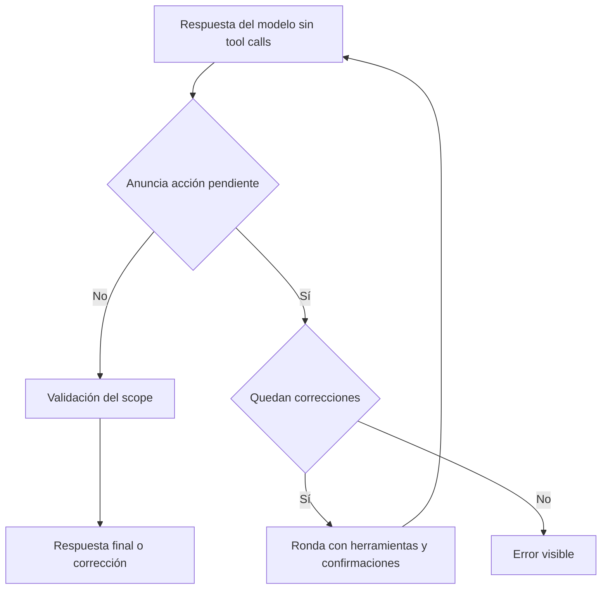

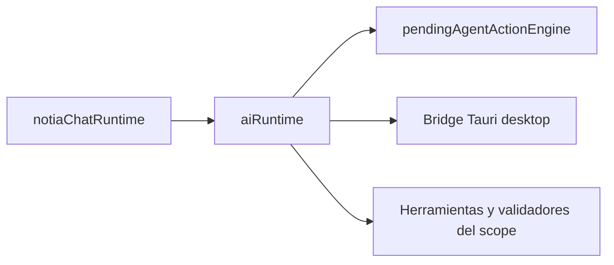

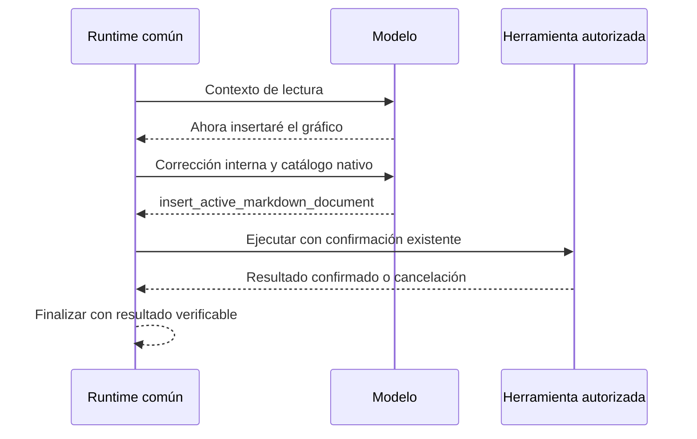

El watcher de desarrollo de Tauri usa `src-tauri/.taurignore` para excluir `.gradle/`, `.kotlin/`, `.cxx/` y `.externalNativeBuild/` a cualquier profundidad, y las carpetas `build/` dentro de `gen/android/` y `vendor/`. Gradle modifica locks, índices y salidas durante sus tareas; observar esos archivos puede provocar reinicios continuos del desktop aun cuando Cargo no recompila código. La importación Java/Gradle de VS Code también procesaba el ejemplo Android del submódulo `vendor/llama.cpp`, eliminado junto con Qwen3-ASR; las reglas siguen cubriendo cualquier profundidad dentro de `gen/android/` y `vendor/`. Las fuentes Kotlin/Java/C++/Rust, `AndroidManifest.xml` y scripts Gradle permanecen observados. Vite ya excluye `src-tauri/**`; este ajuste corresponde al watcher nativo, no al HMR de React. Reiniciar el proceso `tauri dev` después de cambiar estas reglas. Se utiliza el mecanismo oficial [.taurignore de Tauri](https://v2.tauri.app/develop/#reacting-to-source-code-changes).

Regresión: `node --test scripts/tauri-watcher.test.mjs` comprueba cachés de Gradle y salidas nativas a cualquier profundidad dentro de `gen/android/` y `vendor/`, y que las fuentes/configuración no queden excluidas. La validación en Windows con Tauri CLI 2.10.1 reprodujo los reinicios por `vendor/llama.cpp/examples/llama.android/.gradle/`; tras ampliar las reglas, el PID de Notia se mantuvo estable durante más de un minuto mientras Gradle continuaba escribiendo en esa caché. Actualizar únicamente la fecha de modificación de `tauri.windows.dev.conf.json` provocó el reinicio esperado, confirmando que la recarga de configuración continúa activa. La prueba de regresión y su lint aprobaron.

## XGraph: JSXGraph en Milkdown

Los errores del iframe ocupan una franja en el flujo Flex encima del tablero, sin superposición. El tablero conserva el espacio restante y recorta sus elementos al contenedor para que las etiquetas JSXGraph no se dibujen sobre el aviso. La franja anuncia el fallo con `role="alert"`, advierte que la construcción puede estar incompleta y ofrece el detalle técnico mediante `details/summary`, con objetivo de 48 px y foco visible. Su altura máxima es la mitad del iframe, con scroll para mensajes largos; el contenido se asigna con `textContent`. Editar el código reconstruye el iframe y descarta el aviso anterior. Se conserva el ResizeObserver propio de JSXGraph para adaptar el tablero al espacio disponible.

La presentación del error se verificó en Chromium a 1100×850, 390×600 y 720×360: conserva el gráfico parcial, no superpone el aviso, admite detalle por toque/Enter, mantiene al menos la mitad del espacio para el tablero ante mensajes largos y elimina el error al corregir el código. También se comprobó que HTML dentro del mensaje se muestra como texto. Build frontend, 259 pruebas y lint de los archivos afectados aprobados; sigue pendiente la comprobación en tableta Android física.

`MarkdownView` agrega XGraph al grupo avanzado y delega los bloques `xgraph`/`jsxgraph` a `xgraphEngine`. Se conserva el nodo `code_block`, su serialización Markdown y el toggle nativo Hide/Edit usado por Math. No cambia ningún DTO ni comando Tauri. La exportación estática conserva el código.

El agente recibe `XGRAPH_AGENT_GUIDE` (`services/ai/xgraphAgentPrompt.ts`) al construir el prompt común en `buildChatAgentSystemPrompt`, después del prompt elegido y antes de las reglas y restricciones del scope. Incluye sintaxis `xgraph`/`jsxgraph`, variables disponibles, ejemplos de puntos, funciones y slider, Hide/Edit, persistencia, aislamiento y límites reales. El límite de fuente se toma del motor puro. El mapa de módulos de `DEFAULT_AGENT_PROMPT` también identifica XGraph. La guía se agrega en memoria en cada conversación, incluso con un `default.md` que acaba de sincronizarse, agentes personalizados y scopes publicados; no requiere migrar ni reescribir los prompts alternativos. No agrega tools, permisos ni un motor conversacional; Telegram mantiene HTML en sus respuestas y usa Markdown únicamente como contenido de archivos. Las pruebas de composición cubren los cinco scopes con un prompt personalizado y el formato Telegram.

`xgraphEngine` reconoce lenguajes sin distinguir mayúsculas, limita la fuente a 100.000 caracteres y genera un placeholder con código URI-encoded. `xgraphPreviewRuntime` observa exclusivamente la raíz del editor, espera visibilidad con margen de 200 px y difiere 300 ms el montaje para cancelar renders obsoletos al escribir. Al eliminar/reemplazar el bloque o cerrar el editor desconecta observadores, cancela temporizadores y elimina el iframe. El runtime y la hoja de estilos se empaquetan como recursos separados y el iframe los carga por URL: no se copia el megabyte de JSXGraph al `srcdoc` y su parseo queda diferido hasta que el gráfico es visible.

Milkdown sanitiza los placeholders. El adaptador monta después un iframe con `sandbox="allow-scripts"`, sin `allow-same-origin`, con origen opaco y CSP propia (`default-src 'none'`, `connect-src 'none'`, scripts con nonce y evaluación interna). El JavaScript de la nota se pasa como string JSON con `<` escapado a una función dentro de ese iframe, nunca se evalúa en la aplicación. El contrato ofrece `board`, `JXG` y `BOARDID = 'box'`. Los errores se muestran mediante `textContent`, sin registrar contenido privado. No habilitar Tauri, navegación superior, ventanas emergentes, formularios ni red en este sandbox.

La dependencia directa `jsxgraph@1.13.2` (MIT o LGPL-3.0-or-later) implementa geometría interactiva sin dependencias runtime adicionales; se utiliza bajo MIT. Su distribución oficial se empaqueta como un recurso JavaScript separado y se carga exclusivamente dentro del sandbox cuando el gráfico entra en la zona visible, funcionando offline en Chromium/WebView de Windows y Android. El recurso ocupa aproximadamente 1.024 kB (260 kB gzip) y no se copia al documento principal ni al `srcdoc`. No se modifican archivos de la dependencia. Referencia: [JSXGraph Getting Started](https://jsxgraph.org/home/start/gettingstarted/).

Los controles propios y de navegación del tablero tienen objetivos de 48 px; el iframe tiene ancho fluido y altura entre 280 y 520 px basada en `dvh`. El paneo requiere dos dedos para evitar apropiarse del gesto normal de scroll. Hide/Edit no reconstruye el tablero. Los cambios del tablero no se escriben en el `.md`: únicamente persiste la fuente. El límite de caracteres no limita la CPU de JavaScript arbitrario; grandes construcciones y bucles infinitos siguen siendo una limitación. Queda pendiente medir memoria, tiempos y gestos sobre tableta Android física de gama media.

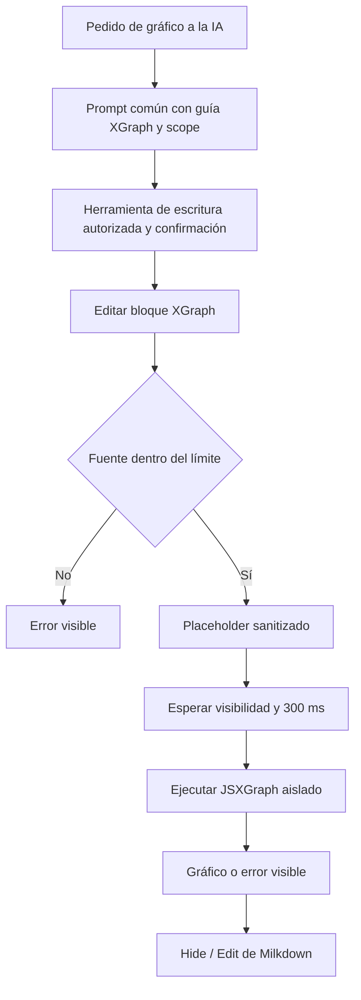

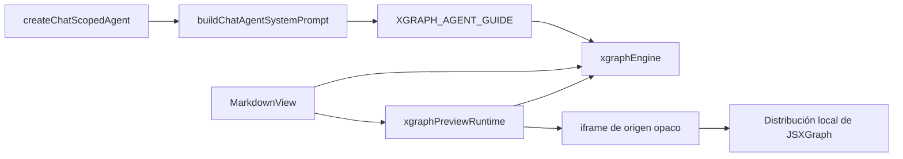

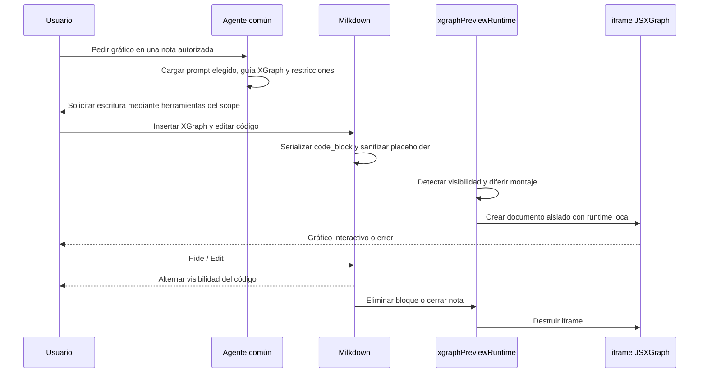

Evaluación de cohesión, arquitectura y calidad para esta extensión: motor puro y adaptador de DOM separados, dependencia dirigida desde la vista y sin ciclos nuevos. No agrega estado Redux ni lógica al backend. Las pruebas del motor cubren contrato de lenguaje, preservación del código, límites e inyección de etiquetas. El montaje requiere validación de navegador; el iframe impide acceso al host pero no es una cuota de CPU ni memoria. La construcción del HTML permanece centralizada para revisar su frontera de seguridad.

Validación de aquella incorporación: build frontend y 233 pruebas aprobadas; lint de los archivos afectados aprobado. Chromium con `MarkdownView` real verificó render, Hide/Edit, edición/serialización, errores, bloqueo de acceso al documento padre, desmontaje y toque a 390 px de ancho. En esa validación histórica el lint global registró 24 errores y 9 advertencias ajenos a XGraph; el estado actual de lint se registra en la validación de cada iteración. Android arm64 compiló la biblioteca nativa de depuración; el empaquetado falló al crear el symlink de `libnotia_lib.so` por falta de privilegios de Windows. El script `build:android:debug` falla antes en su invocación de `npx.cmd`; se verificó invocando directamente el CLI JavaScript de Tauri. No se instaló la app ni se verificó en dispositivo físico.

> Documentación técnica orientada a ingenieros de software.  
> Stack: React 19 + TypeScript 5.9 + Vite 7 + Redux Toolkit + MUI v7 + Tauri v2 (Rust 2021).

### Estado actual del runtime de IA

#### Contrato global, identidad y autorización vigente

`globalAiContract.ts` define la versión 1 del envelope común para los canales `app`, `public-url` y `telegram`. Cada request exige `libraryId`, `requestId`, `actor.libraryUserId`, `source`, `WorkspaceAiSnapshot`, `requestedScope`, `persistencePolicy` y el prompt. La app usa el actor Owner estable `user-owner`; Telegram conserva `userId` y `chatId` únicamente como `externalIdentity`; la URL pública deriva el actor de la sesión HTTP autenticada en Rust y nunca acepta `actorUserId` del navegador.

`notiaChatRuntime.ts` es la fachada única de ejecución. Los adaptadores conservan sus transportes —UI local, NDJSON/streaming publicado y formato HTML de Telegram—, pero comparten ciclo de tools, aclaraciones, confirmaciones, planes, cancelación y validación; la excepción es Telegram con `enableFinanceTools`, cuyo catálogo retira las herramientas de planes para limitar el turno financiero a una mutación confirmada. La URL pública usa la proyección estricta `published-task-manager`: solo expone capacidades de Task Manager y solo incorpora tickets con metadata válida cuyo tablero pertenece a la selección publicada. `scopePaths`, IDs y nombres recibidos del navegador son hints de UX; el host reconstruye el universo desde la biblioteca y Rust revalida board, ticket, contexto, revisión y operación antes de persistir. Documentos generales, Graph View y Finanzas quedan fuera de esa proyección.

`aiAuthorizationEngine.ts` normaliza contextos sin prefijos ni coincidencias parciales; un recurso sin `contexto` cae en `#Personal`. El catálogo se filtra antes de enviarlo al modelo y cada tool se autoriza de nuevo al ejecutarse. Owner tiene todos los contextos; los demás usuarios solo tienen los tags persistidos en `library_user_contexts`. Todas las tools financieras, incluido el snapshot completo, las lecturas paginadas o por ID, el CRUD, las bajas, la reversión, la limpieza, las cotizaciones, inflación, históricos, patrimonio, comprobantes y extracción, exigen `#Confidencial` tanto para leer como para escribir. La memoria de `.agent/memory/` se hidrata únicamente para `user-owner` cuando la política es `persistent`; las reglas operativas se cargan desde la biblioteca según el agente construido. Meeting, Graph View, Multichat y la publicación no crean ni hidratan memoria global. Telegram deriva la política desde el `libraryUserId` autorizado, la propaga al envelope y a `createGlobalAiAgent`, y filtra las rutas de memoria y sus tools para cualquier actor distinto de `user-owner`.

La publicación usa sesiones server-side con expiración de 12 horas. Vencer una sesión, revocar o eliminar el usuario, cambiar sus contextos, cambiar de biblioteca o detener/republicar cancela requests del host, streams de IA y WebSockets asociados. Finanzas conserva el `actorLibraryUserId` estable y el canal `app`, `public-url` o `telegram` en el `FinanceContext` y en las mutaciones cubiertas; el ID numérico de Telegram permanece separado como identidad externa histórica. Las mutaciones financieras de Telegram no se auto-confirman: usan una única confirmación visible por mutación, ejecución y resultado verificable; la segunda confirmación reforzada queda reservada a los canales que la solicitan.

Los rechazos usan errores seguros como `missing-actor`, `invalid-source`, `unauthorized-context`, `unauthorized-tool`, `session-revoked`, `library-mismatch` y `resource-not-found`, sin revelar existencia, rutas, títulos, snippets, saldos ni metadata protegida.

Validación registrada para una iteración anterior del runtime: `npm test` pasó con 115 archivos y 606 tests, junto con `npm run lint`, `npm run build -- --minify=false` (5843 módulos), `cargo fmt --manifest-path src-tauri/Cargo.toml -- --check`, `cargo check --manifest-path src-tauri/Cargo.toml --tests` y `git diff --check`. Permanecen warnings existentes de bundles/tamaños del build y de código Rust no usado. Quedan pendientes las validaciones manuales de UI, Telegram real y Android/SAF; la validación vigente de Multichat se registra en su sección.

Las ediciones del documento activo cuentan con `propose_document_edit` y `apply_document_edit` para separar preview de escritura. Los aliases `replace_active_markdown_document` e `insert_active_markdown_document` también calculan un `MutationPreview` con hunk acotado y una revisión esperada derivada de la fuente activa cargada; después de la confirmación vuelven a cargarla y rechazan la escritura si la revisión más reciente difiere. Todas las mutaciones registran un `operationId` idempotente y notifican al editor mediante `onActiveMarkdownDocumentChanged`. `undo_ai_operation` usa un journal en memoria y rechaza restaurar si el documento cambió después; el journal no persiste contenido privado ni habilita restauración ciega.

El catálogo común incorpora `search_library_exact`, `get_document_metadata` y `find_document_references`. Las búsquedas devuelven únicamente coincidencias, rutas, líneas y metadata autorizada; la búsqueda exacta no incorpora el cuerpo completo al resultado. `validateDocumentEdit` rechaza fences, fórmulas, enlaces estructurales rotos y cambios de frontmatter en una mutación de cuerpo.

Meeting construye el agente con `ephemeral-no-memory`, por lo que no carga ni persiste memoria global. Los planes visibles se guardan como metadata mínima y acotada por biblioteca para poder reconstruir el TO-DO visual tras una reapertura controlada. El feedback admite `progressMode`, `showPlan`, `showReasoningSummary` y `editProgressMessage`; Telegram descarta eventos obsoletos por request/timestamp, informa la posición de cola y nunca transmite thinking crudo. En Telegram la request y el agente construido por `useTelegramAgentBridge` reciben `persistent` solo cuando el `libraryUserId` autorizado es `user-owner`; los demás reciben `ephemeral-no-memory` y quedan fuera de la memoria global.

La clasificación de intención (`engines/ai/agentIntentEngine.ts`) decide únicamente si el siguiente flujo debe responder, leer, buscar, analizar, comparar, continuar, aclarar, proponer/aplicar una edición, crear, organizar o ejecutar; nunca concede permisos ni escribe. Las solicitudes compuestas reciben una instrucción para crear un plan general con dependencias, riesgo y herramienta prevista. El motor de diff separa cambios en hunks con anchors estables y el runtime expone aliases para selección/bloque, movimiento de bloques, actualización de frontmatter, creación desde plantilla, patch multi-hunk y `verify_operation`. La memoria activa es `.agent/memory/memory.md`; `chat/LongTermMemory.md` se conserva solo para compatibilidad y ya no es fuente de lectura/escritura activa. Las requests durables de Telegram eliminan el prompt original antes de serializar metadata; el scheduler del cache de enlaces difiere rebuilds mientras la aplicación está oculta y los retoma al volver al frente.

El listado de modelos, la inspección de capacidades, health y las rondas desktop pasan por comandos Tauri; el WebView no usa `/api/tags`, `/api/show` ni `/api/chat` de Ollama. Android tiene comandos versionados para rondas con tools y búsqueda web (`toolChat` y `webSearch` del plugin), y `AiBridgePlugin.kt` versionado para health, modelos, chat, streaming NDJSON, tools, búsqueda y cancelación; la validación Gradle/dispositivo sigue pendiente de plataforma. La búsqueda web nunca recibe snapshot, historial, memoria, rutas o contenido de archivos y bloquea secretos, credenciales, PII y datos sensibles antes del adapter. La configuración portable de biblioteca, Redux y localStorage conservan la configuración de IA sin API key; la credencial queda en memoria de sesión hasta la frontera nativa. El almacenamiento seguro nativo persistente entre reinicios sigue pendiente. El catálogo de tickets admite filtros por estado, prioridad, grupo, fechas, tags y texto de metadata, y persiste dependencias/checklist como campos controlados del frontmatter.

### Enrutamiento financiero local y control de rondas

El motor global distingue las consultas financieras locales antes de aplicar el clasificador genérico de frescura. `isLocalFinanceRequest` normaliza mayúsculas y acentos, reconoce vocabulario de Finanzas —incluidos sueldos, salarios, haberes y recibos— y trata como locales esas consultas salvo que pidan noticias, actualidad o fuentes públicas. Una negación explícita de búsqueda web también conserva el enrutamiento local. Esta detección solo agrega una indicación de coordinación: no autoriza herramientas ni reemplaza la validación de actor, contexto o permisos.

El flujo completo es:

1. `notiaChatRuntime` detecta si el catálogo del agente contiene herramientas de lectura financiera y clasifica el pedido con `isLocalFinanceRequest`.
2. Para una consulta local, agrega al prompt la instrucción de usar la herramienta financiera tipada más específica y no usar `search_web`. Si el agente universal de Telegram fue construido con `enableFinanceTools`, aplica la misma regla aunque también tenga herramientas de biblioteca y búsqueda pública.
3. Para «mis últimos sueldos», «sueldos cargados» o «recibos de sueldo», la instrucción dirige directamente a `list_finance_salaries`, cuya entrada admite filtros opcionales `from` y `to`. En una consulta de factibilidad que combina alquiler/pago, sueldo o ingreso y ahorro, esa lectura no es terminal: el prompt de coordinación conserva los salarios y orienta la continuación hacia `get_finance_dashboard` y, si corresponde al objetivo en USD, `get_finance_dollar_quotes`, siempre que esas tools estén disponibles. Las noticias financieras, fuentes públicas y pedidos explícitos de actualidad mantienen el requisito de búsqueda web cuando el catálogo la ofrece.
4. `resolveFinanceToolResultAnswer` toma el resultado estructurado de `list_finance_salaries`, ordena los recibos de forma descendente por `paymentDate` y luego por `period`, y genera una respuesta terminal factual con período, empleador, neto, bruto y moneda. Sin filtros explícitos conserva solo los tres primeros; con `from`/`to` conserva el conjunto filtrado. Sin recibos devuelve `No hay recibos de sueldo cargados en Finanzas.`. En una consulta simple esta respuesta terminal cierra la operación sin otra ronda para redactar el mismo historial; en un pedido compuesto —incluida la factibilidad presupuestaria— queda como evidencia intermedia y el runtime continúa con las lecturas requeridas.

Para este escenario, el flujo de extremo a extremo es: Telegram recibe la consulta en el agente universal; la clasificación identifica Finanzas local y análisis compuesto; `notiaChatRuntime` agrega la instrucción específica sin alterar autorización ni catálogo; el agente lee salarios, conserva esa evidencia y continúa con dashboard/cotización cuando corresponda; finalmente redacta una evaluación que distingue evidencia, objetivo e inferencia. No hay persistencia ni mutación derivada de esta coordinación, y la ausencia de dashboard o cotización en el catálogo no se presenta como dato obtenido.

La autorización de Finanzas continúa exigiendo `#Confidencial` y las confirmaciones de mutaciones no cambian. La respuesta terminal solo se genera para el resultado de la herramienta; los datos externos, las cotizaciones, el IPC y las fuentes públicas conservan sus herramientas y políticas existentes.

`runNativeToolAgent` mantiene un conjunto de llamadas ejecutadas durante cada operación y, para las tools generales, construye la clave con el nombre de la herramienta y la serialización JSON exacta de sus argumentos. Una llamada idéntica no vuelve a ejecutar el adaptador: devuelve un resultado seguro `{ ok: false, changed: false, error: 'repeated-tool-call', code: 'validation', retryable: false }` y agrega una corrección interna para que el modelo use los datos ya disponibles. La deduplicación general de tools es de identidad exacta de llamada dentro de la operación; `search_web` es la excepción documentada en «Búsqueda web pública» y usa su clave normalizada específica, no la serialización JSON exacta.

El límite conversacional predeterminado es `CHAT_AGENT_MAX_ROUNDS = 16` y `notiaChatRuntime` lo aplica cuando la superficie no proporciona `maxRounds`. El límite explícito recibido por una superficie sigue siendo respetado dentro de los límites del runtime. La recuperación de respuestas vacías, las correcciones por promesas sin tool call, las confirmaciones y la autorización permanecen vigentes; la deduplicación y la reducción del límite solo evitan ejecuciones repetitivas.

Pruebas y validaciones registradas en la iteración anterior de este bloque:

- `npm test`: 121 archivos y 644 tests aprobados.
- `npm run lint`: aprobado.
- `npm run build -- --minify=false`: aprobado; permanecen únicamente warnings existentes de chunks, importaciones dinámicas y tamaño.
- `npx eslint` sobre los archivos afectados: aprobado.
- `git diff --check`: aprobado.

Las regresiones de ese bloque cubrieron el reconocimiento de Finanzas local frente a búsqueda pública, el historial de sueldos y su respuesta terminal, el catálogo universal de Telegram, las llamadas duplicadas y el límite/flujo global. La validación vigente, con 681 tests y el resto de comandos, está registrada en «Validación y pendientes técnicos» al inicio de este documento.

---

### Control integral de Finanzas mediante tools de IA

El scope `finance` y el agente universal de Telegram cuando `enableFinanceTools` está habilitado exponen un catálogo tipado común en `chatScopedAgentRuntime.ts`. La autorización se aplica antes de entregar el catálogo y nuevamente al ejecutar cada llamada; la URL pública continúa fuera de Finanzas.

#### Lecturas completas, paginadas y por ID

`get_finance_full_snapshot` reúne en paralelo el dashboard del mes indicado, todos los movimientos y movimientos de ahorro disponibles, servicios, ocurrencias, versiones de ocurrencias, facturas, compras, sueldos, resúmenes de tarjeta, precios, cuotas, inversiones, auditorías, patrimonio, historial patrimonial y artefactos. Las lecturas completas de movimientos y ahorro usan los comandos nativos `finance_list_all_transactions` y `finance_list_all_savings_movements`; los servicios de ocurrencias y versiones usan además `finance_list_all_service_occurrences` y `finance_list_all_service_occurrence_versions`. El resultado conserva los campos normalizados y separa `allMovements`, `allSavingsMovements`, `serviceOccurrences`, `serviceOccurrenceVersions` y el resto de las colecciones.

`list_finance_records` admite entidades financieras explícitas, filtros de mes/período/fechas/estado/actividad, `occurrenceId` o `planId`, y devuelve `{ items, total, limit, offset, hasMore }`. El límite solicitado se acota entre 1 y 200 y el offset nunca es negativo. Sin `month`, movimientos y ahorro usan las lecturas completas nativas; con `month` usan el dashboard del período. Las fuentes nativas acotan las lecturas completas a 5.000 movimientos y 5.000 movimientos de ahorro; otras consultas conservan sus límites propios (por ejemplo, compras, facturas, precios y lecturas históricas). Por eso `hasMore` describe la colección recibida por el runtime y no convierte una fuente nativa limitada en un inventario ilimitado. `get_finance_record` obtiene directamente un movimiento por ID; para las demás entidades resuelve sobre una lectura de hasta 200 elementos. Un ID ausente devuelve `notFound` y una entidad desconocida devuelve un error seguro que solicita aclaración.

Los wrappers TypeScript de `financeService.ts` conservan `FinanceContext` con `libraryPath`, URI SAF opcional, `actorLibraryUserId` y `source`, y delegan las lecturas completas en los nuevos comandos registrados en `src-tauri/app/src/registry.rs`. Los DTO se serializan en `camelCase`. Las lecturas nativas validan biblioteca y actor antes de abrir SQLite; no reciben SQL ni credenciales del modelo.

Esta ampliación no agrega una migración SQLite ni cambia el formato persistido: los comandos nuevos son lecturas sobre las tablas existentes y mantienen compatibilidad con las bases ya migradas. Los temporaries y lifetimes de Rust quedan acotados a la conexión y a cada iterador de filas antes de devolver los DTO; `cargo check` y la compilación de tests nativos validan ese contrato, pero no sustituyen la ejecución manual del flujo.

#### CRUD, reversión, limpieza y extracción

Las tools `save_finance_*` permiten crear o actualizar, con un ID estable, cuentas, categorías, movimientos, reservas y movimientos de ahorro, intercambios de ahorro, tickets, sueldos, resúmenes de tarjeta, planes de cuotas, inversiones, servicios, ocurrencias y facturas. Cada guardado muestra un preview acotado y requiere confirmación individual; en los canales que aplican la política reforzada puede haber una segunda confirmación, pero Telegram queda en una sola confirmación visible por mutación. El guardado de sueldos realiza además una lectura nativa independiente antes de informar éxito. `reverse_finance_transaction` vuelve a guardar el movimiento con estado `discarded`, conserva el registro y exige un motivo de hasta 500 caracteres. `delete_finance_record` solo acepta `transaction`, `account` o `category`: el movimiento usa baja lógica y cuenta/categoría pasan a inactivas. `clear_finance_data` elimina todo el dominio financiero dentro de una transacción nativa, sincroniza el contexto y recrea las categorías iniciales; es irreversible y requiere una confirmación explícita de alcance total.

`extract_finance_document` admite `ticket`, `salary`, `credit_card_statement` y `service_invoice`. Requiere una confirmación visible —reforzada cuando corresponde al canal—, valida el artefacto y la ruta en el backend nativo y guarda únicamente un resultado revisable: no crea ni actualiza entidades financieras automáticamente. Los errores se devuelven como resultados seguros, diferenciando validación, ausencia, conflicto o almacenamiento sin exponer detalles internos.

Después de un guardado o reversión elegible con `ok: true` y `changed: true`, el runtime ejecuta una única auditoría consolidada del período detectado. Si la auditoría falla, el dato ya persistido se conserva y el resultado queda pendiente de reintento. La confirmación rechazada no ejecuta la mutación ni dispara la auditoría.

#### Fecha de carga y compatibilidad del contrato

En los DTO de recibos de sueldo y resúmenes de tarjeta, `createdAt` es un dato de salida de solo lectura. TypeScript lo declara `readonly` y los tipos de entrada lo excluyen; en Rust `created_at` se serializa en `camelCase` pero tiene `skip_deserializing`, de modo que un valor enviado por el cliente se ignora. El backend obtiene el timestamp de SQLite y lo devuelve después de persistirlo. La UI lo presenta como `Cargado el DD/MM/YYYY` usando UTC. `formatFinanceLoadedDate` admite timestamps SQLite con o sin zona, fechas ISO y epochs en segundos o milisegundos; si falta o no es válido, omite la etiqueta. Esto conserva la lectura de bibliotecas históricas sin reinterpretar la fecha de carga según la zona horaria local.

#### Conciliación determinista de consumos de tarjeta con servicios

`reconcile_card_service_consumption` (Rust) y `reconcileFinanceCardServices` (TypeScript, usado para el preview) comparten un algoritmo determinista; Rust lo vuelve a ejecutar y valida antes de escribir. Solo procesa líneas `purchase` confirmadas que tengan transacción, descripción, importe positivo de hasta dos decimales, moneda compatible y fecha `YYYY-MM-DD`. La descripción se normaliza quitando acentos, compactando espacios y aplicando minúsculas. El nombre o proveedor normalizado puede coincidir con el descriptor completo o aparecer como una palabra completa dentro de él, lo que admite identificadores adicionales —por ejemplo, `MOVISTAR ARGENTINA 82997` para `Movistar`— sin aceptar subcadenas parciales como `Supermovistar`; los candidatos compuestos con espacios siguen requiriendo coincidencia completa. Cero o varias coincidencias y la moneda incompatible generan razones y `ambiguousGroups`; una línea inválida genera una razón y queda excluida, nunca se elige implícitamente.

Para cada servicio, las líneas se ordenan por `purchaseDate` y luego por `lineId`. Una sola línea se asigna al `statement.period`, no al mes de `purchaseDate`. Con exactamente dos líneas, la primera se asigna al período anterior y la segunda al `statement.period`; por ejemplo, un resumen `2026-09` con consumos del 10/08 y 10/09 produce asignaciones `2026-08` y `2026-09`. No se distribuyen automáticamente más de dos consumos, ni un par cuyo período anterior ya tenga pago, ni destinos o transacciones con vínculos incompatibles. Un grupo ya conciliado con la misma transacción e importe, comparado en centavos, devuelve `already-reconciled` y no agrega cambios; por eso formatos equivalentes como `100` y `100.00` no crean una nueva versión.

El resultado es `{ status, assignments, ambiguousGroups, reasons }`, con estados `ready`, `no-matches`, `partial` o `ambiguous` durante la proyección; al guardar puede quedar `applied` o `partial-applied`. Cada asignación conserva resumen, línea, servicio, transacción, fecha, período, importe, moneda y evidencia normalizada. Una ambigüedad se persiste como propuesta `service-card-reconciliation` dentro de la auditoría y no se aplica automáticamente por recibirla desde la UI, el chat o Telegram. Puede aplicarse después de una selección manual explícita, con confirmación individual —reforzada fuera de Telegram— y validación nativa.

La resolución manual se envía a `finance_decide_audit_proposal` mediante `resolutionAssignments`, junto con `proposalId`, `decision` y el `expectedDataFingerprint` del preview. El backend comprueba que cada línea pertenezca al mismo resumen, que transacción, fecha, importe y moneda no hayan cambiado, que el servicio sea candidato del grupo y conserve la moneda, que el período sea el del resumen (o el anterior cuando había dos líneas), y que no se repitan línea, ocurrencia destino o transacción. También vuelve a verificar que la ocurrencia y el gasto no estén ocupados de forma incompatible. Una selección inválida, modificada o fuera del preview se rechaza.

Ejemplo de decisión manual (los identificadores son opacos):

```json
{
  "proposalId": "proposal-opaco",
  "decision": "accepted",
  "expectedDataFingerprint": "fingerprint-del-preview",
  "resolutionAssignments": [
    {
      "statementId": "statement-opaco",
      "lineId": "linea-2",
      "serviceId": "service-internet",
      "transactionId": "transaction-opaca",
      "purchaseDate": "2026-09-10",
      "period": "2026-09",
      "amount": "100.00",
      "currency": "ARS"
    }
  ]
}
```

En el catálogo del agente, el paso de aplicación conserva explícitamente los valores del preview:

```json
{
  "proposalId": "proposal-opaco",
  "proposalType": "service-card-reconciliation",
  "expectedDataFingerprint": "fingerprint-del-preview",
  "decision": "accepted"
}
```

Una aplicación confirmada devuelve, entre otros campos, `ok: true`, `changed: true`, `proposalId`, `proposalType`, `period`, `decision`, `dataFingerprint` y la propuesta persistida. El runtime solo comunica éxito después de volver a leerla y verificar que su estado coincide con la decisión solicitada. Cuando la persona usuaria pidió aplicar, `runNativeToolAgent` continúa automáticamente desde el resultado del preview hacia `apply_finance_audit_proposal` en la siguiente ronda, conservando esos tres valores; el preview no se acepta como respuesta terminal ni vuelve a iniciar el mismo ciclo. La regresión correspondiente está cubierta en `src/services/ai/aiRuntime.continuation.test.ts`.

#### Persistencia atómica, idempotencia, vínculos y huellas

`finance_save_credit_card_statement` valida primero la cuenta activa `credit_card`, período, fechas, moneda, agregados por tipo y la ecuación del total, y exige `sourceReference`. Luego persiste en una única transacción SQLite el resumen, el artefacto, sus líneas y los gastos de consumos/cargos. Un error de validación, vínculo o almacenamiento impide el commit; la sincronización SAF ocurre después del commit. La unicidad `(account_id, period, currency)` evita duplicar un resumen. Repetir el mismo ID actualiza el registro y sus líneas de forma idempotente; los reintentos reutilizan enlaces existentes o crean transacciones con identificadores/fingerprints deterministas. Los pagos y créditos quedan como líneas de conciliación sin crear gastos, y `totalDue` nunca se registra como un gasto adicional.

Cada línea de compra, cargo, interés o impuesto de un resumen no pendiente queda vinculada a una `finance_transaction`; si corresponde a una compra, también se conserva `finance_purchases.service_id`. Al reconciliar, se actualizan ambos vínculos (`finance_transactions.service_id` y `finance_purchases.service_id`) y la ocurrencia queda identificada por `(service_id, period)`. Antes de reemplazar una ocurrencia ocupada con datos distintos se copia su estado en `finance_service_occurrence_versions`; un replay idéntico no crea otra versión ni cambia `created_at`. La migración v19 agrega la unicidad parcial de transacción por ocurrencia y desvincula duplicados históricos de forma determinista; la v20 agrega el historial de reparaciones explícitas de relaciones. La evidencia original y la extracción permanecen separadas de las entidades normalizadas.

Al guardar una ocurrencia directamente, `finance_save_service_occurrence` valida que la transacción exista, sea un gasto, use la moneda del servicio y tenga el mismo importe pagado al comparar centavos con `parse_cents`; también rechaza un gasto ya vinculado a otra ocurrencia. Durante el replay nativo, compara en centavos tanto el importe esperado como el pagado, por lo que `100` y `100.00` son equivalentes: conserva la ocurrencia persistida, su `created_at` y el historial sin crear una versión. Cuando existe una transacción vinculada, el mismo flujo actualiza `service_id` en `finance_transactions` y en la `finance_purchase` asociada; al reemplazar o quitar el vínculo, limpia también la compra correspondiente. Los vínculos incompatibles siguen devolviendo un error de validación y no se guardan.

La huella SHA-256 de una reconciliación incluye identidad y período del resumen, snapshot del resumen, líneas y snapshots de sus transacciones, servicios normalizados, ocurrencias y resultado calculado. Las propuestas guardan esa huella como `dataFingerprint` y la tabla impone unicidad por `ruleKey + dataFingerprint`. Antes de aceptar, Rust recalcula la huella con el estado actual; si difiere, marca la propuesta `outdated`, registra la decisión y no modifica entidades. Una aceptación válida aplica la reconciliación, registra la aceptación y las mutaciones en la misma transacción. Las propuestas pendientes que queden afectadas por una conciliación aceptada también se invalidan para evitar aplicar un preview antiguo. En particular, una propuesta `service-unpaid` pendiente se marca `outdated` cuando aparece un pago, una conciliación que cubre el período o un bloqueo/ambigüedad de conciliación que impide decidir automáticamente; así no puede descartar evidencia financiera más nueva.

#### Tools de chat, Telegram y búsqueda pública

El catálogo financiero del agente incluye snapshot (`get_finance_full_snapshot`), lecturas paginadas o por ID, consultas de resúmenes/compras/sueldos, CRUD financiero, `create_finance_credit_card_statement`, auditoría, preview y aplicación de propuestas. El scope `finance` no incluye `search_web`: las preguntas sobre datos locales usan SQLite mediante las tools financieras. Cotizaciones, IPC e históricos externos tienen tools financieras de solo lectura y sus propias fuentes; las noticias o fuentes públicas explícitas, también desde Telegram, siguen el scope de biblioteca y pueden requerir `search_web`. El sanitizador web continúa bloqueando datos privados, financieros sensibles, secretos y credenciales antes de cualquier red.

Telegram usa el agente universal de la biblioteca con `enableFinanceTools`, el `libraryUserId` estable y la identidad externa del chat solo para vinculación. Las fotos y documentos pueden aportar una referencia de origen opaca; la respuesta de Telegram informa estados observables y no thinking, argumentos ni datos sensibles. Las auditorías y conciliaciones consultan SQLite local, no `search_web`. Toda escritura financiera —incluido un resumen y su conciliación— muestra preview y una única confirmación visible por mutación; no existe auto-confirmación ni segunda confirmación reforzada en este canal. Cancelar no escribe. Tras aceptar, el runtime espera `ok:true` y el resultado nativo persistido antes de comunicar éxito; duplicados, validaciones, conflictos y fallos de almacenamiento se exponen como resultados seguros.

Límites efectivos: un resumen admite hasta 300 líneas nativas y hasta 20.000 caracteres de extracción cruda; `sourceReference` admite hasta 2.048 caracteres; solo `ARS` y `USD` son válidas; el período debe ser `YYYY-MM`, las fechas deben ser calendarios válidos y la conciliación automática procesa como máximo dos consumos por servicio. La extracción de campos no crea entidades por sí sola. Las lecturas financieras conservan sus límites documentados y no convierten una página en un inventario ilimitado.

La compatibilidad histórica se mantiene mediante las migraciones SQLite hasta v20 y la reparación idempotente de columnas `service_id` aunque la base ya haya registrado v19 o v20. La migración v20 crea el historial de reparaciones de relaciones sin reescribir los datos existentes; sus índices y tablas usan `IF NOT EXISTS` dentro de la transacción de migración. Los timestamps antiguos en epoch o formato SQLite siguen siendo legibles; `actorUserId` numérico de Telegram se conserva solo como auditoría histórica y no sustituye al actor estable `actorLibraryUserId`. El CRUD financiero Android, la extracción móvil y la integración Android/SAF siguen dependiendo de validación en plataforma.

Validación registrada para la iteración anterior de este contrato: `npm test` pasó con 115 archivos y 606 tests. También pasaron `npm run lint`, `npm run build -- --minify=false` (5843 módulos), `cargo fmt --manifest-path src-tauri/Cargo.toml -- --check`, `cargo check --manifest-path src-tauri/Cargo.toml --tests` y `git diff --check`. El build conservaba warnings existentes de bundles/tamaños y Cargo warnings existentes de código no usado; las validaciones manuales de UI, Telegram real y Android/SAF quedaron pendientes en aquella iteración.

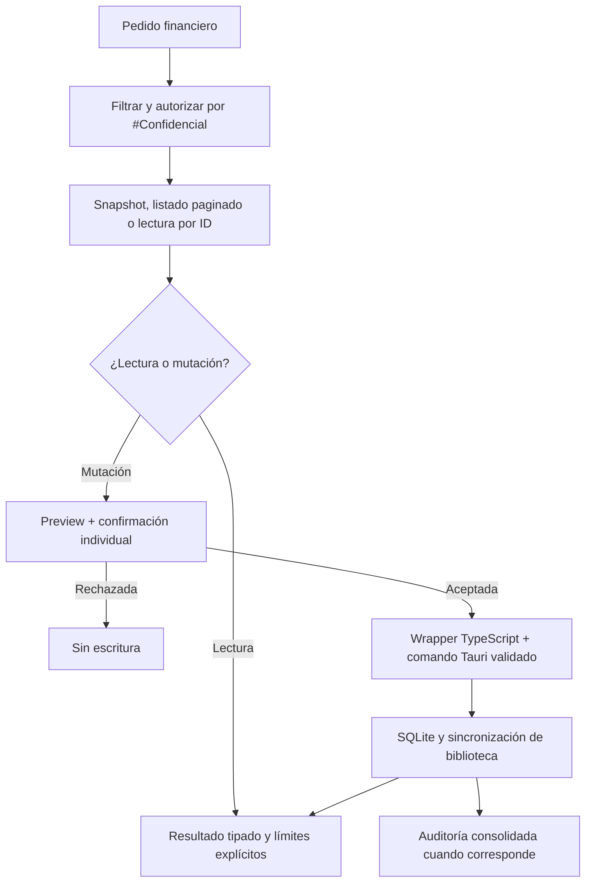

El scope financiero también conserva las consultas externas: `get_finance_dollar_quotes` usa `https://dolarapi.com/v1/dolares`; `get_finance_inflation_indices` usa los endpoints mensual e interanual de ArgentinaDatos; y `get_finance_historical_dollar_quotes` usa `https://api.argentinadatos.com/v1/cotizaciones/dolares/oficial`. Las tres respuestas conservan la fuente y aplican validación de payload y timeout de 10 segundos.

El agente debe elegir estas tools para preguntas de mercado, IPC, historial de cotizaciones, precios observados o patrimonio; no debe inventar valores ni presentar datos externos como si fueran persistidos en la biblioteca. Los endpoints externos son solo lectura y requieren conectividad.

### Servicios mensuales y auditoría asistida de Finanzas

La implementación vigente está en `src-tauri/app/src/database.rs`, `finance.rs`, `finance_records.rs` y `services/finance_extraction.rs`, con DTOs TypeScript en `src/modules/finance/types/financeTypes.ts`, acceso Tauri en `financeService.ts`, matching en `engines/serviceEngine.ts`, la vista en `FinanceServicesView.tsx` y las tools en `chatScopedAgentRuntime.ts`. SQLite por biblioteca es la fuente de verdad; la UI no guarda entidades financieras en Redux ni en `localStorage`.

#### Esquema y migración SQLite v20

`CURRENT_SCHEMA_VERSION` es `20`. La migración se ejecuta dentro de una transacción, es idempotente y se registra en `notia_schema_migrations`. Crea:

- `finance_services`: servicio maestro mensual con nombre normalizado, categoría de gasto, moneda `ARS`/`USD`, importe esperado, vencimiento opcional, cuenta predeterminada opcional, proveedor normalizado, modalidad `fixed`/`variable`, estado activo y timestamps. Hay unicidad por nombre normalizado + proveedor e índices por categoría y estado.
- `finance_service_occurrences`: una única ocurrencia por `(service_id, period)` con período `YYYY-MM`, importe esperado, importe pagado, fecha efectiva, estado (`pending`, `current`, `accepted`, `rejected`, `discarded`, `failed`, `outdated`), transacción, artefacto, referencia de origen, actor y canal.
- `finance_service_occurrence_versions`: versiones anteriores de una ocurrencia, con importes, fechas, estado, referencias, actor, origen, motivo y número de versión único por ocurrencia.
- `finance_service_invoices`: factura/boleta de servicio con período, vencimiento, proveedor, importe, moneda, servicio opcional, transacción, artefacto, estado (`pending`, `valid`, `invalid`, `duplicate`) y extracción. Un artefacto no puede quedar asociado a dos facturas.
- `finance_audit_runs`: ejecución mensual con período, `trigger_fingerprint` único, estado (`pending`, `running`, `completed`, `failed`, `outdated`), actor, origen, motivo, error y timestamps.
- `finance_audit_proposals`: propuesta con ejecución, tipo, estado (`pending`, `accepted`, `rejected`, `cancelled`, `outdated`, `failed`), `rule_key`, `data_fingerprint` único, servicio opcional, período, datos actuales, cambio sugerido estructurado y evidencia. `suggested_change` debe ser un objeto JSON con `operation`, `parameters` y una descripción legible; no es un patch ni texto libre ejecutable.
- `finance_audit_decisions`: historial de decisión (`accepted`, `rejected`, `cancelled`, `outdated`) con actor, origen y timestamp.
- `finance_relation_repairs`: historial de reparaciones explícitas de vínculos con `id`, `operation_id` único, `relation_type` (`purchase-transaction`, `statement-item-transaction` o `savings-movement-transaction`), `relation_id`, vínculo anterior y nuevo (`previous_transaction_id`/`new_transaction_id`), actor, origen, motivo opcional y timestamp. Tiene un índice por tipo, entidad y fecha (`idx_finance_relation_repairs_target`).

La migración v18 crea los servicios mensuales, sus ocurrencias/versiones, facturas, ejecuciones de auditoría, propuestas/decisiones e incorpora `service_id` e índices a `finance_transactions` y `finance_purchases`. La migración v19 agrega `source_reference` y `raw_source` a `finance_transactions`, conserva una sola ocurrencia por transacción mediante un índice único parcial —desvinculando duplicados históricos de forma determinista— y agrega el índice de propuestas por regla y período. La migración v20 crea `finance_relation_repairs` y su índice de consulta para conservar cada reparación explícita junto con la relación anterior y la nueva. `finance_clear_all_data` borra estas entidades respetando sus dependencias y vuelve a crear las categorías de gasto iniciales; no elimina la biblioteca. Las pruebas nativas de migración cubren base vacía, reejecución, tablas nuevas, columnas de asociación, el historial de reparaciones y la versión vigente.

Después de las migraciones condicionadas por versión, `migrate` ejecuta siempre `ensure_finance_service_link_columns`, sin depender del marcador de `notia_schema_migrations`. Dentro de una transacción comprueba con `pragma_table_info` si existen `service_id` en `finance_transactions` y `finance_purchases`; agrega las columnas ausentes con su referencia a `finance_services` y crea, con `IF NOT EXISTS`, `idx_finance_transactions_service` e `idx_finance_purchases_service`. La reparación es idempotente: una base que ya registró v19 o v20 antes de incorporar esas columnas se corrige al abrirse y las siguientes aperturas no vuelven a modificarla. La migración v20 también es idempotente por sus `CREATE TABLE IF NOT EXISTS`, `CREATE INDEX IF NOT EXISTS` y el `operation_id` único del historial. Si la base no contiene las tablas financieras esperadas, la operación devuelve el error de SQLite en lugar de ocultarlo. La regresión `repairs_service_columns_when_current_version_was_recorded_early` fija un marcador v19 con ambas tablas incompletas y verifica que las columnas se recuperen; no rebaja ni altera `CURRENT_SCHEMA_VERSION`, que continúa siendo `20`.

#### DTO, comandos Tauri y asociaciones

Todos los DTO se serializan en `camelCase`. `FinanceContext` exige `libraryPath`, admite `androidDirectoryUri` y transporta `actorLibraryUserId` estable y `source` (`app`, `public-url` o `telegram`). Los DTO nuevos son `FinanceService`, `FinanceServiceOccurrence`, `FinanceServiceOccurrenceVersion`, `FinanceServiceInvoice`, `FinanceAuditRun`, `FinanceAuditProposal` y `FinanceRelationRepair`; las compras existentes incorporan `serviceId`.

Los comandos registrados son:

| Grupo | Commands | Entrada/salida |
|---|---|---|
| Servicios | `finance_list_services`, `finance_save_service`, `finance_set_service_active` | Contexto directo para listar; `{ context, service }` para guardar; `{ context, id, active }` para activar/pausar. Devuelven servicios o éxito tipado. |
| Ocurrencias | `finance_list_service_occurrences`, `finance_save_service_occurrence`, `finance_list_service_occurrence_versions` | Contexto + `period`; `{ context, occurrence, reason? }`; contexto + `occurrenceId`. Devuelven ocurrencias y versiones. |
| Facturas | `finance_save_service_invoice`, `finance_list_service_invoices` | `{ context, invoice }` y contexto + `period?`. Devuelven facturas; la lectura está limitada a 500 registros. |
| Auditoría | `finance_save_audit_run`, `finance_list_audit_runs`, `finance_save_audit_proposal`, `finance_list_audit_proposals`, `finance_decide_audit_proposal` | Ejecuciones/propuestas con filtros opcionales; la decisión recibe `proposalId`, `decision` (`accepted`, `rejected` o `cancelled`) y `expectedDataFingerprint`. `accepted` aplica la acción estructurada dentro de la transacción nativa; rechazo y cancelación solo registran la decisión. |
| Relaciones | `finance_repair_relation`, `finance_list_relation_repairs` | La reparación recibe `operationId`, `relationType`, `relationId`, `newTransactionId` opcional, `expectedTransactionId` y `reason` opcional; devuelve el registro persistido. El listado admite `relationType` y `relationId` opcionales, ordena por fecha descendente y limita la respuesta a 500 reparaciones. |

Un servicio es mensual y no crea obligaciones futuras. Su cuenta predeterminada es una sugerencia: el gasto puede usar otra cuenta válida. La coincidencia asistida normaliza espacios, mayúsculas y acentos de nombre/proveedor; cero o varias coincidencias requieren aclaración. Una ocurrencia puede vincular un gasto existente (`transactionId`) y actualiza `finance_transactions.service_id`; solo admite transacciones de tipo `expense`, de la misma moneda y con importe pagado equivalente en centavos. Un `FinancePurchaseRecord` conserva el mismo `serviceId`, y su escritura lo propaga tanto a la compra como a la transacción. Una factura puede quedar vinculada a servicio, gasto y artefacto; la moneda debe coincidir y una factura por sí sola no crea un gasto genérico. Rechazar una de dos escrituras separadas puede dejar servicio, gasto u ocurrencia temporalmente incompletos sin borrar el historial.

Las reparaciones de relaciones solo aceptan `purchase-transaction`, `statement-item-transaction` o `savings-movement-transaction`. El backend compara `expectedTransactionId` con el vínculo actual antes de escribir; valida que el movimiento nuevo exista, no esté eliminado, tenga estado `confirmed` o `corrected`, conserve importe y moneda cuando corresponda y no esté asociado a otra evidencia del mismo tipo. Un ticket debe conservar un movimiento; las demás relaciones pueden desvincularse. La actualización de la evidencia y la inserción en `finance_relation_repairs` ocurren en una única transacción, y la sincronización SAF sucede después del commit. `operationId` es idempotente: repetir la misma operación devuelve el registro existente sin aplicar otra modificación; reutilizarlo con otra relación o movimiento devuelve conflicto. `FinanceRecordsPanel` carga el listado y muestra hasta las 20 reparaciones más recientes en **Historial de reparaciones de relaciones**, incluyendo tipo, entidad, vínculo anterior/nuevo, motivo y fecha; un historial vacío se informa sin error.

Las validaciones nativas rechazan períodos que no sean `YYYY-MM`, importes con formato inválido, monedas/estados/modos desconocidos, nombres vacíos o demasiado largos, categorías inexistentes/inactivas o que no sean de gasto, cuentas predeterminadas inactivas o de otra moneda, servicios o artefactos inexistentes, transacciones no existentes, de otra moneda o que no sean gastos, decisiones sin huella coincidente y acciones libres o incompatibles con el tipo de propuesta. Los errores se clasifican como `notFound`, `conflict`, `validation` o `storage`; duplicados de servicio, artefacto o registro no se convierten en éxito silencioso.

#### Extracción de facturas de servicio

`extract_finance_document` acepta `documentType: "service_invoice"` además de `ticket`, `salary` y `credit_card_statement`. En desktop valida que el archivo canónico esté dentro de la biblioteca activa, que pese entre 1 byte y 15 MB y que sea PDF, PNG, JPG/JPEG o WEBP. Usa LlamaCloud desde Rust con `LLAMA_CLOUD_API_KEY` únicamente en el entorno nativo, timeout de cliente de 45 segundos y hasta 30 ciclos de consulta; guarda el hash, el artefacto y el resultado completo de extracción en SQLite. Los errores distinguen biblioteca/documento inexistente, path fuera de la biblioteca, tamaño o formato no admitido, falta de credencial, respuesta HTTP inválida, trabajo fallido o extracción aún en proceso. En Android/iOS la rama actual rechaza este comando y solicita el flujo SAF; la extracción móvil no se validó en dispositivo.

#### Tools globales y flujo de auditoría

El catálogo de `chatScopedAgentRuntime.ts` agrega `list_finance_services`, `list_finance_service_occurrences`, `list_finance_service_invoices`, `create_finance_service`, `create_finance_service_occurrence`, `create_finance_service_invoice`, `audit_finance_month`, `list_finance_audits`, `preview_finance_audit_proposal` y `apply_finance_audit_proposal`. Las tools financieras de lectura y escritura se filtran y autorizan en cada llamada por `aiAuthorizationEngine.ts`; la URL pública usa la proyección `published-task-manager`, que no incluye Finanzas ni sus tools, datos de servicios o auditorías.

`create_finance_service_occurrence` tiene una instrucción explícita para consultar primero los servicios y las ocurrencias locales. Si el pago proviene de una tarjeta, el agente debe preferir la conciliación de auditoría o reutilizar un `transactionId` existente; no debe inventar un `serviceId`. La ejecución valida `serviceId`, período `YYYY-MM`, importe esperado e importe pagado opcional, vuelve a consultar los servicios locales y devuelve `finance-service-not-found` con aclaración si el servicio no existe. En Telegram, cuando llega `paidAmount` sin `transactionId`, lee los movimientos locales y acepta únicamente un gasto no descartado que coincida simultáneamente en importe normalizado por `normalizeFinanceDecimal` —por ejemplo, `82997.00` y `82997` son equivalentes—, moneda, servicio o descripción normalizada y período actual o anterior. La normalización elimina acentos, puntuación y espacios para comparar el nombre/proveedor del servicio con la descripción. Cero candidatos devuelve `finance-service-payment-not-found` y varios devuelven `finance-service-payment-ambiguous`; en ambos casos solicita aclaración y no muta. Un candidato único aporta el `transactionId` y su fecha efectiva a la ocurrencia. La ocurrencia solo se guarda después de una confirmación; el vínculo recibido o resuelto se conserva como referencia existente y esta tool no crea una conciliación implícita.

La escritura de la ocurrencia tiene recuperación contra commits parciales: si el comando nativo falla, el runtime relee las ocurrencias del período y comprueba servicio, importes mediante `normalizeFinanceDecimal`, transacción y estado `current`/`accepted`. Si encuentra la ocurrencia compatible, informa éxito con `recoveredAfterStorageError` y no invita a duplicar el registro; si no está persistida, devuelve `finance-service-occurrence-save-failed` con código `storage`, sin afirmar éxito ni reintentar automáticamente.

El prompt de Telegram Finanzas impone como máximo una mutación confirmada por turno. Para un mismo pago no encadena `create_finance_service_occurrence`, `preview_finance_audit_proposal` y `apply_finance_audit_proposal`: la alta dispara la auditoría consolidada posterior, y las lecturas o esa auditoría no abren una segunda confirmación ni permiten dos confirmaciones consecutivas.

`resolveFinanceToolResultAnswer` convierte el resultado de esa tool en una respuesta terminal segura: éxito confirmado, cancelación, servicio inexistente, validación, posible guardado parcial y error de almacenamiento tienen mensajes directos. Un error de almacenamiento sin evidencia persistida no afirma que se guardó, advierte no reintentar automáticamente y no expone el detalle técnico; si la relectura confirma una ocurrencia compatible, el resultado se comunica como éxito verificado y tampoco invita a duplicarla. La ausencia del servicio indica que se revisaron los datos financieros locales y no dispara búsqueda web. `createChatScopedAgent` conecta esta resolución mediante `resolveToolResultAnswer`, por lo que `aiRuntime` no vuelve a pedir una confirmación ni inicia otra búsqueda después de un resultado terminal.

Las regresiones de chat/Finanzas cubren el contrato de la ocurrencia, la confirmación única, la ausencia de herramientas de planes en Telegram con Finanzas, la vinculación de un pago local —incluidos importes equivalentes como `82997.00` y `82997`—, la recuperación tras un fallo posterior al commit, el refresco por eventos y los intercambios de ahorro con reserva ambigua o resuelta. La validación global más reciente está registrada en la sección de composición de Finanzas; la suite anterior de 115 archivos y 606 tests se conserva aquí como antecedente de este contrato.

Después de cada alta financiera confirmada elegible, el runtime ejecuta una sola auditoría consolidada del mes de la fecha efectiva. La huella combina el período con la referencia de origen o el `financeRequestId`; por eso reintentos de la misma request no crean otra ejecución. La auditoría lee servicios, ocurrencias y dashboard, y combina:

Las altas hechas directamente desde `FinanceServicesView` persisten primero el dato y dejan una ejecución `pending` mediante `queueFinanceAudit`; la disponibilidad de IA no puede deshacer ese dato y la bandeja permite reintentarla. Las altas ejecutadas por el agente continúan hasta la auditoría consolidada dentro de la misma request.

1. reglas deterministas: servicios activos sin pago —salvo que exista evidencia de pago, cobertura o bloqueo de conciliación para el período—, variaciones superiores al 20% para servicios fijos y gastos que apuntan a un servicio inexistente;
2. hallazgos contextuales del modelo, limitados a los datos normalizados devueltos por las lecturas, con un máximo de 50 hallazgos y campos acotados.

La auditoría determinista y la conciliación de tarjeta no asumen que una ocurrencia incompleta tenga todos sus campos presentes. Una ocurrencia fija sin importe pagado puede quedar cubierta por un consumo conciliado del resumen; en ese caso se registra la cobertura, no se crea la propuesta `service-unpaid` y la auditoría continúa. `finance_reconciliation.rs` convierte líneas `purchase` incompletas o no confiables en razones y grupos no accionables, en lugar de forzar una asignación. `execute_deterministic_audit` devuelve `Result<FinanceAuditResult, String>` y las rutas nativas de Finanzas no usan `expect` ni `unreachable!` para decidir ante esa evidencia: `finance_run_audit` serializa el éxito como resultado de auditoría o el fallo como `FinanceCommandError { code, message }`, con códigos seguros (`notFound`, `conflict`, `validation` o `storage`). Un fallo durante la auditoría no revierte datos financieros ya persistidos; la ejecución queda fallida para reintento cuando corresponde.

Cada hallazgo se persiste como propuesta estructurada; la IA no modifica datos por decidirlo. `preview_finance_audit_proposal` recibe `proposalId` y, opcionalmente, `proposalType`, devuelve los datos actuales, el cambio sugerido legible, `proposalType`, `period` y `dataFingerprint`, y no escribe ni decide la propuesta. `apply_finance_audit_proposal` aplica una sola propuesta por vez después de una confirmación individual —reforzada fuera de Telegram—; debe conservar `proposalId`, `proposalType` y `expectedDataFingerprint` del preview, vuelve a comprobar que siga pendiente y delega la escritura en `finance_decide_audit_proposal`. Si cambiaron los datos, la propuesta queda obsoleta. En grupos ambiguos acepta además `resolutionAssignments`, pero cada selección debe pertenecer al resumen, línea y candidato del preview.

El runtime y Rust aceptan estas operaciones: `mark_occurrence_discarded`, que descarta la ocurrencia sin pago o crea una ocurrencia descartada, conserva el historial y desvincula el gasto/compra asociados; `set_occurrence_expected_amount`, que versiona la ocurrencia y cambia únicamente su importe esperado sin modificar el gasto; `unlink_transaction_service`, que quita de gastos/compras el vínculo con servicios inexistentes sin borrarlos; y `reconcile_card_service_consumption`, exclusiva de `service-card-reconciliation`, que crea o actualiza las ocurrencias y vínculos de los consumos confirmados. La operación admitida también debe corresponder al tipo de propuesta (`service-unpaid`, `amount-variation`, `orphan-service-link` o `service-card-reconciliation`); el aplicador rechaza acciones libres, JSON inválido, parámetros ausentes, períodos/servicios incompatibles, gastos ya desvinculados, servicios que volvieron a existir y resoluciones que no coincidan con el preview.

La forma persistida de una acción es, por ejemplo:

```json
{
  "operation": "set_occurrence_expected_amount",
  "parameters": {
    "serviceId": "service-id",
    "period": "2026-08",
    "expectedAmount": "150.00"
  },
  "description": "Ajustar el importe esperado de esta ocurrencia sin modificar el gasto registrado."
}
```

Al aceptar, `finance_decide_audit_proposal` abre una transacción SQLite nativa, revalida el actor de biblioteca, el origen, el estado pendiente, la huella y los datos actuales, aplica la operación permitida, registra el estado aceptado y la decisión, y confirma todo junto. Si la aplicación falla, la transacción no se confirma. Rechazar o cancelar no ejecuta la operación ni altera entidades financieras; solo actualiza el estado y conserva el registro de decisión. La autorización sigue exigiendo biblioteca activa, actor válido y `#Confidencial` para usuarios que no sean Owner.

Las reglas deterministas generan las tres operaciones de auditoría general anteriores. Los hallazgos contextuales solo se incorporan si traen `proposalType`, `ruleKey`, `operation`, `parameters`, `reason`, `currentData` y `suggestedChange` acotados; el catálogo restringe `operation` a esas tres opciones y el aplicador nativo vuelve a validar los parámetros. La reconciliación determinista de tarjeta usa además `reconcile_card_service_consumption` únicamente para propuestas `service-card-reconciliation`. `FinanceServicesView` muestra la descripción del objeto estructurado en lugar de exponer el JSON como único texto de la propuesta.

#### Composición actual de Finanzas y validación de una iteración anterior

`FinanceView` conserva únicamente las pestañas **Home** y **Dev**. Home renderiza `FinanceDashboard` y `FinanceServicesView` dentro de `section.finance-home-tabpanel`, el único contenedor con `overflow-y: auto` y desplazamiento vertical navegable de todo el módulo Home. Dentro del tabpanel se anidan `.notia-finance-view` y el único `div.finance-home-panel`, que agrupa ambos módulos; servicios, ocurrencias, facturas/boletas, historial y auditoría se consumen debajo del dashboard y no desde una pestaña Servicios independiente. El tabpanel permite recorrer verticalmente todo Finanzas y Servicios, mientras `.notia-finance-view`, `.finance-home-panel` y los roots de `FinanceDashboard` y `FinanceServicesView` usan altura automática y `overflow: visible`, sin scrolls internos. El root del dashboard conserva la clase `finance-dashboard`, también durante la carga, para separar su layout del root de Servicios. `FinanceServicesView` importa estáticamente `listFinanceServiceOccurrenceVersions`; no mantiene el import dinámico anterior. `FinanceDashboard` y `FinanceServicesView` usan contenedores semánticos `section` en lugar de anidar elementos `main`.

Las regresiones de `src/services/chat/chatScopedAgentRuntime.search.test.ts` cubren el flujo de ahorro por Telegram: si el nombre de la reserva coincide con varias reservas, el resultado devuelve `finance-savings-reserve-ambiguous`, solicita aclaración y no llama a la confirmación ni a `saveFinanceSavingsExchange`; cuando la reserva y la cuenta quedan resueltas, se solicita una sola confirmación, se persiste el intercambio y la respuesta devuelve el movimiento y la transacción persistidos. Este caso no agrega una segunda confirmación ni una búsqueda web.

Validaciones ejecutadas en una iteración anterior de Finanzas: `npm test -- --run` pasó con 117 archivos y 620 tests; también pasaron `npm run lint`, `npx tsc --noEmit`, `npm run build -- --minify=false` y `git diff --check`. El build conserva warnings de Vite ya conocidos. Quedan pendientes las validaciones manuales de UI, Telegram real y Android/SAF; la validación vigente de Multichat se registra en su sección.

#### Refresco resiliente de Servicios y eventos financieros

`FinanceServicesView.refresh` ejecuta en paralelo siete lecturas mediante `Promise.allSettled`: servicios, ocurrencias del mes, dashboard, propuestas de auditoría, facturas, ejecuciones de auditoría y resúmenes de tarjeta. La lista de servicios es la lectura primaria: si falla, se muestra el error general y no se reemplaza el estado visible. Si falla una lectura secundaria, los servicios recibidos se conservan y las colecciones afectadas se sustituyen por sus valores vacíos (`[]`) o por ausencia de dashboard; la vista muestra el mensaje seguro de carga parcial producido por `financeErrorMessage`. La carga termina en todos los casos y los filtros siguen operando sobre los servicios disponibles.

La vista actualiza al cambiar de biblioteca o de mes y se suscribe a `subscribeToFinanceDataChanges`; el cleanup elimina el listener. `financeDataEvents` es un bus interno del frontend sin payload: los guardados exitosos de servicios, ocurrencias y facturas llaman a `notifyFinanceDataChanged`, y cualquier consumidor suscripto vuelve a leer su estado. El evento no persiste datos ni sustituye la validación o el commit nativo. Las operaciones propias de la vista conservan además su `refresh` explícito; no hay coalescing ni cancelación de refreshes concurrentes, por lo que una ráfaga de cambios puede generar lecturas repetidas y queda como pendiente técnico.

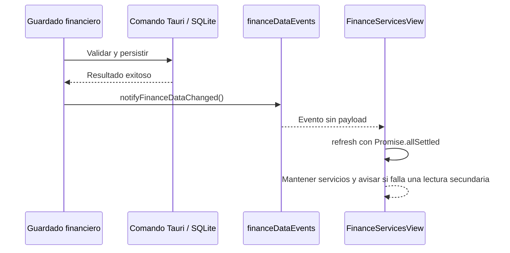

Validación de este bugfix: `cargo fmt --manifest-path src-tauri/Cargo.toml -- --check` y `cargo check --manifest-path src-tauri/Cargo.toml` pasaron; Cargo conserva warnings existentes no bloqueantes. La regresión `audit_returns_a_result_when_card_evidence_covers_an_unpaid_occurrence` verifica que la evidencia de tarjeta cubra la ocurrencia impaga sin crear `service-unpaid`, y se conservan las pruebas de matching. El test dirigido `cargo test --manifest-path src-tauri/Cargo.toml --lib audit_returns_a_result_when_card_evidence_covers_an_unpaid_occurrence -- --nocapture` compiló, pero no pudo iniciar el ejecutable en este entorno Windows por `STATUS_ENTRYPOINT_NOT_FOUND`, la misma limitación previa. Queda pendiente ejecutar ese binario y la suite Rust completa en un entorno Windows que pueda iniciar los ejecutables; también siguen pendientes las validaciones manuales de UI, Telegram y Android/SAF.

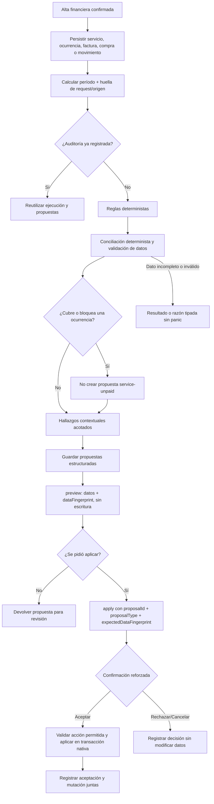

#### Canales, autorización y límites comprobados

En la app, `useChatSubmitMessage.ts` crea un `requestId` por envío, usa el actor estable `user-owner`, `source: app` y el scope `finance` cuando corresponde. Telegram conserva el scope universal `library` con `enableFinanceTools`, usa el `libraryUserId` vinculado más su identidad externa de Telegram, `source: telegram` y el mismo `requestId`; las confirmaciones HTML individuales vencen a los dos minutos y el progreso informa clasificación, registro, auditoría y propuestas sin enviar thinking crudo. Imágenes y PDF se clasifican como ticket, factura/boleta, recibo, resumen u otro; las facturas usan `create_finance_service_invoice` y no duplican gastos. La URL pública no expone Finanzas: solo publica las tools y tickets del Task Manager autorizado.

`validate_context` abre la base de la biblioteca, comprueba que el actor exista y valida el origen. Owner tiene acceso; cualquier otro usuario necesita `#Confidencial` exacto para leer o escribir Finanzas. El mismo requisito se aplica al filtrado previo de tools. No se guardan prompts, respuestas privadas completas, tokens, documentos ni payloads sensibles en diagnósticos.

Validaciones ejecutadas para este bugfix: `cargo fmt --manifest-path src-tauri/Cargo.toml -- --check` y `cargo check --manifest-path src-tauri/Cargo.toml` pasaron con warnings existentes no bloqueantes. La regresión `audit_returns_a_result_when_card_evidence_covers_an_unpaid_occurrence` y las pruebas de matching permanecen en la suite nativa. El test dirigido `cargo test --manifest-path src-tauri/Cargo.toml --lib audit_returns_a_result_when_card_evidence_covers_an_unpaid_occurrence -- --nocapture` compiló, pero el ejecutable no pudo iniciar en Windows por `STATUS_ENTRYPOINT_NOT_FOUND`, igual que la limitación previa. Queda pendiente ejecutarlo y completar la suite Rust en un entorno compatible, además de las validaciones manuales de UI, Telegram y Android/SAF.

## 1. Documentación General

### 1.1 Descripción Técnica del Servicio

Notia es una aplicación de gestión de conocimiento **local-first** construida con **Tauri v2**, que combina un frontend React 19 compilado con Vite 7 y un backend en Rust (edición 2021). La aplicación opera sin servidor cloud: todos los datos (notas Markdown, diagramas Mermaid, credenciales ColdPass, tareas y sesiones de chat) persisten en el filesystem local del usuario. Toda la lógica de aplicación está en Rust (`notia-backend-core` y `notia-app`, sin Tauri). La interfaz habla con el backend únicamente mediante `src/services/transport`: en la ventana, por el comando Tauri `app_invoke` y sus eventos; en un navegador, por HTTPS y WebSocket contra `notia --headless`. Entre componentes de la interfaz se usan además **Custom Events** internos. Ver «Arquitectura vigente: backend Rust, hosts y transporte».

### 1.2 Stack de Tecnologías

| Capa | Tecnología | Versión |
|---|---|---|
| Framework Desktop/Mobile | Tauri | v2 |
| Frontend | React | 19.2.0 |
| Lenguaje Frontend | TypeScript | ~5.9.3 |
| Build Tool | Vite | 7.3.1 |
| Bundler nativo | esbuild | 0.27.7 (override y lockfile) |
| Estado Global | Redux Toolkit + React Redux | ^2.11.2 / ^9.2.0 |
| UI Components | Material UI (MUI) | ^7.3.9 |
| CSS-in-JS | Emotion (React/Styled) | ^11.14.0 / ^11.14.1 |
| Iconos | Lucide React | ^0.577.0 |
| Editor Markdown | @milkdown/crepe | ^7.19.0 |
| Diagramas | Mermaid | ^11.14.0 |
| Graph View | react-force-graph-2d (`ForceGraph2D`) | ^1.29.1 |
| Backend | Rust | Edition 2021 |
| Serialización Rust | Serde + serde_json | ^1 |
| HTTP Client Rust | reqwest | 0.13.2 |
| Async Runtime Rust | Tokio | ^1 |
| Bluetooth LE Rust | btleplug | 0.11.7 |
| File Watcher Rust | notify | 6.1.1 |
| Logging Rust | log + env_logger/android_logger | 0.4 / 0.11 / 0.14 |
| Performance Timing Rust | `notia_timer.rs` (RAII scope timer) | internal |
| Diálogos Nativos | tauri-plugin-dialog | ^2 |
| Base local | SQLite embebido mediante `rusqlite` | ^0.32 |
| Workspace Rust | `notia-backend-core`, `notia-app`, `notia` (host Tauri, feature `app`) | — |
| Servidor HTTPS/WebSocket | rustls + rcgen + tungstenite | 0.23 / 0.13 / 0.24 |

### 1.3 Cómo Levantar el Proyecto en Local

#### Requisitos previos

- **Node.js** 20+ y **npm** 10+.
- **Rust toolchain** (`rustup`, `cargo`, `rustc`).
- **Git**.
- En **Linux**: paquetes del sistema listados en `README.md` (webkit2gtk, openssl, gtk3, appindicator, librsvg, dbus, bluez).
- En **Android**: Android SDK + NDK (auto-detectado por los scripts en `$HOME/Android/Sdk/ndk/*`).

#### Pasos

```bash
# 1. Clonar
git clone <repository-url>
cd notia

# 2. Instalar dependencias Node
npm ci

# 3. Desarrollo desktop (Linux auto-detecta Wayland/X11)
npm run dev:tauri

# 4. Desarrollo Android
npm run dev:android

# 5. Servidor sin ventana (desde src-tauri, con el ejecutable ya compilado)
notia --headless --set-owner-password
notia --headless --static-dir ../dist

# 6. Binario solo servidor para Linux (desde src-tauri)
cargo build --release --no-default-features
```

#### Scripts relevantes (`package.json`)

| Script | Descripción |
|---|---|
| `npm run dev` | Vite dev server (solo web, puerto 1420) |
| `npm run build` | Compilación TypeScript + build Vite |
| `npm run lint` | ESLint |
| `npm run dev:tauri` | Dev desktop Linux (auto-detect backend) |
| `npm run dev:tauri:windows` | Dev desktop Windows; genera primero el build multipágina sin minificar requerido por la publicación de Task Manager, luego inicia Vite de forma controlada o reutiliza el Vite de este repositorio si ya ocupa el puerto 1420. Rechaza procesos ajenos y ejecuta Tauri sin duplicar `beforeDevCommand`. |
| `npm run dev:tauri:wayland` | Fuerza backend Wayland |
| `npm run dev:tauri:wayland:fallback` | Wayland con fallback a X11 |
| `npm run dev:tauri:x11` | Fuerza backend X11 |
| `npm run dev:android` | Dev en dispositivo Android |
| `npm run build:android:debug` | APK debug aarch64 |
| `npm run build:android:release` | APK release firmado |
| `npm run build:android:aab` | Android App Bundle (Play Store) |
| `npm run install:android:release` | Instala APK release por adb |
| `npm run build:tauri` | Build release empaquetado Tauri |

### 1.4 Variables de Entorno Relevantes

El launcher `scripts/tauri-dev-windows.ps1` reintenta una vez el build multipágina sin minificar cuando `npm run build -- --minify=false` devuelve un código distinto de cero. Esto cubre la detención transitoria del servicio hijo de esbuild; un segundo fallo se propaga y detiene el inicio de Tauri.

#### Estabilidad del pipeline de assets en Windows

El build de desarrollo multipágina es la primera etapa de `npm run dev:tauri:windows`: el launcher invoca `npm.cmd run build -- --minify=false`, genera los assets de las entradas de desarrollo —incluido `public-task-manager.html`— y recién después inicia o reutiliza Vite en el puerto `1420` para arrancar Tauri. La opción `--minify=false` pertenece únicamente a este flujo local; `npm run build` conserva la minificación predeterminada para producción.

La causa observada en Windows era que se ejecutaba esbuild `0.27.3`. Su proceso nativo terminaba con el código `-1073741819` (`STATUS_ACCESS_VIOLATION`), por lo que Vite reportaba `The service was stopped` mientras generaba los assets multipágina. La corrección fija `"esbuild": "0.27.7"` en el bloque `overrides` de `package.json`. `package-lock.json` queda sincronizado con `esbuild` `0.27.7` y todos sus paquetes opcionales de plataforma `@esbuild/*`, incluido `@esbuild/win32-x64`, para que `npm ci` no vuelva a resolver la versión problemática.

El launcher conserva un máximo de dos intentos: después de un fallo espera un segundo y reintenta una sola vez; si el segundo intento devuelve un código distinto de cero, propaga el error y no inicia Tauri. El override evita la versión nativa observada, pero no elimina otros fallos de entorno, como procesos Node/Vite duplicados, un puerto `1420` ocupado por otra aplicación o interferencia del antivirus.

Validaciones ejecutadas después de `npm ci` en Windows:

- `node -e "require('esbuild').version"` devolvió `0.27.7`.
- `npm run build -- --minify=false` pasó con Vite `7.3.1` y `5843 modules transformed`.
- `npm run lint` pasó.
- `npx tsc --noEmit` pasó.
- `git diff --check` pasó.

No se ejecutaron Vitest, la suite Rust, el empaquetado release ni un ciclo completo de `npm run dev:tauri:windows` en esta validación; tampoco se verificaron otros sistemas operativos. Queda pendiente esa cobertura de integración multiplataforma, no una modificación del contrato del launcher.

| Variable | Valores | Uso |
|---|---|---|
| `NOTIA_TAURI_BACKEND` | `wayland` \| `x11` | Forzar backend gráfico en Linux |
| `NOTIA_TAURI_FALLBACK_X11` | `0` \| `1` | Si Wayland falla, reintentar en X11 |
| `NOTIA_ANDROID_KEYSTORE_PATH` | ruta al `.keystore` | Firma release Android |
| `NOTIA_ANDROID_KEYSTORE_PASSWORD` | string | Password del keystore |
| `NOTIA_ANDROID_KEY_ALIAS` | string | Alias de la clave |
| `NOTIA_ANDROID_KEY_PASSWORD` | string | Password de la clave |

### 1.5 Decisiones Arquitectónicas Clave

1. **Local-first / Filesystem como fuente de verdad**: todos los documentos (Markdown, Mermaid, ColdPass, Task Manager) se almacenan como archivos en el filesystem. SQLite se reserva para índices y datos estructurados de la aplicación; no hay servidor. El estado en Redux modela solo UI, selección y datos derivados.
2. **Cifrado de ColdPass en Rust**: el vault se cifra con AES-256-GCM y PBKDF2-HMAC-SHA256 (250k iteraciones) en `notia-app` (`coldpass.rs`). La passkey queda en la sesión del backend y el WebView recibe solo las entradas que muestra.
3. **Renderizado 2D de Graph View con `react-force-graph-2d`**: Rust construye el modelo del grafo de wikilinks (`backend_library_graph`, que pide `useLibraryGraphData.ts`) y `GraphView.tsx` lo transforma a `graphData` para `ForceGraph2D`, que calcula el layout de fuerzas y pinta nodos/aristas en un canvas 2D. El renderer 2D se consume desde su entrypoint dedicado y Mermaid continúa aislado para el editor de diagramas.

4. **Contextos documentales**: `src/services/contexts/libraryContexts.ts` define el contrato `#tag` + color y sus valores por defecto (`#Laboral`, `#Personal`, `#Academico` y `#Confidencial` en rojo `#DC2626`). La colección se persiste en `.notia/notiaConfig.json`; las configuraciones existentes incorporan los defaults que falten al normalizarse. `SettingsModal` presenta el alta en un formulario superior y los contextos existentes en una tabla con edición del tag, selector de color y eliminación; conserva al menos un contexto y bloquea la eliminación de los usados por un tablero. `GraphView` construye su leyenda desde el catálogo completo y `libraryGraphEngine.ts` usa el contexto aplicado al tablero como fuente de verdad para sus tickets; el mapa se recalcula al cambiar de vista para tomar la configuración actual. `ensureMarkdownDefaults()` garantiza `contexto: "#Personal"` en Markdown nuevo o legado que todavía no tenga la propiedad; los tags se serializan entre comillas porque `#` inicia comentarios YAML.
4. **Redux Toolkit para estado global**: 5 slices (`ui`, `preferences`, `library`, `documents`, `explorer`) con persistencia de preferencias en `localStorage` dentro de los propios reducers.
5. **Registro único de comandos**: los comandos de `notia-app` son funciones delgadas que validan y delegan a casos de uso y a `notia-backend-core`. Se enrutan desde `registry.rs` (`dispatch`), al que llegan la ventana (`app_invoke`) y el servidor headless (`/api/invoke`). No hay `#[tauri::command]` para comandos de la aplicación.
6. **Filesystem module auto-contenido**: el módulo `src-tauri/app/src/filesystem/` tiene su propia capa de commands → desktop/android_saf → helpers/validation/types, facilitando el mantenimiento multiplataforma.
7. **SQLite por librería**: al cargar una librería se inicializa de forma idempotente `.notia/notia.db`. En desktop se abre directamente con SQLite compilado dentro del binario mediante `rusqlite`; en Android, `resources/database/android/LibraryDatabasePlugin.kt` se copia durante el build (sin editar `gen`) y mantiene una copia privada temporal sincronizada por SAF después de cada mutación. La pérdida de URI o revocación de permisos produce un error recuperable. Las versiones se mantienen en `notia_schema_migrations`; v2–v13 incorporan cuentas, categorías, movimientos, evidencias, compras/productos/precios, sueldos, ahorro, inversiones, huellas de deduplicación, cuotas, el catálogo inicial de diez categorías de gasto, su restauración para bases vaciadas y la evidencia de firma de recibos salariales; v15 incorpora usuarios/roles, v16 sus contextos permitidos, v17 el actor estable de biblioteca en registros financieros, v18 servicios mensuales y auditoría, v19 referencias de origen, contenido fuente bruto e índices de unicidad/consulta, y v20 el historial idempotente de reparaciones de relaciones. Las migraciones son transaccionales e idempotentes.

8. **Plataforma condicional**: `#[cfg(...)]` en Rust provee alternativas en plataformas no soportadas, sin dejar un comando sin implementación. En TypeScript, `backendPlatform()` y `backendSupports()` deciden qué funciones del backend se muestran; `getRuntimeDevice()` decide solo el diseño.

10. **Backend separado de la interfaz**: el mismo backend corre dentro de la ventana (Windows y Android) o como servidor `notia --headless` (Windows y Linux) para navegadores de la red. Ver «Arquitectura vigente: backend Rust, hosts y transporte».

9. **Módulo de Finanzas**: `FinanceView` monta el módulo React nativo de `src/modules/finance/` dentro de la pestaña especial `__workspace_finance__`. Sus datos estructurados viven en SQLite por librería y se acceden mediante servicios TypeScript y comandos tipados del backend; no se usa un iframe ni almacenamiento financiero en el navegador. Compras, sueldos, ahorro y cuotas usan transacciones SQLite para conservar sus relaciones contables. La pestaña interna **Dev** permite inspeccionar entidades financieras y ejecutar una única consulta `SELECT`/`WITH` paginada; el comando nativo rechaza SQL de escritura. Desde allí también se puede cargar una semilla idempotente de julio/agosto de 2026, que cubre todas las entidades financieras sin borrar ni modificar datos existentes. Home muestra tarjetas con compra y venta de los dólares oficial, blue y tarjeta, consultados desde `https://dolarapi.com/v1/dolares` con validación y timeout. Documentos y patrimonio agrega un gráfico salarial dual ARS/USD sobre todo el historial disponible: convierte cada cobro con la venta oficial histórica más reciente de `https://api.argentinadatos.com/v1/cotizaciones/dolares/oficial`, calcula escalas monetarias legibles en el eje Y, ofrece un tooltip exacto por período mediante hover, foco o toque y amplía horizontalmente el SVG para conservar legibles los períodos. Las tarjetas de resumen contrastan la variación salarial móvil contra el IPC acumulado y la inflación interanual de `https://api.argentinadatos.com/v1/finanzas/indices/inflacion` y `https://api.argentinadatos.com/v1/finanzas/indices/inflacionInteranual`; cada respuesta se valida, se cancela tras diez segundos y solo se compara cuando los doce meses y el período interanual están alineados. No monta un chat propio: el chat lateral común recibe el scope `finance` cuando esta vista está activa. La pestaña especial `__workspace_calendar__` monta `CalendarView`, que consulta en paralelo `https://api.argentinadatos.com/v1/feriados/{año}` y `https://api.argentinadatos.com/v1/feriados-bancarios/{año}`, valida sus respuestas y diferencia ambos tipos en la grilla mensual.

### Contratos financieros del backend

Estado vigente: `FinanceContext` incluye `actorLibraryUserId` y `source`. `validate_context` abre la biblioteca y verifica el usuario en `library_users`; un usuario que no sea Owner debe tener exactamente el contexto `#Confidencial` para cualquier lectura o escritura financiera. El agente transmite el actor estable en cada comando financiero, incluido patrimonio, historiales, cotizaciones y extraccion. La migracion SQLite de actor estable aplica a los registros financieros que ya tenian actor; el ID numerico de Telegram permanece separado como identidad externa historica.

El chat efimero de Graph View se construye en memoria y no crea un Markdown. El host de la URL publica recibe desde Rust los nombres de tableros publicados; `scopePaths` solo es un hint y se acepta unicamente cuando pertenece a uno de esos tableros. Android valida el sobre global antes de enviarlo al plugin y el plugin vuelve a validar sus campos obligatorios sin incorporarlos al payload de Ollama.
<!-- El detalle financiero histórico siguiente queda fuera de la vista; el contrato vigente se resume inmediatamente después.

Los DTO usan `camelCase` y todos reciben `FinanceContext { libraryPath, androidDirectoryUri }`. Los comandos base son `finance_get_dashboard`, `finance_save_account`, `finance_save_category`, `finance_save_transaction`, sus bajas lógicas, y los comandos de reservas/ahorro. Los dominios documentales agregan `finance_save_purchase`, `finance_list_purchases`, `finance_list_price_history`, `finance_save_salary`, `finance_list_salaries`, `finance_save_installment_plan`, `finance_save_investment`, `finance_get_net_worth` y `finance_list_net_worth_history`. La validación de tickets compara importes en centavos exactos, contempla impuestos informativos ya incluidos y admite una diferencia fiscal máxima de un centavo; el gasto siempre toma el total final impreso. Los ajustes de redondeo visibles se extraen como líneas independientes. Los recibos validan cuenta y moneda, conceptos tipados y unicidad por empleador/período; normalmente también exigen que el neto coincida con bruto menos descuentos. Cuando la evidencia es un PDF que indica una firma digital, electrónica o manuscrita, conservan `signed_document` y aceptan el neto impreso como autoritativo aunque existan adelantos, ajustes u otros conceptos que no cierren esa ecuación simple. Al confirmarse crean el ingreso neto en la misma transacción y las consultas históricas recuperan conceptos y evidencia. El agente común expone `create_finance_salary`, que en Telegram requiere confirmación individual reforzada y vuelve a leer el período guardado para comprobar el registro completo; antes de enviar el mensaje terminal, el bridge repite la lectura con el ID y todos los campos devueltos. Una respuesta que afirme la carga sin esa prueba se reemplaza por un error y nunca se comunica como éxito. Duplicados, validación y almacenamiento conservan resultados deterministas como `create_finance_purchase`. `finance_clear_all_data` recibe directamente `{ context: FinanceContext }` y vacía los datos y catálogos financieros personalizados en una única transacción respetando claves foráneas; dentro de esa misma transacción restaura las diez categorías de gasto iniciales y conserva `notia_schema_migrations`, el archivo SQLite y cualquier tabla ajena a Finanzas. La UI solo lo invoca desde **Configuraciones → Finanzas** después de aceptar un modal destructivo y publica un evento interno para refrescar cualquier dashboard montado. Todos los comandos financieros devuelven errores serializables `{ code, message }`, con códigos `validation`, `notFound`, `conflict` o `storage`. `extract_finance_document` acepta únicamente un archivo dentro de la biblioteca desktop, de hasta 15 MB y extensión PDF/PNG/JPG/WEBP; la API key se lee de `LLAMA_CLOUD_API_KEY` en Rust y nunca forma parte del payload frontend.

-->
El contrato financiero vigente usa DTO `camelCase` con `FinanceContext { libraryPath, androidDirectoryUri, actorLibraryUserId, source }`. `validate_context` verifica biblioteca, usuario y `#Confidencial` antes de toda lectura o escritura. Tickets validan importes en centavos y tolerancia fiscal de un centavo; sueldos validan cuenta, moneda, conceptos y unicidad por empleador/período; resúmenes validan agregados y nunca duplican el total a pagar como gasto. Todas las mutaciones, incluidas `create_finance_salary` y `create_finance_credit_card_statement`, requieren confirmación individual y un resultado verificable; cuando el canal es Telegram, esa confirmación visible es única.
Los resúmenes de tarjeta usan `finance_save_credit_card_statement` y `finance_list_credit_card_statements`. Validan una cuenta activa `credit_card`, moneda, agregados por tipo y la ecuación entre saldo anterior, pagos, créditos, consumos, cargos, impuestos y total. Consumos y cargos crean gastos o se concilian con movimientos existentes; pagos y créditos solo se conservan como conciliación, y el total a pagar nunca se registra nuevamente como gasto. El runtime común expone `create_finance_credit_card_statement` con confirmación individual y resultado terminal verificable; en Telegram no encadena una segunda confirmación reforzada.

La evidencia original vive en `finance_source_artifacts`; las respuestas completas del extractor en `finance_extraction_results`. Borrar o reemplazar la referencia física no elimina compras, líneas, precios, recibos ni resúmenes normalizados. Las bajas de movimientos son lógicas y cuentas/categorías se desactivan. No se registran tokens, documentos, prompts ni payloads financieros en logs.

El scope `finance` de `createChatScopedAgent` no adjunta documentos de la biblioteca. Lista cuentas y categorías mediante herramientas, exige aclaración si falta la cuenta, no permite SQL ni creación implícita de categorías y ejecuta mutaciones por `notiaChatRuntime.ts`. Telegram conserva el agente universal `library` también para solicitudes financieras —el campo `scope` de la request solo clasifica la validación financiera y los comprobantes—, conserva `actorUserId`, deduplica updates y, en audio, aporta al caso de uso la transcripción más el `fileId` original. Las confirmaciones siguen usando el bridge HTML común y expiran a los dos minutos.

Vigencia del contrato financiero: la autorización no se concede por canal ni por `scope` y las mutaciones de Telegram no tienen una excepción de auto-confirmación. El agente usa el `libraryUserId` estable y `source` para construir `FinanceContext`; `actorUserId` solo identifica la cuenta externa de Telegram cuando se conserva por compatibilidad. Todas las escrituras, incluidos tickets, `create_finance_salary`, resúmenes y categorías, requieren la confirmación visible del bridge común; Telegram presenta una sola por mutación y no muestra la segunda confirmación reforzada.
   El dashboard y los comandos financieros del primer corte están implementados para desktop. La validación manual de la app y Telegram sigue pendiente; el CRUD financiero Android, la extracción móvil y el flujo Android/SAF no se validaron en un dispositivo físico.

---

## 2. Documentación Específica de Flujos

> Para cada flujo documentado se incluyen: **entradas y salidas** (tipos, formatos, contratos), **validaciones aplicadas**, **pasos del proceso**, **comportamiento ante errores**, **dependencias con otros módulos**, y **ejemplos JSON completos** de request/response para los commands del backend.

> **Vigencia:** los flujos de esta sección se escribieron antes de que la lógica pasara a Rust y de la separación del backend.
> - Donde dicen `invoke('comando', …)`, hoy la llamada es `callBackend('comando', …)` desde `src/services/transport`, que llega al registro por `app_invoke` en la ventana o por `/api/invoke` en el servidor headless.
> - Varios módulos TypeScript citados ya no existen: `filesystemEngine`, `frontmatterEngine`, `pomodoroEngine`, `serviceEngine`, el cifrado de ColdPass en el WebView y otros. Su lógica vive en `notia-app` y `notia-backend-core`.
> - Los flujos vigentes de biblioteca, chat, Task Manager, Finanzas, ColdPass, voz y bibliotecas se describen en las secciones «Estado sincronizado de esta iteración: separación backend/frontend» y en «Arquitectura vigente: backend Rust, hosts y transporte».
> - Los payloads JSON de los comandos que siguen existiendo continúan vigentes. Varios comandos citados aquí ya no existen: el filesystem por ruta (`read_library_tree`, `read_library_file`, `write_library_file`, `create_library_entry`, `library_entry_operation`…), la IA de desktop y Android por comando (`check_desktop_ai_health`, `run_desktop_ai_chat_streaming`, `run_android_ai_chat`…) y el evento `notia-ai-chat-stream`. La lista vigente es el mapa de la sección 4.

### 2.1 Filesystem — Sincronización de Árbol de Librería

#### Descripción
Carga y mantenimiento del árbol de archivos de la librería activa. En **desktop** se usa un file watcher nativo (`notify` crate). En **Android** se usa el Storage Access Framework (SAF) con polling opcional.

#### Endpoints (Commands Tauri)

| Command | Tipo | Payload | Response |
|---|---|---|---|
| `read_library_tree` | Síncrono | `ReadLibraryTreePayload` | `Vec<FileNode>` |
| `read_library_tree_signature` | Síncrono | `ReadLibraryTreePayload` | `String` (hash hex) |
| `start_library_tree_watch` | Síncrono | `{ directoryPath: string }` | `{ ok: boolean }` |
| `stop_library_tree_watch` | Síncrono | — | `{ ok: boolean }` |

#### Ejemplo JSON — Request `read_library_tree`

```json
{
  "payload": {
    "directoryPath": "/home/usuario/Notas"
  }
}
```

#### Ejemplo JSON — Response `read_library_tree`

```json
[
  {
    "id": "folder-1",
    "name": "Proyectos",
    "path": "/home/usuario/Notas/Proyectos",
    "type": "folder",
    "expanded": false,
    "children": [
      {
        "id": "file-1",
        "name": "README.md",
        "path": "/home/usuario/Notas/Proyectos/README.md",
        "type": "file"
      }
    ]
  },
  {
    "id": "file-2",
    "name": "Ideas.md",
    "path": "/home/usuario/Notas/Ideas.md",
    "type": "file"
  }
]
```

#### Ejemplo JSON — Response `read_library_tree_signature`

```json
"a3f7b2c1"
```

La URL prioriza la interfaz IPv4 de la ruta local y, si no existe una ruta de salida detectable, usa la primera interfaz IPv4 utilizable del host; no depende de que haya Internet para que otros dispositivos de la LAN puedan conectarse.

#### Entradas
- `directoryPath: string` — path absoluto de la librería (normalizado por `normalizeFilesystemPath`).
- `androidDirectoryUri?: string` — URI de árbol SAF (solo Android).

#### Salidas
- `FilesystemTreeNode[]` — árbol jerárquico de `id`, `name`, `path`, `type`, `expanded`, `hasChildren`, `children`.
- `string` — `treeSignature` (hash FNV-1a del árbol) para detectar cambios sin re-leer todo.
- Evento `notia-library-tree-changed` (desktop) — payload con `watchedPath` y `changedPathHint`.

#### Validaciones
- **Frontend**: `normalizeFilesystemPath` sanitiza separadores (`\` → `/`) en rutas locales, pero conserva intactas las URI opacas `content://`. Rechaza strings vacíos.
- **Backend**: `validation.rs` rechaza nombres con `/`, `\\`, `.`, `..`, strings vacíos.
- **Backend**: canonicalización con `fs::canonicalize` (fallback al path original).

#### Pasos del proceso (Desktop)

1. **Inicialización**: `useLibraryTreeSync` (hook) detecta cambio de librería activa.
2. **Carga inicial**: `filesystemEngine.readLibraryTree(path)` → `invoke('read_library_tree')` → Rust `filesystem::commands::read_library_tree` → `desktop::read_library_tree` → escaneo recursivo del filesystem → serialización de `FileNode[]`.
3. **Firma**: `filesystemEngine.readLibraryTreeSignature(path)` → `invoke('read_library_tree_signature')` → hash FNV-1a de todos los nodos.
4. **Watcher**: `libraryTreeWatchRuntime.startDesktopLibraryTreeWatch(path)` → `invoke('start_library_tree_watch')` → Rust `filesystem::watch` instancia `notify::RecommendedWatcher` sobre el directorio.
5. **Evento de cambio**: el watcher detecta modificación externa → emite evento Tauri `notia-library-tree-changed`.
6. **Frontend reacciona**: `subscribeToDesktopLibraryTreeWatchBridge` escucha el evento → `dispatchLibraryTreeChanged()` → CustomEvent `notia:library-tree-changed` → slices de Redux actualizan el árbol → re-render de `FileTree`.

#### Pasos del proceso (Android)

1. **Selección de carpeta**: `filesystemEngine.pickDirectory()` → `invoke('pick_android_directory_tree')` → Rust `mobile_directory_picker` → intent SAF nativo → retorna `path` + `uri`; `libraryRuntime.pickLibraryDirectory()` valida la URI `content://` y la usa como `path` y `androidTreeUri` de la librería.
2. **Lectura del árbol**: `invoke('read_android_library_tree')` → Rust `mobile_directory_picker::read_android_library_tree` → recorrido SAF recursivo → `FileNode[]`.
3. **Polling (opcional)**: en Settings se configura `explorer-refresh-interval-ms`. El hook `useLibraryTreeSync` re-lee la firma periódicamente y compara con la anterior; si difiere, re-carga el árbol completo.
4. **Flat file list**: para indexado de búsqueda y grafo, `readLibraryFlatFileList()` invoca `read_android_flat_file_list` (comando exclusivo de Android) para obtener lista plana sin recursión de árbol.

#### Comportamiento ante errores
- Si el path está vacío o normalizado a vacío: retorna `[]` silenciosamente.
- Si el backend falla en desktop: consola con prefijo `[filesystemEngine]`; el árbol previo permanece.
- Si el watcher falla al iniciar: retorna `false` en `startDesktopLibraryTreeWatch`; no se reintenta automáticamente.
- En Android, si el comando `pick_android_directory_tree` no existe (backend desactualizado), se lanza error explícito pidiendo recompilar la app.

#### Dependencias
- **Frontend services**: `filesystemEngine.ts`, `libraryTreeWatchRuntime.ts`, `libraryTreeEvents.ts`, `notiaLogger.ts`.
- **Redux slices**: `librarySlice` (librería activa), `documentsSlice` (nodos del árbol), `explorerSlice` (carpetas expandidas).
- **Backend commands**: `read_library_tree`, `read_library_tree_signature`, `start_library_tree_watch`, `stop_library_tree_watch`, `pick_android_directory_tree`, `read_android_library_tree`, `read_android_flat_file_list`, `read_android_directory`.
- **Backend services**: `desktop.rs`, `android_saf.rs`, `watch.rs`.

---

### 2.2 Filesystem — CRUD de Entradas

#### Descripción
Creación, lectura, actualización y eliminación de archivos y carpetas dentro de una librería, con soporte desktop y Android SAF.

#### Endpoints (Commands Tauri)

| Command | Tipo | Payload | Response |
|---|---|---|---|
| `create_library_entry` | Síncrono | `CreateLibraryEntryPayload` | `OperationResult` |
| `library_entry_operation` | Síncrono | `LibraryEntryOperationPayload` | `OperationResult` |
| `read_library_file` | Síncrono | `ReadLibraryFilePayload` | `ReadLibraryFileResult` |
| `write_library_file` | Síncrono | `WriteLibraryFilePayload` | `WriteLibraryFileResult` |
| `create_library_file` | Síncrono | `CreateLibraryFilePayload` | `OperationResult` |
| `create_library_directory` | Síncrono | `CreateLibraryDirectoryPayload` | `OperationResult` |
| `write_binary_file` | Síncrono | `WriteBinaryFilePayload` | `OperationResult` |
| `path_exists` | Síncrono | `PathExistsPayload` | `PathExistsResult` |
| `is_directory_path` | Síncrono | `PathExistsPayload` | `IsDirectoryPathResult` |

#### Ejemplo JSON — Request `create_library_entry`

```json
{
  "payload": {
    "directoryPath": "/home/usuario/Notas/Proyectos",
    "name": "Nueva Nota",
    "kind": "note"
  }
}
```

#### Ejemplo JSON — Response `create_library_entry`

```json
{
  "ok": true
}
```

#### Ejemplo JSON — Request `library_entry_operation` (rename)

```json
{
  "payload": {
    "action": "rename",
    "targetPath": "/home/usuario/Notas/Proyectos/ViejoNombre.md",
    "newName": "NuevoNombre.md"
  }
}
```

#### Ejemplo JSON — Response `library_entry_operation`

```json
{
  "ok": true
}
```

#### Ejemplo JSON — Request `read_library_file`

```json
{
  "payload": {
    "filePath": "/home/usuario/Notas/Proyectos/README.md"
  }
}
```

#### Ejemplo JSON — Response `read_library_file`

```json
{
  "ok": true,
  "content": "# Proyecto Alpha\n\nEste es el README del proyecto.",
  "error": null
}
```

#### Ejemplo JSON — Request `write_library_file`

```json
{
  "payload": {
    "filePath": "/home/usuario/Notas/Proyectos/README.md",
    "content": "# Proyecto Alpha\n\nContenido actualizado."
  }
}
```

#### Ejemplo JSON — Response `write_library_file`

```json
{
  "ok": true,
  "error": null
}
```

#### Validaciones
- `validate_create_library_entry_payload`: rechaza nombres vacíos, con `/`, `\\`, `.`, `..`.
- `validate_library_entry_operation_payload`: parsea y normaliza la acción; valida que existan los paths requeridos según la acción.

#### Pasos del proceso

1. **Crear entrada**: frontend `filesystemEngine.createLibraryEntry()` → `invoke('create_library_entry')` → Rust valida nombre → determina extensión según `kind` (`.md`, `.mmd`, sin extensión para carpetas) → crea en desktop con `fs::create_dir`/`fs::write` o en Android SAF. Para una ruta sintética Android, `android_saf` resuelve el directorio padre por la ruta cacheada y llama a `createEntry`; no entrega la URI tree sintética al proveedor como documento.
2. **Eliminar**: `invoke('library_entry_operation')` con `action: 'delete'` → Rust valida → `desktop::delete_entry` (o SAF) → `fs::remove_file`/`remove_dir_all`.
3. **Renombrar**: `action: 'rename'` → `desktop::rename_entry` → `fs::rename`.
4. **Copiar/Mover**: `action: 'paste'` con `mode: 'copy'` o `'move'` → lectura del source → escritura en target → si es move, eliminación del source.
5. **Binarios**: `filesystemEngine.writeBinaryFile(path, data, { androidDirectoryUri })` → `invoke('write_binary_file')` → Rust resuelve la URI SAF exacta, crea el destino ausente mediante `createEntry` cuando corresponde y el plugin escribe los bytes a través de Base64. La lectura binaria para extracción usa `readFileBinary` y decodificación Base64 en Rust.

#### Comportamiento ante errores
- Nombre inválido: retorna inmediatamente `OperationResult` con error descriptivo en español.
- Path no existe: error de filesystem propagado como string al frontend.
- Operación en Android sin `directoryUri`: puede fallar si SAF no tiene permiso persistido.
- Una ruta anidada desconocida no se considera la raíz: devuelve un error seguro de resolución y no puede redirigir la operación a otro documento.
- `readLibraryDirectory` propaga el error de lectura; las lecturas completas del árbol y del listado plano mantienen su fallback de lista vacía.

#### Dependencias
- **Frontend**: `filesystemEngine.ts`, `useFileTreeActions.ts`, `FileTreeContextMenu.tsx`.
- **Backend**: `create_library_entry`, `library_entry_operation`, `validation.rs`, `desktop.rs`, `android_saf.rs`.

---

### 2.3 Markdown — Edición de Documentos

#### Descripción
Flujo completo de lectura, renderizado, edición, autosave y persistencia de un documento Markdown en Notia.

#### Endpoints (Commands Tauri)

| Command | Tipo | Payload | Response |
|---|---|---|---|
| `read_library_file` | Síncrono | `ReadLibraryFilePayload` | `ReadLibraryFileResult` |
| `write_library_file` | Síncrono | `WriteLibraryFilePayload` | `WriteLibraryFileResult` |
| `read_markdown_files` | Síncrono | `{ directoryPath: string }` | `Vec<MarkdownFileDocument>` |

#### Ejemplo JSON — Request `read_markdown_files`

```json
{
  "payload": {
    "directoryPath": "/home/usuario/Notas"
  }
}
```

#### Ejemplo JSON — Response `read_markdown_files`

```json
[
  {
    "path": "/home/usuario/Notas/Ideas.md",
    "content": "# Ideas\n\n- Idea 1\n- Idea 2"
  },
  {
    "path": "/home/usuario/Notas/Proyectos/README.md",
    "content": "# Proyecto Alpha"
  }
]
```

#### Entradas
- `filePath: string` — path absoluto del archivo Markdown.
- `directoryUri?: string` — URI SAF (Android).

#### Salidas
- `ReadLibraryFileResult` — `{ ok, content, error? }`.
- `WriteLibraryFileResult` — `{ ok, error? }`.
- Estado local del documento (Milkdown editor) y pestañas abiertas en Redux.

#### Validaciones
- **Frontend**: path vacío rechazado antes de invocar; en Android, `directoryUri` acompaña toda lectura/escritura SAF.
- **Backend**: path vacío retorna `{ ok: false, error: "Invalid file path." }`. En Android, intenta SAF primero; si falla, retorna error sin tocar desktop. Una URI `content://.../document/...` puede usarse directamente; una URI tree y sus rutas sintéticas deben resolverse mediante el mapa de paths/`readTree`.

#### Pasos del proceso

1. **Apertura**: el usuario hace clic en un archivo `.md` en `FileTree` → `useDocumentOpener` verifica si ya está abierto (evita duplicados) → dispatch `documentsSlice.actions.openDocument({ path, title })`.
2. **Lectura**: `useDocumentPersist` o `MarkdownView` invoca `filesystemEngine.readTextFile(path)` → `invoke('read_library_file')` → Rust `filesystem::commands::read_library_file` → `desktop::read_library_file` (o `android_saf::read_library_file`) → lectura con `fs::read_to_string` o `readFile` SAF → retorna `{ ok: true, content }`; si falla, conserva `{ ok: false, content: '', error }`.
3. **Renderizado**: el contenido se inyecta en el editor **Milkdown Crepe** (`MarkdownView.tsx`). Se parsea frontmatter vía `frontmatterEngine.ts` y se muestra en `MarkdownPropertiesPanel`.

#### Bloques Markdown dentro de celdas de tablas

`MarkdownView` extiende las schemas `table_cell` y `table_header` de Milkdown para aceptar `content: 'block+'`. La extensión conserva los contratos de coincidencia de los runners GFM, pero reemplaza sus runners de parseo y serialización por los de `tableCellBlocks.ts`. El plugin `tableCellBlocksRemark` se registra junto con GFM y solo transforma marcadores que sean hijos directos de nodos `tableCell`; un comentario con el mismo texto fuera de una celda permanece sin modificar.

El flujo de extremo a extremo es:

1. **Parseo de la fuente**: GFM produce el árbol Markdown. `tableCellBlocksRemark` detecta comentarios HTML con el prefijo reservado y los convierte, únicamente dentro de celdas, en nodos internos `notiaTableBlock`.
2. **Construcción Milkdown**: el runner de la celda agrupa los hijos inline normales en párrafos. Antes de restaurar un bloque vacía ese grupo, agrega el nodo ProseMirror reconstruido y continúa con el texto siguiente; por eso una misma celda puede tener texto antes y después de un bloque.
3. **Edición**: el documento ProseMirror permite párrafos y cualquier otro nodo de bloque admitido por el schema. Esto incluye `code_block` (también lenguajes `xgraph`, `jsxgraph` y `mermaid`), imágenes u otros bloques válidos.
4. **Serialización**: los párrafos se entregan al serializador GFM normal. Cada hijo de la celda que no sea un párrafo se serializa como un comentario HTML interno. El autosave de Markdown persiste ese resultado en el mismo archivo `.md`; no se agrega una tabla SQLite, DTO, comando Tauri ni migración.
5. **Presentación**: las reglas de `notia.css` limitan al 100% del ancho los bloques de la celda y sus gráficos/previews; los hosts de XGraph y Mermaid mantienen un mínimo de 180 px y sus frames/SVG no exceden el ancho disponible.

#### Handles, selección, eliminación y arrastre

La causa raíz del bug era que el filtro de `blockConfig` trataba a `table` como otro nodo estructural excluido. Cuando el selector de Milkdown no encontraba un nodo padre válido desde una celda, terminaba ocultándose, por lo que desaparecían tanto el handle de la tabla como los de los bloques contenidos. Además, la vista estándar de tabla detenía todos los eventos de arrastre y drop, incluidos los movimientos internos de bloques. En la corrección adicional de esta iteración, el mismo filtro marcaba como excluido cualquier descendiente de `blockquote` sin distinguir si también tenía un ancestro `table`; ahora conserva ambos contextos durante el recorrido de `ResolvedPos`.

`markdownBlockHandleEngine.ts` mantiene la decisión en una regla pura:

```ts
shouldShowMarkdownBlockHandle(nodeTypeName, hasExcludedAncestor, isInsideTable = false): boolean
```

Devuelve `true` cuando no hay una ancestría excluida o el nodo está dentro de una tabla, siempre que no sea una estructura intermedia excluida. `MarkdownView.tsx` configura `blockConfig.filterNodes` y recorre los ancestros de `ResolvedPos` para calcular `hasExcludedAncestor` y `isInsideTable`. Fuera de tablas, `blockquote`, `math_inline` y cualquier otro ancestro que el filtro marque como excluido siguen ocultando el handle de sus nodos descendientes. Dentro de una tabla, `isInsideTable=true` permite los nodos candidatos aunque tengan uno de esos ancestros; así, una cita y sus bloques anidados en una celda conservan su selector. `table` devuelve `true`, mientras `table_header_row`, `table_row`, `table_header` y `table_cell` devuelven `false` en cualquier contexto. Por eso, cuando el selector encuentra una de esas estructuras intermedias, su lookup puede ascender hasta `table` y conservar el handle de la tabla; los bloques hijos —por ejemplo `code_block` e `image_block`— siguen siendo candidatos válidos y conservan su propio handle.

La vista personalizada `markdownTableBlockView.ts` extiende `TableNodeView` y se registra en `MarkdownView` mediante `markdownTableBlockView` después de GFM y del transformador de celdas. Su contrato de eventos es deliberadamente estrecho: cuando el evento es `drop` o comienza con `drag` y `EditorView.dragging.move` indica un arrastre interno de bloque de Milkdown, `stopEvent` devuelve `false` para que el editor procese la selección y el movimiento, incluso entre posiciones o celdas. Para cualquier otro arrastre o drop conserva `super.stopEvent(event)`, manteniendo el bloqueo normal de operaciones de tabla.

El handle usa entonces las acciones normales de Milkdown/ProseMirror: permite seleccionar el bloque y eliminarlo sin un comando paralelo de Notia. La edición resultante sigue el flujo habitual de serialización y autosave; al quitar o mover un bloque se actualiza el contenido de la celda y se conserva el marcador interno correspondiente, sin cambiar el contrato de persistencia de `tableCellBlocks.ts`.

```mermaid
flowchart TD
    Cell[table_cell / table_header con block+] --> Filter[blockConfig.filterNodes]
    Filter -->|table| TableHandle[Handle de tabla]
    Filter -->|table_header_row, table_row, table_header o table_cell| Lookup[Lookup asciende al padre]
    Lookup --> TableHandle
    Filter -->|bloque hijo sin ancestría excluida| BlockHandle[Handle del bloque]
    Filter -->|bloque hijo dentro de tabla, incluso con ancestro excluido| BlockHandle
    Filter -->|blockquote/math_inline u otro ancestro excluido fuera de tabla| Hidden[Sin handle]
    Event[Evento drag/drop en tabla] --> Move{view.dragging?.move}
    Move -->|Sí| Milkdown[Milkdown procesa selección y movimiento]
    Move -->|No| TableGuard[TableNodeView bloquea el evento]
```

El formato persistido reservado es:

```text
<!--notia-table-block:<encodeURIComponent(JSON.stringify(node))>-->
```

`node` es la forma JSON de un nodo ProseMirror: tiene `type` y puede incluir `attrs`, `content`, `marks` o `text`. Por ejemplo, la representación decodificada de un bloque XGraph es:

```json
{
  "type": "code_block",
  "attrs": { "language": "xgraph" },
  "content": [
    { "type": "text", "text": "board.create('point', [1, 2])" }
  ]
}
```

El prefijo, el sufijo y la codificación URL forman parte del contrato; el comentario no pretende ser una sintaxis Markdown portable para renderizar el bloque en otros editores. Los párrafos y el texto inline sí permanecen en la sintaxis GFM habitual. Si un editor externo elimina comentarios HTML, los bloques no inline de las celdas no pueden recuperarse al volver a abrir el archivo.

#### Validaciones, errores y límites

- `parseTableCellBlockMarker` rechaza valores que no tengan exactamente el prefijo/sufijo reservado, JSON inválido, nodos sin `type` string, `text` no string, `content` no array de nodos o `marks` no array de marcas con `type` string.
- El marcador completo está limitado a 500.000 caracteres. Un marcador malformado o sobredimensionado se deja como HTML normal y no se interpreta como bloque.
- La restauración ignora nodos de nivel superior `doc`/`text`, tipos ausentes del schema y marcas desconocidas; si un nodo válido no puede construirse, no se presenta como restaurado. No existe un límite explícito de profundidad ni de CPU para el JSON o para el bloque que contiene.
- La transformación está limitada a celdas GFM y no reinterpreta comentarios fuera de tablas. Las celdas sin marcadores siguen el flujo GFM existente; la compatibilidad con archivos Markdown previos no requiere migración.
- `filterNodes` no agrega estado ni una ruta de error: devuelve `false` para `table_header_row`, `table_row`, `table_header` y `table_cell`; fuera de tablas también devuelve `false` para candidatos bajo `blockquote`, `math_inline` u otro ancestro excluido. Dentro de una tabla, `isInsideTable=true` permite esos candidatos anidados, pero no las estructuras intermedias. El selector de Milkdown puede así ascender desde las estructuras intermedias hasta la tabla. Un arrastre que no sea un movimiento interno reconocido por `EditorView.dragging?.move` conserva el bloqueo de `TableNodeView`.
- La selección y eliminación usan los comandos normales de Milkdown; si el autosave falla, se mantiene el comportamiento existente de escritura fallida: se muestra el error en la pestaña y el contenido permanece en memoria para reintentar. El bugfix no agrega un límite de cantidad de bloques ni de celdas para el arrastre.

```mermaid
flowchart LR
    Source[Archivo Markdown] --> GFM[Milkdown GFM]
    GFM --> Remark[tableCellBlocksRemark]
    Remark --> PM[table_cell / table_header con block+]
    PM --> View[Editor y previews con ancho acotado]
    View --> Serialize[Runner de serialización]
    Serialize --> Marker[Comentario HTML con JSON codificado]
    Marker --> Autosave[Autosave del mismo .md]
    Autosave --> Source
```

La selección del editor se transforma en `MarkdownSelectionContext` mediante `selectionEngine.ts`. El contexto incluye posiciones, texto y cada bloque superior seleccionado con su tipo. `NotiaMenu` lo comparte con el chat lateral; en el scope `document`, `createChatScopedAgent` lo incorpora al prompt y expone `read_active_markdown_document`, `replace_active_markdown_document` e `insert_active_markdown_document`. La selección es opcional: el agente relee la fuente actual, puede resolver `targetText` contra cualquier bloque referenciado del archivo (incluidos referencias como «punto a»), reemplazarlo o insertar contenido antes/después de él, y conserva el resto del archivo sin permiso adicional para la lectura y con confirmación visible antes de guardar. Si no se indica un objetivo para una inserción inequívoca, la agrega al final. Tras escribir, el cambio actualiza la pestaña abierta y `MarkdownView` aplica el nuevo cuerpo sin remount ni reapertura; el resultado de la mutación es terminal para evitar lecturas repetidas.
4. **Wikilinks**: durante la edición, el plugin `wikiLinkPlugin.ts` detecta patrones `[[...]]` y muestra el menú de sugerencias `WikiLinkSuggestionMenu.tsx` con notas existentes.
5. **Autosave**: `useTextDocumentAutosave.ts` establece un debounce (tipicamente ~1s de inactividad) tras el cual invoca `filesystemEngine.writeTextFile(path, content)`. `useTabManager.persistDirtyTextDocuments` ejecuta un flush inmediato antes de cerrar una pestaña, mover/renombrar entradas, cambiar de libreria o cerrar/salir de la aplicacion; una escritura fallida mantiene la pestaña abierta y su contenido en memoria para reintentar.
6. **Persistencia**: `invoke('write_library_file')` → Rust `filesystem::commands::write_library_file` → valida path no vacío → `desktop::write_library_file` (o SAF) → `fs::write`/`writeFile` → retorna `{ ok: true }`. En Android, `directoryUri` se conserva hasta la resolución de la URI de documento real.
7. **Indicadores**: el slice `documentsSlice` actualiza el flag `isSaving` / `saveError` para mostrar el indicador visual en la pestaña.

#### Comportamiento ante errores
- Lectura fallida: el editor se abre vacío o con mensaje de error; no se bloquea la UI.
- Escritura fallida: indicador de error ✗ en la pestaña; el contenido modificado permanece en memoria (Redux + estado local del editor), permitiendo reintentar.
- Path vacío: rechazo inmediato en frontend y backend con mensaje en inglés técnico ("Invalid file path.") que el frontend traduce a contexto amigable.
- Una resolución SAF sintética ausente, un permiso revocado o una escritura Base64 inválida devuelve un error recuperable; no se utiliza la URI tree raíz como sustituto.

#### Dependencias
- **Frontend**: `MarkdownView.tsx`, `useDocumentPersist.ts`, `useTextDocumentAutosave.ts`, `wikiLinkPlugin.ts`, `frontmatterEngine.ts`, `filesystemEngine.ts`.
- **Bloques de tabla y handles**: `tableCellBlocks.ts`, `tableCellBlocks.test.ts`, `src/components/notia/views/markdown/markdownTableBlockView.ts`, `src/engines/markdown/markdownBlockHandleEngine.ts`, `src/engines/markdown/markdownBlockHandleEngine.test.ts` y las reglas de ancho de tabla en `src/styles/notia.css`.
- **Redux**: `documentsSlice` (tabs, activeTab, saving states).
- **Backend**: `read_library_file`, `write_library_file`.
- Los adjuntos del compositor se procesan en `chatImageAttachment.ts`: las imágenes se envían como una colección visual ordenada, los PDF pasan por `pdfDocumentRenderer.ts` —que extrae texto y renderiza hasta 24 páginas como JPEG— y cada archivo de texto se agrega como un bloque de contexto delimitado. El flujo admite varios archivos locales en una misma consulta; el mensaje de usuario conserva la metadata y `chatDocumentStorage.ts` la serializa en el marcador HTML oculto `NOTIA_CHAT_ATTACHMENTS`, por lo que el archivo Markdown puede rehidratarla en una recarga y una consulta posterior puede reutilizarla dentro de la ventana de contexto. Un PDF mayor se rechaza antes de iniciar la conversación para no producir una inserción parcial.

#### Pruebas y estado técnico de esta implementación

`tableCellBlocks.test.ts` cubre el round-trip de un `code_block` mediante marcador, la transformación limitada a celdas con una imagen, el rechazo de JSON inválido y marcadores sobredimensionados, y la extensión de schema conservando los matchers y reemplazando los runners. Esa validación anterior de persistencia fue de 122 archivos y 687 tests. En este bugfix, `markdownBlockHandleEngine.test.ts` agrega regresiones para bloques seleccionables dentro de celdas, exclusión de nodos estructurales y conservación de la exclusión por ancestría fuera de tablas, además de permitir esa ancestría dentro de tablas.

Las validaciones ejecutadas para este bugfix fueron:

- `npx vitest run src/engines/markdown/markdownBlockHandleEngine.test.ts`: 1 archivo y 3 tests aprobados.
- `npm test -- --run`: 123 archivos y 690 tests aprobados.
- `npm run lint`: aprobado.
- `npx tsc --noEmit`: aprobado.
- `npm run build -- --minify=false`: aprobado; 5856 módulos, con solo warnings existentes de chunks, importaciones y tamaños.
- `git diff --check`: aprobado; Git mostró únicamente warnings de conversión LF/CRLF.

No se modifican APIs, comandos Tauri ni datos SQLite, por lo que no hay migración ni recuperación de bases que documentar. Queda pendiente la validación manual del flujo completo en la vista real —inserción, edición, render, selección, eliminación, arrastre entre posiciones/celdas y autosave de varios bloques dentro de una celda— y la comprobación específica en un WebView Android físico; las pruebas automatizadas cubren la transformación, el contrato de schema y la regla pura de handles, pero no sustituyen esa cobertura visual multiplataforma.

---

### 2.4 Graph View

#### Descripción
Construcción y visualización de un grafo de conocimiento donde los nodos son archivos Markdown y las aristas son wikilinks entre ellos. Graph View utiliza `ForceGraph2D` de **react-force-graph-2d**: recibe el modelo tipado de nodos y aristas, ejecuta un layout de fuerzas y renderiza un canvas 2D, con títulos persistentes sobre los nodos, zoom, paneo y foco de resultados.

Cada nodo Markdown resuelve su `contexto` desde el frontmatter y el color desde el catálogo de la biblioteca. Para los archivos bajo `task-mannager/` o `task-manager/`, `libraryGraphEngine.ts` usa primero el contexto aplicado al tablero y solo recurre al frontmatter si no puede resolver ese tablero; `GraphView.tsx` aplica el color al nodo 2D y muestra una leyenda completa. Task Manager continúa sincronizando el contexto del tablero sobre los archivos al crear o editar un tablero.

#### Endpoints (Commands Tauri)

| Command | Tipo | Payload | Response |
|---|---|---|---|
| `read_markdown_files` | Síncrono | `{ directoryPath: string }` | `Vec<MarkdownFileDocument>` |

#### Entradas
- `treeNodes: FilesystemTreeNode[]` — árbol de archivos (para detectar archivos Markdown).
- `rootPath: string` — path de la librería.
- `graphSourcesByPath: Record<string, string>` — contenido de cada archivo (para extraer wikilinks).
- `flatFileList: FilesystemFlatFileEntry[]` — lista plana de archivos (usada en Android para evitar escaneo recursivo).

#### Salidas
- `LibraryGraphModel` — `{ nodes: GraphNode[], edges: GraphEdge[] }`.
- `ForceGraphData` — `{ nodes: ForceNode[], links: ForceLink[] }` generado desde `LibraryGraphModel`.
- Renderizado en canvas 2D posicionado por `ForceGraph2D`, con callbacks de selección, foco, paneo y zoom; cada nodo dibuja su título de forma persistente, sin incluir el path.
- Archivo `.notia/linkCache.md` — cache del diagrama regenerado en background.

#### Validaciones
- `useLibraryGraphData.ts` ignora entradas no válidas y normaliza paths antes de construir el modelo.
- Si no hay archivos Markdown, el modelo retorna nodos vacíos.

#### Pasos del proceso

1. **Obtención de datos**: `useLibraryGraphData.ts` lee todos los archivos Markdown de la librería vía `getIndexedLibraryGraphSourcesByPath()` (que internamente usa `read_markdown_files` o caché indexada).
2. **Construcción del modelo**: en el hilo principal ejecuta `buildLibraryGraphModel()` (en `engines/graph/libraryGraphEngine.ts`), que:
   - Crea un nodo por cada archivo Markdown.
   - Parsea wikilinks del contenido vía `wikiLinkEngine.ts`.
   - Crea aristas entre nodos cuando un wikilink apunta a otro archivo existente.
3. **Adaptación al renderer**: `GraphView.tsx` copia cada nodo usando su path como `id` y convierte cada edge a `{ source, target }`, evitando mutar el `LibraryGraphModel` compartido mientras `react-force-graph` calcula posiciones.
4. **Renderizado**: `ForceGraph2D` ejecuta el layout de fuerzas y dibuja nodos y aristas en canvas; sus controles permiten hacer zoom y desplazar la vista. El layout no modifica la vista al detenerse; el encuadre solo se ejecuta desde el botón explícito **Centrar grafo**.
5. **Interacción**: clic en un nodo abre el archivo; Shift+clic lo agrega o quita del contexto del chat; búsqueda y selección actualizan los colores sin manipular DOM/SVG. `onNodeHover` calcula vecinos directos desde las aristas, resalta el nodo y las conexiones relacionadas, atenúa el resto y activa partículas direccionales en los enlaces activos. `nodeCanvasObject` dibuja cada nodo, su título persistente y un realce sutil para los nodos relacionados; el tooltip usa únicamente el título.
6. **Efectos visuales**: los enlaces usan colores y partículas de baja intensidad únicamente en conexiones bajo hover; el dibujo ocurre directamente en canvas 2D, sin WebGL ni postprocesado bloom continuo.
7. **Navegación**: clic en nodo → dispatch `documentsSlice.actions.openDocument()` → abre la nota en pestaña.
8. **Cache en disco**: tras construir el modelo, `useLibraryGraphData.ts` programa (vía `libraryLinkCacheSchedule.ts`) la regeneración de `.notia/linkCache.md` en segundo plano, con debounce de 1.5 s.

#### Comportamiento ante errores
- Error construyendo el modelo: se captura en el hook, se loguea y `GraphView.tsx` muestra estado vacío o mensaje de error.
- Biblioteca sin archivos Markdown: grafo vacío, mensaje informativo.
- Fallo al escribir `linkCache.md`: se loguea como warning; no bloquea la vista.

#### Dependencias
- **Frontend**: `GraphView.tsx`, `react-force-graph-2d`, `useLibraryGraphData.ts`, `libraryGraphEngine.ts`, `wikiLinkEngine.ts`, `libraryLinkCacheRuntime.ts`, `libraryLinkCacheSchedule.ts`, `useLibraryLinkCacheAutoRebuild.ts`.
- **Backend**: `read_markdown_files`.

---

### 2.5 AI Chat

#### Descripción
Sistema de chat con Ollama local o Cloud según la configuración. Incluye health check con caché, streaming de respuestas en desktop y Android, listado de modelos disponibles, resolución automática del modelo activo, generación de títulos, reglas y memoria del motor global (`rules.md`/`memory.md`), contexto de archivos de la librería, cancelación de respuestas y persistencia incremental (append) de conversaciones.

Todos los chats de la aplicación —vista principal, panel lateral, Meeting, Telegram y la URL pública— entran obligatoriamente por `notiaChatRuntime.ts`. Esa fachada ejecuta `runNativeToolAgent` con el agente construido por `chatScopedAgentRuntime.ts`, compartiendo prompt, configuración, límites, validación y serialización de mutaciones. Multichat es una superficie separada: `multichatRuntime.ts` usa directamente `streamAiChatReply` para una llamada plana por agente y no entra en el ciclo de tools, aclaraciones, confirmaciones o memoria global. Meeting y publicación usan políticas sin memoria; Telegram deriva su política desde el `libraryUserId` autorizado, con memoria persistente solo para `user-owner`. Las escrituras requieren confirmación individual y las solicitudes compuestas usan un plan aprobado antes de ejecutar, excepto cuando Finanzas está habilitada: en ese caso se filtran las herramientas de planes, el turno admite como máximo una mutación financiera confirmada y no se encadenan dos confirmaciones. La capacidad informada por `/api/show` solo ayuda al selector; `/api/chat` es la autoridad final del proveedor.

La fachada versionada `globalAiChatRuntime.ts` es el límite único para los adaptadores de aplicación —incluido Meeting—, URL pública y Telegram; Multichat no la utiliza para ejecutar agentes. Cada request global contiene `version`, `libraryId`, `requestId`, un `actor.libraryUserId` estable, canal/superficie, `WorkspaceAiSnapshot`, scope solicitado y política de persistencia. Telegram conserva el identificador numérico únicamente como identidad externa vinculada; no lo usa como autorización. El motor `aiAuthorizationEngine.ts` filtra el catálogo y vuelve a autorizar cada llamada: los contextos se comparan por etiqueta exacta, sin prefijos, el frontmatter ausente o inválido cae en `#Personal`, y todo Finanzas requiere `#Confidencial`. La memoria solo se hidrata para `user-owner` en las superficies que la usan; Multichat pasa `longTermMemories: []`, `files: []` e `image: null` a `streamAiChatReply` y no carga ni persiste memoria global. En Telegram la política se propaga explícitamente desde `useTelegramAgentBridge` a `createGlobalAiAgent`.

La URL pública recibe desde Rust el `libraryUserId` de la sesión autenticada y expone solamente la proyección publicada del Task Manager. El runtime vuelve a comprobar biblioteca, actor, contexto y herramientas antes de leer o mutar. Los errores de autorización se serializan con códigos seguros (`unauthorized-context`, `unauthorized-tool`, `session-revoked`, entre otros), sin revelar rutas, usuarios ni contenido privado. Finanzas persiste además el actor estable en sus movimientos y transacciones; la migración de SQLite vigente es la versión 20 e incluye servicios, auditoría, referencias de origen, la unicidad de asociación de ocurrencias y el historial de reparaciones.

El contexto de los chats persistentes se materializa además en `workspaceAiSnapshotRuntime.ts`. `useWorkspaceAiSnapshot` captura vista, scope, biblioteca, documento activo, buffer dirty actual, hash de revisión estable, selección y metadata de pestañas; nunca incluye el árbol completo ni el contenido de pestañas no autorizadas. El snapshot se invalida al cambiar cualquiera de sus dependencias y `createChatScopedAgent` lo usa como respaldo para ruta, fuente y selección del documento activo. La fuente dirty se conserva solo para el scope documento y se utiliza para localizar y editar el buffer que el usuario realmente está viendo; al preparar una mutación, la revisión esperada se recalcula desde esa fuente cargada y no desde una revisión potencialmente obsoleta del snapshot.

El agente dispone además de `get_workspace_context`, `get_active_document_outline` y `read_active_document_range`. La primera devuelve únicamente metadata estructural y capabilities; las otras dos leen, respectivamente, encabezados o una ventana acotada por sección, bloque, líneas o selección. El engine detecta referencias ambiguas, devuelve alternativas con líneas sin seleccionar una por conveniencia y limita la salida para no cargar documentos completos innecesariamente.

La tool `search_web` es una capacidad separada del transporte conversacional y no requiere confirmación adicional porque es una lectura pública sin mutación. Antes de cada llamada, `webSearchRuntime.ts` normaliza y bloquea consultas que contengan secretos, credenciales, PII evidente, rutas privadas, datos financieros/médicos o contexto explícitamente privado; ningún consentimiento puede desactivar ese filtro. El adapter recibe la consulta pública, `maxResults`, `freshness` y `domains`: en desktop invoca `run_desktop_ai_web_search`, que valida que el endpoint sea Ollama Cloud, mantiene la API key en el header nativo y no la registra; en Android usa el endpoint HTTPS de Ollama Cloud. La query nunca se construye con historial, memoria, snapshot, archivos ni argumentos de otras tools. Las respuestas se acotan a título, URL HTTP(S), fuente, snippet y `verificationScore`; el score es `0` cuando Ollama no entrega verificación independiente, y la coincidencia entre fuentes continúa siendo heurística. Las instrucciones encontradas en páginas se tratan como contenido no confiable y no pueden cambiar scope ni autorizar mutaciones.

Los chats no incluyen modo llamada ni lectura automática de respuestas. `useVoiceTranscription` y el runtime ASR permiten grabar o adjuntar audio para convertirlo en texto dentro del compositor; Qwen3-TTS permanece separado para las superficies que lo necesiten. No debe interpretarse como una sesión conversacional continua ni como autorización para enviar audio o respuestas automáticamente. Multichat es una excepción al flujo de agentes descrito para los chats persistentes: usa únicamente la llamada plana a `streamAiChatReply`, sin `createChatScopedAgent`, tools, memoria global ni mutaciones. Las referencias a `createChatScopedAgent` de la descripción genérica del chat aplican a esos otros scopes, no a Multichat.

En escritorio, el agente mantiene native tool calling para la ronda que decide y ejecuta herramientas. Después de recibir resultados, la ronda de respuesta natural se solicita mediante el stream NDJSON de Ollama, propagando sus deltas al mismo callback del runtime compartido; así la UI y la voz pueden comenzar antes de que termine toda la respuesta. Si esa respuesta nativa es transitoriamente vacía y no contiene `tool_calls`, `runNativeToolAgent` agrega una corrección interna al historial de inferencia, conserva los resultados de las tools y fuerza otra ronda nativa —`run_desktop_ai_tool_chat` en desktop y el bridge nativo equivalente en Android— mientras queden rondas disponibles. El vacío no se publica ni se persiste como respuesta; si se agota el límite, se informa `La IA no devolvio contenido ni solicito herramientas.`.

La síntesis de respuestas largas conserva fragmentos acotados para limitar memoria, pero todas las inferencias usan la misma voz e instrucción explícita de español natural. El backend reduce la variabilidad del muestreo (`temperature 0.15`, `top_p 0.85`, `top_k 20`) para evitar cambios de timbre o prosodia entre fragmentos. En Windows, `ensure_loaded_with_acceleration` selecciona automáticamente CUDA si el runtime incluye `ggml-cuda.dll` y encuentra `cublas64_13.dll`. La cadena carga explícitamente `ggml-base`, `ggml-cpu`, `ggml-cuda` y `ggml` antes del runtime para registrar el backend dinámico. Después valida que el backend activo contenga `CUDA` y lo registra en logs; si una instalación que cumple los prerrequisitos no logra activarlo, devuelve el error exacto en lugar de degradarse silenciosamente a CPU. Android y equipos sin runtime CUDA continúan en CPU. El frontend aplica una corrección de reproducción de `1.12x` sobre la velocidad elegida, limitada al rango admitido, porque el tempo base del modelo CustomVoice resulta perceptiblemente lento; el backend no vuelve a aplicar esa velocidad.

`ChatWorkspaceView` implementa el chat lateral persistente para archivos Markdown, Task Manager, Graph View y Finanzas. Los contextos comparten el mismo ciclo de creación, selección, hidratación, envío y renderizado; solo cambian el scope del agente y el contexto autorizado. `ChatMarkdownMessage` conserva el parser Markdown seguro de la interfaz y renderiza expresiones inline, bloques `$$...$$`, `\[...\]` y fences `latex`/`math`/`tex` con KaTeX, manteniendo el texto original si la fórmula no es válida. Cada fórmula se muestra dentro de un marco y ofrece un botón accesible con ícono de ojo para alternar temporalmente al código LaTeX original. La asociación con el archivo de chat se guarda mediante claves estables (`document:<ruta>`, `task-manager:<scope>` y `graph-view:right-panel`). Finanzas no define una clave de historial aislada: `useRightPanelChatFiles` entrega al panel la colección global de `chat/chats/*.md`, `useRightPanelChatContext` conserva el scope `finance` pero deja vacíos el scope y las rutas preferidas, y `NotiaRightPanel` desactiva `selectMatchingChatOnly`; por eso el panel puede seleccionar y reutilizar una conversación global existente. Esto reutiliza los mensajes del chat como historial, no concede acceso adicional a documentos: el corpus financiero continúa sin adjuntos y las tools de Finanzas siguen sujetas a `#Confidencial`. Meeting usa una UI deliberadamente efímera, pero llama a la misma fachada `notiaChatRuntime.ts`, construye el mismo agente `library` y agrega la transcripción actual dentro de la consulta; no posee una ruta de inferencia alternativa. La instancia recibe `persistencePolicy: 'ephemeral-no-memory'`, `readOnly: true` y un `WorkspaceAiSnapshot` de vista `meeting`, por lo que no carga/escribe memoria global ni ejecuta mutaciones de biblioteca desde ese panel. Multichat usa la vista y runtime propios descritos en la sección siguiente: la sala permanece en memoria, no crea un archivo de chat y cada agente se construye mediante `createGlobalAiAgent` con `persistencePolicy: 'persistent'`.

- Task Manager no adjunta todos los tickets: el corpus del agente se deriva del panel activo (`task-manager:panel:<id>`), por lo que un tablero no puede recuperar tareas de otros tableros ni de `finished`/`cancelled`. Los paneles Completadas y Canceladas exponen únicamente su carpeta y Pomodoro no expone tickets. Dentro de ese alcance, `search_task_context` recupera fragmentos RAG agrupados por ticket con `ticketId`, ruta y título; `read_task_tickets` abre los IDs identificados y `read_all_task_tickets` recorre el corpus permitido para inventarios, conteos y resúmenes exhaustivos. Esta última informa total, cantidad devuelta y truncamiento. Para cada padre recuperado o leído, `extractTaskChildTitles` interpreta exclusivamente el campo `childs` del frontmatter y `resolveTaskChildDocuments` resuelve los wikilinks contra archivos de `subTasks/` del mismo tablero. El runtime expande esa relación recursivamente y agrega fragmentos de las hijas en RAG o su contenido completo en la lectura directa; nunca cruza a otro tablero aunque exista una subtarea con el mismo nombre. Los límites globales de caracteres y el alcance del panel continúan aplicándose. `selectDiverseAgentFragments` prioriza el mejor fragmento de cada ruta antes de repetir un archivo, evitando que historiales con muchas menciones desplacen otros tickets relevantes. Los resúmenes por persona deben relevar cada ticket de manera independiente, considerar atribuciones explícitas en metadatos y cuerpo, admitir múltiples responsables y separar personas, equipos, menciones incidentales y asignaciones ambiguas; el conteo se basa en rutas únicas. Para detalles, el agente debe leer todos los IDs únicos y renderizar una sección por ruta, incluidas las subtareas expandidas.
- `search_library_documents` conserva una búsqueda de metadata —nombre, título, ruta, tipo, tags y valores/claves de frontmatter— sin devolver el cuerpo; en scope documento solo inspecciona metadata del archivo activo. `search_library_context` añade offsets de caracteres y líneas inicial/final a cada fragmento RAG, además de score y ruta, para que el agente pueda citar evidencia concreta sin releer documentos completos.
- Las mutaciones del agente se exponen mediante `create_task_ticket`, `replace_task_content`, `add_task_comment`, `add_task_subtask`, `move_task_group`, `change_task_state` y `change_task_priority`. `get_task_manager_options` devuelve el tablero y sus grupos, estados y prioridades válidos para evitar valores inventados. El prompt exige buscar primero el ticket y usar `request_user_clarification` ante cualquier dato faltante, definición imprecisa o coincidencia múltiple; la aclaración solo completa la intención y nunca cuenta como autorización. Cuando `search_task_tickets` devuelve varias coincidencias, el runtime conserva sus IDs, exige que `request_user_clarification.choices` represente cada alternativa por título o ruta y bloquea cualquier herramienta de escritura sobre esos IDs hasta que el usuario seleccione una; una búsqueda posterior invalida esa resolución. `ChatWorkspaceView` conserva pregunta y choices en `pendingAgentQuestion`, y `ChatThread` reutiliza la tarjeta inline para renderizar cada opción como botón táctil; las preguntas abiertas sin choices continúan usando el compositor. Cada herramienta de escritura construye después una descripción concreta —incluida una vista previa del contenido— y llama a `requestConfirmation`. Esa espera también se implementa como una promesa ligada al `AbortSignal` y usa la misma tarjeta con botones **Confirmar** y **Cancelar**, sin abrir el motor global de modales; cancelar la respuesta rechaza cualquier espera pendiente. Solo una aceptación ejecuta `taskManagerAgentMutationService`, el permiso no se reutiliza ni agrupa llamadas y cualquier parámetro modificado exige confirmación nueva. El adaptador valida estados, prioridades, longitud, existencia del ticket y pertenencia del grupo al tablero; conserva el frontmatter al reemplazar el cuerpo, usa los servicios CRUD existentes, sincroniza índices y relaciones `parent`/`childs`, y emite `dispatchTaskManagerMutation` para refrescar la vista montada. La creación solo está habilitada en un tablero activo, no en Pomodoro, Completadas o Canceladas.
- `agentPromptRuntime` garantiza la estructura de `.agent`, sincroniza `.agent/promps/default.md` con el contenido exacto de `DEFAULT_AGENT_PROMPT` y enumera los archivos `.md` hermanos como agentes disponibles. `DEFAULT_AGENT_PROMPT` es un prompt breve, natural y directo, sin resumen obligatorio, y es la fuente de verdad y de ejecución para la opción virtual `default.md`; el archivo persistido solo lo visualiza. Si falta se crea y si difiere se sobrescribe; los prompts alternativos no se sobrescriben por esta sincronización. El árbol y su firma permiten explícitamente `.agent`, mientras `is_hidden_entry_name` sigue excluyendo esa carpeta de búsquedas globales y lecturas Markdown masivas; las demás entradas ocultas tampoco se muestran. Los prompts alternativos se leen solo cuando `loadAgentPrompt` recibe su nombre seleccionado explícitamente; si faltan, no pueden leerse o están vacíos, se usa el prompt embebido. El procesamiento de confidencialidad omite únicamente `promps/default.md` para no alterar el visualizador sincronizado; las reglas y memorias siguen recibiendo `contexto: "#Confidencial"`, y otros prompts pueden recibir esa metadata mediante el mismo recorrido. `ChatWorkspaceView` muestra el selector en el chat lateral, refresca la lista al recuperar foco y persiste el nombre elegido por ID de librería en `notia:agent-prompt-selection:v1`. Las restricciones específicas de Task Manager, Graph View o documento se agregan después del prompt elegido y no se almacenan en esos archivos.
- `request_user_clarification` admite respuestas abiertas: `createChatScopedAgent` espera `requestClarification(question, signal)`, `ChatWorkspaceView` conserva el resolver pendiente y presenta la pregunta en `ChatThread`, y el próximo envío del compositor resuelve esa promesa para continuar la misma ronda de `runNativeToolAgent`. El `AbortSignal` rechaza la espera al cancelar, evitando que quede una ejecución suspendida.
- La respuesta visual a una tarjeta (`pendingAgentAnswer`) es estrictamente efímera: se limpia cuando termina `isSubmitting` y antes de iniciar un envío normal. De este modo una opción clickeada puede mostrarse durante la ronda que está resolviendo, pero nunca reaparece como un mensaje del usuario en ejecuciones posteriores.
- Las respuestas de Task Manager con múltiples tickets pasan por `buildTicketSectionCorrection`: exige un encabezado Markdown o numerado independiente con el título de cada ruta recuperada; las viñetas de campos como `Path` no se consideran secciones. También contrasta cantidades declaradas en frases como “5 tareas” con la cantidad real de encabezados, cubriendo respuestas originadas por `read_all_task_tickets` donde no había una selección previa de IDs. Si falta alguna sección, agrega una instrucción correctiva al historial interno para regenerar la respuesta antes de emitirla al hilo.
- Graph View usa selección explícita como contexto autorizado; sin selección emplea búsqueda por título, ruta o carpeta, o RAG. El texto puntuado por el RAG combina `relativePath`, nombre y fragmento, de modo que una consulta por carpeta recupera los documentos contenidos aunque el término no aparezca dentro del archivo.
- `runNativeToolAgent` informa estados de progreso mediante `onThinkingDelta` antes de cada inferencia y ejecución de herramienta. El ciclo completo tiene un presupuesto de 600 segundos y cada request desktop de tool calling usa el mismo límite en `run_ollama_tool_chat`; el chat convencional conserva su límite de 180 segundos. Las superficies del chat común entran por `notiaChatRuntime`, que establece `CHAT_AGENT_MAX_ROUNDS = 16` cuando no recibe `maxRounds`. Una superficie puede solicitar otro límite de forma explícita —por ejemplo, el flujo de imágenes de Telegram usa 12 rondas—; ese valor pasa por el techo defensivo global de 80 de `runNativeToolAgent`. No existe un límite especial de 64 rondas para Task Manager: comparte el valor predeterminado de 16 salvo que su adaptador pase explícitamente otro valor. `singleCallToolNames` limita a una llamada por ronda las herramientas marcadas, en especial los planes y las mutaciones; si el modelo agrupa mutaciones, solo se ejecuta la primera y las demás reciben `mutation-must-run-independently`. Las búsquedas y lecturas admitidas en el mismo lote sí se ejecutan, mientras que una llamada idéntica ya ejecutada en la operación se rechaza mediante la deduplicación documentada arriba. Así cada check representa exactamente una escritura confirmada y aplicada.
- En un documento, únicamente el archivo activo está autorizado inicialmente. `request_file_read_permission` muestra una confirmación antes de habilitar otros IDs dentro de esa ejecución.
- En el chat lateral de un documento, uno o varios adjuntos locales de imagen, PDF o texto permanecen en el mensaje que recibe `runNativeToolAgent`; las imágenes y todas las páginas renderizadas de los PDF se combinan en una colección visual ordenada, el PDF aporta además el texto extraído como contexto auxiliar y cada texto se delimita en su propio bloque dentro del prompt. La metadata del mensaje se guarda en el Markdown del chat mediante `NOTIA_CHAT_ATTACHMENTS`, se rehidrata al recargar y se vuelve a enviar en seguimientos cuando el mensaje está dentro de `buildChatMemoryWindow`. Si el pedido es insertarlos, el prompt del scope documento exige transcribirlos en el mismo orden, conservar texto como Markdown y escribir cada fórmula como bloque `$$...$$`; `insert_active_markdown_document` muestra la vista previa y persiste solo ese contenido, y `onActiveMarkdownDocumentChanged` refresca el editor abierto.
- Los IDs entregados al modelo son opacos y se revalidan contra el catálogo y el vault activos antes de cada lectura.

```mermaid
flowchart TD
    Q[Consulta del usuario] --> S{Scope lateral}
    S -->|Task Manager| TR[search_task_context]
    S -->|Graph sin selección| GR[search_library_context]
    S -->|Documento| P{¿Archivo activo?}
    P -->|Sí| RD[read_library_documents]
    P -->|No| RP[request_file_read_permission]
    RP -->|Aceptado| RD
    S -->|Finanzas| FH[Historial global + tools financieras]
    TR --> O[Respuesta final]
    GR --> O
    RD --> O
    FH --> O
```

```mermaid
graph LR
    UI[ChatWorkspaceView] --> Submit[useChatSubmitMessage]
    Submit --> Agent[chatScopedAgentRuntime]
    Submit --> AI[aiRuntime]
    AI --> Ollama[Ollama /api/chat tools]
    Agent --> Attach[chatAttachmentRuntime]
    Attach --> FS[Filesystem / SAF]
```

```mermaid
sequenceDiagram
    participant U as Usuario
    participant C as Chat
    participant O as Ollama
    participant T as Tool runtime
    U->>C: Pregunta
    C->>O: messages + tools
    O-->>C: message.tool_calls
    C->>T: Validar y ejecutar
    alt Requiere otro archivo
        T->>U: Solicitar permiso
        U-->>T: Permitir / rechazar
    end
    T-->>C: resultado role=tool
    C->>O: historial + resultado + tools
    O-->>C: respuesta final
```

En el primer envío sin chat activo, `useChatSubmitMessage` crea el documento y establece inmediatamente su `filePath` como selección activa antes de refrescar el historial. Así, el mensaje optimista y el streaming se renderizan en la misma sesión recién creada, incluso si el callback de actualización del árbol todavía está pendiente.

Durante el streaming, `ChatThread` mantiene el razonamiento en un viewport interno de altura fija y desplaza ese viewport al último fragmento recibido. `ChatWorkspaceView` sincroniza el scroll del hilo con los deltas de pensamiento y contenido mediante un layout effect, manteniendo visible el final de la conversación.

`ChatMarkdownMessage` corta un bloque de lista cuando encuentra contenido no indentado que no pertenece a esa lista. Esto conserva separadores y encabezados posteriores —por ejemplo, una sección por ticket— mientras mantiene las viñetas indentadas como hijos del elemento correspondiente.

En el composer, `ChatComposer` limita verticalmente la lista de adjuntos y habilita desplazamiento interno cuando los chips superan el espacio disponible. El contenedor es enfocable para navegación con teclado y admite desplazamiento táctil sin expandir el formulario ni ocultar el campo de mensaje.

#### Endpoints (Commands Tauri)

| Command | Tipo | Payload | Response | Notas |
|---|---|---|---|---|
| `check_desktop_ai_health` | Async | `{ ollamaUrl, apiKey? }` | `{ ok, message, defaultModel? }` | Usa `listAiModels` para resolver el modelo por defecto. |
| `run_desktop_ai_chat` | Async | `{ ollamaUrl, apiKey?, model, think, messages[] }` | `{ answer?, error? }` | API auxiliar de respuesta completa; las conversaciones pasan por `notiaChatRuntime` y no usan fetch directo desde el WebView. |
| `run_desktop_ai_tool_chat` | Async | `{ ollamaUrl, apiKey?, model, think, messages[], tools[] }` | Respuesta de `/api/chat` con `message.tool_calls` | Ejecuta cada ronda del agente mediante Rust/reqwest y evita restricciones CORS del WebView. |
| `list_desktop_ai_models` | Async | `{ ollamaUrl, apiKey? }` | `{ models[] }` | Todos los modelos de `/api/tags`. |
| `run_desktop_ai_chat_streaming` | Async | `{ requestId, ollamaUrl, apiKey?, model, think, messages[] }` | eventos `notia-ai-chat-stream` | Transporte principal desktop. Rust consume NDJSON incrementalmente y emite eventos `thinking`, `delta` y `done`; evita el buffering del WebView. |
| `run_desktop_ai_web_search` | Async | `{ ollamaUrl, apiKey?, query, maxResults? }` | `{ results[] }` | Solo acepta Ollama Cloud y una query pública ya sanitizada; la API key viaja como header nativo y nunca forma parte de la query, URL, eventos o logs. |
| `check_android_ai_health` | Async | `{ ollamaUrl, apiKey? }` | `{ ok, message, defaultModel? }` | Resuelve modelo por defecto con todos los modelos. |
| `run_android_ai_chat` | Async | `{ ollamaUrl, apiKey?, model, think, prompt, previousMessages[], longTermMemories[], files[], image?, selectedContextMode }` | `{ answer?, error? }` | API auxiliar legacy; el runtime conversacional común usa las variantes nativas con tools/streaming. |
| `run_android_ai_chat_streaming` | Async | `{ ollamaUrl, apiKey?, model, think, prompt, previousMessages[], longTermMemories[], files[], image?, selectedContextMode }` | eventos `notia-ai-chat-stream` | Streaming NDJSON real desde el bridge Kotlin. |
| `list_android_ai_models` | Async | `{ ollamaUrl, apiKey? }` | `{ models[] }` | Todos los modelos de `/api/tags`. |

| Evento Tauri | Dirección | Payload | Descripción |
|---|---|---|---|
| `notia-ai-chat-stream` | Backend/plugin → Frontend | `{ requestId, type: "thinking" | "delta" | "done" | "error", payload }` | Streaming Android incremental; `thinking`/`delta` incluyen `delta`, `done` incluye `answer` completo y `error` incluye `message`. Los listeners se cancelan con `cancel_android_ai_chat_streaming`. |

#### Ejemplo JSON — Request `check_desktop_ai_health`

```json
{
  "payload": {
    "ollamaUrl": "http://localhost:11434",
    "apiKey": ""
  }
}
```

#### Ejemplo JSON — Response `check_desktop_ai_health`

```json
{
  "ok": true,
  "message": "Conexion correcta con Ollama.",
  "defaultModel": "llava:latest"
}
```

#### Ejemplo JSON — Request `run_desktop_ai_chat`

```json
{
  "payload": {
    "ollamaUrl": "http://localhost:11434",
    "apiKey": "",
    "model": "llava:latest",
    "messages": [
      { "role": "system", "content": "Sos el asistente de Notia." },
      { "role": "user", "content": "Resumime el concepto de wikilinks." }
    ]
  }
}
```

#### Ejemplo JSON — Response `run_desktop_ai_chat`

```json
{
  "answer": "Los wikilinks son enlaces bidireccionales entre notas...",
  "error": null
}
```

#### Ejemplo JSON — Request `run_desktop_ai_tool_chat`

```json
{
  "payload": {
    "ollamaUrl": "https://ollama.com",
    "apiKey": "ollama-api-key",
    "model": "qwen3.5:397b",
    "think": true,
    "messages": [{ "role": "user", "content": "Busca la tarea de remesas" }],
    "tools": [{
      "type": "function",
      "function": {
        "name": "search_task_files",
        "description": "Busca tareas por título o contenido.",
        "parameters": { "type": "object", "properties": { "query": { "type": "string" } }, "required": ["query"] }
      }
    }]
  }
}
```

#### Ejemplo JSON — Response `run_desktop_ai_tool_chat`

```json
{
  "message": {
    "role": "assistant",
    "content": "",
    "tool_calls": [{ "function": { "name": "search_task_files", "arguments": { "query": "remesas" } } }]
  },
  "done": true
}
```

#### Ejemplo JSON — Request `list_desktop_ai_models`

```json
{
  "payload": {
    "ollamaUrl": "http://localhost:11434",
    "apiKey": ""
  }
}
```

#### Ejemplo JSON — Response `list_desktop_ai_models`

```json
{
  "models": ["llava:latest", "gemma3:latest", "qwen3.5:latest"]
}
```

#### Validaciones
- URL vacía rechazada en `normalizeAiSettingsInput()`.
- Health check cacheado: 10s por combinación de URL, modelo seleccionado y presencia de credencial; la API key nunca forma parte de la clave, logs, eventos o mensajes.
- Timeout de health check: 15s (`AI_REQUEST_TIMEOUT_MS`).
- Timeout de chat: 180s (`AI_CHAT_TIMEOUT_MS`).
- Límite de contexto: 30k caracteres (`MAX_CONTEXT_CHARS`).
- Límite de archivos en modo **Referencia**: 50 archivos / 6.000 caracteres.
- Máximo memorias: 50 (`MAX_MEMORY_ITEMS`) en el prompt; 100 memorias persistidas en `.agent/memory/memory.md`. `LongTermMemory.md` solo puede leerse durante la migración y se conserva en un backup versionado.
- Cancelación: `AbortController`/eventos Tauri en desktop y `abortSignal` en el bridge Android. La única excepción de transporte HTTP desde WebView es el adapter separado del servidor publicado.

#### Arquitectura del Chat

```mermaid
flowchart LR
    A[ChatWorkspaceView] --> B[useChatState]
    A --> C[useChatSubmitMessage]
    C --> D[aiRuntime]
    D --> E[Tauri AI bridge]
    C --> F[chatDocumentStorage]
    F --> G[.md append o rewrite]
    A --> H[ChatHistoryPanel]
    A --> K[ChatWorkspacePanels]
    A --> I[ChatThread]
    A --> J[ChatComposer]
```

#### Pasos del proceso (Desktop)

1. **Health check**: `aiRuntime.checkAiHealth(prefs)` → `invoke('check_desktop_ai_health')` → Rust `commands::ai::check_desktop_ai_health` → `services::ai_service::check_ollama_health()` → HTTP GET `/api/tags` con reqwest (timeout 15s).
   - El resultado se cachea por 10s; `invalidateAiHealthCache()` limpia la caché antes de verificar manualmente en Settings.
2. **Resolución de modelo activo**: `resolveActiveModel(prefs)` respeta una selección explícita; si falta, usa `list_desktop_ai_models` con caché y devuelve el primer modelo disponible.
3. **Listado e inspección**: `aiRuntime.listAiModels(prefs)` usa `list_desktop_ai_models`; la visión usa `inspect_desktop_ai_model`. No hay fallback WebView a Ollama.
4. **Chat y agente (desktop)**:
   - Construye mensajes: system (con memoria activa) + historial + user (con contexto de archivos si aplica).
   - Cada ronda de tools usa `run_desktop_ai_tool_chat`; el cierre conversacional usa `run_desktop_ai_chat_streaming` y eventos Tauri.
   - La publicación es un adapter separado y puede usar su endpoint de streaming publicado; no habilita acceso directo del WebView a Ollama.
   - Si se cancela, se aborta la operación nativa y el contenido parcial permanece visible.
5. **Persistencia incremental**:
   - Tras cada respuesta, `ChatWorkspaceView` intenta `appendChatMessages(document, messages)`.
   - Si el título no cambió y el cuerpo del `.md` termina con un marker válido (`user` o `assistant`), se escriben solo los mensajes nuevos al final.
   - Si el título cambió o el formato no es seguro, fallback a `saveChatDocument` (re-escritura completa).
6. **Título**: tras el primer mensaje del usuario, `generateAiChatTitle()` envía un prompt especial al modelo pidiendo un título corto (máx. 6 palabras, sin comillas). Parsea y sanitiza la respuesta.
7. **Memoria activa**: el motor global carga `.agent/memory/rules.md` y `.agent/memory/memory.md` y solo los escribe con `add_agent_rule`/`add_agent_memory` bajo `persistencePolicy: 'persistent'`; los chats persistentes del Owner y Telegram vinculado al Owner pueden cargarla y escribirla, mientras Meeting, Multichat, publicación y Telegram vinculado a otro usuario no la cargan ni escriben. `LongTermMemory.md` solo se conserva como compatibilidad legacy.

#### Pasos del proceso (Android)

1. Los comandos de health, modelos, chat y tool chat son manejados por `mobile_ai_bridge.rs` y el contrato versionado del plugin Kotlin `AiBridgePlugin.kt`.
2. **Health y modelos**: se invoca el command Tauri correspondiente; no existe fallback frontend directo a Ollama.
3. **Chat y tools**:
   - El frontend invoca `run_android_ai_chat_streaming` o `run_android_ai_tool_chat` con un `requestId`/timeout único; al cancelar llama `cancel_android_ai_chat_streaming`, que desconecta la conexión HTTP activa del plugin.
   - El plugin Kotlin conecta a `/api/chat`, lee NDJSON y emite eventos Tauri (`delta`, `thinking`, `done`, `error`) cuando corresponde.
   - La búsqueda web usa `run_android_ai_web_search` y el método versionado `webSearch`; nunca recibe contenido privado.
   - La cancelación se señaliza con un `abortSignal` compartido y el bridge deja de entregar eventos de la request cancelada.

#### Comportamiento ante errores
- Ollama no responde: mensaje amigable en español ("No se pudo conectar con Ollama.").
- Modelo no disponible: error indicando que no hay modelos disponibles. En el chat se muestra un mensaje con botón **"Configurar IA"** que abre Settings → IA.
- Modelo no admite imágenes: error claro pidiendo seleccionar un modelo con visión en Settings → IA.
- Bridge no disponible: error accionable indicando que debe habilitarse/recompilarse el adapter nativo; no se hace fallback directo a Ollama desde el WebView.
- Stream interrumpido: `AbortController` cancela la petición; el contenido parcial permanece visible. En Android el bridge aborta el request nativo.
- Append fallido: fallback silencioso a re-escritura completa del `.md`.

#### Dependencias
- **Frontend**: `aiRuntime.ts`, `chatAttachmentRuntime.ts`, `chatDocumentStorage.ts`, `aiSettingsStorage.ts`, `useChatState.ts`, `useChatSubmitMessage.ts`, `useChatAttachmentMenu.ts`, `ChatWorkspaceView.tsx`, `ChatHistoryPanel.tsx`, `ChatThread.tsx`, `ChatComposer.tsx`, `ChatMarkdownMessage.tsx`.
- **Backend**: `commands::ai.rs`, `services::ai_service.rs`, `mobile_ai_bridge.rs`.

---

### 2.5.1 Multichat

#### Descripción y límites

Multichat es una superficie de aplicación para Windows y Android. Se accede desde la acción `multichat` del tercer grupo de `LEFT_RAIL_GROUPS`, inmediatamente después de `calendar`, y se monta como `MultichatView`. No agrega un motor de inferencia ni comandos Tauri nuevos: `multichatRuntime.ts` invoca directamente el adaptador existente `streamAiChatReply` de Ollama una vez por agente, con callbacks separados para thinking y respuesta.

La sala es efímera en cuanto a historial: `MultichatView` conserva el estado únicamente mientras la pestaña está montada, no crea archivos en `chat/chats/`, no usa `localStorage` y no se rehidrata al abrir Multichat nuevamente. Tampoco carga ni persiste memoria global: el runtime envía `longTermMemories: []`, `files: []` e `image: null` en cada llamada plana al adaptador.

La configuración muestra un textbox accesible **Contexto adicional (opcional)**. Al crear la sala, el contenido se recorta con `trim()` y se guarda en `MultichatRoom.contextContent`; desde ese momento queda fijo e inmutable junto con la dinámica y los agentes. Si no contiene texto, no se agrega una sección vacía al prompt. Cuando existe, `multichatRuntime.ts` lo incorpora en cada llamada junto con la dinámica seleccionada y el prompt individual, como sección separada de `serializeMultichatHistory`, que limita el historial conversacional a 40 mensajes. Es contenido ingresado por el usuario y no confiable; no concede permisos.

#### Archivos Markdown y carga segura

`multichatLibraryRuntime.ts` usa estas ubicaciones dentro de la biblioteca activa:

| Recurso | Ubicación | Contrato de lectura |
|---|---|---|
| Dinámicas | `.agent/dynamics/` | Archivos Markdown directos (`*.md`), sin subdirectorios. El nombre visible es el nombre de archivo sin extensión y el frontmatter se elimina solo al componer el contenido. |
| Agentes | `.agent/promps/` | Reutiliza `listAgentPrompts`/`loadAgentPrompt`; solo se aceptan archivos Markdown válidos y el nombre visible omite `.md`. |

`ensureAgentPromptFile` crea de forma idempotente `.agent/`, `promps/`, `dynamics/`, `skills/` y la estructura de memoria, sin reemplazar dinámicas existentes. La lectura usa el adaptador de filesystem de escritorio o el URI SAF de Android. `isValidMultichatMarkdownFileName` rechaza nombres vacíos, extensiones distintas de `.md`, separadores de ruta, `.` y `..`, evitando traversal. `stripMultichatFrontmatter` devuelve el cuerpo recortado sin modificar el archivo original.

La vista bloquea el inicio si falta una dinámica, si su cuerpo está vacío, si un prompt no puede leerse o está vacío, o si la selección no contiene entre uno y seis agentes. La validación se repite después de cargar los archivos para cubrir cambios ocurridos entre el listado y la creación. También rechaza agentes repetidos y conserva únicamente el conjunto cargado para esa sala. Los errores visibles distinguen carga general, dinámica inválida/vacía, prompt inválido/ilegible/vacío y cantidad de agentes inválida.

#### Contratos de estado y mensajes

`src/types/multichat.ts` define los límites y contratos serializables:

| Tipo | Campos relevantes |
|---|---|
| `MultichatRoom` | `id`, `dynamic`, `agents`, `contextContent`, `messages`, `round`, `cancelled` y `libraryId`. La dinámica, el contexto adicional y los agentes son inmutables desde la vista una vez creada; no existe un campo de permisos. |
| `MultichatAgent` | `fileName`, `name`, `prompt`, `icon` y `color`. El nombre deriva del archivo; iconos y colores se asignan por posición desde una paleta fija. |
| `MultichatMessage` | `id`, `speakerId` (`user` o `agent:<archivo>`), `speakerName`, `content` y `createdAt`. |
| `MultichatSerializedMessage` | `speaker`, `name` y `content`; es la forma enviada al contexto de cada agente y al panel derecho. |
| `MultichatRoundState` | Estado observable (`configuration`, `empty`, `user-turn`, `agent-turn`, `waiting-user`, `loading`, `error`, `cancelled` o `agent-no-response`), contador/límite de rondas automáticas (`automaticRounds`/`automaticRoundLimit`), agente activo y error seguro. |
| `MultichatPanelContext` | ID de sala, etiqueta, nombre de dinámica, nombres de agentes, `contextContent` y conversación serializada para el panel derecho. |

La sala se crea vacía y el primer mensaje siempre lo agrega el usuario. El estado visual puede conservar más mensajes mientras la pestaña siga montada, pero `serializeMultichatHistory` acota a los últimos `MULTICHAT_MAX_MESSAGES = 40` mensajes cada vez que construye el contexto conversacional. El `contextContent` fijo no forma parte de esa ventana: se concatena por separado en cada prompt de agente. Cada línea conserva el hablante explícito (`Usuario` o el nombre del agente), incluso cuando se transforma a los roles `user`/`assistant` que consume el adaptador de Ollama.

#### Selección y orquestación de turnos

`multichatEngine.ts` implementa la coordinación pura:

1. `validateAgentSelection` exige entre `MULTICHAT_MIN_AGENTS = 1` y `MULTICHAT_MAX_AGENTS = 6`, nombres de archivo únicos y prompts no vacíos.
2. `selectMultichatParticipants` parte únicamente de los agentes fijados en la sala y limita la entrada al máximo de seis agentes. Si la dinámica contiene el nombre de uno o más agentes fijados, selecciona esos agentes; si contiene una indicación explícita de participación total (`todos`, `todas`, `all`, `everyone` o `cada agente`), conserva todo el conjunto fijado. Cuando ambas señales aparecen, la selección por nombres prevalece, igual que en la implementación. En ambos casos mezcla aleatoriamente el orden. Sin una de esas instrucciones, elige un subconjunto no vacío aleatorio y luego lo ordena aleatoriamente. La fuente aleatoria es inyectable para pruebas y nunca agrega un agente externo a la sala.
3. `runSequentialMultichatTurns` invoca cada agente en orden. Cuando una respuesta no vacía se completa, `MultichatView` la agrega inmediatamente al estado visible y al contexto de la sala antes de invocar al siguiente agente; así las respuestas anteriores permanecen acumuladas en orden mientras el siguiente transmite y los agentes posteriores reciben todo lo ya completado dentro de la ventana de 40 mensajes.
4. `chooseAutomaticRoundLimit` fija al crear la sala un límite aleatorio de 1 a 4 rondas. Una ronda es una ejecución completa de `runMultichatRound` y puede incluir todos los agentes seleccionados; el contador aumenta una vez por ronda completada, no una vez por respuesta individual. `dynamicAllowsAutomaticTurns` permite continuar automáticamente por defecto y solo devuelve `false` cuando la dinámica pide explícitamente esperar al usuario o desactivar el encadenamiento.
5. Al terminar una ronda sin error ni respuesta vacía, la vista inicia la siguiente ronda automáticamente mientras `automaticRounds < automaticRoundLimit`. Un nuevo mensaje del usuario reinicia el contador en cero; una respuesta vacía, un error o una dinámica que pida intervención detienen la cadena.

La dinámica y el contexto adicional son contenido del usuario, no una fuente de permisos. Multichat no crea un agente global ni envía `requestedScope`, `WorkspaceAiSnapshot`, herramientas o una política de autorización: construye un prompt plano con dinámica, prompt individual, contexto adicional fijo cuando existe, política de participación e historial etiquetado de hasta 40 mensajes. Ese prompt se pasa a `streamAiChatReply` junto con el historial como `previousMessages` y los campos vacíos `longTermMemories`, `files` e `image`.

#### Llamada plana y ausencia de capacidades de agente

Multichat no recibe catálogo de tools y no ejecuta `createChatScopedAgent`, `createGlobalAiAgent` ni `runGlobalAiChat`. Por diseño no ofrece búsqueda web, lectura o escritura de biblioteca, mutaciones, planes, aclaraciones ni confirmaciones. No existe `MultichatPermission`, ni selector `read-only`/`read-write`, ni una política de sala que proyectar. La autorización y los permisos normales del panel derecho no se heredan a Multichat porque la sala no ejecuta herramientas.

`streamAiChatReply` recibe `previousMessages` con los mensajes de usuario como `role: 'user'` y las respuestas anteriores como `role: 'assistant'`, prefijadas con el nombre del agente. Sus opciones reciben el `AbortSignal`, `onThinkingDelta` y `onMessageDelta`. La UI mantiene ambos flujos en un estado de streaming temporal; cuando `onAgentComplete` recibe un `MultichatMessage` no vacío, lo confirma de inmediato en la lista visible y actualiza el contexto del panel antes de que comience el siguiente agente. La actualización es idempotente por `message.id`, por lo que el cierre de la ronda no vuelve a agregar respuestas ya mostradas. El thinking y los deltas parciales nunca se guardan como mensajes.

#### Cancelación, errores y limpieza

`MultichatView` mantiene un `AbortController` por cadena. El `AbortSignal` se propaga a `runMultichatRound` y a `streamAiChatReply`, y se comprueba antes y después de cada agente; una cancelación produce `AbortError`, marca la sala como `cancelled`, limpia el agente activo y no inicia otra ronda automática. Al desmontar la vista o cambiar de biblioteca también se aborta la operación y se elimina el contexto del panel. Los errores del adaptador se muestran de forma segura; Multichat no agrega un timeout, ciclo de tools ni política de permisos propios.

Una respuesta vacía no se agrega como mensaje en blanco. El motor notifica `onAgentComplete(agent, null)`; la vista muestra `agent-no-response` y el nombre del agente, conserva las respuestas no vacías ya obtenidas y detiene la continuación automática. Si todos los agentes de una ronda quedan sin respuesta, la ronda termina sin nuevas entradas y muestra el error visible correspondiente. Un error no cancelado marca `error`, limpia el agente activo y tampoco continúa la cadena.

#### Contexto auxiliar del panel derecho

`multichatSessionStore.ts` mantiene en memoria el `MultichatPanelContext` activo. `useRightPanelChatContext` reconoce la vista, usa scope `library`, clave `multichat:right-panel`, rutas adjuntas vacías y etiqueta `Contexto activo: sala Multichat`. El resumen contiene la dinámica, los nombres de agentes, el contexto adicional fijo cuando existe y como máximo los últimos 40 mensajes. El contexto adicional se expone solo como información auxiliar y conserva su carácter de contenido no confiable, sin modificar la autorización del panel. Al cerrar la sala, desmontar la vista o cambiar de biblioteca se invalida el contexto.

`NotiaRightPanel` monta `ChatWorkspaceView` con `ephemeralChat` y sin persistencia del contexto auxiliar. El panel es un único asistente: puede consultar el resumen de la sala, pero no se incorpora a `MultichatRoom`, no recibe turnos ni publica mensajes dentro de ella. Su scope y permisos normales de chat permanecen independientes de Multichat.

```mermaid
flowchart TD
    Menu[Calendario → Multichat] --> Setup[Dinámica + contexto opcional + 1..6 prompts]
    Setup --> Load[Cargar .agent/dynamics y .agent/promps]
    Load --> Validate{Archivos y selección válidos}
    Validate -->|No| Error[Error seguro, sin crear sala]
    Validate -->|Sí| Room[Sala efímera en memoria]
    Room --> User[Mensaje del usuario]
    User --> Select[Seleccionar subconjunto y orden según dinámica]
    Select --> Round[Turnos secuenciales por adaptador Ollama]
    Round --> History[Streaming separado y guardar solo respuesta final]
    History --> Auto{¿Otra ronda? dinámica + límite 1..4}
    Auto -->|Continuar| Select
    Auto -->|Esperar| Room
    Room -. contexto auxiliar .-> Panel[Panel derecho, asistente único]
```

```mermaid
sequenceDiagram
    participant U as Usuario
    participant V as MultichatView
    participant E as multichatEngine
    participant O as streamAiChatReply / Ollama
    participant P as Panel derecho
    U->>V: Crear sala y enviar mensaje
    V->>E: Seleccionar participantes fijados
    loop Agentes de la ronda
        E->>O: prompt plano + historial máximo 40
        O-->>E: deltas de thinking y respuesta
        E->>V: Confirmar respuesta completada en la UI
        V->>E: Incorporar respuesta al contexto siguiente
    end
    E-->>V: Mensajes, espera, error o cancelación
    V->>P: Actualizar contexto auxiliar en memoria
```

#### Validación, compatibilidad y pendientes técnicos

Las pruebas unitarias y de integración cubren selección acotada, nombres explícitos, selección por defecto de subconjunto no vacío, orden aleatorio, indicación explícita de todos los agentes, exclusión de agentes no fijados, aleatoriedad inyectable, límite de 1–4 rondas, continuidad automática por defecto y espera explícita al usuario, distinción entre rondas y respuestas de agentes, orden secuencial, ventana de 40, contexto adicional incluido en cada prompt, respuesta vacía, carga Markdown sin frontmatter, rechazo de traversal, llamada plana sin tools, callbacks separados de thinking/respuesta, cancelación, descarte de resultados obsoletos, cierre del contexto en memoria, aislamiento por `roomId`, suscripción independiente y scope independiente del panel derecho. En esta iteración, `src/services/multichat/multichatLibraryRuntime.test.ts` fija la delegación idempotente de la creación de `.agent/dynamics/`, el filtrado de nombres Markdown, la extracción de frontmatter sin modificar la fuente y los límites de selección 1..6; `src/engines/multichat/multichatEngine.test.ts` cubre la selección determinista de subconjuntos, nombres concretos, participación explícita de todos, exclusión del conjunto de la sala, cancelación antes de invocar y descarte de una respuesta que se vuelve obsoleta; `src/services/multichat/multichatSessionStore.test.ts` verifica los 40 mensajes de contexto, el aislamiento por sala y la notificación independiente del panel.

Validaciones acumuladas de la implementación base:

- `npm test -- --run`: 121 archivos y 633 tests aprobados.
- `npx vitest run src/services/multichat src/engines/multichat`: 4 archivos y 11 tests aprobados.
- `npx tsc --noEmit`: aprobado.
- `npm run lint`: aprobado.
- `npm run build -- --minify=false`: build correcto; permanecen warnings existentes de chunks e importaciones dinámicas.
- `cargo fmt --manifest-path src-tauri/Cargo.toml -- --check`: aprobado previamente.
- `cargo check --manifest-path src-tauri/Cargo.toml --tests`: aprobado previamente; permanecen warnings existentes.
- `git diff --check`: aprobado.

Validaciones ejecutadas para esta corrección de acumulación visible:

- `npx tsc --noEmit`: aprobado.
- `npx vitest run src/services/multichat src/engines/multichat`: 4 archivos y 11 tests aprobados.
- ESLint del archivo `src/components/notia/views/MultichatView.tsx`: aprobado.
- `git diff --check`: aprobado.

Validaciones ejecutadas para esta corrección de rondas automáticas:

- `npm test -- --run`: 121 archivos y 633 tests aprobados.
- `npm run lint`: aprobado.
- `npx tsc --noEmit`: aprobado.
- `npx vitest run src/services/multichat src/engines/multichat`: 4 archivos y 11 tests aprobados.
- `git diff --check`: aprobado.

Validaciones ejecutadas en esta iteración de selección determinista de participantes de Multichat:

- `npm test -- --run`: 121 archivos y 640 tests aprobados.
- `npx tsc --noEmit`: aprobado.
- `npm run lint`: aprobado.
- `npm run build -- --minify=false`: build correcto con 5851 módulos; conserva warnings Vite existentes.
- `cargo fmt --manifest-path src-tauri/Cargo.toml -- --check`: aprobado.
- `cargo check --manifest-path src-tauri/Cargo.toml --tests`: aprobado; conserva warnings Rust existentes.
- `git diff --check`: aprobado.

La implementación conserva la carga de dinámicas/prompts mediante los adaptadores de filesystem local de Windows y SAF/bridge de Android, pero la inferencia de Multichat usa el adaptador conversacional existente y no el contrato global de agentes con tools. Siguen pendientes las pruebas de UI y accesibilidad, además de la validación manual en Windows, Android, SAF y con Ollama real por falta de un entorno dedicado; también permanecen pendientes los escenarios manuales con uno y seis agentes, respuestas largas y mensajes intercalados, tal como queda declarado en `tasks.md`.

---

### 2.6 ColdPass

#### Descripción
Gestor de credenciales cifradas. El cifrado ocurre 100% en el frontend (Web Crypto API). El backend solo persiste bytes cifrados en el filesystem. La sincronización entre dispositivos usa Bluetooth LE con payloads cifrados (AES-256-CBC + PBKDF2 120k iteraciones).

#### Endpoints (Commands Tauri)

| Command | Tipo | Payload | Response |
|---|---|---|---|
| `coldpass_bluetooth_status` | Async | — | `ColdPassBluetoothStatusDto` |
| `coldpass_bluetooth_connect` | Async | — | `ColdPassBluetoothStatusDto` |
| `coldpass_bluetooth_submit_pin` | Async | `{ pin: string }` | `ColdPassBluetoothStatusDto` |
| `coldpass_bluetooth_authenticate` | Async | `{ packet: string }` | `ColdPassBluetoothStatusDto` |
| `coldpass_bluetooth_send_message` | Async | `{ packet: string }` | `ColdPassBluetoothStatusDto` |
| `coldpass_bluetooth_disconnect` | Async | — | `ColdPassBluetoothStatusDto` |

#### Ejemplo JSON — Request `coldpass_bluetooth_submit_pin`

```json
{
  "payload": {
    "pin": "123456"
  }
}
```

#### Ejemplo JSON — Response `coldpass_bluetooth_status`

```json
{
  "supported": true,
  "connected": false,
  "phase": "awaiting-pin",
  "applicationAuthenticated": false,
  "deviceId": null,
  "deviceName": null,
  "serviceUuid": "8f95d4ef-6b74-4b7a-84b1-75a0ad8e4b61",
  "promptMessage": "Buscá el dispositivo ColdPass para iniciar el pairing seguro.",
  "errorMessage": null
}
```

#### Ejemplo JSON — Response `coldpass_bluetooth_authenticate`

```json
{
  "supported": true,
  "connected": true,
  "phase": "connected",
  "applicationAuthenticated": true,
  "deviceId": "AA:BB:CC:DD:EE:FF",
  "deviceName": "ColdPass",
  "serviceUuid": "8f95d4ef-6b74-4b7a-84b1-75a0ad8e4b61",
  "promptMessage": "Canal seguro de aplicacion autenticado.",
  "errorMessage": null
}
```

#### Entradas
- `library: NotiaLibrary` — librería activa (para determinar dónde crear `ColdPass/ColdPass.md`).
- `passkey: string` — contraseña maestra del usuario.
- `entries: ColdPassEntry[]` — lista de credenciales con nombre, usuario, contraseña, URL, notas.
- `packet: string` — payload cifrado en base64 para transmisión Bluetooth.

#### Salidas
- `ColdPassSessionData` — `{ directoryPath, filePath, markdown, entries, passkey }`.
- `ColdPassBluetoothStatus` — `{ supported, connected, phase, applicationAuthenticated, deviceId, deviceName, serviceUuid, promptMessage, errorMessage }`.

#### Validaciones
- **Frontend**: passkey vacía rechazada antes de derivar la clave.
- **Backend (Bluetooth)**: PIN no vacío antes de enviar. Validación de fases: no se permite `authenticate` sin conexión previa; no se permite `send_message` sin autenticación de aplicación.

#### Pasos del proceso (Cifrado local)

1. **Unlock**: `unlockColdPassSession(library, passkey)` → `resolveColdPassPaths(library.path)` genera `ColdPass/ColdPass.md`.
2. **Creación lazy**: si no existe la carpeta `ColdPass/`, se crea vía `filesystemEngine.createDirectory()`. Si no existe el archivo, se crea con contenido cifrado de una plantilla vacía vía `encryptColdPassMarkdown()`.
3. **Descifrado**: `readLibraryFileContent()` lee el archivo cifrado → `decryptColdPassMarkdown(encrypted, passkey)` usa Web Crypto API:
   - Deriva clave con PBKDF2 (SHA-256, 250k iteraciones, salt aleatorio).
   - Descifra con AES-256-GCM.
   - Retorna Markdown plano.
4. **Parseo**: `parseColdPassMarkdown()` convierte el Markdown en estructura `ColdPassEntry[]`.
5. **Guardado**: `saveColdPassEntries()` → serializa entries a Markdown → `encryptColdPassMarkdown()` → `writeLibraryFileContent()` → backend recibe bytes opacos y escribe al filesystem.

#### Pasos del proceso (Sincronización Bluetooth)

1. **Estado**: `getColdPassBluetoothStatus()` → retorna fase actual (`idle`, `searching`, `awaiting-pin`, `pairing`, `connected`).
2. **Conexión**: `connectColdPassBluetooth()` → `invoke('coldpass_bluetooth_connect')`.
   - En Linux: escanea dispositivos BLE con nombre "ColdPass", inicia pairing GATT, almacena sesión en `ColdPassBluetoothState` (Mutex).
   - En Windows/macOS: stub limitado.
   - En Android/iOS: retorna `unsupported_bluetooth_status()`.
3. **PIN**: el usuario ingresa el PIN mostrado en el dispositivo ColdPass → `submitColdPassBluetoothPin(pin)` → envía el PIN al dispositivo vía GATT write.
4. **Autenticación**: `authenticateColdPassBluetooth(packet)` donde `packet` es un challenge cifrado generado en el frontend.
   - Lee valor baseline GATT, se suscribe a notificaciones, escribe el packet cifrado.
   - Espera notificación `app_auth_ok` (timeout 4s).
   - Si la respuesta es correcta, marca `applicationAuthenticated = true`.
5. **Envío de mensaje**: `sendColdPassBluetoothMessage(packet)` con la bóveda cifrada completa.
   - Verifica que `applicationAuthenticated === true`.
   - Espera confirmación `msg_ok` (timeout 4s).

#### Comportamiento ante errores
- Passkey incorrecta: `decryptColdPassMarkdown` falla con excepción de Web Crypto (mensaje genérico mostrado al usuario).
- Bluetooth no soportado: retorna `supported: false` con mensaje descriptivo.
- GATT desconectado durante operación: error "No hay una sesion GATT autenticada con ColdPass.".
- Timeout de notificación: error "ColdPass no confirmo la autenticacion del challenge.".

#### Dependencias
- **Frontend**: `coldpassStorage.ts`, `coldpassCrypto.ts`, `coldpassMarkdown.ts`, `coldpassBluetooth.ts`, `ColdPassView.tsx`, `useColdPassSession.ts`, `ColdPassBluetoothCard.tsx`.
- **Backend**: `commands::bluetooth.rs`, `services::bluetooth_service.rs`, `dto::bluetooth.rs`, `state::bluetooth_state.rs`.

---

### 2.7 Task Manager

#### Descripción
Sistema completo de gestión de tareas con tableros, dos vistas (Kanban y tabla), y temporizador Pomodoro. La persistencia no usa un archivo JSON centralizado para las tareas: cada una vive como un archivo Markdown individual con frontmatter YAML dentro de una estructura de carpetas bajo `task-mannager/` (o `task-manager/` como fallback). Los metadatos compartidos de tableros y grupos se guardan en `.notia-task-manager.json` con `version: 1`; `localStorage` vía `taskManagerStorage.ts` conserva la caché y las preferencias de presentación.

Cada `Board` contiene `contexto`. El diálogo de creación/edición lo exige y `reconcileBoardMarkdownContext()` recorre todos los `.md` bajo la carpeta del tablero, preserva cuerpo y propiedades existentes, y actualiza únicamente `contexto`. La vista Markdown bloquea la edición manual de esa propiedad dentro de un tablero. Las tareas nuevas escriben el contexto del tablero y las bibliotecas existentes reciben `#Personal` como fallback durante la normalización. La edición aplica el nuevo `Board` después de finalizar la sincronización y rehidratación del snapshot, evitando que una recarga inmediata restaure el contexto anterior; la metadata persistida y el estado visible quedan alineados.

#### Endpoints

El chat de IA del panel publicado no ejecuta el agente ni contacta al proveedor desde el navegador. Su `POST /task-manager/ai/stream` solo transporta la consulta, el historial efímero y los aliases de contexto; Rust lo entrega al WebView principal mediante `notia-task-manager-publication-ai-request`. `useTaskManagerPublicationAiHostBridge` ejecuta en la app host `runPublishedTaskManagerHostChatReply`, que compone `createChatScopedAgent` con `publishedScope: true` y pasa por `runNotiaChatReply`/`runNativeToolAgent`, usando la configuración global, sus límites, confirmaciones y herramientas autorizadas. Los eventos `thinking`, `delta`, `plan`, `done` y `error` vuelven por un comando Tauri y se retransmiten como NDJSON chunked, conservando streaming real. La clave, la URL real de la biblioteca y la configuración del proveedor nunca se envían al navegador; el bridge convierte `published-vault/...` a la biblioteca activa y rechaza rutas fuera de ella.

La colaboración persistente usa `wss://<host>/task-manager/ws`. El cliente envía `hello`/`mutate` y recibe `welcome`, `ack`, `changed`, `resync-required` y eventos terminales; cada publicación mantiene su `publicationEpoch`, `sequence` y `revision`. El servidor limita frames a 2 MiB, mantiene una cola por cliente, aplica rate limiting por IP y sesión, y expone en Configuraciones muestras de latencia de mutaciones con p95 aproximado. El host persiste hasta 128 muestras agregadas, sin contenido sensible, en `task-manager:publication-telemetry:v1`; la medición extremo a extremo sigue requiriendo la prueba LAN documentada más abajo. Una cancelación mediante `AbortSignal` antes del envío termina como `failed` sin tocar el vault; después del envío termina como `unknown`, conserva el `operationId` y no reintenta automáticamente. El arrastre de tickets conserva además la ruta activa en una referencia síncrona durante todo el gesto y la limpia junto con los indicadores visuales, de modo que un segundo movimiento del mismo ticket no depende de que React ya haya confirmado un render intermedio.

Las operaciones multiarchivo iniciadas por la UI local o el agente se registran en `.notia-task-manager-journal.json` con un `operationId`, estado `pending | committed | rolled-back` y scopes lógicos acotados; nunca se guardan rutas absolutas ni contenido de tareas. Al abrir el workspace se inspeccionan las entradas pendientes y se deja la recuperación explícita al usuario/operador: no se reejecuta una escritura automáticamente ni se presenta como confirmada una operación cuyo resultado quedó indeterminado. El host conserva además hasta 128 muestras agregadas de métricas en `localStorage` bajo `task-manager:publication-telemetry:v1`; incluyen sesiones, bytes, errores, resyncs, conflictos, cancelaciones y latencias, pero no actores, operation IDs, rutas ni contenido.
<!-- El detalle de endpoints de publicación histórico siguiente queda fuera de la vista; el contrato productivo vigente se resume después.

Task Manager utiliza un adapter tipado para las mutaciones publicadas (`TaskManagerPublicationMutationRequest`) y conserva los commands de filesystem (`read_library_tree`, `read_library_file`, `write_library_file`, `library_entry_operation`, `create_library_entry`) como implementación compatible de la inicialización y de las operaciones locales. Las mutaciones remotas pasan por la unión cerrada de DTOs Rust del WebSocket; la capa compatible solo traduce la operación al transporte y no crea un segundo caso de uso. En Windows, la publicación LAN agrega `hash_task_manager_publication_password`, `publish_task_manager_boards`, `get_task_manager_publication_url`, `list_pending_task_manager_publication_devices`, `approve_task_manager_publication_device`, `revoke_task_manager_publication_device`, `open_task_manager_publication` y `stop_task_manager_publication`. El servidor escucha el puerto fijo configurado en `0.0.0.0` y publica una URL HTTPS con la IP privada y la ruta estable `/task-manager`; exige autenticación antes de entregar la entrada Vite que monta `TaskManagerApp`. La entrada pública pasa `canManageBoards: false`, por lo que no renderiza Nuevo tablero, Editar tablero ni Eliminar tablero; la instancia embebida de Notia mantiene esas acciones. Su barra superior abre `PublishedTaskManagerChat`, un hilo efímero que pasa exclusivamente por `runNotiaChatReply`/`runNativeToolAgent`. El WebView host ejecuta `runPublishedTaskManagerHostChatReply` a través de `runNotiaChatReply`/`runNativeToolAgent` con la configuración global y sus límites; `/task-manager/ai/stream` solo retransmite sus eventos `thinking`, `delta`, `plan`, `done` y `error` como NDJSON sobre HTTP chunked. `createChatScopedAgent` recibe `publishedScope: true`, usa el prompt/reglas integrados sin leer `.agent`, omite memorias globales y restringe el catálogo a herramientas de documentos y Task Manager; el corpus es la unión de rutas de tickets de todos los tableros publicados. Cada I/O vuelve a atravesar la autorización Rust por ruta, de modo que manipular el cliente no permite cruzar a otro tablero ni a otra zona de la biblioteca. El historial publicado se descarta al cerrar o recargar la página. `TaskBoardView` implementa una alternativa táctil al drag HTML: una pulsación de 350 ms sobre un ticket inicia un Pointer Event capturado, muestra el destino en el orden/grupo bajo el dedo y, al soltar, llama al mismo `onApplyTaskArrangement` que el arrastre de mouse; un desplazamiento de más de 10 px antes de la pulsación prolongada cancela el gesto para evitar movimientos accidentales. `useTaskManagerPublicationAutostart` vuelve a crear la publicación una vez por inicio cuando la biblioteca activa y las preferencias persistidas incluyen contraseña hash y al menos un tablero existente; la URL actual se consulta al abrir Configuraciones. La contraseña cruda solo cruza el IPC para generar un hash PBKDF2-HMAC-SHA256 con salt y 210.000 iteraciones; `taskManagerPublicationSettingsStorage.ts` persiste exclusivamente el hash versionado y los identificadores/nombres de dispositivos autorizados. Un navegador registra un identificador local antes del login: los no autorizados quedan en `pending_devices`, la UI los consulta cada dos segundos y aprueba explícitamente la cuenta. La revocación elimina el identificador persistido, cierra sus sesiones y conexiones activas, pero no vuelve a exigir aprobación del dispositivo para un login posterior con credenciales válidas. Si el usuario marca **Recordar contraseña en este dispositivo**, la página de login cifra la contraseña con AES-GCM mediante una clave Web Crypto no exportable, la conserva junto al ciphertext en IndexedDB de ese origen y la rellena solo en ese navegador. El certificado TLS autofirmado y su clave privada se conservan en los datos de aplicación locales de Notia, para que los dispositivos que lo acepten no deban hacerlo otra vez después de reiniciar. Al validar el login, el servidor emite una cookie de sesión `Secure`, `HttpOnly` y `SameSite=Strict`; bootstrap, assets y comandos HTTPS rechazan solicitudes sin una sesión válida. El bridge traduce solamente los comandos de filesystem necesarios y valida cada ruta contra los tableros seleccionados; las lecturas recursivas también filtran los documentos por tablero antes de responder. Los paneles Completadas y Canceladas aplican nuevamente la lista publicada sobre el campo `tablero`, por lo que no muestran tickets archivados de tableros privados.

-->
La autenticación y autorización vigentes de ese flujo son las descritas en el contrato global: el login de producción usa `library_users` y la sesión resuelve el actor estable; las funciones de registro/aprobación de dispositivos y la contraseña separada de tablero no forman parte del endpoint público activo. La proyección `published-task-manager` excluye documentos generales y Finanzas, reconstruye tickets desde metadata validada y revalida board, ticket, contexto y revisión en cada lectura o mutación. La entrada publicada solo recibe alias opacos y eventos de streaming; no recibe rutas privadas, credenciales ni la configuración del proveedor.

#### Entradas
- La autenticación publicada usa únicamente `username` y `userPassword` de `library_users`. Rust deriva el `libraryUserId` desde la sesión HTTP y guarda una cookie `HttpOnly` con TTL server-side de 12 horas. No hay contraseña adicional de tablero, registro/aprobación de dispositivos ni credenciales de acceso en `localStorage`; las rutas y el actor enviados por el navegador no son autoridad.
- La proyección productiva del catálogo publicado es `published-task-manager`: no incluye tools de documentos generales, Graph View ni Finanzas. El host reconstruye solo tickets válidos de los tableros publicados y revalida actor, contexto, tablero, ticket y revisión antes de cada operación.
- Librería activa (`NotiaLibrary`) con `path` y `androidTreeUri`.
- Operaciones CRUD de tableros, tareas, subtareas y comentarios (payloads definidos en `src/modules/task-manager/`).
- Sesiones Pomodoro: inicio/pausa/reset con timestamp.

#### Salidas
- Archivos `.md` individuales con YAML frontmatter (`tarea`, `estado`, `tablero`, `contexto`, `equipo`, `prioridad`, `parent`, `childs`, `tags`, `fechaFin`, `horasEstimadas`, etc.) persistidos en el filesystem.
- Comentarios al final del cuerpo del ticket con el encabezado `## Comentario - DD/MM/YYYY HH:MM - Autor` y el texto debajo; `detalle` se escribe vacío porque el detalle vive en el cuerpo (ver la sección de esta iteración sobre el store de Task Manager).
- Archivo `task-mannager/PomodoroLog.md` con registro histórico de sesiones Pomodoro.
- Archivos de índice (`TaskIndex.md`, `FinishedTaskIndex.md`, `CancelledTaskIndex.md`) que listan las tareas de cada tablero.
- Estado UI en componentes locales (`useState`), metadata compartida en `.notia-task-manager.json` y caché/preferencias locales en `taskManagerStorage.ts`.
- URL LAN temporal y editable para los tableros seleccionados en `taskManagerPublicationSettingsStorage.ts`; deja de responder al cambiar la selección o cerrar Notia. Requiere que el Firewall de Windows permita Notia en redes privadas.

#### Pasos del proceso

1. **Carga inicial**: al abrir Task Manager, `vaultRuntime.ts` resuelve el directorio raíz (`task-mannager/` o `task-manager/`) y escanea vía `filesystemEngine.readMarkdownDocuments()` para obtener todos los archivos `.md` del workspace.
2. **Parseo**: cada archivo `.md` se lee con `read_library_file`. El `frontmatterEngine.ts` extrae metadatos YAML. Las relaciones padre-hijo se resuelven por los campos `parent` / `childs` (strings o arrays de wikilinks). El `taskEngine.ts` convierte los documentos en `TaskItem[]`.
3. **Vistas**: `TaskBoardView.tsx` renderiza la vista Kanban; `TaskTableView.tsx` renderiza la vista de tabla. Ambas consumen el mismo snapshot de tareas. El contenedor `.tareas-board` es una grilla CSS `repeat(auto-fill, minmax(min(272px, 100%), 1fr))`: cada grupo mide al menos 272 px (o el ancho completo en pantallas más angostas) y los que no entran pasan a la fila siguiente, sin scroll horizontal. Los grupos llegan ordenados por su campo `order`: `library_snapshot` los ordena al proyectar el estado (internamente se indexan por id), así que `reorder-groups` se refleja en la vista. Todo el `.tareas-group` es zona de soltado para grupos y el grupo arrastrado ocupa la posición del destino. El arrastre táctil (`pointerType === 'touch'`, pulsación larga de `TOUCH_DRAG_DELAY_MS`) toma una tarea o un encabezado de grupo (`data-drag-group`); mientras está activo, un listener `touchmove` no pasivo sobre `.tareas-board` bloquea el scroll para que el navegador no cancele el puntero, y antes de la pulsación larga los toques desplazan la página normalmente. Mover tickets: cada columna (`.tareas-group`) tiene un único manejador de dragover/drop para tareas, compartido por mouse y toque (`resolveTaskDropTarget`). La posición es el índice entre las demás tareas visibles del grupo, sin contar la arrastrada, y se calcula comparando el puntero con el centro vertical de cada tarjeta; el hueco se inserta en ese índice, por lo que la disposición no oscila. Soltar usa la posición mostrada (`taskDropTargetRef`), no la recalcula; soltar donde la tarea ya está no envía nada. La lista enviada en `place-task` sale de las tareas visibles, sin las finalizadas o canceladas ocultas. Las subtareas corrigen el índice cuando bajan dentro del mismo padre. Mientras `place-task` está en curso, `applyPendingPlacement` muestra la tarea en su destino; es solo presentación y el snapshot recargado del backend la reemplaza, también si la operación falla. Cubierto por `TaskBoardView.test.tsx`. El arrastre táctil resuelve el destino con `elementFromPoint`, por lo que no depende de la disposición.
4. **Edición**: el usuario modifica tareas (estado, prioridad, subtareas, comentarios, fecha de fin). Cada cambio re-serializa el frontmatter YAML + Markdown del `.md` afectado y se escribe vía `vaultRuntime.writeFileContent()`.
5. **Archivado**: al completar o cancelar una tarea, `taskManagerService.moveTaskByState()` la mueve a la carpeta `finished/` o `cancelled/` respectivamente, actualizando su frontmatter.
6. **Sincronización de índices**: `syncTaskIndexesAndMetadata()` reconstruye los archivos `TaskIndex.md` de cada tablero, sincroniza tags y recalcula fechas de fin según horas de actividad del tablero.
7. **Pomodoro**: el panel Pomodoro gestiona un timer local (25 min trabajo / 5 min descanso). Al completar una sesión, `pomodoroLogEngine.ts` registra la entrada en `task-mannager/PomodoroLog.md` con timestamp y duración.

#### Dependencias
- **Frontend**: módulo `src/modules/task-manager/` (componentes, engines, hooks, services, types).
- **Services**: `vaultRuntime.ts`, `taskManagerService.ts`, `taskManagerStorage.ts`, `taskManagerVaultCache.ts`, `filesystemEngine.ts`.
- **Engines**: `frontmatterEngine.ts`, `taskEngine.ts`, `taskIndexEngine.ts`, `pomodoroLogEngine.ts`, `scheduleEngine.ts`, `completionEngine.ts`.

---

### 2.9 Mermaid Editor

#### Descripción
Editor visual integrado para diagramas Mermaid. Crea, edita y persiste archivos `.mmd` con sintaxis Mermaid estándar. El editor ofrece canvas interactivo con nodos, conectores, paleta de formas y zoom/pan.

#### Endpoints (Commands Tauri)
No hay commands exclusivos. Reutiliza filesystem genérico:
- `read_library_file`, `write_library_file`.

#### Entradas
- `source: string` — texto del diagrama Mermaid (ej. `flowchart TD`).
- Interacciones de puntero: selección de nodos, modo conexión (`isConnecting`), colocación de formas (`placingShape`).

#### Salidas
- Archivo `.mmd` con sintaxis Mermaid canónica.
- Estado local `MermaidDiagram` (nodos, aristas, `selectedNodeId`).

#### Pasos del proceso
1. **Apertura**: `MermaidView.tsx` recibe `source` y `onSourcePersist`.
2. **Parseo**: `useMermaidEditor.ts` invoca `parseMermaidSource(source)` (en `mermaidEngine.ts`) para generar un `MermaidDiagram`.
3. **Renderizado**: `MermaidCanvas.tsx` importa dinámicamente la librería `mermaid`, llama a `mermaid.render(id, source)` e inyecta el SVG resultante en el DOM. Agrega clases CSS para selección.
4. **Edición**:
   - **Nodo**: seleccionar en paleta → clic en canvas → `createNode`.
   - **Conexión**: togglear modo conexión → clic nodo origen → clic nodo destino → `createEdge`.
   - **Texto**: editar label del nodo/arista.
5. **Persistencia**: `useTextDocumentAutosave.ts` debounce (800 ms) serializa el diagrama a texto Mermaid (`serializeMermaidDiagram`) y escribe vía `write_library_file`.

#### Dependencias
- **Frontend**: `MermaidView.tsx`, `useMermaidEditor.ts`, `MermaidCanvas.tsx`, `MermaidToolbar.tsx`, `MermaidShapePalette.tsx`, `mermaidEngine.ts`.
- **Backend**: `read_library_file`, `write_library_file`.

### 2.9b Mermaid Inline Preview (MarkdownView)

#### Descripción
Renderizado de bloques de código `mermaid` embebidos dentro del editor Markdown (Milkdown Crepe). Reutiliza el **mismo pipeline** que `MermaidView` (archivos `.mmd`) para garantizar consistencia visual: mismos colores de tema, manejo de errores, zoom/pan interactivo y estilos CSS compartidos. Los diagramas embebidos son **solo lectura** (sin edición de nodos ni flechas).

Desde la versión 1.0.13, el motor incorpora optimizaciones de rendimiento:
- **Lazy render**: los diagramas fuera del viewport no se renderizan hasta que `IntersectionObserver` detecta que el contenedor es visible.
- **Cancelación**: todos los renders aceptan un `AbortSignal`; `useMermaidRender` y `useMermaidLazyRender` abortan renders pendientes al desmontar o al recibir nuevos datos.
- **Recuperación de inicialización**: si la carga del chunk `mermaid` falla, `initMermaid` reintenta hasta 2 veces y resetea el singleton `initPromise` para permitir recuperación sin reiniciar la app.
- **Caché LRU con peso**: `renderCache` limita a 20 entradas y 5 MB de SVG strings, expulsando la menos recientemente usada.
- **IDs únicos por bloque**: `renderMermaidPreview` genera IDs de host únicos por bloque para evitar colisiones cuando dos diagramas tienen el mismo contenido.
- **Cleanup de listeners**: `MermaidCanvas` limpia el SVG anterior entre renders y vacía el contenedor al desmontar; `useMermaidNodeInteraction` observa solo el `<svg>` directo.
- **Altura ajustable**: los previews inline permiten redimensionar verticalmente con un handle; la altura se persiste en `localStorage` por `storageKey`.

#### Endpoints (Commands Tauri)
Ninguno. Todo el renderizado ocurre en el frontend.

#### Entradas
- `language: 'mermaid'` — detectado por Milkdown en bloques de código.
- `content: string` — código fuente Mermaid (ej. `flowchart TD\n  A --> B`).

#### Salidas
- HTML inyectado por Milkdown: un `<div class="notia-mermaid-inline-host">` que sirve como root para un portal React.
- Portal React montado vía `ReactDOM.createRoot`: renderiza `<InlineMermaidPreview code={content} />` dentro de un `<Provider store={store}>` para acceso al tema global.

#### Pasos del proceso
1. **Detección**: en `MarkdownView.tsx`, el `renderPreview` de Milkdown detecta `language === 'mermaid'`.
2. **Generación de host**: se crea un `<div>` con `class="notia-mermaid-inline-host"` y `id` único determinado por `quickHash(content)`, un índice de bloque y un nonce aleatorio. Se pasa `outerHTML` a `applyPreview`.
3. **Montaje**: tras `requestAnimationFrame`, se busca el nodo en el DOM y se invoca `mountInlineMermaidPreview(host, content, storageKey)`. El helper usa `WeakMap<HTMLElement, ReactDOM.Root>` para evitar doble montaje.
4. **Renderizado lazy del portal**:
   - `InlineMermaidPreview.tsx` lee el tema global (`preferences.theme`) desde Redux.
   - Usa `useMermaidLazyRender({ code, theme, containerRef })`, que crea un `IntersectionObserver` sobre el contenedor.
   - Solo cuando el host es visible, delega a `renderMermaid()` en `mermaidEngine.ts` (misma función que usa `MermaidView`) con un `AbortController`.
   - Renderiza `MermaidCanvas` con `readOnly={true}`, `panZoomEnabled={true}`, `gridEnabled={false}`. El zoom/pan usa refs internas (`useMermaidPanZoom`), sin persistir en Redux.
5. **Altura ajustable**: `InlineMermaidPreview.tsx` usa `useMermaidInlineResize(storageKey)` para calcular una altura inicial natural desde el SVG y permite redimensionar el host verticalmente arrastrando el handle inferior. La altura final se persiste en `localStorage`.
6. **Desmontaje seguro**: al destruirse el editor Crepe o cambiar el documento, `MarkdownView` invoca `cleanupInlinePreviews()` que desmonta todos los roots inline y libera los hosts.
6. **Cleanup del editor**: en el `return` del efecto de inicialización de Milkdown, se desconectan observers y se desmontan todos los roots inline pendientes.
7. **Limpieza de canvas**: `MermaidCanvas` remueve el SVG anterior antes de inyectar uno nuevo y vacía el contenedor en su cleanup de unmount.

#### Dependencias
- **Frontend**: `MarkdownView.tsx`, `mermaidPreviewRuntime.tsx` (portal), `InlineMermaidPreview.tsx`, `useMermaidRender.ts`, `useMermaidLazyRender.ts`, `useMermaidInlineResize.ts`, `MermaidCanvas.tsx` (modo `readOnly`), `mermaidEngine.ts`, `mermaid.css`.
- **Backend**: ninguno.

#### Decisiones de arquitectura
- **Portal React en lugar de iframe**: evita overhead de iframe y mantiene el contexto de eventos y estilos CSS globales. El `Provider` asegura que el componente portal lea el tema de Redux sin necesidad de re-montar manualmente.
- **Lazy rendering con IntersectionObserver**: reduce drásticamente la carga inicial al abrir notas con muchos diagramas; solo los bloques visibles o cercanos al viewport inician el renderizado.
- **Cancelación con AbortController**: `renderMermaid` acepta `AbortSignal`; los hooks de render abortan la promesa activa al desmontar, evitando actualizaciones de estado en componentes desmontados.
- **Recuperación de inicialización**: `initMermaid` resetea `initPromise` y reintenta la importación hasta 2 veces ante fallos, evitando que un error puntual bloquee todos los renders futuros.
- **Caché LRU con límite de peso**: `WeightedLruCache` limita tanto la cantidad de entradas (20) como el tamaño estimado total (5 MB), expulsando la menos recientemente usada.
- **IDs únicos por bloque**: el `containerId` incluye un índice de bloque y un nonce, evitando que dos diagramas con el mismo contenido compartan host.
- **Altura ajustable con persistencia**: `useMermaidInlineResize` permite redimensionar el preview verticalmente y guarda la altura en `localStorage` por `storageKey`.
- **Limpieza de listeners y observadores**: `MermaidCanvas` limpia nodos SVG entre renders; `useMermaidNodeInteraction` observa solo el `<svg>` directo (`subtree: false`), reduciendo trabajo innecesario cuando Milkdown destruye/recreate el DOM.
- `readOnly` en `MermaidCanvas`: desactiva `useMermaidNodeInteraction` y `useMermaidEdgeInteraction` pasando `enabled = false`, oculta `MermaidEdgeToolbar` y deshabilita doble-clicks de edición de labels. El zoom/pan permanece activo.
- `WeakMap` en `mermaidPreviewRuntime`: evita doble montaje cuando Milkdown re-renderiza el preview del bloque. Como no es iterable, `MarkdownView` mantiene un `Set` de hosts para desmontar todos eficientemente al cerrar el documento.

---

### 2.10 Window Controls / App Runtime

#### Descripción
Gestión de ventana nativa (minimizar, maximizar, fullscreen, cerrar) y arrastre de ventana sin decoraciones (titlebar custom). Solo aplica a desktop; en Android/iOS son no-ops. Son los únicos comandos que el host Tauri atiende fuera del registro. En un navegador (`hasHostWindow()` falso), `windowRuntime` no los llama y la barra no muestra los botones de ventana.

#### Endpoints (Commands Tauri)

| Command | Tipo | Payload | Response |
|---|---|---|---|
| `window_control` | Síncrono | `{ action: string }` | `void` |
| `exit_application` | Síncrono | — | `void` |
| `start_window_dragging` | Síncrono | — | `void` |
| `start_window_dragging_with_restore` | Síncrono | — | `void` |

#### Ejemplo JSON — Request `window_control`
```json
{
  "payload": {
    "action": "maximize"
  }
}
```

#### Ejemplo JSON — Request `start_window_dragging`
```json
{}
```

#### Validaciones
- `action` debe ser uno de: `minimize`, `maximize`, `fullscreen`, `close`.

#### Pasos del proceso
1. El usuario hace clic en un botón de la titlebar (React).
2. `windowRuntime.ts` invoca el command correspondiente.
3. En desktop, Rust ejecuta la operación sobre la ventana nativa de Tauri (`window.minimize()`, `window.maximize()`, etc.).
4. En mobile, el command es no-op.

#### Dependencias
- **Frontend**: `src/services/window/windowRuntime.ts`, titlebar components.

---

### 2.11 Logging / Diagnóstico

#### Descripción
Bridge de logging del frontend JavaScript hacia el sistema de logs nativo de Rust (logcat en Android, consola en desktop). También incluye `performanceBaseline` para mediciones de rendimiento.

#### Endpoints (Commands Tauri)

| Command | Tipo | Payload | Response |
|---|---|---|---|
| `notia_log` | Síncrono | `{ level, module, message, data? }` | `void` |

#### Ejemplo JSON — Request `notia_log`
```json
{
  "payload": {
    "level": "error",
    "module": "filesystem",
    "message": "Tree scanned successfully",
    "data": "duration_ms=120"
  }
}
```

#### Pasos del proceso
1. El frontend `notiaLogger.ts` descarta toda actividad que no sea un error, excepto los eventos `info` del módulo diagnóstico `telegram-ai`.
2. Un error se informa con `console.error`; la traza `telegram-ai`, con `console.info`. Dentro de Tauri ambos llaman `invoke('notia_log', payload)`.
3. Rust `lib.rs` recibe el payload y lo emite como `[notia:js:{module}] {message} {data}` mediante el crate `log`.
4. `env_logger` y `android_logger` filtran el resto de los niveles: consola y logcat reciben errores globales e `info` exclusivamente bajo el target `notia_telegram_ai`.

#### Storage Keys relacionadas
| Key | Servicio | Descripción |
|---|---|---|
| No aplica | `notiaLogger` | Los eventos no críticos se descartan salvo la traza segura `telegram-ai`. |
| `notia.perfBaseline.enabled` | `performanceBaseline` | Conservar mediciones en memoria, sin emitir timings. |

#### Dependencias
- **Frontend**: `notiaLogger.ts`, `performanceBaseline.ts`.
- **Backend**: `lib.rs` (`notia_log` command), `log` + `android_logger`.

#### Politica de salida
La aplicacion registra solamente errores de forma global. El backend agrega una excepción de nivel `info` para el target `notia_telegram_ai`, y el frontend solo deja pasar esa misma excepción. Registra etapas, duraciones, rondas y nombres de tools, pero no imagen base64, texto del usuario, argumentos financieros ni credenciales. Las mediciones generales de performance se conservan en memoria y solo informan su propia falla como error.

Las solicitudes del agente recibidas por Telegram limitan cada ronda de herramientas a 90 segundos. Las imágenes tienen además un techo de 12 rondas para cortar bucles del agente. Si Ollama no responde en ese plazo, el bridge envia el error al chat de Telegram y registra la fase exacta con nivel `error`; el resto de las superficies conserva el limite nativo de 600 segundos.

---

### 2.12 Apéndice de Commands Tauri — Ejemplos JSON Completos

> Esta sección complementa las descripciones de flujo con los JSON de request/response que faltaban para commands documentados en el mapa pero sin ejemplos previos. Hoy los mismos `args` viajan con `callBackend('comando', args)`, dentro de `app_invoke { command, args }` en la ventana o de `POST /api/invoke` en el servidor headless.

#### `create_library_file`
**Request:**
```json
{
  "payload": {
    "filePath": "/home/usuario/Notas/Proyectos/Diario.md",
    "content": "# Diario\n\nEntrada de hoy.",
    "directoryUri": null
  }
}
```
**Response:**
```json
{
  "ok": true,
  "error": null
}
```

#### `create_library_directory`
**Request:**
```json
{
  "payload": {
    "directoryPath": "/home/usuario/Notas/Proyectos/NuevaCarpeta",
    "directoryUri": null
  }
}
```
**Response:**
```json
{
  "ok": true,
  "error": null
}
```

#### `path_exists`
**Request:**
```json
{
  "payload": {
    "path": "/home/usuario/Notas/Proyectos/Diario.md",
    "directoryUri": null
  }
}
```
**Response:**
```json
{
  "exists": true
}
```

#### `is_directory_path`
**Request:**
```json
{
  "payload": {
    "path": "/home/usuario/Notas/Proyectos",
    "directoryUri": null
  }
}
```
**Response:**
```json
{
  "isDirectory": true
}
```

#### `search_library_files`
**Request:**
```json
{
  "payload": {
    "directoryPath": "/home/usuario/Notas",
    "query": "diario"
  }
}
```
**Response:**
```json
{
  "paths": [
    "/home/usuario/Notas/Proyectos/Diario.md",
    "/home/usuario/Notas/Personal/MiDiario.md"
  ]
}
```

#### `write_binary_file`
**Request:**
```json
{
  "payload": {
    "filePath": "/home/usuario/Notas/Imagenes/logo.png",
    "data": [137, 80, 78, 71, 13, 10, 26, 10]
  }
}
```
**Response:**
```json
{
  "ok": true,
  "error": null
}
```

#### `check_android_ai_health`
**Request:**
```json
{
  "payload": {
    "ollamaUrl": "http://192.168.1.50:11434",
    "apiKey": ""
  }
}
```
**Response:**
```json
{
  "ok": true,
  "message": "Conexion correcta con Ollama.",
  "defaultModel": "llava:latest"
}
```

#### `run_android_ai_chat`
**Request:**
```json
{
  "payload": {
    "ollamaUrl": "http://192.168.1.50:11434",
    "apiKey": "",
    "model": "llava:latest",
    "prompt": "Resumime este texto.",
    "previousMessages": [
      { "role": "user", "content": "Hola" }
    ],
    "longTermMemories": [],
    "files": [],
    "image": null,
    "selectedContextMode": "none"
  }
}
```
**Response:**
```json
{
  "answer": "Este es un resumen generado por el modelo...",
  "error": null
}
```

#### `list_android_ai_models`
**Request:**
```json
{
  "payload": {
    "ollamaUrl": "http://192.168.1.50:11434",
    "apiKey": ""
  }
}
```
**Response:**
```json
{
  "models": ["llava:latest", "gemma3:latest"]
}
```

#### `pick_android_directory_tree`
**Request:**
```json
{}
```
**Response:**
```json
{
  "path": "content://com.android.externalstorage.documents/tree/primary%3ANotas",
  "uri": "content://com.android.externalstorage.documents/tree/primary%3ANotas"
}
```

#### `read_android_library_tree`
**Request:**
```json
{
  "payload": {
    "directoryPath": "content://com.android.externalstorage.documents/tree/primary%3ANotas",
    "directoryUri": "content://com.android.externalstorage.documents/tree/primary%3ANotas"
  }
}
```
**Response:**
```json
[
  {
    "id": "file-1",
    "name": "Ideas.md",
    "path": "content://com.android.externalstorage.documents/tree/primary%3ANotas/Ideas.md",
    "type": "file",
    "expanded": false,
    "hasChildren": false,
    "children": []
  }
]
```

#### `read_android_flat_file_list`
**Request:**
```json
{
  "payload": {
    "directoryPath": "content://com.android.externalstorage.documents/tree/primary%3ANotas",
    "directoryUri": "content://com.android.externalstorage.documents/tree/primary%3ANotas"
  }
}
```
**Response:**
```json
[
  { "path": "content://com.android.externalstorage.documents/tree/primary%3ANotas/Ideas.md", "type": "file", "name": "Ideas.md" },
  { "path": "content://com.android.externalstorage.documents/tree/primary%3ANotas/Proyectos", "type": "folder", "name": "Proyectos" }
]
```

#### `read_android_directory`
**Request:**
```json
{
  "payload": {
    "directoryPath": "content://com.android.externalstorage.documents/tree/primary%3ANotas/Proyectos",
    "directoryUri": "content://com.android.externalstorage.documents/tree/primary%3ANotas"
  }
}
```
**Response:**
```json
[
  {
    "id": "file-2",
    "name": "README.md",
    "path": "content://com.android.externalstorage.documents/tree/primary%3ANotas/Proyectos/README.md",
    "type": "file"
  }
]
```

#### `coldpass_bluetooth_connect`
**Request:**
```json
{}
```
**Response:**
```json
{
  "supported": true,
  "connected": false,
  "phase": "searching",
  "applicationAuthenticated": false,
  "deviceId": null,
  "deviceName": null,
  "serviceUuid": "8f95d4ef-6b74-4b7a-84b1-75a0ad8e4b61",
  "promptMessage": "Buscando dispositivo ColdPass...",
  "errorMessage": null
}
```

#### `coldpass_bluetooth_send_message`
**Request:**
```json
{
  "payload": {
    "packet": "AES256CBC_BASE64_ENCRYPTED_PAYLOAD..."
  }
}
```
**Response:**
```json
{
  "supported": true,
  "connected": true,
  "phase": "connected",
  "applicationAuthenticated": true,
  "deviceId": "AA:BB:CC:DD:EE:FF",
  "deviceName": "ColdPass",
  "serviceUuid": "8f95d4ef-6b74-4b7a-84b1-75a0ad8e4b61",
  "promptMessage": "Mensaje enviado correctamente.",
  "errorMessage": null
}
```

#### `coldpass_bluetooth_disconnect`
**Request:**
```json
{}
```
**Response:**
```json
{
  "supported": true,
  "connected": false,
  "phase": "idle",
  "applicationAuthenticated": false,
  "deviceId": null,
  "deviceName": null,
  "serviceUuid": null,
  "promptMessage": "Desconectado.",
  "errorMessage": null
}
```

---

- Los grupos del Task Manager también forman parte del contrato del agente: `get_task_manager_options` lee exclusivamente `settings.groups` del tablero activo, la misma fuente que renderiza la UI, y no convierte valores históricos del campo `equipo` en grupos visibles. `create_task_group` exige nombre y color hexadecimal explícitos, y `delete_task_group` consulta el snapshot completo antes de escribir. La eliminación se rechaza si existe cualquier ticket asignado al grupo, incluso finalizado o cancelado, y nunca reasigna, mueve ni cancela tickets. Ambas mutaciones requieren confirmación individual en la tarjeta inline.

- Las solicitudes compuestas de Task Manager usan `set_task_execution_plan` antes de mutar. La tarjeta exige una aprobación explícita o permite **Sugerir cambios** mediante el compositor; la sugerencia vuelve al modelo como resultado de herramienta y obliga a presentar una nueva versión. El runtime asigna IDs estables a los pasos, bloquea toda escritura mientras el plan no esté aprobado, exige `planStepId` mientras exista un plan activo, impide ejecutarlos fuera de orden y publica `pending | in-progress | completed | blocked` hacia la tarjeta inline. Solo una mutación confirmada y aplicada marca su paso como completado; un rechazo o una excepción lo bloquea.

- Fuera de Task Manager, `set_agent_execution_plan` ofrece el mismo flujo para operaciones compuestas de documentos o biblioteca. Las mutaciones activas de Markdown y las escrituras de biblioteca validan el `planStepId`, actualizan el TO-DO después de la confirmación real y detienen los pasos posteriores ante rechazo o error. En Telegram, el mensaje editable muestra solo `Paso N` y su estado; nunca reproduce la etiqueta, ruta o ID que generó el modelo. Esta política no se aplica al agente universal con Finanzas habilitada, porque allí las herramientas de planes se retiran y cada turno financiero queda limitado a una mutación confirmada.

## 3. Diagramas Mermaid

> Según `AGENTS.md`, los diagramas se organizan **por unidad** (controller/vista). Cada unidad tiene su propio **diagrama de flujo**, su propio **diagrama de arquitectura de componentes** y su propio **diagrama de secuencia**. Además se incluyen diagramas generales del sistema.

### 3.1 Diagramas Generales del Sistema

#### 3.1.1 Arquitectura del Sistema (Diagrama de Componentes / Despliegue)

El diagrama de componentes vigente (interfaz, transportes, hosts, `notia-app` y `notia-backend-core`) está en «Arquitectura vigente: backend Rust, hosts y transporte», al comienzo de este documento. Este es el despliegue por plataforma:

```mermaid
graph TB
    subgraph Windows["Windows"]
        WinApp["notia.exe (ventana Tauri)<br/>app_invoke · bandeja · publicación Task Manager"]
        WinHeadless["notia.exe --headless<br/>HTTPS + WebSocket"]
        WinFS["Filesystem local + SQLite por biblioteca"]
        WinApp --> WinFS
        WinHeadless --> WinFS
    end

    subgraph Linux["Linux"]
        LinuxHeadless["notia --headless<br/>(compilación sin la feature app)"]
        LinuxFS["Filesystem local + SQLite"]
        LinuxHeadless --> LinuxFS
    end

    subgraph Android["Android"]
        AndroidApp["APK (ventana Tauri)<br/>app_invoke · plugins Kotlin"]
        SAF["Storage Access Framework"]
        AndroidApp --> SAF
    end

    Browser["Navegador de la red<br/>(RemoteApp + transporte remoto)"]
    PublishedBrowser["Navegador invitado<br/>(Task Manager publicado)"]
    Ollama["Ollama (localhost, red local o cloud)"]
    Telegram["API de Telegram"]

    Browser -- "HTTPS /api/* + WSS /api/events" --> WinHeadless
    Browser -- "HTTPS /api/* + WSS /api/events" --> LinuxHeadless
    PublishedBrowser -- "HTTPS /task-manager + WSS" --> WinApp
    WinApp --> Ollama
    WinHeadless --> Ollama
    LinuxHeadless --> Ollama
    AndroidApp --> Ollama
    WinApp --> Telegram
    WinHeadless --> Telegram
    LinuxHeadless --> Telegram
    AndroidApp --> Telegram
```

La ventana y el servidor headless de un mismo equipo no corren a la vez sobre la misma carpeta de datos: los separa `DataDirLock`.

#### 3.1.2 Flujo de Datos General

```mermaid
flowchart LR
    UI["Componentes React<br/>(vistas, modales, paneles)"]
    Hooks["Hooks y stores visuales"]
    Services["Servicios TS<br/>(clientes tipados de comandos)"]
    Transport["services/transport<br/>callBackend / subscribeBackend"]
    Host["Host<br/>(Tauri app_invoke o /api/invoke)"]
    Registry["registry::dispatch"]
    UseCases["Casos de uso notia-app"]
    Core["notia-backend-core"]
    Storage["Filesystem / SAF / SQLite"]
    Events["EventSink<br/>(emit Tauri o WebSocket)"]

    UI --> Hooks
    Hooks --> Services
    Services --> Transport
    Transport --> Host
    Host --> Registry
    Registry --> UseCases
    UseCases --> Core
    UseCases --> Storage
    UseCases --> Events
    Events --> Transport
    Transport --> Hooks
```

#### 3.1.3 Modelo de Datos (Diagrama de Clases Simplificado)

```mermaid
classDiagram
    class NotiaLibrary {
        +string id
        +string name
        +string path
        +string? androidTreeUri
    }

    class NotiaFileNode {
        +string id
        +string name
        +string? path
        +string type
        +boolean? expanded
        +boolean? selected
        +boolean? hasChildren
        +NotiaFileNode[]? children
    }

    class DocumentTab {
        +string id
        +string path
        +string title
        +boolean isModified
        +boolean isSaving
        +boolean saveError
    }

    class ColdPassEntry {
        +string id
        +string name
        +string? username
        +string? password
        +string? url
        +string? notes
        +string[]? tags
    }

    class AiChatSession {
        +string id
        +string title
        +StoredChatMessage[] messages
        +string[] longTermMemories
        +Date createdAt
    }

    class StoredChatMessage {
        +string id
        +string role
        +string content
        +Date timestamp
    }

    class TaskBoard {
        +string id
        +string name
        +TaskGroup[] groups
        +PomodoroSession[] pomodoroSessions
    }

    class TaskGroup {
        +string id
        +string name
        +TaskItem[] tasks
    }

    class TaskItem {
        +string id
        +string title
        +string status
        +string priority
        +TaskItem[] subtasks
        +Comment[] comments
    }

    class FilesystemTreeNode {
        +string id
        +string name
        +string? path
        +string type
        +boolean? expanded
        +boolean? hasChildren
        +FilesystemTreeNode[]? children
    }

    NotiaLibrary "1" --> "0..*" NotiaFileNode : contains
    DocumentTab "0..*" --> "1" NotiaFileNode : references path
    AiChatSession "1" --> "0..*" StoredChatMessage : contains
    TaskBoard "1" --> "0..*" TaskGroup : contains
    TaskGroup "1" --> "0..*" TaskItem : contains
    TaskItem "1" --> "0..*" TaskItem : subtasks
    NotiaFileNode ..|> FilesystemTreeNode : equivalent structure
```

#### 3.1.4 Secuencia General del Sistema (invoke / listen / evento)

```mermaid
sequenceDiagram
    actor User
    participant UI as React Component
    participant Service as TypeScript Service
    participant Tauri as Tauri API
    participant RustCmd as Rust Command
    participant RustSvc as Rust Service
    participant FS as Filesystem / Ollama / BLE

    User->>UI: Interacción (clic, input)
    UI->>Service: Llamar función de service
    Service->>Tauri: invoke('command_name', {payload})
    Tauri->>RustCmd: Deserializar payload
    RustCmd->>RustSvc: Delegar a service
    RustSvc->>FS: Operación de I/O
    FS-->>RustSvc: Resultado
    RustSvc-->>RustCmd: Result<T, String>
    RustCmd-->>Tauri: JSON serializado
    Tauri-->>Service: Promise<T> resuelta
    Service-->>UI: Actualizar estado / renderizar

    alt Evento backend → frontend
        FS->>RustCmd: Cambio detectado (watcher)
        RustCmd->>Tauri: window.emit('event-name')
        Tauri->>Service: listen('event-name')
        Service->>UI: dispatch Redux / re-render
    end
```

---

#### 3.2.1 Filesystem Controller

**Diagrama de flujo específico:**

```mermaid
flowchart TD
    Start([Frontend solicita operación filesystem]) --> Validate{Validar payload}
    Validate -->|Inválido| ErrorResponse[Retornar OperationResult {ok:false}]
    Validate -->|Válido| Platform{¿Plataforma?}
    Platform -->|Android| SAF["android_saf::\u003coperation>"]
    Platform -->|Desktop| Desktop["desktop::\u003coperation>"]
    SAF --> FSOp["fs::write / create_dir / remove_file"]
    Desktop --> FSOp
    FSOp --> Result{¿Éxito?}
    Result -->|Sí| OkResponse[Retornar OperationResult {ok:true}]
    Result -->|No| ErrResponse[Retornar OperationResult {ok:false, error}]
    OkResponse --> End([Fin])
    ErrResponse --> End
    ErrorResponse --> End
```

**Diagrama de arquitectura de componentes:**

```mermaid
graph LR
    subgraph FilesystemController["Filesystem Controller"]
        FSCommands["filesystem/commands.rs<br/>17 commands Tauri"]
        Validation["filesystem/validation.rs"]
        Types["filesystem/types.rs<br/>17 DTOs"]
        Helpers["filesystem/helpers.rs"]
    end

    subgraph FilesystemImpl["Filesystem Implementación"]
        Desktop["filesystem/desktop.rs"]
        AndroidSAF["filesystem/android_saf.rs"]
        Watch["filesystem/watch.rs"]
    end

    FSCommands --> Validation
    FSCommands --> Desktop
    FSCommands --> AndroidSAF
    FSCommands --> Types
    Desktop --> Helpers
    AndroidSAF --> Helpers
    Watch --> Desktop
```

**Diagrama de secuencia específico:**

```mermaid
sequenceDiagram
    actor User
    participant UI as React Component
    participant FSEngine as filesystemEngine.ts
    participant Tauri as Tauri API
    participant RustCmd as filesystem::commands
    participant RustFS as desktop.rs / android_saf.rs
    participant FS as Local FS / SAF

    User->>UI: Crear / Renombrar / Eliminar entrada
    UI->>FSEngine: createLibraryEntry() / performLibraryEntryOperation()
    FSEngine->>Tauri: invoke('create_library_entry', {payload})
    Tauri->>RustCmd: Deserializar payload
    RustCmd->>RustCmd: validation.rs valida nombre y path
    RustCmd->>RustFS: Delegar operación (create_dir / rename / remove)
    RustFS->>FS: fs::create_dir / fs::rename / fs::remove_file
    FS-->>RustFS: Resultado de I/O
    RustFS-->>RustCmd: Resultado opaco
    RustCmd-->>Tauri: OperationResult {ok, error?}
    Tauri-->>FSEngine: Promise resuelta
    FSEngine-->>UI: Actualizar árbol y notificar éxito/error
```

#### 3.2.2 AI Controller

**Diagrama de flujo específico:**

```mermaid
flowchart TD
    Start([Frontend invoca AI command]) --> Platform{¿Plataforma?}
    Platform -->|Desktop| Bridge["commands::ai.rs<br/>→ services::ai_service.rs"]
    Platform -->|Android| Mobile["mobile_ai_bridge.rs"]
    Bridge --> HTTP["reqwest HTTP<br/>GET/POST a Ollama"]
    Mobile --> HTTPAndroid["HTTP nativo Android<br/>→ Ollama"]
    HTTP --> Parse["Parsear JSON<br/>{ok, message, defaultModel}"]
    HTTPAndroid --> Parse
    Parse --> Result{¿Éxito?}
    Result -->|Sí| Ok["Retornar resultado JSON"]
    Result -->|No| Err["Retornar error String<br/>en español"]
    Ok --> End([Fin])
    Err --> End
```

**Diagrama de arquitectura de componentes:**

```mermaid
graph LR
    subgraph AIController["AI Controller"]
        AICmd["commands/ai.rs<br/>3 commands desktop"]
        AIService["services/ai_service.rs"]
    end

    subgraph AIMobile["AI Mobile Bridge"]
        MobileBridge["mobile_ai_bridge.rs<br/>Plugin Kotlin/Rust"]
    end

    AICmd --> AIService
    AIService -->|HTTP| Ollama["Ollama API<br/>/api/tags /api/chat"]
    MobileBridge -->|HTTP| Ollama
```

**Diagrama de secuencia específico:**

```mermaid
sequenceDiagram
    actor User
    participant ChatUI as ChatWorkspaceView.tsx
    participant AIRuntime as aiRuntime.ts
    participant Tauri as Tauri API
    participant RustCmd as commands::ai.rs
    participant RustSvc as services::ai_service.rs
    participant Ollama as Ollama API

    User->>ChatUI: Enviar mensaje
    ChatUI->>AIRuntime: streamAiChatReply(settings, messages)
    AIRuntime->>AIRuntime: buildConversationMessages()
    AIRuntime->>Tauri: invoke('run_desktop_ai_chat', {payload})
    Tauri->>RustCmd: Deserializar payload
    RustCmd->>RustSvc: Delegar a ai_service
    RustSvc->>Ollama: POST /api/chat (reqwest, timeout 180s)
    Ollama-->>RustSvc: NDJSON stream
    RustSvc-->>RustCmd: Respuesta completa
    RustCmd-->>Tauri: JSON {answer, error?}
    Tauri-->>AIRuntime: Promise resuelta
    AIRuntime-->>ChatUI: onMessageDelta / onComplete
    ChatUI->>ChatUI: ChatMarkdownMessage renderiza respuesta
```

#### 3.2.3 Bluetooth / ColdPass Controller

**Diagrama de flujo específico:**

```mermaid
flowchart TD
    Start([Frontend invoca Bluetooth command]) --> Platform{¿Plataforma?}
    Platform -->|Linux| Linux["commands/bluetooth.rs<br/>GATT completo"]
    Platform -->|Windows/macOS| Stub["Stub limitado"]
    Platform -->|Android/iOS| Unsupported["unsupported_bluetooth_status()"]
    Linux --> Lock["Lock Mutex<br/>ColdPassBluetoothState"]
    Lock --> BTService["services/bluetooth_service.rs<br/>btleplug GATT"]
    BTService --> Device["Dispositivo BLE ColdPass"]
    Device --> Response["Respuesta GATT<br/>app_auth_ok / msg_ok"]
    Response --> Unlock["Unlock Mutex<br/>actualizar estado"]
    Unlock --> Result["Retornar ColdPassBluetoothStatusDto"]
    Stub --> Result
    Unsupported --> Result
    Result --> End([Fin])
```

**Diagrama de arquitectura de componentes:**

```mermaid
graph LR
    subgraph BTController["Bluetooth Controller"]
        BTCmd["commands/bluetooth.rs<br/>6 commands Tauri"]
        BTService["services/bluetooth_service.rs"]
        BTState["state/bluetooth_state.rs<br/>Mutex-based"]
        BTDto["dto/bluetooth.rs"]
    end

    BTCmd --> BTService
    BTCmd --> BTState
    BTService --> BTDto
    BTService -->|GATT| BLE["Dispositivo BLE<br/>ColdPass"]
```

**Diagrama de secuencia específico:**

```mermaid
sequenceDiagram
    actor User
    participant CPView as ColdPassView.tsx
    participant CPBT as coldpassBluetooth.ts
    participant Tauri as Tauri API
    participant RustCmd as commands::bluetooth.rs
    participant RustSvc as services::bluetooth_service.rs
    participant BTState as state::bluetooth_state.rs
    participant BLE as Dispositivo BLE ColdPass

    User->>CPView: Clic "Conectar Bluetooth"
    CPView->>CPBT: connectColdPassBluetooth()
    CPBT->>Tauri: invoke('coldpass_bluetooth_connect')
    Tauri->>RustCmd: Deserializar
    RustCmd->>RustSvc: Delegar conexión
    RustSvc->>BLE: btleplug: scan + connect GATT
    BLE-->>RustSvc: Conexión establecida
    RustSvc->>BTState: Lock Mutex, actualizar estado
    BTState-->>RustSvc: Estado actualizado
    RustSvc-->>RustCmd: ColdPassBluetoothStatusDto
    RustCmd-->>Tauri: JSON serializado
    Tauri-->>CPBT: Promise resuelta
    CPBT-->>CPView: Actualizar fase a "awaiting-pin"

    User->>CPView: Ingresar PIN y autenticar
    CPView->>CPBT: submitColdPassBluetoothPin(pin)
    CPBT->>Tauri: invoke('coldpass_bluetooth_submit_pin')
    Tauri->>RustCmd: Deserializar
    RustCmd->>RustSvc: Enviar PIN vía GATT write
    RustSvc->>BLE: GATT write PIN
    BLE-->>RustSvc: Notificación app_auth_ok
    RustSvc->>BTState: Actualizar applicationAuthenticated
    RustSvc-->>RustCmd: ColdPassBluetoothStatusDto
    RustCmd-->>Tauri: JSON
    Tauri-->>CPBT: Promise
    CPBT-->>CPView: Fase "connected"
```

---

#### 3.2.4 Window / App Runtime Controller

**Diagrama de flujo específico:**

```mermaid
flowchart TD
    Start([Frontend invoca window command]) --> Platform{¿Plataforma?}
    Platform -->|Desktop| Desktop["lib.rs window_control\nstart_window_dragging\nstart_window_dragging_with_restore"]
    Platform -->|Mobile| NoOp["No-op stub"]
    Desktop --> Action{¿Comando?}
    Action -->|window_control| WC["Match action:\nminimize / maximize / fullscreen / close"]
    Action -->|start_window_dragging| Drag["window.start_dragging()"]
    Action -->|start_window_dragging_with_restore| DragRestore["restore_window_state()\nstart_dragging()"]
    WC --> Result["Operación nativa sobre la ventana Tauri"]
    Drag --> Result
    DragRestore --> Result
    NoOp --> Result
    Result --> End([Fin])
```

**Diagrama de arquitectura de componentes:**

```mermaid
graph LR
    subgraph WindowController["Window / Runtime Controller"]
        LibCmd["lib.rs\n(window_control, start_window_dragging, start_window_dragging_with_restore, notia_log)"]
        WinSvc["windowRuntime.ts"]
        LogSvc["notiaLogger.ts"]
    end

    subgraph DesktopOS["Desktop OS"]
        NativeWin["Native Window API\n(Tauri winit)"]
    end

    subgraph MobileOS["Android / iOS"]
        NoOpStub["No-op stubs"]
    end

    WinSvc -->|invoke| LibCmd
    LogSvc -->|invoke| LibCmd
    LibCmd -->|desktop| NativeWin
    LibCmd -->|mobile| NoOpStub
```

**Diagrama de secuencia específico:**

```mermaid
sequenceDiagram
    actor User
    participant TitleBar as TitleBar Component
    participant WinRuntime as windowRuntime.ts
    participant Tauri as Tauri API
    participant RustCmd as lib.rs (window_control)
    participant NativeWin as Tauri Native Window

    User->>TitleBar: Clic en botón Maximizar
    TitleBar->>WinRuntime: controlWindow('maximize')
    WinRuntime->>Tauri: invoke('window_control', {action:'maximize'})
    Tauri->>RustCmd: Deserializar payload
    RustCmd->>NativeWin: window.maximize()
    NativeWin-->>RustCmd: Ok
    RustCmd-->>Tauri: void
    Tauri-->>WinRuntime: Promise resuelta

    alt Arrastrar ventana
        User->>TitleBar: MouseDown en titlebar
        TitleBar->>WinRuntime: startWindowDraggingWithRestore()
        WinRuntime->>Tauri: invoke('start_window_dragging_with_restore')
        Tauri->>RustCmd: Deserializar
        RustCmd->>NativeWin: restore_window_state() si maximized
        RustCmd->>NativeWin: window.start_dragging()
        NativeWin-->>RustCmd: Ok
        RustCmd-->>Tauri: void
    end
```

---

### 3.3 Diagramas por Unidad — Frontend

> **Vigencia:** estos diagramas por unidad muestran la estructura previa a la separación backend/frontend. Las flechas `invoke('…')` hacia Tauri corresponden hoy a `callBackend('…')` a través de `services/transport`. Los motores TypeScript que figuran como dueños de lógica (filesystem, frontmatter, grafo, Pomodoro, Finanzas) pasaron a Rust. El diagrama de componentes vigente está en «Arquitectura vigente: backend Rust, hosts y transporte».

#### 3.3.1 Explorador de Archivos / Librerías

**Diagrama de flujo específico:**

```mermaid
flowchart TD
    Start([Usuario abre Notia]) --> LoadLibs["libraryStorage.ts<br/>loadLibraries()"]
    LoadLibs --> ActiveLib{"¿Hay librería activa?"}
    ActiveLib -->|No| EmptyState["Mostrar estado vacío<br/>'Administrar librerías'"]
    ActiveLib -->|Sí| ReadTree["filesystemEngine.readLibraryTree()"]
    ReadTree --> RenderTree["FileTree.tsx<br/>render árbol virtualizado"]
    RenderTree --> UserAction{"¿Acción del usuario?"}
    UserAction -->|Crear| CreateEntry["filesystemEngine.createLibraryEntry()"]
    UserAction -->|Eliminar/Renombrar/Mover| Operation["filesystemEngine.performLibraryEntryOperation()"]
    UserAction -->|Buscar| Search["filesystemEngine.searchLibraryFiles()"]
    UserAction -->|Clic archivo| OpenDoc["useDocumentOpener<br/>dispatch openDocument"]
    CreateEntry --> Refresh["Re-leer árbol"]
    Operation --> Refresh
    Refresh --> RenderTree
    OpenDoc --> End([Fin])
```

**Diagrama de arquitectura de componentes:**

```mermaid
graph LR
    subgraph ExplorerView["Vista: Explorador"]
        FileTree["FileTree.tsx"]
        FileTreeContext["FileTreeContextMenu.tsx"]
        VirtualList["useVirtualList.ts"]
    end

    subgraph ExplorerHooks["Hooks Explorador"]
        TreeSync["useLibraryTreeSync.ts"]
        FileActions["useFileTreeActions.ts"]
    end

    subgraph ExplorerServices["Servicios Explorador"]
        FSEngine["filesystemEngine.ts"]
        LibStorage["libraryStorage.ts"]
        WatchRuntime["libraryTreeWatchRuntime.ts"]
    end

    FileTree --> VirtualList
    FileTree --> FileTreeContext
    TreeSync --> FSEngine
    TreeSync --> WatchRuntime
    FileActions --> FSEngine
    LibStorage --> FileTree
```

**Diagrama de secuencia específico:**

```mermaid
sequenceDiagram
    actor User
    participant FileTree as FileTree.tsx
    participant TreeSync as useLibraryTreeSync.ts
    participant FSEngine as filesystemEngine.ts
    participant ReduxLib as librarySlice
    participant ReduxDoc as documentsSlice
    participant Tauri as Tauri API
    participant RustCmd as filesystem::commands
    participant RustFS as desktop.rs / android_saf.rs

    User->>FileTree: Clic en carpeta / expandir
    FileTree->>TreeSync: library changed / refresh
    TreeSync->>FSEngine: readLibraryTree(path)
    FSEngine->>Tauri: invoke('read_library_tree', {payload})
    Tauri->>RustCmd: Deserializar
    RustCmd->>RustFS: read_library_tree(path)
    RustFS->>RustFS: Escaneo recursivo
    RustFS-->>RustCmd: Vec<FileNode>
    RustCmd-->>Tauri: JSON serializado
    Tauri-->>FSEngine: Promise<FileNode[]>
    FSEngine->>ReduxDoc: dispatch setTreeNodes(nodes)
    ReduxDoc-->>FileTree: Re-render con nuevo árbol
    FileTree->>FileTree: useVirtualList renderiza nodos visibles

    alt Desktop Watcher
        RustFS->>RustCmd: notify detecta cambio externo
        RustCmd->>Tauri: window.emit('notia-library-tree-changed')
        Tauri->>TreeSync: listen('notia-library-tree-changed')
        TreeSync->>ReduxDoc: dispatch notificación
        ReduxDoc-->>FileTree: Re-render
    end
```

#### 3.3.2 Markdown Editor

**Diagrama de flujo específico:**

```mermaid
flowchart TD
    Start([Usuario hace clic en .md]) --> OpenTab["documentsSlice<br/>openDocument({path, title})"]
    OpenTab --> ReadFile["filesystemEngine.readTextFile(path)"]
    ReadFile --> SetContent["MarkdownView.tsx<br/>Milkdown Crepe setMarkdown"]
    SetContent --> RenderProps["frontmatterEngine.ts<br/>parse frontmatter<br/>MarkdownPropertiesPanel"]
    RenderProps --> UserEdit["Usuario edita texto"]
    UserEdit --> WikiLink["wikiLinkPlugin.ts<br/>detecta [[...]]"]
    WikiLink --> Suggestions["WikiLinkSuggestionMenu.tsx"]
    UserEdit --> Debounce["useTextDocumentAutosave<br/>debounce ~1s"]
    Debounce --> WriteFile["filesystemEngine.writeTextFile(path, content)"]
    WriteFile --> UpdateState["documentsSlice<br/>update save state ✓"]
    UpdateState --> End([Fin])
```

**Diagrama de arquitectura de componentes:**

```mermaid
graph LR
    subgraph MarkdownView["Vista: Markdown"]
        View["MarkdownView.tsx"]
        Milkdown["Milkdown Crepe Editor"]
        WikiMenu["WikiLinkSuggestionMenu.tsx"]
        PropsPanel["MarkdownPropertiesPanel.tsx"]
    end

    subgraph MarkdownHooks["Hooks Markdown"]
        DocPersist["useDocumentPersist.ts"]
        AutoSave["useTextDocumentAutosave.ts"]
        DocOpener["useDocumentOpener.ts"]
    end

    subgraph MarkdownEngines["Engines Markdown"]
        Frontmatter["frontmatterEngine.ts"]
        WikiLink["wikiLinkPlugin.ts"]
    end

    View --> Milkdown
    Milkdown --> WikiLink
    WikiLink --> WikiMenu
    DocPersist --> Frontmatter
    Frontmatter --> PropsPanel
    AutoSave --> DocPersist
    DocOpener --> View
```

**Diagrama de secuencia específico:**

```mermaid
sequenceDiagram
    actor User
    participant View as MarkdownView.tsx
    participant Milkdown as Milkdown Crepe
    participant AutoSave as useTextDocumentAutosave.ts
    participant FSEngine as filesystemEngine.ts
    participant ReduxDoc as documentsSlice
    participant Tauri as Tauri API
    participant RustCmd as filesystem::commands
    participant RustFS as desktop.rs / android_saf.rs

    User->>View: Clic en archivo .md
    View->>FSEngine: readTextFile(path)
    FSEngine->>Tauri: invoke('read_library_file', {payload})
    Tauri->>RustCmd: Deserializar
    RustCmd->>RustFS: read_library_file
    RustFS->>RustFS: fs::read_to_string
    RustFS-->>RustCmd: content
    RustCmd-->>Tauri: {ok, content}
    Tauri-->>FSEngine: Promise
    FSEngine-->>View: setMarkdown(content)
    View->>Milkdown: Inyectar contenido

    User->>Milkdown: Editar texto
    Milkdown-->>View: onChange(newContent)
    View->>AutoSave: trigger autosave
    AutoSave->>AutoSave: debounce ~1s
    AutoSave->>FSEngine: writeTextFile(path, newContent)
    FSEngine->>ReduxDoc: dispatch isSaving = true
    FSEngine->>Tauri: invoke('write_library_file', {payload})
    Tauri->>RustCmd: Deserializar
    RustCmd->>RustFS: write_library_file
    RustFS->>RustFS: fs::write
    RustFS-->>RustCmd: ok
    RustCmd-->>Tauri: {ok}
    Tauri-->>FSEngine: Promise
    FSEngine->>ReduxDoc: dispatch isSaving = false / saved
    ReduxDoc-->>View: Actualizar indicador ✓
```

#### 3.3.3 Graph View

**Diagrama de flujo específico:**

```mermaid
flowchart TD
    Start([Usuario abre Graph View]) --> ReadMD["getIndexedLibraryGraphSourcesByPath()<br/>lee .md de la librería"]
    ReadMD --> BuildModel["useLibraryGraphData.ts<br/>buildLibraryGraphModel()<br/>nodos + wikilinks → aristas"]
    BuildModel --> AdaptGraph["GraphView.tsx<br/>adapta a graphData"]
    AdaptGraph --> Render["ForceGraph2D<br/>layout de fuerzas + canvas"]
    Render --> Interaction["zoom/pan, foco y highlight"]
    Interaction --> UserClick{"¿Clic en nodo?"}
    UserClick -->|Sí| OpenDoc["dispatch openDocument<br/>abrir nota en pestaña"]
    UserClick -->|No| End([Fin])
    OpenDoc --> End
    BuildModel -.->|background| WriteCache["libraryLinkCacheRuntime.ts<br/>escribe .notia/linkCache.md"]
```

**Diagrama de arquitectura de componentes:**

```mermaid
graph LR
    subgraph GraphView["Vista: Graph"]
        GraphViewComp["GraphView.tsx"]
        Canvas["ForceGraph2D<br/>canvas 2D"]
    end

    subgraph GraphHooks["Hooks Graph"]
        GraphData["useLibraryGraphData.ts"]
    end

    subgraph GraphEngines["Engines Graph"]
        LibGraph["libraryGraphEngine.ts"]
        WikiLink["wikiLinkEngine.ts"]
        ForceGraph["react-force-graph-2d"]
    end

    subgraph GraphCache["Link Cache"]
        CacheRuntime["libraryLinkCacheRuntime.ts"]
        CacheSchedule["libraryLinkCacheSchedule.ts"]
        CacheHook["useLibraryLinkCacheAutoRebuild.ts"]
    end

    GraphViewComp --> Canvas
    GraphViewComp --> ForceGraph
    GraphData --> LibGraph
    LibGraph --> WikiLink
    GraphData -.-> CacheSchedule
    CacheSchedule --> CacheRuntime
    CacheHook --> CacheSchedule
```

**Diagrama de secuencia específico:**

```mermaid
sequenceDiagram
    actor User
    participant Graph as GraphView.tsx
    participant GraphData as useLibraryGraphData.ts
    participant Index as librarySearchGraphIndex.ts
    participant FSEngine as filesystemEngine.ts
    participant Tauri as Tauri API
    participant RustCmd as filesystem::commands
    participant LibGraph as libraryGraphEngine.ts
    participant ForceGraph as react-force-graph-2d / ForceGraph2D
    participant Cache as libraryLinkCacheSchedule.ts

    User->>Graph: Abrir Graph View
    Graph->>GraphData: Solicitar datos
    GraphData->>Index: getIndexedLibraryGraphSourcesByPath
    Index->>FSEngine: readMarkdownDocuments(path)
    FSEngine->>Tauri: invoke('read_markdown_files')
    Tauri->>RustCmd: Deserializar
    RustCmd->>RustCmd: Escaneo .md
    RustCmd-->>Tauri: Vec<MarkdownFileDocument>
    Tauri-->>FSEngine: Promise
    FSEngine-->>Index: documents[]
    Index-->>GraphData: graphSourcesByPath

    GraphData->>LibGraph: buildLibraryGraphModel(tree, sources)
    LibGraph->>LibGraph: wikiLinkEngine.ts parsea wikilinks
    LibGraph-->>GraphData: {nodes, edges}

    GraphData->>Cache: scheduleLibraryLinkCacheRebuild(params)
    Cache-->>Cache: debounce 1.5s
    Cache->>Cache: rebuildLibraryLinkCache()
    Cache->>FSEngine: writeTextFile(.notia/linkCache.md)

    Graph->>ForceGraph: graphData = nodes + links
    ForceGraph->>ForceGraph: calcula layout de fuerzas y dibuja canvas 2D
    ForceGraph-->>Graph: cámara / node events
    Graph->>Graph: aplica búsqueda, selección y foco

    User->>Graph: Clic en nodo
    Graph->>Graph: dispatch openDocument(path)
```

#### 3.3.4 AI Chat

**Diagrama de flujo específico:**

```mermaid
flowchart TD
    Start([Usuario envía mensaje]) --> SaveUser["chatDocumentStorage<br/>guardar mensaje usuario"]
    SaveUser --> BuildCtx["aiRuntime.ts<br/>buildConversationMessages()<br/>system + history + user + files"]
    BuildCtx --> Bridge{"¿Bridge desktop<br/>disponible?"}
    Bridge -->|Desktop| ToolInvoke["invoke('run_desktop_ai_tool_chat')"]
    Bridge -->|Android| AndroidBridge["invoke('run_android_ai_tool_chat')"]
    ToolInvoke --> RustCmd["commands::ai.rs<br/>→ ai_service.rs"]
    AndroidBridge --> MobileCmd["mobile_ai_bridge.rs<br/>→ plugin Kotlin"]
    RustCmd --> HTTP["reqwest HTTP Ollama"]
    MobileCmd --> HTTP
    HTTP --> ToolResult["Validar resultado de tool"]
    ToolResult --> Stream["Ronda final por streaming nativo"]
    Stream --> Delta["onMessageDelta(delta)"]
    Delta --> Render["ChatMarkdownMessage.tsx"]
    Answer --> Render
    Render --> SaveAsst["chatDocumentStorage<br/>guardar respuesta"]
    SaveAsst --> GenTitle["generateAiChatTitle()"]
    GenTitle --> GenMem["generateAiLongTermMemories()"]
    GenMem --> PersistMem["Persistir memorias<br/>según la política del chat"]
    PersistMem --> End([Fin])
```

**Diagrama de arquitectura de componentes:**

```mermaid
graph LR
    subgraph ChatView["Vista: AI Chat"]
        ChatWorkspace["ChatWorkspaceView.tsx"]
        ChatMsg["ChatMarkdownMessage.tsx"]
        ChatFilesModal["ChatLibraryFilesModal.tsx"]
    end

    subgraph ChatServices["Servicios Chat"]
        AIRuntime["aiRuntime.ts"]
        ChatAttach["chatAttachmentRuntime.ts"]
        ChatDocStore["chatDocumentStorage.ts"]
        AISettings["aiSettingsStorage.ts"]
    end

    subgraph ChatBackend["Backend Chat"]
        AICmd["commands/ai.rs"]
        AIService["services/ai_service.rs"]
        MobileAI["mobile_ai_bridge.rs"]
    end

    ChatWorkspace --> ChatMsg
    ChatWorkspace --> ChatFilesModal
    ChatWorkspace --> AIRuntime
    AIRuntime --> ChatAttach
    AIRuntime --> ChatDocStore
    AIRuntime --> AISettings
    AIRuntime -->|invoke| AICmd
    AIRuntime -->|invoke / bridge| Ollama["Ollama API"]
    AICmd --> AIService
    MobileAI --> Ollama
```

**Diagrama de secuencia específico:**

```mermaid
sequenceDiagram
    actor User
    participant ChatUI as ChatWorkspaceView.tsx
    participant AIRuntime as aiRuntime.ts
    participant ChatDoc as chatDocumentStorage.ts
    participant Tauri as Tauri API
    participant RustCmd as commands::ai.rs
    participant RustSvc as services::ai_service.rs
    participant Ollama as Ollama API

    User->>ChatUI: Escribir mensaje y enviar
    ChatUI->>ChatDoc: Guardar mensaje usuario
    ChatUI->>AIRuntime: streamAiChatReply(settings, messages, files?)
    AIRuntime->>AIRuntime: buildConversationMessages(system+history+user)
    AIRuntime->>Tauri: invoke('run_desktop_ai_tool_chat', {payload})
    Tauri->>RustCmd: Deserializar
    RustCmd->>RustSvc: Delegar a ai_service
    RustSvc->>Ollama: POST /api/chat (reqwest, stream)
    Ollama-->>RustSvc: NDJSON chunks
    RustSvc-->>RustCmd: answer completo
    RustCmd-->>Tauri: JSON {answer, error?}
    Tauri-->>AIRuntime: Promise
    AIRuntime-->>ChatUI: onMessageDelta(delta)
    ChatUI->>ChatUI: ChatMarkdownMessage.tsx renderiza chunk

    AIRuntime->>AIRuntime: generateAiChatTitle()
    AIRuntime->>AIRuntime: generateAiLongTermMemories()
    AIRuntime->>ChatDoc: Persistir título y memorias
```

#### 3.3.5 ColdPass

**Diagrama de flujo específico:**

```mermaid
flowchart TD
    Start([Usuario abre ColdPass]) --> Unlock["unlockColdPassSession(library, passkey)"]
    Unlock --> Resolve["resolveColdPassPaths()<br/>ColdPass/ColdPass.md"]
    Resolve --> Exists{"¿Existe archivo?"}
    Exists -->|No| Create["createDirectory + createFile<br/>con plantilla cifrada"]
    Exists -->|Sí| Read["readLibraryFileContent()"]
    Create --> Decrypt
    Read --> Decrypt["decryptColdPassMarkdown()<br/>Web Crypto PBKDF2 + AES-GCM"]
    Decrypt --> Parse["parseColdPassMarkdown()<br/>entries[]"]
    Parse --> Render["ColdPassView.tsx<br/>lista de credenciales"]
    Render --> UserEdit{"¿Editar credenciales?"}
    UserEdit -->|Sí| Update["Actualizar entries[]"]
    Update --> Serialize["stringifyColdPassMarkdown()"]
    Serialize --> Encrypt["encryptColdPassMarkdown()"]
    Encrypt --> Write["writeLibraryFileContent()"]
    Write --> Render
    UserEdit -->|Bluetooth| BTSync["coldpassBluetooth.ts<br/>connect → auth → send"]
    BTSync --> End([Fin])
```

**Diagrama de arquitectura de componentes:**

```mermaid
graph LR
    subgraph ColdPassView["Vista: ColdPass"]
        CPView["ColdPassView.tsx"]
        CPBluetooth["ColdPassBluetoothCard.tsx"]
        CPModal["ColdPassCredentialModal.tsx"]
    end

    subgraph ColdPassServices["Servicios ColdPass"]
        CPStorage["coldpassStorage.ts"]
        CPCrypto["coldpassCrypto.ts"]
        CPMD["coldpassMarkdown.ts"]
        CPBT["coldpassBluetooth.ts"]
    end

    subgraph ColdPassBackend["Backend ColdPass"]
        BTCmd["commands/bluetooth.rs"]
        BTService["services/bluetooth_service.rs"]
        BTState["state/bluetooth_state.rs"]
    end

    CPView --> CPModal
    CPView --> CPBluetooth
    CPStorage --> CPCrypto
    CPStorage --> CPMD
    CPBluetooth --> CPBT
    CPBT -->|invoke| BTCmd
    CPCrypto -->|Web Crypto API| CPView
    BTCmd --> BTService
    BTCmd --> BTState
    CPCrypto -->|Web Crypto API| CPView
```

**Diagrama de secuencia específico:**

```mermaid
sequenceDiagram
    actor User
    participant CPView as ColdPassView.tsx
    participant CPStorage as coldpassStorage.ts
    participant CPCrypto as coldpassCrypto.ts
    participant FSEngine as filesystemEngine.ts
    participant Tauri as Tauri API
    participant RustCmd as filesystem::commands
    participant RustFS as desktop.rs / android_saf.rs

    User->>CPView: Ingresar passkey
    CPView->>CPStorage: unlockColdPassSession(library, passkey)
    CPStorage->>FSEngine: readLibraryFileContent(path)
    FSEngine->>Tauri: invoke('read_library_file', {payload})
    Tauri->>RustCmd: Deserializar
    RustCmd->>RustFS: read_library_file
    RustFS->>RustFS: fs::read_to_string
    RustFS-->>RustCmd: contenido cifrado
    RustCmd-->>Tauri: {ok, content}
    Tauri-->>FSEngine: Promise
    FSEngine-->>CPStorage: encryptedMarkdown

    CPStorage->>CPCrypto: decryptColdPassMarkdown(encrypted, passkey)
    CPCrypto->>CPCrypto: PBKDF2 + AES-256-GCM (Web Crypto)
    CPCrypto-->>CPStorage: plainMarkdown
    CPStorage->>CPStorage: parseColdPassMarkdown()
    CPStorage-->>CPView: entries[]
    CPView->>CPView: Render lista de credenciales

    User->>CPView: Agregar/editar credencial
    CPView->>CPStorage: saveColdPassEntries(entries, passkey)
    CPStorage->>CPStorage: stringifyColdPassMarkdown()
    CPStorage->>CPCrypto: encryptColdPassMarkdown()
    CPCrypto->>CPCrypto: PBKDF2 + AES-256-GCM
    CPCrypto-->>CPStorage: encrypted
    CPStorage->>FSEngine: writeLibraryFileContent(path, encrypted)
    FSEngine->>Tauri: invoke('write_library_file', {payload})
    Tauri->>RustCmd: Deserializar
    RustCmd->>RustFS: fs::write
    RustFS-->>RustCmd: ok
    RustCmd-->>Tauri: {ok}
    Tauri-->>FSEngine: Promise
    FSEngine-->>CPStorage: Confirmación
    CPStorage-->>CPView: Actualizar UI
```

#### 3.3.6 Task Manager

**Diagrama de flujo específico:**

```mermaid
flowchart TD
    Start([Usuario abre Task Manager]) --> ResolveRoot["vaultRuntime.ts<br/>resolveTaskWorkspaceRuntimeRoot()"]
    ResolveRoot --> ReadMD["readMarkdownDocuments()<br/>lee todos .md de task-mannager/"]
    ReadMD --> Parse["taskEngine.ts + frontmatterEngine.ts<br/>parse YAML frontmatter → TaskItem[]"]
    Parse --> Render["TaskBoardView.tsx / TaskTableView.tsx<br/>Kanban o Tabla"]
    Render --> UserAction{"¿Acción del usuario?"}
    UserAction -->|Crear/Editar tarea| UpdateTask["taskManagerService.ts<br/>createTask / updateTaskFrontmatter"]
    UserAction -->|Cambiar estado| MoveState["moveTaskByState()<br/>mover a finished/ o cancelled/"]
    UserAction -->|Pomodoro| Timer["Iniciar timer 25min"]
    UpdateTask --> WriteTask["writeFileContent()<br/>serializa frontmatter + body"]
    MoveState --> SyncIndex["syncTaskIndexesAndMetadata()<br/>reconstruye TaskIndex.md"]
    Timer -->|Completado| AddSession["pomodoroLogEngine.ts<br/>appendPomodoroLogEntry()"]
    AddSession --> WriteLog["writeFileContent()<br/>PomodoroLog.md"]
    WriteTask --> Render
    SyncIndex --> Render
    WriteLog --> End([Fin])
```

**Diagrama de arquitectura de componentes:**

```mermaid
graph LR
    subgraph TaskView["Vista: Task Manager"]
        TaskBoardUI["TaskBoardView.tsx<br/>(Kanban)"]
        TaskTableUI["TaskTableView.tsx<br/>(Tabla)"]
        TaskCard["TaskCard.tsx"]
        PomodoroPanel["PomodoroPanel.tsx"]
    end

    subgraph TaskModule["Módulo Task Manager"]
        TaskComponents["components/"]
        TaskEngines["engines/<br/>{frontmatterEngine | taskEngine | taskIndexEngine | pomodoroLogEngine | scheduleEngine | completionEngine}"]
        TaskHooks["hooks/<br/>useTaskManager.ts"]
        TaskServices["services/<br/>{vaultRuntime | taskManagerService | taskManagerStorage}"]
        TaskTypes["types/<br/>taskManagerTypes.ts"]
    end

    TaskBoardUI --> TaskCard
    TaskTableUI --> TaskCard
    TaskBoardUI --> PomodoroPanel
    TaskTableUI --> PomodoroPanel
    TaskBoardUI --> TaskComponents
    TaskTableUI --> TaskComponents
    TaskComponents --> TaskEngines
    TaskEngines --> TaskServices
    TaskServices -->|invoke| FSEngine["filesystemEngine.ts"]
```

**Diagrama de secuencia específico:**

```mermaid
sequenceDiagram
    actor User
    participant TaskUI as TaskBoardView.tsx
    participant Vault as vaultRuntime.ts
    participant TaskSvc as taskManagerService.ts
    participant Frontmatter as frontmatterEngine.ts
    participant FSEngine as filesystemEngine.ts
    participant Tauri as Tauri API
    participant RustCmd as filesystem::commands
    participant RustFS as desktop.rs / android_saf.rs

    User->>TaskUI: Abrir Task Manager
    TaskUI->>Vault: readMarkdownFiles(runtimeRoot.rootPath)
    Vault->>FSEngine: readMarkdownDocuments(path)
    FSEngine->>Tauri: invoke('read_markdown_files')
    Tauri->>RustCmd: Deserializar
    RustCmd->>RustFS: Escaneo recursivo .md
    RustFS-->>RustCmd: Vec<MarkdownFileDocument>
    RustCmd-->>Tauri: JSON serializado
    Tauri-->>FSEngine: Promise
    FSEngine-->>Vault: documents[]
    Vault-->>TaskSvc: getTasks(documents)
    TaskSvc-->>Frontmatter: parseMarkdownFrontmatter()
    Frontmatter-->>TaskUI: TaskItem[]

    User->>TaskUI: Crear nueva tarea
    TaskUI->>TaskSvc: createTask(vaultPath, formData, tasks)
    TaskSvc->>TaskSvc: buildTaskContent() con YAML frontmatter
    TaskSvc->>Vault: createMarkdownFile(parentDir, fileName)
    Vault->>FSEngine: createLibraryEntry(path, name, 'note')
    FSEngine->>Tauri: invoke('create_library_entry')
    Tauri->>RustCmd: Deserializar
    RustCmd->>RustFS: fs::write
    RustFS-->>RustCmd: ok
    RustCmd-->>Tauri: {ok}
    Tauri-->>FSEngine: Promise
    FSEngine-->>Vault: Confirmación
    TaskSvc->>Vault: writeFileContent(path, content)
    Vault->>FSEngine: writeTextFile(path, content)
    FSEngine->>Tauri: invoke('write_library_file')
    Tauri->>RustCmd: Deserializar
    RustCmd->>RustFS: fs::write
    RustFS-->>RustCmd: ok
    RustCmd-->>Tauri: {ok}
    Tauri-->>FSEngine: Promise
    FSEngine-->>Vault: Confirmación
    Vault-->>TaskUI: Re-render Kanban/Tabla

    User->>TaskUI: Cambiar estado a "Finalizada"
    TaskUI->>TaskSvc: moveTaskByState(vaultPath, task, 'Finalizada')
    TaskSvc->>Vault: moveEntry(source, target/finished/)
    Vault->>FSEngine: library_entry_operation(move)
    FSEngine->>Tauri: invoke('library_entry_operation')
    Tauri->>RustCmd: Deserializar
    RustCmd->>RustFS: fs::rename
    RustFS-->>RustCmd: ok
    RustCmd-->>Tauri: {ok}
    Tauri-->>FSEngine: Promise
    FSEngine-->>Vault: Confirmación
    TaskSvc->>TaskSvc: syncTaskIndexesAndMetadata()
    TaskSvc->>Vault: writeFileContent(TaskIndex.md, updatedIndex)
    Vault-->>TaskUI: Re-render
```

---

#### 3.3.8 Mermaid Editor

**Diagrama de flujo específico:**

```mermaid
flowchart TD
    Start([Usuario abre .mmd]) --> Read["read_library_file → source Mermaid"]
    Read --> Parse["mermaidEngine.ts parseMermaidSource(source)"]
    Parse --> State["useMermaidEditor.ts → MermaidDiagram"]
    State --> Render["MermaidCanvas.tsx → mermaid.render() → SVG"]
    Render --> Interact{"¿Interacción del usuario?"}
    Interact -->|Seleccionar nodo| Select["selectedNodeId = id"]
    Interact -->|Conectar| Connect["createEdge(from, to)"]
    Interact -->|Colocar forma| Place["createNode(shape, x, y, label)"]
    Interact -->|Editar texto| UpdateText["Actualizar label nodo/arista"]
    Select --> Persist
    Connect --> Persist
    Place --> Persist
    UpdateText --> Persist["serializeMermaidDiagram() → source"]
    Persist --> AutoSave["useTextDocumentAutosave 800ms"]
    AutoSave --> Write["write_library_file(path, source)"]
    Write --> End([Fin])
```

**Diagrama de arquitectura de componentes:**

```mermaid
graph LR
    subgraph MermaidReact["React Wrapper"]
        MermaidView["MermaidView.tsx"]
    end

    subgraph MermaidEditor["Mermaid Editor"]
        Canvas["MermaidCanvas.tsx"]
        Toolbar["MermaidToolbar.tsx"]
        Palette["MermaidShapePalette.tsx"]
        Hook["useMermaidEditor.ts"]
    end

    subgraph MermaidPure["Pure Engines"]
        Engine["mermaidEngine.ts"]
        MermaidLib["mermaid npm lib"]
    end

    MermaidView --> Canvas
    MermaidView --> Toolbar
    MermaidView --> Palette
    Canvas --> Hook
    Hook --> Engine
    Engine --> MermaidLib
    Canvas --> MermaidLib
```

**Diagrama de secuencia específico:**

```mermaid
sequenceDiagram
    actor User
    participant View as MermaidView.tsx
    participant Hook as useMermaidEditor.ts
    participant Engine as mermaidEngine.ts
    participant Canvas as MermaidCanvas.tsx
    participant FSEngine as filesystemEngine.ts
    participant Tauri as Tauri API
    participant RustFS as desktop.rs / android_saf.rs

    User->>View: Clic en archivo .mmd
    View->>FSEngine: readTextFile(path)
    FSEngine->>Tauri: invoke('read_library_file')
    Tauri->>RustFS: fs::read_to_string
    RustFS-->>Tauri: source string
    Tauri-->>FSEngine: Promise
    FSEngine-->>View: source

    View->>Hook: parseMermaidSource(source)
    Hook->>Engine: parseMermaidSource(source)
    Engine-->>Hook: MermaidDiagram

    Hook->>Canvas: set diagram + onNodeClick
    Canvas->>Canvas: mermaid.render(id, source)
    Canvas-->>Canvas: Inject SVG into DOM

    User->>Canvas: Clic en nodo
    Canvas->>Hook: handleNodeClick(id)
    Hook-->>Canvas: selectedNodeId = id (re-render CSS)

    User->>Canvas: Dibujar nueva arista / nodo
    Hook->>Engine: createNode / createEdge
    Engine-->>Hook: updated diagram
    Hook->>Canvas: schedulePersist()

    Canvas->>Engine: serializeMermaidDiagram(diagram)
    Engine-->>Canvas: source
    Canvas->>FSEngine: writeTextFile(path, source)
    FSEngine->>Tauri: invoke('write_library_file')
    Tauri->>RustFS: fs::write
    RustFS-->>Tauri: ok
    Tauri-->>FSEngine: {ok}
```

---

### 3.4 Diagrama General — Acoplamiento y Cohesión (UML de Paquetes)

> **Vigencia:** el paquete «Backend» de este diagrama corresponde al crate único anterior. Hoy los módulos están en `src-tauri/app/src/` (`notia-app`) y el crate `notia` solo aloja el host Tauri. Ver «Crates y responsabilidades» en la arquitectura vigente.

```mermaid
graph TB
    subgraph FrontendPackage["Frontend (src/)"]
        direction TB
        Components["components/<br/>{common | notia/views | notia/hooks}"]
        HooksGlobal["hooks/"]
        Services["services/<br/>{ai | chat | coldpass | files | libraries | preferences | runtime | views | window}"]
        Engines["engines/<br/>{graph | markdown | tree}"]
        Workers["workers/<br/>{graphModelWorker | graphViewWorker}"]
        Modules["modules/<br/>{inkmath | mermaid | task-manager}"]
        Context["context/<br/>ConfirmationEngine"]
        Utils["utils/ | types/ | constants/"]

        subgraph ReduxPackage["Redux State"]
            UISlice["uiSlice<br/>(sidebar, panels, modals)"]
            PrefSlice["preferencesSlice<br/>(theme, AI, InkMath, explorer)"]
            LibSlice["librarySlice<br/>(library list, active library)"]
            DocSlice["documentsSlice<br/>(tabs, active tab, tree nodes)"]
            ExpSlice["explorerSlice<br/>(expanded folders, selection)"]
        end
    end

    subgraph BackendPackage["Backend (src-tauri/app/src/)"]
        direction TB
        RustCmds["commands/<br/>{ai.rs | bluetooth.rs}"]
        FSCmds["filesystem/commands.rs"]
        RustSvc["services/<br/>{ai_service | bluetooth_service}"]
        RustFS["filesystem/<br/>{desktop | android_saf | helpers | types | validation | watch}"]
        RustDTOs["dto/<br/>{bluetooth}"]
        RustState["state/<br/>{bluetooth_state}"]
        MobileBridges["mobile_ai_bridge.rs<br/>mobile_directory_picker.rs"]
        LibRS["lib.rs (bootstrap)"]
    end

    Components --> HooksGlobal
    Components --> Services
    Components --> ReduxPackage
    Components --> Modules
    Components --> Context
    HooksGlobal --> Services
    HooksGlobal --> ReduxPackage
    Services --> Engines
    Services --> Workers
    Services --> Utils
    Modules --> Services
    Modules --> ReduxPackage
    ReduxPackage --> Utils

    LibRS --> RustCmds
    LibRS --> FSCmds
    LibRS --> MobileBridges
    RustCmds --> RustSvc
    RustCmds --> RustFS
    RustCmds --> RustState
    FSCmds --> RustFS
    RustSvc --> RustDTOs
    RustSvc --> RustState
    MobileBridges --> RustFS
    RustFS --> RustDTOs

    style Components fill:#e1f5fe
    style Services fill:#fff3e0
    style Engines fill:#f3e5f5
    style ReduxPackage fill:#e8f5e9
    style RustCmds fill:#fce4ec
    style RustFS fill:#fff8e1
    style RustSvc fill:#f3e5f5
```

**Reglas de dependencia (acoplamiento controlado):**

| Regla | Descripción |
|---|---|
| `services/` → `components/` | ❌ Prohibido. Services nunca importan de la capa de UI. |
| `engines/` → side-effects | ❌ Prohibido. Engines son funciones puras, sin `invoke`, `localStorage`, ni APIs del navegador. |
| `components/` → `services/` | ✅ Permitido. UI consume servicios. |
| `hooks/` → `services/` | ✅ Permitido. Hooks orquestan servicios. |
| `commands/` → lógica de negocio | ❌ Prohibido. Commands delegan a `services/` inmediatamente. |
| `services/` → Tauri directo | ⚠️ Evitar. Los services de frontend usan `invoke` pero no dependen de APIs de ventana. |
| `filesystem/` | ✅ Auto-contenido. Tiene sus propios commands, desktop, android_saf, validation, helpers. |

---

## 4. Mapa de comandos del backend

Todos los comandos de la aplicación están en el registro de `notia-app` (`src-tauri/app/src/registry.rs`). La interfaz los llama con `callBackend('comando', args)`, la ventana los recibe por `app_invoke` y el servidor headless por `POST /api/invoke`.

- † marca los comandos de `LOCAL_ONLY_COMMANDS`, que el servidor headless no acepta.
- Los comandos de `PUBLISHED_COMMANDS` (del módulo `task_manager_commands`) son además los únicos que alcanza la publicación de Task Manager.
- La tabla se generó a partir de `COMMAND_NAMES`, de las rutas del registro y de los literales de comando en `src/` (sin tests).

| Módulo Rust (`notia-app`) | Comandos | Consumidores TypeScript |
|---|---|---|
| `agent_history` | `backend_agent_history`, `backend_agent_history_diff` | `aiOperationHistory` |
| `agent_pending` | `backend_save_pending_clarification`, `backend_pending_clarification`, `backend_clear_pending_clarification`, `backend_answer_pending_clarification` | `clarificationPersistence` |
| `agent_workspace` | `backend_agent_prompts`, `backend_select_agent_prompt`, `backend_save_agent_memories` | `agentPromptRuntime` |
| `ai_chat` | `ai_chat_send`, `ai_chat_answer`, `ai_chat_cancel` | `aiChatRuntime` |
| `ai_tasks` | `ai_check_health`, `ai_list_models`, `ai_resolve_model`, `ai_recognize_inkmath` | `aiRuntime` |
| `backup::service` | `backend_backup_status`, `backend_pick_backup_directory` †, `backend_disable_backups`, `backend_migrate_backup_directory` | `SettingsModal`, `backupSettingsStorage` |
| `chat_history` | `backend_create_chat`, `backend_load_chat`, `backend_list_chats`, `backend_match_chat`, `backend_set_chat_context`, `backend_save_chat`, `backend_chat_image_previews`, `backend_classify_chat_file` | `chatDocumentStorage`, `chatImageAttachment`, `chatSessionStorage` |
| `coldpass` | `coldpass_unlock`, `coldpass_status`, `coldpass_generate_password`, `coldpass_lock`, `coldpass_save_entry`, `coldpass_delete_entry`, `coldpass_pick_csv_import` †, `coldpass_confirm_import` | `ColdPassView`, `coldpassStorage` |
| `commands::bluetooth` | `coldpass_bluetooth_status` †, `coldpass_bluetooth_connect` †, `coldpass_bluetooth_submit_pin` †, `coldpass_bluetooth_authenticate` †, `coldpass_bluetooth_send_message` †, `coldpass_bluetooth_disconnect` † | `ColdPassView`, `coldpassBluetooth` |
| `commands::qwen3_tts` | `get_qwen3_tts_status`, `reload_qwen3_tts`, `synthesize_qwen3_tts_speech`, `qwen3_tts_speech_plan`, `prepare_qwen3_tts` | `qwen3TtsRuntime` |
| `commands::remote_speech` | `speech_remote_audio`, `speech_remote_audio_cancel` | `speechService`, `useRemoteVoiceTranscription` |
| `commands::speech` | `get_speech_capabilities`, `prepare_speech_model`, `get_speech_model_status`, `probe_speech_audio_input` †, `probe_sherpa_runtime`, `start_speech_session` †, `pause_speech_session` †, `resume_speech_session` †, `consume_speech_turn` †, `stop_speech_session` †, `cancel_speech_session` †, `skip_speech_diarization` †, `start_audio_monitor` †, `stop_audio_monitor` † | `NotiaSidebar`, `speechService`, `MeetingView` |
| `commands::telegram` | `check_telegram_bot` | `telegramRuntime` |
| `device_preferences` | `backend_device_preferences`, `backend_save_device_preferences` | `devicePreferencesStorage` |
| `filesystem::commands` | `backend_export_markdown_document` | `markdownExportEngine` |
| `filesystem::watch` | `stop_library_tree_watch` | `libraryTreeWatchRuntime` |
| `finance` | `finance_get_dashboard`, `finance_get_transaction`, `finance_list_all_transactions`, `finance_list_all_savings_movements`, `finance_dev_list_tables`, `finance_dev_query_table`, `finance_dev_query_sql`, `finance_dev_seed_demo_data`, `finance_save_account`, `finance_save_category`, `finance_save_transaction`, `finance_list_services`, `finance_set_service_active`, `finance_list_service_occurrences`, `finance_list_all_service_occurrences`, `finance_list_service_occurrence_versions`, `finance_list_all_service_occurrence_versions`, `finance_list_service_invoices`, `finance_save_audit_run`, `finance_run_audit`, `finance_list_audit_runs`, `finance_save_audit_proposal`, `finance_list_audit_proposals`, `finance_decide_audit_proposal`, `finance_repair_relation`, `finance_list_relation_repairs`, `finance_delete_transaction`, `finance_delete_account`, `finance_delete_category`, `finance_clear_all_data`, `finance_save_savings_reserve`, `finance_save_savings_movement`, `finance_save_savings_exchange`, `finance_link_savings_account` | `financeService` |
| `finance_records` | `finance_save_purchase`, `finance_list_purchases`, `finance_list_price_history`, `finance_save_salary`, `finance_list_salaries`, `finance_save_credit_card_statement`, `finance_list_credit_card_statements`, `finance_save_installment_plan`, `finance_list_installment_plans`, `finance_list_installments`, `finance_save_investment`, `finance_list_investments`, `finance_get_net_worth`, `finance_list_net_worth_history` | `financeService` |
| `finance_ui` | `finance_apply_ui_change` | `financeService` |
| `finance_views` | `finance_period_summary`, `finance_dashboard_insights`, `finance_salary_analysis`, `finance_relation_audit`, `finance_validate_purchase`, `finance_preview_card_services`, `finance_salary_draft` | `financeService` |
| `library_catalog` | `backend_library_catalog`, `backend_save_library_catalog` | `libraryStorage` |
| `library_config` | `backend_read_library_config`, `backend_write_library_config`, `backend_ensure_library_config` | `libraryConfig` |
| `library_graph` | `backend_library_graph`, `library_link_targets`, `library_link_suggestions`, `backend_library_graph_search`, `backend_library_search` | `libraryLinkRuntime`, `librarySearchGraphIndex`, `useLibraryGraphData` |
| `library_registry` | `revoke_library_binding` | `libraryRuntime` |
| `library_session` | `library_open`, `library_refresh`, `library_read_directory`, `library_read_document`, `library_write_document`, `library_mutate_entry`, `library_pick_directory` †, `library_list_files` | `LibraryManagerModal`, `chatAttachmentRuntime`, `libraryDocumentRuntime`, `libraryRuntime` |
| `library_users` | `list_library_roles`, `create_library_role`, `list_library_users`, `create_library_user`, `update_library_user_password`, `delete_library_user`, `update_library_user_name`, `update_library_user_role`, `update_library_user_contexts`, `resolve_library_telegram_user`, `find_library_user`, `link_library_user_telegram`, `unlink_library_user_telegram` | `libraryUsers` |
| `meeting` | `meeting_snapshot` †, `meeting_discard` †, `meeting_add_mark` †, `meeting_remove_mark` †, `meeting_set_notes` †, `meeting_set_live_answers` †, `meeting_regenerate_answer` †, `meeting_pin_answer` †, `meeting_rename_speaker` †, `meeting_merge_speakers` †, `meeting_generate_insights` †, `meeting_save_note` †, `meeting_export` †, `meeting_task_boards` †, `meeting_send_tasks` † | `meetingService` |
| `multichat` | `multichat_catalog`, `multichat_open`, `multichat_send`, `multichat_cancel`, `multichat_close` | `multichatRuntime` |
| `page_links` | `backend_sync_page_link` | `MarkdownView` |
| `routine` | `routine_get_dashboard`, `routine_apply_mutation` | `routineService` |
| `services::calendar_holidays` | `calendar_argentina_holidays` | `argentinaHolidaysService` |
| `services::finance_external` | `finance_dollar_quotes`, `finance_inflation_indices`, `finance_historical_dollar_quotes` | `argentinaDollarHistoryService`, `argentinaInflationService`, `dollarQuotesService` |
| `services::finance_extraction` | `extract_finance_document`, `list_finance_artifacts` | `financeService` |
| `task_manager_commands` | `task_manager_board_view`, `task_manager_board_execute`, `task_manager_pomodoro`, `task_manager_delete_pomodoro`, `task_manager_read_ticket_source`, `task_manager_write_ticket_source` | `taskManagerPublicationClient`, `taskManagerService` |
| `task_manager_publication` | `publish_task_manager_ai_stream_event`, `get_task_manager_publication_url`, `get_task_manager_publication_status`, `open_task_manager_publication`, `stop_task_manager_publication`, `begin_task_manager_publication_batch`, `end_task_manager_publication_batch` | `taskManagerPublicationClient`, `taskManagerPublicationRuntime`, `useTaskManagerPublicationAiHostBridge` |
| `task_manager_publication_source` | `backend_publish_task_manager` | `taskManagerPublicationRuntime` |

Todos los comandos del registro tienen al menos un consumidor en la interfaz. Los 64 que no tenían se retiraron (ver «cierre de pendientes»).

Comandos propios de la ventana, que atiende el host Tauri fuera del registro (`src-tauri/src/tauri_host.rs`), todos a través de `src/services/window/windowRuntime.ts`:

| Comando | Uso |
|---|---|
| `window_control` | Minimizar, maximizar, pantalla completa o cerrar. |
| `start_window_dragging`, `start_window_dragging_with_restore` | Arrastre de la ventana sin decoraciones. |
| `exit_application` | Salida pedida desde la interfaz o la bandeja. |
| `notia_log` | Log de la interfaz en la consola o logcat del host (`logToHost`). |

---

## 5. Eventos y Storage Keys

### 5.1 Eventos del backend (Backend → Frontend)

La tabla vigente de eventos, con emisor y consumidor, está en «Eventos del backend» de la arquitectura vigente. Los eventos llegan por `subscribeBackend`: en la ventana, por el `emit` de Tauri; en un navegador, por el WebSocket `/api/events` como `{ event, payload }`.

### 5.2 Custom Events Frontend (Frontend → Frontend)

| Evento | Payload | Uso |
|---|---|---|
| `notia:library-tree-changed` | `{ pathHint? }` | Coordinar re-sincronización entre services |

### 5.3 Storage Keys (localStorage)

Las preferencias del dispositivo (publicación de Task Manager y voz) y la selección de prompt del agente ya no usan `localStorage`: viven en `app_data/device-preferences.json` y `app_data/agent-prompt-selection.json`, administrados por Rust. El historial de operaciones del agente, las aclaraciones pendientes y el estado de Telegram tampoco se guardan en el navegador.

| Key | Servicio | Tipo | Descripción |
|---|---|---|---|
| `notia:libraries` | `libraryStorage` | JSON | Copia heredada de las librerías; solo se lee una vez para migrarla al catálogo del backend (`app_data/library-catalog.json`) |
| `notia:ai-settings:v1` | `aiSettingsStorage` | JSON | Configuración de IA (URL y modelo; la API key se redacciona) |
| `notia:theme` | `themeStorage` | string | `light` \| `dark` |
| `notia:inkmath-settings:v1` | `inkMathSettingsStorage` | JSON | Preferencias del reconocimiento InkMath |
| `notia:explorer-refresh-interval-ms` | `explorerPanelStorage` | string | Intervalo de polling en Android |
| `notia:explorer-folder-state` | `explorerPanelStorage` | JSON | Estado de carpetas expandidas/colapsadas |
| `notia.perfBaseline.enabled` | `performanceBaseline` | string | Habilitar mediciones de performance |

---

## 6. Notas de Performance

- **Graph View con modelo en Rust + canvas 2D**: el modelo lo construye Rust (`backend_library_graph`), lo pide `useLibraryGraphData.ts` y se renderiza con `ForceGraph2D` de `react-force-graph-2d`. El layout y el dibujo se calculan en el hilo principal; los colores y partículas se aplican solo a enlaces bajo hover y no hay Web Workers activos en el frontend actualmente.
- **Lazy render de Mermaid inline**: `useMermaidLazyRender` usa `IntersectionObserver` para no renderizar diagramas embebidos fuera del viewport hasta que sean visibles.
- **Cancelación de renders**: `renderMermaid` acepta `AbortSignal`; los hooks `useMermaidRender` y `useMermaidLazyRender` abortan renders pendientes al desmontar, reduciendo trabajo en segundo plano.
- **Caché LRU con límite de peso**: `mermaidEngine.ts` usa `WeightedLruCache` (20 entradas / 5 MB) para evitar que SVGs grandes consuman memoria indefinidamente.
- **Regeneración background de `linkCache.md`**: `libraryLinkCacheSchedule.ts` debouncea rebuilds a 1.5 s, evitando escrituras repetidas ante cambios rápidos.
- **Virtualización**: `useVirtualList` se usa en `FileTree` para renderizar solo los nodos visibles en viewport, permitiendo árboles de miles de items sin degradación.
- **Debounce**: operaciones costosas como autosave de Markdown, búsqueda en grafo y refresco de árbol usan debounce configurable.
- **Tree Signature Polling**: en desktop se usa el watcher nativo (event-driven). En Android se usa signature comparison para evitar re-leer el árbol completo innecesariamente.
- **Minimize invoke calls**: resultados de `readLibraryTree` se cachean por signature; solo se re-invoca si el signature cambia.
- **Batch events**: `libraryTreeEvents` agrupa múltiples filesystem events en un solo `CustomEvent` para reducir re-renders.
- **Context Selectors (`useNotiaAction`)**: desde la versión 1.0.13, `NotiaSidebar`, `NotiaRightPanel` y `NotiaWorkspace` consumen acciones individuales del contexto en lugar del objeto `actions` completo. Esto evita re-renders en cadena cuando un handler no relacionado cambia de referencia.
- **Descomposición de `tabManager` en `NotiaMenu`**: en lugar de pasar el objeto `tabManager` entero a `actionsValue`, se descompuso en callbacks estables (`handleCloseTab`, `handleCloseActiveTab`, `handleCycleToNextTab`, `handleActivateTab`, `handleTextDocumentChange`). El objeto `actionsValue` ahora solo se recrea cuando realmente cambia una acción consumida.
- **Timers de performance base**: `NotiaMenu` y `useDocumentOpener` registran duraciones vía `notiaTimer`/`performanceBaseline` para facilitar benchmarking continuo en Android.
- **Memoización de vistas pesadas (1.2b)**: `ChatWorkspaceView`, `TaskManagerApp`, `MermaidCanvas` y `GraphView` usan `React.memo` con comparadores personalizados (`areChatWorkspaceViewPropsEqual`, `areTaskManagerAppPropsEqual`, `areMermaidCanvasPropsEqual`, `areGraphViewPropsEqual`). Esto evita re-renderizados cuando el padre actualiza estado no consumido por la vista (por ejemplo, `NotiaWorkspace` cambiando un setter sin que cambien las props de la vista).
- **Renderizado directo del hilo de mensajes**: `ChatWorkspaceView` renderiza todos los mensajes del hilo activo sin virtualización. Esto evita que mensajes largos del asistente (con Markdown, listas o bloques de código) se corten al forzar una altura fija por item. La virtualización de altura fija fue descartada porque los mensajes de chat tienen altura variable e impredecible; una futura optimización podría usar medición dinámica por item (`ResizeObserver`) si fuera necesario para conversaciones muy largas.
- **Callbacks estables en Graph View**: `GraphView` memoiza el modelo adaptado y los handlers de foco/selección para evitar reconstrucciones innecesarias durante interacciones de pointer.
- **Selectores Redux memoizados (2.3/2.4)**: vistas pesadas (`MermaidView`, `GraphView`, `MarkdownView`, `InlineMermaidPreview`) dejaron de usar selectores inline anónimos. Ahora consumen selectores reutilizables con `createSelector` (`selectMermaidViewerState`, `selectMermaidTheme`, `selectActiveLibraryPath`, `selectTheme`), reduciendo la creación de nuevas referencias de objetos en cada render y facilitando la estabilidad de `React.memo`.
- **Code splitting con `React.lazy` (4.1)**: `MarkdownView`, `MermaidView`, `ChatWorkspaceView`, `GraphView` y `TaskManagerApp` se cargan bajo demanda. `FileViewHost` y `NotiaWorkspace` envuelven estas vistas en `Suspense` con fallback mínimo (spinner Notia), reduciendo el tiempo de parseo/ejecución del bundle inicial en Android y desktop.
- **Preload inteligente para escritorio (4.2)**: `useLazyPreloadOnIdle.ts` (usado en `App.tsx`) precarga los chunks de los editores más comunes durante los momentos de inactividad (`requestIdleCallback` / `setTimeout` fallback), respetando el retraso configurado antes de solicitar tiempo ocioso y reintentando si el callback no tiene presupuesto. En Android la precarga se omite por defecto para conservar memoria y datos móviles.
- **Dynamic imports existentes verificados (4.3/4.4/4.5)**: `mermaidEngine.ts` ya importa `mermaid` de forma dinámica; `@milkdown/crepe` y sus plugins viven exclusivamente dentro del chunk `MarkdownView`; `@monaco-editor/react` y `monaco-editor` solo se cargan dentro del chunk `MermaidView`.
- **Exportación Markdown bajo demanda**: `markdownExportEngine.ts` carga dinámicamente `marked`, `docx`, `html2canvas`, `jspdf` y KaTeX únicamente al exportar. PDF pagina el documento renderizado; Google Docs genera un `.docx` y conserva visualmente las fórmulas renderizadas.
- **Bundle splitting y precarga selectiva (5.1/5.6)**: `vite.config.ts` reserva chunks manuales para UI compartida (`vendor-mui`, `vendor-lucide`, `vendor-monaco` y `vendor-iconify-packs`). Milkdown, Mermaid, KaTeX y Cytoscape permanecen en los chunks de sus vistas para que no entren al bundle inicial; `modulePreload.resolveDependencies` evita que Vite los anuncie desde `index.html`. Los motores pesados se cargan bajo demanda al abrir la vista correspondiente.
- **Protección de documentos Markdown grandes**: `FileViewHost` evita montar Milkdown cuando la fuente supera 1.000.000 de caracteres. Muestra una vista previa acotada y ofrece edición de texto bajo demanda; la precarga pendiente de `MarkdownView` se cancela durante esa ruta para mantener libre el hilo principal.
- **Dynamic imports de dependencias grandes (5.5)**: los icon packs de Mermaid (`@iconify-json/*`) se cargan de forma dinámica desde `MermaidIconsMenu`.
- **Perfil de compilación release optimizado (6.1)**: `src-tauri/Cargo.toml` configura `lto = true`, `codegen-units = 1`, `strip = true` y `panic = "abort"` para reducir tamaño y mejorar rendimiento en Android. `overflow-checks` se mantiene habilitado por seguridad.
- **Logging y SAF optimizados (6.2/6.3)**: Android release usa log level `Info`. Se agregó throttle de 200 ms a `refresh_root_tree_cache` y una cache LRU de 500 entradas en `AndroidDirectoryPickerState` para resoluciones de paths SAF sin JNI repetido.
- **Commands de lectura async con spawn_blocking (6.5)**: `read_library_tree`, `search_library_files` y `read_markdown_files` son ahora commands `async` que delegan el escaneo recursivo a `tokio::task::spawn_blocking`, evitando bloquear el hilo principal de Tauri en bibliotecas grandes.
- **Cleanup de vistas pesadas (7.1)**: `MarkdownView`, `MermaidView`, `MermaidCanvas` y `GraphView` limpian explícitamente DOM, refs, timeouts, listeners y canvas al desmontar; Graph View desconecta además el `ResizeObserver` del host.
- **Cachés LRU acotadas (7.2)**: `mermaidEngine.ts` usa límites reducidos en Android (10 entradas / 2 MB) frente a desktop (20 / 5 MB).
- **Invalidación agresiva de caches (7.3)**: al cambiar de biblioteca (`librarySlice.setSelectedLibraryId`) o cerrar tabs (`documentsSlice.resetTabs` / `closeAllTextDocuments`) se invalida la caché de renders Mermaid, evitando retención de SVGs de librerías anteriores.
- **Listeners globales verificados (7.4)**: `useLibraryTreeSync` corrige la desuscripción del watcher desktop; `useGlobalEventListeners` y `useRightPanelMount` remueven listeners/RAF en cleanup; `uiSlice` desmonta el panel de chat al cerrarlo.
- **Batching de eventos de árbol (8.3)**: `libraryTreeEvents.ts` agrupa eventos `notia-library-tree-changed` tanto en desktop como Android con una ventana de 160 ms y un límite de 50 eventos pendientes; esto evita refrescos en cascada durante guardados rápidos o pegados múltiples. Se usa `performance.now()` para evitar timers duplicados.
- **Configuración Tauri/Android (8.1/8.2)**: `tauri.conf.json` se revisó para mantener compatibilidad con Tauri v2; se documentó aplicar flags WebView manualmente en `MainActivity.kt` tras `tauri android init` (debugging habilitado solo en debug, cache del WebView predeterminada en release). No se introdujeron campos no soportados por la versión actual de Tauri.
- **Resultados de build tras Iteración 9**:
  - Bundle inicial `index-*.js` ~460 KB gzip / ~16 MB sin comprimir (`dist/assets`).
  - Build Vite ~9.5 s; build Rust release ~2 m 02 s.
- La compilación de tests nativos puede completar, pero su ejecución en Windows queda bloqueada por `STATUS_ENTRYPOINT_NOT_FOUND`; no se cuenta como prueba ejecutada.
  - `cargo clippy` genera 38 warnings preexistentes (ninguno bloqueante); 27 warnings en `cargo check`.

---

## 7. Notas de Seguridad

- **ColdPass:**
  - el cifrado del vault (AES-256-GCM, PBKDF2-HMAC-SHA256 con 250 000 iteraciones) y la sesión desbloqueada están en Rust (`src-tauri/app/src/coldpass.rs`);
  - la passkey queda en el backend y el WebView solo recibe las entradas que muestra;
  - el enlace Bluetooth cifra en Rust (`services/coldpass_secure_link.rs`, PBKDF2 con 120 000 iteraciones) y no se ofrece a clientes remotos.
- **Validación de entradas:**
  - `validation.rs` y los adaptadores rechazan rutas con `..`, nombres vacíos y separadores embebidos;
  - las escrituras por ruta de escritorio solo se aceptan dentro de bibliotecas registradas;
  - las URI SAF se tratan como opacas;
  - los errores para las personas usuarias están en español y no exponen rutas internas.
- **Servidor headless:** contraseña del dueño con hash PBKDF2, cookie `HttpOnly; Secure; SameSite=Strict`, TLS autofirmado, validación de `Origin`, límites de pedidos y de conexiones, comandos locales rechazados y `/api/file` restringido y con `sandbox`. El detalle está en «Seguridad del servidor y de la carpeta de datos».
- **Carpeta de datos:** un solo proceso a la vez (`DataDirLock`).
- **CSP:** sigue en `null` en `tauri.conf.json`; falta configurar una CSP restrictiva para producción.
- **Secretos:** nunca registrar credenciales, passkeys, tokens de sesión, contraseñas ni contenido descifrado. `notiaLog` los filtra por diseño.

---

## 8. Informe de Cohesión vs Acoplamiento

### 8.1 Resumen Ejecutivo

| Métrica | Valoración |
|---|---|
| **Cohesión general** | **Alta**. Cada capa y módulo tiene una responsabilidad clara y única. Los slices de Redux, los services, los engines y los commands Rust están bien delimitados. |
| **Acoplamiento general** | **Bajo a medio**. La separación frontend/backend por `invoke`/`listen` actúa como una interfaz bien definida. Dentro del frontend, el acoplamiento es controlado gracias a la regla "services no importan de components". En el backend, el módulo `filesystem/` es auto-contenido. El principal punto de acoplamiento medio es el uso directo de `localStorage` en múltiples services (falta `StorageAdapter`). |

### 8.2 Análisis por Módulo / Capa

#### 8.2.1 Frontend — Componentes (`components/`)

- **Cohesión**: **Funcional alta**. Cada componente tiene un propósito UI único (ej. `FileTree.tsx` solo renderiza árboles, `MarkdownView.tsx` solo el editor).
- **Acoplamiento**: **De datos bajo**. Los componentes consumen datos vía Redux (`useAppSelector`) y disparan acciones vía `useAppDispatch`. No mantienen estado de negocio propio salvo efímero (`useState` para modales).
- **Observaciones**: La separación `common/` vs `notia/` es correcta. Los componentes `views/` están envueltos en `memo()`, lo que reduce re-renders innecesarios. Además, los componentes principales (`NotiaMenu`, `NotiaWorkspace`, `NotiaSidebar`, `NotiaRightPanel`) aplican `useMemo`/`useCallback` y selectores de contexto (`useNotiaAction`) para minimizar re-renders en acciones del workspace. La unificación del renderizado Mermaid inline en `MarkdownView.tsx` (usando `InlineMermaidPreview.tsx` vía portal React) demuestra que los componentes de vista pueden reutilizar módulos aislados (`modules/mermaid/`) sin duplicar lógica de renderizado.
- **Riesgo**: Ninguno crítico. Posible mejora: extraer más hooks de UI reutilizables para evitar lógica repetida en componentes de vista.

#### 8.2.2 Frontend — Services (`services/`)

- **Cohesión**: **Secuencial / comunicacional alta**. Cada dominio (ai, chat, coldpass, files, libraries, preferences, runtime, views, window) tiene su propio service con responsabilidades bien definidas.
- **Acoplamiento**: **De datos bajo**. Los services no importan de `components/` (regla estricta de `AGENTS.md`). Algunos services sí importan de `engines/` y `utils/`, lo cual es correcto.
- **Observaciones**: `filesystemEngine.ts` es el service más grande (795 líneas, 17 funciones exportadas). Podría dividirse en sub-módulos (read, write, tree, search) sin romper la API pública.
- **Riesgo**: **Acoplamiento medio con `localStorage`**. Múltiples services (`libraryStorage.ts`, `aiSettingsStorage.ts`, `themeStorage.ts`, etc.) acceden directamente a `localStorage`. Según `AGENTS.md` (Suggested Improvement #4), esto dificulta testing y migración futura. Recomendación: introducir un `StorageAdapter`.

#### 8.2.3 Frontend — Engines (`engines/`)

- **Cohesión**: **Funcional muy alta**. Cada engine es una función pura con una única responsabilidad (`frontmatterEngine.ts`, `wikiLinkEngine.ts`, `libraryGraphEngine.ts`, etc.).
- **Acoplamiento**: **Nulo**. Los engines no tienen side-effects, no importan `invoke`, `localStorage`, ni APIs del navegador. Son las unidades más desacopladas del sistema.
- **Observaciones**: Ideales para tests unitarios. No se encontraron tests en el repo — esta es una oportunidad de mejora inmediata.
- **Riesgo**: Ninguno. Son la capa más saludable del sistema.

#### 8.2.4 Frontend — Redux Slices (`features/`)

- **Cohesión**: **Funcional alta**. 5 slices por dominio: `ui`, `preferences`, `library`, `documents`, `explorer`. Cada uno modela un subconjunto de estado global coherente.
- **Acoplamiento**: **De datos bajo**. Los slices solo se comunican indirectamente a través del store. No hay dependencias circulares entre slices.
- **Observaciones**: La persistencia en `localStorage` ocurre dentro de los reducers, lo cual es consistente con `AGENTS.md` pero introduce acoplamiento implícito con el storage del navegador.
- **Riesgo**: Ninguno crítico. `documentsSlice` maneja muchas responsabilidades (tabs, active tab, tree nodes, search, clipboard, dialog state). Considerar si amerita subdivisión en el futuro.

#### 8.2.5 Frontend — Web Workers (`workers/`)

- **Cohesión**: **N/A actualmente**. El directorio `src/workers/` está vacío; Graph View y su layout `ForceGraph2D` siguen ejecutándose en el hilo principal.
- **Acoplamiento**: **N/A**.
- **Observaciones**: Web Workers siguen siendo la herramienta recomendada por `AGENTS.md` para cómputo pesado fuera del hilo principal, pero en este momento no hay workers activos. Si el perfilado del layout de fuerzas o del modelado del grafo supera 100 ms consistentemente, se reevaluará su reintroducción.
- **Riesgo**: Bajo. El modelo de grafo actual se construye en el hilo principal; bibliotecas muy grandes pueden causar jank momentáneo.

#### 8.2.6 Backend — Commands (`commands/`)

- **Cohesión**: **Secuencial alta**. Cada command deserializa, valida y delega. No contienen lógica de negocio.
- **Acoplamiento**: **De control bajo**. Dependen de `services/` y `state/` pero no de la implementación interna de estos.
- **Observaciones**: `commands/bluetooth.rs` es más extenso (466 líneas) debido a la lógica condicional por plataforma (`#[cfg(...)]`). En Linux maneja GATT directamente; en otras plataformas delega a stubs.
- **Riesgo**: Ninguno crítico. El command `notia_log` (`lib.rs`) actúa como bridge de logging — es una dependencia transversal pero justificada.

#### 8.2.7 Backend — Services (`services/`)

- **Cohesión**: **Funcional alta**. `ai_service.rs` solo hace HTTP a Ollama; `bluetooth_service.rs` solo maneja BLE.
- **Acoplamiento**: **De datos bajo**. No dependen de Tauri directamente. Reciben argumentos planos.
- **Observaciones**: `ai_service.rs` usa `reqwest` con timeout explícito (15s health, 180s chat). Correcto según `AGENTS.md`.
- **Riesgo**: Ninguno crítico.

#### 8.2.8 Backend — Filesystem Module (`filesystem/`)

- **Cohesión**: **Comunicacional muy alta**. Es un módulo auto-contenido con sus propios commands, desktop impl, Android SAF impl, helpers, types y validation.
- **Acoplamiento**: **De datos bajo**. `filesystem/commands.rs` delega a `desktop.rs` o `android_saf.rs` según plataforma. No hay fuga de abstracciones SAF hacia desktop ni viceversa.
- **Observaciones**: Según `AGENTS.md` (Suggested Improvement #5), este módulo podría migrarse a un plugin de Tauri para mayor separación.
- **Riesgo**: Ninguno crítico. El módulo es una de las partes más bien diseñadas del backend.

### 8.3 Diagrama de Dependencias

```mermaid
graph TB
    subgraph Frontend["Frontend"]
        Comp["components/"]
        Svcs["services/"]
        Eng["engines/"]
        Redux["features/ (slices)"]
        Workers["workers/"]
        UtilsFE["utils/ | types/"]
    end

    subgraph Backend["Backend"]
        Cmds["commands/"]
        SvcRust["services/"]
        FSMod["filesystem/"]
        StateRust["state/"]
        DTOs["dto/"]
        UtilsBE["helpers.rs"]
    end

    subgraph External["Externo"]
        FS["Local FS / SAF"]
        Ollama["Ollama API"]
        BLE["Dispositivo BLE"]
    end

    Comp -->|depende| Svcs
    Comp -->|depende| Redux
    Svcs -->|depende| Eng
    Svcs -->|depende| Workers
    Svcs -->|depende| UtilsFE
    Redux -->|depende| UtilsFE
    Workers -->|depende| Eng

    Cmds -->|delega| SvcRust
    Cmds -->|delega| FSMod
    Cmds -->|usa| StateRust
    SvcRust -->|usa| DTOs
    FSMod -->|usa| DTOs
    FSMod -->|usa| UtilsBE
    SvcRust -->|HTTP| Ollama
    FSMod -->|I/O| FS
    StateRust -->|GATT| BLE

    style Comp fill:#e1f5fe
    style Svcs fill:#fff3e0
    style Eng fill:#f3e5f5
    style FSMod fill:#fff8e1
    style SvcRust fill:#fce4ec
    style External fill:#e8f5e9
```

### 8.4 Métricas Cualitativas

| Pregunta | Respuesta |
|---|---|
| ¿Cada módulo tiene una única responsabilidad clara? | ✅ Sí, en general. Los slices, services, engines, commands y el módulo filesystem tienen responsabilidades bien delimitadas. El service `filesystemEngine.ts` es el más grande y podría subdividirse. |
| ¿Existen dependencias circulares? | ❌ No se detectaron dependencias circulares entre capas. `services/` no importa de `components/`, `engines/` no tiene side-effects. |
| ¿Hay módulos que conozcan la implementación interna de otros? | ⚠️ Parcialmente. Los components conocen la estructura de estado de Redux (selectors), pero esto es inevitable y gestionado vía hooks tipados. En el backend, los commands conocen la firma de los services, no su implementación interna. |
| ¿Los cambios en un módulo impactan a otros módulos? | ✅ Impacto controlado. Cambiar un engine afecta solo los services que lo consumen. Cambiar un command afecta solo el service que delega. El módulo filesystem es auto-contenido: cambios en `desktop.rs` no afectan `android_saf.rs`. |
| ¿El módulo `modules/mermaid/` está correctamente aislado del editor Markdown? | ✅ Sí. `MarkdownView.tsx` solo consume la API pública del módulo (`mountInlineMermaidPreview`, `InlineMermaidPreview`). No accede a la implementación interna de `MermaidCanvas` ni a `mermaidEngine.ts`. El acoplamiento es de interfaz, no de implementación. |

### 8.5 Recomendaciones

| # | Acción | Prioridad | Justificación |
|---|---|---|---|
| 1 | Crear `StorageAdapter` para abstraer `localStorage` | Media | Mejora testeabilidad del frontend y facilita migraciones futuras (ej. a IndexedDB). |
| 2 | Subdividir `filesystemEngine.ts` en sub-módulos | Baja | El archivo tiene 795 líneas. Separar en `filesystemRead.ts`, `filesystemWrite.ts`, `filesystemTree.ts`, `filesystemSearch.ts` mejoraría mantenibilidad. |
| 3 | Migrar módulo `filesystem/` a plugin de Tauri | Baja | Mejoraría la separación y permitiría versionado independiente del módulo filesystem. |
| 4 | Agregar tests unitarios para `engines/` y `validation.rs` | Alta | Son funciones puras, fáciles de testear. Aumentaría confianza en cambios futuros. |
| 5 | Considerar subdivisión de `documentsSlice` si crece | Baja | Actualmente maneja tabs, active tab, tree nodes, search y clipboard. Si se agregan más features, dividir en `tabsSlice` + `treeSlice`. |
| 6 | Extraer `mermaidPreviewRuntime.tsx` a un hook reutilizable si se usan más previews inline | Baja | Actualmente el portal React está encapsulado en `services/mermaidPreviewRuntime.tsx`. Si otros módulos (ej. Graph View mini-previews) requieren portales inline, considerar un hook genérico `useDomPortal`. |
| 7 | Reintroducir Web Workers si el modelado de grafo vuelve a ser un cuello de botella | Baja | El Graph View ahora no usa workers. Monitorear tiempos de `buildLibraryGraphModel` en bibliotecas grandes. |

---

## 10. Informe de Arquitectura

### 10.1 Complejidad Ciclomática

La complejidad ciclomática del sistema está controlada en la mayoría de las capas, con algunos puntos de atención identificados:

| Función / Módulo | Complejidad | Observación |
|---|---|---|
| `filesystemEngine.ts` (general) | **Media-Alta** (~17 funciones exportadas, 795 líneas). La API pública es clara, pero el archivo concentra lectura, escritura, árbol, búsqueda y binarios. | **Refactorizable**: dividir en `filesystemRead.ts`, `filesystemWrite.ts`, `filesystemTree.ts`, `filesystemSearch.ts` sin romper la API. |
| `vaultRuntime.ts::readMarkdownFilesFromPaths` | **Media** (concurrencia con workers). 6 workers en paralelo leyendo `.md`. | Correctamente encapsulada; la complejidad está justificada por la necesidad de I/O concurrente en Android SAF. |
| `commands/bluetooth.rs` | **Alta** (466 líneas, múltiples ramas `#[cfg(...)]`). Linux maneja GATT completo; Windows/macOS/Android/iOS tienen stubs. | **Refactorizable**: extraer el flujo GATT Linux a un sub-módulo `bluetooth_gatt_linux.rs` para reducir condicionales en el command. |
| `taskManagerService.ts::syncTaskIndexesAndMetadata` | **Alta** (~90 líneas, múltiples pasos: índices, metadata, fechas, child links, tags). | **Refactorizable**: dividir en `syncBoardIndexes()`, `syncFinishedCancelledIndexes()`, `rebalanceEndDates()`, `syncChildLinksAndTags()`. |
| `window_control` (`lib.rs`) | **Baja** (switch de 4 casos). | Saludable. |
| `notia_log` (`lib.rs`) | **Baja** (match de niveles + log macro). | Saludable. |

> **Regla interna**: si una función supera 40 líneas, se evalúa su extracción. `syncTaskIndexesAndMetadata` supera este umbral y debería ser prioridad de refactorización.

### 10.2 Modularidad

#### Separación de responsabilidades entre capas

| Capa | Responsabilidad | Cumplimiento |
|---|---|---|
| `components/` | Renderizado UI, consumo de estado, disparo de acciones. | ✅ Cumple. Los `views/` están envueltos en `memo()`. |
| `services/` | Lógica de negocio, invocación a Tauri, persistencia. | ✅ Cumple. No importan de `components/`. |
| `engines/` | Cómputo puro, sin side-effects. | ✅ Cumple. No usan `invoke`, `localStorage`, ni APIs del navegador. |
| `workers/` | Procesamiento pesado fuera del hilo principal. | ✅ Cumple. Solo `postMessage`/`onmessage`. |
| `commands/` (Rust) | Deserialización, validación, delegación inmediata. | ✅ Cumple. Sin lógica de negocio directa. |
| `services/` (Rust) | Lógica de negocio pura (HTTP, BLE, I/O). | ✅ Cumple. No dependen de Tauri directamente. |
| `filesystem/` (Rust) | Auto-contenido: commands → desktop/android_saf → helpers/validation/types. | ✅ Cumple. Una de las partes mejor diseñadas. |

#### Reutilización de módulos

- **Duplicaciones detectadas**: Ninguna crítica. `frontmatterEngine.ts` se usa tanto en Markdown general como en Task Manager. `normalizeFilesystemPath.ts` se usa en todo el frontend.
- **Abstracciones compartidas**: `filesystemEngine.ts` es la única abstracción de I/O de archivos; los módulos que persisten datos (`mermaid`, `task-manager`, `coldpass`) la consumen.
- **Nueva abstracción compartida — Mermaid inline preview**: `InlineMermaidPreview.tsx` demuestra que los módulos aislados pueden exponer componentes autocontenidos que se integran en vistas externas sin acoplamiento directo. El `Provider` de Redux dentro del portal asegura que el componente lea estado global sin depender de props drill.

#### Acoplamiento aferente/eferente (qualitativo)

| Módulo | Aferente (quién lo usa) | Eferente (a qué depende) | Evaluación |
|---|---|---|---|
| `engines/` | `services/`, `workers/` | `utils/`, `types/` | Ideal: bajo acoplamiento eferente, alto reuso aferente. |
| `services/files/` | Todo el frontend | `engines/`, `utils/`, Tauri API | Hub centralizado; correcto para un sistema local-first. |
| `features/documentsSlice` | `components/`, `hooks/` | `utils/` | Cohesión alta, aunque con múltiples responsabilidades (tabs, tree, search, clipboard). |
| `filesystem/` (Rust) | `commands/`, `mobile_bridges` | `dto/`, `helpers.rs`, `validation.rs` | Auto-contenido; correcto. |

#### "Módulos Dios" identificados

1. **`filesystemEngine.ts`** (frontend): 795 líneas, 17 funciones exportadas. Es el hub de I/O pero no viola SRP porque todas las funciones son operaciones filesystem.
2. **`documentsSlice`** (Redux): maneja tabs, active tab, tree nodes, search, clipboard, dialog state. Es el candidato más claro para subdivisión futura (`tabsSlice` + `treeSlice`).
3. **`taskManagerService.ts`**: 815 líneas con lógica de workspace, CRUD, movimiento, índices, Pomodoro. Podría dividirse en `taskCrudService.ts`, `taskIndexService.ts`, `pomodoroService.ts`.

### 10.3 Escalabilidad Arquitectónica

#### Cuellos de botella actuales

| Cuello | Ubicación | Severidad | Mitigación actual |
|---|---|---|---|
| Main thread en bibliotecas grandes | `useLibraryGraphData.ts` | Medio | Modelo construido en main thread; se monitorea para evaluar reintroducción de Web Workers si es necesario. |
| Polling en Android | `useLibraryTreeSync.ts` | Medio | Signature comparison para evitar re-lecturas completas. |
| Escaneo recursivo SAF en Android | `android_saf.rs` | Alto en bibliotecas grandes | Concurrencia limitada (6 workers en `vaultRuntime.ts`). |
| `localStorage` como storage único | Múltiples services | Medio | Funciona para datos pequeños; no escala a bibliotecas con miles de entradas de preferencias. |
| Previews inline Mermaid en bibliotecas grandes | `MarkdownView.tsx` + `mermaidPreviewRuntime.tsx` | Bajo | Cada preview monta un `ReactDOM.Root` independiente. El overhead es comparable a renderizar una imagen SVG. El `WeakMap` evita duplicados. |

#### Capacidad de agregar nuevas features

| Tipo de feature | Facilidad | Justificación |
|---|---|---|
| Nuevo comando del backend | ✅ Fácil | Agregar la función en `notia-app`, su ruta y su nombre en `registry.rs` (y `LOCAL_ONLY_COMMANDS` si usa hardware del equipo), y llamarlo con `callBackend`. |
| Nuevo tipo de documento | ✅ Fácil | Extender `create_library_entry` con nuevo `kind`, agregar módulo en `src/modules/`. |
| Nueva vista | ✅ Fácil | Crear componente en `components/notia/views/`, agregar ícono en `IconRail`, conectar a Redux si necesita estado global. |
| Nuevo backend de IA | ⚠️ Media | Requiere nuevo bridge (plugin mobile) o nuevo service Rust. El patrón `ai_service.rs` es replicable. |
| Nuevo módulo de cifrado | ⚠️ Media | ColdPass ya establece el patrón (cifrado frontend + bytes opacos al backend). Replicable. |
| Nuevo módulo con previews inline en Markdown | ✅ Fácil | El patrón `mermaidPreviewRuntime.tsx` es replicable: crear un componente autocontenido + helper de montaje/desmontaje + integrar en `renderPreview` de Milkdown. |

#### Recomendaciones para escalabilidad

1. **Horizontal**: el módulo `task-manager/` demuestra que nuevos dominios pueden vivir como módulos auto-contenidos con sus propios engines, services y types. Replicar este patrón para futuras features. El módulo `mermaid/` ahora también demuestra que puede exponer componentes para consumo externo (`InlineMermaidPreview`).
2. **Vertical (renderizado)**: Graph View usa `ForceGraph2D`; el layout de fuerzas y el dibujo en canvas se ejecutan en el hilo principal. Si el layout o el modelado del grafo supera 100 ms consistentemente, reintroducir Web Workers o delegar `buildLibraryGraphModel` a un worker.
3. **Storage**: migrar de `localStorage` a un `StorageAdapter` que pueda evolucionar a `IndexedDB` para datos de mayor volumen (ej. índice de búsqueda, historial de Pomodoro).

---

## 11. Informe de Calidad de Código

### 11.1 Legibilidad del Código

| Aspecto | Evaluación | Ejemplo / Observación |
|---|---|---|
| Naming conventions | ✅ Consistente | `camelCase` en TS, `snake_case` en Rust, `PascalCase` para tipos. Sufijos descriptivos (`Engine`, `Runtime`, `Service`). |
| Intención vs implementación | ✅ Clara | `resolveTaskWorkspaceRuntimeRoot()` expresa claramente su propósito. `buildClusteredGraphLayout()` describe el algoritmo. |
| Comentarios | ✅ Apropiados | Comentarios explican el "por qué" (ej. `// Storage failures are non-fatal.`). Evitan explicar el "qué". El módulo `mermaidPreviewRuntime.tsx` incluye comentario de decisión de arquitectura (por qué portal React en lugar de iframe). |
| Formato y estilo | ✅ Consistente | ESLint en frontend. `cargo fmt --manifest-path src-tauri/Cargo.toml -- --check` pasó. |

### 11.2 Mantenibilidad

| Aspecto | Evaluación | Observación |
|---|---|---|
| Facilidad para localizar funcionalidades | ✅ Alta | Estructura de carpetas por dominio (`services/ai/`, `modules/task-manager/`) permite encontrar código rápidamente. La nueva funcionalidad de preview inline Mermaid está claramente agrupada en `modules/mermaid/` (`InlineMermaidPreview.tsx`, `mermaidPreviewRuntime.tsx`). |
| Código muerto / dependencias no usadas | ⚠️ Revisar | `drawio` aparece en `AGENTS.md` como módulo pero no existe en `src/modules/`. Revisar si hay imports huérfanos. |
| Deuda técnica conocida | Documentada | `AGENTS.md` Sección 10 lista 15 mejoras sugeridas. Prioridad: CSP deshabilitado (`"csp": null`), falta de tests, `StorageAdapter`. |
| Onboarding para nuevos desarrolladores | ✅ Bueno | `AGENTS.md` + `AGENTS-DOC.md` + `README-TECH.md` proporcionan contexto suficiente. La arquitectura por capas es predecible. |

### 11.3 Testabilidad

| Métrica | Valoración | Detalle |
|---|---|---|
| Código puro sin side-effects (`engines/`, `utils/`) | ~25% del frontend | `frontmatterEngine.ts`, `wikiLinkEngine.ts`, `graphSearchEngine.ts`, `pomodoroLogEngine.ts`, etc. Son ideales para tests unitarios sin mocking. |
| Código acoplado a Tauri (`services/` con `invoke`) | ~40% del frontend | Requiere mock de `invoke()` o extracción de la capa de Tauri. |
| Código acoplado a Redux (`components/` + `hooks/`) | ~30% del frontend | Requiere `Provider` de test o mocks de `useAppSelector`/`useAppDispatch`. |
| Código con side-effects del navegador (`localStorage`, `canvas`) | ~5% del frontend | `taskManagerStorage.ts` e InkMath. Requiere mocks de `Storage` o `CanvasRenderingContext2D`. El nuevo `mermaidPreviewRuntime.tsx` requiere mock de `ReactDOM.createRoot` y `WeakMap`. |

> **Plan para aumentar cobertura**:
> 1. **Fase 1 (bajo esfuerzo, alto impacto)**: tests unitarios para `engines/` (puro, sin mocking). `frontmatterEngine.ts`, `wikiLinkEngine.ts`, `pomodoroLogEngine.ts`, `taskEngine.ts`.
> 2. **Fase 2**: tests para `validation.rs` (funciones puras de validación de paths y nombres).
> 3. **Fase 3 (medio esfuerzo)**: tests de integración para commands Tauri usando `tauri::test` (solo desktop).
> 4. **Fase 4**: mock de `invoke` en frontend para tests de `services/`.
> 5. **Fase 5 (bajo esfuerzo)**: tests unitarios para `mermaidPreviewRuntime.tsx` (verificar que `WeakMap` evita doble montaje y que `unmountInlineMermaidPreview` libera el root).

### 11.4 Observabilidad

| Instrumento | Ubicación | Nivel |
|---|---|---|
| `performanceBaseline.ts` | Frontend | Habilitable vía `localStorage`. Mide operaciones críticas (tree sync, document open, search index). |
| `notiaTimer.rs` | Backend (Rust) | RAII timer que emite `[notia:perf] operation duration_ms=X` al finalizar el scope. Usado en 6 archivos Rust. |
| `notiaLogger.ts` | Frontend | Bridge JS → Rust/logcat. Emite logs estructurados con nivel, módulo y datos. |
| `console.error` con prefijo `[moduleName]` | Frontend + Backend | Convención establecida en `AGENTS.md`. |

**Facilidad de diagnóstico**:
- **Desktop**: logs en consola del navegador + terminal de Rust (`env_logger`).
- **Android**: `adb logcat -s notia:V` muestra logs de Rust y del bridge JS.
- **Performance**: `adb logcat | grep "notia:perf"` revela duraciones de operaciones.

**Métricas clave expuestas**:
- Duración de `read_library_tree`, `read_markdown_files`, `syncTaskIndexesAndMetadata`.
- Tasa de errores: implícita en logs, no hay dashboard centralizado.
- Tamaño de estado Redux: no instrumentado.

> **Mejora sugerida**: agregar un panel de diagnóstico interno (debug overlay) que muestre métricas de performance en tiempo real durante desarrollo.

### 11.5 Clean Code y Principios SOLID

| Principio | Cumplimiento | Observación |
|---|---|---|
| **S — Single Responsibility** | ✅ Generalmente cumplido | `engines/` y `utils/` tienen SRP alto. `documentsSlice` y `taskManagerService.ts` son excepciones notables con múltiples responsabilidades. |
| **O — Open/Closed** | ✅ Cumplido | Agregar un nuevo `kind` de entrada (`create_library_entry`) no modifica código existente. Agregar una nueva vista no toca otras vistas. |
| **L — Liskov Substitution** | N/A | No hay jerarquías de herencia significativas en TypeScript ni Rust. El diseño es composicional. |
| **I — Interface Segregation** | ✅ Cumplido | Los DTOs de Tauri son específicos por command. No hay DTOs "todo en uno". |
| **D — Dependency Inversion** | ⚠️ Parcial | En frontend, `services/` dependen directamente de `invoke()` de Tauri. Podrían abstraerse tras una interfaz (`TauriBridge`) para facilitar tests y mocks. En backend, commands dependen de `services/` por firma, no por interface trait — aceptable para el tamaño actual. |

#### Evaluación de DRY, KISS y separación de responsabilidades

- **DRY**: ✅ Cumplido. `normalizeFilesystemPath.ts` es la única fuente de normalización de paths. `frontmatterEngine.ts` centraliza parseo/stringify de YAML.
- **KISS**: ✅ Cumplido. Las funciones de `engines/` son cortas y directas. El sistema evita abstracciones innecesarias.
- **Separación de responsabilidades**: ✅ Cumplido entre capas. La principal violación es `documentsSlice` que combina tabs + tree + search + clipboard.

#### Violaciones conocidas y plan de corrección

| # | Violación | Ubicación | Plan de corrección | Prioridad |
|---|---|---|---|---|
| 1 | `documentsSlice` con múltiples responsabilidades | `features/documents/` | Dividir en `tabsSlice` + `treeSlice` + `searchSlice` si se agregan más features. | Baja (actualmente estable) |
| 2 | `filesystemEngine.ts` demasiado grande | `services/files/filesystemEngine.ts` | Subdividir en sub-módulos sin romper API pública. | Baja |
| 3 | `localStorage` usado directamente en múltiples services | `libraryStorage.ts`, `aiSettingsStorage.ts`, `themeStorage.ts`, etc. | Introducir `StorageAdapter` con interfaz `getItem/setItem/removeItem`. | Media |
| 4 | `taskManagerService.ts` concentra CRUD + índices + Pomodoro | `modules/task-manager/services/` | Dividir en `taskCrudService.ts`, `taskIndexService.ts`, `pomodoroService.ts`. | Baja |
| 5 | `commands/bluetooth.rs` con lógica condicional extensa | `src-tauri/app/src/commands/bluetooth.rs` | Extraer flujo GATT Linux a `bluetooth_gatt_linux.rs`. | Baja |
| 6 | Sin tests unitarios ni de integración | Todo el repo | Priorizar `engines/` y `validation.rs` (puro, sin side-effects). | Alta |

---

## 12. Convenciones y Referencias

Para convenciones de código, arquitectura, naming, reglas de estado, manejo de errores, logging, performance y seguridad, consultar **`AGENTS.md`** en la raíz del repositorio. Es el contrato técnico oficial del proyecto.

---

*Notia v1.0.13 — Documentación técnica sincronizada con el código fuente. Última actualización: 2026-06-18.*

## Integración con la bandeja del sistema de Windows

En Windows, `src-tauri/src/windows_tray.rs` configura un icono de bandeja y convierte el cierre de la ventana principal en una operación de ocultamiento. El módulo se compila exclusivamente bajo `cfg(target_os = "windows")`; Android, macOS y Linux conservan el cierre normal. El menú nativo permite **Abrir Notia** o **Salir**, y un doble clic izquierdo también restaura la ventana. Antes de la salida explícita, la bandeja emite `notia:request-app-exit`; `NotiaMenu` persiste los documentos de texto modificados y luego invoca `exit_application` para finalizar el proceso.

```mermaid
flowchart TD
    Close[Usuario cierra la ventana] --> Event[WindowEvent CloseRequested]
    Event --> Prevent[Impedir cierre]
    Prevent --> Hide[Ocultar ventana principal]
    Tray[Icono de bandeja] --> Open[Abrir Notia o doble clic]
    Open --> Show[Mostrar, restaurar y enfocar]
    Tray --> Exit[Salir]
    Exit --> Flush[Flush de documentos modificados]
    Flush --> Stop[Finalizar el proceso]
```

```mermaid
flowchart LR
    Frontend[Controles de ventana React] --> Command[window_control]
    Command --> Tauri[Tauri Window]
    WindowsTray[windows_tray.rs solo Windows] --> Tauri
    WindowsTray --> NativeTray[Bandeja nativa de Windows]
```

```mermaid
sequenceDiagram
    actor User as Usuario
    participant Window as Ventana principal
    participant Tray as windows_tray.rs
    participant App as Tauri AppHandle
    User->>Window: Cerrar
    Window->>Tray: CloseRequested
    Tray->>Window: prevent_close + hide
    User->>Tray: Abrir Notia
    Tray->>Window: show + unminimize + set_focus
    User->>Tray: Salir
    Tray->>Window: notia:request-app-exit
    Window->>Window: persistir documentos modificados
    Window->>App: invoke exit_application
    App->>App: exit(0)
```

Se expone el comando `exit_application` únicamente para completar la salida después del flush frontend; no recibe contenido de archivos. Si el icono configurado no está disponible, el arranque devuelve un error visible; los fallos al mostrar, enfocar u ocultar la ventana se registran sin contenido privado.

## Dictado offline del chat

La integración incorpora contratos TypeScript validados, coordinación React y comandos Tauri de capabilities, probes y ciclo completo de sesión. La UI conserva el borrador, reemplaza sólo el texto parcial y prepara resultados con etiquetas estables `Hablante N`.

La captura nativa usa `cpal`. El único motor de reconocimiento es Parakeet TDT 0.6B v3 int8 sobre la C API de sherpa-onnx 1.13.4, que también ejecuta Silero VAD y la diarización. Qwen3-ASR se eliminó por completo el 2026-09-24: su adapter, el bridge C sobre `llama.cpp`/`libmtmd`, el submódulo `vendor/llama.cpp`, los scripts de build e instalación, los perfiles y modelos GGUF, la copia de `.so` a `jniLibs` y la opción de dispositivo CPU/GPU. El mismo servicio Rust opera en Windows y Android. Android agrega un plugin Kotlin mínimo que declara y solicita `RECORD_AUDIO` sólo desde la acción explícita del usuario.

Cada perfil de modelos se resuelve de forma independiente desde la primera carpeta que contiene todos sus archivos declarados: en debug, primero los recursos del checkout; después `app_data_dir/speech-models`, y por último los recursos empaquetados, contra los que se informan los archivos faltantes. Así, una instalación privada incompleta o de otro perfil no oculta un perfil empaquetado completo. El manifiesto declara el perfil `es-parakeet-tdt-v3` (`offlineNemoTransducer`: encoder, decoder, joiner, tokens y Silero VAD), el único tipo de ASR que acepta `speech_model_repository`, y los modelos independientes de diarización. `build.rs` falla si faltan los archivos de Parakeet o de la diarización; Parakeet no se versiona en Git y se instala con `bash scripts/install-speech.sh parakeet`, que verifica los SHA-256 del manifiesto. Android empaqueta sólo los cinco archivos del perfil Parakeet. Las rutas, tamaños y SHA-256 se verifican antes de cargar.

La preferencia de dispositivo `speechRecognition` es `{ enabled, language }`. `backend_core::device_preferences::normalize_device_preferences` lee la sección antigua `qwen3Asr` cuando `speechRecognition` no existe y descarta sus campos `model` y `device`; como el guardado normaliza el archivo completo, el siguiente `backend_save_device_preferences` escribe sólo `speechRecognition`. La migración desde el `localStorage` de versiones anteriores conserva la clave `notia:qwen3-asr:v1` únicamente para leerla y borrarla. `prepare_speech_model` recibe `{ language }` (`deny_unknown_fields`, por lo que rechaza los antiguos `model`/`device`) y `start_speech_session` recibe `{ language, diarizationEnabled, maxDurationSeconds, captureSystemAudio? }` (ignora campos extra). `speech_model_repository::resolve_asr_model(app, language)` devuelve la `OfflineNemoTransducerConfig` verificada del perfil Parakeet (sólo CPU, hasta 4 threads). Las instalaciones privadas previas en `app_data_dir/speech-models/qwen3-asr-*` ya no se leen porque el manifiesto no las declara; pueden borrarse a mano.

El caché precargado, el worker, las notas de voz de Telegram y la segunda pasada por turnos de la diarización usan directamente `sherpa_offline::OfflineVadRecognizer`, que implementa `StreamingRecognizer`; `speech_service::load_recognizer` resuelve el runtime de sherpa-onnx y lo carga. `matches` compara la configuración resuelta completa para reutilizar el modelo residente o reemplazarlo.

`sherpa_offline::OfflineVadRecognizer` implementa Parakeet. Sus structs `repr(C)` replican campo por campo `c-api.h` de sherpa-onnx 1.13.4. Silero VAD (`threshold 0.5`, silencio mínimo 500 ms, habla mínima 100 ms para no perder respuestas como «Sí.», máximo 20 s por segmento) delimita cada intervención; al cerrarse, el segmento se decodifica una sola vez con 250 ms de audio previo tomado de un historial de 30 s y se confirma como endpoint. En una sesión en vivo, `enable_live_partials` activa la vista previa: mientras `SherpaOnnxVoiceActivityDetectorDetected` indica voz, el tramo en curso se decodifica cada `max(400 ms, 2 × costo del último parcial)`, lo que limita los parciales a la mitad del CPU del worker. El inicio del tramo se estima retrocediendo el pre-roll, dos ventanas VAD, el habla mínima y un lote de 200 ms. `reset_session` desactiva los parciales, por lo que Telegram y la diarización decodifican cada segmento una única vez. Cada parcial registra `[notia:speech:inference] engine=parakeet` con audio procesado y duración.

Parakeet detecta el idioma de cada fragmento y no permite fijarlo. En fragmentos de menos de un segundo a veces elegía inglés («¿Qué es?» salía «Kiss»). Por eso, cada decodificación (segmentos y parciales) antepone como contexto acústico los últimos 3 s de voz ya confirmada (`language_context`) y descarta después, por timestamp, los tokens que empiezan dentro del contexto. `SherpaOnnxOfflineRecognizerResult` se lee hasta `tokens_arr` (`timestamps`, `count`, `tokens`, `tokens_arr`, con la misma disposición que en 1.13.4). `text_after` corta en el primer token no puntuación posterior al corte menos 40 ms y, si ese token continúa una palabra, retrocede hasta el `▁` que la inicia, porque el contexto termina en silencio. La puntuación que cierra la frase del contexto no se conserva. Si el resultado no trae timestamps, el fragmento se vuelve a decodificar sin contexto. El contexto sobrevive a `reset_session` (turnos de diarización, sesiones siguientes, notas de Telegram) porque solo orienta el idioma y su texto se descarta; queda únicamente en memoria. Con audio sintético en español, las frases cortas «¿Hola?», «¿Qué es?», «Sí.» y «Kiosco» pasaron de faltar o salir en inglés a transcribirse en español; el costo sube de RTF 0,06 a unos 0,13 en modo batch.

`spanish_transcript::normalize_spanish_transcript` agrega el signo `¿` faltante y elimina puntos falsos entre tramos cuando el idioma configurado es `es`.

Las notas de voz de Telegram usan Parakeet con el idioma guardado en la preferencia `speechRecognition` y reutilizan el reconocedor precargado cuando coincide.

Validación de la eliminación de Qwen3-ASR (2026-09-24): `cargo test -p notia-app --features bluetooth` 294 aprobados y 1 ignorado (5 menos, los del adapter eliminado); `backend-core` 236, incluida la regresión que migra la sección `qwen3Asr`; `cargo check` del crate raíz, que ejecuta la validación de modelos de `build.rs`; `cargo check --target aarch64-linux-android` sin errores y con los mismos 63 warnings; Linux (WSL) `notia-app` 244 y `backend-core` 236; Vitest 219; `tsc` de `tsconfig.app.json` y `tsconfig.node.json`; ESLint de los archivos tocados y `node --test scripts/tauri-watcher.test.mjs`. Pendiente: dictado, Meeting y notas de Telegram con micrófono real en Windows y en un dispositivo Android, el tamaño del APK sin el modelo GGUF y la migración de la preferencia guardada en una instalación existente.

Validación de la integración de Parakeet: `cargo check` para Windows y `aarch64-linux-android` sin errores; tests de `backend-core` (`device_preferences`); Vitest de preferencias, voz y chat; `tsc -p tsconfig.app.json`. Los tests de `sherpa_offline` y `spanish_transcript` y una prueba nativa con la DLL de sherpa-onnx 1.13.4 empaquetada se ejecutaron en un crate temporal, porque el binario de tests del crate Tauri no arranca en Windows. Sobre 17 s de audio sintético en español, la carga tardó 1,7 s, los parciales costaron entre 55 y 250 ms, cada frase se confirmó unos 600 ms después de terminar y el modo batch corrió a RTF 0,062, con un texto idéntico en vivo y en batch. Quedan pendientes la prueba con micrófono real en la app, voces reales y ruido, Meeting con diarización, Telegram, y Android en un dispositivo, donde los modelos se resuelven desde recursos sin validación previa.

`speech_audio` convierte entradas `f32`, `i16` o `u16`, hace downmix mono, remuestrea a 16 kHz y escribe en una cola acotada de 15 segundos, que absorbe decodificaciones transitoriamente más lentas que tiempo real sin cortar audio. El callback no ejecuta inferencia. `speech_worker` consume lotes de 200 ms fuera del hilo UI, admite pausa/cancelación y archiva el PCM convertido en un WAV temporal con un límite configurable de duración; el archivo se elimina al cancelar, ante error o después de la finalización.

Meeting solicita una sesión de hasta 12 horas mediante `maxDurationSeconds`. Durante la captura, el worker mantiene el ASR parcial y escribe el audio en un archivo WAV temporal, evitando acumular horas de PCM en memoria. Al detener, el mismo worker finaliza el ASR y procesa el archivo en ventanas internas de 15 minutos para ejecutar la diarización y la segunda pasada ASR antes de emitir `completed`; el frontend no interviene ni rota sesiones durante la reunión. Cada ventana calcula embeddings para sus hablantes locales y `speech_service` mantiene un registro global de centroides, aplica matching coseno con asignación uno-a-uno y actualiza el centroide cuando encuentra evidencia suficiente. Los turnos demasiado breves conservan un ID nuevo para evitar fusiones falsas.

`MeetingView` reutiliza `useVoiceTranscription` y el contrato de sesiones de voz; la reunión en sí vive en Rust (ver «Meeting»). `speech_audio::PlatformAudioCapture::start(target, sources, meter)` abre las fuentes que resuelve `CaptureSources::resolve`: el micrófono con CPAL y, solo en Windows, el endpoint de render predeterminado con `AUDCLNT_STREAMFLAGS_LOOPBACK`. Con ambas, se convierten a mono de 16 kHz y se mezclan con ganancia limitada antes de entrar en la única cola acotada del reconocedor; con una sola, sus muestras pasan directo. Si el loopback falla con el micrófono activo, la captura sigue solo con el micrófono; si el audio de la computadora es la única fuente, el error se informa. Sin cola (`target = None`) la captura solo mide: es la prueba de audio. `CaptureMeter` guarda el pico RMS de cada fuente desde la última lectura y las muestras entregadas, que son la posición de la grabación sin pausas; `speech_levels::LevelReporter` lo lee cada 100 ms y emite `speech://levels`. El thread COM pertenece a la captura, se detiene y se une al destruir la sesión; pausa y cancelación afectan ambas fuentes.

La diarización se ejecuta únicamente al finalizar la sesión, con ventanas acotadas cuando el audio supera 15 minutos y matching global de embeddings para conservar la identidad de los hablantes entre ventanas. `sherpa_diarization` usa segmentación pyannote, embeddings y clustering conservador (`threshold = 0.9`); cuando la sesión pide `expectedSpeakers` (2–10), fija `num_clusters` en cada ventana. Descarta activaciones menores a 500 ms y une pausas menores a 300 ms. Los handles son RAII. Mientras procesa emite `finalizing` con `progress` y `stage` y, entre ventanas y turnos, comprueba si la persona pidió omitir la separación (`skip_speech_diarization`). Si la diarización falla o se omite, se conserva el ASR sin etiquetas.

El idioma configurado se valida y normaliza en Rust. Parakeet detecta el idioma y sólo usa el configurado para elegir la normalización del texto.

Windows resuelve sólo `resources/speech/runtime/windows-x86_64/sherpa-onnx-c-api.dll`; Android carga `libsherpa-onnx-c-api.so` desde el namespace nativo. Nunca se acepta una ruta del frontend ni se busca en `PATH`. El repositorio no distribuye binarios/modelos sin auditar licencia y hashes; si faltan, capabilities lo informa y no abre el micrófono.

La consulta de capacidades usa únicamente metadatos seguros (archivo regular, ruta confinada y tamaño esperado), evitando hashear modelos grandes al montar el chat. La verificación SHA-256 completa continúa siendo obligatoria justo antes de resolver los modelos para una sesión.

En Windows, `LoadedSherpaLibrary` precarga por ruta absoluta la `onnxruntime.dll` empaquetada y usa `LOAD_LIBRARY_SEARCH_DLL_LOAD_DIR | LOAD_LIBRARY_SEARCH_DEFAULT_DIRS` para cargar la C API. Esto impide que una versión incompatible presente en `PATH` sea elegida por el buscador de DLL del sistema. El handle de ONNX Runtime permanece vivo mientras se usan reconocimiento, VAD o diarización y se libera después de destruir sus objetos nativos.

El plugin `notia-speech-preload` (`speech_service::init_preload`) se registra con un `setup` de plugin, porque el `setup` del builder ya lo usa `windows_tray`, y en Windows y Android ejecuta `preload_at_startup` al levantar Notia. Lee la preferencia normalizada `speechRecognition` y, si el reconocimiento está activo, un thread `notia-speech-preload` valida los hashes y construye el `OfflineVadRecognizer` con el idioma guardado sin bloquear la ventana; el resultado queda residente en `SpeechRuntimeState` y registra `[notia:speech] startup preload ready elapsed_ms=…` o el error. `prepare_recognizer` toma el mutex `preparation` antes de resolver y cargar, así que un `prepare_speech_model` que llega durante la precarga espera y encuentra el modelo ya cargado, sin cargarlo dos veces. `useVoiceTranscription` no pide la preparación hasta que `devicePreferencesLoaded` es verdadero: antes de hidratarse, Redux tiene el idioma por defecto y provocaría cargar un reconocedor equivocado para después reemplazarlo. El build `dev` compila `sha2` con `opt-level = 3`: sin optimizar, verificar el encoder de Parakeet (652 MB) tardaba 8,4 s frente a 0,4 s optimizado. Para ver los logs de precarga en desarrollo, usar `RUST_LOG=notia_lib::services=info`. `SpeechWorker::start_with_recycler` toma ownership exclusivo durante una grabación y devuelve el reconocedor al caché después de limpiar el tramo activo. Los hashes se memorizan por ruta, tamaño y fecha de modificación.

Eventos públicos: `speech://state`, `speech://partial`, `speech://segments` y, para Meeting y la prueba de audio, `speech://levels`. Todos incluyen `sessionId`; el hook ignora sesiones obsoletas y libera listeners al desmontar. `RecognitionUpdate.span` lleva las muestras de la sesión que abarcan los segmentos VAD confirmados, de donde sale el minuto de cada línea de Meeting.

Inicio: `{"language":"es","diarizationEnabled":true,"maxDurationSeconds":900}`; Meeting agrega `captureMicrophone`, `captureSystemAudio`, `expectedSpeakers` y `meeting`. Respuesta: `{"sessionId":"7a5dd258-2675-47cc-a32d-01ef4f414946"}`. Los controles reciben el mismo `sessionId`.

```mermaid
flowchart TD
    Mic[Botón micrófono] --> Check[Runtime, modelos y permiso]
    Check --> PCM[PCM mono 16 kHz]
    PCM --> ASR[ASR streaming]
    ASR --> Partial[Texto parcial]
    PCM --> Diar[Diarización al finalizar]
    Diar --> Draft[Borrador editable]
```

```mermaid
flowchart LR
    Composer --> Hook[useVoiceTranscription]
    Hook --> Adapter[speechService.ts]
    Adapter --> Commands[commands/speech.rs]
    Commands --> Session[speech_service]
    Session --> Audio[speech_audio]
    Session --> Worker[speech_worker]
    Worker --> Parakeet[OfflineVadRecognizer: sherpa-onnx Parakeet TDT + Silero VAD]
    Session --> Speakers[sherpa_diarization]
```

```mermaid
sequenceDiagram
    actor U as Usuario
    participant UI as ChatComposer
    participant T as Tauri
    participant W as Worker sherpa
    U->>UI: Iniciar
    UI->>T: start_speech_session
    T->>W: Captura + ASR
    W-->>UI: speech://partial
    U->>UI: Detener
    UI->>T: stop_speech_session
    T->>W: finish + diarización
    W-->>UI: segments + completed
```

## Meeting

La vista Meeting sigue el lienzo de diseño «Notia · Meeting» (artboards *Lista para grabar*, *Grabando*, *Separando hablantes* y *Transcripción finalizada*), con los tokens de la paleta en lugar de los colores del lienzo. Rust es dueño de la reunión: `backend-core/src/meeting.rs` guarda y deriva todo, y `app/src/meeting.rs` tiene el estado, los ganchos de la sesión de voz y los comandos. React solo muestra el snapshot y envía lo que hizo la persona.

### Componentes

| Capa | Pieza | Responsabilidad |
|---|---|---|
| Core | `meeting::MeetingRecord` | Líneas en vivo con su minuto, segmentos diarizados, nombres de hablante, notas, momentos, respuestas en vivo, resultados de IA y la nota guardada. |
| Core | `MeetingRecord::snapshot(filter)` | Turnos (segmentos consecutivos de un hablante), estadísticas por hablante (tiempo y porcentaje entero que suma 100, por resto mayor), filtro por hablante y texto, preguntas sugeridas y el texto de contexto `[mm:ss] Nombre: texto` con las notas. |
| Core | `detect_questions`, prompts y `parse_*` | Detección de preguntas (oraciones con `?` y al menos tres palabras, desde su `¿`), prompts de respuesta en vivo, resumen/puntos/tareas y corrección, y parseo tolerante del JSON de la IA con límites de tamaño. |
| Core | `note_markdown`, `note_file_name` | Nota Markdown (título, duración, hablantes, resumen, puntos clave, tareas `- [ ]`, notas, momentos, respuestas fijadas y transcripción) y nombre `Reunión AAAA-MM-DD HH.MM.md`. |
| App | `meeting::MeetingState` | Una reunión por vez, la respuesta en vivo en curso con su `RequestControl` y la última pregunta en cola; bandera de «Pasar por IA» en curso. |
| App | `speech_service` / `commands::speech` | Crea la reunión (`meeting::begin`) al iniciar una sesión con `meeting`, informa cada línea confirmada (`on_line`), el procesamiento (`on_processing`), el resultado (`on_completed`), el fallo (`on_interrupted`) y la cancelación (`discard_session`). |
| React | `MeetingView` | Elige el estado a mostrar (hook de voz + `snapshot.status`), las fuentes, la prueba de audio, las opciones y las acciones del encabezado. |
| React | `views/meeting/*` | Paneles de cada estado, `useMeetingSnapshot` (relee ante `meeting://changed` y actualiza en el lugar el texto de `meeting://answer`) y `useSpeechLevels` (historial visual de `speech://levels`). |

```mermaid
flowchart LR
    View[MeetingView] --> Hook[useVoiceTranscription]
    Hook -->|start_speech_session + meeting| Cmd[commands::speech]
    Cmd --> Begin[meeting::begin]
    Cmd --> Session[speech_service]
    Session --> Capture[speech_audio: fuentes + CaptureMeter]
    Capture --> Levels[speech_levels → speech://levels]
    Session --> Worker[speech_worker + Parakeet]
    Worker -->|línea con SampleSpan| OnLine[meeting::on_line]
    OnLine -->|pregunta| Live[respuesta en vivo: stream_complete]
    Worker -->|Finished| Diar[diarización con progreso]
    Diar --> Done[meeting::on_completed]
    Begin & OnLine & Live & Done --> Changed[meeting://changed]
    Changed --> Snapshot[meeting_snapshot]
    Snapshot --> View
```

### Flujo

1. **Lista para grabar.** El hook prepara Parakeet como antes. Las fuentes se eligen con interruptores; el audio de la computadora solo se ofrece si `get_speech_capabilities` informa `systemAudioSupported` (Windows). «Probar audio» llama a `start_audio_monitor { microphone, system }`: abre las fuentes sin cola de reconocimiento, solo para medir, y emite `speech://levels` con el `monitorId`. La prueba se cierra con `stop_audio_monitor`, al empezar una grabación, al cambiar una fuente, al desmontar la vista o sola a los 120 s. En Android pide el permiso del micrófono porque parte de una acción de la persona. Las opciones son el idioma (la misma preferencia `speechRecognition.language` de Configuraciones), la cantidad de hablantes (`expectedSpeakers`, automática por defecto) y la carpeta de la nota (`Meetings` por defecto, o una carpeta de `library_list_folders`). `Ctrl + Shift + R` inicia la grabación mientras la vista está lista.
2. **Grabando.** `start_speech_session` recibe `captureMicrophone`, `captureSystemAudio`, `expectedSpeakers` y `meeting: { liveAnswers, settings }`. La sesión emite niveles cada 100 ms. Cada endpoint de Parakeet trae ahora `RecognitionUpdate.span` (muestras de la sesión que abarcan los segmentos VAD confirmados) y `on_line` guarda la línea con su minuto real sin pausas. «Marcar momento» (`meeting_add_mark`) usa la posición de `CaptureMeter` (muestras entregadas) y rotula el momento con las primeras palabras de la última línea. Las notas rápidas se guardan con `meeting_set_notes` 600 ms después de dejar de escribir y al desmontar.
3. **Respuestas en vivo.** Arrancan apagadas porque envían la transcripción reciente (hasta ~6000 caracteres) al proveedor de IA configurado. Con el interruptor (`meeting_set_live_answers`), cada línea con pregunta crea una respuesta y un thread la genera con `ai_tasks::stream_complete`; el texto se emite como `meeting://answer` como mucho cada 80 ms. Hay una sola respuesta en curso: una pregunta que llega mientras tanto queda en cola y reemplaza a la que ya esperaba. «Más corta» y «Reintentar» usan `meeting_regenerate_answer`, «Fijar a la nota» usa `meeting_pin_answer`, «Copiar» usa el portapapeles del WebView. Una pregunta repetida no se vuelve a responder y se conservan hasta 50 respuestas, empezando a descartar por las más viejas no fijadas.
4. **Separando hablantes.** `stop_speech_session` emite `finalizing` con `stage: "transcribing"`. La diarización emite `progress` (0–1) y `stage` (`detecting-speakers`, `assigning-turns`) por ventana de 15 minutos y por turno transcripto, como mucho una vez por punto porcentual. «Cancelar separación» llama a `skip_speech_diarization`; la diarización lo comprueba entre ventanas y turnos y la sesión termina con el texto sin etiquetas. Sin hablantes, `MeetingRecord::complete` usa las líneas en vivo como segmentos para conservar el minuto de cada frase.
5. **Finalizada.** Los hablantes se nombran «Hablante N» por orden de aparición; `meeting_rename_speaker` (1–60 caracteres en una línea) y `meeting_merge_speakers` (el origen pasa al destino, que conserva su nombre) actualizan turnos, estadísticas, contexto y nota. La búsqueda (250 ms después de escribir) y el filtro por hablante viajan en `meeting_snapshot { filter }`. «Pasar por IA» (`meeting_generate_insights`) corrige primero, si se pidió, en lotes de ~6000 caracteres con ids `S1…` y descarta correcciones con menos de la mitad o más de 1,6 veces el largo original; después pide resumen, puntos clave y tareas en un solo JSON. Las tareas se envían con `meeting_send_tasks` a un tablero de `meeting_task_boards`: se crean pendientes en el primer grupo del tablero, como el Owner, y quedan marcadas como enviadas. «Preguntale a la reunión» usa el turno `meeting` del motor de chat con `contextText`, y el prompt de ese turno pide citar el minuto. Sus sugerencias son `suggestedQuestions`: las tres primeras preguntas distintas de hasta 60 caracteres que detecta `detect_questions`, cada una con `atMs`, el inicio del segmento (o de la línea en vivo, si no hay segmentos) que la formula; la vista las lista como tarjetas con ese minuto y, al tocarlas, las pregunta. El chat lateral de Meeting recibe el mismo contexto.
6. **Guardar y exportar.** `meeting_save_note { meetingId, libraryId, folder }` compone la nota con `ensure_markdown_defaults` (frontmatter habitual con `createdAt` del inicio de la reunión) y la crea con `Documents::write`, que crea las carpetas faltantes en escritorio y la ruta completa por SAF en Android. Si el nombre existe, prueba `… (2).md` hasta 50 veces. Guardar de nuevo en la misma carpeta sobrescribe la nota solo si su revisión no cambió; si la persona la editó, responde un conflicto y no la pisa. `meeting_export { …, format: "pdf" | "docx" }` guarda la nota y la exporta junto a ella con `export_library_document`. Ambos devuelven la ruta visible del explorador, reindexan la biblioteca y la interfaz avisa al árbol. «Nueva grabación» (`meeting_discard`) solo descarta una reunión terminada.

### Contratos

Todos los comandos reciben `{ payload }` y son de `LOCAL_ONLY_COMMANDS`, porque Meeting no se ofrece a clientes remotos.

| Comando | Payload | Respuesta |
|---|---|---|
| `start_audio_monitor` | `{ microphone, system }` | `{ monitorId }` |
| `stop_audio_monitor` | `{ monitorId }` | — |
| `skip_speech_diarization` | `{ sessionId }` | — (error si la sesión no está separando hablantes) |
| `meeting_snapshot` | `{ meetingId?, filter: { query, speakerId } }` | `MeetingSnapshotDto` o `null` |
| `meeting_discard` | `{ meetingId }` | — |
| `meeting_add_mark` | `{ meetingId }` | `{ id, atMs, label }` |
| `meeting_remove_mark` | `{ meetingId, markId }` | — |
| `meeting_set_notes` | `{ meetingId, notes }` (hasta 20 000 caracteres) | — |
| `meeting_set_live_answers` | `{ meetingId, enabled, settings? }` | — |
| `meeting_regenerate_answer` | `{ meetingId, answerId, shorter, settings }` | — |
| `meeting_pin_answer` | `{ meetingId, answerId, pinned }` | — |
| `meeting_rename_speaker` | `{ meetingId, speakerId, name }` | — |
| `meeting_merge_speakers` | `{ meetingId, sourceId, targetId }` | — |
| `meeting_generate_insights` | `{ meetingId, settings, request: { summary, keyPoints, tasks, correct } }` | — |
| `meeting_save_note` | `{ meetingId, libraryId, folder }` | `{ path }` |
| `meeting_export` | `{ meetingId, libraryId, folder, format }` | `{ path, notePath }` |
| `meeting_task_boards` | `{ libraryId }` | nombres de tableros |
| `meeting_send_tasks` | `{ meetingId, libraryId, board, taskIds }` | `{ created }` |

Inicio de una sesión de Meeting:

```json
{"payload":{"language":"es","diarizationEnabled":true,"maxDurationSeconds":43200,"captureMicrophone":true,"captureSystemAudio":true,"expectedSpeakers":2,"meeting":{"liveAnswers":false,"settings":{"ollamaUrl":"https://ollama.com","selectedModel":"…"}}}}
```

Snapshot (abreviado):

```json
{"id":"7a5dd258-…","status":"completed","title":"Reunión 2026-09-24 10.32","dateLabel":"24/09/2026 10:32","durationMs":1112000,"sources":{"microphone":true,"system":true},"lines":[{"id":"line-1","startMs":0,"endMs":4100,"text":"Bien, buenas.","question":false}],"speakers":[{"id":"speaker-1","name":"Hablante 1","initials":"H1","talkMs":678000,"sharePercent":61,"colorIndex":0}],"turns":[{"id":"turn-1","speakerId":"speaker-1","startMs":0,"endMs":24000,"text":"Bien, buenas…"}],"totalTurns":42,"notes":"","marks":[],"answers":[],"liveAnswers":false,"insights":{"keyPoints":[],"tasks":[],"corrected":false},"suggestedQuestions":[{"question":"¿Por qué renunciaste a tu trabajo?","atMs":160000}],"contextText":"[00:00] Hablante 1: Bien, buenas…"}
```

Eventos: `meeting://changed { meetingId }` después de cada cambio, `meeting://answer { meetingId, answerId, text }` con el texto acumulado de una respuesta en curso y `speech://levels { sessionId, microphone, system }` (0–1 en escala de -60 a 0 dB; `null` para una fuente cerrada) de la sesión o de la prueba de audio. El estado `finalizing` de `speech://state` suma `progress` y `stage`.

### Validaciones y errores

- `CaptureSources::resolve` exige al menos una fuente e ignora el audio de la computadora fuera de Windows; sin micrófono fuera de Windows responde un error accionable. Con solo el audio de la computadora, el hook no exige un micrófono disponible.
- `expectedSpeakers` debe estar entre 2 y 10. Con cantidad fija, cada ventana de 15 minutos se agrupa en esa cantidad; el matching global puede seguir sumando hablantes entre ventanas.
- La carpeta de la nota se normaliza (`\` → `/`, sin barras en los extremos) y rechaza segmentos vacíos, `.`, `..` y `:`; además, `DocumentLocatorDto` valida la ruta dentro de la biblioteca.
- Nombres de hablante, notas, momentos (hasta 200), respuestas (hasta 50) y resultados de IA tienen límites. Las respuestas de la IA sin JSON válido devuelven «La IA no devolvió un resultado válido».
- Un solo «Pasar por IA» por vez; guardar, exportar y enviar tareas exigen una reunión terminada. Un `meetingId` que ya no existe responde `NotFound` («La reunión ya no está disponible»).
- Cancelar la grabación o un inicio fallido descartan la reunión. Un error del worker completa la reunión con lo reconocido hasta ese momento.
- La reunión vive solo en memoria: se pierde al cerrar Notia si no se guardó. Desmontar la vista durante la grabación la cancela, como antes; durante la separación de hablantes la sesión sigue y la vista la retoma al volver.

### Eliminado

- `speech_transcript_speakers` y `speech_rename_speaker`, con `speech_text::transcript_speakers` y `rename_speaker`: Meeting ya no renombra etiquetas dentro del texto.
- `ai_improve_transcript`, `improve_transcript_prompt` y `improveMeetingTranscript`: la opción «Corregir la transcripción» corrige segmento por segmento sin perder la atribución.

### Validación de esta iteración (2026-09-24)

- `cargo test -p notia-app --features bluetooth`: 297 aprobados y 1 ignorado (3 nuevos: medidor, fuentes y carpeta de la nota).
- `cargo test -p notia-backend-core`: 248 aprobados (12 nuevos de `meeting`, incluido el minuto de las preguntas sugeridas).
- `cargo check --target aarch64-linux-android`: sin errores, 63 warnings (sin cambios).
- Linux (WSL, `--no-default-features`): `cargo check` sin errores y tests de `notia-app` 247 y `backend-core` 247.
- `tsc -p tsconfig.app.json`, `tsc -p tsconfig.node.json`, ESLint de los archivos tocados y Vitest 223 (4 nuevos de los paneles de Meeting).
- Pendiente de prueba manual: grabación real en Windows (micrófono, audio de la computadora y solo audio de la computadora), prueba de audio y medidores, minutos de las líneas y momentos después de pausar, separación con cantidad fija y cancelada, respuestas en vivo y «Pasar por IA» con un proveedor real, guardado, actualización con conflicto y exportación PDF/DOCX; lo mismo en un dispositivo Android con SAF y permiso de micrófono; y que `Ctrl + Shift + R` no recargue el WebView2.

## Agente de Notia por Telegram

> **Actualizado:** el bot corre en el worker Rust `telegram_worker.rs`. Las referencias de esta sección a `useTelegramAgentBridge`, `notiaChatRuntime` y checkpoints en `localStorage` describen la implementación anterior; el estado vigente está en «Estado sincronizado de esta iteración: runtime de aplicación en Rust y correcciones del store de Task Manager».

El agente recibe `responseFormat: 'telegram-html'` al construirse. Esa personalización del prompt exige texto plano o el subconjunto HTML admitido por Telegram y prohíbe Markdown; la respuesta final se envía con `parseMode: 'HTML'`. Este contrato es exclusivo del bridge de Telegram: los demás consumidores de `notiaChatRuntime` no establecen `responseFormat` y conservan su formato original.

`ensureAgentPromptFile` también garantiza la estructura persistente `.agent/memory/rules.md` y `.agent/memory/memory.md`. Primero inspecciona el directorio para no recrear archivos existentes y solo crea los faltantes; la operación es segura ante ejecuciones repetidas y compatible con filesystem local y Android SAF.
`rules.md` contiene un bloque administrado con las reglas mínimas de seguridad, evidencia, lectura exacta y formato por canal. Notia mantiene ese bloque actualizado y conserva las reglas personalizadas agregadas fuera de sus marcadores; el runtime carga el archivo y filtra las líneas `[telegram-html]` exclusivamente para Telegram.
El bloque `NOTIA_IA_RULES` almacena instrucciones permanentes aprendidas durante el chat del Owner. La herramienta interna `add_agent_rule` detecta pedidos del tipo “cuando X, hacé Y” y agrega directamente una regla deduplicada sin solicitar confirmación ni modificar `NOTIA_DEFAULT_RULES`; la autorización `memory` rechaza esta tool para cualquier otro actor. Las mutaciones de documentos y tareas mantienen sus confirmaciones.
`memory.md` almacena hechos duraderos del Owner, sin confirmación. Solo se inyecta al crear un agente cuyo `libraryUserId` es `user-owner` y cuya política es persistente; Telegram vinculado a ese Owner sí puede leerlo y escribirlo, mientras la URL publicada, Graph View, Meeting, Multichat y los usuarios no Owner no lo leen ni lo escriben. Multichat no crea un agente de memoria: envía `longTermMemories: []` al adaptador plano. En Telegram, `useTelegramAgentBridge` construye el agente con `persistent` para `user-owner` y con `ephemeral-no-memory` para los demás, igual que la política del envelope.
La herramienta `add_agent_memory` separa esos hechos de las instrucciones imperativas de `add_agent_rule` y solo está disponible para el Owner. La inicialización migra automáticamente desde `NOTIA_IA_RULES` las entradas factuales reconocibles —como identidad, empleo o preferencias— hacia `memory.md` sin atribuirlas a otros actores.
`memory.md` se organiza en background cada vez que cambia (ver «Organización de memory.md»); `rules.md` solo cambia por `add_agent_rule` o edición manual.
La misma inicialización garantiza además `.agent/skills/`, reservada para las habilidades del agente.

### Contrato de reglas y memoria del agente

La estructura persistente por biblioteca es:

```text
.agent/
├── dynamics/
├── promps/ (default.md sincronizado + prompts alternativos)
├── memory/rules.md
├── memory/memory.md
└── skills/
```

`agentPromptRuntime.ts` es responsable de crear la estructura, mantener los marcadores administrados, leer y escribir reglas/memorias y preservar contenido del usuario. `chatScopedAgentRuntime.ts` carga `memory.md` únicamente para el Owner con política persistente; las reglas operativas se cargan según el agente construido. Expone dos herramientas internas en los scopes generales; el scope Finanzas las omite porque una carga financiera no puede aprender reglas ni memorias:

| Herramienta | Entrada | Efecto |
|---|---|---|
| `add_agent_rule` | `{ rule: string }` | Para el Owner, agrega una instrucción imperativa deduplicada dentro de `NOTIA_IA_RULES`. Rechaza hechos personales y otros actores. |
| `add_agent_memory` | `{ memory: string }` | Para el Owner, agrega sin confirmación un hecho duradero a `memory.md`. |

Las reglas `[telegram-html]` se filtran al cargar `rules.md` y solo se inyectan para `responseFormat: 'telegram-html'`. Las instrucciones sin prefijo se aplican a los chats autorizados del Owner. `NOTIA_DEFAULT_RULES` se repone o actualiza desde el runtime; `NOTIA_IA_RULES` se conserva y puede editarse manualmente por el Owner.

La migración defensiva `migrateMisclassifiedRules` reconoce hechos personales que hayan quedado en `NOTIA_IA_RULES`, los retira del bloque y los incorpora a `memory.md`. La organización en background solo ordena `memory.md`; no mueve datos entre reglas y memorias.

```mermaid
flowchart TD
    Turn[Turno conversacional] --> Classify{Tipo de información}
    Classify -->|Instrucción futura explícita| Rule[add_agent_rule]
    Classify -->|Hecho durable del usuario| Memory[add_agent_memory]
    Rule --> RulesFile[NOTIA_IA_RULES en rules.md]
    Memory --> MemoryFile[memory.md]
    MemoryFile --> Organizer[Organización en background: sin tools ni memoria como contexto]
    Organizer -->|si memory.md no cambió| MemoryFile
```

```mermaid
flowchart LR
    Surface[Chat / Meeting / Telegram] --> Facade[notiaChatRuntime]
    Facade --> Agent[chatScopedAgentRuntime]
    Agent --> Prompt[DEFAULT_AGENT_PROMPT virtual o prompt alternativo + rules.md]
    Agent --> Policy{Política de persistencia}
    Policy -->|persistent + Owner| Memory[memory.md]
    Policy -->|otro actor o ephemeral-no-memory| NoMemory[Sin memoria global]
    Agent --> Knowledge[add_agent_rule / add_agent_memory]
    Knowledge --> Files[.agent/memory]
    Multichat[MultichatView] --> Flat[streamAiChatReply]
    Flat --> FlatOllama[Ollama configurado]
```

```mermaid
sequenceDiagram
    actor U as Usuario
    participant C as Canal de chat
    participant A as Agente
    participant F as agentPromptRuntime
    participant O as Ollama
    U->>C: Mi nombre es Gabriel
    C->>A: Ejecutar turno
    A->>F: add_agent_memory
    F->>F: Escribir memory.md sin confirmación
    A-->>C: Respuesta
    F-->>O: Organizar memorias (en paralelo, sin tools)
    O-->>F: JSON array de memorias
    F->>F: Reescribir memory.md solo si no cambió
```

### Formato y tool calling de Telegram

Los mensajes financieros de Telegram aceptan fotos y documentos PDF. Los PDF se descargan mediante el bridge nativo, se limitan a 15 MB y extraen su texto localmente antes de enviarse al mismo runtime conversacional; los PDFs escaneados usan el extractor documental como respaldo cuando `LLAMA_CLOUD_API_KEY` está configurada. La evidencia conserva una referencia `telegram:telegram-<fileId>.pdf`.

Las cuentas de pago son referencias de procedencia o destino y no exponen ni calculan saldos. Los ingresos, gastos y recibos asociados se preservan para reportes sin alterar la cuenta. El saldo acumulado pertenece exclusivamente a las reservas de ahorro y se deriva de su importe inicial y de sus movimientos confirmados.

El bridge entrega directamente a Telegram la respuesta que devuelve el agente con `parseMode = HTML`; no existe una conversión genérica de Markdown a HTML. El prompt específico del canal exige que el modelo produzca texto plano y únicamente `<b>`, `<i>`, `<u>`, `<s>`, `<code>`, `<pre>` y enlaces `<a href="https://...">`, sin atributos ni etiquetas Markdown/XML. Como defensa de transporte, si la API devuelve `can't parse entities`, `telegramRuntime` repite el envío o la edición sin `parse_mode` y elimina etiquetas para conservar el texto.

El feedback operativo de Telegram usa eventos tipados del runtime común, separados de `onThinkingDelta`. `telegramProgressRuntime.ts` reduce esos eventos a fases y etiquetas humanas seguras, aplica deduplicación y limita las actualizaciones intermedias a una por cada dos segundos. El bridge crea un único mensaje de estado editable por request: su estado inicial funciona como acuse (**Solicitud recibida y en proceso**) y `markTelegramProgressThinking` habilita el cambio a la primera etapa observable cuando llega la primera señal de `onThinkingDelta`. Las solicitudes activas ya no envían un acuse hardcodeado separado; las que esperan detrás de otra solicitud sí reciben un aviso de cola independiente. Las preguntas de aclaración y confirmación se conservan en mensajes independientes para no romper sus botones. Las confirmaciones muestran la pregunta concreta de la operación; cuando existe un preview, muestran su resumen, cantidad de documentos/cambios y riesgo. En Telegram con Finanzas habilitada se presenta una sola confirmación visible por mutación y no se envía una segunda confirmación reforzada. Las consultas de noticias actuales se enrutan al scope de biblioteca, que sí expone `search_web`, aunque mencionen finanzas; el runtime común pasa `requiredToolNames` para impedir una respuesta final antes de una búsqueda exitosa y valida que los enlaces citados pertenezcan a los resultados devueltos. Si la herramienta falla, es cancelada o no devuelve fuentes verificables, la respuesta se detiene sin inventar resultados. Telegram recibe únicamente el estado observable —por ejemplo, leyendo, organizando pasos, ejecutando o verificando— y nunca el thinking crudo, prompts, argumentos de tools, rutas ni contenido privado.

`parseLegacyXmlToolCalls` es una recuperación defensiva para modelos que ignoran el esquema nativo de Ollama y emiten llamadas como `<read/librarydocument>`. Solo acepta nombres que puedan resolverse contra el catálogo de herramientas disponible, normaliza argumentos conocidos y continúa el loop del agente. No habilita herramientas nuevas ni interpreta XML procedente de documentos como autorización.

Los updates `voice` y `audio` se normalizan como `{ fileId, duration, mimeType?, fileSize? }` únicamente después del control de identidad. `transcribe_telegram_audio` repite en Rust los límites de 15 minutos y 20 MB, llama `getFile`, valida la ruta devuelta, descarga con timeout y decodifica OGG/Opus mediante `ogg` + `ropus`, ambos sin FFmpeg ni FFI adicional. El PCM mono a 16 kHz se procesa con el mismo reconocedor Parakeet (`OfflineVadRecognizer`) local y luego se devuelve a la caché residente.

Los updates `photo` se normalizan como `{ fileId, fileSize?, width, height }`; `download_telegram_photo` valida el identificador, dimensiones, ruta remota y límite de 4 MB tanto antes como después de descargar. Antes de procesar, el bridge guarda sincrónicamente en `localStorage`, bajo un scope de biblioteca, bot y chat, el checkpoint de updates y un sobre de recuperación de la cola; el texto original se elimina antes de serializar y solo queda en memoria durante la sesión. La solicitud activa permanece en ese registro hasta que termina; si el WebView se reinicia, vuelve a la cabeza de la cola como interrumpida y solo `/reanudar` permite continuar, sin repetir una mutación desconocida. El comando devuelve JPEG en Base64 al bridge, que lo adjunta a la misma llamada de `notiaChatRuntime`; el agente conserva el acceso transversal `library` más `enableFinanceTools`, por lo que puede clasificar documentos financieros y consultar el resto de la biblioteca en el mismo turno. El bridge conserva solamente los metadatos de hasta diez fotos pendientes y descarga cada imagen al iniciar su turno, evitando retener en memoria un álbum entero en Base64. Un fallo al enviar el mensaje de error se registra pero no interrumpe el drenaje de las solicitudes restantes. Conserva la referencia del ticket activo durante las aclaraciones de cuenta y la libera únicamente cuando `create_finance_purchase` confirma su persistencia. La herramienta `create_finance_purchase` recibe un esquema estricto de comercio, cuenta, importes y líneas; acepta importes canónicos, numéricos y formatos localizados comunes, deriva el subtotal exacto desde las líneas y devuelve campos inválidos concretos. La validación admite impuestos adicionados al subtotal o informados como ya incluidos —caso habitual en comprobantes argentinos— sin perder el importe fiscal extraído. Las excepciones de una native tool se convierten en resultados `ok:false` con código seguro para que el agente pueda corregir o informar el fallo sin terminar toda la conversación. Después del primer intento estructurado, el runtime elimina el Base64 de las rondas correctivas porque los argumentos completos ya permanecen en el historial de tool calling. Telegram emite progreso por etapa y limita los reintentos visibles mediante un intervalo. La huella SHA-256 del ticket evita registrar por segunda vez un comprobante ya confirmado. El modelo configurado debe aceptar adjuntos de imagen y tool calling; si no puede leer la foto, el agente debe pedir una imagen más legible o informar que no es un ticket, nunca inventar productos.

Algunos modelos devuelven XML heredado en lugar del `tool_calls` nativo. `parseLegacyXmlToolCalls` recupera también el envoltorio `<tool_call><name>…</name><arguments>…</arguments></tool_call>` y normaliza nombres que omiten guiones bajos —por ejemplo `listfinanceaccounts`— exclusivamente si coinciden de forma exacta con una herramienta disponible. El XML se convierte en una llamada nativa antes de llegar al bridge y nunca se muestra como respuesta al usuario.

Las mutaciones de Finanzas iniciadas por Telegram conservan el ciclo común: resolver cuenta/categoría, generar preview, solicitar una única confirmación visible, persistir y devolver un resultado verificable. `create_finance_purchase`, `create_finance_salary` y `create_finance_credit_card_statement` no se auto-confirman por canal; sus errores de validación, duplicados y fallos SQLite se convierten en resultados seguros y no se afirma éxito sin `ok:true` y la verificación correspondiente. La cuenta sigue siendo una aclaración obligatoria cuando el mensaje, audio o comprobante no permite inferirla de manera razonable.

> **Actualizado:** el polling, la cola, la vinculación y el estado de Telegram pasaron al worker Rust `telegram_worker.rs`, que funciona sin la ventana abierta y también en Android; `useTelegramAgentBridge` se eliminó. Ver «Estado sincronizado de esta iteración: runtime de aplicación en Rust y correcciones del store de Task Manager». El texto siguiente describe la integración anterior.

La integración usaba long polling de Bot API desde `useTelegramAgentBridge`; las solicitudes HTTPS atraviesan comandos Tauri y `telegram_service.rs`, por lo que el token no forma parte de una URL construida en el WebView. La configuración es por biblioteca bajo `telegram` en `.notia/notiaConfig.json`: `enabled`, `botToken`, `authorizedPeer`, `pendingPeer` y `updateOffset`. El token está en texto plano, igual que la API key actual de Ollama, y nunca debe registrarse.

Las notificaciones iniciadas en modo fire-and-forget pasan por `sendTelegramMessageBestEffort`. Si el chat ya no existe, el usuario bloqueó el bot o Telegram rechaza el envío, la promesa se captura, se registra únicamente un diagnóstico sanitizado y se devuelve `null`; no queda un `Uncaught (in promise)` ni se pierde la solicitud durable, que conserva su estado para recuperación cuando corresponde. Las operaciones que esperan una respuesta mantienen su manejo explícito de errores separado de este wrapper.

El emparejamiento exige `/start` y aprobación local del vínculo de Telegram. Cada update posterior debe coincidir tanto en `chatId` como en `userId`, y el bridge resuelve el usuario de la biblioteca antes de crear el envelope global. Telegram solicita el corpus legible de la biblioteca y tickets de todos los tableros, pero el catálogo y cada ejecución se filtran por los contextos permitidos; Finanzas solo queda disponible con `#Confidencial`. Las opciones históricas como `scope` o `enableFinanceTools` no conceden permisos. Las solicitudes financieras y los comprobantes mantienen sus comprobaciones de mutación; con Finanzas habilitada se eliminan del catálogo las herramientas de planes, el prompt limita el turno a una mutación confirmada y el bridge muestra una sola confirmación visible. Telegram muestra callbacks efímeros asociados a una operación concreta.

Comandos Tauri:

| Comando | Entrada | Salida |
|---|---|---|
| `check_telegram_bot` | `{ token }` | Identidad del bot |
| `poll_telegram_updates` | `{ token, offset }` | Updates normalizados |
| `send_telegram_message` | `{ token, chatId, text, buttons[], parseMode? }` | `messageId: number` |
| `edit_telegram_message` | `{ token, chatId, messageId, text, buttons[], parseMode? }` | `void` |
| `transcribe_telegram_audio` | `{ token, audio: { fileId, duration, mimeType?, fileSize? } }` | Transcripción UTF-8 |
| `download_telegram_photo` | `{ token, photo: { fileId, fileSize?, width, height } }` | `{ fileId, mimeType: "image/jpeg", base64 }` |
| `answer_telegram_callback` | `{ token, callbackQueryId }` | `void` |

Ejemplos de contrato para el estado editable (el token se representa como un placeholder y nunca se registra):

```json
{
  "token": "<telegram-bot-token>",
  "chatId": 123456,
  "text": "<b>Leyendo la información necesaria</b>",
  "buttons": [],
  "parseMode": "HTML"
}
```

`send_telegram_message` devuelve un `messageId` numérico, que se utiliza luego así:

```json
{
  "token": "<telegram-bot-token>",
  "chatId": 123456,
  "messageId": 987,
  "text": "<b>Listo</b>",
  "buttons": [],
  "parseMode": "HTML"
}
```

```mermaid
flowchart TD
    Token[Guardar token y activar] --> Poll[getUpdates long polling]
    Poll --> Start{Mensaje /start}
    Start --> Pending[Identidad pendiente]
    Pending --> Approve{Aprobación local}
    Approve -->|Sí| Paired[Chat y usuario autorizados]
    Approve -->|No| Denied[Sin acceso]
    Paired --> Agent[Agente scope library]
    Paired --> Voice[Nota de voz OGG Opus]
    Paired --> Photo[Foto de ticket]
    Voice --> Decode[Descarga acotada y decode 16 kHz]
    Decode --> ASR[Modelo ASR de Configuraciones → Voz]
    ASR --> Ack[Acuse con transcripción]
    Ack --> Agent
    Photo --> Vision[Descarga JPEG <= 4 MB]
    Vision --> Agent
    Agent --> Read[Búsqueda y lectura]
    Agent --> Mutation[Mutación propuesta]
    Mutation --> Confirm{Callback Confirmar/Cancelar}
    Confirm -->|Confirmar| Write[Escritura filesystem]
```

```mermaid
flowchart LR
    Settings[SettingsModal] --> Preferences[Redux preferences]
    Preferences --> Config[.notia/notiaConfig.json]
    Bridge[useTelegramAgentBridge] --> TelegramRuntime[telegramRuntime.ts]
    TelegramRuntime --> Commands[commands/telegram.rs]
    Commands --> Service[telegram_service.rs]
    Service --> API[Telegram Bot API]
    Commands --> Audio[telegram_audio]
    Audio --> Speech[speech_service cache ASR]
    Bridge --> Agent[chatScopedAgentRuntime]
    Agent --> Filesystem[Filesystem adapters]
    Agent --> Ollama[Ollama]
```

```mermaid
sequenceDiagram
    actor User as Usuario Telegram
    participant TG as Telegram API
    participant Bridge as Notia bridge
    participant Speech as ASR offline
    participant Agent as Agente IA
    participant FS as Biblioteca
    User->>TG: Solicitud de modificación
    TG-->>Bridge: getUpdates
    Bridge->>Agent: Ejecutar consulta y herramientas
    Agent-->>Bridge: requestConfirmation detalle exacto
    Bridge->>TG: sendMessage con Confirmar/Cancelar
    User->>TG: Confirmar
    TG-->>Bridge: callback_query
    Bridge->>Agent: accepted=true
    Agent->>FS: Escritura validada
    Agent-->>Bridge: Resultado final
    Bridge->>TG: Respuesta
    User->>TG: Nota de voz OGG Opus
    TG-->>Bridge: fileId y metadatos
    Bridge->>Speech: Descargar, decodificar y transcribir
    Speech-->>Bridge: Texto
    Bridge->>TG: Acuse con texto en negrita
    Bridge->>Agent: Texto como consulta normal
```

La recepción usa `offset = update_id + 1` para evitar duplicados y limita los updates a mensajes y callbacks. La ejecución del agente no bloquea el polling: mientras una operación espera confirmación, el bridge continúa recibiendo el callback del botón o una respuesta textual inequívoca como `Sí, confirmo`. Las confirmaciones expiran a los dos minutos y anuncian inmediatamente si fueron aceptadas o canceladas. Para comentarios sobre tickets, el scope de biblioteca expone `add_task_comment` y reutiliza `executeTaskManagerAgentMutation`, conservando el mismo formato y sincronización que la acción **Agregar comentario** del tablero; no reemplaza el documento completo. Solo se procesa una consulta a la vez; el historial remoto es efímero, acotado a veinte mensajes y se limpia al cambiar de biblioteca. Telegram conserva updates por hasta 24 horas y `getUpdates` no funciona si el bot tiene un webhook activo, según la Bot API oficial.

## Backups automáticos en Windows

La sección **Configuraciones → Backups** solo se muestra en Windows. La carpeta elegida se persiste como preferencia local; mientras Notia está ejecutándose, la biblioteca activa se comprime en un ZIP inmediatamente al activar la configuración y luego cada hora. El hook `useWindowsBackups` coordina el intervalo y evita repetir la misma combinación de biblioteca y destino antes de que transcurra ese intervalo, incluso si React reejecuta el efecto. El comando Tauri `create_windows_library_backup` realiza el I/O en un hilo bloqueante. El backend valida las rutas, impide guardar dentro de la biblioteca, escribe de forma temporal, elimina temporales huérfanos de más de 24 horas y elimina copias ZIP de más de 48 horas o que excedan las 48 más recientes. Los errores no interrumpen la aplicación ni se registran con contenido de la biblioteca.
## Sincronización de Task Manager publicado

### Nota de concurrencia (2026-09-10)

La conexión WebSocket tiene un único propietario para alternar envío y lectura con timeout; no volver a separar ambos usando un mutex común alrededor de una lectura bloqueante. Las notificaciones del watcher respetan el batch remoto activo y no deben descartarse mediante una ventana temporal. El resultado remoto de `begin`/`end` no es el cursor del ACK. En el protocolo, `operationId` correlaciona el batch completo y debe propagarse realmente a `begin`, todas sus escrituras y `end`; la idempotencia de cada comando usa el `messageId`, que debe conservarse al reintentar ese comando. `begin` es idempotente solo mientras sigue vivo el mismo batch y no se cachea después de una desconexión. Una caída transitoria conserva el batch durante una gracia acotada de 20 segundos y el cliente lo revalida con `begin` antes de reintentar escrituras; si lo pendiente era `end`, reintenta ese cierre sin reabrir el lote. El host espera su turno fuera del hilo de UI en vez de rechazar inmediatamente una operación remota en cierre. Las escrituras de tickets resuelven concurrencia con la revisión específica del archivo y el lock global, mientras que la revisión global queda para settings compartidos. Un arrastre usa orden fraccional entre vecinos y normalmente persiste solo el ticket movido; no volver a renumerar columnas completas en cada gesto. Un fallo de lectura de snapshot debe propagarse y conservar el último estado válido, nunca convertirse en un snapshot vacío. La cola de recargas debe volver a adquirir ownership si una invalidación llega entre la última comprobación de trabajo y la finalización de la Promise activa; una notificación pendiente nunca puede quedar sin consumidor. En el hook, la referencia al snapshot confirmado no se reescribe desde renders que pueden observar una transición anterior. Las pruebas de regresión y las limitaciones de validación nativa/multiusuario están registradas en `tasks.md`; compilar los tests no equivale a ejecutarlos.

La publicación LAN mantiene una conexión WebSocket sobre TLS en `/task-manager/ws` por sesión autenticada. HTTP se conserva para registro de dispositivo, login, bootstrap, assets, lecturas y el stream de IA; las mutaciones colaborativas (`write_library_file`, `append_task_comment`, `create_library_entry`, `library_entry_operation` y `update_task_manager_publication_settings`) viajan como mensajes `mutate` y reciben un `ack` con `operationId`, `sequence`, `revision`, `changed` y `changedPaths` seguros. `append_task_comment` lee y escribe dentro del lock de mutaciones para conservar comentarios concurrentes. Las operaciones compuestas usan `begin_task_manager_publication_batch` y `end_task_manager_publication_batch`; sus rutas se acumulan y se emite una sola revisión al cerrar el batch.

El servidor asigna una `publicationEpoch` nueva al republicar, serializa las mutaciones con un lock de dominio y deduplica reintentos por sesión y `messageId`. El `messageId` identifica una escritura individual y permanece estable durante sus reintentos; `operationId` correlaciona el lote lógico completo y se propaga a `begin`, todas sus escrituras y `end`. `begin` se vuelve idempotente únicamente contra ese mismo lote activo y no se guarda como operación terminada. Si el socket cae, el servidor conserva el lote durante una gracia acotada de 20 segundos; al reconectar, el cliente revalida `begin` antes de repetir una escritura. Si lo pendiente era `end`, reenvía ese mismo cierre sin reabrir el lote. Vencida la gracia sin actividad, el servidor libera la barrera y publica cualquier cambio parcial. Esta separación evita confundir comandos consecutivos del mismo movimiento con reintentos del primero. El runtime mantiene un historial acotado de 256 cambios y cierra las conexiones lentas cuando su cola acotada se llena. Cuando el host inicia una operación local agrupada, `begin_task_manager_publication_batch` activa una barrera; las mutaciones remotas esperan hasta 30 segundos y reciben `outcome: unknown`/`retryable` si la operación local no termina. El host también espera asincrónicamente a que termine el lote remoto anterior, sin bloquear el hilo de UI ni rechazar una acción por una superposición normal. Mientras una mutación remota espera ese lock, el servidor sigue leyendo controles del mismo WebSocket: un frame `cancel` coincidente responde `cancelled: true` y evita tocar el filesystem; si la escritura ya comenzó, la cancelación conserva el resultado incierto (`unknown`) y no promete rollback. El propietario de batch es global: un segundo batch remoto no puede entrelazarse con el primero. El handshake exige `hello` con `protocolVersion`, cookie de sesión, origen HTTPS esperado y `lastSequence`; responde `welcome` con cursor y replay, o `resync-required` cuando el historial ya no alcanza. Cada cambio emite `changed` a todos los clientes WebSocket y `task-manager-publication-changed` a la instancia host de Notia. El frame WebSocket puede incluir `changedPaths` con un máximo de 32 aliases lógicos y un `actorId` corto derivado del dispositivo; nunca contiene rutas absolutas.

La capacidad operativa se configura con `maxClients` entre 1 y 64 (64 por defecto) para sesiones autenticadas y WebSockets, además de 128 conexiones TCP simultáneas. El login que supera el límite recibe `429 Too Many Requests` con `Retry-After: 30`; no se borran sesiones existentes. Las mutaciones autenticadas admiten 240 comandos por sesión/minuto para cubrir reordenamientos que persisten varios tickets, conservando serialización, tamaño máximo y backpressure. Revocar un dispositivo envía `access-revoked`, cierra únicamente sus WebSockets y cancela sus streams HTTP de IA mediante un token asociado al dispositivo, liberando también el upstream de Ollama. Detener o republicar envía un evento terminal (`publication-stopped` o `publication-reconfigured`), cancela los streams activos y limpia las sesiones. El comando Tauri `get_task_manager_publication_status` expone al host únicamente `active`, cantidades de sesiones/WebSockets, sus límites, `revision`, `sequence`, bytes y frames enviados/recibidos, errores de mutación, cancelaciones de streams de IA, resyncs, conflictos, mutaciones aplicadas, eventos descartados y la marca de tiempo del último cambio, para observar capacidad sin filtrar rutas o credenciales.

El mismo estado expone `recoveryRequired` cuando una operación local o del agente deja cambios parciales, no puede cerrar su journal o no logra revalidar el snapshot. También expone la `publicationEpoch`, el último `operationId` y el `actorId` corto para correlacionar diagnósticos sin revelar secretos. Configuraciones muestra un aviso accionable; el host vuelve a cargar el snapshot completo y publica el estado observable, pero nunca reejecuta una mutación automáticamente. El indicador solo se limpia después de una operación verificada o de un rollback confirmado.

`taskManagerPublicationClient.ts` mantiene el cursor, reconecta con backoff, reenvía una mutación pendiente usando el mismo `messageId` y `operationId`, y transforma los eventos en invalidaciones del snapshot. Cada nuevo comando obtiene otro `messageId`, aunque pertenezca al mismo `operationId` compuesto. El bootstrap incluye `taskRootFolder` y `taskRootAtVault`: el runtime publicado resuelve la raíz una sola vez y evita el anterior N+1 de `path_exists`/`is_directory_path` por cada archivo persistido durante un reordenamiento. Ante `401`, el bridge detiene nuevas lecturas y vuelve al login; ante `429`, respeta localmente `Retry-After` para impedir una cascada. Un arrastre calcula un orden entre los vecinos y normalmente escribe solo el ticket movido; únicamente rebalancea la columna destino cuando los valores ya no pueden dividirse. En la URL, esa escritura usa el contenido confirmado del snapshot y su SHA-256, evitando una lectura HTTP previa por cada ticket sin perder la detección de conflictos. Un error al leer el snapshot se propaga al coordinador, que conserva el último estado válido en vez de reemplazar todos los tickets por una colección vacía. Las invalidaciones recibidas por WebSocket fuerzan en el cliente publicado una reconciliación completa y coalescida, necesaria para que un movimiento o reordenamiento multiarchivo no deje una vista intermedia; el watcher del host conserva la lectura incremental cuando el hint es seguro. El bridge publicado mantiene HTTP para lecturas y usa WebSocket exclusivamente para mutaciones. Las lecturas de archivos incluyen una revisión SHA-256 opaca; una escritura con `expectedRevision` obsoleta devuelve `CONFLICT` y nunca reemplaza el contenido concurrente. Los settings compartidos se sanitizan para no persistir `activeVaultPath` del host y se distribuyen junto con el evento. Boards, colores, horas y grupos se migran/guardan en `.notia-task-manager.json` dentro del workspace del Task Manager con `version: 1`; `localStorage` queda como cache y preferencias de presentación. La escritura de esa metadata se serializa por vault; el bridge genérico de filesystem no puede leerla ni modificarla y la mutación dedicada de settings la actualiza de forma controlada en el host.

Al crear una tarjeta desde el navegador publicado, `ensureFolderPath` consulta primero cada directorio del workspace antes de intentar crearlo. Esto evita que una carpeta de tablero ya existente se interprete como un error de `create_library_entry` después de que el servidor sanitiza los errores del filesystem: si el directorio existe, solo se emiten la mutación de creación de la tarjeta y su escritura; si falta, se crea primero el directorio. `vaultRuntime.test.ts` cubre ambos casos.

La creación de subtareas canonicaliza la referencia al padre contra el snapshot confirmado: solo acepta una tarea principal del mismo tablero y guarda su nombre de archivo estable en `parent`. Si el formulario conserva un padre eliminado, movido o convertido en subtarea por un cambio concurrente, la operación termina antes de crear el archivo con un error accionable. Esto evita que el bridge publicado deje una nota en `subTasks` que luego no pueda asociarse al tablero. `taskEngine.test.ts` cubre resolución por título/nombre de archivo, tablero incorrecto, padre anidado y round-trip del wikilink; `taskManagerService.publication.test.ts` cubre que un padre obsoleto no produzca escrituras.

El contrato de apertura distingue explícitamente `task` de `subtask`: las acciones **Nueva tarea** envían únicamente el grupo y limpian cualquier padre previo, mientras **Subtarea** envía el padre seleccionado. El backend de publicación conserva y valida `contexto` dentro de cada board al sanitizar los settings; de ese modo el bootstrap publicado no reemplaza un contexto configurado como `#Laboral` por el fallback `#Personal`. La prueba nativa `sanitizes_shared_publication_settings` cubre la preservación del contexto.

En el host, `useTaskManager` también consume el evento `notia:library-tree-changed` del watcher desktop para reconciliar ediciones hechas fuera de Notia. Compara el snapshot antes de notificar, evita duplicar las escrituras propias que ya publicaron una revisión y limita la relectura incremental al workspace real de Task Manager; si la revisión cambió, una posterior escritura con precondición devuelve un conflicto recuperable. Los reloads disparados por el watcher son de solo lectura: la sincronización de índices se ejecuta al inicializar el workspace o después de una mutación, no dentro de cada reload, para evitar ciclos de escritura-evento-reload. La reconciliación ingresa en el mismo coordinador FIFO que las mutaciones de UI y del agente, para que el watcher no ejecute I/O concurrente con un lote local o remoto.

Las acciones que cambian `boards` o `groups` pasan por `runSync` con `publicationSettings`. En el navegador publicado, el coordinador persiste los archivos afectados, envía además `update_task_manager_publication_settings` dentro del mismo batch y recién después cierra el lote; así crear, editar o eliminar grupos/columnas no queda limitado al estado React local.

La barra superior de la URL muestra `conectando`, `sincronizando`, `sin conexión`, `conflicto`, `sincronizado`, `pausado en segundo plano` y los estados terminales de acceso revocado, publicación detenida o reconfigurada. Los estados terminales detienen la reconexión y ofrecen volver al login; una caída transitoria conserva las mutaciones pendientes para reintentarlas con el mismo `messageId` y `operationId`. Al pasar la pestaña a background se cierran socket y timers de retry; al regresar se descarga bootstrap antes de abrir una nueva sesión.

El contrato mínimo del WebSocket es JSON de texto y `protocolVersion: 1`. El cliente comienza cada conexión con un cursor; el servidor devuelve `welcome` y, si conserva el rango solicitado, incluye el replay de `changed`. Si el cursor pertenece a otra época o quedó fuera del historial de 256 eventos, entrega `resync-required`; el cliente descarga `/bootstrap`, actualiza el cursor y recién entonces vuelve a enviar mutaciones. La cola por conexión tiene 64 eventos; un cliente lento se retira para proteger la memoria del host.

```json
{
  "type": "hello",
  "protocolVersion": 1,
  "messageId": "mensaje-opaco",
  "publicationEpoch": "epoca-opaca",
  "lastSequence": 12
}
```

```json
{
  "type": "changed",
  "protocolVersion": 1,
  "publicationEpoch": "epoca-opaca",
  "sequence": 13,
  "revision": 13,
  "changedPaths": ["published-vault/task-mannager/equipo/demo.md"],
  "messageId": "evento-opaco",
  "settings": { "boards": [], "groups": [] }
}
```

Si el cliente cancela una mutación después de enviarla, envía un frame `cancel`. Mientras la mutación espera el lock, el servidor responde `cancelled: true` y no escribe; si ya comenzó, responde `unknown` y el cliente no reintenta automáticamente.

```json
{
  "type": "cancel",
  "protocolVersion": 1,
  "messageId": "cancelacion-opaca",
  "operationId": "operacion-opaca"
}
```

Las mutaciones aceptadas se serializan con `mutation_lock`, se ejecutan mediante `execute_publication_invoke` y se reconocen por `ack`. `/task-manager/invoke` rechaza mutaciones con `426 WEBSOCKET_REQUIRED`, de modo que no existe un segundo camino HTTP para escribir. Las escrituras de tickets usan `expectedRevision` del archivo leído dentro del lote: dos personas pueden modificar tickets distintos aunque haya avanzado la revisión global, pero una edición obsoleta del mismo archivo termina en conflicto y no pisa contenido. `baseRevision` continúa siendo obligatorio para settings compartidos de tableros/grupos, que no tienen un token más granular. La deduplicación se indexa por sesión y `messageId`; al republicar se limpia el caché junto con la nueva `publicationEpoch`. El cliente reenvía el mismo frame lógico cuando vence el timeout o se corta el socket, por lo que una respuesta perdida no duplica una escritura ya confirmada, mientras que los comandos posteriores del mismo `operationId` sí se ejecutan.

```mermaid
sequenceDiagram
    participant H as Host Notia
    participant S as PublicationRuntime
    participant A as Cliente A
    participant B as Cliente B
    A->>S: hello(epoch, lastSequence)
    S-->>A: welcome + replay/resync-required
    A->>S: mutate(operationId, baseRevision)
    S->>S: validar + serializar + persistir
    S-->>A: ack(operationId, revision)
    S-->>A: changed(sequence, revision)
    S-->>B: changed(sequence, revision)
    S-->>H: task-manager-publication-changed
    H->>S: nueva mutación local notificada
```

La capacidad de clientes se configura desde **Configuraciones → Publicar** con maxClients entre 1 y 64 (64 por defecto). El límite se aplica por separado a sesiones autenticadas y WebSockets; al alcanzarlo el siguiente acceso recibe 429 con Retry-After y las conexiones existentes permanecen activas. Las operaciones compuestas usan un semáforo global de batch: host y clientes remotos no pueden entrelazar escrituras de una misma operación. El cierre publica también los cambios parciales si la operación falló; no equivale a una transacción con rollback.

Cada conexión WebSocket alterna el drenaje de su cola acotada y lecturas con timeout en un único hilo propietario, evitando que un lector retenga repetidamente el mutex requerido por un escritor separado. El watcher acumula sus notificaciones dentro del batch remoto activo, sin avanzar la revisión a mitad de operación. En el navegador, begin/end devuelven `{ok, changed}`; el cursor se toma del ACK WebSocket, no del resultado de esos comandos. En React, `snapshotRef` se actualiza al aplicar snapshots, nunca desde un render que todavía puede ver el estado anterior a una transición. Ambos extremos reconcilian los eventos de publicación con una lectura completa coalescida; no se suprimen eventos del watcher mediante ventanas temporales.

`taskManagerReloadCoordinator.ts` conserva un propietario del drenaje hasta consumir toda invalidación pendiente, incluida la que llega entre la última comprobación del runner y la finalización de su Promise. Así una secuencia continua de eventos no necesita una notificación posterior para destrabar la recarga anterior. Si una lectura falla, `useTaskManager` conserva el snapshot aplicado y programa una reconciliación completa con backoff acotado de 250 ms a 10 s hasta que la fuente vuelve a responder; un evento posterior exitoso cancela ese retry. El host no vuelve a escribir metadata compartida al recibir cada evento: la mutación Rust que originó el cambio ya la persistió bajo el mismo lock.

### Validación y diagnóstico de colaboración

La validación reproducible del cliente se ejecuta con `npm test -- --run --maxWorkers=1 --no-file-parallelism`; el fake hub de `taskManagerPublicationClient.test.ts` cubre tres clientes simultáneos, cursor, ACK, conflicto, reconexión, background y convergencia. Para revisar el contrato sin levantar la aplicación se pueden ejecutar los tests focalizados de `taskManagerPublicationClient`, `taskManagerService` y `taskManagerSharedMetadata`.

La prueba contra un servidor real se ejecuta con Node 24 o superior, porque usa el `WebSocket` nativo y no agrega dependencias al producto:

```powershell
$env:NOTIA_PUBLICATION_URL = 'https://192.168.1.10:52471/task-manager'
$env:NOTIA_PUBLICATION_PASSWORD = 'contraseña-de-prueba'
npm run test:publication:e2e -- --insecure --clients 3
```

Para una secuencia acotada de mutaciones sobre el mismo archivo, usar `--load-mutations`; espera el evento `changed` en todos los clientes antes de enviar la siguiente y reporta p50/p95/p99 y recursos del proceso del probe:

```powershell
npm run test:publication:e2e -- --insecure --clients 8 `
  --file published-vault/task-mannager/equipo/demo.md `
  --append-comment 'probe de carga' --load-mutations 48
```

Agregar `--status` para consultar, antes y después de la carga, `GET /task-manager/status` con la sesión autenticada. El endpoint solo expone métricas agregadas del host: sesiones y WebSockets activos, revisión/secuencia, bytes y frames, eventos descartados, resyncs, conflictos, mutaciones, errores, cancelaciones de IA, latencia de mutación y estado de recuperación. No devuelve rutas locales, credenciales ni contenido de tareas:

```powershell
npm run test:publication:e2e -- --insecure --status --clients 8 `
  --file published-vault/task-mannager/equipo/demo.md `
  --append-comment 'probe de carga' --load-mutations 48
```

El probe registra dispositivos nuevos (o usa `NOTIA_PUBLICATION_DEVICE_IDS`), verifica que estén aprobados, abre N WebSockets autenticados y mide bytes, resyncs y convergencia. Para probar una mutación real y el conflicto de dos actores sobre la misma revisión:

```powershell
npm run test:publication:e2e -- --insecure --clients 3 `
  --file published-vault/task-mannager/equipo/demo.md `
  --append-comment 'probe colaborativo'
npm run test:publication:e2e -- --insecure --clients 3 `
  --file published-vault/task-mannager/equipo/demo.md `
  --append-comment 'probe conflictivo' --concurrent-conflict
npm run test:publication:e2e -- --insecure --clients 3 `
  --file published-vault/task-mannager/equipo/demo.md `
  --append-comment 'probe replay' --reconnect
```

`--insecure` solo se acepta para el certificado autofirmado de una prueba LAN explícita. El probe no mide el render del navegador: esa medición requiere Chromium/Android y debe registrar por separado confirmación, render, memoria y estado del firewall.

En Windows, la prueba manual debe crear un vault temporal, publicar al menos un tablero, iniciar sesión con una cuenta de la biblioteca en tres navegadores de la URL HTTPS, cambiar una tarea desde cada superficie y comprobar la misma `revision`/contenido en host y clientes. Luego hay que cortar la red de un cliente durante una mutación, restaurarla y comprobar replay o bootstrap; también probar límite `maxClients`, revocación, republicación y detención. El firewall debe permitir el puerto elegido únicamente en la red privada. Para medir propagación, registrar el instante de la confirmación y el instante de render en cada cliente y reportar p50/p95/p99, bytes, recargas descartadas, resyncs y memoria por cliente.

La validación Android requiere `npm run build:android:debug` y una tableta física: repetir orientación vertical/horizontal, split-screen, teclado virtual, touch/pointer, botón Atrás y suspensión/reanudación. El emulador no reemplaza esta prueba de red, ciclo de vida y rendimiento.

## Seguridad de IA publicada y diagnósticos

El Task Manager publicado recibe únicamente el alias opaco `published-vault`; la ruta local real se conserva en Rust y solo se traduce dentro del adaptador autorizado. Las respuestas de filesystem vuelven a exponer rutas con el alias, por lo que el navegador, el chat publicado y los mensajes de IA no reciben la ubicación real del vault. El bootstrap tampoco entrega la URL del proveedor ni la API key.

Los diagnósticos pasan por `notiaLogger`, que redacta campos sensibles, secretos conocidos, JWT, emails y rutas privadas antes de escribirlos en consola o reenviarlos al backend nativo. Los errores del adapter web se clasifican en credencial rechazada, rate limit, timeout, respuesta inválida o proveedor no disponible sin propagar el detalle remoto.

## Guía breve de soporte del agente

- **Conflicto de revisión:** la operación se detiene, conserva el archivo del usuario y hay que releerlo para generar un preview nuevo; nunca se sobreescribe automáticamente.
- **Proveedor web no disponible:** verificar Ollama Cloud, la credencial y el límite del proveedor. La consulta original no se reintenta si fue bloqueada por privacidad.
- **Aclaración pendiente:** responder las opciones mostradas o cancelar. La solicitud local persistida incluye validación contra scope, documento y revisión; si cambió alguno, debe descartarse y solicitarse una nueva lectura.
- **Rollback:** usar `undo_ai_operation` solo si la revisión actual coincide con la revisión posterior registrada; ante conflicto se informa el estado parcial y se requiere un nuevo preview.
### Tools documentales de productividad

El runtime común expone `extract_document_facts` para devolver candidatos explícitos de tareas, fechas, decisiones, personas y riesgos con ruta/línea de evidencia. `materialize_document_facts` permite llevar esa extracción a un destino Markdown elegido por el usuario —nuevo o existente— mediante preview, confirmación, revisión exacta e undo; no crea tickets por inferencia.

`update_document_tags` modifica tags de frontmatter con `add`, `remove` o `replace`. `update_document_wikilink` agrega o quita un wikilink exacto entre dos documentos autorizados con el mismo ciclo de preview/confirmación/revisión/undo. `find_document_references` permite inspeccionar backlinks antes de mutar. Las tres capacidades están excluidas de Finance y del scope publicado.

### Política de autoaplicación de cambios de bajo riesgo

> **Retirada:** la autoaplicación se eliminó al mover el agente a Rust, porque los previews del backend no informan nivel de riesgo. Todo cambio requiere confirmación visible. El párrafo siguiente describe el comportamiento anterior.

La preferencia `notia:ai-auto-apply-low-risk:v1` se guarda por biblioteca y está desactivada por defecto. Si el usuario la activa, `ChatWorkspaceView` solo acepta automáticamente un preview de un único documento cuyo riesgo tipado sea `low`, con hunks concretos y acción `apply-all`; el preview y la validación de revisión siguen existiendo. Renombrados, borrados, operaciones multiarchivo, Task Manager y Finanzas no entran en esta excepción y mantienen confirmación visible.

## Usuarios, roles y autenticación de biblioteca (implementado)

Cuando `responseFormat` es `telegram-html`, `buildChatAgentSystemPrompt` agrega un contrato explícito de salida: prohíbe Markdown escapado, atributos HTML como `style` y etiquetas fuera del subconjunto permitido, y exige revisar el balance y anidamiento antes de responder. El saneamiento del cliente continúa siendo obligatorio porque el modelo y el contenido recuperado no son confiables.

El prompt específico de Telegram es la fuente de formato de las respuestas: `buildChatAgentSystemPrompt` lo agrega únicamente cuando `responseFormat` es `telegram-html` y exige HTML compatible sin Markdown escapado ni atributos. `telegramRuntime` mantiene únicamente una barrera de transporte: si la API devuelve `can't parse entities`, repite el envío o la edición sin `parse_mode` y elimina el markup para conservar la respuesta como texto plano.

La migración SQLite 15 crea `library_roles` y `library_users` dentro de `.notia/notia.db`; la 16 crea `library_user_contexts`, con una fila por usuario y etiqueta permitida, clave primaria compuesta y borrado en cascada. Los roles iniciales son `Owner`, `Family` y `Guest` en ese orden; `user-owner` es el identificador estable y protegido del usuario Owner. Los nombres se guardan además normalizados en minúsculas para impedir duplicados case-insensitive. `library_users.role_id` es obligatorio y tiene foreign key a `library_roles`; `password_hash`, `telegram_user_id` y `telegram_chat_id` son nullable y tienen índices únicos donde corresponde. Los DTO agregan `allowedContexts` y `allContexts`; cualquier usuario con rol Owner tiene acceso total, mientras que los demás se resuelven desde `library_user_contexts`. La migración es idempotente, funciona sobre bases existentes y se ejecuta a través de la misma apertura SQLite de escritorio y Android/SAF.

Los comandos `list_library_roles`, `create_library_role`, `list_library_users`, `create_library_user`, `update_library_user_password`, `delete_library_user`, `update_library_user_name`, `update_library_user_role` y `update_library_user_contexts` devuelven DTOs sin contraseñas ni hashes. El último normaliza etiquetas, elimina duplicados, permite una lista vacía para usuarios no Owner y rechaza cambios sobre `user-owner`. El servicio `src/services/libraries/libraryUsers.ts` encapsula sus payloads y errores estructurados. Las escrituras recargan el listado confirmado desde SQLite y sincronizan la copia SAF después del commit.

Las contraseñas usan PBKDF2-HMAC-SHA256 con 210.000 iteraciones, salt aleatorio de 16 bytes y derivación de 32 bytes, compartiendo el formato existente de publicación. Solo se acepta una longitud de 8 a 256 caracteres. El alta de usuario no recibe contraseña y deja `password_hash` en `NULL`; el alta posterior calcula el hash únicamente en Rust. Cambiar una contraseña o eliminar un usuario revoca las sesiones publicadas que correspondan.

Configuraciones incluye las secciones **Roles** y **Usuarios**, con tablas semánticas, formularios accesibles, Enter, estados de carga/error, reintento, cambio de rol/nombre, contraseña, eliminación confirmada y protección backend de Owner. La tabla de Usuarios permite marcar los contextos permitidos con casillas coloreadas; Owner muestra el acceso total y no puede reducirse. Las acciones de cada fila de Usuarios usan `NotiaButton` en tamaño `icon`, con iconos `Pencil`, `KeyRound`, `Unlink` y `Trash2`; conservan `aria-label` contextual y `title`, mientras la eliminación de Owner continúa reemplazada por el indicador de protección. La sección **Telegram** conserva solo la configuración del bot y el resumen/desvinculación de asociaciones; ya no ofrece autorización manual. Telegram usa el guard previo de `useTelegramAgentBridge`: únicamente chats privados asociados en SQLite llegan al agente; `/start`, `/cancelar`, usuario, contraseña y confirmación forman el onboarding temporal. El login publicado de Windows presenta solo usuario y contraseña, valida contra `library_users` y guarda la sesión con el `user_id`; las credenciales antiguas de dispositivo/tablero no participan en ese camino.

Validaciones registradas para esta área: las pruebas dirigidas de chat/Finanzas pasaron (2 archivos, 68 tests), y la suite global pasó (115 archivos, 606 tests). También pasaron `npx tsc --noEmit`, `npm run lint`, `npm run build -- --minify=false` (5843 módulos), `cargo fmt --manifest-path src-tauri/Cargo.toml -- --check`, `cargo check --manifest-path src-tauri/Cargo.toml --tests` y `git diff --check`. El test nativo dirigido compiló, pero no pudo iniciar en Windows por `STATUS_ENTRYPOINT_NOT_FOUND`. Quedan pendientes las validaciones manuales de UI, Telegram real y Android/SAF.

La publicación activa ya no recibe ni serializa `passwordHash`, `accessUsers` o `approvedDevices`; tampoco expone las rutas de registro/aprobación ni conserva la contraseña del tablero en IndexedDB. Las publicaciones existentes se migran de forma segura ignorando esas credenciales y exigen una contraseña configurada en `library_users`. El login generado informa carga, credenciales inválidas, sesión no autorizada, servidor no disponible y permite reintentar; el cliente publicado conserva los estados terminales de acceso revocado, detención y reconfiguración.

El flujo temporal de vinculación de Telegram se mantiene por `chat_id`, expira al cambiar de biblioteca o configuración, permite reiniciar con `/start`, y después de cinco fallos aplica 30 segundos de enfriamiento. El contador y la contraseña temporal viven solo en memoria.

El modal de Configuraciones mantiene el contenido y el menu de secciones en areas desplazables independientes. El menu derecho conserva su ancho en escritorio y usa desplazamiento horizontal en ventanas pequenas para que ninguna seccion quede recortada. `NotiaModalShell` agrega `notia-modal-engine-panel--viewport`; el motor fija todos sus paneles al 75vw por 75dvh, con límites derivados del área segura para evitar recortes. La variante de InkMath añade la misma clase durante `attachInkMathModalEngine` y conserva el layout interno de su contenido.

Los desplegables de Configuraciones usan `NotiaSelectMenu`, que compone `useSubmenuEngine` con `NotiaSubmenuPanel`. Cada control conserva una API de valor/opciones, cierre al seleccionar o pulsar Escape, cierre al hacer click fuera, foco del elemento seleccionado y navegación por flechas, Home/End y Enter/Espacio. El selector enriquecido de modelos de Ollama mantiene sus capacidades visuales pero comparte el mismo engine global.

Cuando el guard de Telegram no encuentra una asociacion valida, el flujo informa que el chat no tiene un usuario vinculado y solicita `/start`; la resolucion y busqueda de usuarios envian el contexto de biblioteca anidado que esperan los comandos Tauri.

El enlace inicial de Telegram trata `library_users.password_hash` como un campo nullable: para usuarios nuevos, la transaccion genera el hash PBKDF2 y guarda la asociacion Telegram atomica antes de confirmar. La lectura de un `NULL` no se interpreta como un error de SQLite.

## Vista Chat IA: diseño de tres zonas

La vista Chat IA del rail (`ChatWorkspaceView` con `showHistoryPanel`) sigue el lienzo de diseño «Notia · Chat IA rediseño» (artboards *Conversación* y *Nuevo chat · estado vacío*). El chat lateral, Meeting y la página publicada conservan su layout; solo comparten los cambios de `ChatThread` descritos abajo.

**Estructura.** `main.notia-chat-view--workspace` contiene tres columnas:

- `ChatHistoryPanel`: encabezado con ocultar, **Nuevo chat** (abre `CreateChatModal`), búsqueda, lista virtualizada (`CHAT_HISTORY_ITEM_HEIGHT = 60`) y tarjeta de la librería activa. Cerrado, no se renderiza; la barra superior muestra el botón para abrirlo. Cada fila tiene un botón **⋯** que abre el mismo menú que el clic derecho, así eliminar un chat no depende del clic derecho (Android). El estado inicial abierto/cerrado sale de `CHAT_HISTORY_DOCKED_QUERY` (`min-width: 981px`); por debajo el panel flota con backdrop y se cierra al elegir un chat.
- Columna central (`ChatWorkspacePanels.tsx`): `ChatTopBar` (título del chat o «Nuevo chat», píldora del modelo resuelto por `resolveActiveModel` que abre **Configuraciones → IA**, toggle del panel de contexto) y `.notia-chat-stage`. El stage renderiza en la misma posición del árbol `ChatWelcomeHero` o `ChatThread`, luego el dock del compositor y, en estado vacío, `ChatStarterCards`; como el compositor no cambia de posición, React no lo vuelve a montar al enviar el primer mensaje (no se pierde foco ni estado del dictado).
- `ChatContextPanel`: alcance (librería completa o archivos elegidos con su modo Referencia/Directo, quitar uno por uno, abrir `ChatLibraryFilesModal`), acciones rápidas (completan el borrador) y acceso al modal de memoria persistente, que antes estaba en el engranaje del historial. Abre por defecto solo con `min-width: 1280px`; por debajo flota con backdrop.

**Apertura en chat nuevo.** `useChatState` recibe `showHistoryPanel`; en la vista Chat IA el efecto de autoselección no corre, así que la vista abre con `selectedChatFilePath = null` (estado vacío) y la selección solo cambia por acción del usuario (elegir en el historial, crear, eliminar o el primer envío, que crea el chat automáticamente). El chat lateral conserva la autoselección por contexto preferido o por el chat más reciente.

**Estado vacío.** `isWelcomeState` es verdadero cuando la IA está disponible y no hay mensajes, carga, envío, aclaración, confirmación ni plan pendientes. Las sugerencias pasan a ser `ChatStarter { title, description, prompt }` (prop `suggestions`); al elegir una se escribe `prompt` en el compositor, sin enviarlo.

**Compositor.** `ChatComposer` recibe `variant: 'panel' | 'workspace'`. `workspace` reemplaza el pie por una fila: adjuntar (mismo menú compartido), interruptor **Toda la librería** (`libraryRagEnabled`/`onLibraryRagChange`, ver «Búsqueda en la librería y contexto de carpetas»), atajo de teclado (oculto en punteros táctiles), dictado y enviar; durante el envío el botón pasa a **Detener respuesta** y llama `onCancel`. `panel` conserva el pie anterior.

**Hilo.** `ChatThread` nombra al asistente «Notia» con ícono de destellos en todas las superficies que lo usan y agrega a cada respuesta guardada un botón **Copiar respuesta** (`navigator.clipboard`, feedback accesible de 1,6 s, estado de error si el portapapeles no está disponible). En la vista Chat IA el hilo se centra en 720 px mediante padding; el usuario se muestra como burbuja derecha sin avatar y el asistente en grilla: avatar y nombre en la primera fila, respuesta a todo el ancho.

**Búsqueda del historial.** `useChatState` expone `chatHistoryQuery` y `filteredPreviousChats`: filtra por título, sin distinguir mayúsculas, la lista ya cargada para la virtualización y el scroll al chat activo. Es un filtro de presentación sobre datos ya entregados por el backend; no consulta la librería ni cambia contratos Rust.

**Estilos.** Todo usa los tokens de la paleta (`--color-main-bg`, `--color-sidebar-bg`, `--color-card-bg`, `--color-border-soft`, `--color-accent-text`, etc.) en ambos temas; los colores del lienzo se mapearon a esos tokens y no se agregaron fuentes. Se eliminó el CSS del historial anterior (tira colapsada de 44 px, tarjetas con borde, kicker y botones de sugerencia del encabezado). En `pointer: coarse` los controles suben a 40–44 px.

**Sin cambios de contrato.** No se modificaron comandos Rust, persistencia ni el formato de los chats. Terminología: la UI dice «librería», como el resto de la app, donde el lienzo decía «bóveda». Del lienzo no se implementó lo que no tiene datos reales: agrupar el historial por fecha y mostrar la vista previa del último mensaje (la lista solo recibe id, título y ruta), fuentes citadas, regenerar, guardar como nota, renombrar desde la barra, menciones con `@` y el atajo Ctrl+N de nuevo chat.

**Validación.** `tsc -p tsconfig.app.json`, `eslint` de `views/chat`, `vitest run` (57 archivos, 217 tests) y `vite build` pasan. Pendiente: revisión visual en Windows (escritorio y ventana angosta) y en un teléfono o tableta Android, incluidos el historial y el panel de contexto flotantes, el teclado virtual con el compositor centrado del estado vacío y el botón **⋯** del historial.

## Chat IA: memoria del motor global, sin `longTermMemory`

El chat de la vista Chat IA y los chats laterales usan solo la memoria del motor global. `ai_chat.rs` arma el turno con `turn_route` (`PersistencePolicy::Persistent`, actor `user-owner`), así que `load_prompt_parts_with_request` inyecta `rules.md` y, para el Owner, `memory.md`. Las escrituras pasan exclusivamente por las tools `add_agent_rule` y `add_agent_memory` (`ToolPolicy::Memory`: Owner, política persistente, scope `library`, sin confirmación).

Se retiró el camino paralelo del chat:

- `ai_chat.rs` ya no programa `learn_from_turn` después de cada respuesta; el hilo en background solo titula un chat nuevo (`schedule_chat_title`).
- Se eliminaron `agent_knowledge::learn_from_turn` (app) y `memory_messages`, `parse_memory_list`, `organize_messages` y `parse_organized` (core), junto con `agent_workspace::memories`, `rules` y `save_rules`, que quedaron sin uso. Ese camino reescribía `memory.md` y reorganizaba `rules.md` sin pasar por el motor.
- `StoredChatDocument` pierde `long_term_memory_enabled`: el parser ignora la clave `longTermMemory` de los archivos existentes y el serializador deja de escribirla. `CreateChatPayload`, `CreateChatFileInput`, `CreateChatModalSubmitPayload` y `StoredChatDocument` (TypeScript) pierden `longTermMemoryEnabled`, y `CreateChatModal` pierde la casilla «Memoria persistente». `buildAutoCreateChatPayload` ya no recibe parámetros y `UseChatSubmitMessageDependencies` pierde `showHistoryPanel`.
- `chat_turn::prepare_new_chat` ya no desactiva la memoria para los chats que arrancan con un índice de archivos.
- Compatibilidad: los chats antiguos se abren igual; la línea `longTermMemory:` desaparece al guardarlos. La migración de `chat/LongTermMemory.md` a `memory.md` del workspace del agente no cambió.
- El diálogo **Memoria del agente** (enlace **Administrar memoria** del panel de contexto) sigue vaciando `memory.md` (`backend_save_agent_memories` con una lista vacía) y explica que las reglas no cambian.

Validación: `cargo test --offline -p notia-backend-core` (229), `cargo test --offline -p notia-app --features bluetooth` (299, 41 warnings en desktop frente a 44 antes), `cargo check` Android, `tsc -p tsconfig.app.json`, `eslint` y `vitest run` (217). Pendiente: comprobar en la app que el agente guarda reglas y memorias con sus tools en Windows y Android.

## Chat sin memoria del agente

Cada chat guarda en su encabezado `agentMemory: true|false` (`StoredChatDocument.agent_memory_enabled`, `agentMemoryEnabled` en TypeScript). Si falta la clave, como en los chats anteriores, el valor es `true` (`flag` en el parser y `#[serde(default)]` en el documento y en `CreateChatPayload`).

- **Elección:** el panel de contexto de la vista Chat IA muestra un interruptor (`role="switch"`). Sin chat seleccionado, controla `newChatAgentMemoryEnabled`, que usan los dos caminos de creación: `createChatDraftFile` desde **Nuevo chat** y el primer envío (`useChatSubmitMessage` → `buildAutoCreateChatPayload(agentMemoryEnabled)`). Con un chat seleccionado, el interruptor muestra `activeChatDocument.agentMemoryEnabled` bloqueado: la elección no cambia en un chat existente. La barra superior muestra **Sin memoria** cuando el valor efectivo es `false`. El chat lateral no expone el interruptor y crea sus chats con memoria.
- **Motor:** `chat_turn::chat_persistence_policy` convierte la política `Persistent` de `turn_route` en `EphemeralNoMemory` cuando el documento del turno tiene `agent_memory_enabled = false`; Meeting y la publicación conservan la suya. Con esa política `load_prompt_parts_with_request` sigue cargando `rules.md` pero no `memory.md`, `authorize_agent_path` rechaza las rutas de memoria y `append_agent_file` rechaza escrituras.
- **Catálogo:** `authorize_tool_call` exige, además del Owner, `persistence_policy.allows_memory()` para `ToolPolicy::Memory`, así que `add_agent_rule` y `add_agent_memory` no se ofrecen al modelo en turnos sin memoria (antes se ofrecían y fallaban, por ejemplo en Meeting). Un chat sin memoria tampoco agrega reglas nuevas.

Validación: `cargo test --offline -p notia-backend-core` (231, con `a_chat_without_agent_memory_runs_without_memory` y `memory_tools_need_the_owner_and_a_memory_policy`), `cargo test --offline -p notia-app --features bluetooth` (299, 41 warnings), `tsc`, `eslint` y `vitest run` (217). Pendiente: probar en Windows y Android que un chat creado sin memoria no guarda memorias y que la barra muestra **Sin memoria**.

## Selector de archivos de la librería del chat

`ChatLibraryFilesModal` quedaba para siempre en «Cargando archivos de la librería...». El efecto de carga dependía de una bandera `needsOptionsReset` que él mismo apagaba justo después de pedir `library_list_files`. Ese cambio volvía a ejecutar el efecto y el cleanup del anterior marcaba la petición como cancelada, así que la respuesta se descartaba y `isLoading` nunca volvía a `false`. Ahora el efecto depende solo de `open` y `library`: carga cada vez que el modal se abre y solo cancela si se cierra o cambia la librería. El contrato con Rust (`library_list_files` → `{ path, name, relativePath }`) no cambió.

Regresión: `ChatLibraryFilesModal.test.tsx` (happy-dom) comprueba que los archivos aparecen, que se piden una sola vez y que la búsqueda filtra; falla con la versión anterior del modal. `vitest run`: 58 archivos, 218 tests.

## Búsqueda en la librería y contexto de carpetas

**Diagnóstico previo.** Desde «Chat IA en Rust», los archivos que el compositor elegía (`ContextSelection.files` y `mode`) solo se guardaban en el chat: `ai_chat.rs` no los leía ni los pasaba al agente, así que **Directo** y **Referencia** no tenían efecto. El snapshot (`SnapshotCapabilities.can_read_library`) es descriptivo y no restringe herramientas.

**Contrato.**

- `ContextSelection` suma `folders: string[]` y `libraryRag: boolean` (por defecto `true`; `Default` manual). `keep_selection` copia archivos, carpetas, modo y búsqueda al chat cuando el contexto no es temporal.
- `StoredChatDocument` suma `selected_context_folders` (`selectedContextFolders` en el encabezado) y `library_rag_enabled` (`libraryRag`, `true` si falta). Las carpetas se guardan relativas a la librería y se muestran como rutas del explorador, igual que los archivos.
- Comando nuevo `library_list_folders { libraryId }` → `[{ path, name, relativePath, fileCount }]`: carpetas del inventario con archivos, contando subcarpetas (`chat_context::library_folders`). Está en `COMMAND_NAMES`, así que también responde al navegador conectado a un servidor Notia.

**Turno** (`ai_chat::library_context`, solo `mode = chat`, `scope = library` y contexto no temporal; el chat lateral, Meeting y la publicación no cambian):

1. Resuelve archivos y carpetas a rutas lógicas; descarta las que están fuera de la librería.
2. `expand_context_files` suma los archivos del inventario bajo cada carpeta (prefijo con `/`, sin tomar carpetas hermanas con el mismo comienzo), sin repetir y hasta `MAX_CONTEXT_FILES = 500`.
3. En modo directo lee cada archivo con `library_session::read_library_text` (misma lectura que el editor, incluido SAF en Android).
4. `context_block` arma el texto: contenido completo hasta `MAX_DIRECT_CONTEXT_CHARS = 30.000` y la lista de omitidos; o, en referencia, hasta `MAX_INDEX_FILES = 50` rutas / `MAX_INDEX_CHARS = 6.000`. Sin búsqueda, agrega la instrucción de no buscar otros archivos (o de que no hay acceso a la librería). `prompt_with_context` lo agrega al mensaje del turno.
5. Sin búsqueda, `tools_without_library_rag` envía en `AgentRequest.tools` las herramientas soportadas del catálogo canónico salvo las de `ToolPolicy::LibraryRead` (búsquedas, lecturas, metadatos, referencias, comparación). El runtime proyecta solo esas, así que la restricción la aplica Rust. Las herramientas de escritura, Task Manager, memoria y web se conservan.

La lectura directa ocurre en el turno del Owner (el chat de la app siempre usa `user-owner`, que tiene todos los contextos); no se ofrece a otros actores.

**Interfaz.** `useChatState` guarda `selectedLibraryFolderPaths` y `libraryRagEnabled` y los rehidrata del chat abierto. `ChatComposer` (variante `workspace`) muestra el interruptor `role="switch"` y las carpetas como chips; el menú **+** suma **Buscar carpetas de la librería**. `ChatLibraryFilesModal` recibe `kind: 'files' | 'folders'` (textos, cargador y cantidad de archivos por carpeta); el modo Directo/Referencia es uno solo para archivos y carpetas. `ChatContextPanel` muestra si la búsqueda está activa, lista carpetas y archivos (se quitan uno por uno) y abre ambos selectores.

**Validación.** `cargo test --offline -p notia-backend-core` (235; `chat_context` agrega carpetas, expansión, bloque directo y sin búsqueda), `cargo test --offline -p notia-app --features bluetooth` (299, 41 warnings), `cargo check` Android (63 warnings, sin nuevos), `tsc`, `eslint`, `vitest run` (219; el selector de carpetas y el envío de `folders`/`libraryRag`) y `vite build`. Pendiente: probar con un modelo real en Windows y Android que sin búsqueda el agente no consulta otros archivos, que una carpeta grande respeta los límites y que el selector de carpetas funciona con SAF.

## Organización de memory.md

**Guardado.** El agente guarda memorias con `add_agent_memory` (`ToolPolicy::Memory`: Owner, política persistente, sin confirmación). Ahora la herramienta está en los scopes `library`, `document` y `task-manager` (antes solo `library`), así que también guardan los chats laterales de notas y Task Manager. `finance` queda afuera por diseño y `graph` es de solo lectura. Las reglas por defecto (`defaults/agent_rules.md`, bloque administrado de `rules.md`) indican guardar en el mismo turno los datos personales y la información duradera, sin pedir confirmación, y excluyen de la regla general de confirmación a `add_agent_rule`/`add_agent_memory`. Antes decían qué tool usar pero no cuándo, y la regla «toda escritura requiere confirmación» contradecía a estas tools.

**Organización.** Cuando `append_agent_file` agrega una memoria (`changed = true`), o cuando `backend_save_agent_memories` guarda una lista no vacía, se llama `agent_knowledge::schedule_memory_organization`:

1. Corre una organización por librería a la vez. Si `memory.md` vuelve a cambiar mientras corre, queda marcada y se repite una vez al terminar.
2. `organize_memories` lee las memorias (con menos de dos no hace nada) y llama a `backend_runtime::complete_text` con `organize_memories_messages`. Es una llamada aparte del turno, sin tools, con política `EphemeralNoMemory` y solo mensajes system/user: la memoria viaja como la lista a ordenar, no como contexto del agente.
3. `parse_organized_memories` acepta un JSON array de strings (o `{"memories": [...]}`), normaliza espacios y descarta la respuesta si no es una lista, si queda vacía cuando había memorias o si supera `MAX_MEMORIES`/`MAX_RULE_CHARS`.
4. `replace_memories_if_unchanged` escribe bajo el lock del workspace solo si `memory.md` todavía tiene la lista leída en el paso 2. Así una memoria guardada durante la llamada nunca se pierde: esa escritura programa otra organización.

El turno no espera la organización y los errores solo se registran como warning, sin contenido. `rules.md` no se reorganiza.

Validación: `cargo test --offline -p notia-backend-core` (236; `organized_memories_must_be_a_usable_list` y memoria en el scope de nota), `cargo test --offline -p notia-app --features bluetooth` (299, 41 warnings), `cargo check` Android (63 warnings, sin nuevos), `tsc`, `eslint` y `vitest run`. Pendiente: comprobar con un modelo real que el agente guarda los datos personales sin que se lo pidan y que la organización deja `memory.md` ordenado sin perder datos.
