# README-TECH.md — Notia

## Continuación de acciones anunciadas por el agente

`runNativeToolAgent` valida también si una respuesta sin tool calls anuncia una acción pendiente. `pendingAgentActionEngine` detecta en la prosa anuncios explícitos en primera persona como «voy a analizar» o «ahora insertaré», excluyendo código cercado, código inline y citas Markdown. Se aplica cuando el turno tiene herramientas, antes de aceptar la respuesta final y junto con los validadores existentes de cada scope. Es una heurística acotada, no un clasificador universal de intenciones.

Ante una promesa, el runtime añade una corrección interna de sistema y fuerza la siguiente ronda por `run_desktop_ai_tool_chat` con el catálogo nativo, incluso si la promesa provino de la ronda de texto en streaming posterior a una lectura. Android conserva su transporte y recibe la misma validación. La corrección exige respetar el scope y las confirmaciones, reutilizar lecturas y no repetir mutaciones aplicadas o rechazadas. No se convierte el código del mensaje en una escritura automática. `isInternalAgentCorrection` impide guardar esta instrucción como regla aprendida.

Se permiten dos correcciones consecutivas por promesas sin tool calls; una tercera produce un error visible indicando que la última acción no está confirmada. Una ronda con herramientas reinicia ese contador; siguen vigentes los límites globales de rondas y timeout. Los resultados terminales tipados de escritura, error o cancelación conservan su salida directa. El streaming y sus listeners se mantienen; un borrador ya emitido puede contener la promesa mientras se continúa la ejecución, pero no se acepta como resultado terminal. El mapa de responsabilidades no cambia: detección pura en `engines/ai`, orquestación y transporte en `aiRuntime`, políticas de scope en `chatScopedAgentRuntime`.

Pruebas: detector con anuncios, citas, ejemplos y resultados terminales; integración con bridge Tauri simulado para lectura → promesa en streaming → inserción nativa, agotamiento de correcciones y cancelación sin reintento. No se usan modelos, red ni archivos de biblioteca reales.

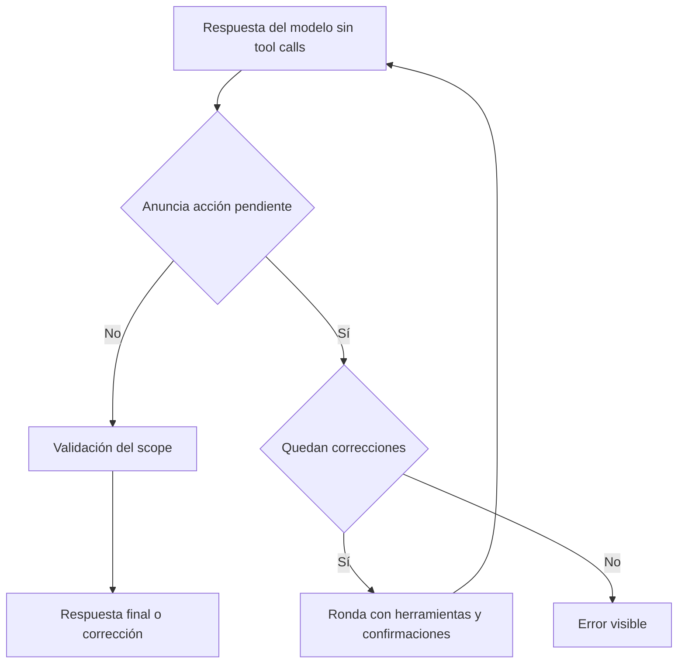

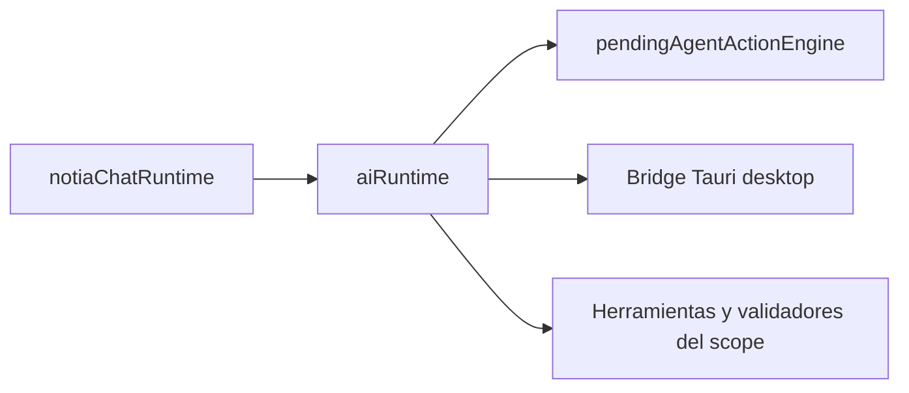

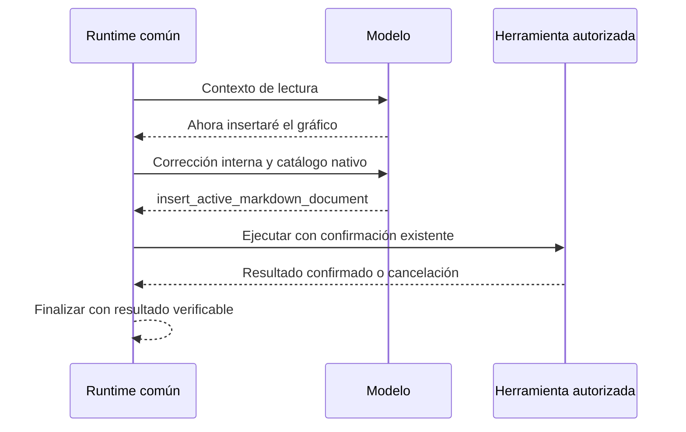

El watcher de desarrollo de Tauri usa `src-tauri/.taurignore` para excluir `.gradle/`, `.kotlin/`, `.cxx/` y `.externalNativeBuild/` a cualquier profundidad, y las carpetas `build/` dentro de `gen/android/` y `vendor/`. Gradle modifica locks, índices y salidas durante sus tareas; observar esos archivos puede provocar reinicios continuos del desktop aun cuando Cargo no recompila código. La importación Java/Gradle de VS Code también procesa `vendor/llama.cpp/examples/llama.android/`: limitar las reglas a `gen/android/` no basta. Las fuentes Kotlin/Java/C++/Rust, `AndroidManifest.xml` y scripts Gradle permanecen observados. Vite ya excluye `src-tauri/**`; este ajuste corresponde al watcher nativo, no al HMR de React. Reiniciar el proceso `tauri dev` después de cambiar estas reglas. Se utiliza el mecanismo oficial [.taurignore de Tauri](https://v2.tauri.app/develop/#reacting-to-source-code-changes).

Regresión: `node --test scripts/tauri-watcher.test.mjs` comprueba las rutas del incidente (incluidos los ejemplos vendorizados) y que las fuentes/configuración no queden excluidas. La validación en Windows con Tauri CLI 2.10.1 reprodujo los reinicios por `vendor/llama.cpp/examples/llama.android/.gradle/`; tras ampliar las reglas, el PID de Notia se mantuvo estable durante más de un minuto mientras Gradle continuaba escribiendo en esa caché. Actualizar únicamente la fecha de modificación de `tauri.windows.dev.conf.json` provocó el reinicio esperado, confirmando que la recarga de configuración continúa activa. La prueba de regresión y su lint aprobaron.

## XGraph: JSXGraph en Milkdown

Los errores del iframe ocupan una franja en el flujo Flex encima del tablero, sin superposición. El tablero conserva el espacio restante y recorta sus elementos al contenedor para que las etiquetas JSXGraph no se dibujen sobre el aviso. La franja anuncia el fallo con `role="alert"`, advierte que la construcción puede estar incompleta y ofrece el detalle técnico mediante `details/summary`, con objetivo de 48 px y foco visible. Su altura máxima es la mitad del iframe, con scroll para mensajes largos; el contenido se asigna con `textContent`. Editar el código reconstruye el iframe y descarta el aviso anterior. Se conserva el ResizeObserver propio de JSXGraph para adaptar el tablero al espacio disponible.

La presentación del error se verificó en Chromium a 1100×850, 390×600 y 720×360: conserva el gráfico parcial, no superpone el aviso, admite detalle por toque/Enter, mantiene al menos la mitad del espacio para el tablero ante mensajes largos y elimina el error al corregir el código. También se comprobó que HTML dentro del mensaje se muestra como texto. Build frontend, 259 pruebas y lint de los archivos afectados aprobados; sigue pendiente la comprobación en tableta Android física.

`MarkdownView` agrega XGraph al grupo avanzado y delega los bloques `xgraph`/`jsxgraph` a `xgraphEngine`. Se conserva el nodo `code_block`, su serialización Markdown y el toggle nativo Hide/Edit usado por Math. No cambia ningún DTO ni comando Tauri. La exportación estática conserva el código.

El agente recibe `XGRAPH_AGENT_GUIDE` (`services/ai/xgraphAgentPrompt.ts`) al construir el prompt común en `buildChatAgentSystemPrompt`, después del prompt elegido y antes de las reglas y restricciones del scope. Incluye sintaxis `xgraph`/`jsxgraph`, variables disponibles, ejemplos de puntos, funciones y slider, Hide/Edit, persistencia, aislamiento y límites reales. El límite de fuente se toma del motor puro. El mapa de módulos de `DEFAULT_AGENT_PROMPT` también identifica XGraph. La guía se agrega en memoria en cada conversación, incluso con `default.md` antiguo, agentes personalizados y scopes publicados: no requiere migrar ni reescribir `.agent/promps/*.md`. No agrega tools, permisos ni un motor conversacional; Telegram mantiene HTML en sus respuestas y usa Markdown únicamente como contenido de archivos. Las pruebas de composición cubren los cinco scopes con un prompt personalizado y el formato Telegram.

`xgraphEngine` reconoce lenguajes sin distinguir mayúsculas, limita la fuente a 100.000 caracteres y genera un placeholder con código URI-encoded. `xgraphPreviewRuntime` observa exclusivamente la raíz del editor, espera visibilidad con margen de 200 px y difiere 300 ms el montaje para cancelar renders obsoletos al escribir. Al eliminar/reemplazar el bloque o cerrar el editor desconecta observadores, cancela temporizadores y elimina el iframe. El runtime y la hoja de estilos se empaquetan como recursos separados y el iframe los carga por URL: no se copia el megabyte de JSXGraph al `srcdoc` y su parseo queda diferido hasta que el gráfico es visible.

Milkdown sanitiza los placeholders. El adaptador monta después un iframe con `sandbox="allow-scripts"`, sin `allow-same-origin`, con origen opaco y CSP propia (`default-src 'none'`, `connect-src 'none'`, scripts con nonce y evaluación interna). El JavaScript de la nota se pasa como string JSON con `<` escapado a una función dentro de ese iframe, nunca se evalúa en la aplicación. El contrato ofrece `board`, `JXG` y `BOARDID = 'box'`. Los errores se muestran mediante `textContent`, sin registrar contenido privado. No habilitar Tauri, navegación superior, ventanas emergentes, formularios ni red en este sandbox.

La dependencia directa `jsxgraph@1.13.2` (MIT o LGPL-3.0-or-later) implementa geometría interactiva sin dependencias runtime adicionales; se utiliza bajo MIT. Su distribución oficial se empaqueta como un recurso JavaScript separado y se carga exclusivamente dentro del sandbox cuando el gráfico entra en la zona visible, funcionando offline en Chromium/WebView de Windows y Android. El recurso ocupa aproximadamente 1.024 kB (260 kB gzip) y no se copia al documento principal ni al `srcdoc`. No se modifican archivos de la dependencia. Referencia: [JSXGraph Getting Started](https://jsxgraph.org/home/start/gettingstarted/).

Los controles propios y de navegación del tablero tienen objetivos de 48 px; el iframe tiene ancho fluido y altura entre 280 y 520 px basada en `dvh`. El paneo requiere dos dedos para evitar apropiarse del gesto normal de scroll. Hide/Edit no reconstruye el tablero. Los cambios del tablero no se escriben en el `.md`: únicamente persiste la fuente. El límite de caracteres no limita la CPU de JavaScript arbitrario; grandes construcciones y bucles infinitos siguen siendo una limitación. Queda pendiente medir memoria, tiempos y gestos sobre tableta Android física de gama media.

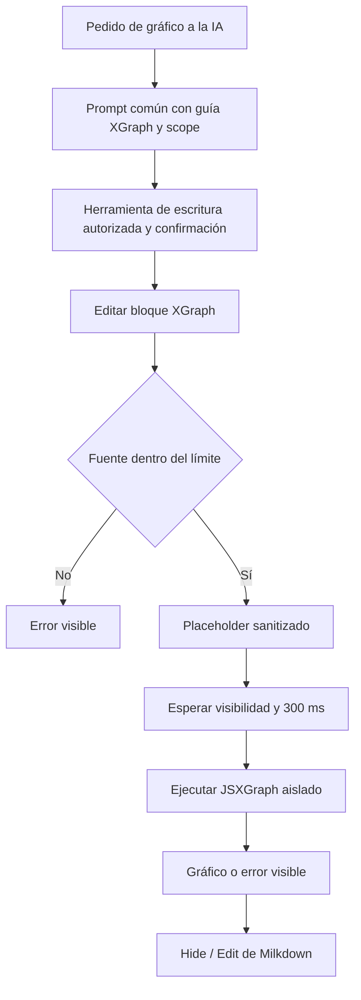

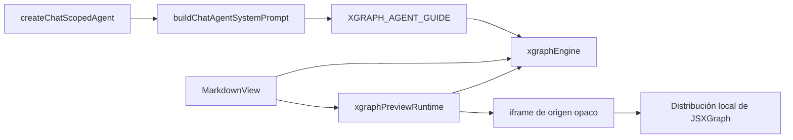

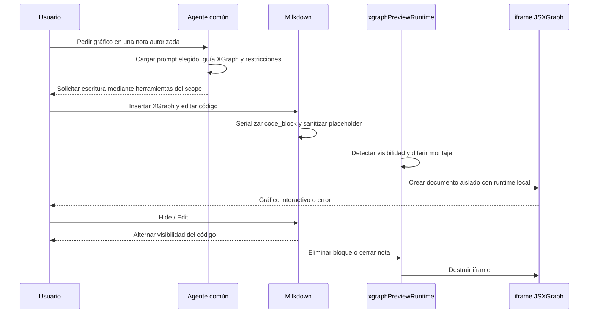

Evaluación de cohesión, arquitectura y calidad para esta extensión: motor puro y adaptador de DOM separados, dependencia dirigida desde la vista y sin ciclos nuevos. No agrega estado Redux ni lógica al backend. Las pruebas del motor cubren contrato de lenguaje, preservación del código, límites e inyección de etiquetas. El montaje requiere validación de navegador; el iframe impide acceso al host pero no es una cuota de CPU ni memoria. La construcción del HTML permanece centralizada para revisar su frontera de seguridad.

Validación de esta incorporación: build frontend y 233 pruebas aprobadas; lint de los archivos afectados aprobado. Chromium con `MarkdownView` real verificó render, Hide/Edit, edición/serialización, errores, bloqueo de acceso al documento padre, desmontaje y toque a 390 px de ancho. El lint global conserva 24 errores y 9 advertencias ajenos a XGraph. Android arm64 compiló la biblioteca nativa de depuración; el empaquetado falló al crear el symlink de `libnotia_lib.so` por falta de privilegios de Windows. El script `build:android:debug` falla antes en su invocación de `npx.cmd`; se verificó invocando directamente el CLI JavaScript de Tauri. No se instaló la app ni se verificó en dispositivo físico.

> Documentación técnica orientada a ingenieros de software.  
> Stack: React 19 + TypeScript 5.9 + Vite 7 + Redux Toolkit + MUI v7 + Tauri v2 (Rust 2021).

---

### Tools de consulta financiera del agente

El scope `finance` expone consultas tipadas adicionales a traves de `chatScopedAgentRuntime.ts`: `get_finance_dollar_quotes` usa `https://dolarapi.com/v1/dolares`; `get_finance_inflation_indices` usa los endpoints mensual e interanual de ArgentinaDatos; y `get_finance_historical_dollar_quotes` usa `https://api.argentinadatos.com/v1/cotizaciones/dolares/oficial`. Las tres respuestas conservan la fuente y los servicios aplican validacion de payload y timeout de 10 segundos. Las consultas locales `list_finance_price_history`, `get_finance_net_worth` y `list_finance_net_worth_history` delegan en los comandos Tauri existentes, respetando el scope de la biblioteca activa.

El agente debe elegir estas tools para preguntas de mercado, IPC, historial de cotizaciones, precios observados o patrimonio; no debe inventar valores ni presentar datos externos como si fueran persistidos en la biblioteca. Los endpoints externos son solo lectura y requieren conectividad.

## 1. Documentación General

### 1.1 Descripción Técnica del Servicio

Notia es una aplicación de gestión de conocimiento **local-first** construida con **Tauri v2**, que combina un frontend React 19 compilado con Vite 7 y un backend en Rust (edición 2021). La aplicación opera sin servidor cloud: todos los datos (notas Markdown, diagramas Mermaid, credenciales ColdPass, tareas y sesiones de chat) persisten en el filesystem local del usuario. La comunicación entre frontend y backend se realiza exclusivamente mediante **Tauri Commands** (`invoke`/`listen`) y **Custom Events** internos del frontend.

### 1.2 Stack de Tecnologías

| Capa | Tecnología | Versión |
|---|---|---|
| Framework Desktop/Mobile | Tauri | v2 |
| Frontend | React | 19.2.0 |
| Lenguaje Frontend | TypeScript | ~5.9.3 |
| Build Tool | Vite | 7.3.1 |
| Estado Global | Redux Toolkit + React Redux | ^2.11.2 / ^9.2.0 |
| UI Components | Material UI (MUI) | ^7.3.9 |
| CSS-in-JS | Emotion (React/Styled) | ^11.14.0 / ^11.14.1 |
| Iconos | Lucide React | ^0.577.0 |
| Editor Markdown | @milkdown/crepe | ^7.19.0 |
| Diagramas | Mermaid | ^11.14.0 |
| Backend | Rust | Edition 2021 |
| Serialización Rust | Serde + serde_json | ^1 |
| HTTP Client Rust | reqwest | 0.13.2 |
| Async Runtime Rust | Tokio | ^1 |
| Bluetooth LE Rust | btleplug | 0.11.7 |
| File Watcher Rust | notify | 6.1.1 |
| Logging Rust | log + env_logger/android_logger | 0.4 / 0.11 / 0.14 |
| Performance Timing Rust | `notia_timer.rs` (RAII scope timer) | internal |
| Diálogos Nativos | tauri-plugin-dialog | ^2 |
| Base local | SQLite embebido mediante `rusqlite` | ^0.32 |

### 1.3 Cómo Levantar el Proyecto en Local

#### Requisitos previos

- **Node.js** 20+ y **npm** 10+.
- **Rust toolchain** (`rustup`, `cargo`, `rustc`).
- **Git**.
- En **Linux**: paquetes del sistema listados en `README.md` (webkit2gtk, openssl, gtk3, appindicator, librsvg, dbus, bluez).
- En **Android**: Android SDK + NDK (auto-detectado por los scripts en `$HOME/Android/Sdk/ndk/*`).

#### Pasos

```bash
# 1. Clonar
git clone <repository-url>
cd notia

# 2. Instalar dependencias Node
npm install

# 3. Desarrollo desktop (Linux auto-detecta Wayland/X11)
npm run dev:tauri

# 4. Desarrollo Android
npm run dev:android
```

#### Scripts relevantes (`package.json`)

| Script | Descripción |
|---|---|
| `npm run dev` | Vite dev server (solo web, puerto 1420) |
| `npm run build` | Compilación TypeScript + build Vite |
| `npm run lint` | ESLint |
| `npm run dev:tauri` | Dev desktop Linux (auto-detect backend) |
| `npm run dev:tauri:windows` | Dev desktop Windows; inicia Vite de forma controlada o reutiliza el Vite de este repositorio si ya ocupa el puerto 1420. Rechaza procesos ajenos y ejecuta Tauri sin duplicar `beforeDevCommand`. |
| `npm run dev:tauri:wayland` | Fuerza backend Wayland |
| `npm run dev:tauri:wayland:fallback` | Wayland con fallback a X11 |
| `npm run dev:tauri:x11` | Fuerza backend X11 |
| `npm run dev:android` | Dev en dispositivo Android |
| `npm run build:android:debug` | APK debug aarch64 |
| `npm run build:android:release` | APK release firmado |
| `npm run build:android:aab` | Android App Bundle (Play Store) |
| `npm run install:android:release` | Instala APK release por adb |
| `npm run build:tauri` | Build release empaquetado Tauri |

### 1.4 Variables de Entorno Relevantes

| Variable | Valores | Uso |
|---|---|---|
| `NOTIA_TAURI_BACKEND` | `wayland` \| `x11` | Forzar backend gráfico en Linux |
| `NOTIA_TAURI_FALLBACK_X11` | `0` \| `1` | Si Wayland falla, reintentar en X11 |
| `NOTIA_ANDROID_KEYSTORE_PATH` | ruta al `.keystore` | Firma release Android |
| `NOTIA_ANDROID_KEYSTORE_PASSWORD` | string | Password del keystore |
| `NOTIA_ANDROID_KEY_ALIAS` | string | Alias de la clave |
| `NOTIA_ANDROID_KEY_PASSWORD` | string | Password de la clave |

### 1.5 Decisiones Arquitectónicas Clave

1. **Local-first / Filesystem como fuente de verdad**: todos los documentos (Markdown, Mermaid, ColdPass, Task Manager) se almacenan como archivos en el filesystem. SQLite se reserva para índices y datos estructurados de la aplicación; no hay servidor. El estado en Redux modela solo UI, selección y datos derivados.
2. **Cifrado de ColdPass en frontend**: la passkey nunca viaja al backend. El cifrado/descifrado AES-256-GCM con PBKDF2 (250k iteraciones) se ejecuta en el navegador vía **Web Crypto API**. El backend Rust solo lee/escribe bytes opacos.
3. **Renderizado de Graph View mediante motor Mermaid compartido**: el grafo de wikilinks se modela en el hilo principal (`useLibraryGraphData.ts`) y se convierte a código Mermaid vía `linkCacheMermaidEngine.ts`. La vista utiliza el mismo `MermaidCanvas` que el editor de diagramas, garantizando coherencia visual y un único motor de renderizado. Web Workers pueden emplearse para cómputo pesado puntual, pero actualmente no hay workers activos en el frontend.
4. **Redux Toolkit para estado global**: 5 slices (`ui`, `preferences`, `library`, `documents`, `explorer`) con persistencia de preferencias en `localStorage` dentro de los propios reducers.
5. **Separación commands/services/dto en Rust**: los Tauri commands (`commands/`, `filesystem/commands.rs`) son una capa delgada que deserializa, valida y delega a `services/`. La lógica de negocio nunca vive en los commands.
6. **Filesystem module auto-contenido**: el módulo `src-tauri/src/filesystem/` tiene su propia capa de commands → desktop/android_saf → helpers/validation/types, facilitando el mantenimiento multiplataforma.
7. **SQLite por librería**: al cargar una librería se inicializa de forma idempotente `.notia/notia.db`. En desktop se abre directamente con SQLite compilado dentro del binario mediante `rusqlite`; en Android, `resources/database/android/LibraryDatabasePlugin.kt` se copia durante el build (sin editar `gen`) y mantiene una copia privada temporal sincronizada por SAF después de cada mutación. La pérdida de URI o revocación de permisos produce un error recuperable. Las versiones se mantienen en `notia_schema_migrations`; v2–v13 incorporan cuentas, categorías, movimientos, evidencias, compras/productos/precios, sueldos, ahorro, inversiones, huellas de deduplicación, cuotas, el catálogo inicial de diez categorías de gasto, su restauración para bases vaciadas y la evidencia de firma de recibos salariales. Las migraciones son transaccionales e idempotentes.

8. **Plataforma condicional**: uso de `#[cfg(...)]` en Rust y `getRuntimeDevice()` en TypeScript para proveer stubs en plataformas no soportadas, nunca dejando un command sin implementación.

9. **Módulo de Finanzas**: `FinanceView` monta el módulo React nativo de `src/modules/finance/` dentro de la pestaña especial `__workspace_finance__`. Sus datos estructurados viven en SQLite por librería y se acceden mediante servicios TypeScript y comandos Tauri tipados; no se usa un iframe ni almacenamiento financiero en el navegador. Compras, sueldos, ahorro y cuotas usan transacciones SQLite para conservar sus relaciones contables. La pestaña interna **Dev** permite inspeccionar entidades financieras y ejecutar una única consulta `SELECT`/`WITH` paginada; el comando nativo rechaza SQL de escritura. Desde allí también se puede cargar una semilla idempotente de julio/agosto de 2026, que cubre todas las entidades financieras sin borrar ni modificar datos existentes. Home muestra tarjetas con compra y venta de los dólares oficial, blue y tarjeta, consultados desde `https://dolarapi.com/v1/dolares` con validación y timeout. Documentos y patrimonio agrega un gráfico salarial dual ARS/USD sobre todo el historial disponible: convierte cada cobro con la venta oficial histórica más reciente de `https://api.argentinadatos.com/v1/cotizaciones/dolares/oficial`, calcula escalas monetarias legibles en el eje Y, ofrece un tooltip exacto por período mediante hover, foco o toque y amplía horizontalmente el SVG para conservar legibles los períodos. Las tarjetas de resumen contrastan la variación salarial móvil contra el IPC acumulado y la inflación interanual de `https://api.argentinadatos.com/v1/finanzas/indices/inflacion` y `https://api.argentinadatos.com/v1/finanzas/indices/inflacionInteranual`; cada respuesta se valida, se cancela tras diez segundos y solo se compara cuando los doce meses y el período interanual están alineados. No monta un chat propio: el chat lateral común recibe el scope `finance` cuando esta vista está activa.

### Contratos financieros Tauri

Los DTO usan `camelCase` y todos reciben `FinanceContext { libraryPath, androidDirectoryUri }`. Los comandos base son `finance_get_dashboard`, `finance_save_account`, `finance_save_category`, `finance_save_transaction`, sus bajas lógicas, y los comandos de reservas/ahorro. Los dominios documentales agregan `finance_save_purchase`, `finance_list_purchases`, `finance_list_price_history`, `finance_save_salary`, `finance_list_salaries`, `finance_save_installment_plan`, `finance_save_investment`, `finance_get_net_worth` y `finance_list_net_worth_history`. La validación de tickets compara importes en centavos exactos, contempla impuestos informativos ya incluidos y admite una diferencia fiscal máxima de un centavo; el gasto siempre toma el total final impreso. Los ajustes de redondeo visibles se extraen como líneas independientes. Los recibos validan cuenta y moneda, conceptos tipados y unicidad por empleador/período; normalmente también exigen que el neto coincida con bruto menos descuentos. Cuando la evidencia es un PDF que indica una firma digital, electrónica o manuscrita, conservan `signed_document` y aceptan el neto impreso como autoritativo aunque existan adelantos, ajustes u otros conceptos que no cierren esa ecuación simple. Al confirmarse crean el ingreso neto en la misma transacción y las consultas históricas recuperan conceptos y evidencia. El agente común expone `create_finance_salary`, que en Telegram auto-confirma y vuelve a leer el período guardado para comprobar el registro completo; antes de enviar el mensaje terminal, el bridge repite la lectura con el ID y todos los campos devueltos. Una respuesta que afirme la carga sin esa prueba se reemplaza por un error y nunca se comunica como éxito. Duplicados, validación y almacenamiento conservan resultados deterministas como `create_finance_purchase`. `finance_clear_all_data` recibe directamente `{ context: FinanceContext }` y vacía los datos y catálogos financieros personalizados en una única transacción respetando claves foráneas; dentro de esa misma transacción restaura las diez categorías de gasto iniciales y conserva `notia_schema_migrations`, el archivo SQLite y cualquier tabla ajena a Finanzas. La UI solo lo invoca desde **Configuraciones → Finanzas** después de aceptar un modal destructivo y publica un evento interno para refrescar cualquier dashboard montado. Todos los comandos financieros devuelven errores serializables `{ code, message }`, con códigos `validation`, `notFound`, `conflict` o `storage`. `extract_finance_document` acepta únicamente un archivo dentro de la biblioteca desktop, de hasta 15 MB y extensión PDF/PNG/JPG/WEBP; la API key se lee de `LLAMA_CLOUD_API_KEY` en Rust y nunca forma parte del payload frontend.

Los resúmenes de tarjeta usan `finance_save_credit_card_statement` y `finance_list_credit_card_statements`. Validan una cuenta activa `credit_card`, moneda, agregados por tipo y la ecuación entre saldo anterior, pagos, créditos, consumos, cargos, impuestos y total. Consumos y cargos crean gastos o se concilian con movimientos existentes; pagos y créditos solo se conservan como conciliación, y el total a pagar nunca se registra nuevamente como gasto. El runtime común expone `create_finance_credit_card_statement` con auto-confirmación y resultado terminal en Telegram.

La evidencia original vive en `finance_source_artifacts`; las respuestas completas del extractor en `finance_extraction_results`. Borrar o reemplazar la referencia física no elimina compras, líneas, precios, recibos ni resúmenes normalizados. Las bajas de movimientos son lógicas y cuentas/categorías se desactivan. No se registran tokens, documentos, prompts ni payloads financieros en logs.

El scope `finance` de `createChatScopedAgent` no adjunta documentos de la biblioteca. Lista cuentas y categorías mediante herramientas, exige aclaración si falta la cuenta, no permite SQL ni creación implícita de categorías y ejecuta mutaciones por `notiaChatRuntime.ts`. Telegram selecciona ese mismo scope para solicitudes financieras, conserva `actorUserId`, deduplica updates y, en audio, aporta al caso de uso la transcripción más el `fileId` original. Las confirmaciones siguen usando el bridge HTML común y expiran a los dos minutos.
   El dashboard y los comandos financieros del primer corte funcionan en desktop. El plugin Android actual solo implementa inicialización/sincronización de la base por SAF; las operaciones CRUD financieras móviles requieren ampliar ese adapter antes de declarar paridad Android.

---

## 2. Documentación Específica de Flujos

> Para cada flujo documentado se incluyen: **entradas y salidas** (tipos, formatos, contratos), **validaciones aplicadas**, **pasos del proceso**, **comportamiento ante errores**, **dependencias con otros módulos**, y **ejemplos JSON completos** de request/response para los commands del backend.

### 2.1 Filesystem — Sincronización de Árbol de Librería

#### Descripción
Carga y mantenimiento del árbol de archivos de la librería activa. En **desktop** se usa un file watcher nativo (`notify` crate). En **Android** se usa el Storage Access Framework (SAF) con polling opcional.

#### Endpoints (Commands Tauri)

| Command | Tipo | Payload | Response |
|---|---|---|---|
| `read_library_tree` | Síncrono | `ReadLibraryTreePayload` | `Vec<FileNode>` |
| `read_library_tree_signature` | Síncrono | `ReadLibraryTreePayload` | `String` (hash hex) |
| `start_library_tree_watch` | Síncrono | `{ directoryPath: string }` | `{ ok: boolean }` |
| `stop_library_tree_watch` | Síncrono | — | `{ ok: boolean }` |

#### Ejemplo JSON — Request `read_library_tree`

```json
{
  "payload": {
    "directoryPath": "/home/usuario/Notas"
  }
}
```

#### Ejemplo JSON — Response `read_library_tree`

```json
[
  {
    "id": "folder-1",
    "name": "Proyectos",
    "path": "/home/usuario/Notas/Proyectos",
    "type": "folder",
    "expanded": false,
    "children": [
      {
        "id": "file-1",
        "name": "README.md",
        "path": "/home/usuario/Notas/Proyectos/README.md",
        "type": "file"
      }
    ]
  },
  {
    "id": "file-2",
    "name": "Ideas.md",
    "path": "/home/usuario/Notas/Ideas.md",
    "type": "file"
  }
]
```

#### Ejemplo JSON — Response `read_library_tree_signature`

```json
"a3f7b2c1"
```

#### Entradas
- `directoryPath: string` — path absoluto de la librería (normalizado por `normalizeFilesystemPath`).
- `androidDirectoryUri?: string` — URI de árbol SAF (solo Android).

#### Salidas
- `FilesystemTreeNode[]` — árbol jerárquico de `id`, `name`, `path`, `type`, `expanded`, `hasChildren`, `children`.
- `string` — `treeSignature` (hash FNV-1a del árbol) para detectar cambios sin re-leer todo.
- Evento `notia-library-tree-changed` (desktop) — payload con `watchedPath` y `changedPathHint`.

#### Validaciones
- **Frontend**: `normalizeFilesystemPath` sanitiza separadores (`\` → `/`). Rechaza strings vacíos.
- **Backend**: `validation.rs` rechaza nombres con `/`, `\\`, `.`, `..`, strings vacíos.
- **Backend**: canonicalización con `fs::canonicalize` (fallback al path original).

#### Pasos del proceso (Desktop)

1. **Inicialización**: `useLibraryTreeSync` (hook) detecta cambio de librería activa.
2. **Carga inicial**: `filesystemEngine.readLibraryTree(path)` → `invoke('read_library_tree')` → Rust `filesystem::commands::read_library_tree` → `desktop::read_library_tree` → escaneo recursivo del filesystem → serialización de `FileNode[]`.
3. **Firma**: `filesystemEngine.readLibraryTreeSignature(path)` → `invoke('read_library_tree_signature')` → hash FNV-1a de todos los nodos.
4. **Watcher**: `libraryTreeWatchRuntime.startDesktopLibraryTreeWatch(path)` → `invoke('start_library_tree_watch')` → Rust `filesystem::watch` instancia `notify::RecommendedWatcher` sobre el directorio.
5. **Evento de cambio**: el watcher detecta modificación externa → emite evento Tauri `notia-library-tree-changed`.
6. **Frontend reacciona**: `subscribeToDesktopLibraryTreeWatchBridge` escucha el evento → `dispatchLibraryTreeChanged()` → CustomEvent `notia:library-tree-changed` → slices de Redux actualizan el árbol → re-render de `FileTree`.

#### Pasos del proceso (Android)

1. **Selección de carpeta**: `filesystemEngine.pickDirectory()` → `invoke('pick_android_directory_tree')` → Rust `mobile_directory_picker` → intent SAF nativo → retorna `path` + `uri`.
2. **Lectura del árbol**: `invoke('read_android_library_tree')` → Rust `mobile_directory_picker::read_android_library_tree` → recorrido SAF recursivo → `FileNode[]`.
3. **Polling (opcional)**: en Settings se configura `explorer-refresh-interval-ms`. El hook `useLibraryTreeSync` re-lee la firma periódicamente y compara con la anterior; si difiere, re-carga el árbol completo.
4. **Flat file list**: para indexado de búsqueda y grafo, `readLibraryFlatFileList()` invoca `read_android_flat_file_list` (comando exclusivo de Android) para obtener lista plana sin recursión de árbol.

#### Comportamiento ante errores
- Si el path está vacío o normalizado a vacío: retorna `[]` silenciosamente.
- Si el backend falla en desktop: consola con prefijo `[filesystemEngine]`; el árbol previo permanece.
- Si el watcher falla al iniciar: retorna `false` en `startDesktopLibraryTreeWatch`; no se reintenta automáticamente.
- En Android, si el comando `pick_android_directory_tree` no existe (backend desactualizado), se lanza error explícito pidiendo recompilar la app.

#### Dependencias
- **Frontend services**: `filesystemEngine.ts`, `libraryTreeWatchRuntime.ts`, `libraryTreeEvents.ts`, `notiaLogger.ts`.
- **Redux slices**: `librarySlice` (librería activa), `documentsSlice` (nodos del árbol), `explorerSlice` (carpetas expandidas).
- **Backend commands**: `read_library_tree`, `read_library_tree_signature`, `start_library_tree_watch`, `stop_library_tree_watch`, `pick_android_directory_tree`, `read_android_library_tree`, `read_android_flat_file_list`, `read_android_directory`.
- **Backend services**: `desktop.rs`, `android_saf.rs`, `watch.rs`.

---

### 2.2 Filesystem — CRUD de Entradas

#### Descripción
Creación, lectura, actualización y eliminación de archivos y carpetas dentro de una librería, con soporte desktop y Android SAF.

#### Endpoints (Commands Tauri)

| Command | Tipo | Payload | Response |
|---|---|---|---|
| `create_library_entry` | Síncrono | `CreateLibraryEntryPayload` | `OperationResult` |
| `library_entry_operation` | Síncrono | `LibraryEntryOperationPayload` | `OperationResult` |
| `read_library_file` | Síncrono | `ReadLibraryFilePayload` | `ReadLibraryFileResult` |
| `write_library_file` | Síncrono | `WriteLibraryFilePayload` | `WriteLibraryFileResult` |
| `path_exists` | Síncrono | `PathExistsPayload` | `PathExistsResult` |
| `is_directory_path` | Síncrono | `PathExistsPayload` | `IsDirectoryPathResult` |

#### Ejemplo JSON — Request `create_library_entry`

```json
{
  "payload": {
    "directoryPath": "/home/usuario/Notas/Proyectos",
    "name": "Nueva Nota",
    "kind": "note"
  }
}
```

#### Ejemplo JSON — Response `create_library_entry`

```json
{
  "ok": true
}
```

#### Ejemplo JSON — Request `library_entry_operation` (rename)

```json
{
  "payload": {
    "action": "rename",
    "targetPath": "/home/usuario/Notas/Proyectos/ViejoNombre.md",
    "newName": "NuevoNombre.md"
  }
}
```

#### Ejemplo JSON — Response `library_entry_operation`

```json
{
  "ok": true
}
```

#### Ejemplo JSON — Request `read_library_file`

```json
{
  "payload": {
    "filePath": "/home/usuario/Notas/Proyectos/README.md"
  }
}
```

#### Ejemplo JSON — Response `read_library_file`

```json
{
  "ok": true,
  "content": "# Proyecto Alpha\n\nEste es el README del proyecto.",
  "error": null
}
```

#### Ejemplo JSON — Request `write_library_file`

```json
{
  "payload": {
    "filePath": "/home/usuario/Notas/Proyectos/README.md",
    "content": "# Proyecto Alpha\n\nContenido actualizado."
  }
}
```

#### Ejemplo JSON — Response `write_library_file`

```json
{
  "ok": true,
  "error": null
}
```

#### Validaciones
- `validate_create_library_entry_payload`: rechaza nombres vacíos, con `/`, `\\`, `.`, `..`.
- `validate_library_entry_operation_payload`: parsea y normaliza la acción; valida que existan los paths requeridos según la acción.

#### Pasos del proceso

1. **Crear entrada**: frontend `filesystemEngine.createLibraryEntry()` → `invoke('create_library_entry')` → Rust valida nombre → determina extensión según `kind` (`.md`, `.mmd`, sin extensión para carpetas) → crea en desktop con `fs::create_dir`/`fs::write` o en Android SAF.
2. **Eliminar**: `invoke('library_entry_operation')` con `action: 'delete'` → Rust valida → `desktop::delete_entry` (o SAF) → `fs::remove_file`/`remove_dir_all`.
3. **Renombrar**: `action: 'rename'` → `desktop::rename_entry` → `fs::rename`.
4. **Copiar/Mover**: `action: 'paste'` con `mode: 'copy'` o `'move'` → lectura del source → escritura en target → si es move, eliminación del source.

#### Comportamiento ante errores
- Nombre inválido: retorna inmediatamente `OperationResult` con error descriptivo en español.
- Path no existe: error de filesystem propagado como string al frontend.
- Operación en Android sin `directoryUri`: puede fallar si SAF no tiene permiso persistido.

#### Dependencias
- **Frontend**: `filesystemEngine.ts`, `useFileTreeActions.ts`, `FileTreeContextMenu.tsx`.
- **Backend**: `create_library_entry`, `library_entry_operation`, `validation.rs`, `desktop.rs`, `android_saf.rs`.

---

### 2.3 Markdown — Edición de Documentos

#### Descripción
Flujo completo de lectura, renderizado, edición, autosave y persistencia de un documento Markdown en Notia.

#### Endpoints (Commands Tauri)

| Command | Tipo | Payload | Response |
|---|---|---|---|
| `read_library_file` | Síncrono | `ReadLibraryFilePayload` | `ReadLibraryFileResult` |
| `write_library_file` | Síncrono | `WriteLibraryFilePayload` | `WriteLibraryFileResult` |
| `read_markdown_files` | Síncrono | `{ directoryPath: string }` | `Vec<MarkdownFileDocument>` |

#### Ejemplo JSON — Request `read_markdown_files`

```json
{
  "payload": {
    "directoryPath": "/home/usuario/Notas"
  }
}
```

#### Ejemplo JSON — Response `read_markdown_files`

```json
[
  {
    "path": "/home/usuario/Notas/Ideas.md",
    "content": "# Ideas\n\n- Idea 1\n- Idea 2"
  },
  {
    "path": "/home/usuario/Notas/Proyectos/README.md",
    "content": "# Proyecto Alpha"
  }
]
```

#### Entradas
- `filePath: string` — path absoluto del archivo Markdown.
- `directoryUri?: string` — URI SAF (Android).

#### Salidas
- `ReadLibraryFileResult` — `{ ok, content, error? }`.
- `WriteLibraryFileResult` — `{ ok, error? }`.
- Estado local del documento (Milkdown editor) y pestañas abiertas en Redux.

#### Validaciones
- **Frontend**: path vacío rechazado antes de invocar.
- **Backend**: path vacío retorna `{ ok: false, error: "Invalid file path." }`. En Android, intenta SAF primero; si falla, retorna error sin tocar desktop.

#### Pasos del proceso

1. **Apertura**: el usuario hace clic en un archivo `.md` en `FileTree` → `useDocumentOpener` verifica si ya está abierto (evita duplicados) → dispatch `documentsSlice.actions.openDocument({ path, title })`.
2. **Lectura**: `useDocumentPersist` o `MarkdownView` invoca `filesystemEngine.readTextFile(path)` → `invoke('read_library_file')` → Rust `filesystem::commands::read_library_file` → `desktop::read_library_file` (o `android_saf::read_library_file`) → lectura con `fs::read_to_string` → retorna `{ ok: true, content }`.
3. **Renderizado**: el contenido se inyecta en el editor **Milkdown Crepe** (`MarkdownView.tsx`). Se parsea frontmatter vía `frontmatterEngine.ts` y se muestra en `MarkdownPropertiesPanel`.
4. **Wikilinks**: durante la edición, el plugin `wikiLinkPlugin.ts` detecta patrones `[[...]]` y muestra el menú de sugerencias `WikiLinkSuggestionMenu.tsx` con notas existentes.
5. **Autosave**: `useTextDocumentAutosave.ts` establece un debounce (tipicamente ~1s de inactividad) tras el cual invoca `filesystemEngine.writeTextFile(path, content)`.
6. **Persistencia**: `invoke('write_library_file')` → Rust `filesystem::commands::write_library_file` → valida path no vacío → `desktop::write_library_file` (o SAF) → `fs::write` → retorna `{ ok: true }`.
7. **Indicadores**: el slice `documentsSlice` actualiza el flag `isSaving` / `saveError` para mostrar el indicador visual en la pestaña.

#### Comportamiento ante errores
- Lectura fallida: el editor se abre vacío o con mensaje de error; no se bloquea la UI.
- Escritura fallida: indicador de error ✗ en la pestaña; el contenido modificado permanece en memoria (Redux + estado local del editor), permitiendo reintentar.
- Path vacío: rechazo inmediato en frontend y backend con mensaje en inglés técnico ("Invalid file path.") que el frontend traduce a contexto amigable.

#### Dependencias
- **Frontend**: `MarkdownView.tsx`, `useDocumentPersist.ts`, `useTextDocumentAutosave.ts`, `wikiLinkPlugin.ts`, `frontmatterEngine.ts`, `filesystemEngine.ts`.
- **Redux**: `documentsSlice` (tabs, activeTab, saving states).
- **Backend**: `read_library_file`, `write_library_file`.

---

### 2.4 Graph View

#### Descripción
Construcción y visualización de un grafo de conocimiento donde los nodos son archivos Markdown y las aristas son wikilinks entre ellos. A partir de la versión 1.0.13, el Graph View utiliza el **mismo motor Mermaid** que el editor de diagramas: el modelo de nodos y aristas se convierte a código Mermaid (`linkCacheMermaidEngine.ts`) y se renderiza mediante `MermaidCanvas.tsx`, aprovechando zoom/pan, temas y caché LRU compartidos.

#### Endpoints (Commands Tauri)

| Command | Tipo | Payload | Response |
|---|---|---|---|
| `read_markdown_files` | Síncrono | `{ directoryPath: string }` | `Vec<MarkdownFileDocument>` |

#### Entradas
- `treeNodes: FilesystemTreeNode[]` — árbol de archivos (para detectar archivos Markdown).
- `rootPath: string` — path de la librería.
- `graphSourcesByPath: Record<string, string>` — contenido de cada archivo (para extraer wikilinks).
- `flatFileList: FilesystemFlatFileEntry[]` — lista plana de archivos (usada en Android para evitar escaneo recursivo).

#### Salidas
- `LibraryGraphModel` — `{ nodes: GraphNode[], edges: GraphEdge[] }`.
- `Mermaid source` — código Mermaid generado por `buildLinkCacheMermaidCode()`.
- Renderizado SVG/DOM posicionado por Mermaid, interactivo vía `MermaidCanvas`.
- Archivo `.notia/linkCache.md` — cache del diagrama regenerado en background.

#### Validaciones
- `useLibraryGraphData.ts` ignora entradas no válidas y normaliza paths antes de construir el modelo.
- Si no hay archivos Markdown, el modelo retorna nodos vacíos.

#### Pasos del proceso

1. **Obtención de datos**: `useLibraryGraphData.ts` lee todos los archivos Markdown de la librería vía `getIndexedLibraryGraphSourcesByPath()` (que internamente usa `read_markdown_files` o caché indexada).
2. **Construcción del modelo**: en el hilo principal ejecuta `buildLibraryGraphModel()` (en `engines/graph/libraryGraphEngine.ts`), que:
   - Crea un nodo por cada archivo Markdown.
   - Parsea wikilinks del contenido vía `wikiLinkEngine.ts`.
   - Crea aristas entre nodos cuando un wikilink apunta a otro archivo existente.
3. **Generación de Mermaid**: `GraphView.tsx` invoca `buildLinkCacheMermaidCode(graphModel, rootPath)`, que agrupa los nodos en subgrafos por carpeta y genera un `flowchart TD`.
4. **Renderizado**: `GraphView.tsx` pasa el código Mermaid a `useMermaidRender()` y luego a `MermaidCanvas.tsx` (modo `readOnly`), obteniendo SVG, zoom/pan y temas consistentes con el resto de la app.
5. **Post-render**: `onSvgInjected` inyecta `data-notia-path` en cada nodo SVG y aplica resaltado de búsqueda/selección.
6. **Navegación**: clic en nodo → dispatch `documentsSlice.actions.openDocument()` → abre la nota en pestaña.
7. **Cache en disco**: tras construir el modelo, `useLibraryGraphData.ts` programa (vía `libraryLinkCacheSchedule.ts`) la regeneración de `.notia/linkCache.md` en segundo plano, con debounce de 1.5 s.

#### Comportamiento ante errores
- Error construyendo el modelo: se captura en el hook, se loguea y `GraphView.tsx` muestra estado vacío o mensaje de error.
- Biblioteca sin archivos Markdown: grafo vacío, mensaje informativo.
- Fallo al escribir `linkCache.md`: se loguea como warning; no bloquea la vista.

#### Dependencias
- **Frontend**: `GraphView.tsx`, `useLibraryGraphData.ts`, `libraryGraphEngine.ts`, `wikiLinkEngine.ts`, `linkCacheMermaidEngine.ts`, `MermaidCanvas.tsx`, `useMermaidRender.ts`, `mermaidEngine.ts`, `libraryLinkCacheRuntime.ts`, `libraryLinkCacheSchedule.ts`, `useLibraryLinkCacheAutoRebuild.ts`.
- **Backend**: `read_markdown_files`.

---

### 2.5 AI Chat

#### Descripción
Sistema de chat con modelos de lenguaje locales (Ollama). Incluye health check con caché, streaming de respuestas en desktop y Android, listado de todos los modelos disponibles, resolución automática del modelo activo, generación de títulos, memoria a largo plazo, contexto de archivos de la librería, cancelación de respuestas y persistencia incremental (append) de conversaciones.

Todos los chats de la aplicación —vista principal, panel lateral, Meeting, Telegram y cualquier superficie futura— entran obligatoriamente por `notiaChatRuntime.ts`. Esta fachada ejecuta siempre `runNativeToolAgent` con el agente construido por `chatScopedAgentRuntime.ts`, el mismo prompt editable seleccionado para la biblioteca, configuración de modelo y thinking, límites de rondas, validación y serialización de mutaciones. La selección persistida por `agentPromptRuntime` es global a la biblioteca y también la leen Meeting y Telegram. El transporte envía los schemas autorizados para el scope en `tools` a `/api/chat`, procesa `message.tool_calls`, valida y ejecuta cada llamada localmente, agrega resultados con rol `tool` y repite hasta obtener una respuesta final. Los scopes de conocimiento conservan el catálogo general con límites de contexto; Finanzas reduce explícitamente el catálogo a herramientas financieras y aclaración para evitar capacidades ajenas y reducir el payload de inferencia. La persistencia tampoco forma parte del runtime: el chat principal y los paneles contextuales guardan documentos, Telegram conserva solo una ventana en memoria y Meeting descarta el hilo al desmontarse sin crear archivos. Las escrituras se serializan, requieren confirmación individual salvo la política explícita de auto-carga financiera de Telegram, y las solicitudes compuestas usan un plan aprobado antes de ejecutar. La capacidad informada por `/api/show` se presenta como ayuda en el selector, pero no bloquea preventivamente la ejecución porque algunos modelos de Ollama Cloud omiten esos metadatos; `/api/chat` es la autoridad final y devuelve un error si la variante rechaza herramientas.

El modo charla reutiliza el mismo `ChatWorkspaceView` en todas las ubicaciones. `useVoiceTranscription` abre una única sesión nativa de Sherpa-ONNX para toda la llamada y, cuando recibe texto parcial, rearma un temporizador de silencio; al vencer llama `consume_speech_turn`, extrae únicamente el turno confirmado y lo envía al agente sin destruir la captura ni depender del estado asíncrono del textarea. La sesión se pausa durante la respuesta y se reanuda sobre el mismo stream al terminar el TTS; además, el VAD conserva 250 ms de audio previo al inicio detectado para no recortar fonemas iniciales. `qwen3_tts_service` carga mediante una C ABI el runtime fijado `qwen3-tts.cpp`, mantiene residente Qwen3-TTS 0.6B CustomVoice Q4_K_M y ejecuta la inferencia fuera del hilo UI. En Windows, el build GPU incluye `ggml-cuda.dll`; el servicio libera el motor anterior al cambiar modelo o dispositivo, solicita explícitamente CPU/CUDA y rechaza la carga si el backend activo no coincide. `synthesize_qwen3_tts_speech` devuelve WAV al adaptador TypeScript, que divide respuestas largas, solapa la preparación del fragmento siguiente con la reproducción actual y libera cada Object URL. Después de cada respuesta —incluidas aclaraciones, planes y confirmaciones— la síntesis termina antes de reanudar el micrófono para evitar realimentación. `qwen3TtsSettingsStorage` migra la activación, velocidad, pausa y saludo legados, reemplazando voces incompatibles por `serena`; no existe servidor HTTP ni dependencia de Python. Los GGUF no se versionan: el instalador valida tamaño y SHA-256, y el runtime se empaqueta como DLL en Windows o `.so` arm64 en Android.

Los chats no incluyen modo llamada ni lectura automática de respuestas. Qwen3-TTS permanece disponible como runtime local para otras superficies de la aplicación, y Qwen3-ASR/STT permite grabar o adjuntar audio para transcribirlo en el compositor.

En escritorio, el agente mantiene native tool calling para la ronda que decide y ejecuta herramientas. Después de recibir resultados, la ronda de respuesta natural se solicita mediante el stream NDJSON de Ollama, propagando sus deltas al mismo callback del runtime compartido; así la UI y la voz pueden comenzar antes de que termine toda la respuesta.

La síntesis de respuestas largas conserva fragmentos acotados para limitar memoria, pero todas las inferencias usan la misma voz e instrucción explícita de español natural. El backend reduce la variabilidad del muestreo (`temperature 0.15`, `top_p 0.85`, `top_k 20`) para evitar cambios de timbre o prosodia entre fragmentos. En Windows, `ensure_loaded_with_acceleration` selecciona automáticamente CUDA si el runtime incluye `ggml-cuda.dll` y encuentra `cublas64_13.dll`. La cadena carga explícitamente `ggml-base`, `ggml-cpu`, `ggml-cuda` y `ggml` antes del runtime para registrar el backend dinámico. Después valida que el backend activo contenga `CUDA` y lo registra en logs; si una instalación que cumple los prerrequisitos no logra activarlo, devuelve el error exacto en lugar de degradarse silenciosamente a CPU. Android y equipos sin runtime CUDA continúan en CPU. El frontend aplica una corrección de reproducción de `1.12x` sobre la velocidad elegida, limitada al rango admitido, porque el tempo base del modelo CustomVoice resulta perceptiblemente lento; el backend no vuelve a aplicar esa velocidad.

`ChatWorkspaceView` implementa el chat lateral persistente para archivos Markdown, Task Manager y Graph View. Los tres contextos comparten el mismo ciclo de creación, selección, hidratación, envío y renderizado; solo cambian el scope del agente y el contexto autorizado. La asociación con el archivo de chat se guarda mediante claves estables (`document:<ruta>`, `task-manager:<scope>` y `graph-view:right-panel`). Meeting usa una UI deliberadamente efímera, pero llama a la misma fachada `notiaChatRuntime.ts`, construye el mismo agente `library` y agrega la transcripción actual dentro de la consulta; no posee una ruta de inferencia alternativa.

- Task Manager no adjunta todos los tickets: el corpus del agente se deriva del panel activo (`task-manager:panel:<id>`), por lo que un tablero no puede recuperar tareas de otros tableros ni de `finished`/`cancelled`. Los paneles Completadas y Canceladas exponen únicamente su carpeta y Pomodoro no expone tickets. Dentro de ese alcance, `search_task_context` recupera fragmentos RAG agrupados por ticket con `ticketId`, ruta y título; `read_task_tickets` abre los IDs identificados y `read_all_task_tickets` recorre el corpus permitido para inventarios, conteos y resúmenes exhaustivos. Esta última informa total, cantidad devuelta y truncamiento. Para cada padre recuperado o leído, `extractTaskChildTitles` interpreta exclusivamente el campo `childs` del frontmatter y `resolveTaskChildDocuments` resuelve los wikilinks contra archivos de `subTasks/` del mismo tablero. El runtime expande esa relación recursivamente y agrega fragmentos de las hijas en RAG o su contenido completo en la lectura directa; nunca cruza a otro tablero aunque exista una subtarea con el mismo nombre. Los límites globales de caracteres y el alcance del panel continúan aplicándose. `selectDiverseAgentFragments` prioriza el mejor fragmento de cada ruta antes de repetir un archivo, evitando que historiales con muchas menciones desplacen otros tickets relevantes. Los resúmenes por persona deben relevar cada ticket de manera independiente, considerar atribuciones explícitas en metadatos y cuerpo, admitir múltiples responsables y separar personas, equipos, menciones incidentales y asignaciones ambiguas; el conteo se basa en rutas únicas. Para detalles, el agente debe leer todos los IDs únicos y renderizar una sección por ruta, incluidas las subtareas expandidas.
- Las mutaciones del agente se exponen mediante `create_task_ticket`, `replace_task_content`, `add_task_comment`, `add_task_subtask`, `move_task_group`, `change_task_state` y `change_task_priority`. `get_task_manager_options` devuelve el tablero y sus grupos, estados y prioridades válidos para evitar valores inventados. El prompt exige buscar primero el ticket y usar `request_user_clarification` ante cualquier dato faltante, definición imprecisa o coincidencia múltiple; la aclaración solo completa la intención y nunca cuenta como autorización. Cuando `search_task_tickets` devuelve varias coincidencias, el runtime conserva sus IDs, exige que `request_user_clarification.choices` represente cada alternativa por título o ruta y bloquea cualquier herramienta de escritura sobre esos IDs hasta que el usuario seleccione una; una búsqueda posterior invalida esa resolución. `ChatWorkspaceView` conserva pregunta y choices en `pendingAgentQuestion`, y `ChatThread` reutiliza la tarjeta inline para renderizar cada opción como botón táctil; las preguntas abiertas sin choices continúan usando el compositor. Cada herramienta de escritura construye después una descripción concreta —incluida una vista previa del contenido— y llama a `requestConfirmation`. Esa espera también se implementa como una promesa ligada al `AbortSignal` y usa la misma tarjeta con botones **Confirmar** y **Cancelar**, sin abrir el motor global de modales; cancelar la respuesta rechaza cualquier espera pendiente. Solo una aceptación ejecuta `taskManagerAgentMutationService`, el permiso no se reutiliza ni agrupa llamadas y cualquier parámetro modificado exige confirmación nueva. El adaptador valida estados, prioridades, longitud, existencia del ticket y pertenencia del grupo al tablero; conserva el frontmatter al reemplazar el cuerpo, usa los servicios CRUD existentes, sincroniza índices y relaciones `parent`/`childs`, y emite `dispatchTaskManagerMutation` para refrescar la vista montada. La creación solo está habilitada en un tablero activo, no en Pomodoro, Completadas o Canceladas.
- `agentPromptRuntime` inicializa `.agent/promps/default.md` al cargar cada librería y enumera los archivos `.md` hermanos como agentes disponibles. `DEFAULT_AGENT_PROMPT` contiene el prompt general completo de Notia, incluido un mapa operativo de Biblioteca, Markdown/InkMath/Mermaid/Graph, Task Manager, Finanzas, Meeting/voz/Telegram, ColdPass y Configuraciones para interpretar pedidos ambiguos sin inventar capacidades; una migración reemplaza únicamente el prompt corto legado cuando coincide exactamente, preservando cualquier personalización. El árbol y su firma permiten explícitamente `.agent`, mientras `is_hidden_entry_name` sigue excluyendo esa carpeta de búsquedas globales y lecturas Markdown masivas; las demás entradas ocultas tampoco se muestran. Si `default.md` no existe o solo contiene espacios, escribe `DEFAULT_AGENT_PROMPT`; los demás archivos se conservan sin modificaciones. `ChatWorkspaceView` muestra el selector en el chat lateral, refresca la lista al recuperar foco y persiste el nombre elegido por ID de librería en `notia:agent-prompt-selection:v1`. `createChatScopedAgent` lee el archivo seleccionado en cada envío y cae a `default.md` si desapareció o no puede leerse. Las restricciones específicas de Task Manager, Graph View o documento se agregan después del prompt editable y no se almacenan en esos archivos.
- `request_user_clarification` admite respuestas abiertas: `createChatScopedAgent` espera `requestClarification(question, signal)`, `ChatWorkspaceView` conserva el resolver pendiente y presenta la pregunta en `ChatThread`, y el próximo envío del compositor resuelve esa promesa para continuar la misma ronda de `runNativeToolAgent`. El `AbortSignal` rechaza la espera al cancelar, evitando que quede una ejecución suspendida.
- La respuesta visual a una tarjeta (`pendingAgentAnswer`) es estrictamente efímera: se limpia cuando termina `isSubmitting` y antes de iniciar un envío normal. De este modo una opción clickeada puede mostrarse durante la ronda que está resolviendo, pero nunca reaparece como un mensaje del usuario en ejecuciones posteriores.
- Las respuestas de Task Manager con múltiples tickets pasan por `buildTicketSectionCorrection`: exige un encabezado Markdown o numerado independiente con el título de cada ruta recuperada; las viñetas de campos como `Path` no se consideran secciones. También contrasta cantidades declaradas en frases como “5 tareas” con la cantidad real de encabezados, cubriendo respuestas originadas por `read_all_task_tickets` donde no había una selección previa de IDs. Si falta alguna sección, agrega una instrucción correctiva al historial interno para regenerar la respuesta antes de emitirla al hilo.
- Graph View usa selección explícita como contexto autorizado; sin selección emplea búsqueda por título, ruta o carpeta, o RAG. El texto puntuado por el RAG combina `relativePath`, nombre y fragmento, de modo que una consulta por carpeta recupera los documentos contenidos aunque el término no aparezca dentro del archivo.
- `runNativeToolAgent` informa estados de progreso mediante `onThinkingDelta` antes de cada inferencia y ejecución de herramienta. El ciclo completo tiene un presupuesto de 600 segundos y cada request desktop de tool calling usa el mismo límite en `run_ollama_tool_chat`; el chat convencional conserva su límite de 180 segundos. El agente general mantiene 6 rondas por defecto, mientras Task Manager solicita 64 —con un techo defensivo global de 80— para soportar planes compuestos de hasta 20 mutaciones sin desactivar la protección contra bucles. `singleCallToolNames` serializa únicamente el plan y las herramientas de escritura: si el modelo agrupa mutaciones, solo se ejecuta la primera y las demás reciben `mutation-must-run-independently`. Las búsquedas y lecturas del mismo lote sí se ejecutan, evitando que el modelo repita eternamente la primera búsqueda descartada; el prompt le pide resolver todos los títulos en una sola llamada de `search_task_tickets`. Así cada check representa exactamente una escritura confirmada y aplicada.
- En un documento, únicamente el archivo activo está autorizado inicialmente. `request_file_read_permission` muestra una confirmación antes de habilitar otros IDs dentro de esa ejecución.
- Los IDs entregados al modelo son opacos y se revalidan contra el catálogo y el vault activos antes de cada lectura.

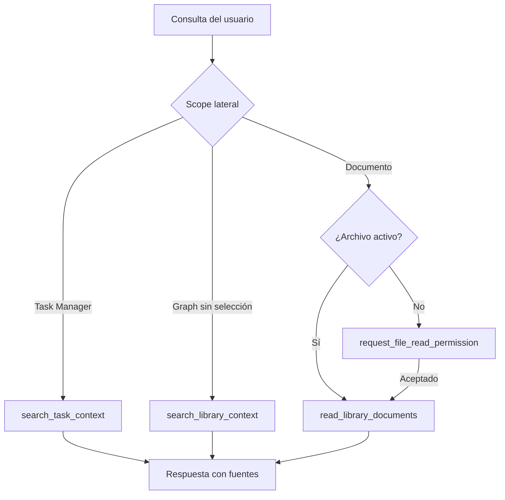

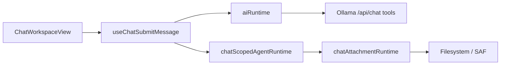

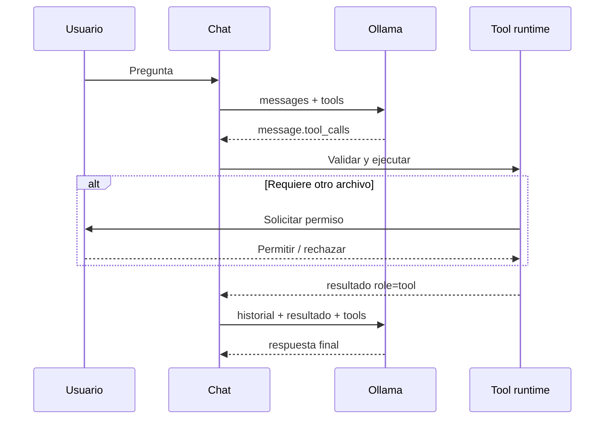

En el primer envío sin chat activo, `useChatSubmitMessage` crea el documento y establece inmediatamente su `filePath` como selección activa antes de refrescar el historial. Así, el mensaje optimista y el streaming se renderizan en la misma sesión recién creada, incluso si el callback de actualización del árbol todavía está pendiente.

Durante el streaming, `ChatThread` mantiene el razonamiento en un viewport interno de altura fija y desplaza ese viewport al último fragmento recibido. `ChatWorkspaceView` sincroniza el scroll del hilo con los deltas de pensamiento y contenido mediante un layout effect, manteniendo visible el final de la conversación.

`ChatMarkdownMessage` corta un bloque de lista cuando encuentra contenido no indentado que no pertenece a esa lista. Esto conserva separadores y encabezados posteriores —por ejemplo, una sección por ticket— mientras mantiene las viñetas indentadas como hijos del elemento correspondiente.

En el composer, `ChatComposer` limita verticalmente la lista de adjuntos y habilita desplazamiento interno cuando los chips superan el espacio disponible. El contenedor es enfocable para navegación con teclado y admite desplazamiento táctil sin expandir el formulario ni ocultar el campo de mensaje.

#### Endpoints (Commands Tauri)

| Command | Tipo | Payload | Response | Notas |
|---|---|---|---|---|
| `check_desktop_ai_health` | Async | `{ ollamaUrl, apiKey? }` | `{ ok, message, defaultModel? }` | Usa `listAiModels` para resolver el modelo por defecto. |
| `run_desktop_ai_chat` | Async | `{ ollamaUrl, apiKey?, model, think, messages[] }` | `{ answer?, error? }` | `think` admite `false`, `true` o `low/medium/high` según el modelo. Reserva para respuesta completa; el chat principal usa fetch NDJSON directo. |
| `run_desktop_ai_tool_chat` | Async | `{ ollamaUrl, apiKey?, model, think, messages[], tools[] }` | Respuesta de `/api/chat` con `message.tool_calls` | Ejecuta cada ronda del agente mediante Rust/reqwest y evita restricciones CORS del WebView. |
| `list_desktop_ai_models` | Async | `{ ollamaUrl, apiKey? }` | `{ models[] }` | Todos los modelos de `/api/tags`. |
| `run_desktop_ai_chat_streaming` | Async | `{ requestId, ollamaUrl, apiKey?, model, think, messages[] }` | eventos `notia-ai-chat-stream` | Transporte principal desktop. Rust consume NDJSON incrementalmente y emite eventos `thinking`, `delta` y `done`; evita el buffering del WebView. |
| `check_android_ai_health` | Async | `{ ollamaUrl, apiKey? }` | `{ ok, message, defaultModel? }` | Resuelve modelo por defecto con todos los modelos. |
| `run_android_ai_chat` | Async | `{ ollamaUrl, apiKey?, model, think, prompt, previousMessages[], longTermMemories[], files[], image?, selectedContextMode }` | `{ answer?, error? }` | Respuesta completa via bridge (legacy). |
| `run_android_ai_chat_streaming` | Async | `{ ollamaUrl, apiKey?, model, think, prompt, previousMessages[], longTermMemories[], files[], image?, selectedContextMode }` | eventos `notia-ai-chat-stream` | Streaming NDJSON real desde el bridge Kotlin. |
| `list_android_ai_models` | Async | `{ ollamaUrl, apiKey? }` | `{ models[] }` | Todos los modelos de `/api/tags`. |

| Evento Tauri | Dirección | Payload | Descripción |
|---|---|---|---|
| `notia-ai-chat-stream` | Backend → Frontend | `{ requestId, type: "delta" | "done" | "error", payload }` | Deltas de streaming Android; `done` incluye `answer` completo; `error` incluye `message`. |

#### Ejemplo JSON — Request `check_desktop_ai_health`

```json
{
  "payload": {
    "ollamaUrl": "http://localhost:11434",
    "apiKey": ""
  }
}
```

#### Ejemplo JSON — Response `check_desktop_ai_health`

```json
{
  "ok": true,
  "message": "Conexion correcta con Ollama.",
  "defaultModel": "llava:latest"
}
```

#### Ejemplo JSON — Request `run_desktop_ai_chat`

```json
{
  "payload": {
    "ollamaUrl": "http://localhost:11434",
    "apiKey": "",
    "model": "llava:latest",
    "messages": [
      { "role": "system", "content": "Sos el asistente de Notia." },
      { "role": "user", "content": "Resumime el concepto de wikilinks." }
    ]
  }
}
```

#### Ejemplo JSON — Response `run_desktop_ai_chat`

```json
{
  "answer": "Los wikilinks son enlaces bidireccionales entre notas...",
  "error": null
}
```

#### Ejemplo JSON — Request `run_desktop_ai_tool_chat`

```json
{
  "payload": {
    "ollamaUrl": "https://ollama.com",
    "apiKey": "ollama-api-key",
    "model": "qwen3.5:397b",
    "think": true,
    "messages": [{ "role": "user", "content": "Busca la tarea de remesas" }],
    "tools": [{
      "type": "function",
      "function": {
        "name": "search_task_files",
        "description": "Busca tareas por título o contenido.",
        "parameters": { "type": "object", "properties": { "query": { "type": "string" } }, "required": ["query"] }
      }
    }]
  }
}
```

#### Ejemplo JSON — Response `run_desktop_ai_tool_chat`

```json
{
  "message": {
    "role": "assistant",
    "content": "",
    "tool_calls": [{ "function": { "name": "search_task_files", "arguments": { "query": "remesas" } } }]
  },
  "done": true
}
```

#### Ejemplo JSON — Request `list_desktop_ai_models`

```json
{
  "payload": {
    "ollamaUrl": "http://localhost:11434",
    "apiKey": ""
  }
}
```

#### Ejemplo JSON — Response `list_desktop_ai_models`

```json
{
  "models": ["llava:latest", "gemma3:latest", "qwen3.5:latest"]
}
```

#### Validaciones
- URL vacía rechazada en `normalizeAiSettingsInput()`.
- Health check cacheado: 10s por combinación `ollamaUrl + selectedModel + apiKey`; `invalidateAiHealthCache()` lo invalida manualmente (Settings al verificar).
- Timeout de health check: 15s (`AI_REQUEST_TIMEOUT_MS`).
- Timeout de chat: 180s (`AI_CHAT_TIMEOUT_MS`).
- Límite de contexto: 30k caracteres (`MAX_CONTEXT_CHARS`).
- Límite de archivos en modo **Referencia**: 50 archivos / 6.000 caracteres.
- Máximo memorias: 50 (`MAX_MEMORY_ITEMS`) en el prompt; 200 memorias persistidas en `LongTermMemory.md`.
- Cancelación: `AbortController` en desktop (fetch directo), `abortSignal` en bridge Android.

#### Arquitectura del Chat

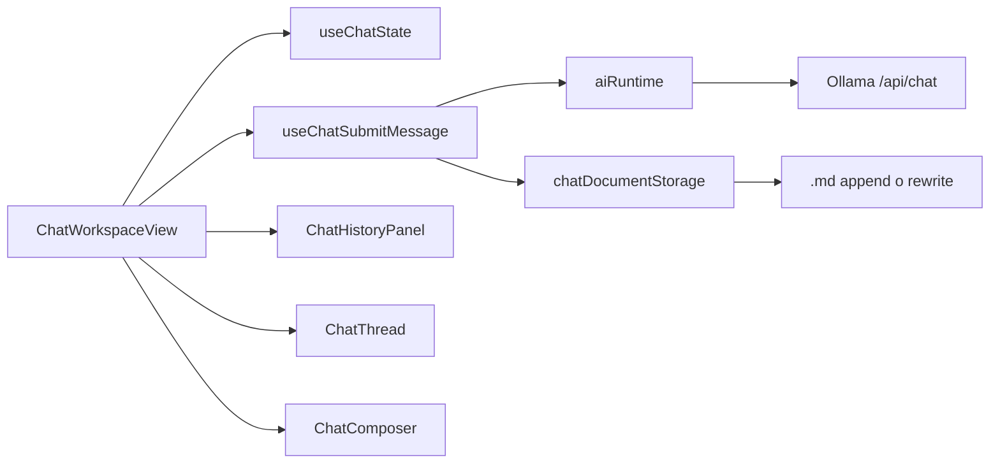

#### Pasos del proceso (Desktop)

1. **Health check**: `aiRuntime.checkAiHealth(prefs)` → intenta `invoke('check_desktop_ai_health')` → Rust `commands::ai::check_desktop_ai_health` → `services::ai_service::check_ollama_health()` → HTTP GET `/api/tags` con reqwest (timeout 15s) → retorna estado y modelo por defecto usando `listAiModels`.
   - El resultado se cachea por 10s; `invalidateAiHealthCache()` limpia la caché antes de verificar manualmente en Settings.
2. **Resolución de modelo activo**: `useChatState` llama `resolveActiveModel(prefs)` → `listAiModels(prefs)` con caché de 30s → devuelve el modelo seleccionado si está disponible, o el primer modelo disponible.
3. **Listado de modelos**: `aiRuntime.listAiModels(prefs)` devuelve todos los modelos de `/api/tags` (bridge o fetch directo). `listAiMultimodalModels` sigue existiendo para flujos que requieren visión.
4. **Chat streaming (desktop)**:
   - Construye mensajes: system (con memoria LTM) + historial + user (con contexto de archivos si aplica).
   - Hace **fetch directo** a `/api/chat` con `stream: true` y `AbortController`, parseando NDJSON línea por línea y llamando `onMessageDelta` por cada chunk.
   - Si se cancela, se aborta la petición y el contenido parcial permanece visible.
5. **Persistencia incremental**:
   - Tras cada respuesta, `ChatWorkspaceView` intenta `appendChatMessages(document, messages)`.
   - Si el título no cambió y el cuerpo del `.md` termina con un marker válido (`user` o `assistant`), se escriben solo los mensajes nuevos al final.
   - Si el título cambió o el formato no es seguro, fallback a `saveChatDocument` (re-escritura completa).
6. **Título**: tras el primer mensaje del usuario, `generateAiChatTitle()` envía un prompt especial al modelo pidiendo un título corto (máx. 6 palabras, sin comillas). Parsea y sanitiza la respuesta.
7. **Memoria LTM**: tras cada intercambio, `generateAiLongTermMemories()` envía el contexto reciente al modelo con instrucciones estrictas de devolver solo un JSON array de strings. Parsea con fallback a líneas si el JSON es inválido. Almacena en el documento de chat (`chatDocumentStorage`) y en `.notia/chat/LongTermMemory.md`.

#### Pasos del proceso (Android)

1. Los comandos `check_android_ai_health`, `run_android_ai_chat`, `list_android_ai_models` y `run_android_ai_chat_streaming` son manejados por `mobile_ai_bridge.rs` y el plugin Kotlin `AiBridgePlugin.kt`.
2. **Health y modelos**: se invoca el command Tauri correspondiente. Si el bridge no existe o está desactualizado, el frontend cae en fallback a fetch directo para health y modelos.
3. **Streaming de chat**:
   - El frontend invoca `run_android_ai_chat_streaming` con un `requestId` único.
   - Se suscribe al evento Tauri `notia-ai-chat-stream`.
   - El plugin Kotlin conecta a `/api/chat` con `stream: true`, lee NDJSON línea a línea con OkHttp y emite eventos Tauri (`delta`, `done`, `error`).
   - El frontend acumula deltas y actualiza la UI en tiempo real.
   - La cancelación se señaliza con un `abortSignal` compartido; al cancelar, el frontend también deja de escuchar eventos para ese `requestId`.

#### Comportamiento ante errores
- Ollama no responde: mensaje amigable en español ("No se pudo conectar con Ollama.").
- Modelo no disponible: error indicando que no hay modelos disponibles. En el chat se muestra un mensaje con botón **"Configurar IA"** que abre Settings → IA.
- Modelo no admite imágenes: error claro pidiendo seleccionar un modelo con visión en Settings → IA.
- Bridge no disponible: fallback silencioso a fetch directo en desktop; en Android, error pidiendo recompilar si falta el plugin.
- Stream interrumpido: `AbortController` cancela la petición; el contenido parcial permanece visible. En Android el bridge aborta el request nativo.
- Append fallido: fallback silencioso a re-escritura completa del `.md`.

#### Dependencias
- **Frontend**: `aiRuntime.ts`, `chatAttachmentRuntime.ts`, `chatDocumentStorage.ts`, `aiSettingsStorage.ts`, `useChatState.ts`, `useChatSubmitMessage.ts`, `useChatAttachmentMenu.ts`, `ChatWorkspaceView.tsx`, `ChatHistoryPanel.tsx`, `ChatThread.tsx`, `ChatComposer.tsx`, `ChatMarkdownMessage.tsx`.
- **Backend**: `commands::ai.rs`, `services::ai_service.rs`, `mobile_ai_bridge.rs`.

---

### 2.6 ColdPass

#### Descripción
Gestor de credenciales cifradas. El cifrado ocurre 100% en el frontend (Web Crypto API). El backend solo persiste bytes cifrados en el filesystem. La sincronización entre dispositivos usa Bluetooth LE con payloads cifrados (AES-256-CBC + PBKDF2 120k iteraciones).

#### Endpoints (Commands Tauri)

| Command | Tipo | Payload | Response |
|---|---|---|---|
| `coldpass_bluetooth_status` | Async | — | `ColdPassBluetoothStatusDto` |
| `coldpass_bluetooth_connect` | Async | — | `ColdPassBluetoothStatusDto` |
| `coldpass_bluetooth_submit_pin` | Async | `{ pin: string }` | `ColdPassBluetoothStatusDto` |
| `coldpass_bluetooth_authenticate` | Async | `{ packet: string }` | `ColdPassBluetoothStatusDto` |
| `coldpass_bluetooth_send_message` | Async | `{ packet: string }` | `ColdPassBluetoothStatusDto` |
| `coldpass_bluetooth_disconnect` | Async | — | `ColdPassBluetoothStatusDto` |

#### Ejemplo JSON — Request `coldpass_bluetooth_submit_pin`

```json
{
  "payload": {
    "pin": "123456"
  }
}
```

#### Ejemplo JSON — Response `coldpass_bluetooth_status`

```json
{
  "supported": true,
  "connected": false,
  "phase": "awaiting-pin",
  "applicationAuthenticated": false,
  "deviceId": null,
  "deviceName": null,
  "serviceUuid": "8f95d4ef-6b74-4b7a-84b1-75a0ad8e4b61",
  "promptMessage": "Buscá el dispositivo ColdPass para iniciar el pairing seguro.",
  "errorMessage": null
}
```

#### Ejemplo JSON — Response `coldpass_bluetooth_authenticate`

```json
{
  "supported": true,
  "connected": true,
  "phase": "connected",
  "applicationAuthenticated": true,
  "deviceId": "AA:BB:CC:DD:EE:FF",
  "deviceName": "ColdPass",
  "serviceUuid": "8f95d4ef-6b74-4b7a-84b1-75a0ad8e4b61",
  "promptMessage": "Canal seguro de aplicacion autenticado.",
  "errorMessage": null
}
```

#### Entradas
- `library: NotiaLibrary` — librería activa (para determinar dónde crear `ColdPass/ColdPass.md`).
- `passkey: string` — contraseña maestra del usuario.
- `entries: ColdPassEntry[]` — lista de credenciales con nombre, usuario, contraseña, URL, notas.
- `packet: string` — payload cifrado en base64 para transmisión Bluetooth.

#### Salidas
- `ColdPassSessionData` — `{ directoryPath, filePath, markdown, entries, passkey }`.
- `ColdPassBluetoothStatus` — `{ supported, connected, phase, applicationAuthenticated, deviceId, deviceName, serviceUuid, promptMessage, errorMessage }`.

#### Validaciones
- **Frontend**: passkey vacía rechazada antes de derivar la clave.
- **Backend (Bluetooth)**: PIN no vacío antes de enviar. Validación de fases: no se permite `authenticate` sin conexión previa; no se permite `send_message` sin autenticación de aplicación.

#### Pasos del proceso (Cifrado local)

1. **Unlock**: `unlockColdPassSession(library, passkey)` → `resolveColdPassPaths(library.path)` genera `ColdPass/ColdPass.md`.
2. **Creación lazy**: si no existe la carpeta `ColdPass/`, se crea vía `filesystemEngine.createDirectory()`. Si no existe el archivo, se crea con contenido cifrado de una plantilla vacía vía `encryptColdPassMarkdown()`.
3. **Descifrado**: `readLibraryFileContent()` lee el archivo cifrado → `decryptColdPassMarkdown(encrypted, passkey)` usa Web Crypto API:
   - Deriva clave con PBKDF2 (SHA-256, 250k iteraciones, salt aleatorio).
   - Descifra con AES-256-GCM.
   - Retorna Markdown plano.
4. **Parseo**: `parseColdPassMarkdown()` convierte el Markdown en estructura `ColdPassEntry[]`.
5. **Guardado**: `saveColdPassEntries()` → serializa entries a Markdown → `encryptColdPassMarkdown()` → `writeLibraryFileContent()` → backend recibe bytes opacos y escribe al filesystem.

#### Pasos del proceso (Sincronización Bluetooth)

1. **Estado**: `getColdPassBluetoothStatus()` → retorna fase actual (`idle`, `searching`, `awaiting-pin`, `pairing`, `connected`).
2. **Conexión**: `connectColdPassBluetooth()` → `invoke('coldpass_bluetooth_connect')`.
   - En Linux: escanea dispositivos BLE con nombre "ColdPass", inicia pairing GATT, almacena sesión en `ColdPassBluetoothState` (Mutex).
   - En Windows/macOS: stub limitado.
   - En Android/iOS: retorna `unsupported_bluetooth_status()`.
3. **PIN**: el usuario ingresa el PIN mostrado en el dispositivo ColdPass → `submitColdPassBluetoothPin(pin)` → envía el PIN al dispositivo vía GATT write.
4. **Autenticación**: `authenticateColdPassBluetooth(packet)` donde `packet` es un challenge cifrado generado en el frontend.
   - Lee valor baseline GATT, se suscribe a notificaciones, escribe el packet cifrado.
   - Espera notificación `app_auth_ok` (timeout 4s).
   - Si la respuesta es correcta, marca `applicationAuthenticated = true`.
5. **Envío de mensaje**: `sendColdPassBluetoothMessage(packet)` con la bóveda cifrada completa.
   - Verifica que `applicationAuthenticated === true`.
   - Espera confirmación `msg_ok` (timeout 4s).

#### Comportamiento ante errores
- Passkey incorrecta: `decryptColdPassMarkdown` falla con excepción de Web Crypto (mensaje genérico mostrado al usuario).
- Bluetooth no soportado: retorna `supported: false` con mensaje descriptivo.
- GATT desconectado durante operación: error "No hay una sesion GATT autenticada con ColdPass.".
- Timeout de notificación: error "ColdPass no confirmo la autenticacion del challenge.".

#### Dependencias
- **Frontend**: `coldpassStorage.ts`, `coldpassCrypto.ts`, `coldpassMarkdown.ts`, `coldpassBluetooth.ts`, `ColdPassView.tsx`, `useColdPassSession.ts`, `ColdPassBluetoothCard.tsx`.
- **Backend**: `commands::bluetooth.rs`, `services::bluetooth_service.rs`, `dto::bluetooth.rs`, `state::bluetooth_state.rs`.

---

### 2.7 Task Manager

#### Descripción
Sistema completo de gestión de tareas con tableros, dos vistas (Kanban y tabla), y temporizador Pomodoro. La persistencia no usa un archivo JSON centralizado; cada tarea vive como un archivo Markdown individual con frontmatter YAML dentro de una estructura de carpetas bajo `task-mannager/` (o `task-manager/` como fallback). Los metadatos de tableros (nombres, colores, horas de actividad) se guardan en `localStorage` vía `taskManagerStorage.ts`.

#### Endpoints
Task Manager utiliza los commands genéricos de filesystem (`read_library_tree`, `read_library_file`, `write_library_file`, `library_entry_operation`, `create_library_entry`) para leer/escribir archivos y carpetas. En Windows, la publicación LAN agrega `hash_task_manager_publication_password`, `publish_task_manager_boards`, `get_task_manager_publication_url`, `list_pending_task_manager_publication_devices`, `approve_task_manager_publication_device`, `revoke_task_manager_publication_device`, `open_task_manager_publication` y `stop_task_manager_publication`. El servidor escucha el puerto fijo configurado en `0.0.0.0` y publica una URL HTTPS con la IP privada y la ruta estable `/task-manager`; exige autenticación antes de entregar la entrada Vite que monta `TaskManagerApp`. La entrada pública pasa `canManageBoards: false`, por lo que no renderiza Nuevo tablero, Editar tablero ni Eliminar tablero; la instancia embebida de Notia mantiene esas acciones. Su barra superior abre `PublishedTaskManagerChat`, un hilo efímero que pasa exclusivamente por `runNotiaChatReply`/`runNativeToolAgent`. El host ejecuta `list_desktop_ai_models` y `run_desktop_ai_tool_chat` con su configuración de Ollama, sin entregar URL ni API key al navegador. La ronda final usa `/task-manager/ai/stream`: el servidor retransmite `thinking`, `delta`, `done` y `error` como NDJSON sobre HTTP chunked y el mismo runtime actualiza incrementalmente el razonamiento y el Markdown visible. `createChatScopedAgent` recibe `publishedScope: true`, usa el prompt/reglas integrados sin leer `.agent`, omite memorias globales y restringe el catálogo a herramientas de documentos y Task Manager; el corpus es la unión de rutas de tickets de todos los tableros publicados. Cada I/O vuelve a atravesar la autorización Rust por ruta, de modo que manipular el cliente no permite cruzar a otro tablero ni a otra zona de la biblioteca. El historial publicado se descarta al cerrar o recargar la página. `TaskBoardView` implementa una alternativa táctil al drag HTML: una pulsación de 350 ms sobre un ticket inicia un Pointer Event capturado, muestra el destino en el orden/grupo bajo el dedo y, al soltar, llama al mismo `onApplyTaskArrangement` que el arrastre de mouse; un desplazamiento de más de 10 px antes de la pulsación prolongada cancela el gesto para evitar movimientos accidentales. `useTaskManagerPublicationAutostart` vuelve a crear la publicación una vez por inicio cuando la biblioteca activa y las preferencias persistidas incluyen contraseña hash y al menos un tablero existente; la URL actual se consulta al abrir Configuraciones. La contraseña cruda solo cruza el IPC para generar un hash PBKDF2-HMAC-SHA256 con salt y 210.000 iteraciones; `taskManagerPublicationSettingsStorage.ts` persiste exclusivamente el hash versionado y los identificadores/nombres de dispositivos autorizados. Un navegador registra un identificador local antes del login: los no autorizados quedan en `pending_devices`, la UI los consulta cada dos segundos y aprueba explícitamente el host. La revocación elimina el identificador persistido, invalida sus cookies de sesión en runtime y el siguiente request vuelve a exigir autorización. Si el usuario marca **Recordar contraseña en este dispositivo**, la página de login cifra la contraseña con AES-GCM mediante una clave Web Crypto no exportable, la conserva junto al ciphertext en IndexedDB de ese origen y la rellena solo en ese navegador. El certificado TLS autofirmado y su clave privada se conservan en los datos de aplicación locales de Notia, para que los dispositivos que lo acepten no deban hacerlo otra vez después de reiniciar. Al validar el login, el servidor emite una cookie de sesión `Secure`, `HttpOnly` y `SameSite=Strict`; bootstrap, assets y comandos HTTPS rechazan solicitudes sin una sesión válida. El bridge traduce solamente los comandos de filesystem necesarios y valida cada ruta contra los tableros seleccionados; las lecturas recursivas también filtran los documentos por tablero antes de responder. Los paneles Completadas y Canceladas aplican nuevamente la lista publicada sobre el campo `tablero`, por lo que no muestran tickets archivados de tableros privados.

#### Entradas
- Librería activa (`NotiaLibrary`) con `path` y `androidTreeUri`.
- Operaciones CRUD de tableros, tareas, subtareas y comentarios (payloads definidos en `src/modules/task-manager/`).
- Sesiones Pomodoro: inicio/pausa/reset con timestamp.

#### Salidas
- Archivos `.md` individuales con YAML frontmatter (`tarea`, `estado`, `tablero`, `equipo`, `prioridad`, `parent`, `childs`, `tags`, `fechaFin`, `horasEstimadas`, etc.) persistidos en el filesystem.
- Archivo `task-mannager/PomodoroLog.md` con registro histórico de sesiones Pomodoro.
- Archivos de índice (`TaskIndex.md`, `FinishedTaskIndex.md`, `CancelledTaskIndex.md`) que listan las tareas de cada tablero.
- Estado UI en componentes locales (`useState`) y `taskManagerStorage.ts` para metadatos de tableros.
- URL LAN temporal y editable para los tableros seleccionados en `taskManagerPublicationSettingsStorage.ts`; deja de responder al cambiar la selección o cerrar Notia. Requiere que el Firewall de Windows permita Notia en redes privadas.

#### Pasos del proceso

1. **Carga inicial**: al abrir Task Manager, `vaultRuntime.ts` resuelve el directorio raíz (`task-mannager/` o `task-manager/`) y escanea vía `filesystemEngine.readMarkdownDocuments()` para obtener todos los archivos `.md` del workspace.
2. **Parseo**: cada archivo `.md` se lee con `read_library_file`. El `frontmatterEngine.ts` extrae metadatos YAML. Las relaciones padre-hijo se resuelven por los campos `parent` / `childs` (strings o arrays de wikilinks). El `taskEngine.ts` convierte los documentos en `TaskItem[]`.
3. **Vistas**: `TaskBoardView.tsx` renderiza la vista Kanban; `TaskTableView.tsx` renderiza la vista de tabla. Ambas consumen el mismo snapshot de tareas.
4. **Edición**: el usuario modifica tareas (estado, prioridad, subtareas, comentarios, fecha de fin). Cada cambio re-serializa el frontmatter YAML + Markdown del `.md` afectado y se escribe vía `vaultRuntime.writeFileContent()`.
5. **Archivado**: al completar o cancelar una tarea, `taskManagerService.moveTaskByState()` la mueve a la carpeta `finished/` o `cancelled/` respectivamente, actualizando su frontmatter.
6. **Sincronización de índices**: `syncTaskIndexesAndMetadata()` reconstruye los archivos `TaskIndex.md` de cada tablero, sincroniza tags y recalcula fechas de fin según horas de actividad del tablero.
7. **Pomodoro**: el panel Pomodoro gestiona un timer local (25 min trabajo / 5 min descanso). Al completar una sesión, `pomodoroLogEngine.ts` registra la entrada en `task-mannager/PomodoroLog.md` con timestamp y duración.

#### Dependencias
- **Frontend**: módulo `src/modules/task-manager/` (componentes, engines, hooks, services, types).
- **Services**: `vaultRuntime.ts`, `taskManagerService.ts`, `taskManagerStorage.ts`, `taskManagerVaultCache.ts`, `filesystemEngine.ts`.
- **Engines**: `frontmatterEngine.ts`, `taskEngine.ts`, `taskIndexEngine.ts`, `pomodoroLogEngine.ts`, `scheduleEngine.ts`, `completionEngine.ts`.

---

### 2.9 Mermaid Editor

#### Descripción
Editor visual integrado para diagramas Mermaid. Crea, edita y persiste archivos `.mmd` con sintaxis Mermaid estándar. El editor ofrece canvas interactivo con nodos, conectores, paleta de formas y zoom/pan.

#### Endpoints (Commands Tauri)
No hay commands exclusivos. Reutiliza filesystem genérico:
- `read_library_file`, `write_library_file`.

#### Entradas
- `source: string` — texto del diagrama Mermaid (ej. `flowchart TD`).
- Interacciones de puntero: selección de nodos, modo conexión (`isConnecting`), colocación de formas (`placingShape`).

#### Salidas
- Archivo `.mmd` con sintaxis Mermaid canónica.
- Estado local `MermaidDiagram` (nodos, aristas, `selectedNodeId`).

#### Pasos del proceso
1. **Apertura**: `MermaidView.tsx` recibe `source` y `onSourcePersist`.
2. **Parseo**: `useMermaidEditor.ts` invoca `parseMermaidSource(source)` (en `mermaidEngine.ts`) para generar un `MermaidDiagram`.
3. **Renderizado**: `MermaidCanvas.tsx` importa dinámicamente la librería `mermaid`, llama a `mermaid.render(id, source)` e inyecta el SVG resultante en el DOM. Agrega clases CSS para selección.
4. **Edición**:
   - **Nodo**: seleccionar en paleta → clic en canvas → `createNode`.
   - **Conexión**: togglear modo conexión → clic nodo origen → clic nodo destino → `createEdge`.
   - **Texto**: editar label del nodo/arista.
5. **Persistencia**: `useTextDocumentAutosave.ts` debounce (800 ms) serializa el diagrama a texto Mermaid (`serializeMermaidDiagram`) y escribe vía `write_library_file`.

#### Dependencias
- **Frontend**: `MermaidView.tsx`, `useMermaidEditor.ts`, `MermaidCanvas.tsx`, `MermaidToolbar.tsx`, `MermaidShapePalette.tsx`, `mermaidEngine.ts`.
- **Backend**: `read_library_file`, `write_library_file`.

### 2.9b Mermaid Inline Preview (MarkdownView)

#### Descripción
Renderizado de bloques de código `mermaid` embebidos dentro del editor Markdown (Milkdown Crepe). Reutiliza el **mismo pipeline** que `MermaidView` (archivos `.mmd`) para garantizar consistencia visual: mismos colores de tema, manejo de errores, zoom/pan interactivo y estilos CSS compartidos. Los diagramas embebidos son **solo lectura** (sin edición de nodos ni flechas).

Desde la versión 1.0.13, el motor incorpora optimizaciones de rendimiento:
- **Lazy render**: los diagramas fuera del viewport no se renderizan hasta que `IntersectionObserver` detecta que el contenedor es visible.
- **Cancelación**: todos los renders aceptan un `AbortSignal`; `useMermaidRender` y `useMermaidLazyRender` abortan renders pendientes al desmontar o al recibir nuevos datos.
- **Recuperación de inicialización**: si la carga del chunk `mermaid` falla, `initMermaid` reintenta hasta 2 veces y resetea el singleton `initPromise` para permitir recuperación sin reiniciar la app.
- **Caché LRU con peso**: `renderCache` limita a 20 entradas y 5 MB de SVG strings, expulsando la menos recientemente usada.
- **IDs únicos por bloque**: `renderMermaidPreview` genera IDs de host únicos por bloque para evitar colisiones cuando dos diagramas tienen el mismo contenido.
- **Cleanup de listeners**: `MermaidCanvas` limpia el SVG anterior entre renders y vacía el contenedor al desmontar; `useMermaidNodeInteraction` observa solo el `<svg>` directo.
- **Altura ajustable**: los previews inline permiten redimensionar verticalmente con un handle; la altura se persiste en `localStorage` por `storageKey`.

#### Endpoints (Commands Tauri)
Ninguno. Todo el renderizado ocurre en el frontend.

#### Entradas
- `language: 'mermaid'` — detectado por Milkdown en bloques de código.
- `content: string` — código fuente Mermaid (ej. `flowchart TD\n  A --> B`).

#### Salidas
- HTML inyectado por Milkdown: un `<div class="notia-mermaid-inline-host">` que sirve como root para un portal React.
- Portal React montado vía `ReactDOM.createRoot`: renderiza `<InlineMermaidPreview code={content} />` dentro de un `<Provider store={store}>` para acceso al tema global.

#### Pasos del proceso
1. **Detección**: en `MarkdownView.tsx`, el `renderPreview` de Milkdown detecta `language === 'mermaid'`.
2. **Generación de host**: se crea un `<div>` con `class="notia-mermaid-inline-host"` y `id` único determinado por `quickHash(content)`, un índice de bloque y un nonce aleatorio. Se pasa `outerHTML` a `applyPreview`.
3. **Montaje**: tras `requestAnimationFrame`, se busca el nodo en el DOM y se invoca `mountInlineMermaidPreview(host, content, storageKey)`. El helper usa `WeakMap<HTMLElement, ReactDOM.Root>` para evitar doble montaje.
4. **Renderizado lazy del portal**:
   - `InlineMermaidPreview.tsx` lee el tema global (`preferences.theme`) desde Redux.
   - Usa `useMermaidLazyRender({ code, theme, containerRef })`, que crea un `IntersectionObserver` sobre el contenedor.
   - Solo cuando el host es visible, delega a `renderMermaid()` en `mermaidEngine.ts` (misma función que usa `MermaidView`) con un `AbortController`.
   - Renderiza `MermaidCanvas` con `readOnly={true}`, `panZoomEnabled={true}`, `gridEnabled={false}`. El zoom/pan usa refs internas (`useMermaidPanZoom`), sin persistir en Redux.
5. **Altura ajustable**: `InlineMermaidPreview.tsx` usa `useMermaidInlineResize(storageKey)` para calcular una altura inicial natural desde el SVG y permite redimensionar el host verticalmente arrastrando el handle inferior. La altura final se persiste en `localStorage`.
6. **Desmontaje seguro**: al destruirse el editor Crepe o cambiar el documento, `MarkdownView` invoca `cleanupInlinePreviews()` que desmonta todos los roots inline y libera los hosts.
6. **Cleanup del editor**: en el `return` del efecto de inicialización de Milkdown, se desconectan observers y se desmontan todos los roots inline pendientes.
7. **Limpieza de canvas**: `MermaidCanvas` remueve el SVG anterior antes de inyectar uno nuevo y vacía el contenedor en su cleanup de unmount.

#### Dependencias
- **Frontend**: `MarkdownView.tsx`, `mermaidPreviewRuntime.tsx` (portal), `InlineMermaidPreview.tsx`, `useMermaidRender.ts`, `useMermaidLazyRender.ts`, `useMermaidInlineResize.ts`, `MermaidCanvas.tsx` (modo `readOnly`), `mermaidEngine.ts`, `mermaid.css`.
- **Backend**: ninguno.

#### Decisiones de arquitectura
- **Portal React en lugar de iframe**: evita overhead de iframe y mantiene el contexto de eventos y estilos CSS globales. El `Provider` asegura que el componente portal lea el tema de Redux sin necesidad de re-montar manualmente.
- **Lazy rendering con IntersectionObserver**: reduce drásticamente la carga inicial al abrir notas con muchos diagramas; solo los bloques visibles o cercanos al viewport inician el renderizado.
- **Cancelación con AbortController**: `renderMermaid` acepta `AbortSignal`; los hooks de render abortan la promesa activa al desmontar, evitando actualizaciones de estado en componentes desmontados.
- **Recuperación de inicialización**: `initMermaid` resetea `initPromise` y reintenta la importación hasta 2 veces ante fallos, evitando que un error puntual bloquee todos los renders futuros.
- **Caché LRU con límite de peso**: `WeightedLruCache` limita tanto la cantidad de entradas (20) como el tamaño estimado total (5 MB), expulsando la menos recientemente usada.
- **IDs únicos por bloque**: el `containerId` incluye un índice de bloque y un nonce, evitando que dos diagramas con el mismo contenido compartan host.
- **Altura ajustable con persistencia**: `useMermaidInlineResize` permite redimensionar el preview verticalmente y guarda la altura en `localStorage` por `storageKey`.
- **Limpieza de listeners y observadores**: `MermaidCanvas` limpia nodos SVG entre renders; `useMermaidNodeInteraction` observa solo el `<svg>` directo (`subtree: false`), reduciendo trabajo innecesario cuando Milkdown destruye/recreate el DOM.
- `readOnly` en `MermaidCanvas`: desactiva `useMermaidNodeInteraction` y `useMermaidEdgeInteraction` pasando `enabled = false`, oculta `MermaidEdgeToolbar` y deshabilita doble-clicks de edición de labels. El zoom/pan permanece activo.
- `WeakMap` en `mermaidPreviewRuntime`: evita doble montaje cuando Milkdown re-renderiza el preview del bloque. Como no es iterable, `MarkdownView` mantiene un `Set` de hosts para desmontar todos eficientemente al cerrar el documento.

---

### 2.10 Window Controls / App Runtime

#### Descripción
Gestión de ventana nativa (minimizar, maximizar, fullscreen, cerrar) y arrastre de ventana sin decoraciones (titlebar custom). Solo aplica a desktop; en Android/iOS son no-ops.

#### Endpoints (Commands Tauri)

| Command | Tipo | Payload | Response |
|---|---|---|---|
| `window_control` | Síncrono | `{ action: string }` | `void` |
| `start_window_dragging` | Síncrono | — | `void` |
| `start_window_dragging_with_restore` | Síncrono | — | `void` |

#### Ejemplo JSON — Request `window_control`
```json
{
  "payload": {
    "action": "maximize"
  }
}
```

#### Ejemplo JSON — Request `start_window_dragging`
```json
{}
```

#### Validaciones
- `action` debe ser uno de: `minimize`, `maximize`, `fullscreen`, `close`.

#### Pasos del proceso
1. El usuario hace clic en un botón de la titlebar (React).
2. `windowRuntime.ts` invoca el command correspondiente.
3. En desktop, Rust ejecuta la operación sobre la ventana nativa de Tauri (`window.minimize()`, `window.maximize()`, etc.).
4. En mobile, el command es no-op.

#### Dependencias
- **Frontend**: `src/services/window/windowRuntime.ts`, titlebar components.

---

### 2.11 Logging / Diagnóstico

#### Descripción
Bridge de logging del frontend JavaScript hacia el sistema de logs nativo de Rust (logcat en Android, consola en desktop). También incluye `performanceBaseline` para mediciones de rendimiento.

#### Endpoints (Commands Tauri)

| Command | Tipo | Payload | Response |
|---|---|---|---|
| `notia_log` | Síncrono | `{ level, module, message, data? }` | `void` |

#### Ejemplo JSON — Request `notia_log`
```json
{
  "payload": {
    "level": "error",
    "module": "filesystem",
    "message": "Tree scanned successfully",
    "data": "duration_ms=120"
  }
}
```

#### Pasos del proceso
1. El frontend `notiaLogger.ts` descarta toda actividad que no sea un error, excepto los eventos `info` del módulo diagnóstico `telegram-ai`.
2. Un error se informa con `console.error`; la traza `telegram-ai`, con `console.info`. Dentro de Tauri ambos llaman `invoke('notia_log', payload)`.
3. Rust `lib.rs` recibe el payload y lo emite como `[notia:js:{module}] {message} {data}` mediante el crate `log`.
4. `env_logger` y `android_logger` filtran el resto de los niveles: consola y logcat reciben errores globales e `info` exclusivamente bajo el target `notia_telegram_ai`.

#### Storage Keys relacionadas
| Key | Servicio | Descripción |
|---|---|---|
| No aplica | `notiaLogger` | Los eventos no críticos se descartan salvo la traza segura `telegram-ai`. |
| `notia.perfBaseline.enabled` | `performanceBaseline` | Conservar mediciones en memoria, sin emitir timings. |

#### Dependencias
- **Frontend**: `notiaLogger.ts`, `performanceBaseline.ts`.
- **Backend**: `lib.rs` (`notia_log` command), `log` + `android_logger`.

#### Politica de salida
La aplicacion registra solamente errores de forma global. El backend agrega una excepción de nivel `info` para el target `notia_telegram_ai`, y el frontend solo deja pasar esa misma excepción. Registra etapas, duraciones, rondas y nombres de tools, pero no imagen base64, texto del usuario, argumentos financieros ni credenciales. Las mediciones generales de performance se conservan en memoria y solo informan su propia falla como error.

Las solicitudes del agente recibidas por Telegram limitan cada ronda de herramientas a 90 segundos. Las imágenes tienen además un techo de 12 rondas para cortar bucles del agente. Si Ollama no responde en ese plazo, el bridge envia el error al chat de Telegram y registra la fase exacta con nivel `error`; el resto de las superficies conserva el limite nativo de 600 segundos.

---

### 2.12 Apéndice de Commands Tauri — Ejemplos JSON Completos

> Esta sección complementa las descripciones de flujo con los JSON de request/response que faltaban para commands documentados en el mapa pero sin ejemplos previos.

#### `create_library_file`
**Request:**
```json
{
  "payload": {
    "filePath": "/home/usuario/Notas/Proyectos/Diario.md",
    "content": "# Diario\n\nEntrada de hoy.",
    "directoryUri": null
  }
}
```
**Response:**
```json
{
  "ok": true,
  "error": null
}
```

#### `create_library_directory`
**Request:**
```json
{
  "payload": {
    "directoryPath": "/home/usuario/Notas/Proyectos/NuevaCarpeta",
    "directoryUri": null
  }
}
```
**Response:**
```json
{
  "ok": true,
  "error": null
}
```

#### `path_exists`
**Request:**
```json
{
  "payload": {
    "path": "/home/usuario/Notas/Proyectos/Diario.md",
    "directoryUri": null
  }
}
```
**Response:**
```json
{
  "exists": true
}
```

#### `is_directory_path`
**Request:**
```json
{
  "payload": {
    "path": "/home/usuario/Notas/Proyectos",
    "directoryUri": null
  }
}
```
**Response:**
```json
{
  "isDirectory": true
}
```

#### `search_library_files`
**Request:**
```json
{
  "payload": {
    "directoryPath": "/home/usuario/Notas",
    "query": "diario"
  }
}
```
**Response:**
```json
{
  "paths": [
    "/home/usuario/Notas/Proyectos/Diario.md",
    "/home/usuario/Notas/Personal/MiDiario.md"
  ]
}
```

#### `write_binary_file`
**Request:**
```json
{
  "payload": {
    "filePath": "/home/usuario/Notas/Imagenes/logo.png",
    "data": [137, 80, 78, 71, 13, 10, 26, 10]
  }
}
```
**Response:**
```json
{
  "ok": true,
  "error": null
}
```

#### `check_android_ai_health`
**Request:**
```json
{
  "payload": {
    "ollamaUrl": "http://192.168.1.50:11434",
    "apiKey": ""
  }
}
```
**Response:**
```json
{
  "ok": true,
  "message": "Conexion correcta con Ollama.",
  "defaultModel": "llava:latest"
}
```

#### `run_android_ai_chat`
**Request:**
```json
{
  "payload": {
    "ollamaUrl": "http://192.168.1.50:11434",
    "apiKey": "",
    "model": "llava:latest",
    "prompt": "Resumime este texto.",
    "previousMessages": [
      { "role": "user", "content": "Hola" }
    ],
    "longTermMemories": [],
    "files": [],
    "image": null,
    "selectedContextMode": "none"
  }
}
```
**Response:**
```json
{
  "answer": "Este es un resumen generado por el modelo...",
  "error": null
}
```

#### `list_android_ai_models`
**Request:**
```json
{
  "payload": {
    "ollamaUrl": "http://192.168.1.50:11434",
    "apiKey": ""
  }
}
```
**Response:**
```json
{
  "models": ["llava:latest", "gemma3:latest"]
}
```

#### `pick_android_directory_tree`
**Request:**
```json
{}
```
**Response:**
```json
{
  "path": "/tree/primary:Notas",
  "uri": "content://com.android.externalstorage.documents/tree/primary%3ANotas"
}
```

#### `read_android_library_tree`
**Request:**
```json
{
  "payload": {
    "directoryPath": "/tree/primary:Notas",
    "directoryUri": "content://com.android.externalstorage.documents/tree/primary%3ANotas"
  }
}
```
**Response:**
```json
[
  {
    "id": "file-1",
    "name": "Ideas.md",
    "path": "/tree/primary:Notas/Ideas.md",
    "type": "file",
    "expanded": false,
    "hasChildren": false,
    "children": []
  }
]
```

#### `read_android_flat_file_list`
**Request:**
```json
{
  "payload": {
    "directoryPath": "/tree/primary:Notas",
    "directoryUri": "content://com.android.externalstorage.documents/tree/primary%3ANotas"
  }
}
```
**Response:**
```json
[
  { "path": "Ideas.md", "type": "file", "name": "Ideas.md" },
  { "path": "Proyectos", "type": "folder", "name": "Proyectos" }
]
```

#### `read_android_directory`
**Request:**
```json
{
  "payload": {
    "directoryPath": "/tree/primary:Notas/Proyectos",
    "directoryUri": "content://com.android.externalstorage.documents/tree/primary%3ANotas"
  }
}
```
**Response:**
```json
[
  {
    "id": "file-2",
    "name": "README.md",
    "path": "/tree/primary:Notas/Proyectos/README.md",
    "type": "file"
  }
]
```

#### `coldpass_bluetooth_connect`
**Request:**
```json
{}
```
**Response:**
```json
{
  "supported": true,
  "connected": false,
  "phase": "searching",
  "applicationAuthenticated": false,
  "deviceId": null,
  "deviceName": null,
  "serviceUuid": "8f95d4ef-6b74-4b7a-84b1-75a0ad8e4b61",
  "promptMessage": "Buscando dispositivo ColdPass...",
  "errorMessage": null
}
```

#### `coldpass_bluetooth_send_message`
**Request:**
```json
{
  "payload": {
    "packet": "AES256CBC_BASE64_ENCRYPTED_PAYLOAD..."
  }
}
```
**Response:**
```json
{
  "supported": true,
  "connected": true,
  "phase": "connected",
  "applicationAuthenticated": true,
  "deviceId": "AA:BB:CC:DD:EE:FF",
  "deviceName": "ColdPass",
  "serviceUuid": "8f95d4ef-6b74-4b7a-84b1-75a0ad8e4b61",
  "promptMessage": "Mensaje enviado correctamente.",
  "errorMessage": null
}
```

#### `coldpass_bluetooth_disconnect`
**Request:**
```json
{}
```
**Response:**
```json
{
  "supported": true,
  "connected": false,
  "phase": "idle",
  "applicationAuthenticated": false,
  "deviceId": null,
  "deviceName": null,
  "serviceUuid": null,
  "promptMessage": "Desconectado.",
  "errorMessage": null
}
```

---

- Los grupos del Task Manager también forman parte del contrato del agente: `get_task_manager_options` lee exclusivamente `settings.groups` del tablero activo, la misma fuente que renderiza la UI, y no convierte valores históricos del campo `equipo` en grupos visibles. `create_task_group` exige nombre y color hexadecimal explícitos, y `delete_task_group` consulta el snapshot completo antes de escribir. La eliminación se rechaza si existe cualquier ticket asignado al grupo, incluso finalizado o cancelado, y nunca reasigna, mueve ni cancela tickets. Ambas mutaciones requieren confirmación individual en la tarjeta inline.

- Las solicitudes compuestas de Task Manager usan `set_task_execution_plan` antes de mutar. La tarjeta exige una aprobación explícita o permite **Sugerir cambios** mediante el compositor; la sugerencia vuelve al modelo como resultado de herramienta y obliga a presentar una nueva versión. El runtime asigna IDs estables a los pasos, bloquea toda escritura mientras el plan no esté aprobado, exige `planStepId` mientras exista un plan activo, impide ejecutarlos fuera de orden y publica `pending | in-progress | completed | blocked` hacia la tarjeta inline. Solo una mutación confirmada y aplicada marca su paso como completado; un rechazo o una excepción lo bloquea.

## 3. Diagramas Mermaid

> Según `AGENTS.md`, los diagramas se organizan **por unidad** (controller/vista). Cada unidad tiene su propio **diagrama de flujo**, su propio **diagrama de arquitectura de componentes** y su propio **diagrama de secuencia**. Además se incluyen diagramas generales del sistema.

### 3.1 Diagramas Generales del Sistema

#### 3.1.1 Arquitectura del Sistema (Diagrama de Componentes / Despliegue)

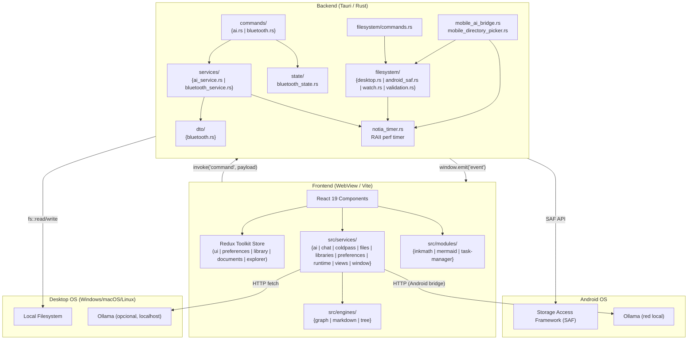

#### 3.1.2 Flujo de Datos General

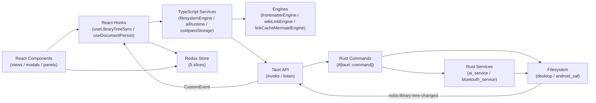

#### 3.1.3 Modelo de Datos (Diagrama de Clases Simplificado)

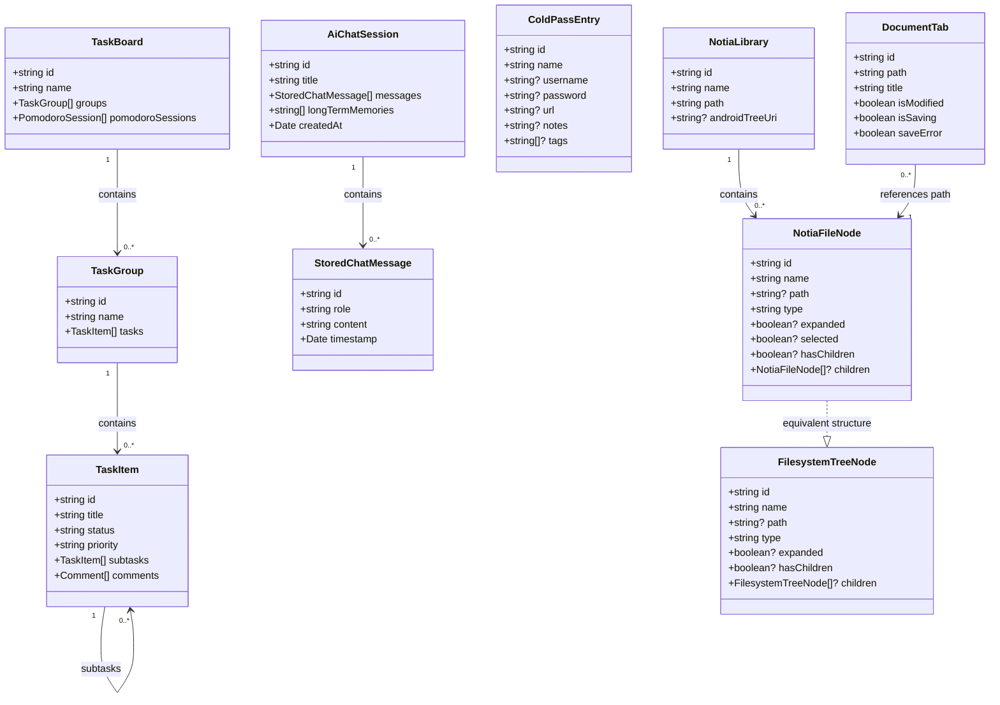

#### 3.1.4 Secuencia General del Sistema (invoke / listen / evento)

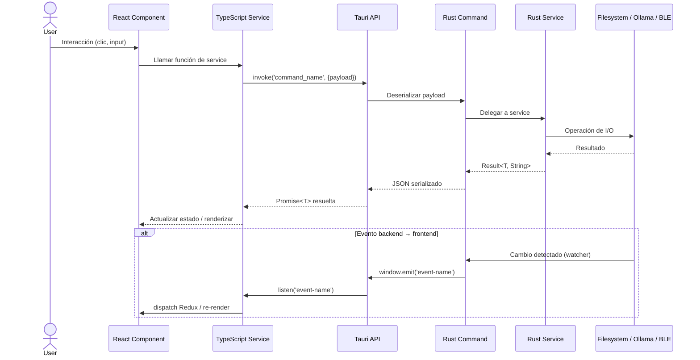

---

#### 3.2.1 Filesystem Controller

**Diagrama de flujo específico:**

```mermaid
flowchart TD
    Start([Frontend solicita operación filesystem]) --> Validate{Validar payload}
    Validate -->|Inválido| ErrorResponse[Retornar OperationResult {ok:false}]
    Validate -->|Válido| Platform{¿Plataforma?}
    Platform -->|Android| SAF["android_saf::\u003coperation>"]
    Platform -->|Desktop| Desktop["desktop::\u003coperation>"]
    SAF --> FSOp["fs::write / create_dir / remove_file"]
    Desktop --> FSOp
    FSOp --> Result{¿Éxito?}
    Result -->|Sí| OkResponse[Retornar OperationResult {ok:true}]
    Result -->|No| ErrResponse[Retornar OperationResult {ok:false, error}]
    OkResponse --> End([Fin])
    ErrResponse --> End
    ErrorResponse --> End
```

**Diagrama de arquitectura de componentes:**

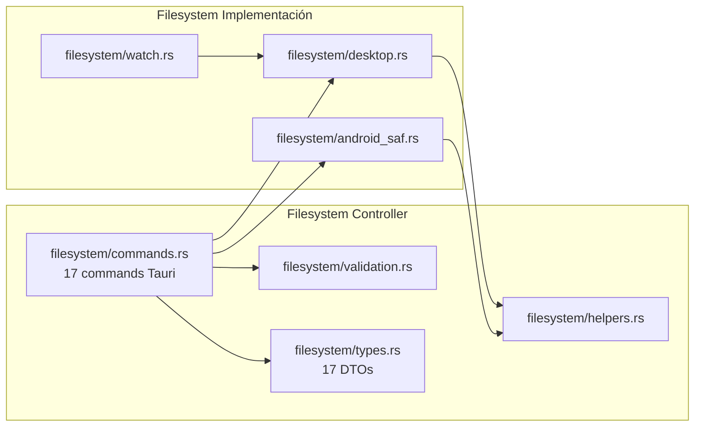

**Diagrama de secuencia específico:**

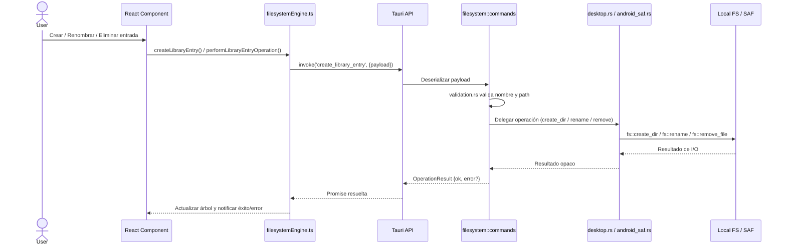

#### 3.2.2 AI Controller

**Diagrama de flujo específico:**

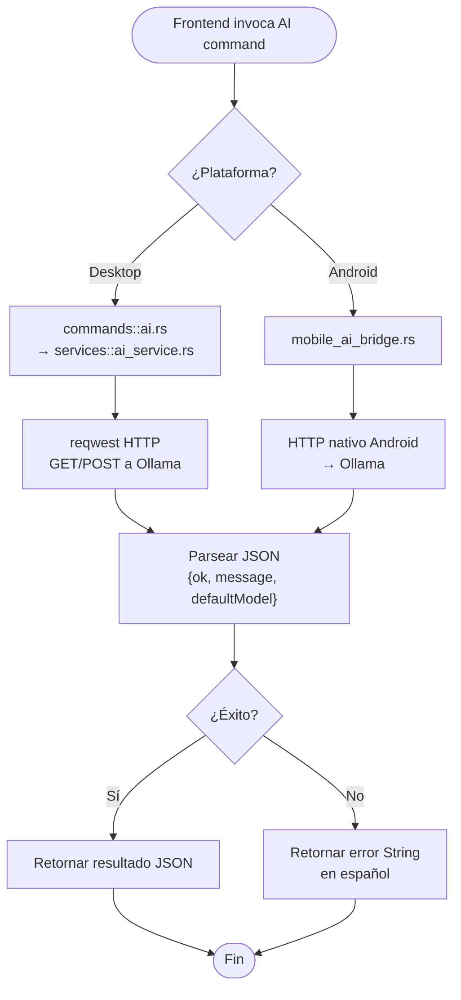

**Diagrama de arquitectura de componentes:**

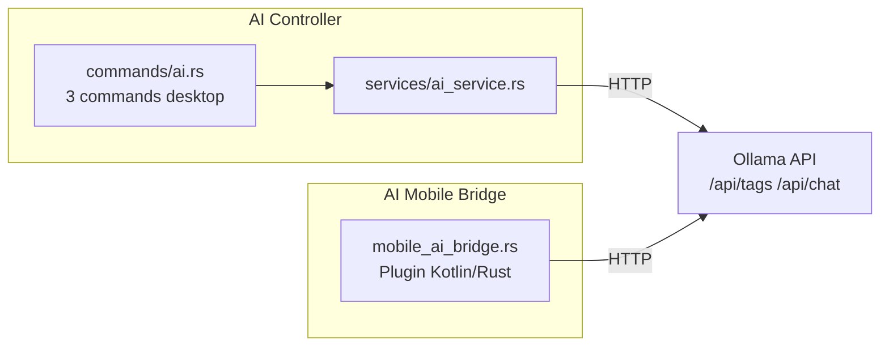

**Diagrama de secuencia específico:**

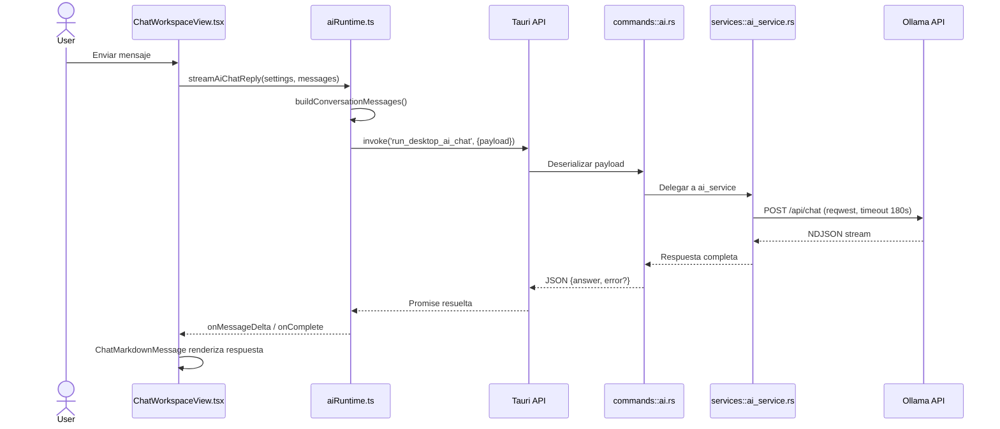

#### 3.2.3 Bluetooth / ColdPass Controller

**Diagrama de flujo específico:**

```mermaid
flowchart TD
    Start([Frontend invoca Bluetooth command]) --> Platform{¿Plataforma?}
    Platform -->|Linux| Linux["commands/bluetooth.rs<br/>GATT completo"]
    Platform -->|Windows/macOS| Stub["Stub limitado"]
    Platform -->|Android/iOS| Unsupported["unsupported_bluetooth_status()"]
    Linux --> Lock["Lock Mutex<br/>ColdPassBluetoothState"]
    Lock --> BTService["services/bluetooth_service.rs<br/>btleplug GATT"]
    BTService --> Device["Dispositivo BLE ColdPass"]
    Device --> Response["Respuesta GATT<br/>app_auth_ok / msg_ok"]
    Response --> Unlock["Unlock Mutex<br/>actualizar estado"]
    Unlock --> Result["Retornar ColdPassBluetoothStatusDto"]
    Stub --> Result
    Unsupported --> Result
    Result --> End([Fin])
```

**Diagrama de arquitectura de componentes:**

```mermaid
graph LR
    subgraph BTController["Bluetooth Controller"]
        BTCmd["commands/bluetooth.rs<br/>6 commands Tauri"]
        BTService["services/bluetooth_service.rs"]
        BTState["state/bluetooth_state.rs<br/>Mutex-based"]
        BTDto["dto/bluetooth.rs"]
    end

    BTCmd --> BTService
    BTCmd --> BTState
    BTService --> BTDto
    BTService -->|GATT| BLE["Dispositivo BLE<br/>ColdPass"]
```

**Diagrama de secuencia específico:**

```mermaid
sequenceDiagram
    actor User
    participant CPView as ColdPassView.tsx
    participant CPBT as coldpassBluetooth.ts
    participant Tauri as Tauri API
    participant RustCmd as commands::bluetooth.rs
    participant RustSvc as services::bluetooth_service.rs
    participant BTState as state::bluetooth_state.rs
    participant BLE as Dispositivo BLE ColdPass

    User->>CPView: Clic "Conectar Bluetooth"
    CPView->>CPBT: connectColdPassBluetooth()
    CPBT->>Tauri: invoke('coldpass_bluetooth_connect')
    Tauri->>RustCmd: Deserializar
    RustCmd->>RustSvc: Delegar conexión
    RustSvc->>BLE: btleplug: scan + connect GATT
    BLE-->>RustSvc: Conexión establecida
    RustSvc->>BTState: Lock Mutex, actualizar estado
    BTState-->>RustSvc: Estado actualizado
    RustSvc-->>RustCmd: ColdPassBluetoothStatusDto
    RustCmd-->>Tauri: JSON serializado
    Tauri-->>CPBT: Promise resuelta
    CPBT-->>CPView: Actualizar fase a "awaiting-pin"

    User->>CPView: Ingresar PIN y autenticar
    CPView->>CPBT: submitColdPassBluetoothPin(pin)
    CPBT->>Tauri: invoke('coldpass_bluetooth_submit_pin')
    Tauri->>RustCmd: Deserializar
    RustCmd->>RustSvc: Enviar PIN vía GATT write
    RustSvc->>BLE: GATT write PIN
    BLE-->>RustSvc: Notificación app_auth_ok
    RustSvc->>BTState: Actualizar applicationAuthenticated
    RustSvc-->>RustCmd: ColdPassBluetoothStatusDto
    RustCmd-->>Tauri: JSON
    Tauri-->>CPBT: Promise
    CPBT-->>CPView: Fase "connected"
```

---

#### 3.2.4 Window / App Runtime Controller

**Diagrama de flujo específico:**

```mermaid
flowchart TD
    Start([Frontend invoca window command]) --> Platform{¿Plataforma?}
    Platform -->|Desktop| Desktop["lib.rs window_control\nstart_window_dragging\nstart_window_dragging_with_restore"]
    Platform -->|Mobile| NoOp["No-op stub"]
    Desktop --> Action{¿Comando?}
    Action -->|window_control| WC["Match action:\nminimize / maximize / fullscreen / close"]
    Action -->|start_window_dragging| Drag["window.start_dragging()"]
    Action -->|start_window_dragging_with_restore| DragRestore["restore_window_state()\nstart_dragging()"]
    WC --> Result["Operación nativa sobre la ventana Tauri"]
    Drag --> Result
    DragRestore --> Result
    NoOp --> Result
    Result --> End([Fin])
```

**Diagrama de arquitectura de componentes:**

```mermaid
graph LR
    subgraph WindowController["Window / Runtime Controller"]
        LibCmd["lib.rs\n(window_control, start_window_dragging, start_window_dragging_with_restore, notia_log)"]
        WinSvc["windowRuntime.ts"]
        LogSvc["notiaLogger.ts"]
    end

    subgraph DesktopOS["Desktop OS"]
        NativeWin["Native Window API\n(Tauri winit)"]
    end

    subgraph MobileOS["Android / iOS"]
        NoOpStub["No-op stubs"]
    end

    WinSvc -->|invoke| LibCmd
    LogSvc -->|invoke| LibCmd
    LibCmd -->|desktop| NativeWin
    LibCmd -->|mobile| NoOpStub
```

**Diagrama de secuencia específico:**

```mermaid
sequenceDiagram
    actor User
    participant TitleBar as TitleBar Component
    participant WinRuntime as windowRuntime.ts
    participant Tauri as Tauri API
    participant RustCmd as lib.rs (window_control)
    participant NativeWin as Tauri Native Window

    User->>TitleBar: Clic en botón Maximizar
    TitleBar->>WinRuntime: controlWindow('maximize')
    WinRuntime->>Tauri: invoke('window_control', {action:'maximize'})
    Tauri->>RustCmd: Deserializar payload
    RustCmd->>NativeWin: window.maximize()
    NativeWin-->>RustCmd: Ok
    RustCmd-->>Tauri: void
    Tauri-->>WinRuntime: Promise resuelta

    alt Arrastrar ventana
        User->>TitleBar: MouseDown en titlebar
        TitleBar->>WinRuntime: startWindowDraggingWithRestore()
        WinRuntime->>Tauri: invoke('start_window_dragging_with_restore')
        Tauri->>RustCmd: Deserializar
        RustCmd->>NativeWin: restore_window_state() si maximized
        RustCmd->>NativeWin: window.start_dragging()
        NativeWin-->>RustCmd: Ok
        RustCmd-->>Tauri: void
    end
```

---

### 3.3 Diagramas por Unidad — Frontend

#### 3.3.1 Explorador de Archivos / Librerías

**Diagrama de flujo específico:**

```mermaid
flowchart TD
    Start([Usuario abre Notia]) --> LoadLibs["libraryStorage.ts<br/>loadLibraries()"]
    LoadLibs --> ActiveLib{"¿Hay librería activa?"}
    ActiveLib -->|No| EmptyState["Mostrar estado vacío<br/>'Administrar librerías'"]
    ActiveLib -->|Sí| ReadTree["filesystemEngine.readLibraryTree()"]
    ReadTree --> RenderTree["FileTree.tsx<br/>render árbol virtualizado"]
    RenderTree --> UserAction{"¿Acción del usuario?"}
    UserAction -->|Crear| CreateEntry["filesystemEngine.createLibraryEntry()"]
    UserAction -->|Eliminar/Renombrar/Mover| Operation["filesystemEngine.performLibraryEntryOperation()"]
    UserAction -->|Buscar| Search["filesystemEngine.searchLibraryFiles()"]
    UserAction -->|Clic archivo| OpenDoc["useDocumentOpener<br/>dispatch openDocument"]
    CreateEntry --> Refresh["Re-leer árbol"]
    Operation --> Refresh
    Refresh --> RenderTree
    OpenDoc --> End([Fin])
```

**Diagrama de arquitectura de componentes:**

```mermaid
graph LR
    subgraph ExplorerView["Vista: Explorador"]
        FileTree["FileTree.tsx"]
        FileTreeContext["FileTreeContextMenu.tsx"]
        VirtualList["useVirtualList.ts"]
    end

    subgraph ExplorerHooks["Hooks Explorador"]
        TreeSync["useLibraryTreeSync.ts"]
        FileActions["useFileTreeActions.ts"]
    end

    subgraph ExplorerServices["Servicios Explorador"]
        FSEngine["filesystemEngine.ts"]
        LibStorage["libraryStorage.ts"]
        WatchRuntime["libraryTreeWatchRuntime.ts"]
    end

    FileTree --> VirtualList
    FileTree --> FileTreeContext
    TreeSync --> FSEngine
    TreeSync --> WatchRuntime
    FileActions --> FSEngine
    LibStorage --> FileTree
```

**Diagrama de secuencia específico:**

```mermaid
sequenceDiagram
    actor User
    participant FileTree as FileTree.tsx
    participant TreeSync as useLibraryTreeSync.ts
    participant FSEngine as filesystemEngine.ts
    participant ReduxLib as librarySlice
    participant ReduxDoc as documentsSlice
    participant Tauri as Tauri API
    participant RustCmd as filesystem::commands
    participant RustFS as desktop.rs / android_saf.rs

    User->>FileTree: Clic en carpeta / expandir
    FileTree->>TreeSync: library changed / refresh
    TreeSync->>FSEngine: readLibraryTree(path)
    FSEngine->>Tauri: invoke('read_library_tree', {payload})
    Tauri->>RustCmd: Deserializar
    RustCmd->>RustFS: read_library_tree(path)
    RustFS->>RustFS: Escaneo recursivo
    RustFS-->>RustCmd: Vec<FileNode>
    RustCmd-->>Tauri: JSON serializado
    Tauri-->>FSEngine: Promise<FileNode[]>
    FSEngine->>ReduxDoc: dispatch setTreeNodes(nodes)
    ReduxDoc-->>FileTree: Re-render con nuevo árbol
    FileTree->>FileTree: useVirtualList renderiza nodos visibles

    alt Desktop Watcher
        RustFS->>RustCmd: notify detecta cambio externo
        RustCmd->>Tauri: window.emit('notia-library-tree-changed')
        Tauri->>TreeSync: listen('notia-library-tree-changed')
        TreeSync->>ReduxDoc: dispatch notificación
        ReduxDoc-->>FileTree: Re-render
    end
```

#### 3.3.2 Markdown Editor

**Diagrama de flujo específico:**

```mermaid
flowchart TD
    Start([Usuario hace clic en .md]) --> OpenTab["documentsSlice<br/>openDocument({path, title})"]
    OpenTab --> ReadFile["filesystemEngine.readTextFile(path)"]
    ReadFile --> SetContent["MarkdownView.tsx<br/>Milkdown Crepe setMarkdown"]
    SetContent --> RenderProps["frontmatterEngine.ts<br/>parse frontmatter<br/>MarkdownPropertiesPanel"]
    RenderProps --> UserEdit["Usuario edita texto"]
    UserEdit --> WikiLink["wikiLinkPlugin.ts<br/>detecta [[...]]"]
    WikiLink --> Suggestions["WikiLinkSuggestionMenu.tsx"]
    UserEdit --> Debounce["useTextDocumentAutosave<br/>debounce ~1s"]
    Debounce --> WriteFile["filesystemEngine.writeTextFile(path, content)"]
    WriteFile --> UpdateState["documentsSlice<br/>update save state ✓"]
    UpdateState --> End([Fin])
```

**Diagrama de arquitectura de componentes:**

```mermaid
graph LR
    subgraph MarkdownView["Vista: Markdown"]
        View["MarkdownView.tsx"]
        Milkdown["Milkdown Crepe Editor"]
        WikiMenu["WikiLinkSuggestionMenu.tsx"]
        PropsPanel["MarkdownPropertiesPanel.tsx"]
    end

    subgraph MarkdownHooks["Hooks Markdown"]
        DocPersist["useDocumentPersist.ts"]
        AutoSave["useTextDocumentAutosave.ts"]
        DocOpener["useDocumentOpener.ts"]
    end

    subgraph MarkdownEngines["Engines Markdown"]
        Frontmatter["frontmatterEngine.ts"]
        WikiLink["wikiLinkPlugin.ts"]
    end

    View --> Milkdown
    Milkdown --> WikiLink
    WikiLink --> WikiMenu
    DocPersist --> Frontmatter
    Frontmatter --> PropsPanel
    AutoSave --> DocPersist
    DocOpener --> View
```

**Diagrama de secuencia específico:**

```mermaid
sequenceDiagram
    actor User
    participant View as MarkdownView.tsx
    participant Milkdown as Milkdown Crepe
    participant AutoSave as useTextDocumentAutosave.ts
    participant FSEngine as filesystemEngine.ts
    participant ReduxDoc as documentsSlice
    participant Tauri as Tauri API
    participant RustCmd as filesystem::commands
    participant RustFS as desktop.rs / android_saf.rs

    User->>View: Clic en archivo .md
    View->>FSEngine: readTextFile(path)
    FSEngine->>Tauri: invoke('read_library_file', {payload})
    Tauri->>RustCmd: Deserializar
    RustCmd->>RustFS: read_library_file
    RustFS->>RustFS: fs::read_to_string
    RustFS-->>RustCmd: content
    RustCmd-->>Tauri: {ok, content}
    Tauri-->>FSEngine: Promise
    FSEngine-->>View: setMarkdown(content)
    View->>Milkdown: Inyectar contenido

    User->>Milkdown: Editar texto
    Milkdown-->>View: onChange(newContent)
    View->>AutoSave: trigger autosave
    AutoSave->>AutoSave: debounce ~1s
    AutoSave->>FSEngine: writeTextFile(path, newContent)
    FSEngine->>ReduxDoc: dispatch isSaving = true
    FSEngine->>Tauri: invoke('write_library_file', {payload})
    Tauri->>RustCmd: Deserializar
    RustCmd->>RustFS: write_library_file
    RustFS->>RustFS: fs::write
    RustFS-->>RustCmd: ok
    RustCmd-->>Tauri: {ok}
    Tauri-->>FSEngine: Promise
    FSEngine->>ReduxDoc: dispatch isSaving = false / saved
    ReduxDoc-->>View: Actualizar indicador ✓
```

#### 3.3.3 Graph View

**Diagrama de flujo específico:**

```mermaid
flowchart TD
    Start([Usuario abre Graph View]) --> ReadMD["getIndexedLibraryGraphSourcesByPath()<br/>lee .md de la librería"]
    ReadMD --> BuildModel["useLibraryGraphData.ts<br/>buildLibraryGraphModel()<br/>nodos + wikilinks → aristas"]
    BuildModel --> GenerateMermaid["linkCacheMermaidEngine.ts<br/>genera flowchart TD por carpeta"]
    GenerateMermaid --> Render["MermaidCanvas.tsx<br/>mermaid.render() → SVG"]
    Render --> PostInject["onSvgInjected:<br/>data-notia-path + highlight"]
    PostInject --> UserClick{"¿Clic en nodo?"}
    UserClick -->|Sí| OpenDoc["dispatch openDocument<br/>abrir nota en pestaña"]
    UserClick -->|No| End([Fin])
    OpenDoc --> End
    BuildModel -.->|background| WriteCache["libraryLinkCacheRuntime.ts<br/>escribe .notia/linkCache.md"]
```

**Diagrama de arquitectura de componentes:**

```mermaid
graph LR
    subgraph GraphView["Vista: Graph"]
        GraphViewComp["GraphView.tsx"]
        Canvas["MermaidCanvas.tsx<br/>readOnly"]
    end

    subgraph GraphHooks["Hooks Graph"]
        GraphData["useLibraryGraphData.ts"]
    end

    subgraph GraphEngines["Engines Graph"]
        LibGraph["libraryGraphEngine.ts"]
        WikiLink["wikiLinkEngine.ts"]
        LinkMermaid["linkCacheMermaidEngine.ts"]
    end

    subgraph MermaidModule["Módulo Mermaid"]
        MermaidEngine["mermaidEngine.ts"]
        MermaidRender["useMermaidRender.ts"]
    end

    subgraph GraphCache["Link Cache"]
        CacheRuntime["libraryLinkCacheRuntime.ts"]
        CacheSchedule["libraryLinkCacheSchedule.ts"]
        CacheHook["useLibraryLinkCacheAutoRebuild.ts"]
    end

    GraphViewComp --> Canvas
    GraphViewComp --> LinkMermaid
    GraphData --> LibGraph
    LibGraph --> WikiLink
    GraphViewComp --> MermaidRender
    MermaidRender --> MermaidEngine
    GraphData -.-> CacheSchedule
    CacheSchedule --> CacheRuntime
    CacheHook --> CacheSchedule
```

**Diagrama de secuencia específico:**

```mermaid
sequenceDiagram
    actor User
    participant Graph as GraphView.tsx
    participant GraphData as useLibraryGraphData.ts
    participant Index as librarySearchGraphIndex.ts
    participant FSEngine as filesystemEngine.ts
    participant Tauri as Tauri API
    participant RustCmd as filesystem::commands
    participant LibGraph as libraryGraphEngine.ts
    participant LinkEngine as linkCacheMermaidEngine.ts
    participant Canvas as MermaidCanvas.tsx
    participant Cache as libraryLinkCacheSchedule.ts

    User->>Graph: Abrir Graph View
    Graph->>GraphData: Solicitar datos
    GraphData->>Index: getIndexedLibraryGraphSourcesByPath
    Index->>FSEngine: readMarkdownDocuments(path)
    FSEngine->>Tauri: invoke('read_markdown_files')
    Tauri->>RustCmd: Deserializar
    RustCmd->>RustCmd: Escaneo .md
    RustCmd-->>Tauri: Vec<MarkdownFileDocument>
    Tauri-->>FSEngine: Promise
    FSEngine-->>Index: documents[]
    Index-->>GraphData: graphSourcesByPath

    GraphData->>LibGraph: buildLibraryGraphModel(tree, sources)
    LibGraph->>LibGraph: wikiLinkEngine.ts parsea wikilinks
    LibGraph-->>GraphData: {nodes, edges}

    GraphData->>Cache: scheduleLibraryLinkCacheRebuild(params)
    Cache-->>Cache: debounce 1.5s
    Cache->>Cache: rebuildLibraryLinkCache()
    Cache->>FSEngine: writeTextFile(.notia/linkCache.md)

    Graph->>LinkEngine: buildLinkCacheMermaidCode(model, rootPath)
    LinkEngine-->>Graph: mermaid source

    Graph->>Canvas: render(code, theme)
    Canvas->>Canvas: mermaid.render(id, source)
    Canvas-->>Canvas: inject SVG + onSvgInjected

    Graph->>Graph: apply search/selection highlights

    User->>Graph: Clic en nodo
    Graph->>Graph: dispatch openDocument(path)
```

#### 3.3.4 AI Chat

**Diagrama de flujo específico:**

```mermaid
flowchart TD
    Start([Usuario envía mensaje]) --> SaveUser["chatDocumentStorage<br/>guardar mensaje usuario"]
    SaveUser --> BuildCtx["aiRuntime.ts<br/>buildConversationMessages()<br/>system + history + user + files"]
    BuildCtx --> Bridge{"¿Bridge desktop<br/>disponible?"}
    Bridge -->|Sí| Invoke["invoke('run_desktop_ai_chat')"]
    Bridge -->|No| Fetch["fetch POST /api/chat<br/>stream:true NDJSON"]
    Invoke --> RustCmd["commands::ai.rs<br/>→ ai_service.rs"]
    RustCmd --> HTTP["reqwest HTTP Ollama"]
    HTTP --> Answer["Respuesta completa"]
    Fetch --> Stream["Parse NDJSON<br/>línea por línea"]
    Stream --> Delta["onMessageDelta(delta)"]
    Delta --> Render["ChatMarkdownMessage.tsx"]
    Answer --> Render
    Render --> SaveAsst["chatDocumentStorage<br/>guardar respuesta"]
    SaveAsst --> GenTitle["generateAiChatTitle()"]
    GenTitle --> GenMem["generateAiLongTermMemories()"]
    GenMem --> PersistMem["Persistir memorias<br/>en chat document"]
    PersistMem --> End([Fin])
```

**Diagrama de arquitectura de componentes:**

```mermaid
graph LR
    subgraph ChatView["Vista: AI Chat"]
        ChatWorkspace["ChatWorkspaceView.tsx"]
        ChatMsg["ChatMarkdownMessage.tsx"]
        ChatFilesModal["ChatLibraryFilesModal.tsx"]
    end

    subgraph ChatServices["Servicios Chat"]
        AIRuntime["aiRuntime.ts"]
        ChatAttach["chatAttachmentRuntime.ts"]
        ChatDocStore["chatDocumentStorage.ts"]
        AISettings["aiSettingsStorage.ts"]
    end

    subgraph ChatBackend["Backend Chat"]
        AICmd["commands/ai.rs"]
        AIService["services/ai_service.rs"]
        MobileAI["mobile_ai_bridge.rs"]
    end

    ChatWorkspace --> ChatMsg
    ChatWorkspace --> ChatFilesModal
    ChatWorkspace --> AIRuntime
    AIRuntime --> ChatAttach
    AIRuntime --> ChatDocStore
    AIRuntime --> AISettings
    AIRuntime -->|invoke| AICmd
    AIRuntime -->|fetch| Ollama["Ollama API"]
    AICmd --> AIService
    MobileAI --> Ollama
```

**Diagrama de secuencia específico:**

```mermaid
sequenceDiagram
    actor User
    participant ChatUI as ChatWorkspaceView.tsx
    participant AIRuntime as aiRuntime.ts
    participant ChatDoc as chatDocumentStorage.ts
    participant Tauri as Tauri API
    participant RustCmd as commands::ai.rs
    participant RustSvc as services::ai_service.rs
    participant Ollama as Ollama API

    User->>ChatUI: Escribir mensaje y enviar
    ChatUI->>ChatDoc: Guardar mensaje usuario
    ChatUI->>AIRuntime: streamAiChatReply(settings, messages, files?)
    AIRuntime->>AIRuntime: buildConversationMessages(system+history+user)
    AIRuntime->>Tauri: invoke('run_desktop_ai_chat', {payload})
    Tauri->>RustCmd: Deserializar
    RustCmd->>RustSvc: Delegar a ai_service
    RustSvc->>Ollama: POST /api/chat (reqwest, stream)
    Ollama-->>RustSvc: NDJSON chunks
    RustSvc-->>RustCmd: answer completo
    RustCmd-->>Tauri: JSON {answer, error?}
    Tauri-->>AIRuntime: Promise
    AIRuntime-->>ChatUI: onMessageDelta(delta)
    ChatUI->>ChatUI: ChatMarkdownMessage.tsx renderiza chunk

    AIRuntime->>AIRuntime: generateAiChatTitle()
    AIRuntime->>AIRuntime: generateAiLongTermMemories()
    AIRuntime->>ChatDoc: Persistir título y memorias
```

#### 3.3.5 ColdPass

**Diagrama de flujo específico:**

```mermaid
flowchart TD
    Start([Usuario abre ColdPass]) --> Unlock["unlockColdPassSession(library, passkey)"]
    Unlock --> Resolve["resolveColdPassPaths()<br/>ColdPass/ColdPass.md"]
    Resolve --> Exists{"¿Existe archivo?"}
    Exists -->|No| Create["createDirectory + createFile<br/>con plantilla cifrada"]
    Exists -->|Sí| Read["readLibraryFileContent()"]
    Create --> Decrypt
    Read --> Decrypt["decryptColdPassMarkdown()<br/>Web Crypto PBKDF2 + AES-GCM"]
    Decrypt --> Parse["parseColdPassMarkdown()<br/>entries[]"]
    Parse --> Render["ColdPassView.tsx<br/>lista de credenciales"]
    Render --> UserEdit{"¿Editar credenciales?"}
    UserEdit -->|Sí| Update["Actualizar entries[]"]
    Update --> Serialize["stringifyColdPassMarkdown()"]
    Serialize --> Encrypt["encryptColdPassMarkdown()"]
    Encrypt --> Write["writeLibraryFileContent()"]
    Write --> Render
    UserEdit -->|Bluetooth| BTSync["coldpassBluetooth.ts<br/>connect → auth → send"]
    BTSync --> End([Fin])
```

**Diagrama de arquitectura de componentes:**

```mermaid
graph LR
    subgraph ColdPassView["Vista: ColdPass"]
        CPView["ColdPassView.tsx"]
        CPBluetooth["ColdPassBluetoothCard.tsx"]
        CPModal["ColdPassCredentialModal.tsx"]
    end

    subgraph ColdPassServices["Servicios ColdPass"]
        CPStorage["coldpassStorage.ts"]
        CPCrypto["coldpassCrypto.ts"]
        CPMD["coldpassMarkdown.ts"]
        CPBT["coldpassBluetooth.ts"]
    end

    subgraph ColdPassBackend["Backend ColdPass"]
        BTCmd["commands/bluetooth.rs"]
        BTService["services/bluetooth_service.rs"]
        BTState["state/bluetooth_state.rs"]
    end

    CPView --> CPModal
    CPView --> CPBluetooth
    CPStorage --> CPCrypto
    CPStorage --> CPMD
    CPBluetooth --> CPBT
    CPBT -->|invoke| BTCmd
    CPCrypto -->|Web Crypto API| CPView
    BTCmd --> BTService
    BTCmd --> BTState
    CPCrypto -->|Web Crypto API| CPView
```

**Diagrama de secuencia específico:**

```mermaid
sequenceDiagram
    actor User
    participant CPView as ColdPassView.tsx
    participant CPStorage as coldpassStorage.ts
    participant CPCrypto as coldpassCrypto.ts
    participant FSEngine as filesystemEngine.ts
    participant Tauri as Tauri API
    participant RustCmd as filesystem::commands
    participant RustFS as desktop.rs / android_saf.rs

    User->>CPView: Ingresar passkey
    CPView->>CPStorage: unlockColdPassSession(library, passkey)
    CPStorage->>FSEngine: readLibraryFileContent(path)
    FSEngine->>Tauri: invoke('read_library_file', {payload})
    Tauri->>RustCmd: Deserializar
    RustCmd->>RustFS: read_library_file
    RustFS->>RustFS: fs::read_to_string
    RustFS-->>RustCmd: contenido cifrado
    RustCmd-->>Tauri: {ok, content}
    Tauri-->>FSEngine: Promise
    FSEngine-->>CPStorage: encryptedMarkdown

    CPStorage->>CPCrypto: decryptColdPassMarkdown(encrypted, passkey)
    CPCrypto->>CPCrypto: PBKDF2 + AES-256-GCM (Web Crypto)
    CPCrypto-->>CPStorage: plainMarkdown
    CPStorage->>CPStorage: parseColdPassMarkdown()
    CPStorage-->>CPView: entries[]
    CPView->>CPView: Render lista de credenciales

    User->>CPView: Agregar/editar credencial
    CPView->>CPStorage: saveColdPassEntries(entries, passkey)
    CPStorage->>CPStorage: stringifyColdPassMarkdown()
    CPStorage->>CPCrypto: encryptColdPassMarkdown()
    CPCrypto->>CPCrypto: PBKDF2 + AES-256-GCM
    CPCrypto-->>CPStorage: encrypted
    CPStorage->>FSEngine: writeLibraryFileContent(path, encrypted)
    FSEngine->>Tauri: invoke('write_library_file', {payload})
    Tauri->>RustCmd: Deserializar
    RustCmd->>RustFS: fs::write
    RustFS-->>RustCmd: ok
    RustCmd-->>Tauri: {ok}
    Tauri-->>FSEngine: Promise
    FSEngine-->>CPStorage: Confirmación
    CPStorage-->>CPView: Actualizar UI
```

#### 3.3.6 Task Manager

**Diagrama de flujo específico:**

```mermaid
flowchart TD
    Start([Usuario abre Task Manager]) --> ResolveRoot["vaultRuntime.ts<br/>resolveTaskWorkspaceRuntimeRoot()"]
    ResolveRoot --> ReadMD["readMarkdownDocuments()<br/>lee todos .md de task-mannager/"]
    ReadMD --> Parse["taskEngine.ts + frontmatterEngine.ts<br/>parse YAML frontmatter → TaskItem[]"]
    Parse --> Render["TaskBoardView.tsx / TaskTableView.tsx<br/>Kanban o Tabla"]
    Render --> UserAction{"¿Acción del usuario?"}
    UserAction -->|Crear/Editar tarea| UpdateTask["taskManagerService.ts<br/>createTask / updateTaskFrontmatter"]
    UserAction -->|Cambiar estado| MoveState["moveTaskByState()<br/>mover a finished/ o cancelled/"]
    UserAction -->|Pomodoro| Timer["Iniciar timer 25min"]
    UpdateTask --> WriteTask["writeFileContent()<br/>serializa frontmatter + body"]
    MoveState --> SyncIndex["syncTaskIndexesAndMetadata()<br/>reconstruye TaskIndex.md"]
    Timer -->|Completado| AddSession["pomodoroLogEngine.ts<br/>appendPomodoroLogEntry()"]
    AddSession --> WriteLog["writeFileContent()<br/>PomodoroLog.md"]
    WriteTask --> Render
    SyncIndex --> Render
    WriteLog --> End([Fin])
```

**Diagrama de arquitectura de componentes:**

```mermaid
graph LR
    subgraph TaskView["Vista: Task Manager"]
        TaskBoardUI["TaskBoardView.tsx<br/>(Kanban)"]
        TaskTableUI["TaskTableView.tsx<br/>(Tabla)"]
        TaskCard["TaskCard.tsx"]
        PomodoroPanel["PomodoroPanel.tsx"]
    end

    subgraph TaskModule["Módulo Task Manager"]
        TaskComponents["components/"]
        TaskEngines["engines/<br/>{frontmatterEngine | taskEngine | taskIndexEngine | pomodoroLogEngine | scheduleEngine | completionEngine}"]
        TaskHooks["hooks/<br/>useTaskManager.ts"]
        TaskServices["services/<br/>{vaultRuntime | taskManagerService | taskManagerStorage}"]
        TaskTypes["types/<br/>taskManagerTypes.ts"]
    end

    TaskBoardUI --> TaskCard
    TaskTableUI --> TaskCard
    TaskBoardUI --> PomodoroPanel
    TaskTableUI --> PomodoroPanel
    TaskBoardUI --> TaskComponents
    TaskTableUI --> TaskComponents
    TaskComponents --> TaskEngines
    TaskEngines --> TaskServices
    TaskServices -->|invoke| FSEngine["filesystemEngine.ts"]
```

**Diagrama de secuencia específico:**

```mermaid
sequenceDiagram
    actor User
    participant TaskUI as TaskBoardView.tsx
    participant Vault as vaultRuntime.ts
    participant TaskSvc as taskManagerService.ts
    participant Frontmatter as frontmatterEngine.ts
    participant FSEngine as filesystemEngine.ts
    participant Tauri as Tauri API
    participant RustCmd as filesystem::commands
    participant RustFS as desktop.rs / android_saf.rs

    User->>TaskUI: Abrir Task Manager
    TaskUI->>Vault: readMarkdownFiles(runtimeRoot.rootPath)
    Vault->>FSEngine: readMarkdownDocuments(path)
    FSEngine->>Tauri: invoke('read_markdown_files')
    Tauri->>RustCmd: Deserializar
    RustCmd->>RustFS: Escaneo recursivo .md
    RustFS-->>RustCmd: Vec<MarkdownFileDocument>
    RustCmd-->>Tauri: JSON serializado
    Tauri-->>FSEngine: Promise
    FSEngine-->>Vault: documents[]
    Vault-->>TaskSvc: getTasks(documents)
    TaskSvc-->>Frontmatter: parseMarkdownFrontmatter()
    Frontmatter-->>TaskUI: TaskItem[]

    User->>TaskUI: Crear nueva tarea
    TaskUI->>TaskSvc: createTask(vaultPath, formData, tasks)
    TaskSvc->>TaskSvc: buildTaskContent() con YAML frontmatter
    TaskSvc->>Vault: createMarkdownFile(parentDir, fileName)
    Vault->>FSEngine: createLibraryEntry(path, name, 'note')
    FSEngine->>Tauri: invoke('create_library_entry')
    Tauri->>RustCmd: Deserializar
    RustCmd->>RustFS: fs::write
    RustFS-->>RustCmd: ok
    RustCmd-->>Tauri: {ok}
    Tauri-->>FSEngine: Promise
    FSEngine-->>Vault: Confirmación
    TaskSvc->>Vault: writeFileContent(path, content)
    Vault->>FSEngine: writeTextFile(path, content)
    FSEngine->>Tauri: invoke('write_library_file')
    Tauri->>RustCmd: Deserializar
    RustCmd->>RustFS: fs::write
    RustFS-->>RustCmd: ok
    RustCmd-->>Tauri: {ok}
    Tauri-->>FSEngine: Promise
    FSEngine-->>Vault: Confirmación
    Vault-->>TaskUI: Re-render Kanban/Tabla

    User->>TaskUI: Cambiar estado a "Finalizada"
    TaskUI->>TaskSvc: moveTaskByState(vaultPath, task, 'Finalizada')
    TaskSvc->>Vault: moveEntry(source, target/finished/)
    Vault->>FSEngine: library_entry_operation(move)
    FSEngine->>Tauri: invoke('library_entry_operation')
    Tauri->>RustCmd: Deserializar
    RustCmd->>RustFS: fs::rename
    RustFS-->>RustCmd: ok
    RustCmd-->>Tauri: {ok}
    Tauri-->>FSEngine: Promise
    FSEngine-->>Vault: Confirmación
    TaskSvc->>TaskSvc: syncTaskIndexesAndMetadata()
    TaskSvc->>Vault: writeFileContent(TaskIndex.md, updatedIndex)
    Vault-->>TaskUI: Re-render
```

---

#### 3.3.8 Mermaid Editor

**Diagrama de flujo específico:**

```mermaid
flowchart TD
    Start([Usuario abre .mmd]) --> Read["read_library_file → source Mermaid"]
    Read --> Parse["mermaidEngine.ts parseMermaidSource(source)"]
    Parse --> State["useMermaidEditor.ts → MermaidDiagram"]
    State --> Render["MermaidCanvas.tsx → mermaid.render() → SVG"]
    Render --> Interact{"¿Interacción del usuario?"}
    Interact -->|Seleccionar nodo| Select["selectedNodeId = id"]
    Interact -->|Conectar| Connect["createEdge(from, to)"]
    Interact -->|Colocar forma| Place["createNode(shape, x, y, label)"]
    Interact -->|Editar texto| UpdateText["Actualizar label nodo/arista"]
    Select --> Persist
    Connect --> Persist
    Place --> Persist
    UpdateText --> Persist["serializeMermaidDiagram() → source"]
    Persist --> AutoSave["useTextDocumentAutosave 800ms"]
    AutoSave --> Write["write_library_file(path, source)"]
    Write --> End([Fin])
```

**Diagrama de arquitectura de componentes:**

```mermaid
graph LR
    subgraph MermaidReact["React Wrapper"]
        MermaidView["MermaidView.tsx"]
    end

    subgraph MermaidEditor["Mermaid Editor"]
        Canvas["MermaidCanvas.tsx"]
        Toolbar["MermaidToolbar.tsx"]
        Palette["MermaidShapePalette.tsx"]
        Hook["useMermaidEditor.ts"]
    end

    subgraph MermaidPure["Pure Engines"]
        Engine["mermaidEngine.ts"]
        MermaidLib["mermaid npm lib"]
    end

    MermaidView --> Canvas
    MermaidView --> Toolbar
    MermaidView --> Palette
    Canvas --> Hook
    Hook --> Engine
    Engine --> MermaidLib
    Canvas --> MermaidLib
```

**Diagrama de secuencia específico:**

```mermaid
sequenceDiagram
    actor User
    participant View as MermaidView.tsx
    participant Hook as useMermaidEditor.ts
    participant Engine as mermaidEngine.ts
    participant Canvas as MermaidCanvas.tsx
    participant FSEngine as filesystemEngine.ts
    participant Tauri as Tauri API
    participant RustFS as desktop.rs / android_saf.rs

    User->>View: Clic en archivo .mmd
    View->>FSEngine: readTextFile(path)
    FSEngine->>Tauri: invoke('read_library_file')
    Tauri->>RustFS: fs::read_to_string
    RustFS-->>Tauri: source string
    Tauri-->>FSEngine: Promise
    FSEngine-->>View: source

    View->>Hook: parseMermaidSource(source)
    Hook->>Engine: parseMermaidSource(source)
    Engine-->>Hook: MermaidDiagram

    Hook->>Canvas: set diagram + onNodeClick
    Canvas->>Canvas: mermaid.render(id, source)
    Canvas-->>Canvas: Inject SVG into DOM

    User->>Canvas: Clic en nodo
    Canvas->>Hook: handleNodeClick(id)
    Hook-->>Canvas: selectedNodeId = id (re-render CSS)

    User->>Canvas: Dibujar nueva arista / nodo
    Hook->>Engine: createNode / createEdge
    Engine-->>Hook: updated diagram
    Hook->>Canvas: schedulePersist()

    Canvas->>Engine: serializeMermaidDiagram(diagram)
    Engine-->>Canvas: source
    Canvas->>FSEngine: writeTextFile(path, source)
    FSEngine->>Tauri: invoke('write_library_file')
    Tauri->>RustFS: fs::write
    RustFS-->>Tauri: ok
    Tauri-->>FSEngine: {ok}
```

---

### 3.4 Diagrama General — Acoplamiento y Cohesión (UML de Paquetes)

```mermaid
graph TB
    subgraph FrontendPackage["Frontend (src/)"]
        direction TB
        Components["components/<br/>{common | notia/views | notia/hooks}"]
        HooksGlobal["hooks/"]
        Services["services/<br/>{ai | chat | coldpass | files | libraries | preferences | runtime | views | window}"]
        Engines["engines/<br/>{graph | markdown | tree}"]
        Workers["workers/<br/>{graphModelWorker | graphViewWorker}"]
        Modules["modules/<br/>{inkmath | mermaid | task-manager}"]
        Context["context/<br/>ConfirmationEngine"]
        Utils["utils/ | types/ | constants/"]

        subgraph ReduxPackage["Redux State"]
            UISlice["uiSlice<br/>(sidebar, panels, modals)"]
            PrefSlice["preferencesSlice<br/>(theme, AI, InkMath, explorer)"]
            LibSlice["librarySlice<br/>(library list, active library)"]
            DocSlice["documentsSlice<br/>(tabs, active tab, tree nodes)"]
            ExpSlice["explorerSlice<br/>(expanded folders, selection)"]
        end
    end

    subgraph BackendPackage["Backend (src-tauri/src/)"]
        direction TB
        RustCmds["commands/<br/>{ai.rs | bluetooth.rs}"]
        FSCmds["filesystem/commands.rs"]
        RustSvc["services/<br/>{ai_service | bluetooth_service}"]
        RustFS["filesystem/<br/>{desktop | android_saf | helpers | types | validation | watch}"]
        RustDTOs["dto/<br/>{bluetooth}"]
        RustState["state/<br/>{bluetooth_state}"]
        MobileBridges["mobile_ai_bridge.rs<br/>mobile_directory_picker.rs"]
        LibRS["lib.rs (bootstrap)"]
    end

    Components --> HooksGlobal
    Components --> Services
    Components --> ReduxPackage
    Components --> Modules
    Components --> Context
    HooksGlobal --> Services
    HooksGlobal --> ReduxPackage
    Services --> Engines
    Services --> Workers
    Services --> Utils
    Modules --> Services
    Modules --> ReduxPackage
    ReduxPackage --> Utils

    LibRS --> RustCmds
    LibRS --> FSCmds
    LibRS --> MobileBridges
    RustCmds --> RustSvc
    RustCmds --> RustFS
    RustCmds --> RustState
    FSCmds --> RustFS
    RustSvc --> RustDTOs
    RustSvc --> RustState
    MobileBridges --> RustFS
    RustFS --> RustDTOs

    style Components fill:#e1f5fe
    style Services fill:#fff3e0
    style Engines fill:#f3e5f5
    style ReduxPackage fill:#e8f5e9
    style RustCmds fill:#fce4ec
    style RustFS fill:#fff8e1
    style RustSvc fill:#f3e5f5
```

**Reglas de dependencia (acoplamiento controlado):**

| Regla | Descripción |
|---|---|
| `services/` → `components/` | ❌ Prohibido. Services nunca importan de la capa de UI. |
| `engines/` → side-effects | ❌ Prohibido. Engines son funciones puras, sin `invoke`, `localStorage`, ni APIs del navegador. |
| `components/` → `services/` | ✅ Permitido. UI consume servicios. |
| `hooks/` → `services/` | ✅ Permitido. Hooks orquestan servicios. |
| `commands/` → lógica de negocio | ❌ Prohibido. Commands delegan a `services/` inmediatamente. |
| `services/` → Tauri directo | ⚠️ Evitar. Los services de frontend usan `invoke` pero no dependen de APIs de ventana. |
| `filesystem/` | ✅ Auto-contenido. Tiene sus propios commands, desktop, android_saf, validation, helpers. |

---

## 4. Mapa de Commands Tauri

| Command | Módulo Rust | Servicio Frontend | Descripción |
|---|---|---|---|
| `read_library_tree` | `filesystem::commands` | `filesystemEngine.readLibraryTree` | Lee árbol recursivo desktop |
| `read_library_tree_signature` | `filesystem::commands` | `filesystemEngine.readLibraryTreeSignature` | Hash FNV-1a del árbol |
| `read_library_file` | `filesystem::commands` | `filesystemEngine.readTextFile` | Lee archivo de texto |
| `write_library_file` | `filesystem::commands` | `filesystemEngine.writeTextFile` | Escribe archivo de texto |
| `create_library_file` | `filesystem::commands` | `filesystemEngine.createFile` | Crea archivo con contenido |
| `create_library_directory` | `filesystem::commands` | `filesystemEngine.createDirectory` | Crea carpeta |
| `create_library_entry` | `filesystem::commands` | `filesystemEngine.createLibraryEntry` | Crea entrada tipada (note/mermaid/folder) |
| `library_entry_operation` | `filesystem::commands` | `filesystemEngine.performLibraryEntryOperation` | Delete/rename/paste |
| `path_exists` | `filesystem::commands` | `filesystemEngine.pathExists` | Verifica existencia |
| `is_directory_path` | `filesystem::commands` | `filesystemEngine.isDirectoryPath` | Verifica si es directorio |
| `search_library_files` | `filesystem::commands` | `filesystemEngine.searchLibraryFiles` | Búsqueda por nombre |
| `read_markdown_files` | `filesystem::commands` | `filesystemEngine.readMarkdownDocuments` | Lee todos los `.md` |
| `write_binary_file` | `filesystem::commands` | `filesystemEngine.writeBinaryFile` | Escribe archivo binario |
| `start_library_tree_watch` | `filesystem::watch` | `libraryTreeWatchRuntime.startDesktopLibraryTreeWatch` | Inicia watcher nativo |
| `stop_library_tree_watch` | `filesystem::watch` | `libraryTreeWatchRuntime.stopDesktopLibraryTreeWatch` | Detiene watcher |
| `check_desktop_ai_health` | `commands::ai` | `aiRuntime.checkAiHealth` | Health check Ollama desktop |
| `run_desktop_ai_chat` | `commands::ai` | `aiRuntime.streamAiChatReply` | Chat Ollama desktop |
| `list_desktop_ai_models` | `commands::ai` | `aiRuntime.listAiModels` | Todos los modelos desktop de `/api/tags` |
| `check_android_ai_health` | `mobile_ai_bridge` | `aiRuntime.checkAiHealth` | Health check Ollama Android |
| `run_android_ai_chat` | `mobile_ai_bridge` | `aiRuntime.streamAiChatReply` | Chat Ollama Android |
| `list_android_ai_models` | `mobile_ai_bridge` | `aiRuntime.listAiModels` | Todos los modelos Android de `/api/tags` |
| `pick_android_directory_tree` | `mobile_directory_picker` | `filesystemEngine.pickDirectory` | Selector SAF Android |
| `read_android_library_tree` | `mobile_directory_picker` | `filesystemEngine.readLibraryTree` | Lee árbol SAF Android |
| `read_android_directory` | `mobile_directory_picker` | `filesystemEngine.readLibraryDirectory` | Lee directorio superficial Android |
| `read_android_flat_file_list` | `mobile_directory_picker` | `filesystemEngine.readLibraryFlatFileList` | Lista plana SAF |
| `coldpass_bluetooth_status` | `commands::bluetooth` | `coldpassBluetooth.getColdPassBluetoothStatus` | Estado BLE |
| `coldpass_bluetooth_connect` | `commands::bluetooth` | `coldpassBluetooth.connectColdPassBluetooth` | Conectar BLE |
| `coldpass_bluetooth_submit_pin` | `commands::bluetooth` | `coldpassBluetooth.submitColdPassBluetoothPin` | Enviar PIN |
| `coldpass_bluetooth_authenticate` | `commands::bluetooth` | `coldpassBluetooth.authenticateColdPassBluetooth` | Autenticar app |
| `coldpass_bluetooth_send_message` | `commands::bluetooth` | `coldpassBluetooth.sendColdPassBluetoothMessage` | Enviar mensaje cifrado |
| `coldpass_bluetooth_disconnect` | `commands::bluetooth` | `coldpassBluetooth.disconnectColdPassBluetooth` | Desconectar BLE |
| `window_control` | `lib.rs` | `windowRuntime.controlWindow` | Min/max/fullscreen/close |
| `start_window_dragging` | `lib.rs` | `windowRuntime.startWindowDragging` | Inicia drag ventana |
| `start_window_dragging_with_restore` | `lib.rs` | `windowRuntime.startWindowDraggingWithRestore` | Drag con unmaximize |
| `notia_log` | `lib.rs` | `notiaLogger.notiaLog` | Bridge de logs JS → Rust/logcat |

---

## 5. Eventos y Storage Keys

### 5.1 Eventos Tauri (Backend → Frontend)

| Evento | Payload | Dirección | Uso |
|---|---|---|---|
| `notia-library-tree-changed` | `{ watchedPath?, changedPathHint? }` | Rust → JS | File watcher notifica cambio en árbol |

### 5.2 Custom Events Frontend (Frontend → Frontend)

| Evento | Payload | Uso |
|---|---|---|
| `notia:library-tree-changed` | `{ pathHint? }` | Coordinar re-sincronización entre services |

### 5.3 Storage Keys (localStorage)

| Key | Servicio | Tipo | Descripción |
|---|---|---|---|
| `notia:libraries` | `libraryStorage` | JSON | Lista de librerías configuradas |
| `notia:active-library-id` | `libraryStorage` | string | ID de la librería activa |
| `notia:ai-settings:v1` | `aiSettingsStorage` | JSON | Configuración de IA (URL, modelo, API key) |
| `notia:theme` | `themeStorage` | string | `light` \| `dark` |
| `notia:inkmath-settings:v1` | `inkMathSettingsStorage` | JSON | Preferencias del reconocimiento InkMath |
| `notia:explorer-refresh-interval-ms` | `explorerPanelStorage` | string | Intervalo de polling en Android |
| `notia:explorer-folder-state` | `explorerPanelStorage` | JSON | Estado de carpetas expandidas/colapsadas |
| `notia.perfBaseline.enabled` | `performanceBaseline` | string | Habilitar mediciones de performance |

---

## 6. Notas de Performance

- **Graph View en hilo principal + motor Mermaid**: el modelo de grafo se construye sincrónicamente en `useLibraryGraphData.ts` y se convierte a código Mermaid para renderizado por `MermaidCanvas`. El layout aprovecha el motor Mermaid optimizado; no hay Web Workers activos en el frontend actualmente.
- **Lazy render de Mermaid inline**: `useMermaidLazyRender` usa `IntersectionObserver` para no renderizar diagramas embebidos fuera del viewport hasta que sean visibles.
- **Cancelación de renders**: `renderMermaid` acepta `AbortSignal`; los hooks `useMermaidRender` y `useMermaidLazyRender` abortan renders pendientes al desmontar, reduciendo trabajo en segundo plano.
- **Caché LRU con límite de peso**: `mermaidEngine.ts` usa `WeightedLruCache` (20 entradas / 5 MB) para evitar que SVGs grandes consuman memoria indefinidamente.
- **Regeneración background de `linkCache.md`**: `libraryLinkCacheSchedule.ts` debouncea rebuilds a 1.5 s, evitando escrituras repetidas ante cambios rápidos.
- **Virtualización**: `useVirtualList` se usa en `FileTree` para renderizar solo los nodos visibles en viewport, permitiendo árboles de miles de items sin degradación.
- **Debounce**: operaciones costosas como autosave de Markdown, búsqueda en grafo y refresco de árbol usan debounce configurable.
- **Tree Signature Polling**: en desktop se usa el watcher nativo (event-driven). En Android se usa signature comparison para evitar re-leer el árbol completo innecesariamente.
- **Minimize invoke calls**: resultados de `readLibraryTree` se cachean por signature; solo se re-invoca si el signature cambia.
- **Batch events**: `libraryTreeEvents` agrupa múltiples filesystem events en un solo `CustomEvent` para reducir re-renders.
- **Context Selectors (`useNotiaAction`)**: desde la versión 1.0.13, `NotiaSidebar`, `NotiaRightPanel` y `NotiaWorkspace` consumen acciones individuales del contexto en lugar del objeto `actions` completo. Esto evita re-renders en cadena cuando un handler no relacionado cambia de referencia.
- **Descomposición de `tabManager` en `NotiaMenu`**: en lugar de pasar el objeto `tabManager` entero a `actionsValue`, se descompuso en callbacks estables (`handleCloseTab`, `handleCloseActiveTab`, `handleCycleToNextTab`, `handleActivateTab`, `handleTextDocumentChange`). El objeto `actionsValue` ahora solo se recrea cuando realmente cambia una acción consumida.
- **Timers de performance base**: `NotiaMenu` y `useDocumentOpener` registran duraciones vía `notiaTimer`/`performanceBaseline` para facilitar benchmarking continuo en Android.
- **Memoización de vistas pesadas (1.2b)**: `ChatWorkspaceView`, `TaskManagerApp`, `MermaidCanvas` y `GraphView` usan `React.memo` con comparadores personalizados (`areChatWorkspaceViewPropsEqual`, `areTaskManagerAppPropsEqual`, `areMermaidCanvasPropsEqual`, `areGraphViewPropsEqual`). Esto evita re-renderizados cuando el padre actualiza estado no consumido por la vista (por ejemplo, `NotiaWorkspace` cambiando un setter sin que cambien las props de la vista).
- **Renderizado directo del hilo de mensajes**: `ChatWorkspaceView` renderiza todos los mensajes del hilo activo sin virtualización. Esto evita que mensajes largos del asistente (con Markdown, listas o bloques de código) se corten al forzar una altura fija por item. La virtualización de altura fija fue descartada porque los mensajes de chat tienen altura variable e impredecible; una futura optimización podría usar medición dinámica por item (`ResizeObserver`) si fuera necesario para conversaciones muy largas.
- **Callbacks estables en `MermaidCanvas`**: los handlers del toolbar de flechas (`onEdgeTypeChange`, `onEdgeColorChange`, `onEdgeLabelChange`) se envuelven en `useCallback` para no invalidar el memo del canvas durante interacciones de pointer.
- **Selectores Redux memoizados (2.3/2.4)**: vistas pesadas (`MermaidView`, `GraphView`, `MarkdownView`, `InlineMermaidPreview`) dejaron de usar selectores inline anónimos. Ahora consumen selectores reutilizables con `createSelector` (`selectMermaidViewerState`, `selectMermaidTheme`, `selectActiveLibraryPath`, `selectTheme`), reduciendo la creación de nuevas referencias de objetos en cada render y facilitando la estabilidad de `React.memo`.
- **Code splitting con `React.lazy` (4.1)**: `MarkdownView`, `MermaidView`, `ChatWorkspaceView`, `GraphView` y `TaskManagerApp` se cargan bajo demanda. `FileViewHost` y `NotiaWorkspace` envuelven estas vistas en `Suspense` con fallback mínimo (spinner Notia), reduciendo el tiempo de parseo/ejecución del bundle inicial en Android y desktop.
- **Preload inteligente para escritorio (4.2)**: `useLazyPreloadOnIdle.ts` (usado en `App.tsx`) precarga los chunks de los editores más comunes durante los momentos de inactividad (`requestIdleCallback` / `setTimeout` fallback), respetando el retraso configurado antes de solicitar tiempo ocioso y reintentando si el callback no tiene presupuesto. En Android la precarga se omite por defecto para conservar memoria y datos móviles.
- **Dynamic imports existentes verificados (4.3/4.4/4.5)**: `mermaidEngine.ts` ya importa `mermaid` de forma dinámica; `@milkdown/crepe` y sus plugins viven exclusivamente dentro del chunk `MarkdownView`; `@monaco-editor/react` y `monaco-editor` solo se cargan dentro del chunk `MermaidView`.
- **Exportación Markdown bajo demanda**: `markdownExportEngine.ts` carga dinámicamente `marked`, `docx`, `html2canvas`, `jspdf` y KaTeX únicamente al exportar. PDF pagina el documento renderizado; Google Docs genera un `.docx` y conserva visualmente las fórmulas renderizadas.
- **Bundle splitting y precarga selectiva (5.1/5.6)**: `vite.config.ts` reserva chunks manuales para UI compartida (`vendor-mui`, `vendor-lucide`, `vendor-monaco` y `vendor-iconify-packs`). Milkdown, Mermaid y Cytoscape permanecen en los chunks de sus vistas para que no entren al bundle inicial; KaTeX conserva el chunk compartido que necesita el chat. `modulePreload.resolveDependencies` evita que Vite anuncie motores pesados desde `index.html`. Los motores se cargan bajo demanda al abrir la vista correspondiente.
- **Dynamic imports de dependencias grandes (5.5)**: los icon packs de Mermaid (`@iconify-json/*`) se cargan de forma dinámica desde `MermaidIconsMenu`.
- **Perfil de compilación release optimizado (6.1)**: `src-tauri/Cargo.toml` configura `lto = true`, `codegen-units = 1`, `strip = true` y `panic = "abort"` para reducir tamaño y mejorar rendimiento en Android. `overflow-checks` se mantiene habilitado por seguridad.
- **Logging y SAF optimizados (6.2/6.3)**: Android release usa log level `Info`. Se agregó throttle de 200 ms a `refresh_root_tree_cache` y una cache LRU de 500 entradas en `AndroidDirectoryPickerState` para resoluciones de paths SAF sin JNI repetido.
- **Commands de lectura async con spawn_blocking (6.5)**: `read_library_tree`, `search_library_files` y `read_markdown_files` son ahora commands `async` que delegan el escaneo recursivo a `tokio::task::spawn_blocking`, evitando bloquear el hilo principal de Tauri en bibliotecas grandes.
- **Cleanup de vistas pesadas (7.1)**: `MarkdownView`, `MermaidView`, `MermaidCanvas` y `GraphView` limpian explícitamente DOM, refs, timeouts, listeners y canvas al desmontar.
- **Cachés LRU acotadas (7.2)**: `mermaidEngine.ts` usa límites reducidos en Android (10 entradas / 2 MB) frente a desktop (20 / 5 MB).
- **Invalidación agresiva de caches (7.3)**: al cambiar de biblioteca (`librarySlice.setSelectedLibraryId`) o cerrar tabs (`documentsSlice.resetTabs` / `closeAllTextDocuments`) se invalida la caché de renders Mermaid, evitando retención de SVGs de librerías anteriores.
- **Listeners globales verificados (7.4)**: `useLibraryTreeSync` corrige la desuscripción del watcher desktop; `useGlobalEventListeners` y `useRightPanelMount` remueven listeners/RAF en cleanup; `uiSlice` desmonta el panel de chat al cerrarlo.
- **Batching de eventos de árbol (8.3)**: `libraryTreeEvents.ts` agrupa eventos `notia-library-tree-changed` tanto en desktop como Android con una ventana de 160 ms y un límite de 50 eventos pendientes; esto evita refrescos en cascada durante guardados rápidos o pegados múltiples. Se usa `performance.now()` para evitar timers duplicados.
- **Configuración Tauri/Android (8.1/8.2)**: `tauri.conf.json` se revisó para mantener compatibilidad con Tauri v2; se documentó aplicar flags WebView manualmente en `MainActivity.kt` tras `tauri android init` (debugging habilitado solo en debug, cache del WebView predeterminada en release). No se introdujeron campos no soportados por la versión actual de Tauri.
- **Resultados de build tras Iteración 9**:
  - Bundle inicial `index-*.js` ~460 KB gzip / ~16 MB sin comprimir (`dist/assets`).
  - Build Vite ~9.5 s; build Rust release ~2 m 02 s.
  - `cargo test` 13 tests pasan; `npx tsc --noEmit` sin errores.
  - `cargo clippy` genera 38 warnings preexistentes (ninguno bloqueante); 27 warnings en `cargo check`.

---

## 7. Notas de Seguridad

- **ColdPass cifrado en frontend**: la passkey nunca se envía al backend. La derivación de clave (PBKDF2) y el cifrado/descifrado (AES-256-GCM) ocurren en el WebView vía **Web Crypto API**. El archivo cifrado viaja como texto opaco a Rust, que solo lo escribe/lee del filesystem.
- **ColdPass Bluetooth**: los paquetes Bluetooth se cifran con **AES-256-CBC + PBKDF2 (120k iteraciones)** antes de salir del frontend. El backend transmite bytes opacos por GATT.
- **Validación de inputs**: `validation.rs` rechaza paths con `..`, nombres vacíos, caracteres separadores. Los errores al usuario están en español; errores técnicos no exponen paths internos.
- **CSP**: actualmente `null` en `tauri.conf.json` — debe configurarse una CSP restrictiva para producción.
- **Secrets**: nunca loggear credenciales, passkeys ni contenido descifrado. La API de logging (`notiaLog`) filtra estos datos por diseño.

---

## 8. Informe de Cohesión vs Acoplamiento

### 8.1 Resumen Ejecutivo

| Métrica | Valoración |
|---|---|
| **Cohesión general** | **Alta**. Cada capa y módulo tiene una responsabilidad clara y única. Los slices de Redux, los services, los engines y los commands Rust están bien delimitados. |
| **Acoplamiento general** | **Bajo a medio**. La separación frontend/backend por `invoke`/`listen` actúa como una interfaz bien definida. Dentro del frontend, el acoplamiento es controlado gracias a la regla "services no importan de components". En el backend, el módulo `filesystem/` es auto-contenido. El principal punto de acoplamiento medio es el uso directo de `localStorage` en múltiples services (falta `StorageAdapter`). |

### 8.2 Análisis por Módulo / Capa

#### 8.2.1 Frontend — Componentes (`components/`)

- **Cohesión**: **Funcional alta**. Cada componente tiene un propósito UI único (ej. `FileTree.tsx` solo renderiza árboles, `MarkdownView.tsx` solo el editor).
- **Acoplamiento**: **De datos bajo**. Los componentes consumen datos vía Redux (`useAppSelector`) y disparan acciones vía `useAppDispatch`. No mantienen estado de negocio propio salvo efímero (`useState` para modales).
- **Observaciones**: La separación `common/` vs `notia/` es correcta. Los componentes `views/` están envueltos en `memo()`, lo que reduce re-renders innecesarios. Además, los componentes principales (`NotiaMenu`, `NotiaWorkspace`, `NotiaSidebar`, `NotiaRightPanel`) aplican `useMemo`/`useCallback` y selectores de contexto (`useNotiaAction`) para minimizar re-renders en acciones del workspace. La unificación del renderizado Mermaid inline en `MarkdownView.tsx` (usando `InlineMermaidPreview.tsx` vía portal React) demuestra que los componentes de vista pueden reutilizar módulos aislados (`modules/mermaid/`) sin duplicar lógica de renderizado.
- **Riesgo**: Ninguno crítico. Posible mejora: extraer más hooks de UI reutilizables para evitar lógica repetida en componentes de vista.

#### 8.2.2 Frontend — Services (`services/`)

- **Cohesión**: **Secuencial / comunicacional alta**. Cada dominio (ai, chat, coldpass, files, libraries, preferences, runtime, views, window) tiene su propio service con responsabilidades bien definidas.
- **Acoplamiento**: **De datos bajo**. Los services no importan de `components/` (regla estricta de `AGENTS.md`). Algunos services sí importan de `engines/` y `utils/`, lo cual es correcto.
- **Observaciones**: `filesystemEngine.ts` es el service más grande (795 líneas, 17 funciones exportadas). Podría dividirse en sub-módulos (read, write, tree, search) sin romper la API pública.
- **Riesgo**: **Acoplamiento medio con `localStorage`**. Múltiples services (`libraryStorage.ts`, `aiSettingsStorage.ts`, `themeStorage.ts`, etc.) acceden directamente a `localStorage`. Según `AGENTS.md` (Suggested Improvement #4), esto dificulta testing y migración futura. Recomendación: introducir un `StorageAdapter`.

#### 8.2.3 Frontend — Engines (`engines/`)

- **Cohesión**: **Funcional muy alta**. Cada engine es una función pura con una única responsabilidad (`frontmatterEngine.ts`, `wikiLinkEngine.ts`, `libraryGraphEngine.ts`, etc.).
- **Acoplamiento**: **Nulo**. Los engines no tienen side-effects, no importan `invoke`, `localStorage`, ni APIs del navegador. Son las unidades más desacopladas del sistema.
- **Observaciones**: Ideales para tests unitarios. No se encontraron tests en el repo — esta es una oportunidad de mejora inmediata.
- **Riesgo**: Ninguno. Son la capa más saludable del sistema.

#### 8.2.4 Frontend — Redux Slices (`features/`)

- **Cohesión**: **Funcional alta**. 5 slices por dominio: `ui`, `preferences`, `library`, `documents`, `explorer`. Cada uno modela un subconjunto de estado global coherente.
- **Acoplamiento**: **De datos bajo**. Los slices solo se comunican indirectamente a través del store. No hay dependencias circulares entre slices.
- **Observaciones**: La persistencia en `localStorage` ocurre dentro de los reducers, lo cual es consistente con `AGENTS.md` pero introduce acoplamiento implícito con el storage del navegador.
- **Riesgo**: Ninguno crítico. `documentsSlice` maneja muchas responsabilidades (tabs, active tab, tree nodes, search, clipboard, dialog state). Considerar si amerita subdivisión en el futuro.

#### 8.2.5 Frontend — Web Workers (`workers/`)

- **Cohesión**: **N/A actualmente**. El directorio `src/workers/` está vacío tras la migración del Graph View al motor Mermaid compartido.
- **Acoplamiento**: **N/A**.
- **Observaciones**: Web Workers siguen siendo la herramienta recomendada por `AGENTS.md` para cómputo pesado fuera del hilo principal, pero en este momento no hay workers activos. Si el perfilado del renderizado Mermaid o del modelado del grafo vuelve a superar 100 ms consistentemente, se reevaluará su reintroducción.
- **Riesgo**: Bajo. El modelo de grafo actual se construye en el hilo principal; bibliotecas muy grandes pueden causar jank momentáneo.

#### 8.2.6 Backend — Commands (`commands/`)

- **Cohesión**: **Secuencial alta**. Cada command deserializa, valida y delega. No contienen lógica de negocio.
- **Acoplamiento**: **De control bajo**. Dependen de `services/` y `state/` pero no de la implementación interna de estos.
- **Observaciones**: `commands/bluetooth.rs` es más extenso (466 líneas) debido a la lógica condicional por plataforma (`#[cfg(...)]`). En Linux maneja GATT directamente; en otras plataformas delega a stubs.
- **Riesgo**: Ninguno crítico. El command `notia_log` (`lib.rs`) actúa como bridge de logging — es una dependencia transversal pero justificada.

#### 8.2.7 Backend — Services (`services/`)

- **Cohesión**: **Funcional alta**. `ai_service.rs` solo hace HTTP a Ollama; `bluetooth_service.rs` solo maneja BLE.
- **Acoplamiento**: **De datos bajo**. No dependen de Tauri directamente. Reciben argumentos planos.
- **Observaciones**: `ai_service.rs` usa `reqwest` con timeout explícito (15s health, 180s chat). Correcto según `AGENTS.md`.
- **Riesgo**: Ninguno crítico.

#### 8.2.8 Backend — Filesystem Module (`filesystem/`)

- **Cohesión**: **Comunicacional muy alta**. Es un módulo auto-contenido con sus propios commands, desktop impl, Android SAF impl, helpers, types y validation.
- **Acoplamiento**: **De datos bajo**. `filesystem/commands.rs` delega a `desktop.rs` o `android_saf.rs` según plataforma. No hay fuga de abstracciones SAF hacia desktop ni viceversa.
- **Observaciones**: Según `AGENTS.md` (Suggested Improvement #5), este módulo podría migrarse a un plugin de Tauri para mayor separación.
- **Riesgo**: Ninguno crítico. El módulo es una de las partes más bien diseñadas del backend.

### 8.3 Diagrama de Dependencias

```mermaid
graph TB
    subgraph Frontend["Frontend"]
        Comp["components/"]
        Svcs["services/"]
        Eng["engines/"]
        Redux["features/ (slices)"]
        Workers["workers/"]
        UtilsFE["utils/ | types/"]
    end

    subgraph Backend["Backend"]
        Cmds["commands/"]
        SvcRust["services/"]
        FSMod["filesystem/"]
        StateRust["state/"]
        DTOs["dto/"]
        UtilsBE["helpers.rs"]
    end

    subgraph External["Externo"]
        FS["Local FS / SAF"]
        Ollama["Ollama API"]
        BLE["Dispositivo BLE"]
    end

    Comp -->|depende| Svcs
    Comp -->|depende| Redux
    Svcs -->|depende| Eng
    Svcs -->|depende| Workers
    Svcs -->|depende| UtilsFE
    Redux -->|depende| UtilsFE
    Workers -->|depende| Eng

    Cmds -->|delega| SvcRust
    Cmds -->|delega| FSMod
    Cmds -->|usa| StateRust
    SvcRust -->|usa| DTOs
    FSMod -->|usa| DTOs
    FSMod -->|usa| UtilsBE
    SvcRust -->|HTTP| Ollama
    FSMod -->|I/O| FS
    StateRust -->|GATT| BLE

    style Comp fill:#e1f5fe
    style Svcs fill:#fff3e0
    style Eng fill:#f3e5f5
    style FSMod fill:#fff8e1
    style SvcRust fill:#fce4ec
    style External fill:#e8f5e9
```

### 8.4 Métricas Cualitativas

| Pregunta | Respuesta |
|---|---|
| ¿Cada módulo tiene una única responsabilidad clara? | ✅ Sí, en general. Los slices, services, engines, commands y el módulo filesystem tienen responsabilidades bien delimitadas. El service `filesystemEngine.ts` es el más grande y podría subdividirse. |
| ¿Existen dependencias circulares? | ❌ No se detectaron dependencias circulares entre capas. `services/` no importa de `components/`, `engines/` no tiene side-effects. |
| ¿Hay módulos que conozcan la implementación interna de otros? | ⚠️ Parcialmente. Los components conocen la estructura de estado de Redux (selectors), pero esto es inevitable y gestionado vía hooks tipados. En el backend, los commands conocen la firma de los services, no su implementación interna. |
| ¿Los cambios en un módulo impactan a otros módulos? | ✅ Impacto controlado. Cambiar un engine afecta solo los services que lo consumen. Cambiar un command afecta solo el service que delega. El módulo filesystem es auto-contenido: cambios en `desktop.rs` no afectan `android_saf.rs`. |
| ¿El módulo `modules/mermaid/` está correctamente aislado del editor Markdown? | ✅ Sí. `MarkdownView.tsx` solo consume la API pública del módulo (`mountInlineMermaidPreview`, `InlineMermaidPreview`). No accede a la implementación interna de `MermaidCanvas` ni a `mermaidEngine.ts`. El acoplamiento es de interfaz, no de implementación. |

### 8.5 Recomendaciones

| # | Acción | Prioridad | Justificación |
|---|---|---|---|
| 1 | Crear `StorageAdapter` para abstraer `localStorage` | Media | Mejora testeabilidad del frontend y facilita migraciones futuras (ej. a IndexedDB). |
| 2 | Subdividir `filesystemEngine.ts` en sub-módulos | Baja | El archivo tiene 795 líneas. Separar en `filesystemRead.ts`, `filesystemWrite.ts`, `filesystemTree.ts`, `filesystemSearch.ts` mejoraría mantenibilidad. |
| 3 | Migrar módulo `filesystem/` a plugin de Tauri | Baja | Mejoraría la separación y permitiría versionado independiente del módulo filesystem. |
| 4 | Agregar tests unitarios para `engines/` y `validation.rs` | Alta | Son funciones puras, fáciles de testear. Aumentaría confianza en cambios futuros. |
| 5 | Considerar subdivisión de `documentsSlice` si crece | Baja | Actualmente maneja tabs, active tab, tree nodes, search y clipboard. Si se agregan más features, dividir en `tabsSlice` + `treeSlice`. |
| 6 | Extraer `mermaidPreviewRuntime.tsx` a un hook reutilizable si se usan más previews inline | Baja | Actualmente el portal React está encapsulado en `services/mermaidPreviewRuntime.tsx`. Si otros módulos (ej. Graph View mini-previews) requieren portales inline, considerar un hook genérico `useDomPortal`. |
| 7 | Reintroducir Web Workers si el modelado de grafo vuelve a ser un cuello de botella | Baja | El Graph View ahora no usa workers. Monitorear tiempos de `buildLibraryGraphModel` en bibliotecas grandes. |

---

## 10. Informe de Arquitectura

### 10.1 Complejidad Ciclomática

La complejidad ciclomática del sistema está controlada en la mayoría de las capas, con algunos puntos de atención identificados:

| Función / Módulo | Complejidad | Observación |
|---|---|---|
| `filesystemEngine.ts` (general) | **Media-Alta** (~17 funciones exportadas, 795 líneas). La API pública es clara, pero el archivo concentra lectura, escritura, árbol, búsqueda y binarios. | **Refactorizable**: dividir en `filesystemRead.ts`, `filesystemWrite.ts`, `filesystemTree.ts`, `filesystemSearch.ts` sin romper la API. |
| `vaultRuntime.ts::readMarkdownFilesFromPaths` | **Media** (concurrencia con workers). 6 workers en paralelo leyendo `.md`. | Correctamente encapsulada; la complejidad está justificada por la necesidad de I/O concurrente en Android SAF. |
| `commands/bluetooth.rs` | **Alta** (466 líneas, múltiples ramas `#[cfg(...)]`). Linux maneja GATT completo; Windows/macOS/Android/iOS tienen stubs. | **Refactorizable**: extraer el flujo GATT Linux a un sub-módulo `bluetooth_gatt_linux.rs` para reducir condicionales en el command. |
| `taskManagerService.ts::syncTaskIndexesAndMetadata` | **Alta** (~90 líneas, múltiples pasos: índices, metadata, fechas, child links, tags). | **Refactorizable**: dividir en `syncBoardIndexes()`, `syncFinishedCancelledIndexes()`, `rebalanceEndDates()`, `syncChildLinksAndTags()`. |
| `window_control` (`lib.rs`) | **Baja** (switch de 4 casos). | Saludable. |
| `notia_log` (`lib.rs`) | **Baja** (match de niveles + log macro). | Saludable. |

> **Regla interna**: si una función supera 40 líneas, se evalúa su extracción. `syncTaskIndexesAndMetadata` supera este umbral y debería ser prioridad de refactorización.

### 10.2 Modularidad

#### Separación de responsabilidades entre capas

| Capa | Responsabilidad | Cumplimiento |
|---|---|---|
| `components/` | Renderizado UI, consumo de estado, disparo de acciones. | ✅ Cumple. Los `views/` están envueltos en `memo()`. |
| `services/` | Lógica de negocio, invocación a Tauri, persistencia. | ✅ Cumple. No importan de `components/`. |
| `engines/` | Cómputo puro, sin side-effects. | ✅ Cumple. No usan `invoke`, `localStorage`, ni APIs del navegador. |
| `workers/` | Procesamiento pesado fuera del hilo principal. | ✅ Cumple. Solo `postMessage`/`onmessage`. |
| `commands/` (Rust) | Deserialización, validación, delegación inmediata. | ✅ Cumple. Sin lógica de negocio directa. |
| `services/` (Rust) | Lógica de negocio pura (HTTP, BLE, I/O). | ✅ Cumple. No dependen de Tauri directamente. |
| `filesystem/` (Rust) | Auto-contenido: commands → desktop/android_saf → helpers/validation/types. | ✅ Cumple. Una de las partes mejor diseñadas. |

#### Reutilización de módulos

- **Duplicaciones detectadas**: Ninguna crítica. `frontmatterEngine.ts` se usa tanto en Markdown general como en Task Manager. `normalizeFilesystemPath.ts` se usa en todo el frontend.
- **Abstracciones compartidas**: `filesystemEngine.ts` es la única abstracción de I/O de archivos; los módulos que persisten datos (`mermaid`, `task-manager`, `coldpass`) la consumen.
- **Nueva abstracción compartida — Mermaid inline preview**: `InlineMermaidPreview.tsx` demuestra que los módulos aislados pueden exponer componentes autocontenidos que se integran en vistas externas sin acoplamiento directo. El `Provider` de Redux dentro del portal asegura que el componente lea estado global sin depender de props drill.

#### Acoplamiento aferente/eferente (qualitativo)

| Módulo | Aferente (quién lo usa) | Eferente (a qué depende) | Evaluación |
|---|---|---|---|
| `engines/` | `services/`, `workers/` | `utils/`, `types/` | Ideal: bajo acoplamiento eferente, alto reuso aferente. |
| `services/files/` | Todo el frontend | `engines/`, `utils/`, Tauri API | Hub centralizado; correcto para un sistema local-first. |
| `features/documentsSlice` | `components/`, `hooks/` | `utils/` | Cohesión alta, aunque con múltiples responsabilidades (tabs, tree, search, clipboard). |
| `filesystem/` (Rust) | `commands/`, `mobile_bridges` | `dto/`, `helpers.rs`, `validation.rs` | Auto-contenido; correcto. |

#### "Módulos Dios" identificados

1. **`filesystemEngine.ts`** (frontend): 795 líneas, 17 funciones exportadas. Es el hub de I/O pero no viola SRP porque todas las funciones son operaciones filesystem.
2. **`documentsSlice`** (Redux): maneja tabs, active tab, tree nodes, search, clipboard, dialog state. Es el candidato más claro para subdivisión futura (`tabsSlice` + `treeSlice`).
3. **`taskManagerService.ts`**: 815 líneas con lógica de workspace, CRUD, movimiento, índices, Pomodoro. Podría dividirse en `taskCrudService.ts`, `taskIndexService.ts`, `pomodoroService.ts`.

### 10.3 Escalabilidad Arquitectónica

#### Cuellos de botella actuales

| Cuello | Ubicación | Severidad | Mitigación actual |
|---|---|---|---|
| Main thread en bibliotecas grandes | `useLibraryGraphData.ts` | Medio | Modelo construido en main thread; se monitorea para evaluar reintroducción de Web Workers si es necesario. |
| Polling en Android | `useLibraryTreeSync.ts` | Medio | Signature comparison para evitar re-lecturas completas. |
| Escaneo recursivo SAF en Android | `android_saf.rs` | Alto en bibliotecas grandes | Concurrencia limitada (6 workers en `vaultRuntime.ts`). |
| `localStorage` como storage único | Múltiples services | Medio | Funciona para datos pequeños; no escala a bibliotecas con miles de entradas de preferencias. |
| Previews inline Mermaid en bibliotecas grandes | `MarkdownView.tsx` + `mermaidPreviewRuntime.tsx` | Bajo | Cada preview monta un `ReactDOM.Root` independiente. El overhead es comparable a renderizar una imagen SVG. El `WeakMap` evita duplicados. |

#### Capacidad de agregar nuevas features

| Tipo de feature | Facilidad | Justificación |
|---|---|---|
| Nuevo command Tauri | ✅ Fácil | Registrar en `generate_handler![]`, seguir patrón command → service → domain. |
| Nuevo tipo de documento | ✅ Fácil | Extender `create_library_entry` con nuevo `kind`, agregar módulo en `src/modules/`. |
| Nueva vista | ✅ Fácil | Crear componente en `components/notia/views/`, agregar ícono en `IconRail`, conectar a Redux si necesita estado global. |
| Nuevo backend de IA | ⚠️ Media | Requiere nuevo bridge (plugin mobile) o nuevo service Rust. El patrón `ai_service.rs` es replicable. |
| Nuevo módulo de cifrado | ⚠️ Media | ColdPass ya establece el patrón (cifrado frontend + bytes opacos al backend). Replicable. |
| Nuevo módulo con previews inline en Markdown | ✅ Fácil | El patrón `mermaidPreviewRuntime.tsx` es replicable: crear un componente autocontenido + helper de montaje/desmontaje + integrar en `renderPreview` de Milkdown. |

#### Recomendaciones para escalabilidad

1. **Horizontal**: el módulo `task-manager/` demuestra que nuevos dominios pueden vivir como módulos auto-contenidos con sus propios engines, services y types. Replicar este patrón para futuras features. El módulo `mermaid/` ahora también demuestra que puede exponer componentes para consumo externo (`InlineMermaidPreview`).
2. **Vertical (renderizado)**: el Graph View ahora renderiza mediante Mermaid en el hilo principal. Si el modelado del grafo supera 100 ms consistentemente, reintroducir Web Workers o delegar `buildLibraryGraphModel` a un worker.
3. **Storage**: migrar de `localStorage` a un `StorageAdapter` que pueda evolucionar a `IndexedDB` para datos de mayor volumen (ej. índice de búsqueda, historial de Pomodoro).

---

## 11. Informe de Calidad de Código

### 11.1 Legibilidad del Código

| Aspecto | Evaluación | Ejemplo / Observación |
|---|---|---|
| Naming conventions | ✅ Consistente | `camelCase` en TS, `snake_case` en Rust, `PascalCase` para tipos. Sufijos descriptivos (`Engine`, `Runtime`, `Service`). |
| Intención vs implementación | ✅ Clara | `resolveTaskWorkspaceRuntimeRoot()` expresa claramente su propósito. `buildClusteredGraphLayout()` describe el algoritmo. |
| Comentarios | ✅ Apropiados | Comentarios explican el "por qué" (ej. `// Storage failures are non-fatal.`). Evitan explicar el "qué". El módulo `mermaidPreviewRuntime.tsx` incluye comentario de decisión de arquitectura (por qué portal React en lugar de iframe). |
| Formato y estilo | ✅ Consistente | ESLint en frontend. `cargo fmt` implícito en Rust. Sin advertencias de lint visibles. |

### 11.2 Mantenibilidad

| Aspecto | Evaluación | Observación |
|---|---|---|
| Facilidad para localizar funcionalidades | ✅ Alta | Estructura de carpetas por dominio (`services/ai/`, `modules/task-manager/`) permite encontrar código rápidamente. La nueva funcionalidad de preview inline Mermaid está claramente agrupada en `modules/mermaid/` (`InlineMermaidPreview.tsx`, `mermaidPreviewRuntime.tsx`). |
| Código muerto / dependencias no usadas | ⚠️ Revisar | `drawio` aparece en `AGENTS.md` como módulo pero no existe en `src/modules/`. Revisar si hay imports huérfanos. |
| Deuda técnica conocida | Documentada | `AGENTS.md` Sección 10 lista 15 mejoras sugeridas. Prioridad: CSP deshabilitado (`"csp": null`), falta de tests, `StorageAdapter`. |
| Onboarding para nuevos desarrolladores | ✅ Bueno | `AGENTS.md` + `README-TECH.md` + `tasks.md` proporcionan contexto suficiente. La arquitectura por capas es predecible. |

### 11.3 Testabilidad

| Métrica | Valoración | Detalle |
|---|---|---|
| Código puro sin side-effects (`engines/`, `utils/`) | ~25% del frontend | `frontmatterEngine.ts`, `wikiLinkEngine.ts`, `graphSearchEngine.ts`, `pomodoroLogEngine.ts`, etc. Son ideales para tests unitarios sin mocking. |
| Código acoplado a Tauri (`services/` con `invoke`) | ~40% del frontend | Requiere mock de `invoke()` o extracción de la capa de Tauri. |
| Código acoplado a Redux (`components/` + `hooks/`) | ~30% del frontend | Requiere `Provider` de test o mocks de `useAppSelector`/`useAppDispatch`. |
| Código con side-effects del navegador (`localStorage`, `canvas`) | ~5% del frontend | `taskManagerStorage.ts` e InkMath. Requiere mocks de `Storage` o `CanvasRenderingContext2D`. El nuevo `mermaidPreviewRuntime.tsx` requiere mock de `ReactDOM.createRoot` y `WeakMap`. |

> **Plan para aumentar cobertura**:
> 1. **Fase 1 (bajo esfuerzo, alto impacto)**: tests unitarios para `engines/` (puro, sin mocking). `frontmatterEngine.ts`, `wikiLinkEngine.ts`, `pomodoroLogEngine.ts`, `taskEngine.ts`.
> 2. **Fase 2**: tests para `validation.rs` (funciones puras de validación de paths y nombres).
> 3. **Fase 3 (medio esfuerzo)**: tests de integración para commands Tauri usando `tauri::test` (solo desktop).
> 4. **Fase 4**: mock de `invoke` en frontend para tests de `services/`.
> 5. **Fase 5 (bajo esfuerzo)**: tests unitarios para `mermaidPreviewRuntime.tsx` (verificar que `WeakMap` evita doble montaje y que `unmountInlineMermaidPreview` libera el root).

### 11.4 Observabilidad

| Instrumento | Ubicación | Nivel |
|---|---|---|
| `performanceBaseline.ts` | Frontend | Habilitable vía `localStorage`. Mide operaciones críticas (tree sync, document open, search index). |
| `notiaTimer.rs` | Backend (Rust) | RAII timer que emite `[notia:perf] operation duration_ms=X` al finalizar el scope. Usado en 6 archivos Rust. |
| `notiaLogger.ts` | Frontend | Bridge JS → Rust/logcat. Emite logs estructurados con nivel, módulo y datos. |
| `console.error` con prefijo `[moduleName]` | Frontend + Backend | Convención establecida en `AGENTS.md`. |

**Facilidad de diagnóstico**:
- **Desktop**: logs en consola del navegador + terminal de Rust (`env_logger`).
- **Android**: `adb logcat -s notia:V` muestra logs de Rust y del bridge JS.
- **Performance**: `adb logcat | grep "notia:perf"` revela duraciones de operaciones.

**Métricas clave expuestas**:
- Duración de `read_library_tree`, `read_markdown_files`, `syncTaskIndexesAndMetadata`.
- Tasa de errores: implícita en logs, no hay dashboard centralizado.
- Tamaño de estado Redux: no instrumentado.

> **Mejora sugerida**: agregar un panel de diagnóstico interno (debug overlay) que muestre métricas de performance en tiempo real durante desarrollo.

### 11.5 Clean Code y Principios SOLID

| Principio | Cumplimiento | Observación |
|---|---|---|
| **S — Single Responsibility** | ✅ Generalmente cumplido | `engines/` y `utils/` tienen SRP alto. `documentsSlice` y `taskManagerService.ts` son excepciones notables con múltiples responsabilidades. |
| **O — Open/Closed** | ✅ Cumplido | Agregar un nuevo `kind` de entrada (`create_library_entry`) no modifica código existente. Agregar una nueva vista no toca otras vistas. |
| **L — Liskov Substitution** | N/A | No hay jerarquías de herencia significativas en TypeScript ni Rust. El diseño es composicional. |
| **I — Interface Segregation** | ✅ Cumplido | Los DTOs de Tauri son específicos por command. No hay DTOs "todo en uno". |
| **D — Dependency Inversion** | ⚠️ Parcial | En frontend, `services/` dependen directamente de `invoke()` de Tauri. Podrían abstraerse tras una interfaz (`TauriBridge`) para facilitar tests y mocks. En backend, commands dependen de `services/` por firma, no por interface trait — aceptable para el tamaño actual. |

#### Evaluación de DRY, KISS y separación de responsabilidades

- **DRY**: ✅ Cumplido. `normalizeFilesystemPath.ts` es la única fuente de normalización de paths. `frontmatterEngine.ts` centraliza parseo/stringify de YAML.
- **KISS**: ✅ Cumplido. Las funciones de `engines/` son cortas y directas. El sistema evita abstracciones innecesarias.
- **Separación de responsabilidades**: ✅ Cumplido entre capas. La principal violación es `documentsSlice` que combina tabs + tree + search + clipboard.

#### Violaciones conocidas y plan de corrección

| # | Violación | Ubicación | Plan de corrección | Prioridad |
|---|---|---|---|---|
| 1 | `documentsSlice` con múltiples responsabilidades | `features/documents/` | Dividir en `tabsSlice` + `treeSlice` + `searchSlice` si se agregan más features. | Baja (actualmente estable) |
| 2 | `filesystemEngine.ts` demasiado grande | `services/files/filesystemEngine.ts` | Subdividir en sub-módulos sin romper API pública. | Baja |
| 3 | `localStorage` usado directamente en múltiples services | `libraryStorage.ts`, `aiSettingsStorage.ts`, `themeStorage.ts`, etc. | Introducir `StorageAdapter` con interfaz `getItem/setItem/removeItem`. | Media |
| 4 | `taskManagerService.ts` concentra CRUD + índices + Pomodoro | `modules/task-manager/services/` | Dividir en `taskCrudService.ts`, `taskIndexService.ts`, `pomodoroService.ts`. | Baja |
| 5 | `commands/bluetooth.rs` con lógica condicional extensa | `src-tauri/src/commands/bluetooth.rs` | Extraer flujo GATT Linux a `bluetooth_gatt_linux.rs`. | Baja |
| 6 | Sin tests unitarios ni de integración | Todo el repo | Priorizar `engines/` y `validation.rs` (puro, sin side-effects). | Alta |

---

## 12. Convenciones y Referencias

Para convenciones de código, arquitectura, naming, reglas de estado, manejo de errores, logging, performance y seguridad, consultar **`AGENTS.md`** en la raíz del repositorio. Es el contrato técnico oficial del proyecto.

---

*Notia v1.0.13 — Documentación técnica sincronizada con el código fuente. Última actualización: 2026-06-18.*

## Integración con la bandeja del sistema de Windows

En Windows, `src-tauri/src/windows_tray.rs` configura un icono de bandeja y convierte el cierre de la ventana principal en una operación de ocultamiento. El módulo se compila exclusivamente bajo `cfg(target_os = "windows")`; Android, macOS y Linux conservan el cierre normal. El menú nativo permite **Abrir Notia** o **Salir**, y un doble clic izquierdo también restaura la ventana. La salida explícita usa `AppHandle::exit(0)`, por lo que no vuelve a atravesar la interceptación de cierre.

```mermaid
flowchart TD
    Close[Usuario cierra la ventana] --> Event[WindowEvent CloseRequested]
    Event --> Prevent[Impedir cierre]
    Prevent --> Hide[Ocultar ventana principal]
    Tray[Icono de bandeja] --> Open[Abrir Notia o doble clic]
    Open --> Show[Mostrar, restaurar y enfocar]
    Tray --> Exit[Salir]
    Exit --> Stop[Finalizar el proceso]
```

```mermaid
flowchart LR
    Frontend[Controles de ventana React] --> Command[window_control]
    Command --> Tauri[Tauri Window]
    WindowsTray[windows_tray.rs solo Windows] --> Tauri
    WindowsTray --> NativeTray[Bandeja nativa de Windows]
```

```mermaid
sequenceDiagram
    actor User as Usuario
    participant Window as Ventana principal
    participant Tray as windows_tray.rs
    participant App as Tauri AppHandle
    User->>Window: Cerrar
    Window->>Tray: CloseRequested
    Tray->>Window: prevent_close + hide
    User->>Tray: Abrir Notia
    Tray->>Window: show + unminimize + set_focus
    User->>Tray: Salir
    Tray->>App: exit(0)
```

No se exponen comandos, DTOs ni datos persistidos nuevos. Si el icono configurado no está disponible, el arranque devuelve un error visible; los fallos al mostrar, enfocar u ocultar la ventana se registran sin contenido privado.

## Dictado offline del chat

La integración incorpora contratos TypeScript validados, coordinación React y comandos Tauri de capabilities, probes y ciclo completo de sesión. La UI conserva el borrador, reemplaza sólo el texto parcial y prepara resultados con etiquetas estables `Hablante N`.

La captura nativa usa `cpal`; Qwen3-ASR se ejecuta con un bridge C sobre `llama.cpp`/`libmtmd`, mientras sherpa-onnx 1.13.4 queda limitado a diarización. El mismo servicio Rust opera en Windows y Android. Android agrega un plugin Kotlin mínimo que declara y solicita `RECORD_AUDIO` sólo desde la acción explícita del usuario.

Los modelos se resuelven primero bajo `app_data_dir/speech-models` y luego desde recursos empaquetados. El manifiesto declara Qwen3-ASR 0.6B/1.7B Q8 como pares de modelo y proyector multimodal GGUF, además de los modelos independientes de diarización. Las rutas, tamaños y SHA-256 se verifican antes de cargar.

Cada perfil ASR declara `qwen3Asr` con `model` y `mmproj`. `qwen3_asr_service` carga el bridge dinámico, mantiene el modelo residente y fuerza el idioma solicitado en el prefijo de decodificación de Qwen3-ASR.

`speech_audio` convierte entradas `f32`, `i16` o `u16`, hace downmix mono, remuestrea a 16 kHz y escribe en una cola de dos segundos. El callback no ejecuta inferencia. `speech_worker` consume lotes de 200 ms fuera del hilo UI, admite pausa/cancelación y archiva el PCM convertido en un WAV temporal con un límite configurable de duración; el archivo se elimina al cancelar, ante error o después de la finalización.

Meeting solicita una sesión de hasta 12 horas mediante `maxDurationSeconds`. Durante la captura, el worker mantiene el ASR parcial y escribe el audio en un archivo WAV temporal, evitando acumular horas de PCM en memoria. Al detener, el mismo worker finaliza el ASR y procesa el archivo en ventanas internas de 15 minutos para ejecutar la diarización y la segunda pasada ASR antes de emitir `completed`; el frontend no interviene ni rota sesiones durante la reunión. Cada ventana calcula embeddings para sus hablantes locales y `speech_service` mantiene un registro global de centroides, aplica matching coseno con asignación uno-a-uno y actualiza el centroide cuando encuentra evidencia suficiente. Los turnos demasiado breves conservan un ID nuevo para evitar fusiones falsas.

`MeetingView` reutiliza `useVoiceTranscription` y el contrato de sesiones de voz para ofrecer transcripción editable en vivo y diarización final desde una pestaña de workspace dedicada. En Windows, `speech_audio` abre simultáneamente el micrófono con CPAL y el endpoint de render predeterminado con `AUDCLNT_STREAMFLAGS_LOOPBACK`. Ambas fuentes se convierten a mono de 16 kHz y se mezclan con ganancia limitada antes de entrar en la única cola acotada del reconocedor. El thread COM pertenece a la captura, se detiene y se une al destruir la sesión; pausa y cancelación afectan ambas fuentes.

La sesión vuelve a decodificar con Qwen3-ASR el tramo activo cada 800 ms y publica el resultado como `partialText`. Un detector de energía acotado confirma el tramo después de 700 ms de silencio; la UI conserva el parcial resaltado hasta ese momento. La diarización continúa ejecutándose únicamente al finalizar la sesión, con ventanas acotadas cuando el audio supera 15 minutos y matching global de embeddings para conservar la identidad de los hablantes entre ventanas.

El idioma configurado se normaliza en frontend, se valida en Rust y se traduce al nombre esperado por Qwen3-ASR. Así se evita que una sesión en español cambie de idioma por autodetección inestable.

Windows resuelve sólo `resources/speech/runtime/windows-x86_64/sherpa-onnx-c-api.dll`; Android carga `libsherpa-onnx-c-api.so` desde el namespace nativo. Nunca se acepta una ruta del frontend ni se busca en `PATH`. El repositorio no distribuye binarios/modelos sin auditar licencia y hashes; si faltan, capabilities lo informa y no abre el micrófono.

La consulta de capacidades usa únicamente metadatos seguros (archivo regular, ruta confinada y tamaño esperado), evitando hashear modelos GGUF grandes al montar el chat. La verificación SHA-256 completa continúa siendo obligatoria justo antes de resolver los modelos para una sesión.

En Windows, `LoadedSherpaLibrary` precarga por ruta absoluta la `onnxruntime.dll` empaquetada y usa `LOAD_LIBRARY_SEARCH_DLL_LOAD_DIR | LOAD_LIBRARY_SEARCH_DEFAULT_DIRS` para cargar la C API. Esto impide que una versión incompatible presente en `PATH` sea elegida por el buscador de DLL del sistema. El handle de ONNX Runtime permanece vivo mientras se usan reconocimiento, VAD o diarización y se libera después de destruir sus objetos nativos.

Windows y Android disparan `preload_at_startup` desde el setup nativo. Un thread dedicado valida los hashes y construye `Qwen3AsrRecognizer` sin bloquear la ventana; el resultado queda en `SpeechRuntimeState`. `SpeechWorker::start_with_recycler` toma ownership exclusivo durante una grabación y devuelve el reconocedor al caché después de limpiar el tramo activo. Los hashes se memorizan por ruta, tamaño y fecha de modificación.

`qwen3_asr_service` implementa el adapter del bridge `llama.cpp`. Qwen3-ASR vuelve a codificar todo el audio recibido en cada inferencia, por lo que la frecuencia de parciales se adapta entre 1,5 y 6 segundos según el tiempo de inferencia y el backlog PCM observado por `speech_worker`. Las intervenciones continuas se confirman en segmentos acotados de 6 segundos y 750 ms de solapamiento con CPU; una GPU sin backlog amplía el segmento a 12 segundos y procesa ventanas contiguas sin solapamiento para evitar frases duplicadas. Si la cola GPU alcanza un segundo, recupera automáticamente el límite de 6 segundos. Cuando el runtime va holgado ofrece parciales más frecuentes y, cuando la cola supera 500 ms, 1 s o 3 s, reduce progresivamente el trabajo provisional para priorizar no perder audio. Cada inferencia registra bajo `[notia:speech:inference]` su secuencia, motivo, dispositivo, audio procesado, duración, factor de tiempo real, cola pendiente, muestras descartadas y próximo intervalo. `speech_service` reconcilia las palabras solapadas al confirmar segmentos CPU. Un margen de 1,1 segundos mantiene los endpoints naturales fuera de pausas breves. El adapter reutiliza el runtime mientras no cambie la configuración y registra dinámicamente `ggml-cpu` o `ggml-vulkan`; al solicitar GPU exige el backend empaquetado y un dispositivo GPU/IGPU realmente detectado, sin degradar silenciosamente a CPU. El build `-Device gpu` habilita `GGML_VULKAN` tanto para Windows x64 como Android arm64 y `build.rs` copia sus `.so` a `jniLibs`. La captura mantiene una cola PCM acotada de 15 segundos para absorber inferencias transitoriamente más lentas que tiempo real sin cortar audio. `sherpa_diarization` usa segmentación pyannote, embeddings y clustering automático conservador (`threshold = 0.9`, sin fijar cantidad de hablantes), descarta activaciones menores a 500 ms y une pausas menores a 300 ms. Los handles son RAII. La diarización corre exclusivamente al finalizar la sesión; si falla, se conserva el ASR sin etiquetas.

Eventos públicos: `speech://state`, `speech://partial` y `speech://segments`. Todos incluyen `sessionId`; el hook ignora sesiones obsoletas y libera listeners al desmontar.

Inicio: `{"language":"es","diarizationEnabled":true,"maxDurationSeconds":900}`. Respuesta: `{"sessionId":"7a5dd258-2675-47cc-a32d-01ef4f414946"}`. Los controles reciben el mismo `sessionId`.

```mermaid
flowchart TD
    Mic[Botón micrófono] --> Check[Runtime, modelos y permiso]
    Check --> PCM[PCM mono 16 kHz]
    PCM --> ASR[ASR streaming]
    ASR --> Partial[Texto parcial]
    PCM --> Diar[Diarización al finalizar]
    Diar --> Draft[Borrador editable]
```

```mermaid
flowchart LR
    Composer --> Hook[useVoiceTranscription]
    Hook --> Adapter[speechService.ts]
    Adapter --> Commands[commands/speech.rs]
    Commands --> Session[speech_service]
    Session --> Audio[speech_audio]
    Session --> Worker[speech_worker]
    Worker --> Qwen[llama.cpp + Qwen3-ASR]
    Session --> Speakers[sherpa_diarization]
```

```mermaid
sequenceDiagram
    actor U as Usuario
    participant UI as ChatComposer
    participant T as Tauri
    participant W as Worker sherpa
    U->>UI: Iniciar
    UI->>T: start_speech_session
    T->>W: Captura + ASR
    W-->>UI: speech://partial
    U->>UI: Detener
    UI->>T: stop_speech_session
    T->>W: finish + diarización
    W-->>UI: segments + completed
```

## Agente de Notia por Telegram

El agente recibe `responseFormat: 'telegram-html'` al construirse. Esa personalización del prompt exige texto plano o el subconjunto HTML admitido por Telegram y prohíbe Markdown; la respuesta final se envía con `parseMode: 'HTML'`. Este contrato es exclusivo del bridge de Telegram: los demás consumidores de `notiaChatRuntime` no establecen `responseFormat` y conservan su formato original.

`ensureAgentPromptFile` también garantiza la estructura persistente `.agent/memory/rules.md` y `.agent/memory/memory.md`. Primero inspecciona el directorio para no recrear archivos existentes y solo crea los faltantes; la operación es segura ante ejecuciones repetidas y compatible con filesystem local y Android SAF.
`rules.md` contiene un bloque administrado con las reglas mínimas de seguridad, evidencia, lectura exacta y formato por canal. Notia mantiene ese bloque actualizado y conserva las reglas personalizadas agregadas fuera de sus marcadores; el runtime carga el archivo y filtra las líneas `[telegram-html]` exclusivamente para Telegram.
El bloque `NOTIA_IA_RULES` almacena instrucciones permanentes aprendidas durante el chat. La herramienta interna `add_agent_rule` detecta pedidos del tipo “cuando X, hacé Y” y agrega directamente una regla deduplicada sin solicitar confirmación ni modificar `NOTIA_DEFAULT_RULES`. Esta es una excepción deliberada para el almacenamiento interno de reglas; las mutaciones de documentos y tareas mantienen sus confirmaciones.
`memory.md` almacena hechos duraderos extraídos automáticamente de todos los canales conversacionales, sin confirmación. Se inyecta al crear el agente y, después de cada escritura, una segunda llamada asíncrona al Ollama configurado revisa, deduplica y reorganiza el archivo sin bloquear la respuesta.
La herramienta `add_agent_memory` separa esos hechos de las instrucciones imperativas de `add_agent_rule`. La inicialización migra automáticamente desde `NOTIA_IA_RULES` las entradas factuales reconocibles —como identidad, empleo o preferencias— hacia `memory.md`.
Toda escritura interna en `NOTIA_IA_RULES` o `memory.md` programa una revisión conjunta en background con el Ollama configurado. El modelo devuelve un contrato JSON separado en `rules` y `memories`, permitiendo reclasificar elementos en ambas direcciones, deduplicarlos y reestructurarlos sin bloquear la conversación ni alterar `NOTIA_DEFAULT_RULES`.
La misma inicialización garantiza además `.agent/skills/`, reservada para las habilidades del agente.

### Contrato de reglas y memoria del agente

La estructura persistente por biblioteca es:

```text
.agent/
├── promps/default.md
├── memory/rules.md
├── memory/memory.md
└── skills/
```

`agentPromptRuntime.ts` es responsable de crear la estructura, mantener los marcadores administrados, leer y escribir reglas/memorias y preservar contenido del usuario. `chatScopedAgentRuntime.ts` carga esos archivos al construir el agente y expone dos herramientas internas en los scopes generales; el scope Finanzas las omite porque una carga financiera no puede aprender reglas ni memorias:

| Herramienta | Entrada | Efecto |
|---|---|---|
| `add_agent_rule` | `{ rule: string }` | Agrega una instrucción imperativa deduplicada dentro de `NOTIA_IA_RULES`. Rechaza hechos personales. |
| `add_agent_memory` | `{ memory: string }` | Agrega sin confirmación un hecho duradero a `memory.md`. |

Ejemplo de clasificación enviada a la reorganización de Ollama:

```json
{
  "rules": ["Cuando el usuario pida un estado, responder en una tabla."],
  "memories": ["El usuario se llama Gabriel.", "Trabaja en Banco Galicia."]
}
```

La respuesta esperada conserva exactamente el mismo contrato JSON. `organizeAiAgentKnowledge` rechaza respuestas que no sean un objeto con arrays de strings. La tarea se programa sin bloquear la respuesta; un fallo conserva los archivos ya escritos y solo genera un warning sin contenido privado. La reorganización usa `ollamaUrl`, `selectedModel` y `apiKey` configurados: puede ejecutarse en Ollama local o en Ollama Cloud.

Las reglas `[telegram-html]` se filtran al cargar `rules.md` y solo se inyectan para `responseFormat: 'telegram-html'`. Las instrucciones sin prefijo se aplican a todos los chats. `NOTIA_DEFAULT_RULES` se repone o actualiza desde el runtime; `NOTIA_IA_RULES` se conserva y puede editarse manualmente.

La migración defensiva `migrateMisclassifiedRules` reconoce hechos personales que hayan quedado en `NOTIA_IA_RULES`, los retira del bloque y los incorpora a `memory.md`. La revisión conjunta posterior puede reclasificar en ambas direcciones con más contexto semántico.

```mermaid
flowchart TD
    Turn[Turno conversacional] --> Classify{Tipo de información}
    Classify -->|Instrucción futura explícita| Rule[add_agent_rule]
    Classify -->|Hecho durable del usuario| Memory[add_agent_memory / extracción]
    Rule --> RulesFile[NOTIA_IA_RULES en rules.md]
    Memory --> MemoryFile[memory.md]
    RulesFile --> Background[Reorganización Ollama en background]
    MemoryFile --> Background
    Background --> Contract[JSON rules + memories]
    Contract --> RulesFile
    Contract --> MemoryFile
```

```mermaid
flowchart LR
    Surface[Chat / Meeting / Telegram] --> Facade[notiaChatRuntime]
    Facade --> Agent[chatScopedAgentRuntime]
    Agent --> Prompt[default.md + rules.md + memory.md]
    Agent --> Knowledge[agentPromptRuntime]
    Knowledge --> Files[.agent/memory]
    Knowledge --> Organizer[organizeAiAgentKnowledge]
    Organizer --> Ollama[Ollama configurado]
```

```mermaid
sequenceDiagram
    actor U as Usuario
    participant C as Canal de chat
    participant A as Agente
    participant F as agentPromptRuntime
    participant O as Ollama
    U->>C: Mi nombre es Gabriel
    C->>A: Ejecutar turno
    A->>F: add_agent_memory
    F->>F: Escribir memory.md sin confirmación
    F-->>O: Reorganizar rules + memories (background)
    O-->>F: JSON clasificado
    F->>F: Reescribir NOTIA_IA_RULES y memory.md
    A-->>C: Respuesta sin esperar reorganización
```

### Formato y tool calling de Telegram

Los mensajes financieros de Telegram aceptan fotos y documentos PDF. Los PDF se descargan mediante el bridge nativo, se limitan a 15 MB y extraen su texto localmente antes de enviarse al mismo runtime conversacional; los PDFs escaneados usan el extractor documental como respaldo cuando `LLAMA_CLOUD_API_KEY` está configurada. La evidencia conserva una referencia `telegram:telegram-<fileId>.pdf`.

Las cuentas de pago son referencias de procedencia o destino y no exponen ni calculan saldos. Los ingresos, gastos y recibos asociados se preservan para reportes sin alterar la cuenta. El saldo acumulado pertenece exclusivamente a las reservas de ahorro y se deriva de su importe inicial y de sus movimientos confirmados.

`telegramMessageFormatter.ts` convierte Markdown común a HTML limitado antes de `send_telegram_message`: encabezados a `<b>`, listas a viñetas, negrita/cursiva/código a sus etiquetas admitidas y enlaces seguros a `<a>`. El formateador escapa HTML arbitrario y preserva únicamente el subconjunto autorizado. El backend mantiene `parseMode = HTML` como único modo aceptado.

`parseLegacyXmlToolCalls` es una recuperación defensiva para modelos que ignoran el esquema nativo de Ollama y emiten llamadas como `<read/librarydocument>`. Solo acepta nombres que puedan resolverse contra el catálogo de herramientas disponible, normaliza argumentos conocidos y continúa el loop del agente. No habilita herramientas nuevas ni interpreta XML procedente de documentos como autorización.

Los updates `voice` y `audio` se normalizan como `{ fileId, duration, mimeType?, fileSize? }` únicamente después del control de identidad. `transcribe_telegram_audio` repite en Rust los límites de 15 minutos y 20 MB, llama `getFile`, valida la ruta devuelta, descarga con timeout y decodifica OGG/Opus mediante `ogg` + `ropus`, ambos sin FFmpeg ni FFI adicional. El PCM mono a 16 kHz se procesa con el mismo `Qwen3AsrRecognizer` local y luego se devuelve a la caché residente.

Los updates `photo` se normalizan como `{ fileId, fileSize?, width, height }`; `download_telegram_photo` valida el identificador, dimensiones, ruta remota y límite de 4 MB tanto antes como después de descargar. Antes de procesar, el bridge guarda sincrónicamente en `localStorage`, bajo un scope de biblioteca, bot y chat, tanto el checkpoint de updates como la cola ordenada con texto, actor y metadatos de cada adjunto. La solicitud activa permanece en ese registro hasta que termina; si el WebView se reinicia, vuelve a la cabeza de la cola y la deduplicación financiera evita repetir una mutación ya confirmada. El comando devuelve JPEG en Base64 al bridge, que lo adjunta a la misma llamada de `notiaChatRuntime` y fuerza el scope `finance`. El bridge conserva solamente los metadatos de hasta diez fotos pendientes y descarga cada imagen al iniciar su turno, evitando retener en memoria un álbum entero en Base64. Un fallo al enviar el mensaje de error se registra pero no interrumpe el drenaje de las solicitudes restantes. Conserva la referencia del ticket activo durante las aclaraciones de cuenta y la libera únicamente cuando `create_finance_purchase` confirma su persistencia. La herramienta `create_finance_purchase` recibe un esquema estricto de comercio, cuenta, importes y líneas; acepta importes canónicos, numéricos y formatos localizados comunes, deriva el subtotal exacto desde las líneas y devuelve campos inválidos concretos. La validación admite impuestos adicionados al subtotal o informados como ya incluidos —caso habitual en comprobantes argentinos— sin perder el importe fiscal extraído. Las excepciones de una native tool se convierten en resultados `ok:false` con código seguro para que el agente pueda corregir o informar el fallo sin terminar toda la conversación. Después del primer intento estructurado, el runtime elimina el Base64 de las rondas correctivas porque los argumentos completos ya permanecen en el historial de tool calling. Telegram emite progreso por etapa y limita los reintentos visibles mediante un intervalo. La huella SHA-256 del ticket evita registrar por segunda vez un comprobante ya confirmado. El modelo configurado debe aceptar adjuntos de imagen y tool calling; si no puede leer la foto, el agente debe pedir una imagen más legible o informar que no es un ticket, nunca inventar productos.

Algunos modelos devuelven XML heredado en lugar del `tool_calls` nativo. `parseLegacyXmlToolCalls` recupera también el envoltorio `<tool_call><name>…</name><arguments>…</arguments></tool_call>` y normaliza nombres que omiten guiones bajos —por ejemplo `listfinanceaccounts`— exclusivamente si coinciden de forma exacta con una herramienta disponible. El XML se convierte en una llamada nativa antes de llegar al bridge y nunca se muestra como respuesta al usuario.

Las mutaciones de Finanzas iniciadas por Telegram se auto-confirman para reducir fricción: la ejecución busca primero una categoría compatible y usa `create_finance_category` sin confirmación si no existe; después `create_finance_transaction` y `create_finance_purchase` persisten directamente como `confirmed`. Las líneas de una compra reciben la categoría de gasto elegida. `create_finance_purchase` es una herramienta terminal: ante `ok:true`, duplicado o fallo de persistencia, el runtime emite una respuesta determinista y no abre otra ronda de Ollama. Los fallos SQLite se clasifican por etapa y restricción en `diagnosticReason`, que se registra sin incluir los datos del ticket. Las correcciones de validación restantes se insertan con rol `system`, marcadas como internas y no persistibles, para que nunca se filtren como respuesta ni activen `add_agent_rule`. Este comportamiento está limitado al canal Telegram (`responseFormat: 'telegram-html'`); el chat interno mantiene sus confirmaciones. La cuenta sigue siendo una aclaración obligatoria cuando el mensaje, audio o comprobante no permite inferirla de manera razonable.

La integración usa long polling de Bot API desde `useTelegramAgentBridge`; las solicitudes HTTPS atraviesan comandos Tauri y `telegram_service.rs`, por lo que el token no forma parte de una URL construida en el WebView. La configuración es por biblioteca bajo `telegram` en `.notia/notiaConfig.json`: `enabled`, `botToken`, `authorizedPeer`, `pendingPeer` y `updateOffset`. El token está en texto plano, igual que la API key actual de Ollama, y nunca debe registrarse.

El emparejamiento exige `/start` y aprobación local. Cada update posterior debe coincidir tanto en `chatId` como en `userId`. El scope `library` del agente ofrece búsqueda y lectura sobre el corpus completo, además de `create_library_note`, `replace_library_document` y `delete_library_document`. Estas mutaciones son serializadas, se ejecutan individualmente y llaman `requestConfirmation`; Telegram muestra callbacks efímeros asociados a una operación concreta.

Comandos Tauri:

| Comando | Entrada | Salida |
|---|---|---|
| `check_telegram_bot` | `{ token }` | Identidad del bot |
| `poll_telegram_updates` | `{ token, offset }` | Updates normalizados |
| `send_telegram_message` | `{ token, chatId, text, buttons[], parseMode? }` | `void` |
| `transcribe_telegram_audio` | `{ token, audio: { fileId, duration, mimeType?, fileSize? } }` | Transcripción UTF-8 |
| `download_telegram_photo` | `{ token, photo: { fileId, fileSize?, width, height } }` | `{ fileId, mimeType: "image/jpeg", base64 }` |
| `answer_telegram_callback` | `{ token, callbackQueryId }` | `void` |

```mermaid
flowchart TD
    Token[Guardar token y activar] --> Poll[getUpdates long polling]
    Poll --> Start{Mensaje /start}
    Start --> Pending[Identidad pendiente]
    Pending --> Approve{Aprobación local}
    Approve -->|Sí| Paired[Chat y usuario autorizados]
    Approve -->|No| Denied[Sin acceso]
    Paired --> Agent[Agente scope library]
    Paired --> Voice[Nota de voz OGG Opus]
    Paired --> Photo[Foto de ticket]
    Voice --> Decode[Descarga acotada y decode 16 kHz]
    Decode --> ASR[Qwen3-ASR cargado bajo demanda]
    ASR --> Ack[Acuse con transcripción]
    Ack --> Agent
    Photo --> Vision[Descarga JPEG <= 4 MB]
    Vision --> Agent
    Agent --> Read[Búsqueda y lectura]
    Agent --> Mutation[Mutación propuesta]
    Mutation --> Confirm{Callback Confirmar/Cancelar}
    Confirm -->|Confirmar| Write[Escritura filesystem]
```

```mermaid
flowchart LR
    Settings[SettingsModal] --> Preferences[Redux preferences]
    Preferences --> Config[.notia/notiaConfig.json]
    Bridge[useTelegramAgentBridge] --> TelegramRuntime[telegramRuntime.ts]
    TelegramRuntime --> Commands[commands/telegram.rs]
    Commands --> Service[telegram_service.rs]
    Service --> API[Telegram Bot API]
    Commands --> Audio[telegram_audio]
    Audio --> Speech[speech_service cache ASR]
    Bridge --> Agent[chatScopedAgentRuntime]
    Agent --> Filesystem[Filesystem adapters]
    Agent --> Ollama[Ollama]
```

```mermaid
sequenceDiagram
    actor User as Usuario Telegram
    participant TG as Telegram API
    participant Bridge as Notia bridge
    participant Speech as ASR offline
    participant Agent as Agente IA
    participant FS as Biblioteca
    User->>TG: Solicitud de modificación
    TG-->>Bridge: getUpdates
    Bridge->>Agent: Ejecutar consulta y herramientas
    Agent-->>Bridge: requestConfirmation detalle exacto
    Bridge->>TG: sendMessage con Confirmar/Cancelar
    User->>TG: Confirmar
    TG-->>Bridge: callback_query
    Bridge->>Agent: accepted=true
    Agent->>FS: Escritura validada
    Agent-->>Bridge: Resultado final
    Bridge->>TG: Respuesta
    User->>TG: Nota de voz OGG Opus
    TG-->>Bridge: fileId y metadatos
    Bridge->>Speech: Descargar, decodificar y transcribir
    Speech-->>Bridge: Texto
    Bridge->>TG: Acuse con texto en negrita
    Bridge->>Agent: Texto como consulta normal
```

La recepción usa `offset = update_id + 1` para evitar duplicados y limita los updates a mensajes y callbacks. La ejecución del agente no bloquea el polling: mientras una operación espera confirmación, el bridge continúa recibiendo el callback del botón o una respuesta textual inequívoca como `Sí, confirmo`. Las confirmaciones expiran a los dos minutos y anuncian inmediatamente si fueron aceptadas o canceladas. Para comentarios sobre tickets, el scope de biblioteca expone `add_task_comment` y reutiliza `executeTaskManagerAgentMutation`, conservando el mismo formato y sincronización que la acción **Agregar comentario** del tablero; no reemplaza el documento completo. Solo se procesa una consulta a la vez; el historial remoto es efímero, acotado a veinte mensajes y se limpia al cambiar de biblioteca. Telegram conserva updates por hasta 24 horas y `getUpdates` no funciona si el bot tiene un webhook activo, según la Bot API oficial.

## Backups automáticos en Windows

La sección **Configuraciones → Backups** solo se muestra en Windows. La carpeta elegida se persiste como preferencia local; mientras Notia está ejecutándose, la biblioteca activa se comprime en un ZIP inmediatamente al activar la configuración y luego cada hora. El hook `useWindowsBackups` coordina el intervalo y el comando Tauri `create_windows_library_backup` realiza el I/O en un hilo bloqueante. El backend valida las rutas, impide guardar dentro de la biblioteca, escribe de forma temporal y elimina copias de más de 48 horas o que excedan las 48 más recientes. Los errores no interrumpen la aplicación ni se registran con contenido de la biblioteca.
